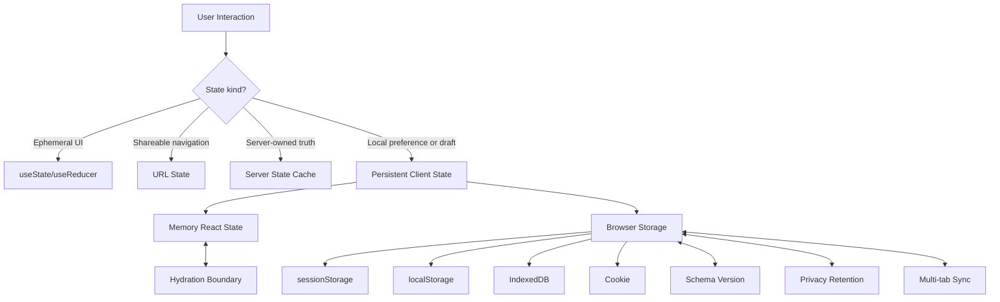

# Part 053 — Session and Persistent Client State

Persistent client state adalah state yang tetap ada setelah render selesai, component unmount, tab reload, atau browser dibuka kembali.

Tapi kalimat itu mudah menipu.

Bukan semua state yang ingin “tidak hilang” layak disimpan di browser. Browser storage bukan database domain. Browser storage bukan authorization boundary. Browser storage bukan server truth. Browser storage juga bukan React state.

Persistent client state adalah **cache lokal untuk preferensi, draft, dan pengalaman pengguna**, dengan lifecycle yang harus eksplisit.

Part ini membahas cara mendesain persistent state seperti engineer production: apa yang boleh disimpan, di mana disimpan, kapan dibaca, kapan ditulis, bagaimana migrasi schema, bagaimana sync antar tab, bagaimana menghindari hydration mismatch, dan kapan persistence justru harus dihapus.

---

## 1. Mental Model



Persistent state has two layers:

```txt
React layer     : current render snapshot used to paint UI
Storage layer   : durable serialized value outside React
```

The dangerous mistake is treating them as one thing.

React state is live, typed by your code, and participates in render scheduling.

Browser storage is serialized, mutable outside React, possibly stale, possibly corrupt, and possibly unavailable depending on environment and browser policy.

A robust design always has a synchronization boundary.

---

## 2. Storage Is Not Ownership

When you put a value into `localStorage`, you have not answered the real architectural question.

You have only answered:

```txt
Where is a serialized copy stored?
```

You still must answer:

```txt
Who owns this value?
Who may mutate it?
Is it canonical or only a cache?
What invalidates it?
How long may it live?
What version is its schema?
What happens if parsing fails?
What happens in another tab?
What happens during SSR/hydration?
```

Without those answers, persistent state becomes fossilized state: old values quietly controlling new UI.

---

## 3. Storage Option Matrix

| Storage | Lifetime | Accessible from JS | Sync/Async | Best for | Avoid for |
|---|---:|---:|---:|---|---|
| React memory | Component/app lifetime | yes | render-managed | ephemeral UI, current screen state | reload survival |
| `sessionStorage` | per tab session | yes | synchronous | tab-scoped draft, temporary wizard state | cross-tab state, large data |
| `localStorage` | across browser sessions | yes | synchronous | small preferences, dismissed banners, lightweight drafts | large payloads, secrets, high-frequency writes |
| IndexedDB | persistent, origin-scoped | yes | asynchronous | larger structured data, offline queues, local documents | simple flags if Web Storage is enough |
| Cookie | request-bound depending attributes | maybe, unless `HttpOnly` | browser-managed | server-readable session metadata, server routing hints | arbitrary UI blobs |
| Server DB | durable domain truth | no direct JS access | network | canonical user/domain data | transient UI gestures |

A simple rule:

```txt
Small preference? localStorage.
Tab-only draft? sessionStorage.
Large/offline structured data? IndexedDB.
Canonical business state? server.
Secret credential? do not store in JS-accessible storage.
```

---

## 4. The Most Important Distinction: Persistence vs Canonical Truth

Persistent client state can be:

```txt
canonical client preference
cache of server data
draft not yet committed
session-local workflow state
feature behavior hint
```

Only the first category is often safe as client-owned truth.

Examples of safe-ish client-owned truth:

```txt
theme preference
table density
sidebar collapsed state
last selected local tab
editor layout preference
```

Examples that are usually not client-owned truth:

```txt
current account role
permissions
billing status
case enforcement status
approval result
server mutation result
```

The browser may remember that a button was collapsed. It must not become the authority that a user is an admin.

---

## 5. Good Persistent State Candidates

### 5.1 UI Preferences

Good candidates:

```txt
theme: light | dark | system
density: compact | comfortable
sidebarCollapsed: boolean
tableColumnOrder: string[]
```

Properties:

```txt
small
non-sensitive
user-owned
low-frequency updates
safe to default if missing
```

### 5.2 Draft State

Good candidates:

```txt
unsent comment draft
multi-step wizard draft
local note draft
search filter draft before commit
```

But draft state needs explicit retention.

```txt
Should it survive tab close?
Should it expire after 24 hours?
Should it be cleared after submit?
Should it be scoped by user id, tenant id, resource id, or route?
```

A draft key like this is dangerous:

```txt
draft:comment
```

A safer key is scoped:

```txt
app:v2:tenant:{tenantId}:user:{userId}:case:{caseId}:comment-draft
```

### 5.3 Dismissed UI

Good candidates:

```txt
dismissed onboarding banner
dismissed release note
dismissed migration warning
```

But the key must include the semantic version of the content:

```txt
dismissed:release-note:2026-07-state-redesign
```

Not:

```txt
dismissedReleaseNote
```

### 5.4 Offline Queue

This is possible, but it is no longer a simple persistent state problem.

An offline queue needs:

```txt
idempotency key
retry policy
conflict resolution
visibility to the user
encryption/privacy policy if sensitive
server reconciliation
```

For serious offline workflows, treat IndexedDB + service worker + server idempotency as a subsystem, not a hook snippet.

---

## 6. Dangerous Persistent State Candidates

### 6.1 Permissions and Roles

Do not use JS-accessible persistent state as authority for permissions.

Bad:

```ts
const isAdmin = localStorage.getItem('role') === 'admin';
```

Slightly less bad but still not authoritative:

```ts
const cachedCapabilities = readCachedCapabilities();
```

Better mental model:

```txt
Client permission state may improve UX.
Server permission checks enforce truth.
```

The UI may hide a button optimistically, but the server must reject unauthorized commands.

### 6.2 Tokens and Secrets

Avoid storing sensitive credentials in `localStorage` or `sessionStorage` when possible because any script running in the origin can read JS-accessible storage. If an attacker obtains script execution through XSS, those values are exposed.

This is not a React issue. It is a browser security boundary issue.

### 6.3 High-Frequency State

Bad candidates:

```txt
mouse position
scroll position updated every frame
input value persisted on every keystroke without debounce
animation state
large editor document on every character
```

Web Storage APIs are synchronous. Heavy read/write operations can block the main thread.

Use batching, debounce, idle callback, or IndexedDB depending on payload and frequency.

---

## 7. Naming Keys Like an Engineer

A storage key is a public internal API.

Treat it like a schema contract.

Bad:

```txt
filters
settings
draft
user
```

Better:

```txt
acme-app:v3:user:{userId}:table:{tableId}:columns
acme-app:v2:tenant:{tenantId}:case:{caseId}:comment-draft
acme-app:v1:ui:theme
```

Key design dimensions:

| Dimension | Question |
|---|---|
| App namespace | Could another app on same origin collide? |
| Schema version | Can old values be migrated or ignored? |
| User scope | Will user A see user B's stored data on shared device? |
| Tenant scope | Does tenant context change meaning? |
| Resource scope | Is draft tied to case/order/project id? |
| Feature scope | Which subsystem owns this value? |

A storage key should tell a future engineer what state it owns.

---

## 8. The Naive Hook

You will see this everywhere:

```ts
function useLocalStorageState<T>(key: string, initialValue: T) {
  const [value, setValue] = React.useState<T>(() => {
    const raw = window.localStorage.getItem(key);
    return raw == null ? initialValue : JSON.parse(raw);
  });

  React.useEffect(() => {
    window.localStorage.setItem(key, JSON.stringify(value));
  }, [key, value]);

  return [value, setValue] as const;
}
```

It works for a demo.

In production, it has issues:

```txt
breaks on server because window is unavailable
throws if JSON is corrupt
has no schema validation
has no migration
writes after every value change
has no expiration
has no cross-tab synchronization
can hydrate differently from server markup
does not handle storage quota/security errors
```

Do not start and end here.

---

## 9. Safer Persistent State Envelope

Store an envelope, not a naked value.

```ts
type PersistedEnvelope<T> = {
  version: number;
  createdAt: string;
  updatedAt: string;
  expiresAt?: string;
  value: T;
};
```

Why?

Because storage is long-lived. Your code is not.

You need metadata to answer:

```txt
Can this value still be trusted?
Can this schema still be read?
Should this value be deleted?
When was it last written?
```

Example read function:

```ts
type DecodeResult<T> =
  | { ok: true; value: T }
  | { ok: false; reason: 'missing' | 'expired' | 'invalid-json' | 'invalid-schema' | 'unsupported-version' };

function decodeEnvelope<T>(
  raw: string | null,
  options: {
    version: number;
    validate: (value: unknown) => value is T;
    migrate?: (envelope: PersistedEnvelope<unknown>) => PersistedEnvelope<T> | null;
    now?: () => Date;
  }
): DecodeResult<T> {
  if (raw == null) return { ok: false, reason: 'missing' };

  let parsed: unknown;
  try {
    parsed = JSON.parse(raw);
  } catch {
    return { ok: false, reason: 'invalid-json' };
  }

  if (!isEnvelope(parsed)) {
    return { ok: false, reason: 'invalid-schema' };
  }

  const envelope = parsed as PersistedEnvelope<unknown>;
  const now = options.now?.() ?? new Date();

  if (envelope.expiresAt && new Date(envelope.expiresAt) <= now) {
    return { ok: false, reason: 'expired' };
  }

  if (envelope.version !== options.version) {
    const migrated = options.migrate?.(envelope);
    if (!migrated) return { ok: false, reason: 'unsupported-version' };
    if (!options.validate(migrated.value)) return { ok: false, reason: 'invalid-schema' };
    return { ok: true, value: migrated.value };
  }

  if (!options.validate(envelope.value)) {
    return { ok: false, reason: 'invalid-schema' };
  }

  return { ok: true, value: envelope.value };
}

function isEnvelope(value: unknown): value is PersistedEnvelope<unknown> {
  if (typeof value !== 'object' || value === null) return false;
  const record = value as Record<string, unknown>;
  return (
    typeof record.version === 'number' &&
    typeof record.createdAt === 'string' &&
    typeof record.updatedAt === 'string' &&
    'value' in record
  );
}
```

This looks boring. That is the point.

Persistent state should be boring because the cost of corruption is paid later by users.

---

## 10. A Production-Grade `usePersistentState`

This hook handles:

```txt
SSR-safe initialization
parse failure
schema validation
version envelope
debounced persistence
storage write errors
reset
```

```ts
type PersistentStateOptions<T> = {
  key: string;
  version: number;
  initialValue: T | (() => T);
  validate: (value: unknown) => value is T;
  storage?: Storage;
  debounceMs?: number;
  expiresInMs?: number;
  onDecodeError?: (reason: string) => void;
  onWriteError?: (error: unknown) => void;
};

function resolveInitial<T>(value: T | (() => T)): T {
  return typeof value === 'function' ? (value as () => T)() : value;
}

function createEnvelope<T>(
  value: T,
  version: number,
  expiresInMs?: number
): PersistedEnvelope<T> {
  const now = new Date();
  return {
    version,
    createdAt: now.toISOString(),
    updatedAt: now.toISOString(),
    expiresAt: expiresInMs ? new Date(now.getTime() + expiresInMs).toISOString() : undefined,
    value,
  };
}

export function usePersistentState<T>(options: PersistentStateOptions<T>) {
  const {
    key,
    version,
    initialValue,
    validate,
    debounceMs = 150,
    expiresInMs,
    onDecodeError,
    onWriteError,
  } = options;

  const storage = options.storage ?? (typeof window !== 'undefined' ? window.localStorage : undefined);

  const [state, setState] = React.useState<T>(() => {
    const fallback = resolveInitial(initialValue);
    if (!storage) return fallback;

    const decoded = decodeEnvelope(storage.getItem(key), { version, validate });
    if (!decoded.ok) {
      if (decoded.reason !== 'missing') onDecodeError?.(decoded.reason);
      return fallback;
    }

    return decoded.value;
  });

  const reset = React.useCallback(() => {
    setState(resolveInitial(initialValue));
    try {
      storage?.removeItem(key);
    } catch (error) {
      onWriteError?.(error);
    }
  }, [initialValue, key, onWriteError, storage]);

  React.useEffect(() => {
    if (!storage) return;

    const timer = window.setTimeout(() => {
      try {
        storage.setItem(
          key,
          JSON.stringify(createEnvelope(state, version, expiresInMs))
        );
      } catch (error) {
        onWriteError?.(error);
      }
    }, debounceMs);

    return () => window.clearTimeout(timer);
  }, [debounceMs, expiresInMs, key, onWriteError, state, storage, version]);

  return [state, setState, reset] as const;
}
```

This is still not universal. It is a baseline.

For high-frequency, large, multi-tab, transactional, or offline data, move to a real external store + IndexedDB abstraction.

---

## 11. Hydration and SSR

The browser has `localStorage`. The server does not.

That sounds obvious until a component renders different HTML on server and client.

Bad pattern:

```tsx
function ThemeLabel() {
  const theme = window.localStorage.getItem('theme') ?? 'light';
  return <span>{theme}</span>;
}
```

This can fail in SSR because `window` is unavailable. It can also cause mismatch if the server renders one value and the client immediately renders another.

Better patterns depend on the value.

### 11.1 Non-Critical Preference

Render stable fallback first, then hydrate client value.

```tsx
function ThemeLabel() {
  const [theme, setTheme] = React.useState<'light' | 'dark' | null>(null);

  React.useEffect(() => {
    const raw = window.localStorage.getItem('app:v1:theme');
    setTheme(raw === 'dark' ? 'dark' : 'light');
  }, []);

  if (theme === null) return null;
  return <span>{theme}</span>;
}
```

This avoids server/client disagreement at the cost of delayed UI.

### 11.2 Critical Visual Preference

For theme, delayed UI may cause flash.

A common production pattern:

```txt
store preference in localStorage
run a tiny inline script before React loads
set html class/data-theme immediately
let React adopt the already-applied theme
```

This is not “React state first”. It is document bootstrapping.

### 11.3 External Store with Server Snapshot

For browser-backed external state, `useSyncExternalStore` can provide a server snapshot and a client snapshot.

```ts
function createStorageStore<T>(options: {
  key: string;
  defaultValue: T;
  parse: (raw: string | null) => T;
  serialize: (value: T) => string;
}) {
  return {
    getSnapshot() {
      return options.parse(window.localStorage.getItem(options.key));
    },
    getServerSnapshot() {
      return options.defaultValue;
    },
    subscribe(listener: () => void) {
      const onStorage = (event: StorageEvent) => {
        if (event.key === options.key) listener();
      };
      window.addEventListener('storage', onStorage);
      return () => window.removeEventListener('storage', onStorage);
    },
    set(value: T) {
      window.localStorage.setItem(options.key, options.serialize(value));
      window.dispatchEvent(new StorageEvent('storage', { key: options.key }));
    },
  };
}
```

Important nuance: the native `storage` event fires in other documents, not reliably in the same document that performed the write. If the current tab needs immediate notification, dispatch your own event or call subscribers directly.

---

## 12. Multi-Tab State

Persistent storage is shared per origin. Your UI may be open in multiple tabs.

This creates questions:

```txt
If user changes theme in tab A, should tab B update?
If user logs out in tab A, should tab B react?
If draft changes in tab A, should tab B overwrite local draft?
```

Different state needs different policy.

| State | Multi-tab policy |
|---|---|
| Theme | sync immediately |
| Logout/session invalidation | sync immediately |
| Table density | sync eventually |
| Form draft | do not blindly overwrite active tab |
| Offline command queue | coordinate carefully |

A simple storage event listener is enough for low-risk values.

```ts
React.useEffect(() => {
  function handleStorage(event: StorageEvent) {
    if (event.key !== key) return;
    setState(readValueFromStorage());
  }

  window.addEventListener('storage', handleStorage);
  return () => window.removeEventListener('storage', handleStorage);
}, [key]);
```

For richer communication, consider `BroadcastChannel`.

```ts
const channel = new BroadcastChannel('app-state');
channel.postMessage({ type: 'theme/changed', value: 'dark' });
```

But do not confuse multi-tab messaging with state ownership. Messaging only tells other tabs something happened.

---

## 13. Expiration and Retention

Persistent state without retention policy is a memory leak in user space.

Drafts should expire.

Feature flags should refresh.

Dismissed warnings should be versioned.

Sensitive UI state should be cleared on logout.

Example retention policy:

| Data | Retention |
|---|---:|
| Theme | indefinite until user changes |
| Table columns | indefinite per user/table version |
| Comment draft | 7 days or after submit |
| Search filters | until user clears or route changes |
| Onboarding dismiss | until onboarding version changes |
| Tenant-scoped preference | clear when tenant access removed |

Do not store old state forever because it was convenient.

---

## 14. Logout and Account Switching

Browser storage is origin-scoped, not user-scoped.

If the app supports login/logout, shared devices, impersonation, tenant switching, or multiple accounts, you need explicit clearing/scoping.

Bad:

```txt
app:v1:case-search-filters
```

Better:

```txt
app:v1:user:{userId}:tenant:{tenantId}:case-search-filters
```

On logout:

```ts
function clearUserScopedStorage(userId: string) {
  const prefix = `app:v1:user:${userId}:`;

  for (let i = window.localStorage.length - 1; i >= 0; i--) {
    const key = window.localStorage.key(i);
    if (key?.startsWith(prefix)) {
      window.localStorage.removeItem(key);
    }
  }
}
```

Be careful with prefix deletion. Namespacing is what makes it safe.

---

## 15. Persistent State and React Effects

Persistence is one of the valid uses of effects because you are synchronizing React state with an external system.

But the effect must be clear:

```txt
React state changed -> write serialized snapshot to storage
Storage changed externally -> update React state
```

Do not use effects to derive persistent state from other persistent state if it can be computed during render.

Bad:

```tsx
const [firstName, setFirstName] = usePersistentState('first', '');
const [lastName, setLastName] = usePersistentState('last', '');
const [fullName, setFullName] = usePersistentState('full', '');

React.useEffect(() => {
  setFullName(`${firstName} ${lastName}`);
}, [firstName, lastName]);
```

Better:

```tsx
const fullName = `${firstName} ${lastName}`;
```

Persistence does not justify duplicated state.

---

## 16. Patterns

### 16.1 Persisted Theme

```ts
type Theme = 'light' | 'dark' | 'system';

function isTheme(value: unknown): value is Theme {
  return value === 'light' || value === 'dark' || value === 'system';
}

function useThemePreference() {
  return usePersistentState<Theme>({
    key: 'learn-react:v1:ui:theme',
    version: 1,
    initialValue: 'system',
    validate: isTheme,
  });
}
```

### 16.2 Persisted Table Layout

```ts
type TableLayout = {
  columnOrder: string[];
  hiddenColumns: string[];
  density: 'compact' | 'comfortable';
};

function tableLayoutKey(userId: string, tableId: string) {
  return `learn-react:v2:user:${userId}:table:${tableId}:layout`;
}
```

Table layout is user-scoped and table-scoped. It is not global.

### 16.3 Persisted Draft with Resource Scope

```ts
type CommentDraft = {
  body: string;
  attachments: Array<{ localId: string; name: string }>;
};

function commentDraftKey(userId: string, caseId: string) {
  return `learn-react:v1:user:${userId}:case:${caseId}:comment-draft`;
}
```

After successful submit:

```ts
resetDraft();
```

Do not let submitted drafts resurrect after navigation.

---

## 17. Persistent Query Cache Is Different

Server state persistence is not the same as client preference persistence.

For example, persisting a query cache needs:

```txt
query key compatibility
cache age
stale time
garbage collection
mutation invalidation
schema drift
network reconciliation
```

Do not manually copy API responses into `localStorage` unless you are intentionally building a cache subsystem.

If using a server-state library, prefer its persistence mechanism because it understands cache metadata better than a generic `useLocalStorage` hook.

---

## 18. Failure Modes

### 18.1 Fossilized State

Symptom:

```txt
A feature changed, but old users see broken UI because old storage values still load.
```

Cause:

```txt
No versioning, migration, or invalidation.
```

Fix:

```txt
Use namespaced versioned keys or envelope version migration.
```

### 18.2 Hydration Mismatch

Symptom:

```txt
Server renders default UI, client immediately renders stored value, React warns or flickers.
```

Fix:

```txt
Use stable server fallback, client-only hydration, cookie/bootstrap script, or useSyncExternalStore server snapshot.
```

### 18.3 Storage as Permission Authority

Symptom:

```txt
User can modify storage and unlock UI behavior.
```

Fix:

```txt
Treat client permission state as UX hint only. Enforce on server.
```

### 18.4 Cross-User Leakage

Symptom:

```txt
User B sees User A's filters, drafts, or layout on shared device.
```

Fix:

```txt
Scope keys by user/tenant or clear on logout.
```

### 18.5 Main Thread Blocking

Symptom:

```txt
Typing becomes janky after adding persistence.
```

Cause:

```txt
Large synchronous JSON serialization on every keystroke.
```

Fix:

```txt
Debounce, batch, move large data to IndexedDB, avoid high-frequency writes.
```

### 18.6 Corrupt JSON Crash

Symptom:

```txt
App crashes on startup for one user.
```

Cause:

```txt
JSON.parse throws during lazy initializer.
```

Fix:

```txt
Safe decode with fallback and storage cleanup.
```

### 18.7 Multi-Tab Lost Update

Symptom:

```txt
Two tabs edit same draft and one silently overwrites the other.
```

Fix:

```txt
Add updatedAt, conflict detection, active-tab warning, or avoid cross-tab draft sharing.
```

---

## 19. Testing Persistent State

Test these behaviors:

```txt
missing value uses fallback
valid value loads
invalid JSON falls back
invalid schema falls back
expired value falls back and optionally clears
version migration works
write error does not crash UI
reset removes storage
logout clears user-scoped keys
storage event updates subscriber
same-tab update notifies local subscriber
```

Example unit test shape:

```ts
it('falls back when storage contains invalid json', () => {
  localStorage.setItem('app:v1:theme', '{');

  const result = decodeEnvelope(localStorage.getItem('app:v1:theme'), {
    version: 1,
    validate: isTheme,
  });

  expect(result).toEqual({ ok: false, reason: 'invalid-json' });
});
```

Testing persistence is not optional. Bugs often appear only after weeks of real user storage history.

---

## 20. Decision Checklist

Before persisting state, answer:

```txt
Is this value safe to store in JS-accessible browser storage?
Is it client-owned, server-owned, or only a draft?
What is the retention policy?
What key namespace scopes it?
Does it need user/tenant/resource scoping?
What is the schema version?
What happens if the value is missing?
What happens if it is corrupt?
What happens if it is old?
What happens across tabs?
What happens during SSR/hydration?
What happens on logout?
What is the performance cost of serialization?
```

If the team cannot answer these, the state is not ready to be persisted.

---

## 21. Summary

Persistent client state is useful when it preserves user intent across time.

It is dangerous when it silently becomes domain truth.

The production-grade mental model:

```txt
React state is the render snapshot.
Browser storage is a serialized external system.
Persistence is synchronization.
Stored data needs namespace, schema, retention, validation, and invalidation.
Security-sensitive and server-owned data must not rely on JS-accessible storage as authority.
```

The next part moves from persistence to **normalized client state**: how to represent entity graphs so updates stay consistent when the same domain object appears in many places at once.
