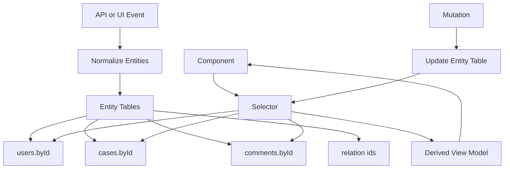

# Part 054 — Normalized Client State

Normalized client state is how you stop the same entity from existing in five different shapes across the UI.

A React application becomes hard to reason about when the same `user`, `case`, `invoice`, `task`, or `comment` appears in many screens and each screen owns a slightly different copy.

At small scale, nested state feels natural.

At production scale, nested duplication becomes a consistency trap.

This part explains normalized client state from first principles: when to normalize, when not to, how to model entities and relationships, how to write reducers, how to derive views through selectors, how to handle optimistic IDs, and how to avoid turning normalized state into a second backend.

---

## 1. The Problem: Duplicated Entity Copies

Imagine this client state:

```ts
type AppState = {
  dashboard: {
    recentCases: Array<{
      id: string;
      title: string;
      status: 'open' | 'closed';
      assignee: { id: string; name: string };
    }>;
  };
  caseDetail: {
    case: {
      id: string;
      title: string;
      status: 'open' | 'closed';
      assignee: { id: string; name: string };
      comments: Array<{
        id: string;
        body: string;
        author: { id: string; name: string };
      }>;
    };
  };
};
```

This shape mirrors UI and API responses.

It also creates duplication:

```txt
case appears in dashboard and detail
user appears as assignee and comment author
status appears in multiple views
user name appears in multiple nested objects
```

When `case.status` changes, which copy is correct?

When `user.name` changes, which nested user gets updated?

When one mutation fails, which copy rolls back?

The problem is not syntax. The problem is **multiple sources of truth**.

---

## 2. Mental Model



Normalized state separates:

```txt
storage model  : canonical entity records and relation references
view model     : denormalized shape needed by a component
```

The UI should not manually assemble entities everywhere. Selectors do that.

---

## 3. What Normalization Means

Normalization means representing entity data like tables:

```ts
type EntityState<T extends { id: string }> = {
  ids: string[];
  entities: Record<string, T>;
};
```

Example:

```ts
type User = {
  id: string;
  name: string;
};

type Case = {
  id: string;
  title: string;
  status: 'open' | 'closed';
  assigneeId: string | null;
  commentIds: string[];
};

type Comment = {
  id: string;
  caseId: string;
  authorId: string;
  body: string;
};

type ClientState = {
  users: EntityState<User>;
  cases: EntityState<Case>;
  comments: EntityState<Comment>;
};
```

Nested objects become references:

```txt
assignee -> assigneeId
comments -> commentIds
author -> authorId
```

This creates one place to update each entity.

---

## 4. When to Normalize

Normalize when:

```txt
the same entity appears in multiple places
updates must remain consistent across views
relationships matter
lists and details share records
optimistic updates touch entity records
many components need different projections of the same data
```

Examples:

```txt
case management UI
task board
chat messages with users/reactions
notification center
approval workflow dashboard
enterprise resource editor
local offline queue with related objects
```

Do not normalize by default for tiny isolated state.

Bad normalization candidate:

```ts
type LoginFormState = {
  email: string;
  password: string;
  rememberMe: boolean;
};
```

This is local form state. Keep it local.

---

## 5. Normalization Is Not Always the Right Tool

Normalized state adds indirection.

You pay with:

```txt
more reducer logic
more selectors
relation integrity rules
harder debugging if abstractions are poor
more migration effort
```

Use it when consistency is more valuable than simple nested rendering.

A good heuristic:

```txt
If update logic must find and patch the same object in multiple nested places, normalize.
If data is rendered once and discarded, do not normalize.
```

---

## 6. Server State vs Normalized Client State

This distinction matters.

Server state belongs to the server. Libraries like TanStack Query often cache server responses by query key. You usually do not need to manually normalize every server response into a global client store.

Normalize client state when the client is actively maintaining an entity graph:

```txt
local workflow editing graph
optimistic entity updates across many screens
offline-capable domain subset
complex UI state keyed by entity id
Redux-style app state with cross-view consistency requirements
```

Use query cache when:

```txt
data is fetched and invalidated by server queries
views can refetch or invalidate query keys
server is canonical truth
```

Use normalized client store when:

```txt
client needs entity-level consistency before server confirmation
multiple UI workflows compose same local entity records
updates are event-driven within the app
```

Do not blindly put all API responses into Redux because “normalization is good”. That was a common older architecture. Modern React apps often keep server cache in a server-state library and reserve normalized client state for client-owned or workflow-owned entity graphs.

---

## 7. Entity Table Shape

The common shape:

```ts
type EntityTable<T> = {
  ids: string[];
  entities: Record<string, T>;
};
```

Why both `ids` and `entities`?

```txt
entities gives O(1) lookup by id
ids preserves ordering or known membership
```

Example:

```ts
const users = {
  ids: ['u1', 'u2'],
  entities: {
    u1: { id: 'u1', name: 'Ari' },
    u2: { id: 'u2', name: 'Bela' },
  },
};
```

Invariant:

```txt
Every id in ids must exist in entities.
No duplicate ids.
Every entity.id should match its map key.
```

---

## 8. Relationship Modeling

### 8.1 One-to-One

```ts
type Profile = {
  id: string;
  userId: string;
  bio: string;
};

type User = {
  id: string;
  profileId: string | null;
};
```

### 8.2 One-to-Many

```ts
type Case = {
  id: string;
  commentIds: string[];
};

type Comment = {
  id: string;
  caseId: string;
  body: string;
};
```

You can store the relation on parent, child, or both.

If stored both, you must maintain consistency.

### 8.3 Many-to-Many

Use a join entity.

```ts
type UserGroupMembership = {
  id: string;
  userId: string;
  groupId: string;
  role: 'member' | 'owner';
};
```

Do not hide many-to-many relationships inside arrays on both sides unless the domain is tiny.

---

## 9. Reducer Operations

Start with small table utilities.

```ts
type Entity = { id: string };

type EntityTable<T extends Entity> = {
  ids: string[];
  entities: Record<string, T>;
};

function createEmptyTable<T extends Entity>(): EntityTable<T> {
  return { ids: [], entities: {} };
}

function upsertOne<T extends Entity>(table: EntityTable<T>, entity: T): EntityTable<T> {
  const exists = entity.id in table.entities;

  return {
    ids: exists ? table.ids : [...table.ids, entity.id],
    entities: {
      ...table.entities,
      [entity.id]: entity,
    },
  };
}

function updateOne<T extends Entity>(
  table: EntityTable<T>,
  id: string,
  patch: Partial<T>
): EntityTable<T> {
  const current = table.entities[id];
  if (!current) return table;

  return {
    ids: table.ids,
    entities: {
      ...table.entities,
      [id]: { ...current, ...patch },
    },
  };
}

function removeOne<T extends Entity>(table: EntityTable<T>, id: string): EntityTable<T> {
  if (!(id in table.entities)) return table;

  const { [id]: _removed, ...rest } = table.entities;

  return {
    ids: table.ids.filter((existingId) => existingId !== id),
    entities: rest,
  };
}
```

In production, you may use Redux Toolkit `createEntityAdapter`, but building the primitives once makes the invariants visible.

---

## 10. Example: Case Reducer

```ts
type CaseStatus = 'open' | 'investigating' | 'resolved' | 'closed';

type CaseRecord = {
  id: string;
  title: string;
  status: CaseStatus;
  assigneeId: string | null;
  commentIds: string[];
};

type CommentRecord = {
  id: string;
  caseId: string;
  authorId: string;
  body: string;
  createdAt: string;
};

type CaseState = {
  cases: EntityTable<CaseRecord>;
  comments: EntityTable<CommentRecord>;
};

type CaseEvent =
  | { type: 'case/received'; case: CaseRecord; comments: CommentRecord[] }
  | { type: 'case/statusChanged'; caseId: string; status: CaseStatus }
  | { type: 'comment/added'; comment: CommentRecord }
  | { type: 'comment/removed'; commentId: string };

function caseReducer(state: CaseState, event: CaseEvent): CaseState {
  switch (event.type) {
    case 'case/received': {
      let comments = state.comments;
      for (const comment of event.comments) {
        comments = upsertOne(comments, comment);
      }

      return {
        cases: upsertOne(state.cases, {
          ...event.case,
          commentIds: event.comments.map((comment) => comment.id),
        }),
        comments,
      };
    }

    case 'case/statusChanged': {
      return {
        ...state,
        cases: updateOne(state.cases, event.caseId, { status: event.status }),
      };
    }

    case 'comment/added': {
      const currentCase = state.cases.entities[event.comment.caseId];
      if (!currentCase) return state;

      return {
        cases: updateOne(state.cases, currentCase.id, {
          commentIds: [...currentCase.commentIds, event.comment.id],
        }),
        comments: upsertOne(state.comments, event.comment),
      };
    }

    case 'comment/removed': {
      const comment = state.comments.entities[event.commentId];
      if (!comment) return state;

      const currentCase = state.cases.entities[comment.caseId];

      return {
        cases: currentCase
          ? updateOne(state.cases, currentCase.id, {
              commentIds: currentCase.commentIds.filter((id) => id !== event.commentId),
            })
          : state.cases,
        comments: removeOne(state.comments, event.commentId),
      };
    }
  }
}
```

Notice the reducer maintains relation integrity.

Removing a comment also updates the owning case's `commentIds`.

That is the cost of normalized state: relationship maintenance becomes explicit.

---

## 11. Selectors: Denormalize at the Edge

Components usually do not want raw tables.

They want view models.

```ts
type CaseDetailView = {
  id: string;
  title: string;
  status: CaseStatus;
  assignee: User | null;
  comments: Array<CommentRecord & { author: User | null }>;
};
```

Selector:

```ts
function selectCaseDetail(state: RootState, caseId: string): CaseDetailView | null {
  const caseRecord = state.cases.entities[caseId];
  if (!caseRecord) return null;

  const assignee = caseRecord.assigneeId
    ? state.users.entities[caseRecord.assigneeId] ?? null
    : null;

  const comments = caseRecord.commentIds
    .map((commentId) => state.comments.entities[commentId])
    .filter(Boolean)
    .map((comment) => ({
      ...comment,
      author: state.users.entities[comment.authorId] ?? null,
    }));

  return {
    ...caseRecord,
    assignee,
    comments,
  };
}
```

Rule:

```txt
Normalize in storage.
Denormalize in selectors.
Render view models.
```

Do not denormalize inside every component by hand.

---

## 12. Selector Stability

A naive selector may allocate new arrays/objects every time.

```ts
const comments = caseRecord.commentIds.map((id) => state.comments.entities[id]);
```

This can cause memoized children to rerender because array identity changes.

Options:

```txt
Accept it if cheap.
Memoize expensive selectors.
Use per-entity selectors.
Use library selector memoization.
Keep render performance measured, not guessed.
```

Do not prematurely memoize every selector. Normalize for consistency first. Optimize only when profiling shows a cost.

---

## 13. Sorted and Filtered Lists

Do not blindly store every sorted list as state.

Canonical table:

```ts
cases.entities
cases.ids
```

Derived list:

```ts
function selectOpenCasesSortedByUpdatedAt(state: RootState) {
  return state.cases.ids
    .map((id) => state.cases.entities[id])
    .filter((item) => item.status === 'open')
    .sort((a, b) => b.updatedAt.localeCompare(a.updatedAt));
}
```

But if a list is server-owned, query-owned, or manually ordered by user, storing membership/order may be valid.

Examples:

```txt
Kanban column card order: store ids per column
Search result page: often query cache owns result ids
User-defined table column order: persistent preference owns order
```

Question to ask:

```txt
Is this order intrinsic domain state, server result state, or derived UI projection?
```

---

## 14. Indexes

Sometimes `ids` is not enough.

You may need indexes:

```ts
type CaseIndexes = {
  byAssigneeId: Record<string, string[]>;
  byStatus: Record<CaseStatus, string[]>;
};
```

Indexes speed reads but increase write complexity.

Invariant:

```txt
Every index must be updated whenever indexed fields change.
```

If that is too risky, derive indexes in memoized selectors instead.

Use stored indexes when:

```txt
read path is hot
entity count is large
updates are controlled through reducer utilities
index correctness is tested
```

Do not store indexes casually.

---

## 15. Partial Entities

API responses often provide partial data.

List endpoint:

```ts
type CaseListItem = {
  id: string;
  title: string;
  status: CaseStatus;
};
```

Detail endpoint:

```ts
type CaseDetail = {
  id: string;
  title: string;
  status: CaseStatus;
  description: string;
  auditTrail: AuditEntry[];
};
```

If both write into the same entity table, you need a partial-data policy.

Options:

### 15.1 Separate Entity Types

```ts
type CaseSummary = { id: string; title: string; status: CaseStatus };
type CaseDetailRecord = CaseSummary & { description: string };
```

### 15.2 Entity Completeness Metadata

```ts
type CaseRecord = {
  id: string;
  title?: string;
  status?: CaseStatus;
  description?: string;
  loadedFields: Array<'summary' | 'detail'>;
};
```

### 15.3 Query Cache Owns Partial Server Shapes

Often simplest with server-state libraries.

Do not merge partial entities if you cannot define correctness.

The bug looks like this:

```txt
Detail page loads full entity.
List page later loads partial entity.
Partial upsert overwrites full entity and loses fields.
```

---

## 16. Optimistic IDs

Optimistic creation needs temporary client IDs.

```ts
const tempId = `temp:${crypto.randomUUID()}`;
```

Temporary record:

```ts
const optimisticComment: CommentRecord = {
  id: tempId,
  caseId,
  authorId: currentUserId,
  body,
  createdAt: new Date().toISOString(),
};
```

When server confirms:

```ts
type Event =
  | { type: 'comment/createStarted'; comment: CommentRecord }
  | { type: 'comment/createConfirmed'; tempId: string; serverComment: CommentRecord }
  | { type: 'comment/createRejected'; tempId: string; reason: string };
```

Confirmation must replace IDs in all relations.

```ts
function replaceCommentIdInCase(
  caseRecord: CaseRecord,
  tempId: string,
  serverId: string
): CaseRecord {
  return {
    ...caseRecord,
    commentIds: caseRecord.commentIds.map((id) => (id === tempId ? serverId : id)),
  };
}
```

Failure mode:

```txt
server entity is inserted but temp id remains in relation array
```

Result:

```txt
duplicate comment, broken lookup, or ghost UI row
```

---

## 17. Normalized State with Redux Toolkit

Redux Toolkit's `createEntityAdapter` formalizes the common `ids` + `entities` pattern and provides CRUD reducers/selectors.

Example shape:

```ts
import { createEntityAdapter, createSlice } from '@reduxjs/toolkit';

type User = {
  id: string;
  name: string;
};

const usersAdapter = createEntityAdapter<User>({
  sortComparer: (a, b) => a.name.localeCompare(b.name),
});

const usersSlice = createSlice({
  name: 'users',
  initialState: usersAdapter.getInitialState(),
  reducers: {
    userUpserted: usersAdapter.upsertOne,
    usersReceived: usersAdapter.setAll,
    userRemoved: usersAdapter.removeOne,
  },
});
```

Adapter utilities are useful because they centralize update semantics.

But they do not model your domain invariants automatically.

If removing a user should unassign cases, you still need domain-specific reducer logic.

---

## 18. Normalization and React Component Design

A component should rarely know the whole normalized graph.

Bad:

```tsx
function CaseDetail({ cases, users, comments, caseId }: Props) {
  // manually stitches graph
}
```

Better:

```tsx
function CaseDetailRoute({ caseId }: { caseId: string }) {
  const detail = useCaseDetail(caseId);
  if (!detail) return <NotFound />;
  return <CaseDetailView detail={detail} />;
}
```

Boundary:

```txt
hook/container reads normalized state
selector creates view model
presentational component renders view model
```

This keeps normalized state from leaking into every component.

---

## 19. Updating Normalized State from UI Commands

Do not let components patch entities arbitrarily.

Bad:

```tsx
onClick={() => dispatch({ type: 'patch', entity: 'case', id, patch: { status: 'closed' } })}
```

Better:

```tsx
onClick={() => dispatch({ type: 'case/closeRequested', caseId: id })}
```

The reducer or command handler should decide whether transition is valid.

```ts
function closeCase(state: CaseState, caseId: string): CaseState {
  const current = state.cases.entities[caseId];
  if (!current) return state;

  if (current.status === 'resolved') {
    return {
      ...state,
      cases: updateOne(state.cases, caseId, { status: 'closed' }),
    };
  }

  return state;
}
```

Normalized storage does not replace domain transition rules.

---

## 20. Deletion Semantics

Deletion is harder than it looks.

Options:

```txt
hard delete
soft delete
tombstone
archive
visibility filter
```

Hard delete example:

```ts
comments = removeOne(comments, commentId);
case.commentIds = case.commentIds.filter((id) => id !== commentId);
```

Tombstone example:

```ts
type CommentRecord = {
  id: string;
  body: string;
  deletedAt: string | null;
};
```

Use tombstone when:

```txt
optimistic delete may be rolled back
audit trail needs deleted item
collaborative UI needs conflict handling
server can reference deleted entity later
```

---

## 21. Invariants

Normalized state is valuable only if invariants hold.

Core invariants:

```txt
ids has no duplicates
entities contains every id listed in ids
entity.id matches key
relations point to existing entities or explicitly allow missing refs
ordered relation arrays contain no duplicates unless duplicates are domain-valid
indexes match entity fields
temp ids are replaced everywhere after confirmation
deleted entities are removed from all owning relations unless tombstoned
```

Write invariant tests.

```ts
function assertEntityTable<T extends { id: string }>(table: EntityTable<T>) {
  const uniqueIds = new Set(table.ids);

  if (uniqueIds.size !== table.ids.length) {
    throw new Error('Duplicate ids');
  }

  for (const id of table.ids) {
    const entity = table.entities[id];
    if (!entity) throw new Error(`Missing entity for id ${id}`);
    if (entity.id !== id) throw new Error(`Entity id mismatch for ${id}`);
  }
}
```

In a regulated workflow UI, invariant tests are not just nice. They support explainability.

---

## 22. Failure Modes

### 22.1 Normalized State as a Second Backend

Symptom:

```txt
Client store has complex business rules, migrations, cache invalidation, and reconciliation that duplicate backend behavior.
```

Fix:

```txt
Move canonical truth back to server. Keep client normalized state for workflow/session needs only.
```

### 22.2 Partial Entity Overwrite

Symptom:

```txt
Full detail fields disappear after list refresh.
```

Cause:

```txt
Partial entity response replaced full entity.
```

Fix:

```txt
Define merge policy, completeness metadata, or separate query cache shapes.
```

### 22.3 Orphan Relations

Symptom:

```txt
UI maps relation id to undefined and crashes.
```

Cause:

```txt
Entity deleted but relation array not updated.
```

Fix:

```txt
Centralize delete operations and assert relation invariants.
```

### 22.4 Selector Explosion

Symptom:

```txt
Every component has custom graph stitching logic.
```

Fix:

```txt
Create domain selectors and view-model hooks.
```

### 22.5 Over-Normalization

Symptom:

```txt
Simple local UI state requires entity adapters, selectors, and relation tables.
```

Fix:

```txt
Keep local state local. Normalize only when entity consistency is real.
```

### 22.6 Hidden Mutation

Symptom:

```txt
UI does not rerender or selectors behave inconsistently.
```

Cause:

```txt
Nested entity mutated in place.
```

Fix:

```txt
Use immutable updates, Immer through Redux Toolkit, or tested reducer utilities.
```

---

## 23. Testing Normalized State

Test reducers at transition level:

```txt
case received inserts case and comments
comment added inserts comment and updates case.commentIds
comment removed deletes comment and removes relation
case status transition rejects illegal transition
optimistic temp id is replaced everywhere
partial entity update does not erase full fields
```

Example:

```ts
it('removes comment relation when comment is removed', () => {
  const next = caseReducer(initialStateWithComment, {
    type: 'comment/removed',
    commentId: 'c1',
  });

  expect(next.comments.entities.c1).toBeUndefined();
  expect(next.cases.entities.case1.commentIds).not.toContain('c1');
});
```

Test selectors separately:

```txt
missing relation returns null-safe view
comments preserve expected order
selector produces expected denormalized model
```

---

## 24. Decision Checklist

Before normalizing, answer:

```txt
Which entities exist?
What is each entity's stable id?
Which relationships exist?
Which relationships own ordering?
Which data is server-owned vs client-owned?
Can partial responses overwrite full entities?
What are the deletion semantics?
What are optimistic temp-id semantics?
Which selectors define view models?
Which invariants must always hold?
Where are invariant tests?
```

If the team cannot answer these, normalization may add complexity without correctness.

---

## 25. Summary

Normalized client state solves a specific problem: entity consistency across many UI views and transitions.

It is not a default replacement for local state, URL state, or server-state cache.

The production-grade mental model:

```txt
Store entities once.
Store relationships as ids.
Update through domain events or commands.
Denormalize through selectors.
Render view models.
Test invariants.
Avoid duplicating backend truth in the client.
```

The next part moves from normalized representation to **state invariants**: how to define illegal states, transition guards, and consistency rules before bugs become UI behavior.
