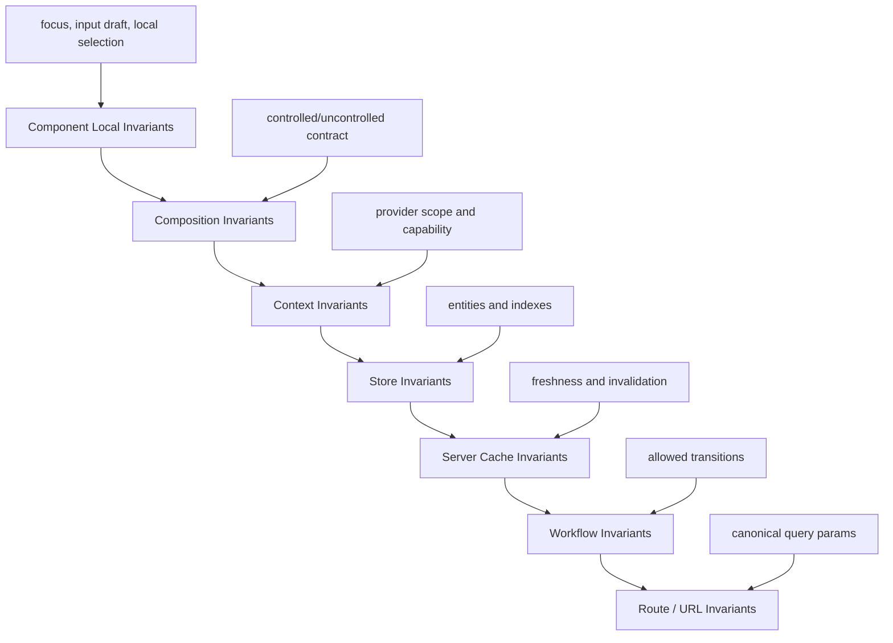
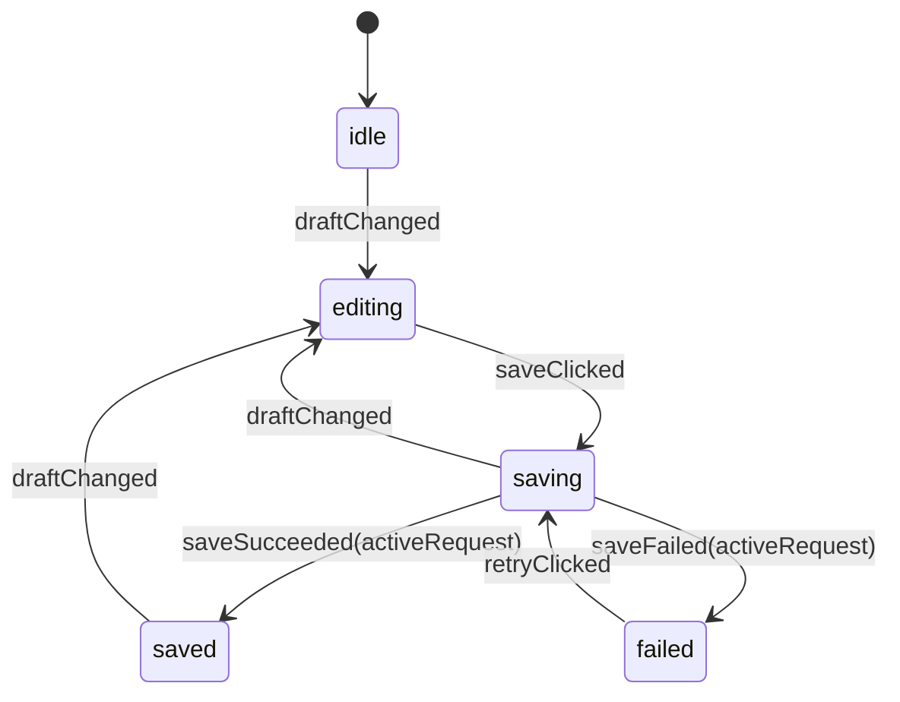

# Part 055 — State Invariants

A state invariant is a rule that must always be true for a piece of UI state to be valid.

Most React bugs are not caused by `useState` itself.

They are caused by state shapes that allow impossible combinations.

```txt
isLoading = true
error = "Network failed"
data = {...}
selectedId = "case-123"
entities["case-123"] = undefined
step = "review"
validation.status = "idle"
modal.open = false
modal.payload = {...}
```

Each individual value may look reasonable.

The combination is wrong.

A senior React engineer does not only ask:

```txt
How do I update this state?
```

They ask:

```txt
What states are legal?
What states are impossible?
Which transitions may move between them?
Which component owns those transitions?
Which tests prove those invariants?
```

This part is about building React UI state as a small correctness system.

---

## 1. What Is a State Invariant?

An invariant is a condition that must stay true before and after every transition.

Examples:

```txt
A selected item id must exist in the entity map.
A closed modal must not keep stale payload.
A submitting form cannot be edited unless editing is explicitly allowed.
A successful request must have data and no error.
An optimistic entity must have a client temp id until confirmed.
A wizard cannot enter review step before required fields are valid.
Only one accordion item can be open in single-select mode.
A dialog stack top item is the only item that receives Escape key close.
```

In React, an invariant usually spans:

```txt
state shape
component identity
props contract
context value
external store snapshot
server cache data
URL parameters
pending async work
```

A bug appears when a transition mutates one part of that graph but forgets another.

---

## 2. State Without Invariants Becomes Boolean Soup

A common async shape:

```ts
const [isLoading, setIsLoading] = useState(false);
const [error, setError] = useState<string | null>(null);
const [data, setData] = useState<CaseDetail | null>(null);
```

This allows combinations that should not exist:

```txt
isLoading=true, error!=null, data!=null
isLoading=false, error=null, data=null
isLoading=true, error!=null, data=null
```

Maybe some are legal.

Maybe not.

The problem is that the shape does not say.

Better:

```ts
type CaseDetailState =
  | { tag: 'idle' }
  | { tag: 'loading' }
  | { tag: 'success'; data: CaseDetail }
  | { tag: 'failure'; error: ErrorInfo };
```

Now impossible combinations are unrepresentable.

```txt
success requires data
failure requires error
loading cannot also have stale error unless explicitly modeled
idle cannot accidentally contain payload
```

The strongest invariant is the one your state shape makes impossible to violate.

---

## 3. The Core Rule: Model the State Machine, Not the Widgets

Weak state design mirrors widgets:

```txt
isDialogOpen
isSubmitting
isConfirming
isDirty
isValid
errorMessage
selectedId
```

Strong state design models the domain interaction:

```ts
type DeleteCaseFlow =
  | { tag: 'idle' }
  | { tag: 'confirming'; caseId: CaseId }
  | { tag: 'submitting'; caseId: CaseId; requestId: string }
  | { tag: 'failed'; caseId: CaseId; error: ErrorInfo }
  | { tag: 'completed'; caseId: CaseId };
```

The UI then follows the state.

```txt
confirming -> dialog is open
submitting -> confirm button disabled
failed -> dialog stays open with error
completed -> dialog closes and cache invalidates
```

The state model is not a mirror of HTML.

It is a protocol for user interaction.

---

## 4. Invariant Layers

React applications have several invariant layers.



A component can be correct locally but wrong globally.

Example:

```txt
The dropdown renders selectedId correctly.
But selectedId points to an entity removed by another store transition.
```

Invariant design must follow the ownership graph.

---

## 5. The Three Places to Enforce Invariants

There are three useful enforcement points.

| Enforcement point | Example | Strength | Cost |
|---|---|---:|---:|
| Type/state shape | discriminated union | highest | design effort |
| Transition guard | reducer rejects illegal event | high | reducer complexity |
| Runtime assertion | throw/log/report invalid state | medium | runtime overhead |

The order matters.

Prefer:

```txt
make illegal states unrepresentable
then guard illegal transitions
then assert impossible edge cases
```

Do not rely only on component rendering branches to hide invalid states.

Rendering branches detect symptoms.

State invariants prevent the disease.

---

## 6. Invariants as First-Class Design Artifacts

For every non-trivial state, write invariants before implementation.

Example: case assignment panel.

```txt
State owner:
  AssignmentPanel

State:
  selectedAssigneeId
  eligibleAssignees
  currentAssigneeId
  submitStatus

Invariants:
  selectedAssigneeId must be null or exist in eligibleAssignees
  selectedAssigneeId may equal currentAssigneeId only when no change is pending
  submit button is enabled only when selectedAssigneeId differs from currentAssigneeId
  submitting state captures the assignee id being submitted
  response for old request cannot overwrite newer request
  currentAssigneeId updates only after confirmed success or optimistic commit
```

This looks like ceremony.

It is cheaper than debugging a production race where the UI submits assignee A but renders assignee B.

---

## 7. Bad Shape: Parallel Booleans

Parallel booleans often create invalid combinations.

```ts
type ModalState = {
  isOpen: boolean;
  isConfirming: boolean;
  isSubmitting: boolean;
  isError: boolean;
  caseId?: string;
  error?: string;
};
```

Invalid combinations:

```txt
isOpen=false and caseId exists
isSubmitting=true and caseId missing
isConfirming=true and isSubmitting=true
isError=true and error missing
isOpen=false and error visible in memory
```

Better:

```ts
type DeleteModalState =
  | { tag: 'closed' }
  | { tag: 'confirming'; caseId: string }
  | { tag: 'submitting'; caseId: string; requestId: string }
  | { tag: 'failed'; caseId: string; error: string };
```

Rendering becomes direct:

```tsx
function DeleteCaseDialog({ state, onCancel, onConfirm }: Props) {
  if (state.tag === 'closed') return null;

  return (
    <Dialog open onOpenChange={(open) => !open && onCancel()}>
      <Dialog.Title>Delete case?</Dialog.Title>

      {state.tag === 'failed' && <ErrorText>{state.error}</ErrorText>}

      <Button
        disabled={state.tag === 'submitting'}
        onClick={() => onConfirm(state.caseId)}
      >
        {state.tag === 'submitting' ? 'Deleting...' : 'Delete'}
      </Button>
    </Dialog>
  );
}
```

Notice what disappeared:

```txt
no boolean combinations
no optional payload checks scattered everywhere
no stale payload after close
no ambiguous loading+error state
```

---

## 8. Illegal States Should Be Expensive to Create

A weak type makes bad state easy:

```ts
type FormState = {
  step: 'details' | 'review' | 'submit';
  details?: Details;
  validationErrors?: Record<string, string>;
  submittedId?: string;
};
```

This allows:

```txt
step=review with no details
step=submit with validationErrors
submittedId exists while step=details
```

Make legal states explicit:

```ts
type FormState =
  | { tag: 'editingDetails'; draft: DetailsDraft; errors: FieldErrors }
  | { tag: 'reviewing'; details: ValidDetails }
  | { tag: 'submitting'; details: ValidDetails; requestId: string }
  | { tag: 'submitted'; submissionId: string };
```

The type now documents the journey.

```txt
editingDetails has draft and errors
reviewing has valid details
submitting has valid details and request identity
submitted has server submission id
```

---

## 9. Derived Invariants

Some invariants do not need stored state.

Bad:

```ts
const [items, setItems] = useState<Item[]>([]);
const [selectedId, setSelectedId] = useState<string | null>(null);
const [selectedItem, setSelectedItem] = useState<Item | null>(null);
```

Now `selectedItem` can drift from `selectedId`.

Better:

```ts
const selectedItem = selectedId
  ? items.find((item) => item.id === selectedId) ?? null
  : null;
```

Invariant:

```txt
selectedItem is always derived from selectedId and items
```

If the derivation is expensive, memoize the index or selector.

Do not duplicate truth just to avoid writing a selector.

---

## 10. Referential Invariants

When state stores identifiers, the referenced entity must exist.

```ts
type CaseState = {
  selectedCaseId: string | null;
  casesById: Record<string, CaseSummary>;
};
```

Invariant:

```ts
function assertCaseState(state: CaseState) {
  if (state.selectedCaseId && !state.casesById[state.selectedCaseId]) {
    throw new Error(`selectedCaseId does not exist: ${state.selectedCaseId}`);
  }
}
```

A reducer should maintain the invariant:

```ts
function reducer(state: CaseState, event: Event): CaseState {
  switch (event.type) {
    case 'caseSelected': {
      if (!state.casesById[event.caseId]) {
        return state; // or throw in development
      }

      return { ...state, selectedCaseId: event.caseId };
    }

    case 'caseRemoved': {
      const { [event.caseId]: removed, ...casesById } = state.casesById;

      return {
        casesById,
        selectedCaseId:
          state.selectedCaseId === event.caseId ? null : state.selectedCaseId,
      };
    }
  }
}
```

The remove transition updates both entity table and selection.

That is invariant preservation.

---

## 11. Transition Invariants

A reducer transition has two responsibilities:

```txt
accept legal events
preserve invariants in the next state
```

Example:

```ts
type UploadState =
  | { tag: 'idle' }
  | { tag: 'selecting'; file: File }
  | { tag: 'uploading'; file: File; requestId: string; progress: number }
  | { tag: 'failed'; file: File; error: string }
  | { tag: 'uploaded'; fileId: string };

type UploadEvent =
  | { type: 'fileSelected'; file: File }
  | { type: 'uploadStarted'; requestId: string }
  | { type: 'progressChanged'; requestId: string; progress: number }
  | { type: 'uploadFailed'; requestId: string; error: string }
  | { type: 'uploadSucceeded'; requestId: string; fileId: string }
  | { type: 'cancelled' };
```

Reducer:

```ts
function uploadReducer(state: UploadState, event: UploadEvent): UploadState {
  switch (event.type) {
    case 'fileSelected':
      return { tag: 'selecting', file: event.file };

    case 'uploadStarted':
      if (state.tag !== 'selecting') return state;
      return {
        tag: 'uploading',
        file: state.file,
        requestId: event.requestId,
        progress: 0,
      };

    case 'progressChanged':
      if (state.tag !== 'uploading') return state;
      if (state.requestId !== event.requestId) return state;
      return {
        ...state,
        progress: Math.max(state.progress, event.progress),
      };

    case 'uploadFailed':
      if (state.tag !== 'uploading') return state;
      if (state.requestId !== event.requestId) return state;
      return { tag: 'failed', file: state.file, error: event.error };

    case 'uploadSucceeded':
      if (state.tag !== 'uploading') return state;
      if (state.requestId !== event.requestId) return state;
      return { tag: 'uploaded', fileId: event.fileId };

    case 'cancelled':
      return { tag: 'idle' };
  }
}
```

Important invariants:

```txt
progress cannot arrive before uploadStarted
old request responses cannot overwrite current state
progress cannot go backwards
failed keeps file for retry
uploaded contains server file id, not local File object
cancel resets payload
```

---

## 12. Guard Strategy: Ignore, Throw, or Recover?

When an illegal transition happens, choose a strategy.

| Strategy | Use when | Example |
|---|---|---|
| Ignore | duplicate event or stale response is harmless | old request completes after new request |
| Throw in dev | transition should never happen | submit event during idle state |
| Recover | state can be repaired safely | selected id removed, clear selection |
| Report | invariant breach indicates serious bug | normalized relation points to missing entity |

Example helper:

```ts
function invariant(condition: boolean, message: string): asserts condition {
  if (!condition) {
    if (process.env.NODE_ENV !== 'production') {
      throw new Error(message);
    }

    console.error(message);
  }
}
```

Use runtime assertions at boundaries, not in every render path.

---

## 13. Invariants and State Snapshots

React state is a snapshot per render.

That means an event handler sees the values from the render that created it.

Weak pattern:

```ts
async function handleSave() {
  setStatus('saving');
  await saveDraft(draft);
  setStatus('saved');
  setSavedDraft(draft);
}
```

If `draft` changes while the request is pending, the handler still saves the old snapshot.

That may be fine.

But the invariant must say so.

Better:

```ts
async function handleSave() {
  const requestId = crypto.randomUUID();
  const submittedDraft = draft;

  dispatch({ type: 'saveStarted', requestId, draft: submittedDraft });

  try {
    const saved = await saveDraft(submittedDraft);
    dispatch({ type: 'saveSucceeded', requestId, saved });
  } catch (error) {
    dispatch({ type: 'saveFailed', requestId, error: toErrorInfo(error) });
  }
}
```

Reducer ignores stale responses.

```ts
case 'saveSucceeded': {
  if (state.tag !== 'saving') return state;
  if (state.requestId !== event.requestId) return state;
  return { tag: 'saved', saved: event.saved };
}
```

Invariant:

```txt
Only the active request may complete the active save state.
```

---

## 14. Invariants Around Async Work

Async UI creates temporal states.

You must model time explicitly.



This machine documents important decisions:

```txt
Can the user edit while saving?
Can a save complete after draft changed?
Does success mark the current draft saved or the submitted draft saved?
Does retry use latest draft or failed request draft?
```

Do not hide these decisions inside incidental `setState` calls.

---

## 15. Request Identity Is an Invariant Tool

Any async transition that can overlap needs identity.

```ts
type SearchState =
  | { tag: 'idle'; query: string }
  | { tag: 'loading'; query: string; requestId: string }
  | { tag: 'success'; query: string; results: SearchResult[] }
  | { tag: 'failure'; query: string; error: ErrorInfo };
```

When the user types fast:

```txt
q=a      request r1
q=ab     request r2
q=abc    request r3
r1 returns after r3
```

Without identity, r1 can overwrite r3.

With identity:

```ts
case 'searchSucceeded': {
  if (state.tag !== 'loading') return state;
  if (state.requestId !== event.requestId) return state;
  return { tag: 'success', query: state.query, results: event.results };
}
```

Invariant:

```txt
Only the latest active request may commit visible results.
```

---

## 16. Form Invariants

Forms are invariant-heavy.

Common invariants:

```txt
field error belongs to current field value
form-level validity derives from current field states
submit uses validated snapshot, not mutable current draft
server error belongs to submitted payload version
reset clears dirty/touched/errors consistently
hidden conditional fields do not submit stale values unless explicitly retained
```

Weak form state:

```ts
type FormState = {
  values: Values;
  errors: Errors;
  touched: Touched;
  isValid: boolean;
  isSubmitting: boolean;
  serverError?: string;
};
```

Better mental model:

```txt
values      = user draft
errors      = validation result for a specific values version
touched     = interaction metadata
submit      = command with values snapshot
serverError = response for submitted snapshot
```

Add versioning when needed:

```ts
type FormState = {
  values: Values;
  version: number;
  validation: {
    version: number;
    errors: Errors;
  };
  submission:
    | { tag: 'idle' }
    | { tag: 'submitting'; requestId: string; version: number; values: Values }
    | { tag: 'failed'; version: number; errors: ServerErrors }
    | { tag: 'succeeded'; id: string };
};
```

Now server errors can be invalidated if the user edits.

---

## 17. Modal Invariants

Modal bugs often come from stale payload.

Weak:

```ts
const [open, setOpen] = useState(false);
const [caseId, setCaseId] = useState<string | null>(null);
```

Better:

```ts
type ModalState =
  | { tag: 'closed' }
  | { tag: 'open'; caseId: string };
```

Invariant:

```txt
closed modal has no payload
open modal always has payload
```

For multiple modals:

```ts
type Overlay =
  | { kind: 'deleteCase'; caseId: string }
  | { kind: 'assignCase'; caseId: string }
  | { kind: 'previewDocument'; documentId: string };

type OverlayState = {
  stack: Overlay[];
};
```

Stack invariants:

```txt
Escape closes only the top overlay
focus trap belongs to top modal
background is inert if stack length > 0
body scroll lock count equals modal stack depth
```

---

## 18. Selection Invariants

Selection state usually references a collection.

Single select:

```ts
type SelectionState = {
  selectedId: string | null;
  visibleIds: string[];
};
```

Invariants:

```txt
selectedId is null or included in visibleIds
if filter removes selected item, either clear selection or preserve global selection explicitly
keyboard focus id may differ from selected id
```

Multi-select:

```ts
type SelectionState = {
  selectedIds: Set<string>;
  allIds: string[];
  visibleIds: string[];
};
```

Invariants:

```txt
selectedIds is a subset of allIds
visible selection count derives from selectedIds ∩ visibleIds
select all visible is not the same as select all global
bulk action payload must define whether it targets visible, selected, or query-matched entities
```

These are not UI details.

They are product correctness rules.

---

## 19. Normalized State Invariants

Normalized state from Part 054 depends on referential integrity.

```ts
type EntityState = {
  cases: Record<string, CaseEntity>;
  comments: Record<string, CommentEntity>;
};
```

Invariants:

```txt
every comment.caseId exists in cases
every case.commentIds item exists in comments
relationship order is stored exactly once
entity table does not contain temp and confirmed id for the same logical entity
partial response cannot erase fields unless explicitly marked as partial
```

A production reducer should preserve both entity and relation tables.

```ts
case 'commentDeleted': {
  const comments = { ...state.comments };
  delete comments[event.commentId];

  return {
    ...state,
    comments,
    cases: {
      ...state.cases,
      [event.caseId]: {
        ...state.cases[event.caseId],
        commentIds: state.cases[event.caseId].commentIds.filter(
          (id) => id !== event.commentId,
        ),
      },
    },
  };
}
```

The bug is not deleting a comment.

The bug is deleting the entity but leaving the relation.

---

## 20. URL State Invariants

URL state is public, user-editable, and shareable.

Therefore it must be parsed and canonicalized.

```ts
type SearchParamsState = {
  page: number;
  sort: 'createdAt' | 'priority';
  direction: 'asc' | 'desc';
  status: 'open' | 'closed' | 'all';
};
```

Invariants:

```txt
page >= 1
sort is one of allowed fields
direction is valid
status is valid
invalid params become canonical defaults
URL does not contain private tokens or sensitive filters
query key derives from canonical params, not raw search string
```

Do not trust raw URL params.

Treat them like input from the network.

---

## 21. Persistent State Invariants

Persistent browser state can outlive the code that wrote it.

Invariants:

```txt
stored value has schema version
stored value passes validation before use
unknown version migrates or resets
logout clears identity-bound state
sensitive state is not persisted casually
hydrated value cannot contradict server session
```

Example:

```ts
type PersistedPreferencesV2 = {
  version: 2;
  density: 'compact' | 'comfortable';
  sidebarCollapsed: boolean;
};

function parsePreferences(raw: string | null): PersistedPreferencesV2 {
  if (!raw) return defaultPreferences;

  try {
    const value = JSON.parse(raw);

    if (value.version === 2 && isValidPreferences(value)) {
      return value;
    }

    return defaultPreferences;
  } catch {
    return defaultPreferences;
  }
}
```

Persistence without validation is not state management.

It is state archaeology.

---

## 22. Context Invariants

Context carries implicit dependencies.

Important invariants:

```txt
consumer must be under provider unless optional fallback is intentional
provider value identity must be stable enough for its volatility
state context and command context may need separate providers
capability context should not expose mutable implementation details
permission context must not become security enforcement
```

Strict context hook:

```ts
function createStrictContext<T>(name: string) {
  const Context = createContext<T | null>(null);

  function useStrictContext() {
    const value = useContext(Context);

    if (value === null) {
      throw new Error(`${name} must be used within ${name}.Provider`);
    }

    return value;
  }

  return [Context.Provider, useStrictContext] as const;
}
```

Invariant:

```txt
Consumer never silently runs with fake default capability.
```

---

## 23. Component API Invariants

Reusable components must protect their public contract.

Example: controlled/uncontrolled component.

```ts
type ControllableProps<T> = {
  value?: T;
  defaultValue?: T;
  onValueChange?: (next: T) => void;
};
```

Invariants:

```txt
component is controlled if value is not undefined on first render
component should not switch controlledness after mount
controlled component does not mutate internal source of truth
uncontrolled component owns internal state
onValueChange emits intent, not guaranteed commit
```

Development guard:

```ts
function useControllednessWarning(name: string, isControlled: boolean) {
  const initial = useRef(isControlled);

  if (process.env.NODE_ENV !== 'production') {
    if (initial.current !== isControlled) {
      console.error(
        `${name} changed from ${initial.current ? 'controlled' : 'uncontrolled'} ` +
          `to ${isControlled ? 'controlled' : 'uncontrolled'}.`,
      );
    }
  }
}
```

This protects component consumers from ambiguous ownership.

---

## 24. Accessibility Invariants

Accessibility state is state.

Examples:

```txt
a dialog that is visually open must expose modal semantics
focus must move into modal and return after close
aria-expanded must match actual disclosure state
aria-controls must reference an existing controlled element
active descendant id must exist in the listbox options
selected tab must control the visible panel
error message id must be referenced by invalid field
```

A UI can appear to work while violating these invariants.

Production component libraries should test them.

---

## 25. Invariant-Driven Reducer Design

Reducer design should start from allowed transitions.

```txt
State: idle
  event: started -> loading
  event: cancelled -> idle

State: loading
  event: succeeded(active request) -> success
  event: failed(active request) -> failure
  event: cancelled -> idle

State: success
  event: refreshed -> loading
  event: reset -> idle

State: failure
  event: retry -> loading
  event: reset -> idle
```

Then implement.

```ts
function reducer(state: State, event: Event): State {
  switch (state.tag) {
    case 'idle':
      return reduceIdle(state, event);
    case 'loading':
      return reduceLoading(state, event);
    case 'success':
      return reduceSuccess(state, event);
    case 'failure':
      return reduceFailure(state, event);
  }
}
```

This organization makes illegal transitions visible.

Event-first reducers often hide state-specific logic inside large switch branches.

State-first reducers can be easier when the invariant is workflow-heavy.

---

## 26. Exhaustiveness Is an Invariant Tool

Use TypeScript exhaustiveness checks.

```ts
function assertNever(value: never): never {
  throw new Error(`Unexpected value: ${JSON.stringify(value)}`);
}

function renderContent(state: CaseDetailState) {
  switch (state.tag) {
    case 'idle':
      return <EmptyState />;
    case 'loading':
      return <Spinner />;
    case 'success':
      return <CaseView data={state.data} />;
    case 'failure':
      return <ErrorView error={state.error} />;
    default:
      return assertNever(state);
  }
}
```

When a new state is added, the compiler forces rendering decisions.

That is better than silently showing an empty screen.

---

## 27. Invariants and Effects

Effects synchronize with external systems.

They should not be used to repair bad state shape.

Bad:

```ts
useEffect(() => {
  if (!open) {
    setPayload(null);
    setError(null);
  }
}, [open]);
```

The state shape allowed `open=false` with payload and error.

Better:

```ts
type DialogState =
  | { tag: 'closed' }
  | { tag: 'open'; payload: Payload }
  | { tag: 'failed'; payload: Payload; error: string };
```

Closing is a transition:

```ts
case 'closed':
  return { tag: 'closed' };
```

Effects should synchronize with external systems, not patch internal contradictions.

---

## 28. Invariants and Memoization

Memoization does not fix invariant bugs.

If a selector returns inconsistent data, `useMemo` can cache the inconsistency.

Bad:

```ts
const selectedCase = useMemo(
  () => cases.find((item) => item.id === selectedId),
  [selectedId],
);
```

`cases` is missing from dependencies.

The memoized value can violate the invariant.

Better:

```ts
const selectedCase = useMemo(
  () => cases.find((item) => item.id === selectedId) ?? null,
  [cases, selectedId],
);
```

Invariant:

```txt
selectedCase is derived from the latest cases and selectedId snapshot
```

Correct dependencies are part of correctness, not performance decoration.

---

## 29. Invariants and React Concurrent Rendering

Concurrent rendering makes purity and invariant shape more important.

Do not mutate external state during render.

Bad:

```ts
function CaseRow({ item }: Props) {
  selectedCaseRegistry.add(item.id); // mutation during render
  return <tr>{item.title}</tr>;
}
```

Render can be started, paused, restarted, or discarded.

Mutation during render can produce state that does not correspond to committed UI.

Keep render pure:

```tsx
function CaseRow({ item, onVisible }: Props) {
  useEffect(() => {
    onVisible(item.id);
    return () => onVisible(null);
  }, [item.id, onVisible]);

  return <tr>{item.title}</tr>;
}
```

Even better, avoid this effect unless visibility genuinely synchronizes with an external system.

---

## 30. Invariant Failure Modes

| Failure mode | Symptom | Root cause | Fix |
|---|---|---|---|
| Boolean soup | impossible loading/error/data combos | parallel flags | discriminated union |
| Stale payload | closed modal reopens with old data | payload separate from open flag | tagged modal state |
| Lost selection | selected row points to deleted entity | referential invariant missing | clear or repair on delete |
| Async overwrite | old response replaces newer results | no request identity | requestId guard |
| Form error drift | error for old value remains visible | validation not versioned | tie errors to value version |
| Server cache contradiction | client copy disagrees with cache | duplicated server state | derive from cache or invalidate |
| Hidden repair effect | effect keeps syncing internal state | wrong state shape | model transition directly |
| Controlledness flip | component behavior changes after mount | ownership not fixed | dev guard + API split |
| URL invalid state | invalid page/sort crashes screen | no parser/canonicalizer | parse with defaults |
| Persistence zombie | old localStorage breaks new UI | no versioning | schema version + migration |

---

## 31. Testing Invariants

Invariant tests should focus on transitions, not DOM snapshots.

Example:

```ts
describe('case selection reducer', () => {
  it('clears selected id when selected case is removed', () => {
    const state = {
      selectedCaseId: 'c1',
      casesById: {
        c1: { id: 'c1', title: 'A' },
        c2: { id: 'c2', title: 'B' },
      },
    };

    const next = reducer(state, { type: 'caseRemoved', caseId: 'c1' });

    expect(next.selectedCaseId).toBeNull();
    expect(next.casesById.c1).toBeUndefined();
  });
});
```

Test illegal transitions:

```ts
it('ignores stale search result', () => {
  const loading = {
    tag: 'loading',
    query: 'abc',
    requestId: 'r3',
  } satisfies SearchState;

  const next = reducer(loading, {
    type: 'searchSucceeded',
    requestId: 'r1',
    results: [],
  });

  expect(next).toBe(loading);
});
```

Test property-like invariants when useful:

```ts
function expectValidSelection(state: CaseState) {
  if (state.selectedCaseId !== null) {
    expect(state.casesById[state.selectedCaseId]).toBeDefined();
  }
}
```

Then call after every transition in scenario tests.

---

## 32. Invariant Checklist

Before merging stateful UI code, answer:

```txt
What is the source of truth?
What states are legal?
What states are impossible?
Can illegal states be made unrepresentable?
Which transitions exist?
Which transitions are illegal?
What happens to dependent state when primary state changes?
Can async responses arrive out of order?
Can old closures commit stale data?
Can URL/persistence/server data violate assumptions?
Can component identity reset or preserve the wrong state?
Where are invariant tests?
What does the UI do if an invariant is breached in production?
```

If the answers are unclear, the implementation is probably not done.

---

## 33. Production Heuristics

Use these heuristics aggressively:

```txt
If two booleans cannot both be true, use a union.
If a field is only valid in one mode, put it inside that mode.
If an id references an entity, handle deletion in the same transition.
If async work can overlap, attach request identity.
If data can be derived, derive it.
If state must reset on identity change, use key intentionally.
If a prop controls ownership, warn on controlledness switch.
If a value comes from URL/storage/network, parse and validate it.
If an effect repairs state, redesign the state.
```

These are small rules.

They prevent large classes of bugs.

---

## 34. Summary

State invariants are the difference between a UI that works in the happy path and a UI that survives real product behavior.

The advanced mental model:

```txt
State is not a bag of values.
State is a set of legal configurations.
Events are not random callbacks.
Events are transition requests.
Reducers are not just update utilities.
Reducers preserve invariants.
Types are not decoration.
Types can make illegal states unrepresentable.
Effects are not repair loops.
Effects synchronize external systems.
```

The next part discusses **State Migration and Refactoring**: how to move state from local to lifted, reducer, context, URL, external store, or server-state cache without rewriting the application.
