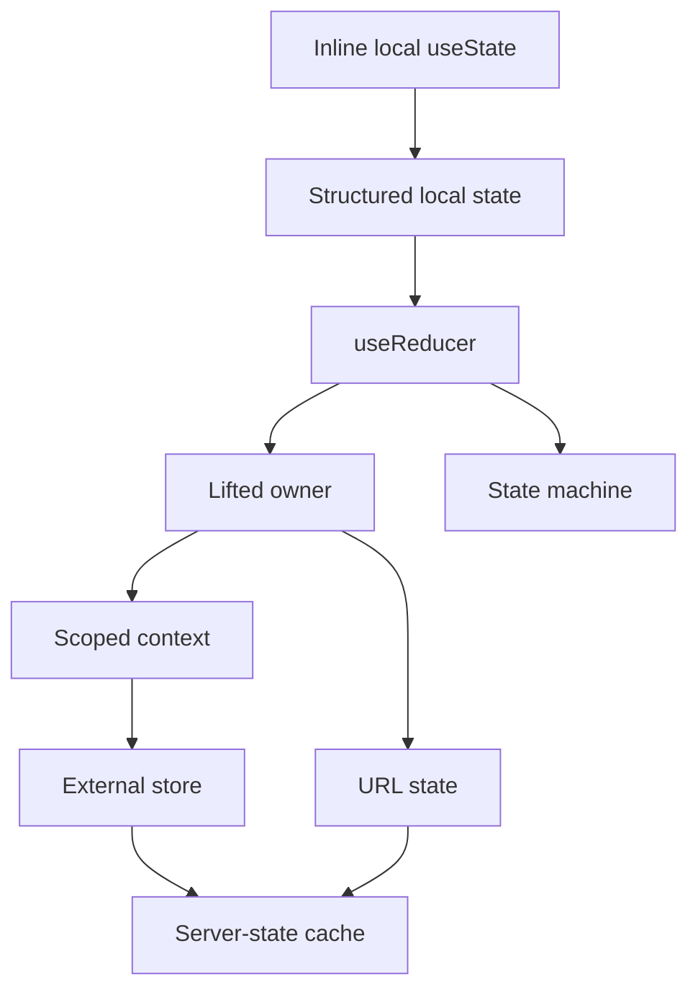

# Part 056 — State Migration and Refactoring

State migration is the art of changing state ownership without breaking behavior.

At small scale, state starts wherever it is convenient.

At production scale, convenience becomes coupling.

You eventually need to move state:

```txt
from child to parent
from parent to context
from context to external store
from effect-managed state to derived state
from duplicated client copy to server-state cache
from setter soup to reducer
from reducer to state machine
from local draft to URL state
from URL state to route-owned canonical state
```

The dangerous part is not the final architecture.

The dangerous part is the migration path.

A poor migration rewrites too much, changes behavior accidentally, and hides regressions behind new abstractions.

This part gives you a practical refactoring playbook.

---

## 1. Why State Migration Happens

State migrates when its original owner stops being correct.

Common triggers:

```txt
a child state must be observed by sibling components
local state must survive navigation
state must become shareable through URL
state must synchronize with server cache
state transition logic becomes too complex for inline setters
context causes too many rerenders
state crosses feature boundaries
workflow has illegal transitions
modal/overlay state becomes global UI capability
server data is duplicated in client state
```

Do not migrate because a library is fashionable.

Migrate because the ownership model is wrong.

---

## 2. The State Migration Ladder

Think of state migration as a ladder.



Each rung solves a different pressure.

| Migration | Solves | Does not solve |
|---|---|---|
| `useState` → structured state | duplicated flags | sharing across tree |
| setters → reducer | scattered transition logic | global sharing by itself |
| child → parent | sibling coordination | deep tree access |
| props → context | prop drilling for stable dependency | high-frequency updates |
| context → external store | granular subscription, wider scope | server freshness |
| local copy → server cache | freshness/invalidation | local workflow draft |
| reducer → state machine | illegal transitions | rendering complexity by itself |
| local → URL | shareability/navigation | private or high-frequency state |

Pick the smallest move that fixes the ownership problem.

---

## 3. Migration Principle: Preserve Behavior First

A refactor has two jobs:

```txt
preserve observable behavior
improve internal structure
```

Do not change both behavior and architecture at the same time unless you can isolate them.

Bad migration:

```txt
replace local state with Zustand
change component API
change server mutation flow
change loading behavior
change URL shape
change design system component
```

Now every bug has five possible causes.

Better:

```txt
1. add characterization tests
2. introduce new state owner behind same public API
3. migrate transitions one by one
4. delete old state after parity
5. only then change public API if needed
```

A production migration is controlled replacement, not heroic rewrite.

---

## 4. Characterization Tests Before Migration

Before moving state, capture current behavior.

Test user-visible flows:

```txt
opening and closing
default value behavior
controlled value behavior
dirty state
reset behavior
validation timing
submit lifecycle
loading/error display
selection preservation
URL synchronization
focus behavior
```

Example:

```ts
it('clears selected item when filter removes it', async () => {
  render(<CaseSearchPage />);

  await user.click(screen.getByRole('row', { name: /case 123/i }));
  await user.type(screen.getByRole('searchbox'), 'closed only');

  expect(screen.queryByText(/case 123/i)).not.toBeInTheDocument();
  expect(screen.getByText(/no case selected/i)).toBeVisible();
});
```

After migration, this test should still pass.

If behavior should change, write that decision down separately.

---

## 5. Migration: Inline Setters to Structured State

Initial shape:

```ts
const [isOpen, setIsOpen] = useState(false);
const [mode, setMode] = useState<'create' | 'edit'>('create');
const [caseId, setCaseId] = useState<string | null>(null);
```

This allows invalid combinations.

First migration: group related state.

```ts
type EditorState =
  | { tag: 'closed' }
  | { tag: 'creating' }
  | { tag: 'editing'; caseId: string };

const [editor, setEditor] = useState<EditorState>({ tag: 'closed' });
```

Replace transition sites:

```ts
function openCreate() {
  setEditor({ tag: 'creating' });
}

function openEdit(caseId: string) {
  setEditor({ tag: 'editing', caseId });
}

function closeEditor() {
  setEditor({ tag: 'closed' });
}
```

What improved:

```txt
payload exists only when needed
close clears mode/payload atomically
rendering becomes exhaustive
future reducer migration is easier
```

This is often enough.

Do not add Redux for a modal with three states.

---

## 6. Migration: Setter Soup to Reducer

When event handlers contain repeated state mutation logic, use a reducer.

Before:

```ts
function TaskList() {
  const [tasks, setTasks] = useState<Task[]>([]);
  const [selectedId, setSelectedId] = useState<string | null>(null);
  const [filter, setFilter] = useState('all');

  function deleteTask(id: string) {
    setTasks((tasks) => tasks.filter((task) => task.id !== id));
    if (selectedId === id) {
      setSelectedId(null);
    }
  }

  function completeTask(id: string) {
    setTasks((tasks) =>
      tasks.map((task) =>
        task.id === id ? { ...task, completed: true } : task,
      ),
    );
  }
}
```

Problem:

```txt
selection invariant depends on delete handler remembering to clear selectedId
more transitions will scatter more invariant logic
```

After:

```ts
type State = {
  tasks: Task[];
  selectedId: string | null;
  filter: Filter;
};

type Event =
  | { type: 'taskDeleted'; id: string }
  | { type: 'taskCompleted'; id: string }
  | { type: 'taskSelected'; id: string }
  | { type: 'filterChanged'; filter: Filter };

function reducer(state: State, event: Event): State {
  switch (event.type) {
    case 'taskDeleted':
      return {
        ...state,
        tasks: state.tasks.filter((task) => task.id !== event.id),
        selectedId: state.selectedId === event.id ? null : state.selectedId,
      };

    case 'taskCompleted':
      return {
        ...state,
        tasks: state.tasks.map((task) =>
          task.id === event.id ? { ...task, completed: true } : task,
        ),
      };

    case 'taskSelected':
      return state.tasks.some((task) => task.id === event.id)
        ? { ...state, selectedId: event.id }
        : state;

    case 'filterChanged':
      return { ...state, filter: event.filter };
  }
}
```

The reducer becomes the invariant boundary.

---

## 7. Migration: Child State to Parent Owner

Before:

```tsx
function SearchInput() {
  const [query, setQuery] = useState('');

  return <input value={query} onChange={(event) => setQuery(event.target.value)} />;
}

function CaseList() {
  return (
    <>
      <SearchInput />
      <Results />
    </>
  );
}
```

`Results` cannot see the query.

Migrate ownership to closest common parent:

```tsx
function SearchInput({ query, onQueryChange }: Props) {
  return (
    <input
      value={query}
      onChange={(event) => onQueryChange(event.target.value)}
    />
  );
}

function CaseList() {
  const [query, setQuery] = useState('');

  return (
    <>
      <SearchInput query={query} onQueryChange={setQuery} />
      <Results query={query} />
    </>
  );
}
```

This is a small migration with a big invariant:

```txt
Search input and results read the same query source of truth.
```

Do not skip straight to context.

If the closest common parent is clean, lifted state is usually better.

---

## 8. Migration: Parent State to Draft-Local / Commit-Up

Sometimes state was lifted too far.

Bad:

```tsx
function Page() {
  const [draft, setDraft] = useState(ProfileDraft>(initialDraft);

  return <ProfileEditor draft={draft} onDraftChange={setDraft} />;
}
```

Every keystroke rerenders the page and siblings.

If the parent only needs final submit, push draft ownership down.

```tsx
function Page() {
  function handleSubmit(draft: ProfileDraft) {
    return saveProfile(draft);
  }

  return <ProfileEditor initialDraft={initialDraft} onSubmit={handleSubmit} />;
}
```

Inside:

```tsx
function ProfileEditor({ initialDraft, onSubmit }: Props) {
  const [draft, setDraft] = useState(initialDraft);

  return (
    <form onSubmit={(event) => {
      event.preventDefault();
      onSubmit(draft);
    }}>
      {/* fields */}
    </form>
  );
}
```

New invariant:

```txt
Parent owns committed profile.
Editor owns in-progress draft.
```

State migration is not always upward.

Sometimes the correct move is down.

---

## 9. Migration: Prop Drilling to Scoped Context

Prop drilling is not automatically bad.

It becomes a problem when many intermediate components carry values they do not use.

Before:

```tsx
<Page currentUser={currentUser} permissions={permissions}>
  <Layout currentUser={currentUser} permissions={permissions}>
    <Toolbar currentUser={currentUser} permissions={permissions}>
      <ActionButton currentUser={currentUser} permissions={permissions} />
    </Toolbar>
  </Layout>
</Page>
```

Migrate stable, subtree-wide dependencies to context.

```tsx
const [PermissionProvider, usePermissions] = createStrictContext<PermissionApi>(
  'PermissionContext',
);

function CasePage() {
  const permissionApi = useMemo(
    () => createPermissionApi(currentUser, permissions),
    [currentUser, permissions],
  );

  return (
    <PermissionProvider value={permissionApi}>
      <CaseLayout />
    </PermissionProvider>
  );
}

function ActionButton() {
  const permissions = usePermissions();
  const canApprove = permissions.can('case.approve');

  return <Button disabled={!canApprove}>Approve</Button>;
}
```

Context is good here because:

```txt
value is subtree-scoped
many descendants need it
intermediate nodes do not
value is not high-frequency keystroke state
```

---

## 10. Migration: Context State to External Store

Context becomes painful when high-frequency updates fan out through a large tree.

Symptoms:

```txt
provider value changes often
too many consumers rerender
consumers need small slices
splitting providers becomes unwieldy
selectors would solve most rerenders
state must be read outside React boundary
```

Before:

```tsx
const DashboardContext = createContext<DashboardState | null>(null);
```

Every context value change can invalidate consumers.

External store shape:

```ts
type Store<T> = {
  getSnapshot: () => T;
  subscribe: (listener: () => void) => () => void;
  setState: (updater: (state: T) => T) => void;
};
```

Hook with selector:

```ts
function useDashboardSelector<T>(selector: (state: DashboardState) => T): T {
  return useSyncExternalStore(
    dashboardStore.subscribe,
    () => selector(dashboardStore.getSnapshot()),
    () => selector(dashboardStore.getSnapshot()),
  );
}
```

Real production code should include selector equality handling.

Migration path:

```txt
1. keep provider API stable
2. put store instance in provider
3. replace context value state with store object
4. migrate consumers from useContextState to useSelector
5. delete broad context reads
```

The external store is not better by default.

It is better when subscription granularity matters.

---

## 11. Migration: Client Copy to Server-State Cache

A common anti-pattern:

```ts
const [cases, setCases] = useState<CaseSummary[]>([]);

useEffect(() => {
  fetchCases().then(setCases);
}, []);
```

This local copy now owns server data accidentally.

Problems:

```txt
no cache key
no invalidation policy
duplicate fetches across screens
manual race handling
manual refetch
stale data after mutation
```

Migration direction:

```tsx
function CaseListPage() {
  const query = useCaseSearchParams();
  const casesQuery = useCasesQuery(query);

  if (casesQuery.isLoading) return <Spinner />;
  if (casesQuery.isError) return <ErrorView error={casesQuery.error} />;

  return <CaseTable rows={casesQuery.data.items} />;
}
```

State ownership changes:

```txt
server owns case data
query cache owns freshness and invalidation
component owns view state and local selection
URL owns search params
mutation owns submit lifecycle
```

Do not keep `cases` in local state unless it is truly a local draft.

---

## 12. Migration: Effect-Derived State to Render-Derived State

Before:

```ts
const [fullName, setFullName] = useState('');

useEffect(() => {
  setFullName(`${firstName} ${lastName}`);
}, [firstName, lastName]);
```

This causes extra render and duplicate truth.

After:

```ts
const fullName = `${firstName} ${lastName}`;
```

For expensive derivation:

```ts
const filteredRows = useMemo(
  () => filterRows(rows, filters),
  [rows, filters],
);
```

Migration rule:

```txt
If state can be calculated from current props/state during render, remove stored copy.
```

Effects synchronize external systems.

They are not derivation engines.

---

## 13. Migration: Local State to URL State

Move state to URL when it should be shareable, bookmarkable, or navigation-aware.

Good candidates:

```txt
search query
filters
sort
page
selected tab if it represents route-level view
expanded panel if deep-linking matters
```

Bad candidates:

```txt
password input
keystroke draft before submit
open tooltip
hover state
private sensitive filters
high-frequency drag position
```

Before:

```ts
const [page, setPage] = useState(1);
const [status, setStatus] = useState<'all' | 'open' | 'closed'>('all');
```

After:

```ts
function useCaseListParams() {
  const [searchParams, setSearchParams] = useSearchParams();

  const params = parseCaseListParams(searchParams);

  function updateParams(patch: Partial<CaseListParams>) {
    setSearchParams(serializeCaseListParams({ ...params, ...patch }));
  }

  return [params, updateParams] as const;
}
```

Important invariant:

```txt
Components use parsed canonical params, never raw search params.
```

---

## 14. Migration: URL State to Local Draft + Commit

Sometimes URL state is too eager.

Bad:

```txt
every keystroke updates URL
every URL update triggers query
typing feels laggy
back button contains every character
```

Migration:

```txt
input draft stays local
submitted query commits to URL
server query derives from URL
```

Example:

```tsx
function SearchBox({ committedQuery, onCommit }: Props) {
  const [draft, setDraft] = useState(committedQuery);

  useEffect(() => {
    setDraft(committedQuery);
  }, [committedQuery]);

  return (
    <form onSubmit={(event) => {
      event.preventDefault();
      onCommit(draft);
    }}>
      <input value={draft} onChange={(event) => setDraft(event.target.value)} />
      <button>Search</button>
    </form>
  );
}
```

This effect is valid because local draft synchronizes to external route state when the committed identity changes.

Be explicit about the invariant:

```txt
URL owns committed query.
Input owns editable draft.
Draft resets when committed query changes due to navigation.
```

---

## 15. Migration: Reducer to State Machine

A reducer is enough until workflow complexity starts hiding illegal transitions.

Signals:

```txt
many states and events
transition guards spread across branches
async invoked work depends on state
entry/exit behavior matters
parallel states exist
retry/cancel/undo behavior is subtle
team needs visual transition map
```

Reducer:

```ts
function reducer(state: State, event: Event): State {
  // many branches, many guards
}
```

Machine config:

```ts
const approvalMachine = createMachine({
  initial: 'draft',
  states: {
    draft: {
      on: { SUBMIT: 'submitting' },
    },
    submitting: {
      on: {
        SUCCESS: 'pendingApproval',
        FAILURE: 'failed',
      },
    },
    pendingApproval: {
      on: {
        APPROVE: 'approved',
        REJECT: 'rejected',
      },
    },
    failed: {
      on: { RETRY: 'submitting' },
    },
    approved: {},
    rejected: {},
  },
});
```

The migration is justified when the workflow itself is the product.

---

## 16. Migration: Global Store Back to Local State

Not all migrations go outward.

Sometimes teams over-globalize.

Symptoms:

```txt
store contains modal open flags for one component
store contains local form drafts
store contains hover state
store contains temporary animation state
store contains state that never leaves one feature
```

Move it back.

Before:

```ts
const isTooltipOpen = useUiStore((state) => state.tooltips[id]?.open);
const openTooltip = useUiStore((state) => state.openTooltip);
```

After:

```ts
function TooltipTrigger() {
  const [open, setOpen] = useState(false);
  return <Tooltip open={open} onOpenChange={setOpen} />;
}
```

Benefit:

```txt
less global coupling
less test setup
less accidental persistence
smaller store surface
clearer ownership
```

A good architecture deletes abstractions as often as it adds them.

---

## 17. Compatibility Adapter Pattern

During migration, keep old public API while changing internals.

Example: old hook API.

```ts
function useCaseSelectionOld() {
  const { selectedId, setSelectedId } = useContext(CaseContext);
  return { selectedId, setSelectedId };
}
```

New external store hook:

```ts
function useCaseSelectionNew() {
  const selectedId = useCaseStore((state) => state.selectedId);
  const selectCase = useCaseStore((state) => state.selectCase);
  return { selectedId, selectCase };
}
```

Adapter:

```ts
function useCaseSelection() {
  const { selectedId, selectCase } = useCaseSelectionNew();

  return {
    selectedId,
    setSelectedId: selectCase,
  };
}
```

Then migrate call sites gradually:

```txt
old: setSelectedId(id)
new: selectCase(id)
```

This avoids a giant flag-day refactor.

---

## 18. Strangler Fig State Migration

For large screens, use a strangler pattern.

```txt
old state remains source of truth
new module mirrors a small slice
new module takes ownership of one transition
old transition is deleted
repeat
```

Example plan:

```txt
Week 1: add reducer for selection only
Week 2: move filter state to URL parser
Week 3: move data fetching to query cache
Week 4: move modal flow to local state machine
Week 5: delete legacy page reducer branches
```

Do not migrate every state dimension at once.

State dimensions often have different correct owners.

---

## 19. Refactoring State by Ownership Dimension

Break a screen into ownership dimensions.

Example: complex case search page.

```txt
query text draft       -> SearchBox local state
committed query        -> URL state
results data           -> server-state cache
selected case id       -> page local/lifted state or URL if deep-linkable
bulk selection         -> page reducer
modal workflow         -> local reducer/state machine
permissions            -> capability context
layout density         -> design system context/persistence
```

This is better than asking:

```txt
Should I use Redux or Zustand for this page?
```

The correct answer may be:

```txt
none for draft
URL for filters
query cache for results
reducer for bulk selection
context for permissions
local reducer for modal
```

One screen can legitimately use multiple state owners.

The invariant is that each state has exactly one owner.

---

## 20. Refactor Recipe: Duplicated State to Derived State

Symptoms:

```txt
two values must always match
useEffect keeps them synchronized
bugs appear when one updates without the other
```

Before:

```ts
const [items, setItems] = useState<Item[]>([]);
const [activeItem, setActiveItem] = useState<Item | null>(null);
```

After:

```ts
const [items, setItems] = useState<Item[]>([]);
const [activeItemId, setActiveItemId] = useState<string | null>(null);

const activeItem = activeItemId
  ? items.find((item) => item.id === activeItemId) ?? null
  : null;
```

Migration steps:

```txt
1. introduce id state next to old object state
2. derive object from id and collection
3. replace reads of old object with derived value
4. replace writes with id transition
5. delete old object state
6. add invariant test for deleted active item
```

---

## 21. Refactor Recipe: Context Dump to Focused Providers

Before:

```ts
type AppContextValue = {
  currentUser: User;
  theme: Theme;
  permissions: Permission[];
  notifications: Notification[];
  selectedCaseId: string | null;
  setSelectedCaseId: (id: string | null) => void;
  openModal: (modal: ModalConfig) => void;
};
```

This context mixes unrelated volatility and ownership.

After:

```txt
AuthContext          -> current authenticated principal
ThemeContext         -> design system tokens
PermissionContext    -> capability checks
NotificationStore    -> external/server state
CaseSelectionContext -> scoped page selection
OverlayProvider      -> modal capability
```

Migration steps:

```txt
1. create new focused provider
2. populate from old context initially
3. migrate consumers to new hook
4. measure rerender impact
5. remove field from AppContext
6. repeat per responsibility
```

Do not split blindly.

Split by ownership and volatility.

---

## 22. Refactor Recipe: Local Fetch Effect to Query Hook

Before:

```ts
function CaseDetail({ caseId }: Props) {
  const [state, setState] = useState<State>({ tag: 'loading' });

  useEffect(() => {
    let ignore = false;

    setState({ tag: 'loading' });

    fetchCase(caseId)
      .then((data) => {
        if (!ignore) setState({ tag: 'success', data });
      })
      .catch((error) => {
        if (!ignore) setState({ tag: 'failure', error });
      });

    return () => {
      ignore = true;
    };
  }, [caseId]);

  // render
}
```

After:

```ts
function useCaseDetail(caseId: string) {
  return useQuery({
    queryKey: ['case', caseId],
    queryFn: () => fetchCase(caseId),
  });
}
```

Component:

```tsx
function CaseDetail({ caseId }: Props) {
  const caseQuery = useCaseDetail(caseId);

  if (caseQuery.isLoading) return <Spinner />;
  if (caseQuery.isError) return <ErrorView error={caseQuery.error} />;

  return <CaseView data={caseQuery.data} />;
}
```

Migration benefit:

```txt
cache key replaces ad hoc identity
query library handles observer lifecycle
mutation invalidation has a target
duplicate screens can share cached data
```

Keep local state for UI-specific draft and selection.

Do not put everything into the query cache.

---

## 23. Refactor Recipe: Global Modal State to Overlay Service

Before:

```ts
type UiStore = {
  deleteCaseModalOpen: boolean;
  deleteCaseId: string | null;
  assignCaseModalOpen: boolean;
  assignCaseId: string | null;
};
```

This scales poorly.

After:

```ts
type OverlayRequest =
  | { kind: 'deleteCase'; caseId: string }
  | { kind: 'assignCase'; caseId: string }
  | { kind: 'previewDocument'; documentId: string };

type OverlayApi = {
  open: (request: OverlayRequest) => void;
  closeTop: (reason: CloseReason) => void;
};
```

Migration steps:

```txt
1. introduce OverlayProvider
2. map old modal state to overlay stack internally
3. expose openDeleteCase(caseId) adapter
4. migrate call sites to overlay.open({kind, payload})
5. delete per-modal booleans
6. add focus/escape/backdrop tests
```

The invariant becomes:

```txt
each open overlay has kind and payload
closed overlay has no stale payload
stack order defines focus and close behavior
```

---

## 24. Refactor Recipe: Store State to Server Cache + Local UI State

Before:

```ts
type CaseStore = {
  cases: CaseSummary[];
  selectedCaseId: string | null;
  fetchCases: () => Promise<void>;
  updateCaseStatus: (id: string, status: Status) => Promise<void>;
};
```

This store mixes server state and UI state.

After:

```txt
cases data           -> query cache
case mutation        -> mutation hook
selectedCaseId       -> page state or URL state
bulk selection       -> reducer/external store if needed
```

Component:

```tsx
function CasePage() {
  const params = useCaseListParams();
  const casesQuery = useCasesQuery(params);
  const [selectedCaseId, setSelectedCaseId] = useState<string | null>(null);

  return (
    <CaseTable
      rows={casesQuery.data?.items ?? []}
      selectedId={selectedCaseId}
      onSelectedIdChange={setSelectedCaseId}
    />
  );
}
```

Do not keep server data in a general-purpose client store unless you have a clear cache policy.

---

## 25. Feature-Flagged Migration

For risky state migrations, use a feature flag.

```tsx
function CasePage() {
  const flags = useFeatureFlags();

  return flags.enabled('casePage.newStateModel')
    ? <CasePageV2 />
    : <CasePageLegacy />;
}
```

This is useful when:

```txt
screen is high-value
behavior is complex
QA needs side-by-side comparison
rollback must be quick
migration changes URL/cache/workflow semantics
```

But feature flags have cost:

```txt
duplicate code paths
divergent behavior
extra test matrix
flag cleanup risk
```

Use flags for high-risk migrations, then delete them.

---

## 26. Incremental Migration with Facades

A facade hides ownership changes from consumers.

```ts
type CaseListModel = {
  rows: CaseRowModel[];
  selectedId: string | null;
  selectCase: (id: string) => void;
  refresh: () => void;
};

function useCaseListModel(): CaseListModel {
  // internals can migrate without changing component contract
}
```

Consumers:

```tsx
function CaseListScreen() {
  const model = useCaseListModel();
  return <CaseListView {...model} />;
}
```

You can move internals:

```txt
local fetch -> query cache
local selection -> URL
inline setters -> reducer
context -> external store
```

The view contract remains stable.

This is one of the safest enterprise React patterns.

---

## 27. Migration Risk Matrix

| Migration | Regression risk | Main risk | Main mitigation |
|---|---:|---|---|
| local setters → reducer | low-medium | event semantics change | reducer transition tests |
| child state → parent | medium | rerender blast radius | memoization/profiling |
| parent draft → child local | medium | reset behavior changes | identity/key tests |
| props → context | medium | hidden dependency | strict context + provider tests |
| context → external store | medium-high | stale snapshots/selectors | subscription tests |
| effect fetch → query cache | high | cache/invalidation semantics | integration tests + query key review |
| local → URL | high | navigation/back behavior | router tests |
| reducer → state machine | high | transition semantics | machine model tests |
| global → local | medium | lost cross-component dependency | dependency audit |

A migration plan should name the risks before code changes start.

---

## 28. Detecting Wrong State Ownership

Use these symptoms.

```txt
Many components update the same state from different places.
A child needs to notify distant siblings.
An effect exists only to copy prop into state.
A context value contains unrelated fields.
A global store contains state used by one component.
A server response is manually copied into multiple stores.
A URL param and local state represent the same filter.
A reducer has impossible state combinations.
A component reset bug is fixed by random key changes.
```

Each symptom maps to a migration.

| Symptom | Likely migration |
|---|---|
| siblings need same value | lift state |
| deep dependency, low volatility | context |
| high-frequency shared updates | external store |
| duplicated server data | query cache |
| shareable filters | URL state |
| setter logic scattered | reducer |
| illegal workflow transitions | state machine |
| local-only temporary state in global store | move local |

---

## 29. Avoiding Big-Bang Store Migration

A bad migration:

```txt
Move entire app state to one store.
```

This creates:

```txt
unclear ownership
large blast radius
weak encapsulation
hard tests
unnecessary subscriptions
hard rollback
```

Better:

```txt
migrate one state dimension at a time
preserve public component contracts
keep old and new paths temporarily only where needed
measure rerenders after each migration
delete compatibility adapters quickly
```

The goal is not to centralize state.

The goal is to put each state in its correct home.

---

## 30. Migration and Component Identity

State migration can change remount behavior.

Before:

```tsx
function Page({ caseId }: Props) {
  return <CaseEditor caseId={caseId} />;
}
```

If `CaseEditor` owns draft state, navigating from case A to case B may preserve draft unexpectedly depending on position and keys.

Migration:

```tsx
function Page({ caseId }: Props) {
  return <CaseEditor key={caseId} caseId={caseId} />;
}
```

Invariant:

```txt
Editor draft resets when case identity changes.
```

But do not use keys blindly.

A key reset deletes all local state below it.

Review:

```txt
Should focus reset?
Should unsaved draft reset?
Should scroll reset?
Should child query observers remount?
Should animations restart?
```

Identity is part of the state migration plan.

---

## 31. Migration and Effects

Effects often hide state ownership bugs.

Before:

```ts
const [selectedId, setSelectedId] = useState(props.selectedId);

useEffect(() => {
  setSelectedId(props.selectedId);
}, [props.selectedId]);
```

Ask:

```txt
Is this component controlled?
Is selectedId a local draft initialized from prop?
Should prop changes reset draft?
Should local edits commit upward?
```

Possible migrations:

Controlled:

```tsx
<Selector value={selectedId} onValueChange={setSelectedId} />
```

Uncontrolled with reset by identity:

```tsx
<Selector key={recordId} defaultValue={initialSelectedId} />
```

Draft/commit:

```tsx
<Selector initialValue={selectedId} onCommit={setSelectedId} />
```

Do not keep sync effect until the ownership question is answered.

---

## 32. Migration and Performance

Changing ownership changes render blast radius.

When lifting state:

```txt
more ancestors and siblings may rerender
callbacks may change identity
memoized children may be invalidated
context provider value may change more often
```

Mitigations:

```txt
lift only committed state, not keystroke draft
split read model and command callbacks
memoize expensive child boundaries only after profiling
use context only for low/medium volatility values
use external store for granular high-frequency shared state
```

Performance is not the first design criterion.

Correct ownership is.

But a migration that makes every keystroke rerender a huge page is not production-grade.

---

## 33. Migration and Testing Strategy

Use layered tests.

Reducer migration:

```txt
transition tests
illegal event tests
invariant tests
```

Context migration:

```txt
provider harness tests
consumer tests under missing provider
override provider tests
rerender-sensitive tests if needed
```

URL migration:

```txt
parse invalid params
serialize canonical params
navigation/back button behavior
query key derivation
```

Server cache migration:

```txt
loading/error/success states
query key stability
mutation invalidation
optimistic rollback
stale data behavior
```

Workflow migration:

```txt
state transition table tests
async success/failure from each state
cancel/retry/undo semantics
```

Do not rely only on screenshots.

State migrations need transition tests.

---

## 34. Migration Checklist

Before migration:

```txt
What is the current owner?
Why is it wrong?
What is the new owner?
What behavior must remain unchanged?
What behavior intentionally changes?
Which invariants must hold?
Which tests capture current behavior?
What is the rollback strategy?
How will old state be deleted?
```

During migration:

```txt
migrate one dimension at a time
keep public APIs stable where possible
use adapters for incremental rollout
avoid mixing behavior change with ownership change
measure render impact
write transition tests
```

After migration:

```txt
delete compatibility code
delete old state fields
remove dead effects
update documentation/ADR
review provider/store boundaries
review invariants again
```

A migration is incomplete until the old model is deleted.

---

## 35. Common Migration Failure Modes

| Failure mode | What happens | Prevention |
|---|---|---|
| Big-bang rewrite | too many regressions | migrate one state dimension |
| Dual source of truth | old/new state disagree | adapter with single canonical owner |
| Forgotten reset semantics | draft persists incorrectly | identity/key tests |
| Over-contextualization | hidden dependencies | scoped strict providers |
| Store dumping | everything becomes global | ownership review |
| Cache confusion | server data duplicated | query cache as canonical server state |
| URL drift | local and URL params differ | parser/serializer boundary |
| Effect repair loop | effects patch contradictions | redesign state shape |
| Adapter never removed | permanent complexity | cleanup ticket and deadline |
| Behavior change hidden as refactor | product regressions | explicit migration notes |

---

## 36. ADR Template for State Migration

Use an Architecture Decision Record for meaningful migrations.

```md
# ADR: Move Case Search Filters from Local State to URL State

## Context
Filters currently live in CaseSearchPage local state. Users cannot share filtered views, and browser back does not restore search state.

## Decision
Move committed filters to URL search params. Keep text input draft local until submit/debounce commit.

## State Ownership
- Draft query: SearchBox local state
- Committed filters: URL search params
- Results: query cache keyed by canonical filters
- Selected case: page local state

## Invariants
- Components read parsed canonical params, not raw URLSearchParams.
- Invalid params fall back to defaults and are canonicalized.
- Query cache key derives from canonical params.
- Sensitive filters are not stored in URL.

## Migration Plan
1. Add parse/serialize functions.
2. Add tests for invalid/canonical params.
3. Replace local committed filter state with URL hook.
4. Update query key.
5. Remove legacy local filter state.

## Rollback
Feature flag can switch page to legacy local state for one release.
```

This is not bureaucracy.

It is how you prevent state ownership from becoming folklore.

---

## 37. Summary

State migration is not about moving code to a new library.

It is about correcting ownership.

The production-grade mental model:

```txt
State starts local.
Move it only when ownership pressure appears.
Preserve behavior before changing architecture.
Migrate one state dimension at a time.
Use adapters to avoid flag-day rewrites.
Use reducers for transition logic.
Use context for scoped dependencies.
Use external stores for granular shared client state.
Use server-state cache for server-owned data.
Use URL for shareable navigation state.
Use state machines for workflow correctness.
Move state back local when it was globalized unnecessarily.
Delete the old model after migration.
```

The next part closes Module 5 with a **State Management Decision Matrix**: a practical framework for choosing the right state location and tool by lifecycle, owner, volatility, sharing, persistence, and correctness requirements.
