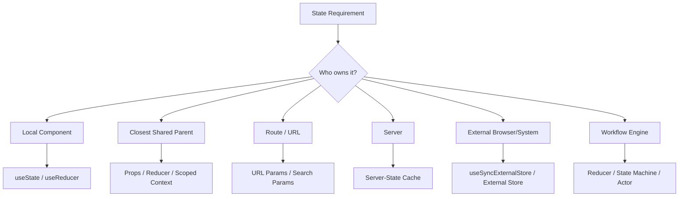
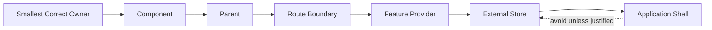
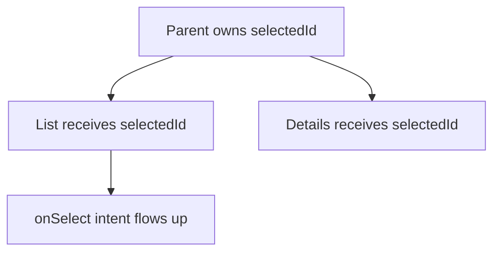
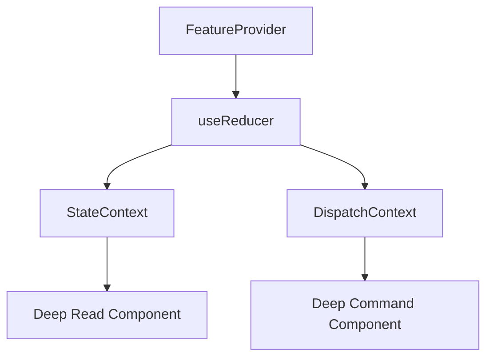
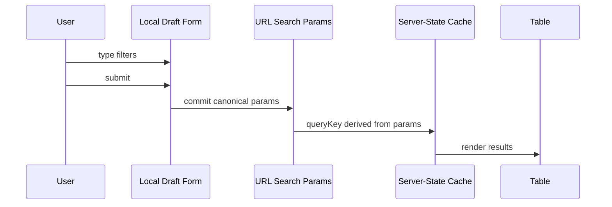
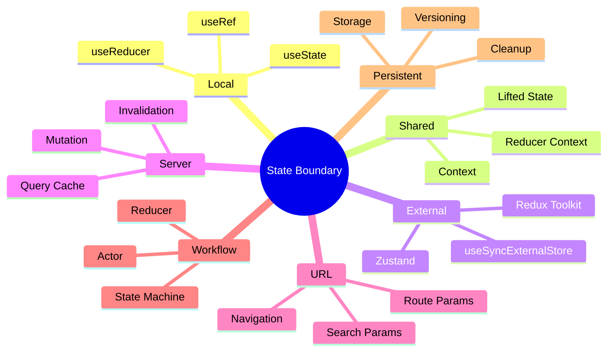

# Part 057 — State Management Decision Matrix

State management yang matang bukan dimulai dari pertanyaan:

```txt
Library apa yang harus dipakai?
```

State management yang matang dimulai dari pertanyaan:

```txt
State ini milik siapa?
Siapa yang boleh mengubahnya?
Berapa lama state ini hidup?
Apakah state ini harus bisa di-share, di-refresh, di-cache, di-serialize, di-audit, atau di-reset?
Apa invariant yang tidak boleh dilanggar?
```

Kalau pertanyaan itu belum dijawab, pilihan library hanya mempercepat kekacauan.

Part ini adalah peta keputusan. Tujuannya bukan membuat satu jawaban absolut, tetapi membuat proses pemilihan state boundary menjadi eksplisit, repeatable, dan bisa direview seperti architecture decision.

---

## 1. Thesis

State management adalah desain ownership dan lifecycle.

Library hanya implementasi.



Kalau state boundary benar, code biasanya sederhana.
Kalau state boundary salah, code akan penuh sinkronisasi manual, duplicated state, effect yang tidak perlu, dan callback yang membentuk graph sulit dilacak.

---

## 2. The Core Classification

Sebelum memilih tool, klasifikasikan state dengan tujuh dimensi utama.

| Dimensi | Pertanyaan | Dampak Arsitektur |
|---|---|---|
| Ownership | Siapa pemilik source of truth? | Menentukan lokasi update dan reset |
| Sharing radius | Berapa banyak component yang harus membaca/mengubah? | Menentukan props, context, store, atau cache |
| Lifecycle | Hidup selama render, component, route, session, atau server record? | Menentukan reset, persistence, invalidation |
| Authority | Apakah server adalah kebenaran akhir? | Menentukan cache/mutation strategy |
| Volatility | Seberapa sering berubah? | Menentukan apakah context aman atau perlu selector/external store |
| Serialization | Perlu masuk URL/storage/log? | Menentukan schema, validation, privacy |
| Transition complexity | Apakah update punya state machine/invariant? | Menentukan useState, reducer, atau state machine |

Checklist cepat:

```txt
1. Is it purely visual and local?             → local state / ref
2. Is it derived from props/state/cache?      → compute, do not store
3. Is it shared by siblings?                  → closest owner / lift state
4. Is it shareable/bookmarkable?              → URL state
5. Is the server authoritative?               → server-state cache
6. Does it come from browser/external system? → useSyncExternalStore adapter
7. Does it encode workflow transitions?       → reducer / state machine
8. Is it high-frequency global UI state?      → external store with selectors
```

---

## 3. Do Not Start with Global State

Global state is not evil.

Premature global state is expensive.

Global state creates:

1. wider blast radius,
2. hidden dependencies,
3. harder reset semantics,
4. more complex testing,
5. stronger coupling between distant features,
6. migration friction when requirements change.

Good React architecture prefers the smallest correct owner.



The direction is not always left-to-right. Mature systems often move state back down after discovering that global scope was unnecessary.

---

## 4. State Placement Algorithm

Use this algorithm during design review.

```txt
Input: a piece of state S
Output: recommended state boundary and tool

1. Can S be computed from existing data during render?
   - Yes: do not store it.
   - No: continue.

2. Is S only needed by one component instance?
   - Yes: local useState/useReducer/useRef.
   - No: continue.

3. Do all readers/writers share a close parent?
   - Yes: lift state to that parent and pass props/callbacks.
   - No: continue.

4. Should S be visible in browser URL or survive refresh/share link?
   - Yes: URL state.
   - No: continue.

5. Is S authoritative on the server or fetched remotely?
   - Yes: server-state cache.
   - No: continue.

6. Is S produced by an external mutable source outside React?
   - Yes: useSyncExternalStore or library built around it.
   - No: continue.

7. Does S represent a workflow with legal/illegal transitions?
   - Yes: reducer or state machine.
   - No: continue.

8. Does S need broad sharing with high-frequency updates?
   - Yes: external store with selector subscriptions.
   - No: scoped context or reducer + context.
```

---

## 5. Tool Decision Matrix

### 5.1 Local `useState`

Use when:

| Signal | Meaning |
|---|---|
| One owner | One component instance owns the state |
| Simple transition | Direct set/update is enough |
| Low invariant complexity | Few illegal combinations |
| Local reset | Reset happens by key, unmount, or local event |

Good examples:

```tsx
const [isOpen, setOpen] = useState(false);
const [draftName, setDraftName] = useState('');
const [selectedTab, setSelectedTab] = useState('overview');
```

Avoid when:

```txt
- updates are scattered across many handlers
- multiple fields must change atomically
- transition legality matters
- state must be read/written far away
- state mirrors server data
```

Move to `useReducer` when setters start encoding transition logic repeatedly.

---

### 5.2 Local `useReducer`

Use when local state has events and invariants.

```tsx
type State =
  | { status: 'idle' }
  | { status: 'editing'; draft: Draft }
  | { status: 'saving'; draft: Draft; requestId: string }
  | { status: 'failed'; draft: Draft; error: string };

type Event =
  | { type: 'editStarted'; draft: Draft }
  | { type: 'fieldChanged'; field: keyof Draft; value: string }
  | { type: 'saveRequested'; requestId: string }
  | { type: 'saveSucceeded'; requestId: string }
  | { type: 'saveFailed'; requestId: string; error: string };
```

A reducer is useful when you want one transition table instead of many disconnected setters.

---

### 5.3 Lifted State

Use when two or more components must stay consistent and they have a close common owner.



Good examples:

```txt
- selected row controls details panel
- tab selection controls tab panel
- filter form controls result list inside one page
- selected item controls action toolbar
```

Avoid over-lifting. If only final committed value matters to parent, keep draft local and commit up.

---

### 5.4 URL State

Use when state should be externally addressable.

| Use URL for | Avoid URL for |
|---|---|
| Search query | Password/token/secret |
| Filter params | Large object graphs |
| Sort/page | High-frequency drag state |
| Selected route resource | Private transient drafts |
| Open tab if bookmarkable | PII-heavy UI details |

URL state is not just state. It is a public contract.

Design it like an API:

```txt
?status=open&sort=created_desc&page=2
```

Not like a component dump:

```txt
?state=%7B%22internalTabIndex%22%3A2%2C%22modal%22%3Atrue%7D
```

---

### 5.5 Context

Use Context for scoped dependency passing.

Good context values:

```txt
- theme capability
- design-system density
- locale/direction
- form field ID linkage
- modal service capability
- permission capability
- analytics client
- route-level command dispatcher
```

Be careful with high-frequency mutable state. Every consumer that reads a changed context value participates in rerender propagation.

Context is best when:

```txt
sharing radius is subtree-scoped
update frequency is low or controlled
value represents capability/configuration
provider placement is intentional
```

---

### 5.6 Reducer + Context

Use when a screen/subtree has shared workflow state and you need to avoid prop drilling.



This is good for:

```txt
- complex form section
- wizard screen
- selection + bulk action state
- modal orchestration inside one feature
- local feature workflow
```

This is not automatically a replacement for Redux/Zustand/server-state cache.

---

### 5.7 External Store

Use an external store when state must live outside React and components need subscription-based reads.

Good examples:

```txt
- client-side app shell state shared widely
- high-frequency state with selector subscriptions
- cross-route UI state
- browser API adapter
- feature store with independent consumers
- microfrontend bridge state
```

React provides `useSyncExternalStore` for safely subscribing to external stores.

The minimum contract is:

```tsx
const value = useSyncExternalStore(
  store.subscribe,
  store.getSnapshot,
  store.getServerSnapshot
);
```

If snapshot identity changes unnecessarily, React will rerender unnecessarily or detect instability.

---

### 5.8 Server-State Cache

Use server-state cache when data is owned by a remote system.

Server state characteristics:

```txt
- async
- stale by nature
- shared across screens
- needs cache key
- needs invalidation
- may be refreshed in background
- may need optimistic mutation
- authoritative source is not React
```

Do not store server data in local component state unless the state is a local draft intentionally forked from server data.

Use local draft when:

```txt
server record → user edits locally → user submits command → server accepts/rejects
```

Use cache when:

```txt
server record → UI reads → mutation invalidates/refetches → UI observes fresh cache
```

---

### 5.9 Workflow State Machine

Use reducer or state machine when UI has legal and illegal transitions.

Examples:

```txt
idle → confirming → submitting → succeeded
idle → confirming → submitting → failed → retrying
```

The key smell:

```tsx
const [isLoading, setLoading] = useState(false);
const [isSuccess, setSuccess] = useState(false);
const [isError, setError] = useState(false);
const [isConfirmOpen, setConfirmOpen] = useState(false);
```

This allows impossible states:

```txt
isLoading=true, isSuccess=true, isError=true, isConfirmOpen=true
```

Prefer:

```tsx
type State =
  | { status: 'idle' }
  | { status: 'confirming' }
  | { status: 'submitting'; requestId: string }
  | { status: 'succeeded' }
  | { status: 'failed'; error: string };
```

---

## 6. The Full Decision Table

| State Type | Primary Owner | Recommended Tool | Reset Boundary | Main Risk |
|---|---|---|---|---|
| Visual toggle | Component | `useState` | unmount/key/local event | over-lifting |
| Input draft | Component/Form | `useState`/form lib | cancel/submit/key | syncing props into draft incorrectly |
| Multi-field invariant | Component/Form | `useReducer` | reducer event/key | illegal states |
| Sibling selection | Closest parent | lifted state/reducer | parent reset | callback graph complexity |
| Deep subtree config | Provider | Context | provider unmount | hidden coupling |
| High-frequency shared state | External store | Zustand/Redux/custom store | store reset | over-subscription |
| Server data | Server/cache | TanStack Query/RTK Query/etc. | invalidation/cache GC | stale/inconsistent cache |
| Search/filter in URL | Router/URL | search params | navigation | privacy/serialization bugs |
| Persisted preference | Browser storage | storage adapter/store | logout/schema migration | stale or sensitive data leakage |
| Workflow | State machine owner | reducer/state machine | transition/reset event | impossible transitions |
| Browser API state | External browser source | `useSyncExternalStore` | external event | hydration mismatch/tearing |
| Permission capability | Auth/permission provider | Context/capability object | auth/session boundary | authorization leakage |

---

## 7. Decision by Failure Mode

Sometimes the fastest way to choose architecture is to identify the bug class you are fighting.

| Symptom | Likely Cause | Refactor Toward |
|---|---|---|
| Component A and B disagree | duplicated state | closest common owner or single cache |
| UI loses input after rerender | accidental remount/key/type change | identity review |
| Effect loops forever | derived state stored + effect sync | compute during render |
| Server update not reflected | local copy of server state | server-state cache + invalidation |
| Context change rerenders huge tree | high-volatility context | split context or external store selectors |
| Modal closes unexpectedly | owner ambiguity | modal manager / close reason contract |
| Wizard reaches impossible step | boolean flags | reducer/state machine |
| Back button does not restore filters | state should be URL | URL search params |
| User sees stale preference after logout | persistence lifecycle missing | storage scope + cleanup |
| Async result overwrites newer state | request identity missing | reducer with requestId guard |

---

## 8. Scenario Recipes

### 8.1 Search Page Filters

Recommended split:

```txt
input draft     → local form state
committed query → URL state
results         → server-state cache keyed by URL params
selection       → local/lifted page state
```

Bad design:

```txt
One giant SearchContext containing draft, committed params, results, loading, selected rows, errors, and server data.
```

Better flow:



---

### 8.2 Enterprise Approval Workflow

Recommended split:

```txt
case record       → server-state cache
current command   → reducer/state machine
permissions       → capability context
confirmation UI   → modal orchestrator
optimistic status → mutation/cache layer
local notes draft → local state
```

Do not store the whole case record in a React reducer unless the UI owns a temporary draft.

---

### 8.3 Multi-Step Form

Recommended split:

```txt
field drafts       → form state
current step       → reducer/state machine
server validation  → mutation result/cache
route step         → URL only if shareable/resumable
submission state   → action/mutation lifecycle
```

Rule:

```txt
If the step cannot legally be visited before previous validation succeeds, encode that in transitions, not in scattered if-statements.
```

---

### 8.4 Notification Center

Recommended split:

```txt
notification list          → server-state cache
unread count               → server-state cache or external push-backed store
open/closed panel          → local/app shell state
optimistic mark-as-read    → mutation + optimistic cache update
realtime subscription      → external event source → cache invalidation/update
```

Do not use Context as a realtime event stream if update frequency is high.

---

### 8.5 Design System Theme

Recommended split:

```txt
theme tokens      → Context + CSS variables
persisted choice  → browser storage adapter
system preference → browser media query external source
component state   → local/compound context
```

Theme is a good Context use case because it is subtree-scoped and relatively low-frequency.

---

## 9. State Management Decision Record Template

For important state decisions, write a short ADR.

```md
# ADR: Search Filter State Placement

## Context
Search filters must survive refresh, support sharing links, and drive server result cache.

## Decision
Committed filters live in URL search params.
Draft filters live locally inside SearchFilterForm.
Results are loaded through server-state cache keyed by canonical URL params.

## Consequences
- Browser back/forward restores committed filters.
- Draft changes do not refetch until submit.
- Query key generation must canonicalize param ordering.
- PII fields must not be placed in URL.
```

A mature team does not just ask “Redux or Zustand?” It records why a state boundary exists.

---

## 10. Library Selection Is a Second-Order Decision

Once the boundary is clear, library choice becomes easier.

| Need | Reasonable Options |
|---|---|
| local simple state | `useState` |
| local transition/invariant | `useReducer` |
| subtree shared state | Context + reducer |
| high-frequency shared client state | Zustand, Redux Toolkit, custom external store |
| strict event log / team governance | Redux Toolkit |
| server-state cache | TanStack Query, RTK Query, framework loader/cache |
| workflow/state machine | reducer, XState, custom machine hook |
| browser external source | `useSyncExternalStore` adapter |

Do not pick a state library because “the app is big.”

Pick it because a specific state class needs:

```txt
- subscription granularity
- devtools/time travel
- event log
- middleware
- persistence
- cross-route sharing
- cache invalidation
- optimistic mutation
- workflow transitions
```

---

## 11. Anti-Patterns

### 11.1 Everything in Context

```tsx
<AppContext.Provider value={{ user, theme, filters, results, modal, cart, permissions }}>
  <App />
</AppContext.Provider>
```

Problems:

```txt
- unrelated consumers rerender together
- ownership disappears
- tests require giant provider setup
- reset semantics become unclear
- features couple through shared object shape
```

Refactor:

```txt
split by volatility, ownership, and domain boundary
```

---

### 11.2 Server Data Copied to Local State

```tsx
const { data: invoice } = useInvoice(id);
const [localInvoice, setLocalInvoice] = useState(invoice);
```

This is usually wrong because `invoice` may arrive later or update separately.

Better:

```txt
- render directly from cache for read-only view
- create an explicit draft initialized when editing begins
- submit mutation and invalidate/update cache
```

---

### 11.3 URL as Dumping Ground

```txt
?uiState={...large encoded blob...}
```

The URL is user-visible and shareable. Treat it as a stable public interface.

---

### 11.4 Reducer Used as Junk Drawer

A reducer is not automatically good architecture.

Bad reducer:

```tsx
type Action =
  | { type: 'setAnyField'; key: string; value: unknown }
  | { type: 'setLoading'; value: boolean }
  | { type: 'setError'; value: string | null };
```

This is just setters with extra ceremony.

Good reducer:

```tsx
type Action =
  | { type: 'submitted'; requestId: string }
  | { type: 'succeeded'; requestId: string; result: Result }
  | { type: 'failed'; requestId: string; error: string };
```

---

## 12. Review Heuristics

Use these questions during code review.

```txt
1. Can this state be removed and derived?
2. Is there exactly one source of truth?
3. Is the owner the smallest correct owner?
4. Are update transitions named as domain/UI intents?
5. Does reset behavior follow component identity, URL navigation, cache invalidation, or explicit event?
6. Are async races guarded by request identity or cancellation?
7. Is server data managed as server state?
8. Is context carrying configuration/capability, or high-frequency mutable data?
9. Is persistence validated and versioned?
10. Are impossible states structurally impossible?
```

---

## 13. Decision Matrix Scorecard

When uncertain, score the state.

| Question | Low Score | High Score |
|---|---|---|
| Sharing radius | one component | many distant consumers |
| Volatility | rarely changes | changes many times/sec |
| Transition complexity | direct assignment | guarded workflow |
| Server authority | no server | server is source of truth |
| Serialization need | none | URL/storage/audit required |
| Persistence need | unmount reset OK | survives route/session/reload |
| Observability need | local debug enough | event log/devtools needed |
| Team scale | one feature owner | many teams touch it |

Interpretation:

```txt
low sharing + low complexity             → local state
low sharing + high transition complexity → local reducer/state machine
medium sharing + low volatility          → lifted/context
high sharing + high volatility           → external store
server authority                         → server-state cache
serialization/shareability               → URL or persistence layer
workflow legality                        → reducer/state machine
```

---

## 14. Practical Rule: Split by Source of Truth, Not Screen

A screen often contains many state classes.

Example: Case Management Detail Page

```txt
case record             → server-state cache
edit notes draft        → local state
permission capability   → context
bulk selected documents → lifted/reducer state
current tab             → URL if shareable, local if not
modal stack             → overlay manager
approval workflow       → state machine
sidebar collapsed       → persistent preference
realtime lock status    → external subscription + cache update
```

A single screen does not imply a single store.

---

## 15. Exercises

### Exercise 1 — Classify State

For each item, choose owner/tool and justify:

```txt
1. Selected row in a table
2. Search filters on an admin page
3. Draft comment text
4. Current authenticated user
5. Permission check result
6. Sidebar collapsed preference
7. Infinite query result list
8. Multi-step onboarding progress
9. Toast queue
10. WebSocket connection status
```

Expected reasoning style:

```txt
Selected row is page-local shared state because table and toolbar need it.
If selection must survive refresh/share, move selectedId to URL.
If selection is high-volume across huge list virtualization, use a store/selector or table-local state depending on consumer radius.
```

### Exercise 2 — Refactor Wrong State

Initial design:

```tsx
const AppContext = createContext({
  user: null,
  theme: 'light',
  searchFilters: {},
  searchResults: [],
  selectedRows: [],
  modal: null,
  approvalStatus: 'idle',
});
```

Refactor it into separate state boundaries.

### Exercise 3 — Write an ADR

Write a decision record for where to store filter state in a compliance search page.

Include:

```txt
- draft vs committed state
- URL serialization
- server cache key
- privacy limitation
- back button behavior
```

---

## 16. Production Checklist

Before introducing or moving state, verify:

```txt
[ ] There is one source of truth.
[ ] Ownership is explicit.
[ ] Reset boundary is explicit.
[ ] Server-owned data is not copied unless intentionally forked as draft.
[ ] URL state is canonicalized and privacy-safe.
[ ] Persistence is validated, versioned, and cleared on auth boundary.
[ ] Context values are stable and scoped.
[ ] High-frequency shared state has selector-based subscription.
[ ] Reducer/state machine prevents impossible states.
[ ] Async transitions guard against stale responses.
[ ] Tests cover transition invariants and reset behavior.
```

---

## 17. Closing Model

React state architecture is not a ladder where every app eventually climbs to Redux or Zustand.

It is a map.



The top-level skill is not knowing every library.

The top-level skill is knowing which state should not exist, which state should remain local, which state belongs to the server, which state belongs to the URL, and which state deserves a formal transition system.

---

## References

- React Docs — Managing State: https://react.dev/learn/managing-state
- React Docs — Sharing State Between Components: https://react.dev/learn/sharing-state-between-components
- React Docs — Choosing the State Structure: https://react.dev/learn/choosing-the-state-structure
- React Docs — useReducer: https://react.dev/reference/react/useReducer
- React Docs — useSyncExternalStore: https://react.dev/reference/react/useSyncExternalStore
- React Docs — Scaling Up with Reducer and Context: https://react.dev/learn/scaling-up-with-reducer-and-context
- Redux Toolkit Docs — createSlice: https://redux-toolkit.js.org/api/createSlice
