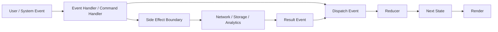
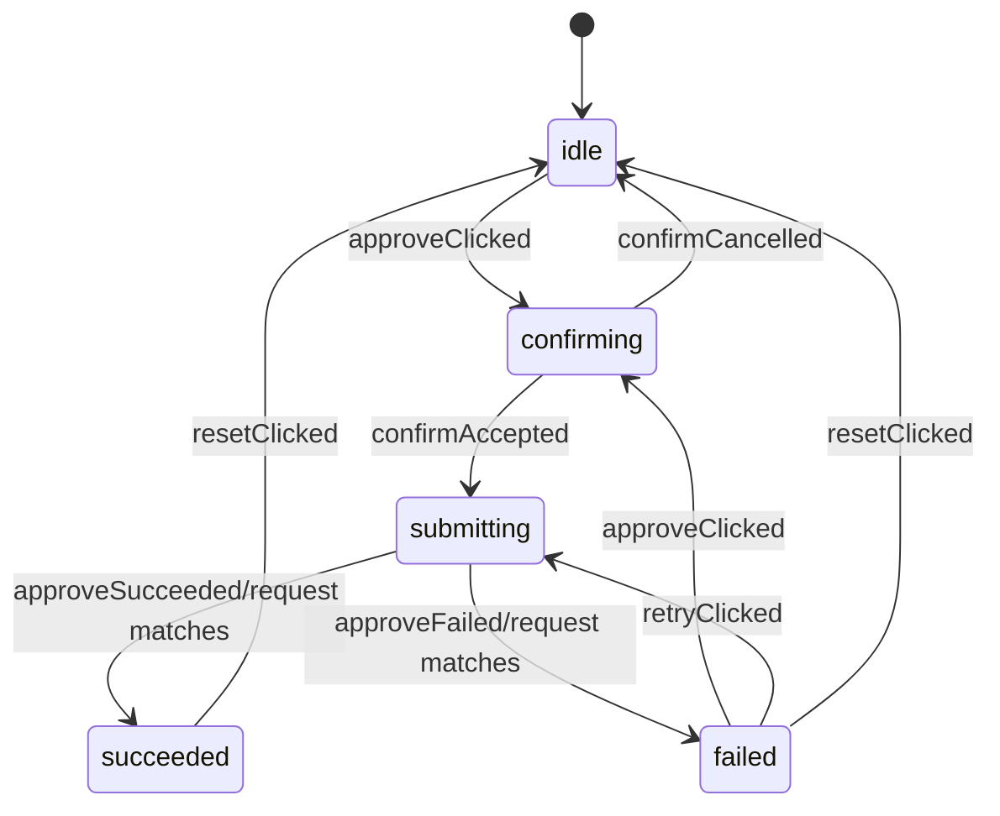
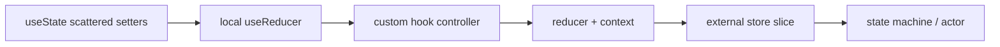

# Part 058 — Reducer Architecture

`useReducer` sering dipahami sebagai alternatif `useState` ketika state “mulai banyak”.

Itu benar, tapi terlalu dangkal.

Reducer yang baik bukan cuma tempat menaruh update logic. Reducer yang baik adalah transition system kecil:

```txt
current state + event → next state
```

Ia membuat perubahan state bisa dibaca, dites, dan dijaga invariant-nya.

---

## 1. Reducer Is Not a Setter With Extra Steps

Bad reducer:

```tsx
type Action =
  | { type: 'setLoading'; value: boolean }
  | { type: 'setError'; value: string | null }
  | { type: 'setData'; value: Data | null };
```

Ini hanya `useState` yang dipindahkan ke file lain.

Good reducer:

```tsx
type Action =
  | { type: 'loadRequested'; requestId: string }
  | { type: 'loadSucceeded'; requestId: string; data: Data }
  | { type: 'loadFailed'; requestId: string; error: string }
  | { type: 'retryRequested'; requestId: string };
```

Perbedaannya:

| Setter-style reducer | Event-style reducer |
|---|---|
| Menyatakan field apa yang diubah | Menyatakan kejadian/intensi apa yang terjadi |
| Mudah membuat illegal state | Lebih mudah menjaga transition legality |
| Sulit diaudit | Mudah dilog sebagai event |
| Logic tetap tersebar | Logic terkonsolidasi |
| Nama action teknis | Nama action bermakna domain/UI |

Reducer architecture dimulai dari event, bukan field.

---

## 2. The Reducer Contract

Reducer harus memenuhi kontrak berikut:

```txt
Reducer(state, event) must be:
- pure
- deterministic
- synchronous
- immutable in result semantics
- free from side effects
- responsible for transition legality
```

Reducer tidak boleh:

```txt
- fetch API
- mutate DOM
- write localStorage
- call analytics
- navigate route
- generate random IDs internally
- read current time internally
- mutate existing state object
```

Kalau butuh waktu, random ID, network, analytics, atau navigation, lakukan di command handler/event handler/effect, lalu kirim event hasilnya ke reducer.

---

## 3. Mental Model



Reducer tidak melakukan effect.
Reducer menerima hasil effect sebagai event.

---

## 4. When to Use `useReducer`

Use reducer when:

```txt
- multiple state fields change together
- update logic depends on previous state
- illegal states are possible with independent setters
- event names are clearer than setter names
- transitions deserve tests
- you need request identity guards
- you want to migrate later to context/store/machine without rewriting UI semantics
```

Do not use reducer just because:

```txt
- there are three useState calls
- someone said reducers are more scalable
- you want to copy Redux style ceremony locally
```

The reason for reducer is transition complexity, not line count.

---

## 5. Build a Reducer from a Real Problem

Problem: an approval button has states:

```txt
idle
confirming
submitting
succeeded
failed
```

Naive state:

```tsx
const [isConfirmOpen, setConfirmOpen] = useState(false);
const [isSubmitting, setSubmitting] = useState(false);
const [isSuccess, setSuccess] = useState(false);
const [error, setError] = useState<string | null>(null);
```

This allows nonsense:

```txt
confirm modal open while success is true
submitting true while error exists from previous request
success true and error non-null
```

Reducer state:

```tsx
type ApprovalState =
  | { status: 'idle' }
  | { status: 'confirming' }
  | { status: 'submitting'; requestId: string }
  | { status: 'succeeded'; receiptId: string }
  | { status: 'failed'; error: string };
```

Events:

```tsx
type ApprovalEvent =
  | { type: 'approveClicked' }
  | { type: 'confirmCancelled' }
  | { type: 'confirmAccepted'; requestId: string }
  | { type: 'approveSucceeded'; requestId: string; receiptId: string }
  | { type: 'approveFailed'; requestId: string; error: string }
  | { type: 'retryClicked'; requestId: string }
  | { type: 'resetClicked' };
```

Reducer:

```tsx
function approvalReducer(
  state: ApprovalState,
  event: ApprovalEvent
): ApprovalState {
  switch (event.type) {
    case 'approveClicked': {
      if (state.status !== 'idle' && state.status !== 'failed') return state;
      return { status: 'confirming' };
    }

    case 'confirmCancelled': {
      if (state.status !== 'confirming') return state;
      return { status: 'idle' };
    }

    case 'confirmAccepted': {
      if (state.status !== 'confirming') return state;
      return { status: 'submitting', requestId: event.requestId };
    }

    case 'approveSucceeded': {
      if (state.status !== 'submitting') return state;
      if (state.requestId !== event.requestId) return state;
      return { status: 'succeeded', receiptId: event.receiptId };
    }

    case 'approveFailed': {
      if (state.status !== 'submitting') return state;
      if (state.requestId !== event.requestId) return state;
      return { status: 'failed', error: event.error };
    }

    case 'retryClicked': {
      if (state.status !== 'failed') return state;
      return { status: 'submitting', requestId: event.requestId };
    }

    case 'resetClicked': {
      return { status: 'idle' };
    }

    default: {
      return assertNever(event);
    }
  }
}

function assertNever(value: never): never {
  throw new Error(`Unhandled event: ${JSON.stringify(value)}`);
}
```

Notice what changed:

```txt
- impossible states are structurally removed
- stale async responses are ignored by requestId
- event names describe user/system intent
- transitions are local and testable
```

---

## 6. Reducer as Transition Table

A reducer can be visualized as a transition table.

| Current State | Event | Next State | Rule |
|---|---|---|---|
| idle | approveClicked | confirming | user starts approval |
| confirming | confirmCancelled | idle | user aborts |
| confirming | confirmAccepted | submitting | request begins |
| submitting | approveSucceeded/same requestId | succeeded | latest request wins |
| submitting | approveFailed/same requestId | failed | latest request wins |
| failed | retryClicked | submitting | retry allowed |
| any | resetClicked | idle | explicit reset |

And as state diagram:



If you cannot draw the state diagram, your reducer is probably still just a bag of setters.

---

## 7. Event Naming

Good event names are past-tense facts or clear user intents.

| Weak | Better |
|---|---|
| `setOpen` | `dialogOpened` / `openRequested` |
| `setLoading` | `saveRequested` |
| `setError` | `saveFailed` |
| `setData` | `loadSucceeded` |
| `updateField` | `fieldChanged` |
| `toggle` | `selectionToggled` |

Use naming style intentionally:

```txt
- User intent: approveClicked, filterSubmitted, tabSelected
- System result: loadSucceeded, saveFailed, timeoutReached
- Domain event: invoiceApproved, caseEscalated
- Command request: approvalRequested, retryRequested
```

Do not mix them casually. A reducer event should represent something the state machine can respond to.

---

## 8. Reducer State Shape

State shape should encode valid states directly.

Bad:

```tsx
type State = {
  isLoading: boolean;
  isError: boolean;
  isSuccess: boolean;
  data: Data | null;
  error: string | null;
};
```

Better:

```tsx
type State =
  | { status: 'idle' }
  | { status: 'loading'; requestId: string }
  | { status: 'success'; data: Data }
  | { status: 'error'; error: string };
```

A discriminated union is a state invariant encoded in the type system.

---

## 9. Action Payload Design

Payload should contain the information needed to transition, not random UI details.

Bad:

```tsx
{ type: 'change', payload: event }
```

The reducer should not know DOM events.

Better:

```tsx
{ type: 'fieldChanged', field: 'email', value: 'a@b.com' }
```

Bad:

```tsx
{ type: 'approveSucceeded', response }
```

Better:

```tsx
{ type: 'approveSucceeded', requestId, receiptId }
```

Payload is a reducer API. Keep it small, explicit, and serializable when possible.

---

## 10. Reducer Purity and Side Effect Boundary

Bad:

```tsx
function reducer(state: State, event: Event): State {
  switch (event.type) {
    case 'submitted':
      localStorage.setItem('draft', JSON.stringify(state.draft));
      return { ...state, status: 'submitting' };
  }
}
```

Better:

```tsx
function Component() {
  const [state, dispatch] = useReducer(reducer, initialState);

  async function handleSubmit() {
    const requestId = crypto.randomUUID();
    dispatch({ type: 'submitRequested', requestId });

    try {
      await saveDraft(state.draft);
      dispatch({ type: 'submitSucceeded', requestId });
    } catch (error) {
      dispatch({ type: 'submitFailed', requestId, error: toMessage(error) });
    }
  }
}
```

Even better, isolate command handler:

```tsx
function useApprovalController(caseId: string) {
  const [state, dispatch] = useReducer(approvalReducer, { status: 'idle' });

  const approve = async () => {
    const requestId = crypto.randomUUID();
    dispatch({ type: 'confirmAccepted', requestId });

    try {
      const receipt = await approveCase(caseId);
      dispatch({ type: 'approveSucceeded', requestId, receiptId: receipt.id });
    } catch (error) {
      dispatch({ type: 'approveFailed', requestId, error: toMessage(error) });
    }
  };

  return { state, dispatch, approve };
}
```

The reducer remains pure. The controller owns effects.

---

## 11. Lazy Initial State

Use lazy initialization when initial state is expensive or derived once from props/storage.

```tsx
function init(raw: InitialInput): State {
  return {
    status: 'editing',
    draft: normalizeDraft(raw),
    touched: {},
  };
}

const [state, dispatch] = useReducer(reducer, props.initialInput, init);
```

Important distinction:

```txt
initializer runs to create initial state
it does not automatically re-run when props change
```

If props should reset the reducer, use component identity/key or explicit reset event.

```tsx
<Editor key={documentId} document={document} />
```

or:

```tsx
dispatch({ type: 'documentChanged', document });
```

Choose intentionally.

---

## 12. Selectors

Do not make every component inspect raw reducer state.

Raw state:

```tsx
state.status === 'submitting' || state.status === 'confirming'
```

Selector:

```tsx
function selectCanCancel(state: ApprovalState) {
  return state.status === 'confirming' || state.status === 'submitting';
}

function selectSubmitDisabled(state: ApprovalState) {
  return state.status === 'submitting' || state.status === 'succeeded';
}
```

Selectors give you:

```txt
- stable vocabulary
- reusable view derivation
- better tests
- less duplication
- easier migration to external store
```

Selectors should be pure calculations.

---

## 13. Reducer + View Mapping

Avoid spreading transition logic into JSX.

Weak:

```tsx
{state.status === 'idle' || state.status === 'failed' ? (
  <Button onClick={() => dispatch({ type: 'approveClicked' })}>Approve</Button>
) : null}
```

Better:

```tsx
const canStartApproval = selectCanStartApproval(state);

return canStartApproval ? (
  <Button onClick={() => dispatch({ type: 'approveClicked' })}>Approve</Button>
) : null;
```

Even better for complex screens:

```tsx
const vm = createApprovalViewModel(state);

return <ApprovalPanel {...vm} onEvent={dispatch} />;
```

A view model is not always needed, but when render logic becomes a maze of `status === ...`, it creates a useful boundary.

---

## 14. Reducer Testing

Reducer tests should read like transition specs.

```tsx
describe('approvalReducer', () => {
  it('moves idle to confirming when approve is clicked', () => {
    const next = approvalReducer(
      { status: 'idle' },
      { type: 'approveClicked' }
    );

    expect(next).toEqual({ status: 'confirming' });
  });

  it('ignores stale success from older request', () => {
    const next = approvalReducer(
      { status: 'submitting', requestId: 'new' },
      { type: 'approveSucceeded', requestId: 'old', receiptId: 'r1' }
    );

    expect(next).toEqual({ status: 'submitting', requestId: 'new' });
  });
});
```

Test categories:

```txt
- legal transition
- illegal transition
- reset transition
- stale async result
- invariant preservation
- exhaustive event handling
```

Reducer tests are cheap. Use them.

---

## 15. Exhaustiveness

Use TypeScript to make missed events visible.

```tsx
function assertNever(x: never): never {
  throw new Error(`Unexpected object: ${JSON.stringify(x)}`);
}

function reducer(state: State, event: Event): State {
  switch (event.type) {
    case 'started':
      return { status: 'running' };
    case 'stopped':
      return { status: 'stopped' };
    default:
      return assertNever(event);
  }
}
```

When a new event is added, the compiler can force you to decide how the reducer handles it.

---

## 16. Split Reducers Carefully

Split reducer logic when the domain has separate sub-machines.

Do not split merely by field.

Weak split:

```txt
loadingReducer
errorReducer
dataReducer
```

Better split:

```txt
selectionReducer
filterReducer
bulkActionReducer
validationReducer
```

A split reducer should own a meaningful sub-domain or sub-workflow.

Example:

```tsx
function pageReducer(state: PageState, event: PageEvent): PageState {
  return {
    filters: filterReducer(state.filters, event),
    selection: selectionReducer(state.selection, event),
    bulkAction: bulkActionReducer(state.bulkAction, event),
  };
}
```

But be careful: if a transition must update multiple slices atomically, the parent reducer should coordinate it explicitly.

---

## 17. Nested State and Immutability

React reducers must return new state when state changes.

Without Immer:

```tsx
case 'fieldChanged':
  return {
    ...state,
    draft: {
      ...state.draft,
      [event.field]: event.value,
    },
    touched: {
      ...state.touched,
      [event.field]: true,
    },
  };
```

With Redux Toolkit, `createSlice` lets you write mutating syntax because it uses Immer internally.

```tsx
const slice = createSlice({
  name: 'draft',
  initialState,
  reducers: {
    fieldChanged(state, action: PayloadAction<{ field: string; value: string }>) {
      state.draft[action.payload.field] = action.payload.value;
      state.touched[action.payload.field] = true;
    },
  },
});
```

Do not assume local React `useReducer` has Immer. It does not.

If you want Immer locally, introduce it explicitly and understand the dependency.

---

## 18. Async Reducer Pattern

Reducer handles async lifecycle events. It does not perform async work.

Pattern:

```tsx
async function handleSave() {
  const requestId = crypto.randomUUID();
  dispatch({ type: 'saveRequested', requestId });

  try {
    const result = await save(state.draft);
    dispatch({ type: 'saveSucceeded', requestId, result });
  } catch (error) {
    dispatch({ type: 'saveFailed', requestId, error: toMessage(error) });
  }
}
```

Reducer guard:

```tsx
case 'saveSucceeded': {
  if (state.status !== 'saving') return state;
  if (state.requestId !== event.requestId) return state;
  return { status: 'saved', result: event.result };
}
```

This prevents stale response overwrite.

---

## 19. Reducer with AbortController

For cancellable requests:

```tsx
function useSearchController() {
  const [state, dispatch] = useReducer(searchReducer, { status: 'idle' });
  const abortRef = useRef<AbortController | null>(null);

  async function search(query: string) {
    abortRef.current?.abort();

    const controller = new AbortController();
    abortRef.current = controller;
    const requestId = crypto.randomUUID();

    dispatch({ type: 'searchRequested', query, requestId });

    try {
      const results = await searchApi(query, { signal: controller.signal });
      dispatch({ type: 'searchSucceeded', requestId, results });
    } catch (error) {
      if (controller.signal.aborted) {
        dispatch({ type: 'searchCancelled', requestId });
        return;
      }

      dispatch({ type: 'searchFailed', requestId, error: toMessage(error) });
    }
  }

  return { state, search };
}
```

Ownership:

```txt
AbortController lives in ref because it is mutable external control state.
Request lifecycle lives in reducer because it affects render.
```

---

## 20. Reducer + Context Architecture

For a complex screen:

```tsx
const StateContext = createContext<State | null>(null);
const DispatchContext = createContext<Dispatch<Event> | null>(null);

export function FeatureProvider({ children }: { children: React.ReactNode }) {
  const [state, dispatch] = useReducer(featureReducer, initialState);

  return (
    <StateContext.Provider value={state}>
      <DispatchContext.Provider value={dispatch}>
        {children}
      </DispatchContext.Provider>
    </StateContext.Provider>
  );
}

export function useFeatureState() {
  const value = useContext(StateContext);
  if (value === null) throw new Error('useFeatureState must be used inside FeatureProvider');
  return value;
}

export function useFeatureDispatch() {
  const value = useContext(DispatchContext);
  if (value === null) throw new Error('useFeatureDispatch must be used inside FeatureProvider');
  return value;
}
```

Split state and dispatch context because `dispatch` identity is stable, while state changes.

Still remember: all consumers of StateContext rerender when the state value changes. If this becomes a problem, move to selectors or external store.

---

## 21. Reducer Is a Migration-Friendly Boundary

A well-designed local reducer can migrate without changing component semantics.



The key is event vocabulary.

If your UI dispatches domain-level events, implementation can change behind the boundary.

---

## 22. Reducer vs State Machine

Reducer is enough when:

```txt
- transition graph is small
- async side effects are simple
- nested/parallel states are limited
- team can maintain transition table manually
```

Move toward formal state machine when:

```txt
- nested states appear
- parallel states appear
- invoked services have lifecycle
- guards/actions need first-class modeling
- workflow must be visualized or audited
- illegal transitions are costly
```

A reducer is often the training ground for state machine thinking.

---

## 23. Reducer vs External Store

Reducer answers:

```txt
How should this state transition?
```

External store answers:

```txt
Where should this state live and how should components subscribe to it?
```

They are not opposites.

You can have:

```txt
- reducer inside component
- reducer inside context provider
- reducer inside Redux slice
- reducer-like actions inside Zustand store
- reducer as transition function inside a custom store
```

The transition model and storage/subscription model are separate design choices.

---

## 24. Common Failure Modes

### 24.1 Action Explosion

Symptom:

```txt
20 action types, most named setX
```

Cause:

```txt
Reducer used as setter registry.
```

Fix:

```txt
Re-group actions by user intent or domain event.
```

---

### 24.2 Impossible State Still Possible

Symptom:

```tsx
type State = {
  status: 'idle' | 'loading' | 'success' | 'error';
  data: Data | null;
  error: string | null;
};
```

This still allows:

```txt
status=success with error non-null
status=error with data non-null
```

Fix:

```tsx
type State =
  | { status: 'idle' }
  | { status: 'loading'; requestId: string }
  | { status: 'success'; data: Data }
  | { status: 'error'; error: string };
```

---

### 24.3 Side Effects Inside Reducer

Symptom:

```txt
reducer writes storage, logs analytics, creates IDs, or fetches
```

Fix:

```txt
Move effect to command handler or effect boundary; reducer receives result event.
```

---

### 24.4 Reducer Becomes Global Junk Drawer

Symptom:

```txt
one reducer handles unrelated features because they share a page
```

Fix:

```txt
Split by ownership and transition coupling, not file convenience.
```

---

### 24.5 Unhandled Stale Async Response

Symptom:

```txt
Older request finishes after newer request and overwrites UI.
```

Fix:

```txt
Use requestId or abort boundary. Reducer ignores stale result event.
```

---

## 25. Production Checklist

Before merging reducer architecture:

```txt
[ ] Events represent user/system intent, not raw setters.
[ ] State shape prevents impossible states.
[ ] Reducer is pure and synchronous.
[ ] Side effects live outside reducer.
[ ] Async events carry request identity when needed.
[ ] Illegal transitions are explicitly handled.
[ ] Reset behavior is explicit.
[ ] Selectors hide raw state details from view code.
[ ] Tests cover legal transitions, illegal transitions, stale async results, and reset.
[ ] The reducer can migrate to context/store/machine without changing event vocabulary.
```

---

## 26. Exercises

### Exercise 1 — Convert Booleans to Union State

Refactor:

```tsx
type State = {
  isOpen: boolean;
  isSubmitting: boolean;
  isSuccess: boolean;
  error: string | null;
};
```

Into a discriminated union for a modal submit workflow.

### Exercise 2 — Build Transition Table

For this workflow:

```txt
idle → editing → validating → submitting → submitted
validating → invalid
submitting → failed
failed → submitting
```

Write:

```txt
- State union
- Event union
- Transition table
- Reducer
- Tests for stale validation response
```

### Exercise 3 — Extract Command Handler

Given a reducer that calls API inside reducer, refactor into:

```txt
- pure reducer
- command handler hook
- requestId guard
- tests
```

---

## 27. Closing Model

Reducer architecture is the bridge between ordinary state and formal workflow modeling.

```txt
useState answers: what value should I store?
useReducer answers: what transitions are legal?
state machine answers: what workflow exists, including nested/parallel states and invoked services?
external store answers: how should this state be shared and subscribed to?
server-state cache answers: how should remote authority, freshness, and invalidation work?
```

A top-tier React engineer does not use reducer everywhere.

They use reducer when state changes need a protocol.

---

## References

- React Docs — useReducer: https://react.dev/reference/react/useReducer
- React Docs — Extracting State Logic into a Reducer: https://react.dev/learn/extracting-state-logic-into-a-reducer
- React Docs — Managing State: https://react.dev/learn/managing-state
- React Docs — Scaling Up with Reducer and Context: https://react.dev/learn/scaling-up-with-reducer-and-context
- React Docs — Components and Hooks Must Be Pure: https://react.dev/reference/rules/components-and-hooks-must-be-pure
- Redux Toolkit Docs — createSlice: https://redux-toolkit.js.org/api/createSlice
