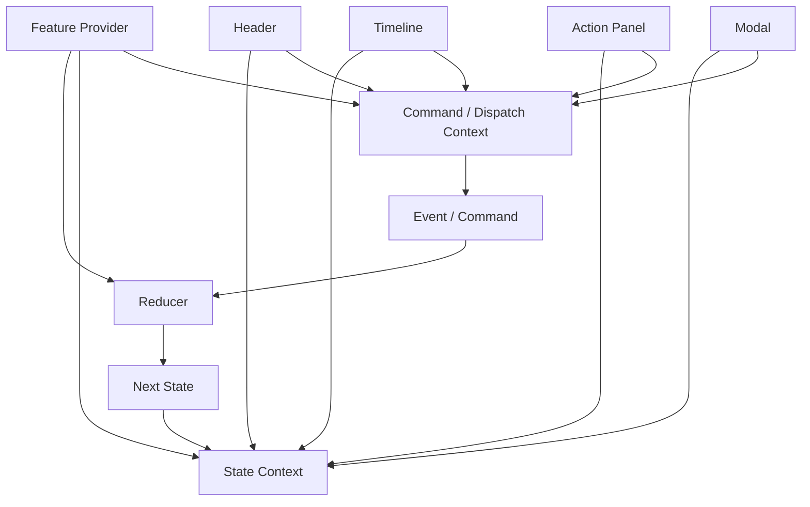
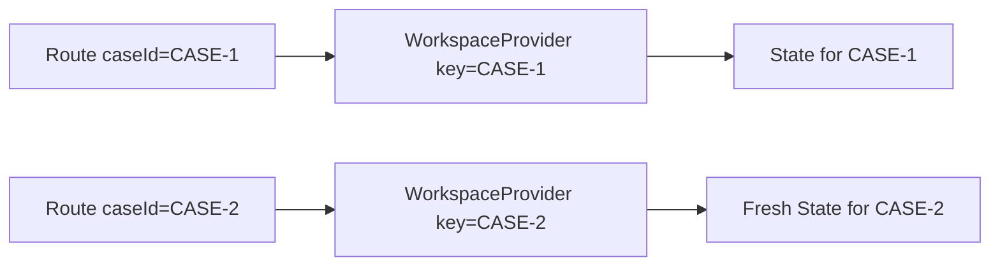

# Part 059 — Reducer + Context Store

Reducer memberi kita transition system.
Context memberi kita distribution mechanism.

Gabungannya sering disebut “simple global store”. Itu istilah yang berbahaya.

Model yang lebih tepat:

```txt
Reducer + Context = scoped application state for a subtree
```

Bukan global default.
Bukan pengganti semua state manager.
Bukan tempat menaruh semua data.

Ia cocok ketika satu subtree punya workflow/state bersama yang:

```txt
- terlalu kompleks untuk prop drilling
- terlalu lokal untuk external store global
- terlalu behavioral untuk sekadar context value statis
- butuh invariant transition yang jelas
- butuh command API yang bisa dipakai banyak child
```

Contoh:

```txt
- checkout wizard
- case management workspace
- approval review screen
- complex filter builder
- modal orchestration dalam satu feature
- kanban board local interaction state
- form builder/editor state
- document annotation workspace
```

Reducer + Context bukan “Redux kecil”.
Ia adalah **state boundary untuk subtree**.

---

## 1. Problem yang Diselesaikan

Tanpa reducer + context, state subtree sering berubah menjadi pola seperti ini:

```tsx
function CaseWorkspacePage() {
  const [selectedTab, setSelectedTab] = useState('timeline');
  const [selectedEntityId, setSelectedEntityId] = useState<string | null>(null);
  const [draftComment, setDraftComment] = useState('');
  const [isAssignModalOpen, setAssignModalOpen] = useState(false);
  const [pendingAction, setPendingAction] = useState<Action | null>(null);
  const [validationErrors, setValidationErrors] = useState<Record<string, string>>({});

  return (
    <CaseHeader
      selectedTab={selectedTab}
      onTabChange={setSelectedTab}
      selectedEntityId={selectedEntityId}
      onSelectEntity={setSelectedEntityId}
      isAssignModalOpen={isAssignModalOpen}
      onAssignModalOpenChange={setAssignModalOpen}
      pendingAction={pendingAction}
      onPendingActionChange={setPendingAction}
    />
  );
}
```

Masalahnya bukan jumlah `useState`.

Masalahnya adalah **transition logic tersebar**.

Siapa yang memastikan?

```txt
- entity tidak boleh dipilih jika workspace belum loaded
- modal assign harus tertutup setelah assignment berhasil
- draft comment harus di-reset setelah submit sukses
- pending action harus punya requestId
- stale async response tidak boleh overwrite state baru
- tab tertentu hanya bisa dibuka jika permission ada
```

Kalau aturan itu tersebar di callback child, state akan hidup, tapi tidak punya sistem.

Reducer + Context menyatukan:

```txt
state shape
+ allowed events
+ transition rules
+ command access
+ read access
```

---

## 2. Mental Model



Provider adalah boundary.
Reducer adalah transition engine.
Context adalah distribution layer.
Custom hook adalah public API.

---

## 3. Kapan Pattern Ini Tepat?

Gunakan reducer + context ketika semua kondisi ini cukup benar:

| Kondisi | Makna |
|---|---|
| State dipakai banyak descendant | Prop drilling mulai mendominasi desain |
| State masih scoped ke satu feature/subtree | Belum layak menjadi global external store |
| Update logic punya invariant | `setX` langsung mulai berbahaya |
| Banyak child mengirim intent | Butuh command/dispatch API stabil |
| State bukan server cache utama | Data authority tetap di server/query cache |
| Perubahan tidak terlalu high-frequency | Context rerender blast radius masih terkendali |

Jangan gunakan pattern ini untuk:

```txt
- data server yang butuh caching/invalidation
- input text high-frequency yang dibaca seluruh tree
- state global lintas aplikasi tanpa ownership jelas
- event stream tanpa state read model
- semua hal hanya karena “biar gampang diakses”
```

---

## 4. Baseline: Naive Reducer + Context

Kita mulai dari versi sederhana.

```tsx
import { createContext, useContext, useReducer } from 'react';

type State = {
  selectedId: string | null;
  isAssignModalOpen: boolean;
};

type Action =
  | { type: 'entitySelected'; id: string }
  | { type: 'selectionCleared' }
  | { type: 'assignModalOpened' }
  | { type: 'assignModalClosed' };

const initialState: State = {
  selectedId: null,
  isAssignModalOpen: false,
};

function reducer(state: State, action: Action): State {
  switch (action.type) {
    case 'entitySelected':
      return { ...state, selectedId: action.id };

    case 'selectionCleared':
      return { ...state, selectedId: null, isAssignModalOpen: false };

    case 'assignModalOpened':
      if (!state.selectedId) return state;
      return { ...state, isAssignModalOpen: true };

    case 'assignModalClosed':
      return { ...state, isAssignModalOpen: false };

    default:
      return assertNever(action);
  }
}

function assertNever(value: never): never {
  throw new Error(`Unhandled action: ${JSON.stringify(value)}`);
}

const WorkspaceContext = createContext<{
  state: State;
  dispatch: React.Dispatch<Action>;
} | null>(null);

export function WorkspaceProvider({ children }: { children: React.ReactNode }) {
  const [state, dispatch] = useReducer(reducer, initialState);

  return (
    <WorkspaceContext.Provider value={{ state, dispatch }}>
      {children}
    </WorkspaceContext.Provider>
  );
}

export function useWorkspace() {
  const value = useContext(WorkspaceContext);
  if (!value) {
    throw new Error('useWorkspace must be used inside WorkspaceProvider');
  }
  return value;
}
```

Ini sudah valid, tapi belum production-grade.

Masalahnya:

```txt
- semua consumer rerender saat state berubah
- dispatch dan state bercampur
- semua component bisa membaca semua state
- semua component bisa dispatch semua action
- action API masih terlalu teknis untuk product code
```

---

## 5. Split State Context and Dispatch Context

Dispatch dari `useReducer` stabil. State berubah setiap transition.

Kalau state dan dispatch digabung dalam satu object value:

```tsx
value={{ state, dispatch }}
```

object baru dibuat setiap render provider.
Semua consumer context akan melihat value berubah.

Split context:

```tsx
const WorkspaceStateContext = createContext<State | null>(null);
const WorkspaceDispatchContext = createContext<React.Dispatch<Action> | null>(null);

export function WorkspaceProvider({ children }: { children: React.ReactNode }) {
  const [state, dispatch] = useReducer(reducer, initialState);

  return (
    <WorkspaceDispatchContext.Provider value={dispatch}>
      <WorkspaceStateContext.Provider value={state}>
        {children}
      </WorkspaceStateContext.Provider>
    </WorkspaceDispatchContext.Provider>
  );
}

export function useWorkspaceState() {
  const state = useContext(WorkspaceStateContext);
  if (!state) throw new Error('useWorkspaceState must be used inside WorkspaceProvider');
  return state;
}

export function useWorkspaceDispatch() {
  const dispatch = useContext(WorkspaceDispatchContext);
  if (!dispatch) throw new Error('useWorkspaceDispatch must be used inside WorkspaceProvider');
  return dispatch;
}
```

Sekarang component yang hanya butuh dispatch tidak rerender karena perubahan state.

```tsx
function AssignButton() {
  const dispatch = useWorkspaceDispatch();

  return (
    <button onClick={() => dispatch({ type: 'assignModalOpened' })}>
      Assign
    </button>
  );
}
```

Tetapi component yang membaca state tetap rerender setiap state berubah.
Itu bukan bug. Itu konsekuensi Context.

---

## 6. Jangan Mengekspos Dispatch Mentah ke Semua Component

`dispatch` mentah berguna, tapi terlalu rendah level untuk banyak product component.

Contoh buruk:

```tsx
function Toolbar() {
  const dispatch = useWorkspaceDispatch();

  return (
    <button
      onClick={() => {
        dispatch({ type: 'selectionCleared' });
        dispatch({ type: 'assignModalClosed' });
        dispatch({ type: 'draftReset' });
      }}
    />
  );
}
```

Toolbar sekarang tahu terlalu banyak transition internal.

Lebih baik buat command hook:

```tsx
export function useWorkspaceCommands() {
  const dispatch = useWorkspaceDispatch();

  return {
    selectEntity(id: string) {
      dispatch({ type: 'entitySelected', id });
    },

    clearSelection() {
      dispatch({ type: 'selectionCleared' });
    },

    openAssignModal() {
      dispatch({ type: 'assignModalOpened' });
    },

    closeAssignModal() {
      dispatch({ type: 'assignModalClosed' });
    },
  };
}
```

Usage:

```tsx
function Toolbar() {
  const workspace = useWorkspaceCommands();

  return (
    <button onClick={workspace.clearSelection}>
      Clear
    </button>
  );
}
```

Command hook menjadi public API.
Reducer action menjadi private protocol.

Itu perbedaan penting.

---

## 7. Domain Commands vs Reducer Events

Command dan event tidak selalu sama.

```txt
Command = intent yang diminta UI
Event   = fakta transition yang masuk ke reducer
```

Contoh:

```tsx
async function approveCase(caseId: string) {
  const requestId = crypto.randomUUID();

  dispatch({ type: 'approvalRequested', caseId, requestId });

  try {
    await api.approveCase(caseId);
    dispatch({ type: 'approvalSucceeded', caseId, requestId });
  } catch (error) {
    dispatch({
      type: 'approvalFailed',
      caseId,
      requestId,
      error: toErrorMessage(error),
    });
  }
}
```

Di sini:

```txt
approveCase(...)      = command
approvalRequested     = event
approvalSucceeded     = event
approvalFailed        = event
```

Command boleh async.
Reducer tidak boleh async.

---

## 8. Provider as Application Service Boundary

Provider bisa menerima dependency dari luar:

```tsx
type WorkspaceServices = {
  approveCase(caseId: string): Promise<void>;
  assignCase(input: { caseId: string; assigneeId: string }): Promise<void>;
  track(event: string, payload?: Record<string, unknown>): void;
  createId(): string;
};

const ServicesContext = createContext<WorkspaceServices | null>(null);
```

Provider:

```tsx
export function WorkspaceProvider({
  services,
  children,
}: {
  services: WorkspaceServices;
  children: React.ReactNode;
}) {
  const [state, dispatch] = useReducer(reducer, initialState);

  return (
    <ServicesContext.Provider value={services}>
      <WorkspaceDispatchContext.Provider value={dispatch}>
        <WorkspaceStateContext.Provider value={state}>
          {children}
        </WorkspaceStateContext.Provider>
      </WorkspaceDispatchContext.Provider>
    </ServicesContext.Provider>
  );
}
```

Command hook:

```tsx
export function useCaseApprovalCommands() {
  const dispatch = useWorkspaceDispatch();
  const services = useWorkspaceServices();

  return {
    async approveCase(caseId: string) {
      const requestId = services.createId();

      dispatch({ type: 'approvalRequested', caseId, requestId });

      try {
        await services.approveCase(caseId);
        services.track('case_approval_succeeded', { caseId });
        dispatch({ type: 'approvalSucceeded', caseId, requestId });
      } catch (error) {
        dispatch({
          type: 'approvalFailed',
          caseId,
          requestId,
          error: toErrorMessage(error),
        });
      }
    },
  };
}
```

Kenapa dependency di-inject?

```txt
- reducer tetap pure
- command bisa dites tanpa network real
- provider bisa diganti di Storybook
- SSR/request scope lebih aman
- environment dependency tidak bocor ke komponen leaf
```

---

## 9. State Shape for Reducer + Context Store

State shape yang baik harus mengekspresikan lifecycle.

Buruk:

```tsx
type State = {
  loading: boolean;
  error: string | null;
  data: Case | null;
};
```

Ini mengizinkan state ilegal:

```txt
loading=true + data exists + error exists
loading=false + data=null + error=null
```

Lebih baik:

```tsx
type LoadState<T> =
  | { status: 'idle' }
  | { status: 'loading'; requestId: string }
  | { status: 'success'; data: T }
  | { status: 'failure'; error: string };

type WorkspaceState = {
  caseLoad: LoadState<CaseDetail>;
  selectedEntityId: string | null;
  assignModal:
    | { status: 'closed' }
    | { status: 'open'; caseId: string }
    | { status: 'submitting'; caseId: string; requestId: string }
    | { status: 'failed'; caseId: string; error: string };
};
```

State shape yang baik membuat illegal state sulit ditulis.

---

## 10. Transition Table

Sebelum reducer ditulis, buat transition table.

| Current State | Event | Next State | Notes |
|---|---|---|---|
| `idle` | `loadRequested` | `loading` | attach `requestId` |
| `loading` | `loadSucceeded` | `success` | only if requestId matches |
| `loading` | `loadFailed` | `failure` | only if requestId matches |
| `success` | `entitySelected` | `success + selectedEntityId` | validate entity exists |
| `success` | `assignModalOpened` | `assignModal.open` | only if permission/selection valid |
| `assignModal.open` | `assignmentRequested` | `assignModal.submitting` | attach `requestId` |
| `assignModal.submitting` | `assignmentSucceeded` | `assignModal.closed` | reset related draft |
| `assignModal.submitting` | `assignmentFailed` | `assignModal.failed` | preserve selected case |

Table ini mengurangi reducer dari “kumpulan switch” menjadi desain lifecycle.

---

## 11. Reducer with Request Identity Guard

```tsx
type Action =
  | { type: 'loadRequested'; requestId: string }
  | { type: 'loadSucceeded'; requestId: string; data: CaseDetail }
  | { type: 'loadFailed'; requestId: string; error: string };

function reducer(state: State, action: Action): State {
  switch (action.type) {
    case 'loadRequested':
      return {
        ...state,
        caseLoad: { status: 'loading', requestId: action.requestId },
      };

    case 'loadSucceeded': {
      if (
        state.caseLoad.status !== 'loading' ||
        state.caseLoad.requestId !== action.requestId
      ) {
        return state;
      }

      return {
        ...state,
        caseLoad: { status: 'success', data: action.data },
      };
    }

    case 'loadFailed': {
      if (
        state.caseLoad.status !== 'loading' ||
        state.caseLoad.requestId !== action.requestId
      ) {
        return state;
      }

      return {
        ...state,
        caseLoad: { status: 'failure', error: action.error },
      };
    }

    default:
      return assertNever(action);
  }
}
```

Reducer guard membuat stale async result tidak bisa overwrite state baru.

---

## 12. Read Hooks: Jangan Paksa Semua Component Tahu State Shape

Buruk:

```tsx
function Header() {
  const state = useWorkspaceState();
  const selected = state.entities.find((x) => x.id === state.selectedEntityId);
  // ...
}
```

Header tahu struktur internal state.

Lebih baik:

```tsx
export function useSelectedEntity() {
  const state = useWorkspaceState();

  if (!state.selectedEntityId) return null;
  return state.entitiesById[state.selectedEntityId] ?? null;
}
```

Usage:

```tsx
function Header() {
  const selected = useSelectedEntity();

  return <h1>{selected?.name ?? 'No selection'}</h1>;
}
```

Read hook adalah selector boundary.

Catatan penting: dengan Context biasa, selector hook ini belum mencegah rerender ketika state context berubah. Ia hanya menyembunyikan shape dan memusatkan derivasi.

Optimasi rerender dibahas di bagian external store/selector subscription.

---

## 13. Context Selector Illusion

Banyak engineer menulis:

```tsx
function useWorkspaceSelector<T>(selector: (state: State) => T): T {
  const state = useWorkspaceState();
  return selector(state);
}
```

Ini berguna untuk API, tapi bukan selector subscription.

Kenapa?

```txt
Context consumer tetap rerender ketika context value berubah.
Selector hanya dihitung setelah rerender terjadi.
```

Jadi ini:

```tsx
const selectedName = useWorkspaceSelector((state) => state.selectedName);
```

tidak sama dengan external store selector subscription.

Untuk Context, strategi performa yang benar adalah:

```txt
1. split provider by volatility/domain
2. split state/action context
3. move reads closer to leaves
4. wrap expensive child with memo when prop subset stable
5. move high-frequency state out of context
6. migrate to useSyncExternalStore/external store when needing fine-grained subscription
```

---

## 14. Split Provider by Domain, Not by File Convenience

Buruk:

```tsx
<AppContext.Provider value={{ user, theme, filters, modal, notifications, permissions }}>
```

Lebih baik:

```tsx
<PermissionProvider>
  <WorkspaceProvider>
    <FilterProvider>
      <OverlayProvider>
        {children}
      </OverlayProvider>
    </FilterProvider>
  </WorkspaceProvider>
</PermissionProvider>
```

Tetapi provider pyramid juga bisa jadi masalah.

Gunakan provider composition helper jika perlu:

```tsx
type Provider = React.ComponentType<{ children: React.ReactNode }>;

function composeProviders(...providers: Provider[]) {
  return providers.reduce(
    (Accumulated, Current) => {
      return function ComposedProvider({ children }: { children: React.ReactNode }) {
        return (
          <Accumulated>
            <Current>{children}</Current>
          </Accumulated>
        );
      };
    },
    ({ children }: { children: React.ReactNode }) => <>{children}</>
  );
}
```

Usage:

```tsx
const CaseWorkspaceProviders = composeProviders(
  PermissionProvider,
  WorkspaceProvider,
  FilterProvider,
  OverlayProvider
);
```

Tetap hati-hati: helper ini menyembunyikan nesting. Pakai hanya jika dependency order jelas.

---

## 15. Provider Placement

Provider terlalu tinggi:

```tsx
function App() {
  return (
    <WorkspaceProvider>
      <Router />
    </WorkspaceProvider>
  );
}
```

Semua route membayar cost state yang hanya dipakai satu route.

Provider lebih tepat:

```tsx
function CaseWorkspaceRoute() {
  return (
    <WorkspaceProvider>
      <CaseWorkspacePage />
    </WorkspaceProvider>
  );
}
```

Rule praktis:

```txt
Place provider at the smallest subtree that needs the state and commands.
```

Kalau provider harus naik, tanya:

```txt
Apakah state ini benar-benar lintas route?
Apakah reset route harus mempertahankan state?
Apakah URL lebih tepat?
Apakah server-state cache lebih tepat?
Apakah external store lebih tepat?
```

---

## 16. Controlled Provider Pattern

Kadang provider perlu bisa dikontrol dari luar.

```tsx
type WorkspaceProviderProps = {
  children: React.ReactNode;
  initialState?: State;
  state?: State;
  onStateChange?: (state: State) => void;
};
```

Tetapi full controlled reducer provider sering kompleks.
Lebih aman expose controlled boundary untuk aspek tertentu.

Contoh:

```tsx
type WorkspaceProviderProps = {
  children: React.ReactNode;
  initialSelectedId?: string | null;
  selectedId?: string | null;
  onSelectedIdChange?: (id: string | null) => void;
};
```

Internal reducer tetap mengatur workflow lain.
Selection bisa dikontrol parent jika feature diembed dalam shell lebih besar.

Pattern ini berguna untuk:

```txt
- reusable complex component
- embedded workspace
- Storybook scenario
- tests
- host application integration
```

---

## 17. Lazy Initializer

Reducer + context sering butuh initial state dari props.

Jangan lakukan expensive initialization langsung di render.

```tsx
function init(input: { caseId: string; initialTab?: TabId }): State {
  return {
    caseId: input.caseId,
    activeTab: input.initialTab ?? 'timeline',
    caseLoad: { status: 'idle' },
    selectedEntityId: null,
  };
}

function WorkspaceProvider({
  caseId,
  initialTab,
  children,
}: {
  caseId: string;
  initialTab?: TabId;
  children: React.ReactNode;
}) {
  const [state, dispatch] = useReducer(
    reducer,
    { caseId, initialTab },
    init
  );

  return <Provider state={state} dispatch={dispatch}>{children}</Provider>;
}
```

Catatan: lazy initializer hanya dipakai saat mount.
Kalau `caseId` berubah dan state harus reset, gunakan `key` pada provider boundary.

```tsx
<WorkspaceProvider key={caseId} caseId={caseId}>
  <CaseWorkspacePage />
</WorkspaceProvider>
```

---

## 18. Reset Semantics

Provider adalah reset boundary.



Jika identity berubah, remount provider.
Jika identity sama, transition reducer.

Rule:

```txt
Use key for identity reset.
Use reducer event for lifecycle transition.
```

---

## 19. Async Effects: Load-on-Mount Without Polluting Reducer

Provider bisa menginisiasi load, tapi reducer tetap pure.

```tsx
function WorkspaceBootstrap({ caseId }: { caseId: string }) {
  const dispatch = useWorkspaceDispatch();
  const services = useWorkspaceServices();

  useEffect(() => {
    const requestId = services.createId();
    let ignore = false;

    dispatch({ type: 'loadRequested', requestId });

    services.fetchCase(caseId).then(
      (data) => {
        if (!ignore) dispatch({ type: 'loadSucceeded', requestId, data });
      },
      (error) => {
        if (!ignore) {
          dispatch({
            type: 'loadFailed',
            requestId,
            error: toErrorMessage(error),
          });
        }
      }
    );

    return () => {
      ignore = true;
    };
  }, [caseId, dispatch, services]);

  return null;
}
```

Namun untuk server data production, ini sering lebih baik dipindahkan ke TanStack Query/route loader/server component boundary.

Reducer + context sebaiknya mengatur UI workflow, bukan menjadi cache server data utama.

---

## 20. Server State Boundary

Jangan simpan semua server object di reducer + context hanya karena mudah dibagikan.

Lebih baik:

```tsx
function CaseWorkspaceRoute() {
  const caseQuery = useCaseQuery(caseId);

  return (
    <WorkspaceProvider caseId={caseId}>
      <CaseWorkspacePage caseData={caseQuery.data} />
    </WorkspaceProvider>
  );
}
```

Atau provider menerima read-only server data sebagai input:

```tsx
<WorkspaceProvider caseId={caseId} caseSnapshot={caseQuery.data}>
  <CaseWorkspacePage />
</WorkspaceProvider>
```

Reducer context menyimpan:

```txt
- selected entity
- open panels
- draft action
- current workflow step
- pending UI command
- optimistic local transition metadata
```

Query cache menyimpan:

```txt
- case detail
- comments list
- assignments
- server freshness
- invalidation state
```

Pisahkan authority.

---

## 21. Example: Case Workspace Store

### State

```tsx
type WorkspaceTab = 'summary' | 'timeline' | 'documents' | 'actions';

type AssignModalState =
  | { status: 'closed' }
  | { status: 'open'; caseId: string }
  | { status: 'submitting'; caseId: string; requestId: string }
  | { status: 'failed'; caseId: string; error: string };

type WorkspaceState = {
  caseId: string;
  activeTab: WorkspaceTab;
  selectedEntityId: string | null;
  assignModal: AssignModalState;
};
```

### Actions

```tsx
type WorkspaceAction =
  | { type: 'tabChanged'; tab: WorkspaceTab }
  | { type: 'entitySelected'; entityId: string }
  | { type: 'selectionCleared' }
  | { type: 'assignModalOpened' }
  | { type: 'assignModalClosed' }
  | { type: 'assignmentRequested'; requestId: string }
  | { type: 'assignmentSucceeded'; requestId: string }
  | { type: 'assignmentFailed'; requestId: string; error: string };
```

### Reducer

```tsx
function workspaceReducer(
  state: WorkspaceState,
  action: WorkspaceAction
): WorkspaceState {
  switch (action.type) {
    case 'tabChanged':
      return { ...state, activeTab: action.tab };

    case 'entitySelected':
      return { ...state, selectedEntityId: action.entityId };

    case 'selectionCleared':
      return {
        ...state,
        selectedEntityId: null,
        assignModal: { status: 'closed' },
      };

    case 'assignModalOpened':
      return {
        ...state,
        assignModal: { status: 'open', caseId: state.caseId },
      };

    case 'assignModalClosed':
      if (state.assignModal.status === 'submitting') return state;
      return { ...state, assignModal: { status: 'closed' } };

    case 'assignmentRequested':
      if (state.assignModal.status !== 'open') return state;
      return {
        ...state,
        assignModal: {
          status: 'submitting',
          caseId: state.assignModal.caseId,
          requestId: action.requestId,
        },
      };

    case 'assignmentSucceeded':
      if (
        state.assignModal.status !== 'submitting' ||
        state.assignModal.requestId !== action.requestId
      ) {
        return state;
      }

      return { ...state, assignModal: { status: 'closed' } };

    case 'assignmentFailed':
      if (
        state.assignModal.status !== 'submitting' ||
        state.assignModal.requestId !== action.requestId
      ) {
        return state;
      }

      return {
        ...state,
        assignModal: {
          status: 'failed',
          caseId: state.assignModal.caseId,
          error: action.error,
        },
      };

    default:
      return assertNever(action);
  }
}
```

### Provider

```tsx
const WorkspaceStateContext = createContext<WorkspaceState | null>(null);
const WorkspaceDispatchContext = createContext<React.Dispatch<WorkspaceAction> | null>(null);

function createInitialWorkspaceState(caseId: string): WorkspaceState {
  return {
    caseId,
    activeTab: 'summary',
    selectedEntityId: null,
    assignModal: { status: 'closed' },
  };
}

export function WorkspaceProvider({
  caseId,
  children,
}: {
  caseId: string;
  children: React.ReactNode;
}) {
  const [state, dispatch] = useReducer(
    workspaceReducer,
    caseId,
    createInitialWorkspaceState
  );

  return (
    <WorkspaceDispatchContext.Provider value={dispatch}>
      <WorkspaceStateContext.Provider value={state}>
        {children}
      </WorkspaceStateContext.Provider>
    </WorkspaceDispatchContext.Provider>
  );
}
```

### Read Hooks

```tsx
export function useWorkspaceState() {
  const state = useContext(WorkspaceStateContext);
  if (!state) throw new Error('useWorkspaceState must be used inside WorkspaceProvider');
  return state;
}

export function useActiveWorkspaceTab() {
  return useWorkspaceState().activeTab;
}

export function useAssignModalState() {
  return useWorkspaceState().assignModal;
}

export function useSelectedEntityId() {
  return useWorkspaceState().selectedEntityId;
}
```

### Command Hooks

```tsx
export function useWorkspaceCommands() {
  const dispatch = useWorkspaceDispatch();

  return {
    changeTab(tab: WorkspaceTab) {
      dispatch({ type: 'tabChanged', tab });
    },

    selectEntity(entityId: string) {
      dispatch({ type: 'entitySelected', entityId });
    },

    clearSelection() {
      dispatch({ type: 'selectionCleared' });
    },

    openAssignModal() {
      dispatch({ type: 'assignModalOpened' });
    },

    closeAssignModal() {
      dispatch({ type: 'assignModalClosed' });
    },
  };
}

function useWorkspaceDispatch() {
  const dispatch = useContext(WorkspaceDispatchContext);
  if (!dispatch) throw new Error('useWorkspaceDispatch must be used inside WorkspaceProvider');
  return dispatch;
}
```

---

## 22. Avoid Returning New Command Objects? Maybe.

`useWorkspaceCommands` di atas mengembalikan object baru setiap render.

Apakah itu masalah?

Tergantung usage.

Kalau dipakai langsung di event handler leaf:

```tsx
const commands = useWorkspaceCommands();
<button onClick={commands.openAssignModal} />
```

biasanya tidak masalah.

Kalau command object diteruskan ke memoized child:

```tsx
<MemoizedToolbar commands={commands} />
```

identity object baru bisa membatalkan memoization.

Solusi:

```tsx
export function useWorkspaceCommands() {
  const dispatch = useWorkspaceDispatch();

  return useMemo(
    () => ({
      changeTab(tab: WorkspaceTab) {
        dispatch({ type: 'tabChanged', tab });
      },
      selectEntity(entityId: string) {
        dispatch({ type: 'entitySelected', entityId });
      },
      clearSelection() {
        dispatch({ type: 'selectionCleared' });
      },
      openAssignModal() {
        dispatch({ type: 'assignModalOpened' });
      },
      closeAssignModal() {
        dispatch({ type: 'assignModalClosed' });
      },
    }),
    [dispatch]
  );
}
```

Tetapi jangan otomatis memo semua hal.
Gunakan jika identity penting.

---

## 23. Component Usage

```tsx
function WorkspaceTabs() {
  const activeTab = useActiveWorkspaceTab();
  const { changeTab } = useWorkspaceCommands();

  return (
    <Tabs value={activeTab} onValueChange={changeTab}>
      <Tabs.List>
        <Tabs.Trigger value="summary">Summary</Tabs.Trigger>
        <Tabs.Trigger value="timeline">Timeline</Tabs.Trigger>
        <Tabs.Trigger value="documents">Documents</Tabs.Trigger>
        <Tabs.Trigger value="actions">Actions</Tabs.Trigger>
      </Tabs.List>
    </Tabs>
  );
}

function AssignCaseModal() {
  const modal = useAssignModalState();
  const { closeAssignModal } = useWorkspaceCommands();

  if (modal.status === 'closed') return null;

  return (
    <Dialog open onOpenChange={(open) => !open && closeAssignModal()}>
      {modal.status === 'submitting' ? <Spinner /> : <AssignCaseForm />}
      {modal.status === 'failed' ? <ErrorMessage>{modal.error}</ErrorMessage> : null}
    </Dialog>
  );
}
```

Komponen tidak tahu reducer action.
Komponen tahu product command.

---

## 24. Testing Reducer

Reducer harus bisa dites tanpa React.

```tsx
describe('workspaceReducer', () => {
  it('does not open assign modal for closed submitting transition', () => {
    const state: WorkspaceState = {
      caseId: 'CASE-1',
      activeTab: 'summary',
      selectedEntityId: null,
      assignModal: {
        status: 'submitting',
        caseId: 'CASE-1',
        requestId: 'REQ-1',
      },
    };

    const next = workspaceReducer(state, { type: 'assignModalClosed' });

    expect(next).toBe(state);
  });
});
```

Test transition, bukan implementation detail.

---

## 25. Testing Provider Hook

Buat harness:

```tsx
function renderWithWorkspace(ui: React.ReactElement, options?: { caseId?: string }) {
  return render(
    <WorkspaceProvider caseId={options?.caseId ?? 'CASE-1'}>
      {ui}
    </WorkspaceProvider>
  );
}
```

Test behavior:

```tsx
it('opens assign modal from toolbar', async () => {
  renderWithWorkspace(<CaseWorkspacePage />);

  await user.click(screen.getByRole('button', { name: /assign/i }));

  expect(screen.getByRole('dialog', { name: /assign case/i })).toBeInTheDocument();
});
```

Jangan test bahwa action tertentu di-dispatch kecuali kamu memang sedang menguji command hook secara unit.

---

## 26. Observability

Reducer + context store bisa diberi dev-only event logging.

```tsx
function useLoggedReducer<S, A>(
  reducer: React.Reducer<S, A>,
  initialArg: S
): [S, React.Dispatch<A>] {
  const [state, dispatch] = useReducer(reducer, initialArg);

  const loggedDispatch = useCallback((action: A) => {
    if (process.env.NODE_ENV !== 'production') {
      console.debug('[workspace event]', action);
    }
    dispatch(action);
  }, []);

  return [state, loggedDispatch];
}
```

Hati-hati: wrapper dispatch identity harus stabil.

Untuk production observability, lebih baik log command-level event, bukan semua reducer event.

```txt
Good telemetry:
- user_clicked_assign
- assignment_failed
- modal_closed_by_escape
- workflow_step_changed

Bad telemetry:
- set_loading_true
- state_changed
- reducer_action_fired
```

---

## 27. Performance Reality

Reducer + context store punya batas.

Jika satu context state berubah, semua consumer state context rerender.

Contoh:

```txt
activeTab berubah
→ WorkspaceStateContext value berubah
→ semua consumer useWorkspaceState() rerender
```

Bahkan kalau component hanya butuh `selectedEntityId`, ia tetap rerender.

Mitigation ladder:

```txt
1. read state only where needed
2. avoid giant page-level consumers
3. split context by domain/volatility
4. split state context and dispatch context
5. memoize expensive child below small reader component
6. move high-frequency state local
7. migrate fine-grained subscription to external store
```

Pattern small reader component:

```tsx
function SelectedEntityHeaderReader() {
  const selectedId = useSelectedEntityId();
  return <SelectedEntityHeader selectedId={selectedId} />;
}

const SelectedEntityHeader = memo(function SelectedEntityHeader({
  selectedId,
}: {
  selectedId: string | null;
}) {
  return <h2>{selectedId ?? 'No selection'}</h2>;
});
```

Reader rerender tetap terjadi.
Expensive child bisa skip jika prop tidak berubah.

---

## 28. Migration Signals

Reducer + context sudah tidak cukup jika:

```txt
- state high-frequency dan banyak consumer
- butuh selector subscription yang benar
- multiple independent feature perlu subscribe slice berbeda
- butuh middleware/devtools/time-travel kuat
- state harus dipakai di luar React
- data freshness/invalidation makin kompleks
- provider terlalu tinggi dan sulit direset
```

Migrasi yang mungkin:

| Symptom | Migration |
|---|---|
| Context rerender blast radius besar | External store + selector subscription |
| Server data freshness kacau | TanStack Query / route loader / server cache |
| Workflow states makin formal | State machine / XState |
| Banyak normalized entity operations | Redux Toolkit / entity adapter |
| State hanya route/search/filter | URL state |
| State cuma leaf component | Turunkan kembali ke local state |

---

## 29. Failure Modes

### 29.1 Context Store Becomes Global Dump

Gejala:

```txt
WorkspaceContext berisi user, theme, permissions, filters, modal, notifications, server data, form draft.
```

Fix:

```txt
Pisahkan by ownership dan lifecycle, bukan by convenience.
```

### 29.2 Raw Dispatch Leaks Everywhere

Gejala:

```tsx
dispatch({ type: 'internalImplementationDetail' })
```

tersebar di 40 komponen.

Fix:

```txt
Expose command hooks. Keep action protocol internal.
```

### 29.3 Reducer Contains Side Effects

Gejala:

```tsx
case 'assignmentSucceeded':
  localStorage.setItem('lastAssignee', action.assigneeId);
  return nextState;
```

Fix:

```txt
Move side effect to command handler/effect boundary.
Reducer receives event result only.
```

### 29.4 Server Cache Duplicated in Context

Gejala:

```txt
Query cache punya case detail.
Workspace context juga punya case detail.
Dua-duanya bisa stale berbeda.
```

Fix:

```txt
Query cache owns server state. Context owns UI workflow state.
```

### 29.5 Unbounded Rerender Fan-out

Gejala:

```txt
Typing in filter input rerender seluruh workspace.
```

Fix:

```txt
Keep typing draft local. Commit debounced value to context/URL/query.
```

### 29.6 Provider Without Reset Boundary

Gejala:

```txt
Pindah CASE-1 ke CASE-2, selectedEntityId lama masih muncul.
```

Fix:

```tsx
<WorkspaceProvider key={caseId} caseId={caseId} />
```

atau explicit reducer event:

```tsx
dispatch({ type: 'caseChanged', caseId })
```

Pilih berdasarkan identity semantics.

---

## 30. Production Checklist

Sebelum memakai reducer + context store, jawab:

```txt
[ ] Apa subtree ownership-nya jelas?
[ ] Apa state ini bukan server cache utama?
[ ] Apa state shape mencegah illegal states?
[ ] Apa reducer pure dan deterministic?
[ ] Apa action/event punya nama intent/fakta, bukan setter teknis?
[ ] Apa command API menyembunyikan dispatch internal?
[ ] Apa provider ditempatkan serendah mungkin?
[ ] Apa reset boundary jelas?
[ ] Apa context dipisah state vs dispatch?
[ ] Apa high-frequency state tetap local?
[ ] Apa read hooks menyembunyikan internal state shape?
[ ] Apa async request punya stale response guard?
[ ] Apa reducer bisa dites tanpa React?
[ ] Apa ada migration path jika performa/context fan-out membesar?
```

---

## 31. Engineering Heuristic

Reducer + Context adalah pilihan bagus ketika kamu butuh **subtree-level state system**.

Ia buruk ketika kamu memakainya sebagai:

```txt
- global data lake
- server cache
- high-frequency store
- event bus
- permission bypass
- dumping ground untuk semua convenience state
```

Kalimat yang harus diingat:

```txt
Reducer owns transitions.
Context distributes access.
Commands define public behavior.
Provider defines scope.
```

Kalau empat hal itu tidak jelas, pattern ini akan runtuh menjadi global mutable architecture versi React.

---

## 32. References

- React Docs — Scaling Up with Reducer and Context: https://react.dev/learn/scaling-up-with-reducer-and-context
- React Docs — `useReducer`: https://react.dev/reference/react/useReducer
- React Docs — `useContext`: https://react.dev/reference/react/useContext
- React Docs — Passing Data Deeply with Context: https://react.dev/learn/passing-data-deeply-with-context
- React Docs — State as a Snapshot: https://react.dev/learn/state-as-a-snapshot
