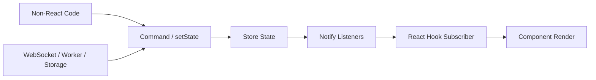

# Part 060 — Building a Mini Store from Scratch

Sekarang kita keluar dari Context.

Bukan karena Context buruk.
Tapi karena Context punya model distribusi yang berbeda dari store subscription.

Context menjawab:

```txt
Bagaimana value tersedia ke subtree?
```

Store menjawab:

```txt
Bagaimana consumer subscribe ke perubahan data tertentu?
```

Di part ini kita membangun mini store dari nol.
Tujuannya bukan membuat Redux/Zustand baru.
Tujuannya membongkar mesin mental di balik external store:

```txt
state lives outside React
components subscribe to snapshots
updates notify listeners
selectors reduce render blast radius
React adapter bridges external mutation into render model
```

Part ini sengaja membangun implementasi kecil.
Part berikutnya akan memperdalam `useSyncExternalStore` secara lebih formal.

---

## 1. Why Build a Store?

Kita butuh store ketika state:

```txt
- dibaca oleh banyak tempat yang tidak selalu satu subtree dekat
- butuh fine-grained subscription
- butuh diakses di luar React component
- berubah cukup sering sehingga Context fan-out mahal
- butuh middleware, persistence, devtools, logging, atau cross-tab sync
- punya normalized entity model yang banyak selector
```

Contoh:

```txt
- client-side editor state
- notification center local cache
- workspace selection across panels
- media player state
- collaborative document local presence
- feature shell state di microfrontend
- local entity map yang bukan server cache utama
```

Tetapi external store juga membawa risiko:

```txt
- hidden global coupling
- lifecycle tidak otomatis ikut component tree
- reset boundary harus eksplisit
- SSR/hydration harus dipikirkan
- mutation discipline harus kuat
```

---

## 2. Store Contract

Mini store paling kecil punya empat operasi:

```ts
type Store<State> = {
  getState(): State;
  setState(update: State | ((previous: State) => State)): void;
  subscribe(listener: () => void): () => void;
  destroy?(): void;
};
```

Kontraknya:

```txt
getState   → membaca snapshot terbaru
setState   → membuat state baru dan notify listener
subscribe  → register listener dan return unsubscribe
destroy    → optional cleanup untuk resource store
```

Untuk React integration modern, nama yang akan sering muncul:

```txt
getSnapshot = getState atau selector snapshot reader
subscribe   = listener registration
```

---

## 3. Mental Model



External store berdiri di luar React.
React hanya subscribe.

---

## 4. Start With the Core Store

```ts
type Listener = () => void;

type SetStateAction<State> = State | ((previous: State) => State);

export type Store<State> = {
  getState(): State;
  setState(action: SetStateAction<State>): void;
  subscribe(listener: Listener): () => void;
};

export function createStore<State>(initialState: State): Store<State> {
  let state = initialState;
  const listeners = new Set<Listener>();

  function getState() {
    return state;
  }

  function setState(action: SetStateAction<State>) {
    const nextState =
      typeof action === 'function'
        ? (action as (previous: State) => State)(state)
        : action;

    if (Object.is(nextState, state)) {
      return;
    }

    state = nextState;

    listeners.forEach((listener) => {
      listener();
    });
  }

  function subscribe(listener: Listener) {
    listeners.add(listener);

    return () => {
      listeners.delete(listener);
    };
  }

  return { getState, setState, subscribe };
}
```

Ini store paling sederhana.

Ia sudah punya:

```txt
- private mutable cell: state
- listener registry: Set<Listener>
- immutable-result expectation
- Object.is equality guard
- unsubscribe contract
```

---

## 5. Store State Is Mutable Internally, Immutable Externally

Store menyimpan variable mutable internal:

```ts
let state = initialState;
```

Itu tidak masalah karena variable ini bukan React state.

Yang penting: update menghasilkan snapshot baru.

Buruk:

```ts
store.setState((state) => {
  state.items.push(newItem);
  return state;
});
```

Karena reference sama, `Object.is(nextState, state)` true, listener tidak dipanggil.

Baik:

```ts
store.setState((state) => ({
  ...state,
  items: [...state.items, newItem],
}));
```

Rule:

```txt
Internal store cell boleh mutable.
Published state snapshot harus immutable secara semantik.
```

---

## 6. Add Partial Update Helper

Banyak store API membolehkan partial update.

```ts
type PartialStateAction<State> =
  | Partial<State>
  | ((previous: State) => Partial<State>);

export type ObjectStore<State extends object> = Store<State> & {
  patch(action: PartialStateAction<State>): void;
};

export function createObjectStore<State extends object>(
  initialState: State
): ObjectStore<State> {
  const store = createStore(initialState);

  function patch(action: PartialStateAction<State>) {
    store.setState((previous) => {
      const partial =
        typeof action === 'function'
          ? (action as (previous: State) => Partial<State>)(previous)
          : action;

      return { ...previous, ...partial };
    });
  }

  return { ...store, patch };
}
```

Partial update nyaman, tapi hati-hati.

Ia cocok untuk shallow state:

```ts
type PlayerState = {
  playing: boolean;
  volume: number;
  muted: boolean;
};
```

Ia berbahaya untuk nested state:

```ts
type EditorState = {
  document: {
    blocks: Block[];
    selection: Selection;
  };
};
```

Karena shallow merge bisa overwrite nested object tanpa sengaja.

---

## 7. Action Layer Above Store

Jangan biarkan semua component memanggil `patch` sembarangan.

Buruk:

```ts
workspaceStore.patch({ assignModal: { status: 'closed' } });
```

Lebih baik buat action/command API:

```ts
type WorkspaceState = {
  activeTab: 'summary' | 'timeline' | 'documents';
  selectedId: string | null;
  assignModal: { status: 'closed' } | { status: 'open'; caseId: string };
};

const workspaceStore = createObjectStore<WorkspaceState>({
  activeTab: 'summary',
  selectedId: null,
  assignModal: { status: 'closed' },
});

export const workspaceActions = {
  changeTab(tab: WorkspaceState['activeTab']) {
    workspaceStore.patch({ activeTab: tab });
  },

  selectEntity(id: string) {
    workspaceStore.patch({ selectedId: id });
  },

  clearSelection() {
    workspaceStore.patch({
      selectedId: null,
      assignModal: { status: 'closed' },
    });
  },

  openAssignModal(caseId: string) {
    workspaceStore.patch({ assignModal: { status: 'open', caseId } });
  },

  closeAssignModal() {
    workspaceStore.patch({ assignModal: { status: 'closed' } });
  },
};
```

Store core adalah mechanism.
Actions adalah policy.

---

## 8. Add Reducer Support

Kalau invariant makin kuat, gunakan reducer di atas store.

```ts
type Reducer<State, Action> = (state: State, action: Action) => State;

export function createReducerStore<State, Action>(
  reducer: Reducer<State, Action>,
  initialState: State
) {
  const store = createStore(initialState);

  function dispatch(action: Action) {
    store.setState((state) => reducer(state, action));
  }

  return {
    ...store,
    dispatch,
  };
}
```

Usage:

```ts
const workspaceStore = createReducerStore(workspaceReducer, initialWorkspaceState);

workspaceStore.dispatch({ type: 'tabChanged', tab: 'timeline' });
```

Sekarang transition system tetap pure, tetapi state hidup di external store.

---

## 9. React Adapter: Minimal Version

React membutuhkan cara untuk:

```txt
- subscribe ke store
- membaca snapshot saat render
- rerender saat snapshot berubah
```

Modern React menyediakan `useSyncExternalStore` untuk ini.

```tsx
import { useSyncExternalStore } from 'react';

export function useStore<State>(store: Store<State>): State {
  return useSyncExternalStore(
    store.subscribe,
    store.getState,
    store.getState
  );
}
```

Usage:

```tsx
function ActiveTab() {
  const state = useStore(workspaceStore);

  return <p>Active tab: {state.activeTab}</p>;
}
```

Tiga argument:

```txt
subscribe          → how React subscribes
getSnapshot        → how React reads client snapshot
getServerSnapshot  → how React reads initial server snapshot / hydration snapshot
```

Di app client-only, argument ketiga sering sama dengan `getState`.
Di SSR, ini butuh desain lebih serius.

---

## 10. Problem: Whole-Store Subscription

Hook di atas subscribe ke seluruh state.

```tsx
const state = useStore(workspaceStore);
```

Kalau `selectedId` berubah, component yang cuma membaca `activeTab` tetap rerender.

Kita butuh selector.

---

## 11. Selector Hook: First Attempt

```tsx
export function useStoreSelector<State, Selected>(
  store: Store<State>,
  selector: (state: State) => Selected
): Selected {
  return useSyncExternalStore(
    store.subscribe,
    () => selector(store.getState()),
    () => selector(store.getState())
  );
}
```

Usage:

```tsx
function ActiveTab() {
  const activeTab = useStoreSelector(
    workspaceStore,
    (state) => state.activeTab
  );

  return <p>{activeTab}</p>;
}
```

Ini bekerja jika selected value stabil.

Baik:

```ts
(state) => state.activeTab
(state) => state.selectedId
(state) => state.assignModal.status
```

Berbahaya:

```ts
(state) => ({ activeTab: state.activeTab })
(state) => state.items.filter((item) => item.visible)
```

Karena selector membuat object/array baru setiap call.
React bisa melihat snapshot berubah terus.

---

## 12. Snapshot Must Be Cached

`getSnapshot` tidak boleh mengembalikan object baru setiap pemanggilan kalau data sebenarnya tidak berubah.

Buruk:

```tsx
useSyncExternalStore(
  store.subscribe,
  () => ({ activeTab: store.getState().activeTab })
);
```

Ini seperti mengatakan:

```txt
Snapshot baru setiap render.
```

Untuk selector object, perlu memoization/equality.

---

## 13. Selector with Equality

Kita buat hook selector dengan cache lokal per subscription.

```tsx
import { useRef, useSyncExternalStore } from 'react';

type EqualityFn<T> = (a: T, b: T) => boolean;

const objectIs: EqualityFn<unknown> = Object.is;

export function useStoreSelector<State, Selected>(
  store: Store<State>,
  selector: (state: State) => Selected,
  equalityFn: EqualityFn<Selected> = objectIs as EqualityFn<Selected>
): Selected {
  const lastRef = useRef<{
    state: State;
    selected: Selected;
  } | null>(null);

  function getSelectedSnapshot() {
    const state = store.getState();
    const last = lastRef.current;

    if (last && Object.is(last.state, state)) {
      return last.selected;
    }

    const selected = selector(state);

    if (last && equalityFn(last.selected, selected)) {
      lastRef.current = { state, selected: last.selected };
      return last.selected;
    }

    lastRef.current = { state, selected };
    return selected;
  }

  return useSyncExternalStore(
    store.subscribe,
    getSelectedSnapshot,
    getSelectedSnapshot
  );
}
```

Sekarang selector boleh menghasilkan object jika equality function benar.

```tsx
const summary = useStoreSelector(
  workspaceStore,
  (state) => ({
    activeTab: state.activeTab,
    selectedId: state.selectedId,
  }),
  shallowEqual
);
```

Shallow equal:

```ts
export function shallowEqual<T extends Record<string, unknown>>(a: T, b: T) {
  if (Object.is(a, b)) return true;

  const aKeys = Object.keys(a);
  const bKeys = Object.keys(b);

  if (aKeys.length !== bKeys.length) return false;

  for (const key of aKeys) {
    if (!Object.prototype.hasOwnProperty.call(b, key)) return false;
    if (!Object.is(a[key], b[key])) return false;
  }

  return true;
}
```

---

## 14. Stable Store Instance

Jangan membuat store baru di render tanpa alasan.

Buruk:

```tsx
function WorkspacePage() {
  const store = createStore(initialState);
  return <Workspace store={store} />;
}
```

Setiap render membuat store baru.
Subscription reset.
State hilang.

Jika store scoped ke component instance, pakai ref:

```tsx
function useConstant<T>(create: () => T): T {
  const ref = useRef<T | null>(null);

  if (ref.current === null) {
    ref.current = create();
  }

  return ref.current;
}

function WorkspacePage({ caseId }: { caseId: string }) {
  const store = useConstant(() => createWorkspaceStore(caseId));

  return <WorkspaceStoreProvider store={store} />;
}
```

Jika identity `caseId` harus reset, gunakan `key` di boundary parent:

```tsx
<WorkspacePage key={caseId} caseId={caseId} />
```

---

## 15. Store Through Context

External store sering tetap dibagikan lewat Context.

Bedanya: Context membawa **store instance stabil**, bukan state yang berubah.

```tsx
const WorkspaceStoreContext = createContext<WorkspaceStore | null>(null);

export function WorkspaceStoreProvider({
  store,
  children,
}: {
  store: WorkspaceStore;
  children: React.ReactNode;
}) {
  return (
    <WorkspaceStoreContext.Provider value={store}>
      {children}
    </WorkspaceStoreContext.Provider>
  );
}

export function useWorkspaceStore() {
  const store = useContext(WorkspaceStoreContext);
  if (!store) throw new Error('useWorkspaceStore must be used inside WorkspaceStoreProvider');
  return store;
}
```

Read hook:

```tsx
export function useWorkspaceSelector<Selected>(
  selector: (state: WorkspaceState) => Selected,
  equalityFn?: EqualityFn<Selected>
) {
  const store = useWorkspaceStore();
  return useStoreSelector(store, selector, equalityFn);
}
```

Action hook:

```tsx
export function useWorkspaceActions() {
  const store = useWorkspaceStore();
  return store.actions;
}
```

Context value stabil.
State changes notify via store subscription, bukan context propagation.

---

## 16. Create a Feature Store Factory

```ts
type WorkspaceStore = Store<WorkspaceState> & {
  actions: {
    changeTab(tab: WorkspaceTab): void;
    selectEntity(id: string): void;
    clearSelection(): void;
    openAssignModal(caseId: string): void;
    closeAssignModal(): void;
  };
};

export function createWorkspaceStore(caseId: string): WorkspaceStore {
  const store = createObjectStore<WorkspaceState>({
    caseId,
    activeTab: 'summary',
    selectedId: null,
    assignModal: { status: 'closed' },
  });

  return {
    ...store,
    actions: {
      changeTab(tab) {
        store.patch({ activeTab: tab });
      },

      selectEntity(id) {
        store.patch({ selectedId: id });
      },

      clearSelection() {
        store.patch({ selectedId: null, assignModal: { status: 'closed' } });
      },

      openAssignModal(caseId) {
        store.patch({ assignModal: { status: 'open', caseId } });
      },

      closeAssignModal() {
        store.patch({ assignModal: { status: 'closed' } });
      },
    },
  };
}
```

Usage:

```tsx
function CaseWorkspaceRoute({ caseId }: { caseId: string }) {
  const store = useConstant(() => createWorkspaceStore(caseId));

  return (
    <WorkspaceStoreProvider store={store}>
      <CaseWorkspacePage />
    </WorkspaceStoreProvider>
  );
}
```

---

## 17. Component Subscription

```tsx
function WorkspaceTabs() {
  const activeTab = useWorkspaceSelector((state) => state.activeTab);
  const actions = useWorkspaceActions();

  return (
    <Tabs value={activeTab} onValueChange={actions.changeTab}>
      <Tabs.Trigger value="summary">Summary</Tabs.Trigger>
      <Tabs.Trigger value="timeline">Timeline</Tabs.Trigger>
      <Tabs.Trigger value="documents">Documents</Tabs.Trigger>
    </Tabs>
  );
}

function AssignModal() {
  const modal = useWorkspaceSelector((state) => state.assignModal);
  const actions = useWorkspaceActions();

  if (modal.status === 'closed') return null;

  return (
    <Dialog open onOpenChange={(open) => !open && actions.closeAssignModal()}>
      <AssignForm caseId={modal.caseId} />
    </Dialog>
  );
}
```

Jika `activeTab` berubah, `AssignModal` tidak perlu rerender jika selector result `assignModal` tetap sama reference.

Itulah perbedaan external store selector subscription dengan Context state consumer.

---

## 18. Immutable Update Discipline

Selector optimization hanya bekerja jika state update menjaga reference yang tidak berubah.

Buruk:

```ts
store.setState((state) => ({
  ...state,
  assignModal: { ...state.assignModal },
}));
```

Walaupun secara nilai sama, reference `assignModal` berubah.
Consumer `state.assignModal` akan rerender.

Baik:

```ts
store.setState((state) => {
  if (state.assignModal.status === 'closed') return state;
  return { ...state, assignModal: { status: 'closed' } };
});
```

Rule:

```txt
Only create new references for branches that actually changed.
```

---

## 19. Notify Strategy

Store pertama kita notify listener synchronously:

```ts
listeners.forEach((listener) => listener());
```

Ini sederhana dan predictable.

Tapi jika beberapa `setState` dipanggil berurutan:

```ts
store.patch({ selectedId: 'A' });
store.patch({ activeTab: 'timeline' });
store.patch({ assignModal: { status: 'closed' } });
```

listener dipanggil tiga kali.

Kita bisa membuat batching notification sederhana.

---

## 20. Microtask Batched Notification

```ts
export function createBatchedStore<State>(initialState: State): Store<State> {
  let state = initialState;
  const listeners = new Set<Listener>();
  let scheduled = false;

  function getState() {
    return state;
  }

  function flush() {
    scheduled = false;
    listeners.forEach((listener) => listener());
  }

  function scheduleNotify() {
    if (scheduled) return;
    scheduled = true;
    queueMicrotask(flush);
  }

  function setState(action: SetStateAction<State>) {
    const nextState =
      typeof action === 'function'
        ? (action as (previous: State) => State)(state)
        : action;

    if (Object.is(nextState, state)) return;

    state = nextState;
    scheduleNotify();
  }

  function subscribe(listener: Listener) {
    listeners.add(listener);
    return () => listeners.delete(listener);
  }

  return { getState, setState, subscribe };
}
```

Trade-off:

| Strategy | Benefit | Risk |
|---|---|---|
| sync notify | immediate, simple | many notifications |
| microtask batch | coalesces same tick updates | observer sees update after microtask |
| explicit batch API | precise | more API complexity |

Untuk mini store, sync notify sering cukup.
Untuk production store, batching perlu policy jelas.

---

## 21. Prevent Reentrant Update Surprises

Apa yang terjadi jika listener memanggil `setState` lagi?

```ts
store.subscribe(() => {
  if (store.getState().count < 10) {
    store.setState((s) => ({ count: s.count + 1 }));
  }
});
```

Bisa menjadi loop.

Guard sederhana:

```ts
let isNotifying = false;

function notify() {
  if (isNotifying) {
    throw new Error('Store does not support reentrant notification');
  }

  isNotifying = true;
  try {
    listeners.forEach((listener) => listener());
  } finally {
    isNotifying = false;
  }
}
```

Atau izinkan reentrant update dengan queue.

Untuk mini store, lebih baik fail-fast.
Untuk production store, definisikan policy.

---

## 22. Middleware-Like Wrapper

Kita bisa membungkus `setState` untuk logging.

```ts
export function withLogger<State>(store: Store<State>, name: string): Store<State> {
  return {
    ...store,
    setState(action) {
      const previous = store.getState();
      store.setState(action);
      const next = store.getState();

      if (!Object.is(previous, next)) {
        console.debug(`[${name}] state changed`, { previous, next });
      }
    },
  };
}
```

Tapi logging seluruh state bisa mahal dan berbahaya untuk data sensitif.

Lebih aman log command-level event:

```ts
workspaceActions.changeTab('timeline');
```

```txt
workspace.tab_changed { from: 'summary', to: 'timeline' }
```

---

## 23. Persistence Boundary

Store bisa dipersist, tapi jangan otomatis persist semua state.

```ts
function persistStore<State>({
  store,
  key,
  serialize = JSON.stringify,
}: {
  store: Store<State>;
  key: string;
  serialize?: (state: State) => string;
}) {
  return store.subscribe(() => {
    localStorage.setItem(key, serialize(store.getState()));
  });
}
```

Masalah:

```txt
- localStorage synchronous
- data bisa sensitif
- schema bisa berubah
- state bisa terlalu besar
- every update bisa write terlalu sering
```

Lebih baik persist subset:

```ts
persistStore({
  store,
  key: 'workspace.preferences.v1',
  serialize(state) {
    return JSON.stringify({ activeTab: state.activeTab });
  },
});
```

Dan load dengan validation:

```ts
function loadWorkspacePreferences(): Partial<WorkspaceState> {
  const raw = localStorage.getItem('workspace.preferences.v1');
  if (!raw) return {};

  try {
    const parsed = JSON.parse(raw);

    if (
      parsed &&
      typeof parsed === 'object' &&
      ['summary', 'timeline', 'documents'].includes(parsed.activeTab)
    ) {
      return { activeTab: parsed.activeTab };
    }
  } catch {
    // ignore corrupted storage
  }

  return {};
}
```

---

## 24. Cross-Tab Sync Boundary

Storage event bisa sinkronisasi antar tab.

```ts
function subscribeToStorageKey(key: string, onChange: () => void) {
  window.addEventListener('storage', (event) => {
    if (event.key === key) onChange();
  });
}
```

Untuk store:

```ts
function syncStoreFromStorage<State>(
  store: Store<State>,
  key: string,
  parse: (raw: string) => State | null
) {
  function onStorage(event: StorageEvent) {
    if (event.key !== key || event.newValue == null) return;

    const next = parse(event.newValue);
    if (next) store.setState(next);
  }

  window.addEventListener('storage', onStorage);

  return () => window.removeEventListener('storage', onStorage);
}
```

Catatan: tab yang melakukan `localStorage.setItem` biasanya tidak menerima `storage` event untuk write-nya sendiri. Ia sudah punya state lokal.

Untuk sync yang lebih eksplisit, gunakan `BroadcastChannel` jika sesuai.

---

## 25. Store Lifetime

External store bisa punya lifetime berbeda.

| Lifetime | Cara membuat | Contoh |
|---|---|---|
| Module singleton | `export const store = createStore(...)` | app shell preference |
| Per route | create in route component with `useRef` | workspace state |
| Per component instance | create in component boundary | editor local store |
| Per request SSR | create per request | auth/session-scoped data |
| Per microfrontend mount | create on bootstrap | isolated remote app |

Jangan default ke singleton.

Singleton adalah global state.
Ia sulit direset, sulit dites, dan rawan data leak di SSR jika dipakai salah.

---

## 26. SSR and Hydration

Untuk SSR, store harus punya snapshot server yang sama dengan snapshot awal client.

Buruk:

```ts
const store = createStore({ theme: localStorage.getItem('theme') });
```

Server tidak punya `localStorage`.
Client initial snapshot bisa berbeda dari HTML server.

Lebih baik:

```ts
function createThemeStore(initialTheme: Theme) {
  return createStore({ theme: initialTheme });
}
```

Server menentukan initial snapshot yang bisa diserialisasi.
Client hydrate dengan initial snapshot yang sama.

Setelah hydrate, effect boleh membaca browser-only storage dan update store jika perlu.

---

## 27. Error Policy

Apa yang terjadi jika listener error?

```ts
listeners.forEach((listener) => listener());
```

Jika satu listener throw, listener berikutnya tidak dipanggil.

Option:

```ts
function notify() {
  const errors: unknown[] = [];

  listeners.forEach((listener) => {
    try {
      listener();
    } catch (error) {
      errors.push(error);
    }
  });

  if (errors.length > 0) {
    queueMicrotask(() => {
      throw new AggregateError(errors, 'Store listener errors');
    });
  }
}
```

Untuk mini store, fail-fast cukup.
Untuk shared production store, listener isolation bisa lebih aman.

---

## 28. Devtools Snapshot

Karena store punya `getState`, kita bisa expose debug API.

```ts
if (process.env.NODE_ENV !== 'production') {
  Object.assign(window, {
    __workspaceStore: workspaceStore,
  });
}
```

Hati-hati:

```txt
- jangan expose data sensitif
- jangan expose di production
- jangan biarkan debug API menjadi dependency test/feature
```

---

## 29. Build a Tiny Entity Store

Normalized entity store:

```ts
type EntityId = string;

type EntityState<T> = {
  ids: EntityId[];
  byId: Record<EntityId, T>;
};

function createEntityStore<T extends { id: EntityId }>() {
  const store = createObjectStore<EntityState<T>>({
    ids: [],
    byId: {},
  });

  return {
    ...store,
    upsert(entity: T) {
      store.setState((state) => {
        const exists = Object.prototype.hasOwnProperty.call(state.byId, entity.id);

        return {
          ids: exists ? state.ids : [...state.ids, entity.id],
          byId: {
            ...state.byId,
            [entity.id]: entity,
          },
        };
      });
    },

    remove(id: EntityId) {
      store.setState((state) => {
        if (!Object.prototype.hasOwnProperty.call(state.byId, id)) return state;

        const { [id]: removed, ...byId } = state.byId;

        return {
          ids: state.ids.filter((currentId) => currentId !== id),
          byId,
        };
      });
    },
  };
}
```

Selectors:

```ts
const selectAll = <T,>(state: EntityState<T>) =>
  state.ids.map((id) => state.byId[id]);

const selectById = <T,>(id: EntityId) => (state: EntityState<T>) =>
  state.byId[id] ?? null;
```

Memoization of `selectAll` needs care because `map` returns a new array.
For production, build memoized selectors or use a mature library.

---

## 30. Store vs Reducer + Context

| Dimension | Reducer + Context | External Store |
|---|---|---|
| State location | Inside React provider | Outside React |
| Distribution | Context propagation | Subscription |
| Fine-grained read | Limited | Strong with selectors |
| Reset boundary | Component tree/key | Explicit store lifetime |
| Access outside React | Awkward | Natural |
| SSR risk | Lower if provider scoped | Higher if singleton misused |
| Boilerplate | Lower | Medium |
| Debug/control | Medium | High |
| Best for | scoped subtree workflow | shared/frequent/fine-grained state |

---

## 31. Store vs Server-State Cache

External client store is not automatically a server-state cache.

Server-state cache needs:

```txt
- freshness policy
- stale time
- garbage collection
- request deduplication
- retry
- cancellation
- invalidation
- mutation lifecycle
- optimistic rollback
```

Mini store does not provide those.

If state authority is server, use a query/cache tool or framework data layer.

Use mini/external store for:

```txt
- UI/session/workspace state
- local editor state
- normalized client-only entities
- cross-component client commands
```

not for:

```txt
- primary server data cache with freshness requirements
```

---

## 32. Failure Modes

### 32.1 Store Created During Render

Gejala:

```txt
state reset setiap render, subscriptions churn
```

Fix:

```txt
create at module scope, provider init, or useRef/useConstant boundary.
```

### 32.2 Singleton Used for Request-Scoped Data

Gejala:

```txt
SSR data user A bocor ke user B.
```

Fix:

```txt
create store per request/per route/per session boundary.
```

### 32.3 Mutable State Snapshot

Gejala:

```ts
store.getState().items.push(item)
```

Fix:

```txt
freeze in dev, hide raw mutation API, enforce immutable updates.
```

Dev freeze helper:

```ts
function freezeDev<T>(value: T): T {
  if (process.env.NODE_ENV !== 'production' && typeof value === 'object' && value !== null) {
    return Object.freeze(value);
  }

  return value;
}
```

### 32.4 Selector Returns New Object Always

Gejala:

```txt
infinite rerender warning or constant rerender
```

Fix:

```txt
return stable primitive/reference, use memoized selector, or pass equality function.
```

### 32.5 Store Becomes Event Bus

Gejala:

```txt
state tidak penting, semua setState hanya untuk trigger something.
```

Fix:

```txt
Use event bus for events, store for state snapshots.
```

### 32.6 No Reset Semantics

Gejala:

```txt
old workspace selection persists into new case/document/user.
```

Fix:

```txt
define lifetime and recreate store on identity boundary.
```

### 32.7 Derived State Stored Without Invalidation

Gejala:

```txt
visibleItems stale setelah filter berubah.
```

Fix:

```txt
store source data and filter; derive visibleItems with selector/memoization.
```

---

## 33. Test the Store Without React

```ts
describe('workspaceStore', () => {
  it('notifies subscribers after state changes', () => {
    const store = createObjectStore({ count: 0 });
    const listener = vi.fn();

    const unsubscribe = store.subscribe(listener);

    store.patch({ count: 1 });

    expect(listener).toHaveBeenCalledTimes(1);
    expect(store.getState().count).toBe(1);

    unsubscribe();
    store.patch({ count: 2 });

    expect(listener).toHaveBeenCalledTimes(1);
  });
});
```

Test selector behavior separately:

```ts
it('preserves unchanged branch reference', () => {
  const initial = {
    a: { value: 1 },
    b: { value: 2 },
  };

  const store = createStore(initial);

  store.setState((state) => ({
    ...state,
    a: { value: 10 },
  }));

  expect(store.getState().b).toBe(initial.b);
});
```

---

## 34. Test React Integration

```tsx
function CounterView({ store }: { store: Store<{ count: number }> }) {
  const count = useStoreSelector(store, (state) => state.count);
  return <span>{count}</span>;
}

it('renders store updates', () => {
  const store = createObjectStore({ count: 0 });

  render(<CounterView store={store} />);

  expect(screen.getByText('0')).toBeInTheDocument();

  act(() => {
    store.patch({ count: 1 });
  });

  expect(screen.getByText('1')).toBeInTheDocument();
});
```

External store updates in tests should be wrapped in `act` because React needs to flush update effects for assertions.

---

## 35. Production Checklist

```txt
[ ] Is the store lifetime explicit?
[ ] Is this state truly client-owned?
[ ] Is server state kept in query/cache layer instead?
[ ] Does setState avoid unnecessary branch reference changes?
[ ] Are actions/commands exposed instead of raw patch everywhere?
[ ] Does subscribe return a correct unsubscribe function?
[ ] Does getSnapshot return cached/stable values?
[ ] Are selectors stable or paired with equality?
[ ] Is persistence scoped, validated, versioned, and privacy-reviewed?
[ ] Does SSR create store per request/session where needed?
[ ] Are high-frequency updates batched or contained?
[ ] Are tests covering subscription, unsubscribe, equality, and reset?
[ ] Is there a migration path to Zustand/Redux Toolkit if scope grows?
```

---

## 36. Engineering Heuristic

A store is not just “state outside React”.

A store is a contract:

```txt
snapshot + subscription + update policy + lifetime
```

If any part is vague, bugs follow.

```txt
No lifetime   → stale/leaked state
No snapshot   → tearing or infinite rerender
No policy     → illegal mutation
No selector   → performance fan-out
No reset      → cross-entity contamination
No authority  → duplicate source of truth
```

The mini store we built is intentionally small, but the mental model scales:

```txt
create state cell
expose snapshot reader
register listeners
publish new immutable snapshot
connect React through subscription
select only what component needs
control lifetime explicitly
```

That is the skeleton underneath many client state libraries.

---

## 37. References

- React Docs — `useSyncExternalStore`: https://react.dev/reference/react/useSyncExternalStore
- React Docs — `useContext`: https://react.dev/reference/react/useContext
- React Docs — Components and Hooks Must Be Pure: https://react.dev/reference/rules/components-and-hooks-must-be-pure
- React Docs — State as a Snapshot: https://react.dev/learn/state-as-a-snapshot
- MDN — Web Storage API: https://developer.mozilla.org/en-US/docs/Web/API/Web_Storage_API
- MDN — BroadcastChannel: https://developer.mozilla.org/en-US/docs/Web/API/BroadcastChannel
