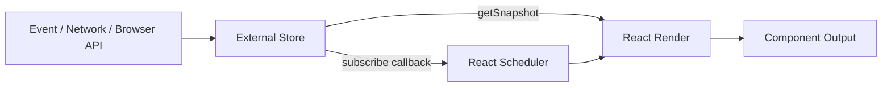

# Part 061 — `useSyncExternalStore` Deep Dive

`useSyncExternalStore` adalah hook yang sering terlihat kecil, tetapi secara arsitektural ia adalah **kontrak resmi React untuk membaca data dari sumber eksternal**.

Sumber eksternal berarti: data yang hidup **di luar React state**, berubah melalui mekanisme non-React, dan harus dibaca secara konsisten oleh component React.

Contoh:

- custom store buatan sendiri,
- Zustand/Redux-like store,
- browser API seperti `navigator.onLine`, `matchMedia`, `localStorage`, `BroadcastChannel`,
- websocket-backed in-memory store,
- microfrontend shell store,
- cache client di luar React,
- service object yang punya mekanisme subscribe sendiri.

Hook ini bukan sekadar "cara bikin global state". Ia adalah boundary antara dua runtime:

```txt
External mutable world  <->  React render world
```

React butuh jaminan bahwa ketika ia sedang render, nilai yang dibaca dari external source tidak membuat UI mengalami **tearing**: bagian UI berbeda membaca versi data yang berbeda dalam satu render pass.

---

## 1. Masalah yang Diselesaikan

Sebelum memahami API, pahami dulu masalahnya.

React state punya aturan:

```txt
render membaca snapshot state tertentu
update membuat snapshot berikutnya
React mengontrol kapan render dimulai, dibatalkan, diulang, atau di-commit
```

External store tidak otomatis mengikuti aturan itu.

External store bisa berubah kapan saja:

```ts
store.setState({ count: 1 });
store.setState({ count: 2 });
```

Jika component membaca `store.getState()` langsung di render, React tidak punya kontrak subscription dan snapshot consistency.

```tsx
function Counter() {
  // ❌ Tidak aman sebagai pola umum
  const count = store.getState().count;
  return <div>{count}</div>;
}
```

Masalahnya bukan hanya "component tidak rerender". Masalah yang lebih dalam:

1. React tidak tahu kapan store berubah.
2. React tidak tahu apakah snapshot yang sama masih berlaku.
3. React tidak bisa memastikan consistency saat concurrent rendering.
4. React tidak bisa melakukan SSR/hydration dengan benar tanpa snapshot server.
5. Component bisa membaca mutable object yang berubah di tengah render.

`useSyncExternalStore` memperkenalkan kontrak formal agar React bisa membaca external store dengan aman.

---

## 2. Bentuk API

```tsx
import { useSyncExternalStore } from 'react';

const snapshot = useSyncExternalStore(
  subscribe,
  getSnapshot,
  getServerSnapshot?
);
```

Tiga parameter ini adalah boundary contract:

| Parameter | Tanggung Jawab |
|---|---|
| `subscribe(callback)` | Memberi tahu React saat external store berubah |
| `getSnapshot()` | Mengembalikan nilai saat ini yang akan dipakai render |
| `getServerSnapshot()` | Mengembalikan snapshot awal untuk SSR/hydration |

Kontrak paling penting:

```txt
Jika data external store tidak berubah,
getSnapshot harus mengembalikan nilai yang sama menurut Object.is.

Jika data external store berubah,
getSnapshot harus mengembalikan snapshot baru.
```

Inilah inti desainnya.

---

## 3. Mental Model: Store Owns Mutation, React Owns Rendering



External store boleh mutable secara internal, tetapi React hanya boleh menerima **snapshot yang stabil**.

Jangan berikan React objek internal yang bisa berubah diam-diam.

```txt
Internal store boleh mutable.
Snapshot untuk React harus punya identity semantics yang benar.
```

Bayangkan external store seperti database kecil.

- `setState` = write transaction
- `getSnapshot` = read snapshot
- `subscribe` = change notification
- React render = query consumer

Jika snapshot bisa berubah tanpa identity berubah, UI bisa stale.
Jika snapshot selalu identity baru, UI bisa rerender terus.

---

## 4. Store Minimal yang Benar

Kita mulai dari store paling kecil.

```tsx
type Listener = () => void;

type CounterState = {
  count: number;
};

function createCounterStore(initialState: CounterState) {
  let state = initialState;
  const listeners = new Set<Listener>();

  return {
    getSnapshot() {
      return state;
    },

    subscribe(listener: Listener) {
      listeners.add(listener);
      return () => {
        listeners.delete(listener);
      };
    },

    increment() {
      state = {
        ...state,
        count: state.count + 1,
      };

      for (const listener of listeners) {
        listener();
      }
    },
  };
}

const counterStore = createCounterStore({ count: 0 });

export function useCounterStore() {
  return useSyncExternalStore(
    counterStore.subscribe,
    counterStore.getSnapshot,
    counterStore.getSnapshot
  );
}
```

Usage:

```tsx
function Counter() {
  const state = useCounterStore();

  return (
    <button onClick={counterStore.increment}>
      Count: {state.count}
    </button>
  );
}
```

Yang benar di sini:

1. `state` diganti dengan object baru saat berubah.
2. `getSnapshot()` mengembalikan object yang sama selama tidak ada perubahan.
3. `subscribe()` mengembalikan cleanup function.
4. listener dipanggil setelah state berubah.

---

## 5. Kontrak `getSnapshot`

`getSnapshot` bukan tempat membuat object baru sembarangan.

Ini salah:

```tsx
function getSnapshot() {
  // ❌ Object baru setiap call
  return {
    count: state.count,
  };
}
```

Walaupun `count` sama, object identity selalu baru.
React dapat menganggap snapshot berubah terus.

Yang benar:

```tsx
function getSnapshot() {
  // ✅ Mengembalikan cached snapshot
  return state;
}
```

Atau jika internal store mutable, buat cache snapshot eksplisit.

```tsx
type MutableStore = {
  count: number;
  version: number;
};

const internal: MutableStore = {
  count: 0,
  version: 0,
};

let cachedVersion = internal.version;
let cachedSnapshot = {
  count: internal.count,
};

function getSnapshot() {
  if (cachedVersion !== internal.version) {
    cachedVersion = internal.version;
    cachedSnapshot = {
      count: internal.count,
    };
  }

  return cachedSnapshot;
}
```

Rule-nya sederhana tetapi keras:

```txt
getSnapshot harus murah, pure dari sudut pandang caller, dan stable ketika store belum berubah.
```

---

## 6. Kontrak `subscribe`

`subscribe` menerima callback dari React.
Callback itu harus dipanggil setiap kali snapshot yang relevan mungkin berubah.

```tsx
function subscribe(listener: () => void) {
  listeners.add(listener);
  return () => listeners.delete(listener);
}
```

Jangan lakukan ini:

```tsx
function subscribe(listener: () => void) {
  listeners.add(listener);

  // ❌ Tidak ada cleanup
}
```

Jangan juga membuat subscription berbeda setiap render tanpa alasan.

```tsx
function Component({ userId }: { userId: string }) {
  const snapshot = useSyncExternalStore(
    // ⚠️ Function baru setiap render
    (listener) => userStore.subscribe(userId, listener),
    () => userStore.getSnapshot(userId)
  );

  return <UserView user={snapshot} />;
}
```

Kadang ini valid karena `userId` memang mengubah subscription scope. Tetapi kalau tidak perlu, stabilkan function.

```tsx
const subscribe = store.subscribe;
const getSnapshot = store.getSnapshot;

function Component() {
  const snapshot = useSyncExternalStore(subscribe, getSnapshot);
  return <View snapshot={snapshot} />;
}
```

Jika subscription tergantung parameter, bungkus dalam custom hook dan pastikan semantics-nya jelas.

```tsx
function useUserSnapshot(userId: string) {
  return useSyncExternalStore(
    (listener) => userStore.subscribeUser(userId, listener),
    () => userStore.getUserSnapshot(userId),
    () => userStore.getServerUserSnapshot(userId)
  );
}
```

---

## 7. Timing Mutation dan Notification

Urutan yang benar:

```txt
1. mutate store
2. publish notification
3. React calls getSnapshot
4. React renders with latest snapshot
```

Kode:

```tsx
function setState(nextState: State) {
  state = nextState;

  for (const listener of listeners) {
    listener();
  }
}
```

Jangan publish sebelum state berubah.

```tsx
function setState(nextState: State) {
  // ❌ listener membaca snapshot lama
  for (const listener of listeners) {
    listener();
  }

  state = nextState;
}
```

Jangan publish secara async tanpa alasan.

```tsx
function setState(nextState: State) {
  state = nextState;

  // ⚠️ Bisa membuat UI membaca state lama lebih lama dari yang diharapkan
  setTimeout(() => {
    for (const listener of listeners) listener();
  });
}
```

External store boleh punya batching internal, tetapi semantics harus jelas.

---

## 8. External Store Bukan React State

Kesalahan umum: memakai external store untuk semua hal karena terlihat mudah.

```txt
Jika state hanya dibutuhkan satu component kecil,
jangan naikkan ke external store.
```

External store punya biaya:

- lifecycle lebih panjang,
- debugging lebih sulit,
- coupling lebih tersembunyi,
- reset semantics harus manual,
- SSR/hydration butuh perhatian,
- selector/equality perlu benar,
- testing butuh store isolation.

Gunakan external store ketika ada alasan arsitektural:

| Kebutuhan | External Store Masuk Akal? |
|---|---:|
| Dibaca banyak subtree jauh | Ya |
| Diubah dari luar React | Ya |
| Perlu subscription custom | Ya |
| Perlu microfrontend bridge | Ya |
| Perlu state lokal satu form | Tidak |
| Perlu server cache | Biasanya gunakan query cache |
| Perlu workflow state kompleks | Pertimbangkan reducer/machine dulu |

---

## 9. Browser API Example: Online Status

Browser API seperti `online/offline` adalah external source.

```tsx
import { useSyncExternalStore } from 'react';

function subscribe(callback: () => void) {
  window.addEventListener('online', callback);
  window.addEventListener('offline', callback);

  return () => {
    window.removeEventListener('online', callback);
    window.removeEventListener('offline', callback);
  };
}

function getSnapshot() {
  return navigator.onLine;
}

function getServerSnapshot() {
  return true;
}

export function useOnlineStatus() {
  return useSyncExternalStore(
    subscribe,
    getSnapshot,
    getServerSnapshot
  );
}
```

Mengapa bukan `useEffect + useState`?

```tsx
function useOnlineStatusEffectBased() {
  const [online, setOnline] = useState(navigator.onLine);

  useEffect(() => {
    const update = () => setOnline(navigator.onLine);
    window.addEventListener('online', update);
    window.addEventListener('offline', update);

    return () => {
      window.removeEventListener('online', update);
      window.removeEventListener('offline', update);
    };
  }, []);

  return online;
}
```

Pola effect-based masih sering bekerja. Tetapi `useSyncExternalStore` memberi kontrak yang lebih langsung:

```txt
React, ini cara subscribe.
React, ini cara membaca snapshot saat render.
React, ini snapshot server saat hydration.
```

---

## 10. Browser API Example: `localStorage`

`localStorage` adalah persistent external store. Tetapi hati-hati: event `storage` hanya otomatis muncul di tab/window lain, bukan di tab yang sama yang melakukan write.

Kita butuh publish sendiri untuk same-tab updates.

```tsx
type Listener = () => void;

function createLocalStorageStore<T>(key: string, fallback: T) {
  const listeners = new Set<Listener>();

  function read(): T {
    if (typeof window === 'undefined') return fallback;

    const raw = window.localStorage.getItem(key);
    if (raw == null) return fallback;

    try {
      return JSON.parse(raw) as T;
    } catch {
      return fallback;
    }
  }

  let cachedRaw: string | null = null;
  let cachedValue: T = fallback;

  function getSnapshot(): T {
    const raw = window.localStorage.getItem(key);

    if (raw === cachedRaw) {
      return cachedValue;
    }

    cachedRaw = raw;
    cachedValue = read();
    return cachedValue;
  }

  function getServerSnapshot(): T {
    return fallback;
  }

  function emit() {
    for (const listener of listeners) {
      listener();
    }
  }

  function set(value: T) {
    window.localStorage.setItem(key, JSON.stringify(value));
    emit();
  }

  function subscribe(listener: Listener) {
    listeners.add(listener);

    function onStorage(event: StorageEvent) {
      if (event.key === key) {
        listener();
      }
    }

    window.addEventListener('storage', onStorage);

    return () => {
      listeners.delete(listener);
      window.removeEventListener('storage', onStorage);
    };
  }

  return {
    getSnapshot,
    getServerSnapshot,
    subscribe,
    set,
  };
}
```

Usage:

```tsx
const sidebarStore = createLocalStorageStore('sidebar:v1', {
  collapsed: false,
});

function useSidebarPrefs() {
  return useSyncExternalStore(
    sidebarStore.subscribe,
    sidebarStore.getSnapshot,
    sidebarStore.getServerSnapshot
  );
}
```

Catatan desain:

1. Parsing JSON dilakukan dengan cache berbasis raw string.
2. Same-tab write memanggil `emit()` sendiri.
3. Cross-tab write ditangkap via `storage` event.
4. SSR diberi fallback yang deterministic.

---

## 11. SSR dan Hydration Boundary

`getServerSnapshot` dipakai untuk snapshot awal saat server render dan hydration client.

```tsx
useSyncExternalStore(
  subscribe,
  getSnapshot,
  getServerSnapshot
);
```

Kontrak penting:

```txt
Nilai getServerSnapshot saat server render
harus match dengan nilai awal hydration di client.
```

Jika tidak match, UI bisa hydration mismatch.

Contoh buruk:

```tsx
function getServerSnapshot() {
  return Math.random(); // ❌ nondeterministic
}
```

Contoh valid:

```tsx
function getServerSnapshot() {
  return initialStoreSnapshotFromServer;
}
```

Untuk aplikasi SSR nyata, snapshot biasanya diserialisasi ke HTML.

```html
<script>
  window.__INITIAL_EXTERNAL_STORE__ = {
    sidebar: { collapsed: false }
  };
</script>
```

Client membaca nilai yang sama saat hydration.

```tsx
function getServerSnapshot() {
  return window.__INITIAL_EXTERNAL_STORE__.sidebar;
}
```

Jika tidak punya snapshot server yang meaningful, pilih fallback yang aman dan konsisten.

---

## 12. Snapshot Versioning

External store yang robust biasanya punya version.

```tsx
type StoreSnapshot<T> = {
  version: number;
  state: T;
};
```

Tetapi jangan selalu membuat wrapper baru di `getSnapshot`.

```tsx
let version = 0;
let state = { count: 0 };
let snapshot = { version, state };

function setState(nextState: typeof state) {
  version += 1;
  state = nextState;
  snapshot = { version, state };
  emit();
}

function getSnapshot() {
  return snapshot;
}
```

Version membantu:

- debug,
- logging,
- selector cache,
- optimistic update,
- persistence migration,
- devtools timeline,
- idempotent notification handling.

---

## 13. Mutable Internal Store, Immutable External Snapshot

Boleh saja internal store memakai mutable structure untuk performa, selama snapshot contract benar.

```tsx
const internal = new Map<string, Todo>();

let version = 0;
let cachedSnapshot = {
  version,
  todos: [] as Todo[],
};

function addTodo(todo: Todo) {
  internal.set(todo.id, todo);
  version += 1;

  cachedSnapshot = {
    version,
    todos: Array.from(internal.values()),
  };

  emit();
}

function getSnapshot() {
  return cachedSnapshot;
}
```

Yang penting:

```txt
React tidak menerima Map internal yang berubah diam-diam.
React menerima snapshot baru ketika semantic value berubah.
```

---

## 14. Anti-Pattern: Mutating Snapshot In Place

Ini bug serius:

```tsx
let state = {
  todos: [] as Todo[],
};

function addTodo(todo: Todo) {
  // ❌ mutate in place
  state.todos.push(todo);
  emit();
}

function getSnapshot() {
  return state;
}
```

React melihat object yang sama. Banyak consumer tidak akan punya sinyal identity yang benar.

Perbaikan:

```tsx
function addTodo(todo: Todo) {
  state = {
    ...state,
    todos: [...state.todos, todo],
  };

  emit();
}
```

Atau jika internal mutable, update cached snapshot:

```tsx
function addTodo(todo: Todo) {
  internalTodos.push(todo);
  snapshot = {
    todos: [...internalTodos],
  };

  emit();
}
```

---

## 15. Anti-Pattern: External Store sebagai Dumping Ground

```tsx
type AppStore = {
  currentUser: User | null;
  theme: Theme;
  sidebarOpen: boolean;
  searchDraft: string;
  modalOpen: boolean;
  selectedTab: string;
  todos: Todo[];
  invoices: Invoice[];
  loading: boolean;
  error: Error | null;
};
```

Ini terlihat praktis, tetapi biasanya menyembunyikan boundary berbeda:

| Field | Kemungkinan Boundary yang Lebih Tepat |
|---|---|
| `theme` | capability/design-system context atau persistent store kecil |
| `sidebarOpen` | local/layout store atau URL tergantung kebutuhan |
| `searchDraft` | local state |
| `modalOpen` | overlay orchestrator |
| `todos` | server-state cache atau normalized store |
| `loading/error` | query/mutation lifecycle |

External store harus punya domain yang jelas.

```txt
Satu store tanpa boundary = database global tanpa schema.
```

---

## 16. Store Lifetime

External store bisa dibuat global, per provider, per request, atau per feature.

### Global Singleton

```tsx
export const store = createStore(initialState);
```

Cocok untuk:

- client-only preference,
- analytics capability,
- shell-level state,
- truly global browser state.

Risiko:

- test contamination,
- SSR cross-request leakage jika dipakai di server,
- sulit reset,
- multi-user bug di server runtime.

### Provider-Scoped Store

```tsx
function FeatureProvider({ children }: { children: React.ReactNode }) {
  const storeRef = useRef<FeatureStore | null>(null);

  if (storeRef.current === null) {
    storeRef.current = createFeatureStore();
  }

  return (
    <FeatureStoreContext.Provider value={storeRef.current}>
      {children}
    </FeatureStoreContext.Provider>
  );
}
```

Cocok untuk:

- feature instance,
- modal/workflow instance,
- page-level store,
- test isolation,
- SSR request safety.

Default yang lebih aman untuk aplikasi kompleks:

```txt
Prefer provider-scoped store kecuali ada alasan kuat untuk singleton.
```

---

## 17. Custom Hook Adapter

Jangan expose `useSyncExternalStore` langsung ke seluruh app.
Buat adapter domain.

```tsx
function useFeatureSnapshot() {
  const store = useFeatureStoreContext();

  return useSyncExternalStore(
    store.subscribe,
    store.getSnapshot,
    store.getServerSnapshot
  );
}
```

Lalu buat command hook terpisah.

```tsx
function useFeatureCommands() {
  const store = useFeatureStoreContext();

  return {
    submit: store.submit,
    reset: store.reset,
    retry: store.retry,
  };
}
```

Ini menjaga CQS:

```txt
read hook membaca snapshot
command hook mengubah store
```

Jangan membuat component mengakses store mentah tanpa batas.

```tsx
const store = useFeatureStoreContext();
store.internalMutableMap.clear(); // ❌
```

---

## 18. Error Handling

`getSnapshot` sebaiknya tidak melakukan operasi yang bisa gagal secara tidak terkontrol.

Buruk:

```tsx
function getSnapshot() {
  return JSON.parse(localStorage.getItem(key)!); // ❌ bisa throw saat render
}
```

Lebih aman:

```tsx
function getSnapshot() {
  try {
    return readCachedValue();
  } catch {
    return fallbackSnapshot;
  }
}
```

Jika error adalah bagian domain, masukkan ke snapshot.

```tsx
type Snapshot =
  | { status: 'ready'; value: Preference }
  | { status: 'corrupted'; fallback: Preference; raw: string };
```

Jangan membuat render path bergantung pada exception dari storage/network.

---

## 19. Relationship dengan `useEffect`

`useSyncExternalStore` tidak menggantikan semua effect.

Gunakan `useSyncExternalStore` untuk:

```txt
read + subscribe ke external source
```

Gunakan `useEffect` untuk:

```txt
sinkronisasi imperative setelah commit
```

Contoh:

```tsx
function useOnlineStatus() {
  return useSyncExternalStore(subscribe, getSnapshot, getServerSnapshot);
}

function PresenceReporter() {
  const online = useOnlineStatus();

  useEffect(() => {
    presenceClient.report({ online });
  }, [online]);

  return null;
}
```

Di sini:

- online status dibaca via external store contract,
- reporting ke external system dilakukan via effect.

---

## 20. Relationship dengan Context

Context sering dipakai untuk menyediakan store object.
`useSyncExternalStore` dipakai untuk subscribe snapshot.

```tsx
const StoreContext = createContext<FeatureStore | null>(null);

function useStore() {
  const store = useContext(StoreContext);
  if (!store) throw new Error('Missing FeatureStoreProvider');
  return store;
}

function useFeatureSnapshot() {
  const store = useStore();

  return useSyncExternalStore(
    store.subscribe,
    store.getSnapshot,
    store.getServerSnapshot
  );
}
```

Kenapa ini baik?

```txt
Context value berupa store object stabil.
Update data tidak mengubah context value.
Rerender dikontrol oleh subscription external store.
```

Ini berbeda dari memasukkan seluruh state ke context.

```tsx
<Context.Provider value={state}> // fan-out context rerender
```

Provider external store:

```tsx
<Context.Provider value={store}> // stable capability
```

---

## 21. Testing External Store Hook

Test di dua layer.

### Store Contract Test

```tsx
it('returns same snapshot when unchanged', () => {
  const store = createCounterStore({ count: 0 });

  const a = store.getSnapshot();
  const b = store.getSnapshot();

  expect(a).toBe(b);
});

it('returns new snapshot when changed', () => {
  const store = createCounterStore({ count: 0 });

  const before = store.getSnapshot();
  store.increment();
  const after = store.getSnapshot();

  expect(after).not.toBe(before);
  expect(after.count).toBe(1);
});

it('notifies subscribers after mutation', () => {
  const store = createCounterStore({ count: 0 });
  const listener = vi.fn();

  store.subscribe(listener);
  store.increment();

  expect(listener).toHaveBeenCalledTimes(1);
  expect(store.getSnapshot().count).toBe(1);
});
```

### Hook Integration Test

```tsx
function CountView() {
  const state = useCounterStore();
  return <div>{state.count}</div>;
}

it('rerenders when store changes', () => {
  render(<CountView />);

  expect(screen.getByText('0')).toBeInTheDocument();

  act(() => {
    counterStore.increment();
  });

  expect(screen.getByText('1')).toBeInTheDocument();
});
```

---

## 22. Debugging Protocol

Saat bug muncul, jangan langsung patch component.
Cek kontrak store.

```txt
1. Apakah getSnapshot return reference yang sama ketika tidak berubah?
2. Apakah getSnapshot return reference baru ketika berubah?
3. Apakah state internal dimutasi in-place tanpa mengganti snapshot?
4. Apakah listener dipanggil setelah mutation?
5. Apakah unsubscribe benar-benar menghapus listener?
6. Apakah subscribe function berubah setiap render?
7. Apakah SSR snapshot sama dengan hydration snapshot?
8. Apakah selector membuat object baru setiap call?
9. Apakah store singleton bocor antar test/request?
10. Apakah component membaca store langsung tanpa hook?
```

---

## 23. Failure Modes

| Failure Mode | Gejala | Penyebab | Perbaikan |
|---|---|---|---|
| Fresh object snapshot | rerender loop / error cached snapshot | `getSnapshot` selalu return object baru | cache snapshot |
| In-place mutation | UI stale | reference snapshot tidak berubah | immutable snapshot / versioned snapshot |
| Missing cleanup | memory leak | `subscribe` tidak return unsubscribe | return cleanup |
| Notify before mutation | UI membaca state lama | urutan update salah | mutate lalu notify |
| Same-tab storage tidak update | tab sendiri tidak rerender | mengandalkan `storage` event saja | emit manual setelah write |
| SSR mismatch | hydration warning | server/client snapshot beda | deterministic `getServerSnapshot` |
| Store singleton leak | user/test state tercampur | global store di server/test | provider-scoped store |
| Hidden command access | state berubah tanpa invariant | exposing store raw | command API |
| Full snapshot fan-out | banyak rerender | semua consumer baca root object | selector subscription |

---

## 24. Production Checklist

Sebelum external store masuk production, jawab ini:

```txt
[ ] Apa domain store ini?
[ ] Siapa owner mutation-nya?
[ ] Apakah snapshot immutable dari perspektif React?
[ ] Apakah getSnapshot cached ketika unchanged?
[ ] Apakah subscribe cleanup valid?
[ ] Apakah listener dipanggil setelah mutation?
[ ] Apakah ada SSR/hydration story?
[ ] Apakah store singleton aman?
[ ] Apakah testing bisa membuat fresh store per test?
[ ] Apakah command API menjaga invariant?
[ ] Apakah selector diperlukan untuk mencegah fan-out?
[ ] Apakah persistence/schema/versioning diperlukan?
[ ] Apakah observability punya version/timeline?
```

---

## 25. Kesimpulan

`useSyncExternalStore` adalah kontrak kecil untuk masalah besar.

Ia mengajarkan satu prinsip arsitektur penting:

```txt
React boleh membaca external world,
tetapi external world harus menyajikan snapshot yang stabil, subscribable, dan deterministic.
```

Jangan gunakan external store karena malas mengelola props/context.
Gunakan external store ketika state memang hidup di luar React, perlu subscription boundary, atau butuh sharing radius yang tidak cocok dengan local/lifted state.

Part berikutnya akan memperdalam masalah lanjutan: jika store punya banyak field dan banyak consumer, bagaimana agar perubahan satu field tidak membuat seluruh UI ikut rerender?

Jawabannya adalah **selector-based state subscription**.

---

## References

- React Docs — `useSyncExternalStore`: https://react.dev/reference/react/useSyncExternalStore
- React Docs — Components and Hooks must be pure: https://react.dev/reference/rules/components-and-hooks-must-be-pure
- React Docs — `useEffect`: https://react.dev/reference/react/useEffect
