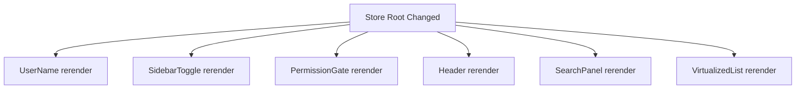
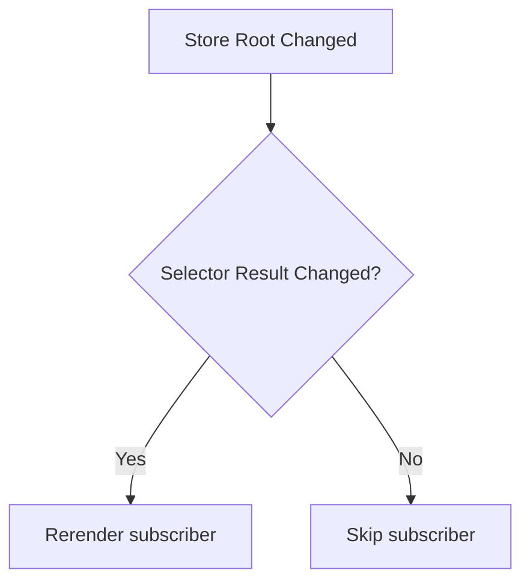
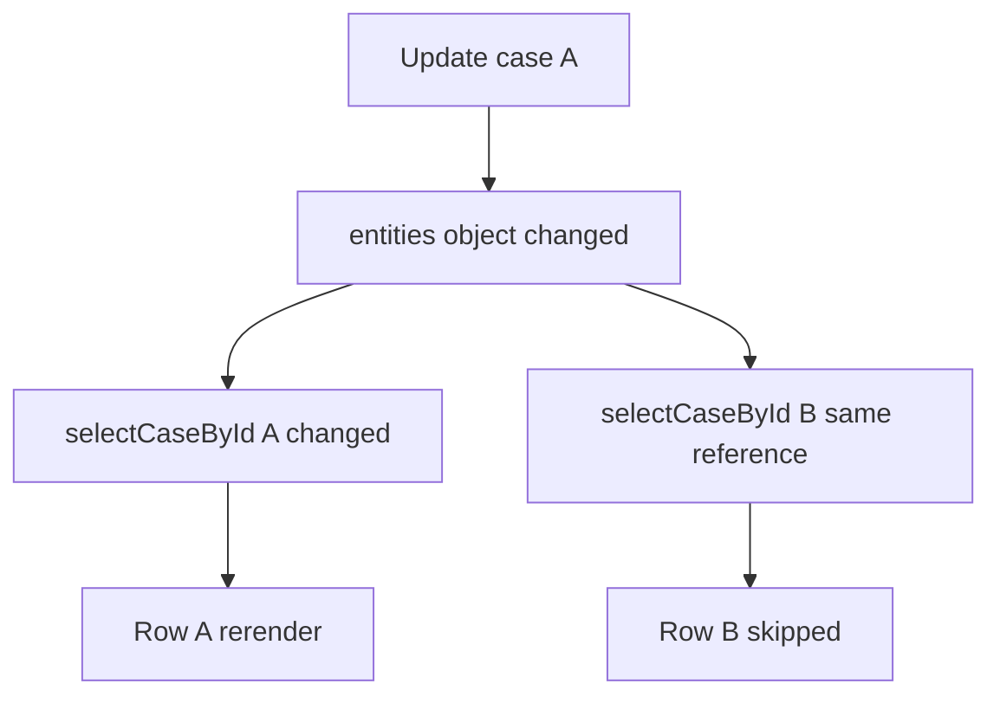

# Part 062 — Selector-Based State Subscription

Part sebelumnya membangun external store yang benar dengan `useSyncExternalStore`.

Masalah berikutnya muncul ketika store membesar.

```tsx
type AppState = {
  user: User | null;
  theme: Theme;
  sidebar: SidebarState;
  filters: SearchFilters;
  selectedIds: string[];
  entities: Record<string, Entity>;
};
```

Jika setiap component subscribe ke seluruh snapshot:

```tsx
const state = useAppStore();
```

maka perubahan kecil seperti `sidebar.collapsed` dapat membuat component yang hanya membaca `theme` ikut menerima snapshot baru.

Selector-based subscription menyelesaikan ini dengan prinsip:

```txt
Component tidak subscribe ke seluruh store.
Component subscribe ke hasil baca yang dibutuhkan.
```

Bukan:

```tsx
const state = useStore();
const userName = state.user?.name;
```

Tetapi:

```tsx
const userName = useStoreSelector((state) => state.user?.name);
```

---

## 1. Masalah: Snapshot Root Terlalu Luas

External store minimal biasanya seperti ini:

```tsx
function useStore() {
  return useSyncExternalStore(
    store.subscribe,
    store.getSnapshot,
    store.getServerSnapshot
  );
}
```

Jika `getSnapshot()` return root state, semua consumer membaca object root.

```tsx
function UserName() {
  const state = useStore();
  return <span>{state.user?.name}</span>;
}

function SidebarToggle() {
  const state = useStore();
  return <button>{state.sidebar.collapsed ? 'Open' : 'Close'}</button>;
}
```

Ketika sidebar berubah:

```tsx
state = {
  ...state,
  sidebar: { collapsed: true },
};
```

root object berubah. `UserName` menerima snapshot baru walaupun `state.user` tidak berubah.

Di app kecil, ini tidak masalah.
Di app besar, ini menjadi fan-out.



Selector mengubah dependency dari root object menjadi selected value.



---

## 2. Selector Mental Model

Selector adalah query function.

```tsx
type Selector<State, Selected> = (state: State) => Selected;
```

Ia mengubah:

```txt
State besar -> Slice kecil yang dibutuhkan component
```

Contoh:

```tsx
const selectUserName = (state: AppState) => state.user?.name ?? 'Guest';
const selectSidebarCollapsed = (state: AppState) => state.sidebar.collapsed;
const selectSelectedCount = (state: AppState) => state.selectedIds.length;
```

Selector yang baik:

1. Pure.
2. Murah.
3. Tidak punya side effect.
4. Tidak mutate state.
5. Menghasilkan reference stabil jika semantic value tidak berubah.
6. Bisa dites seperti function biasa.

Selector yang buruk:

```tsx
const selectVisibleItems = (state: State) => {
  analytics.track('select'); // ❌ side effect
  return state.items.filter((item) => item.visible); // ⚠️ array baru setiap call
};
```

Filter kadang valid, tetapi perlu memoization jika dipakai sebagai subscription result.

---

## 3. Selector Tanpa Equality Function

Versi paling sederhana:

```tsx
function useStoreSelector<Selected>(
  selector: (state: AppState) => Selected
): Selected {
  return useSyncExternalStore(
    appStore.subscribe,
    () => selector(appStore.getSnapshot()),
    () => selector(appStore.getServerSnapshot())
  );
}
```

Usage:

```tsx
function UserName() {
  const name = useStoreSelector((state) => state.user?.name ?? 'Guest');
  return <span>{name}</span>;
}
```

Ini bekerja baik jika selected value adalah primitive atau stable reference.

```tsx
const count = useStoreSelector((state) => state.items.length); // ✅ number
const user = useStoreSelector((state) => state.user); // ✅ jika user reference stabil
const theme = useStoreSelector((state) => state.theme); // ✅ jika immutable
```

Tetapi ini berbahaya:

```tsx
const view = useStoreSelector((state) => ({
  name: state.user?.name,
  role: state.user?.role,
}));
```

Object baru setiap call. Secara identity, snapshot berubah terus.

---

## 4. `Object.is` adalah Default Equality Boundary

React membandingkan snapshot menggunakan identity/value semantics seperti `Object.is`.

Artinya:

```tsx
1 === 1 // stable
'a' === 'a' // stable
sameObjectRef === sameObjectRef // stable
newObject !== oldObject // changed
```

Jadi selector return object baru adalah masalah.

```tsx
// ❌ Selalu object baru
(state) => ({ count: state.count })
```

Perbaikan paling sederhana: pilih primitive atau reference yang sudah ada.

```tsx
// ✅ primitive
(state) => state.count

// ✅ existing reference, selama update immutable benar
(state) => state.user
```

Jika memang butuh object gabungan, gunakan memoized selector atau equality function.

---

## 5. Selector dengan Equality Function

Kita ingin API seperti ini:

```tsx
const userHeader = useStoreSelector(
  (state) => ({
    name: state.user?.name,
    role: state.user?.role,
  }),
  shallowEqual
);
```

Jika `name` dan `role` sama, component tidak perlu menerima selected object baru.

Kita definisikan equality:

```tsx
type EqualityFn<T> = (a: T, b: T) => boolean;

const objectIs: EqualityFn<unknown> = Object.is;

function shallowEqual<T extends Record<string, unknown>>(a: T, b: T) {
  if (Object.is(a, b)) return true;

  const aKeys = Object.keys(a);
  const bKeys = Object.keys(b);

  if (aKeys.length !== bKeys.length) return false;

  for (const key of aKeys) {
    if (!Object.prototype.hasOwnProperty.call(b, key)) return false;
    if (!Object.is(a[key], b[key])) return false;
  }

  return true;
}
```

Masalahnya: `useSyncExternalStore` tidak menerima equality function langsung.
Kita harus membuat selected snapshot yang cached.

---

## 6. Build Selector Hook dari Scratch

Kita buat helper untuk membuat `getSelectedSnapshot` yang menjaga cache.

```tsx
type Listener = () => void;
type EqualityFn<T> = (a: T, b: T) => boolean;

type Store<State> = {
  subscribe(listener: Listener): () => void;
  getSnapshot(): State;
  getServerSnapshot?: () => State;
};

function createSelectedSnapshotGetter<State, Selected>(params: {
  getSnapshot: () => State;
  selector: (state: State) => Selected;
  isEqual: EqualityFn<Selected>;
}) {
  let hasValue = false;
  let lastState: State;
  let lastSelected: Selected;

  return function getSelectedSnapshot(): Selected {
    const nextState = params.getSnapshot();

    if (hasValue && Object.is(nextState, lastState)) {
      return lastSelected;
    }

    const nextSelected = params.selector(nextState);

    if (hasValue && params.isEqual(lastSelected, nextSelected)) {
      lastState = nextState;
      return lastSelected;
    }

    hasValue = true;
    lastState = nextState;
    lastSelected = nextSelected;
    return nextSelected;
  };
}
```

Sekarang hook:

```tsx
import { useMemo, useSyncExternalStore } from 'react';

function useStoreSelector<State, Selected>(
  store: Store<State>,
  selector: (state: State) => Selected,
  isEqual: EqualityFn<Selected> = Object.is
): Selected {
  const getSelectedSnapshot = useMemo(
    () =>
      createSelectedSnapshotGetter({
        getSnapshot: store.getSnapshot,
        selector,
        isEqual,
      }),
    [store, selector, isEqual]
  );

  const getSelectedServerSnapshot = useMemo(() => {
    if (!store.getServerSnapshot) return undefined;

    return createSelectedSnapshotGetter({
      getSnapshot: store.getServerSnapshot,
      selector,
      isEqual,
    });
  }, [store, selector, isEqual]);

  return useSyncExternalStore(
    store.subscribe,
    getSelectedSnapshot,
    getSelectedServerSnapshot
  );
}
```

Ini cukup untuk memahami prinsip.
Untuk library production, detailnya lebih rumit karena harus memperhatikan selector identity, error behavior, concurrent render edge cases, dan compatibility. Tetapi mental model-nya tetap sama:

```txt
root snapshot berubah -> hitung selected value -> bandingkan -> return selected reference lama jika equal
```

---

## 7. Penting: Selector Identity

Hook di atas memakai dependency:

```tsx
[store, selector, isEqual]
```

Jika selector inline dibuat setiap render:

```tsx
const name = useStoreSelector(
  store,
  (state) => state.user.name
);
```

maka `selector` punya identity baru setiap render. Dalam banyak kasus masih bekerja, tetapi cache selected getter dibuat ulang.

Untuk selector sederhana, ini biasanya tidak masalah.
Untuk selector mahal atau object selector, stabilkan.

```tsx
const selectUserName = (state: AppState) => state.user.name;

function UserName() {
  const store = useAppStoreObject();
  const name = useStoreSelector(store, selectUserName);
  return <span>{name}</span>;
}
```

Untuk selector yang tergantung props:

```tsx
function TodoRow({ todoId }: { todoId: string }) {
  const selector = useMemo(
    () => (state: AppState) => state.todos.entities[todoId],
    [todoId]
  );

  const todo = useStoreSelector(store, selector);

  return <span>{todo.title}</span>;
}
```

Jangan over-optimize semua selector. Stabilkan saat ada alasan:

- selector mahal,
- selector return object/array,
- component banyak,
- subscription sering berubah,
- profiler menunjukkan cost.

---

## 8. Structural Sharing adalah Fondasi Selector

Selector bekerja baik jika update state menjaga reference yang tidak berubah.

Misalnya state:

```tsx
type State = {
  users: Record<string, User>;
  settings: Settings;
};
```

Update settings:

```tsx
state = {
  ...state,
  settings: {
    ...state.settings,
    theme: 'dark',
  },
};
```

`state.users` tetap reference lama.

Selector ini tidak rerender:

```tsx
const users = useStoreSelector(store, (state) => state.users);
```

Tetapi jika update buruk membuat semua subtree baru:

```tsx
state = JSON.parse(JSON.stringify(nextState)); // ❌ kills structural sharing
```

semua reference berubah. Selector kehilangan manfaat.

Prinsip:

```txt
Selector optimization dimulai dari update strategy yang menjaga structural sharing.
```

---

## 9. Selector Granularity

Jangan selalu pilih terlalu besar.

```tsx
// ❌ terlalu besar
const user = useStoreSelector(store, (state) => state.user);

// ✅ jika hanya butuh name
const name = useStoreSelector(store, (state) => state.user.name);
```

Tetapi jangan juga terlalu kecil jika membuat component sulit dibaca.

```tsx
const firstName = useStoreSelector(store, (s) => s.user.firstName);
const lastName = useStoreSelector(store, (s) => s.user.lastName);
const avatarUrl = useStoreSelector(store, (s) => s.user.avatarUrl);
const role = useStoreSelector(store, (s) => s.user.role);
```

Kadang object selector dengan `shallowEqual` lebih baik.

```tsx
const headerUser = useStoreSelector(
  store,
  (s) => ({
    firstName: s.user.firstName,
    lastName: s.user.lastName,
    avatarUrl: s.user.avatarUrl,
  }),
  shallowEqual
);
```

Trade-off:

| Granularity | Benefit | Cost |
|---|---|---|
| field-level | rerender paling kecil | banyak selector call |
| object view model | ergonomis | perlu equality/memoization |
| entity-level | bagus untuk normalized store | rerender jika entity reference berubah |
| root-level | simple | fan-out besar |

---

## 10. Derived Selector

Derived selector menghitung value dari state.

```tsx
const selectSelectedTodos = (state: State) =>
  state.selectedIds.map((id) => state.todos.entities[id]);
```

Ini membuat array baru setiap call.

Jika dipakai sebagai subscription result tanpa equality/memoization, ia akan sering berubah.

Solusi 1: return primitive.

```tsx
const selectedCount = useStoreSelector(
  store,
  (state) => state.selectedIds.length
);
```

Solusi 2: shallow equality.

```tsx
const selectedTodos = useStoreSelector(
  store,
  selectSelectedTodos,
  shallowArrayEqual
);
```

```tsx
function shallowArrayEqual<T>(a: T[], b: T[]) {
  if (Object.is(a, b)) return true;
  if (a.length !== b.length) return false;

  for (let i = 0; i < a.length; i += 1) {
    if (!Object.is(a[i], b[i])) return false;
  }

  return true;
}
```

Solusi 3: memoized selector.

```tsx
function createSelectedTodosSelector() {
  let lastIds: string[] | null = null;
  let lastEntities: Record<string, Todo> | null = null;
  let lastResult: Todo[] = [];

  return function selectSelectedTodos(state: State) {
    if (
      lastIds === state.selectedIds &&
      lastEntities === state.todos.entities
    ) {
      return lastResult;
    }

    lastIds = state.selectedIds;
    lastEntities = state.todos.entities;
    lastResult = state.selectedIds.map((id) => state.todos.entities[id]);
    return lastResult;
  };
}
```

Usage per component instance:

```tsx
function SelectedTodoList() {
  const selector = useMemo(createSelectedTodosSelector, []);
  const todos = useStoreSelector(store, selector);

  return <TodoList todos={todos} />;
}
```

---

## 11. Equality Function Tidak Boleh Bohong

Equality function adalah correctness boundary.
Jika equality berkata "sama" padahal berbeda, UI stale.

```tsx
function alwaysEqual() {
  return true; // ❌ UI tidak pernah update
}
```

Jika equality terlalu mahal, performa juga buruk.

```tsx
function deepEqual(a: unknown, b: unknown) {
  // ⚠️ bisa lebih mahal dari rerender yang ingin dihindari
}
```

Gunakan equality yang sesuai:

| Selected Value | Equality yang Umum |
|---|---|
| primitive | `Object.is` |
| existing immutable object | `Object.is` |
| small view model object | shallow equal |
| small array of stable refs | shallow array equal |
| deeply nested object | prefer selector redesign |

Prinsip:

```txt
Equality adalah filter sinyal.
Filter yang salah membuat UI tuli atau terlalu bising.
```

---

## 12. Store-Level Selector Subscription

Pendekatan sebelumnya semua listener tetap dipanggil pada setiap store update.
React lalu membandingkan selected snapshot.

Untuk store besar dengan banyak subscriber, kita bisa pindahkan filtering ke store.

```tsx
type SelectorSubscription<State, Selected> = {
  selector: (state: State) => Selected;
  isEqual: EqualityFn<Selected>;
  listener: () => void;
  selected: Selected;
};

function createSelectableStore<State>(initialState: State) {
  let state = initialState;
  const subscriptions = new Set<SelectorSubscription<State, unknown>>();

  function getSnapshot() {
    return state;
  }

  function setState(updater: (prev: State) => State) {
    const nextState = updater(state);
    if (Object.is(nextState, state)) return;

    state = nextState;

    for (const sub of subscriptions) {
      const nextSelected = sub.selector(state);

      if (!sub.isEqual(sub.selected, nextSelected)) {
        sub.selected = nextSelected;
        sub.listener();
      }
    }
  }

  function subscribeSelector<Selected>(params: {
    selector: (state: State) => Selected;
    isEqual: EqualityFn<Selected>;
    listener: () => void;
  }) {
    const sub: SelectorSubscription<State, Selected> = {
      ...params,
      selected: params.selector(state),
    };

    subscriptions.add(sub as SelectorSubscription<State, unknown>);

    return () => {
      subscriptions.delete(sub as SelectorSubscription<State, unknown>);
    };
  }

  return {
    getSnapshot,
    setState,
    subscribeSelector,
  };
}
```

Adapter hook:

```tsx
function useStoreSelector<Selected>(
  selector: (state: State) => Selected,
  isEqual: EqualityFn<Selected> = Object.is
) {
  const getSnapshot = () => selector(store.getSnapshot());

  return useSyncExternalStore(
    (listener) =>
      store.subscribeSelector({
        selector,
        isEqual,
        listener,
      }),
    getSnapshot,
    getSnapshot
  );
}
```

Kelebihan:

- listener component hanya dipanggil jika selected value berubah,
- filtering terjadi di store,
- bisa mengurangi work saat subscriber banyak.

Kekurangan:

- store lebih kompleks,
- selector identity perlu dikelola,
- error handling selector harus jelas,
- subscription update saat selector berubah harus aman,
- SSR path lebih tricky.

Untuk kebanyakan app, mulai dari hook-level selector dulu. Naik ke store-level selector jika profiler menunjukkan bottleneck.

---

## 13. Selector dan Normalized Store

Normalized store cocok dengan selector.

State:

```tsx
type State = {
  cases: {
    ids: string[];
    entities: Record<string, Case>;
  };
  selectedCaseId: string | null;
};
```

Selectors:

```tsx
const selectCaseIds = (state: State) => state.cases.ids;

function selectCaseById(caseId: string) {
  return (state: State) => state.cases.entities[caseId];
}

const selectSelectedCase = (state: State) => {
  if (!state.selectedCaseId) return null;
  return state.cases.entities[state.selectedCaseId] ?? null;
};
```

Usage:

```tsx
function CaseRow({ caseId }: { caseId: string }) {
  const selector = useMemo(() => selectCaseById(caseId), [caseId]);
  const item = useStoreSelector(store, selector);

  return <CaseRowView item={item} />;
}
```

Jika case A berubah, row case B tidak perlu rerender selama reference entity B tetap sama.



---

## 14. Selector dan Large List

Large list adalah tempat selector-based subscription sangat bernilai.

Buruk:

```tsx
function CaseList() {
  const cases = useStoreSelector(store, (state) =>
    state.cases.ids.map((id) => state.cases.entities[id])
  );

  return cases.map((item) => <CaseRow key={item.id} item={item} />);
}
```

Setiap entity update bisa membuat array baru dan list parent rerender besar.

Lebih baik:

```tsx
function CaseList() {
  const ids = useStoreSelector(store, (state) => state.cases.ids);

  return ids.map((id) => <CaseRow key={id} caseId={id} />);
}

function CaseRow({ caseId }: { caseId: string }) {
  const selector = useMemo(() => selectCaseById(caseId), [caseId]);
  const item = useStoreSelector(store, selector);

  return <CaseRowView item={item} />;
}
```

List parent hanya rerender saat order/ids berubah.
Row rerender saat entity miliknya berubah.

---

## 15. Selector dan Context

Pola produksi yang umum:

```tsx
const StoreContext = createContext<AppStore | null>(null);

function useAppStore() {
  const store = useContext(StoreContext);
  if (!store) throw new Error('Missing AppStoreProvider');
  return store;
}

function useAppSelector<Selected>(
  selector: (state: AppState) => Selected,
  isEqual?: EqualityFn<Selected>
) {
  const store = useAppStore();
  return useStoreSelector(store, selector, isEqual);
}
```

Component:

```tsx
function Header() {
  const userName = useAppSelector((state) => state.user?.name ?? 'Guest');
  return <header>{userName}</header>;
}
```

Context hanya membawa store object yang stabil.
Subscription granular dilakukan oleh selector hook.

```txt
Context = dependency injection
Selector store = state subscription
```

---

## 16. Selector dan Command Hook

Pisahkan read dan write.

```tsx
function useAppCommands() {
  const store = useAppStore();

  return useMemo(
    () => ({
      selectCase: store.selectCase,
      archiveCase: store.archiveCase,
      resetFilters: store.resetFilters,
    }),
    [store]
  );
}
```

Usage:

```tsx
function CaseRow({ caseId }: { caseId: string }) {
  const item = useAppSelector(useMemo(() => selectCaseById(caseId), [caseId]));
  const { selectCase } = useAppCommands();

  return (
    <button onClick={() => selectCase(caseId)}>
      {item.title}
    </button>
  );
}
```

Ini menjaga command tidak menyelinap ke selector.

Selector tidak boleh:

- mutate,
- dispatch,
- track analytics,
- trigger fetch,
- navigate,
- open modal.

Selector hanya membaca.

---

## 17. Selector Failure Modes

### 17.1 Selector Return Object Baru

```tsx
const user = useAppSelector((state) => ({
  name: state.user.name,
}));
```

Gejala:

- rerender terus,
- warning cached snapshot,
- memo tidak efektif.

Perbaikan:

```tsx
const user = useAppSelector(
  (state) => ({ name: state.user.name }),
  shallowEqual
);
```

Atau:

```tsx
const name = useAppSelector((state) => state.user.name);
```

### 17.2 Deep Equality Overuse

```tsx
const data = useAppSelector(selectBigViewModel, deepEqual);
```

Gejala:

- CPU tinggi,
- render terlihat lambat walau rerender sedikit.

Perbaikan:

- ubah state shape,
- gunakan normalized state,
- pecah selector,
- memoize derived data,
- gunakan shallow equality untuk view model kecil.

### 17.3 Broken Structural Sharing

```tsx
setState((prev) => structuredClone(prev));
```

Gejala:

- semua selector berubah,
- semua row rerender,
- equality harus bekerja terlalu keras.

Perbaikan:

- update hanya branch yang berubah,
- jaga reference branch lain,
- gunakan reducer/Immer dengan benar.

### 17.4 Selector with Side Effect

```tsx
const value = useAppSelector((state) => {
  logger.info('read'); // ❌
  return state.value;
});
```

Gejala:

- log ganda,
- behavior aneh di Strict Mode,
- selector sulit dites.

Perbaikan:

- pindahkan side effect ke command/effect boundary.

### 17.5 Stale Prop Selector

```tsx
function Row({ id }: { id: string }) {
  const selector = useMemo(() => (state: State) => state.entities[id], []); // ❌ id hilang
  const item = useAppSelector(selector);
}
```

Perbaikan:

```tsx
const selector = useMemo(
  () => (state: State) => state.entities[id],
  [id]
);
```

---

## 18. Performance Investigation Workflow

Jangan mulai dari selector abstraction.
Mulai dari bukti.

```txt
1. Identifikasi interaction lambat.
2. Profiling React render.
3. Cari component dengan render count tinggi.
4. Cek apakah component membaca root snapshot.
5. Pecah selector ke field/entity yang dibutuhkan.
6. Pastikan structural sharing update benar.
7. Tambahkan equality hanya jika selected value object/array kecil.
8. Memoize derived selector jika hitungannya mahal.
9. Ulang profiling.
```

Selector bukan tujuan.
Selector adalah alat untuk memperkecil blast radius update.

---

## 19. Testing Selector

Selector harus dites seperti query function.

```tsx
it('selects user name', () => {
  const state: AppState = {
    user: { id: 'u1', name: 'Rina' },
    // ...
  };

  expect(selectUserName(state)).toBe('Rina');
});
```

Test structural sharing:

```tsx
it('preserves unrelated entity references', () => {
  const before = createStateWithCases();
  const caseB = before.cases.entities['b'];

  const after = updateCaseTitle(before, 'a', 'New title');

  expect(after.cases.entities['b']).toBe(caseB);
});
```

Test rerender behavior secara terbatas:

```tsx
it('does not rerender user consumer when sidebar changes', () => {
  const renderSpy = vi.fn();

  function UserConsumer() {
    renderSpy();
    useAppSelector((state) => state.user?.name);
    return null;
  }

  render(
    <AppStoreProvider>
      <UserConsumer />
    </AppStoreProvider>
  );

  act(() => {
    appStore.setSidebarCollapsed(true);
  });

  expect(renderSpy).toHaveBeenCalledTimes(1);
});
```

Jangan over-test internal implementation. Test contract yang penting:

```txt
selected value unchanged -> consumer tidak perlu rerender
selected value changed -> consumer update
```

---

## 20. Observability

Untuk external store besar, tambahkan debug metadata.

```tsx
type StoreChange = {
  version: number;
  action: string;
  changedPaths: string[];
  timestamp: number;
};
```

Saat update:

```tsx
store.setState('case.titleChanged', (prev) => next, {
  changedPaths: ['cases.entities.case-1.title'],
});
```

Ini membantu menjawab:

```txt
Kenapa component ini rerender?
State path apa yang berubah?
Selector mana yang berubah?
Action apa yang memicu update?
```

Untuk library internal, debug mode bisa melacak selector result.

```tsx
if (debug) {
  console.debug('[selector changed]', {
    selectorName,
    previous: lastSelected,
    next: nextSelected,
    action: lastAction,
  });
}
```

---

## 21. Decision Matrix

| Situasi | Strategi |
|---|---|
| Component butuh satu primitive | selector primitive |
| Component butuh entity by id | selector factory per id |
| Component butuh view model kecil | selector + shallow equal |
| Component butuh expensive derived array | memoized selector |
| Banyak row list | parent select ids, row select entity |
| Semua component rerender saat update kecil | jangan subscribe root snapshot |
| Equality makin kompleks | redesign state shape |
| Selector butuh side effect | desain salah; pindah ke command/effect |
| Data berasal dari server | pertimbangkan query cache, bukan custom store |
| Workflow punya transition/guards | reducer/machine lebih tepat dari selector store saja |

---

## 22. Build Rule: Do Not Start with Magic

Banyak codebase membuat abstraction terlalu dini.

Tahap yang sehat:

```txt
1. local state
2. lifted state
3. reducer/context scoped store
4. external store root snapshot
5. selector hook
6. selector equality/memoization
7. store-level selector subscription
8. devtools/observability
```

Jangan lompat ke tahap 7 sebelum tahap 4 punya masalah nyata.

---

## 23. Practical Implementation Template

Template kecil untuk production internal library:

```tsx
export type EqualityFn<T> = (a: T, b: T) => boolean;

export type ExternalStore<State> = {
  subscribe(listener: () => void): () => void;
  getSnapshot(): State;
  getServerSnapshot?: () => State;
};

export function createStoreSelectorHook<State>(useStoreObject: () => ExternalStore<State>) {
  return function useSelector<Selected>(
    selector: (state: State) => Selected,
    isEqual: EqualityFn<Selected> = Object.is
  ): Selected {
    const store = useStoreObject();

    const getSelectedSnapshot = useMemo(
      () =>
        createSelectedSnapshotGetter({
          getSnapshot: store.getSnapshot,
          selector,
          isEqual,
        }),
      [store, selector, isEqual]
    );

    const getSelectedServerSnapshot = useMemo(() => {
      if (!store.getServerSnapshot) return undefined;

      return createSelectedSnapshotGetter({
        getSnapshot: store.getServerSnapshot,
        selector,
        isEqual,
      });
    }, [store, selector, isEqual]);

    return useSyncExternalStore(
      store.subscribe,
      getSelectedSnapshot,
      getSelectedServerSnapshot
    );
  };
}
```

Usage:

```tsx
export const useAppSelector = createStoreSelectorHook(useAppStoreObject);

export function CaseTitle({ caseId }: { caseId: string }) {
  const selector = useMemo(
    () => (state: AppState) => state.cases.entities[caseId]?.title ?? '',
    [caseId]
  );

  const title = useAppSelector(selector);

  return <span>{title}</span>;
}
```

---

## 24. What Top Engineers Watch For

Engineer yang kuat tidak hanya bertanya:

```txt
Apakah bisa pakai selector?
```

Mereka bertanya:

```txt
Apa unit invalidation state ini?
Apakah update menjaga structural sharing?
Apa selected value contract-nya?
Apakah selector pure?
Apakah equality benar dan murah?
Apakah derived data seharusnya disimpan, dihitung, atau dimemoize?
Apakah component membaca state terlalu luas?
Apakah external store memang tool yang tepat?
```

Selector bukan pattern kosmetik. Ia adalah desain invalidation.

---

## 25. Kesimpulan

Selector-based subscription membuat React external store lebih skalabel karena component hanya bergantung pada value yang benar-benar ia butuhkan.

Tetapi selector tidak bisa menyelamatkan desain state yang buruk.

Urutan kebenarannya:

```txt
state shape benar
→ update menjaga structural sharing
→ selector pure
→ selected value stabil
→ equality tepat
→ subscription granular
```

Jika satu tahap salah, tahap berikutnya menjadi tambalan.

Part berikutnya akan masuk ke implementasi library nyata: **Zustand in Production**. Di sana kita akan melihat bagaimana konsep external store, selector, middleware, persistence, dan slice composition dipakai dalam ekosistem produksi.

---

## References

- React Docs — `useSyncExternalStore`: https://react.dev/reference/react/useSyncExternalStore
- React Docs — Components and Hooks must be pure: https://react.dev/reference/rules/components-and-hooks-must-be-pure
- React Docs — `useMemo`: https://react.dev/reference/react/useMemo
