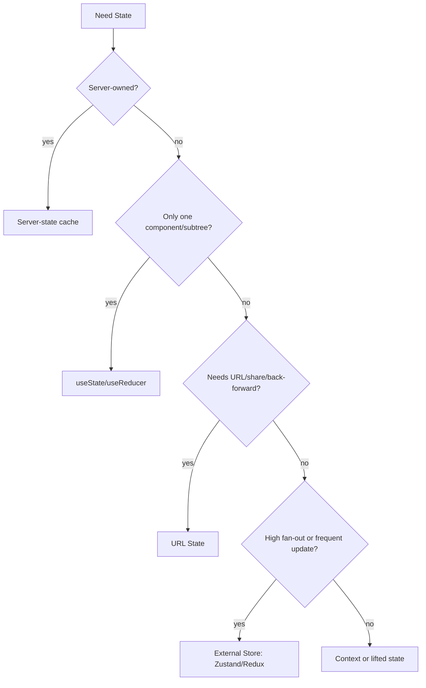
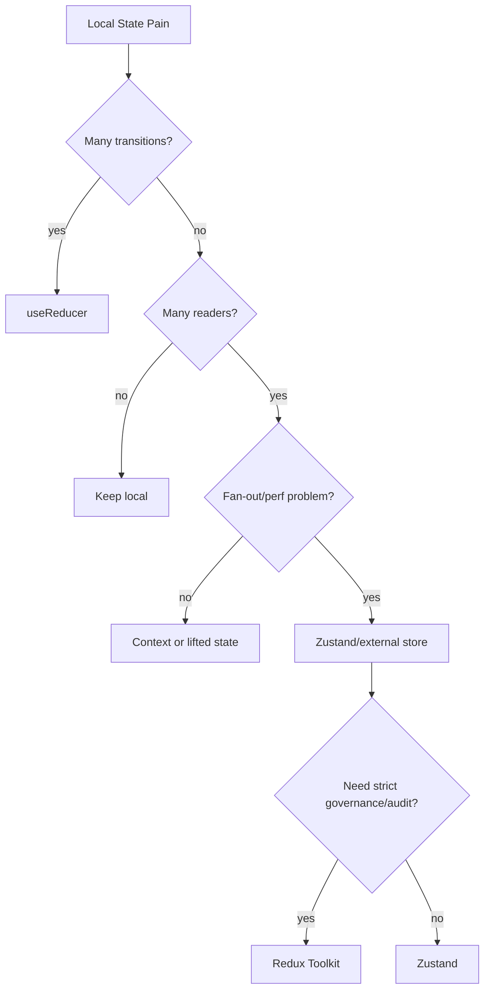

# Part 063 — Zustand in Production

Part sebelumnya membangun selector-based subscription dari nol.
Sekarang kita naik satu tingkat: **menggunakan library external store yang pragmatic**.

Zustand sering dipilih karena API-nya kecil, tidak membutuhkan Provider secara default, cocok untuk local-global state yang bukan server cache, dan mudah dipecah menjadi action/selectors.
Namun justru karena kecil dan bebas, Zustand mudah berubah menjadi global mutable dump kalau tidak diberi boundary.

Mental model utama:

```txt
Zustand bukan tempat semua state.
Zustand adalah external store untuk state client yang:
- perlu dibaca lintas subtree,
- berubah cukup sering,
- tidak cocok di Context karena fan-out,
- bukan otoritas server,
- punya lifecycle lebih panjang dari satu component,
- dan butuh subscription granular.
```

React menyediakan `useSyncExternalStore` untuk membaca store di luar React secara aman. Zustand berada di kategori ini: sebuah store eksternal dengan hook adapter yang membuat component subscribe ke slice state tertentu.

---

## 1. Posisi Zustand Dalam Taxonomy State

Jangan mulai dari pertanyaan:

```txt
Apakah kita pakai Zustand?
```

Mulai dari pertanyaan:

```txt
State ini milik siapa?
Berapa luas radius pembacanya?
Siapa yang boleh mengubahnya?
Apakah state ini otoritatif dari server?
Apakah perlu survive navigation?
Apakah perubahan kecil boleh memicu rerender banyak component?
```

Zustand cocok untuk:

| Jenis state | Contoh | Cocok? | Catatan |
|---|---|---:|---|
| UI shell state | sidebar, command palette, layout mode | Ya | External store kecil, selector granular |
| Client-only workflow state | selected rows, open panels, local draft lintas page | Ya | Selama bukan workflow kompleks yang butuh state machine |
| Cross-tree command state | modal manager, toast queue | Ya | Lebih baik sebagai capability store kecil |
| Server cache | user detail, list invoice dari API | Tidak default | Gunakan TanStack Query / RTK Query / framework cache |
| Auth token authority | access token, refresh token | Hati-hati | Jangan asal persist; keamanan dan lifecycle kritis |
| Permission model | capability snapshot | Bisa | Tapi keputusan final tetap server-side |
| Form field internal state | input text biasa | Biasanya tidak | Co-locate di form/component |
| High-frequency pointer state | mouse position per frame | Biasanya tidak | Bisa terlalu banyak update; pakai ref/requestAnimationFrame |

Diagram posisi:



---

## 2. Apa yang Membuat Zustand Menarik

Zustand punya beberapa karakter penting:

```txt
- store berada di luar React tree,
- component bisa subscribe ke selector tertentu,
- action bisa didefinisikan bersama state,
- tidak perlu reducer boilerplate,
- middleware bisa menambah persist/devtools/immer/subscribeWithSelector,
- bisa digunakan sebagai vanilla store tanpa React,
- mudah dites karena store bisa dibuat sebagai object/function biasa.
```

Contoh minimal:

```tsx
import { create } from 'zustand';

type SidebarState = {
  collapsed: boolean;
  toggle: () => void;
  setCollapsed: (collapsed: boolean) => void;
};

export const useSidebarStore = create<SidebarState>((set) => ({
  collapsed: false,
  toggle: () => set((state) => ({ collapsed: !state.collapsed })),
  setCollapsed: (collapsed) => set({ collapsed }),
}));
```

Consumer:

```tsx
function SidebarButton() {
  const collapsed = useSidebarStore((state) => state.collapsed);
  const toggle = useSidebarStore((state) => state.toggle);

  return (
    <button onClick={toggle}>
      {collapsed ? 'Expand' : 'Collapse'}
    </button>
  );
}
```

Prinsip penting:

```txt
Subscribe ke field/action yang dipakai.
Jangan subscribe ke seluruh state kecuali component memang butuh seluruh state.
```

Anti-pattern:

```tsx
// Anti-pattern untuk component besar
const store = useSidebarStore();
```

Lebih baik:

```tsx
const collapsed = useSidebarStore((s) => s.collapsed);
const toggle = useSidebarStore((s) => s.toggle);
```

---

## 3. Zustand Bukan Context Replacement Total

Zustand sering dipromosikan sebagai “tidak perlu Provider”.
Itu benar untuk banyak kasus client-side SPA, tetapi bukan berarti semua store harus module-singleton.

Ada dua bentuk store:

```txt
1. Singleton store
   - module-level store
   - satu instance untuk seluruh app/browser tab
   - cocok untuk app shell state

2. Scoped store
   - instance dibuat per page/subtree/request
   - disediakan lewat Context
   - cocok untuk multi-instance feature, SSR, test isolation
```

Singleton:

```tsx
export const useCommandPaletteStore = create<CommandPaletteState>((set) => ({
  open: false,
  openPalette: () => set({ open: true }),
  closePalette: () => set({ open: false }),
}));
```

Scoped store:

```tsx
import { createContext, useContext, useRef } from 'react';
import { createStore, useStore } from 'zustand';

type DraftState = {
  title: string;
  setTitle: (title: string) => void;
};

function createDraftStore(initialTitle: string) {
  return createStore<DraftState>((set) => ({
    title: initialTitle,
    setTitle: (title) => set({ title }),
  }));
}

type DraftStore = ReturnType<typeof createDraftStore>;

const DraftStoreContext = createContext<DraftStore | null>(null);

export function DraftProvider({
  initialTitle,
  children,
}: {
  initialTitle: string;
  children: React.ReactNode;
}) {
  const storeRef = useRef<DraftStore | null>(null);

  if (storeRef.current === null) {
    storeRef.current = createDraftStore(initialTitle);
  }

  return (
    <DraftStoreContext.Provider value={storeRef.current}>
      {children}
    </DraftStoreContext.Provider>
  );
}

export function useDraftSelector<T>(selector: (state: DraftState) => T): T {
  const store = useContext(DraftStoreContext);

  if (!store) {
    throw new Error('useDraftSelector must be used inside <DraftProvider>.');
  }

  return useStore(store, selector);
}
```

Gunakan scoped store saat:

```txt
- satu page bisa punya banyak instance feature yang sama,
- store perlu initial props berbeda,
- SSR/request isolation penting,
- test perlu isolated store,
- state harus reset saat subtree remount,
- global singleton berisiko bocor lintas user/session.
```

---

## 4. Store Anatomy: State, Actions, Selectors, Effects

Zustand store production sebaiknya punya anatomi eksplisit:

```txt
store/
  invoice-review.store.ts
  invoice-review.selectors.ts
  invoice-review.types.ts
  invoice-review.test.ts
```

Contoh domain UI store:

```tsx
type InvoiceReviewState = {
  selectedInvoiceIds: string[];
  panel: 'none' | 'details' | 'comments' | 'history';
  sort: { field: 'createdAt' | 'amount'; direction: 'asc' | 'desc' };

  selectOne: (id: string) => void;
  clearSelection: () => void;
  openPanel: (panel: InvoiceReviewState['panel']) => void;
  setSort: (sort: InvoiceReviewState['sort']) => void;
};

export const useInvoiceReviewStore = create<InvoiceReviewState>((set) => ({
  selectedInvoiceIds: [],
  panel: 'none',
  sort: { field: 'createdAt', direction: 'desc' },

  selectOne: (id) =>
    set((state) => ({
      selectedInvoiceIds: state.selectedInvoiceIds.includes(id)
        ? state.selectedInvoiceIds
        : [...state.selectedInvoiceIds, id],
    })),

  clearSelection: () => set({ selectedInvoiceIds: [] }),

  openPanel: (panel) => set({ panel }),

  setSort: (sort) => set({ sort }),
}));
```

Selectors:

```tsx
export const selectSelectedInvoiceIds = (state: InvoiceReviewState) =>
  state.selectedInvoiceIds;

export const selectSelectedCount = (state: InvoiceReviewState) =>
  state.selectedInvoiceIds.length;

export const selectIsInvoiceSelected = (id: string) =>
  (state: InvoiceReviewState) => state.selectedInvoiceIds.includes(id);
```

Consumer:

```tsx
function SelectionBadge() {
  const count = useInvoiceReviewStore(selectSelectedCount);
  return <span>{count} selected</span>;
}

function InvoiceRow({ id }: { id: string }) {
  const selected = useInvoiceReviewStore(selectIsInvoiceSelected(id));
  const selectOne = useInvoiceReviewStore((s) => s.selectOne);

  return (
    <button aria-pressed={selected} onClick={() => selectOne(id)}>
      {id}
    </button>
  );
}
```

Catatan: selector factory seperti `selectIsInvoiceSelected(id)` menghasilkan function baru jika dipanggil tiap render. Ini biasanya masih aman, tetapi untuk list besar perlu profiling. Bisa memoize selector factory bila identity selector terbukti jadi masalah.

---

## 5. Jangan Bocorkan `set` Mentah Ke Component

Anti-pattern:

```tsx
type Store = {
  selectedIds: string[];
  setSelectedIds: (ids: string[]) => void;
};
```

Masalahnya component bebas membuat illegal state:

```tsx
setSelectedIds(['unknown-id', 'duplicate-id', 'duplicate-id']);
```

Lebih baik expose command/intention:

```tsx
type Store = {
  selectedIds: string[];
  select: (id: string) => void;
  deselect: (id: string) => void;
  toggle: (id: string) => void;
  clear: () => void;
};
```

Implementasi:

```tsx
const useSelectionStore = create<Store>((set, get) => ({
  selectedIds: [],

  select: (id) =>
    set((state) => {
      if (state.selectedIds.includes(id)) return state;
      return { selectedIds: [...state.selectedIds, id] };
    }),

  deselect: (id) =>
    set((state) => ({
      selectedIds: state.selectedIds.filter((x) => x !== id),
    })),

  toggle: (id) => {
    const { selectedIds, select, deselect } = get();
    if (selectedIds.includes(id)) deselect(id);
    else select(id);
  },

  clear: () => set({ selectedIds: [] }),
}));
```

Prinsip:

```txt
Public action harus menjaga invariant.
Component hanya mengirim intent.
Store memutuskan transisi.
```

---

## 6. Slice Pattern: Batas Modular, Bukan Dump Besar

Saat store membesar, jangan buat object raksasa tanpa struktur.
Gunakan slice pattern.

```tsx
type SelectionSlice = {
  selectedIds: string[];
  toggleSelected: (id: string) => void;
  clearSelection: () => void;
};

type PanelSlice = {
  panel: 'none' | 'details' | 'comments';
  openPanel: (panel: PanelSlice['panel']) => void;
  closePanel: () => void;
};

type InvoiceUiStore = SelectionSlice & PanelSlice;
```

Slice creator:

```tsx
import type { StateCreator } from 'zustand';

const createSelectionSlice: StateCreator<InvoiceUiStore, [], [], SelectionSlice> =
  (set) => ({
    selectedIds: [],
    toggleSelected: (id) =>
      set((state) => ({
        selectedIds: state.selectedIds.includes(id)
          ? state.selectedIds.filter((x) => x !== id)
          : [...state.selectedIds, id],
      })),
    clearSelection: () => set({ selectedIds: [] }),
  });

const createPanelSlice: StateCreator<InvoiceUiStore, [], [], PanelSlice> =
  (set) => ({
    panel: 'none',
    openPanel: (panel) => set({ panel }),
    closePanel: () => set({ panel: 'none' }),
  });

export const useInvoiceUiStore = create<InvoiceUiStore>()((...args) => ({
  ...createSelectionSlice(...args),
  ...createPanelSlice(...args),
}));
```

Slice rule:

```txt
Slice boleh berkoordinasi dengan slice lain, tetapi jangan membuat dependency graph yang tidak terlihat.
Jika transisi melibatkan beberapa slice, pertimbangkan satu action orchestration eksplisit di root store.
```

Contoh action orchestration:

```tsx
type InvoiceUiStore = SelectionSlice & PanelSlice & {
  resetWorkspace: () => void;
};

export const useInvoiceUiStore = create<InvoiceUiStore>()((set, get, api) => ({
  ...createSelectionSlice(set, get, api),
  ...createPanelSlice(set, get, api),

  resetWorkspace: () =>
    set({
      selectedIds: [],
      panel: 'none',
    }),
}));
```

---

## 7. Selector Discipline

Selector adalah read contract.

Baik:

```tsx
const selectedCount = useInvoiceUiStore((s) => s.selectedIds.length);
```

Buruk:

```tsx
const { selectedIds, panel, sort, filters } = useInvoiceUiStore();
```

Masalah selector object:

```tsx
const value = useInvoiceUiStore((s) => ({
  count: s.selectedIds.length,
  panel: s.panel,
}));
```

Selector ini menghasilkan object baru setiap pemanggilan. Tanpa equality check, component bisa rerender lebih sering.

Gunakan shallow comparison jika memilih beberapa field:

```tsx
import { shallow } from 'zustand/shallow';

const value = useInvoiceUiStore(
  (s) => ({
    count: s.selectedIds.length,
    panel: s.panel,
  }),
  shallow
);
```

Atau pilih field terpisah:

```tsx
const count = useInvoiceUiStore((s) => s.selectedIds.length);
const panel = useInvoiceUiStore((s) => s.panel);
```

Decision:

| Kebutuhan | Pola |
|---|---|
| Satu primitive | selector langsung |
| Beberapa primitive | beberapa selector atau object + shallow |
| Derived expensive | selector function + memo di layer lain bila perlu |
| Entity by ID | selector factory |
| Large list row | subscribe per row ke entity spesifik |

---

## 8. Structural Sharing dan Immutable Update

Zustand tidak memaksa reducer, tetapi React subscription tetap bergantung pada perubahan referensi yang bermakna.

Buruk:

```tsx
set((state) => {
  state.selectedIds.push(id);
  return state;
});
```

Lebih baik:

```tsx
set((state) => ({
  selectedIds: [...state.selectedIds, id],
}));
```

Untuk nested update, gunakan helper atau Immer middleware bila kompleks.

Tanpa Immer:

```tsx
set((state) => ({
  entities: {
    ...state.entities,
    [id]: {
      ...state.entities[id],
      status: 'approved',
    },
  },
}));
```

Dengan Immer middleware:

```tsx
import { immer } from 'zustand/middleware/immer';

export const useInvoiceStore = create<InvoiceStore>()(
  immer((set) => ({
    entities: {},
    approve: (id) =>
      set((state) => {
        state.entities[id].status = 'approved';
      }),
  }))
);
```

Catatan:

```txt
Immer memudahkan update nested.
Immer bukan izin untuk membuat state shape buruk.
Jika nested update terlalu sering, evaluasi normalisasi state.
```

---

## 9. Persistence: Jangan Persist Semua

Persist middleware berguna untuk preference dan draft tertentu.
Namun persistence adalah boundary serius:

```txt
- data bisa basi,
- schema bisa berubah,
- user bisa logout,
- storage bisa corrupt,
- hydration bisa berbeda dari server render,
- sensitive data bisa bocor,
- multi-tab bisa diverge.
```

Contoh persist preference:

```tsx
import { create } from 'zustand';
import { persist, createJSONStorage } from 'zustand/middleware';

type PreferencesStore = {
  density: 'comfortable' | 'compact';
  setDensity: (density: PreferencesStore['density']) => void;
};

export const usePreferencesStore = create<PreferencesStore>()(
  persist(
    (set) => ({
      density: 'comfortable',
      setDensity: (density) => set({ density }),
    }),
    {
      name: 'preferences:v1',
      storage: createJSONStorage(() => localStorage),
      partialize: (state) => ({ density: state.density }),
      version: 1,
    }
  )
);
```

Gunakan `partialize`:

```tsx
partialize: (state) => ({
  density: state.density,
  sidebarCollapsed: state.sidebarCollapsed,
})
```

Jangan persist:

```txt
- access token tanpa threat model,
- server cache mentah tanpa invalidation,
- permission decision sebagai otoritas,
- volatile loading/error state,
- function/action,
- data besar tanpa quota strategy,
- temporary optimistic state tanpa reconciliation.
```

Schema migration:

```tsx
persist(
  (set) => ({
    density: 'comfortable',
    sidebar: { collapsed: false },
    setDensity: (density) => set({ density }),
  }),
  {
    name: 'preferences',
    version: 2,
    migrate: (persisted, version) => {
      if (version === 1) {
        const old = persisted as { compactMode?: boolean };
        return {
          density: old.compactMode ? 'compact' : 'comfortable',
          sidebar: { collapsed: false },
        };
      }
      return persisted as PreferencesStore;
    },
  }
);
```

Production rule:

```txt
Persisted state harus dianggap input tidak tepercaya.
Validasi, versi, migrasikan, dan punya fallback reset.
```

---

## 10. Devtools Middleware

Devtools berguna untuk debugging action/state transition.

```tsx
import { devtools } from 'zustand/middleware';

export const useInvoiceUiStore = create<InvoiceUiStore>()(
  devtools(
    (set) => ({
      selectedIds: [],
      toggleSelected: (id) =>
        set(
          (state) => ({
            selectedIds: state.selectedIds.includes(id)
              ? state.selectedIds.filter((x) => x !== id)
              : [...state.selectedIds, id],
          }),
          false,
          'selection/toggleSelected'
        ),
    }),
    { name: 'InvoiceUiStore' }
  )
);
```

Naming action penting.
Jangan biarkan semua muncul sebagai anonymous set.

```txt
Good action names:
- selection/toggleSelected
- panel/openDetails
- filters/apply
- workspace/reset

Bad action names:
- set
- update
- change
- doStuff
```

---

## 11. `subscribeWithSelector`: Outside-React Reactions

Kadang kita perlu bereaksi terhadap perubahan store di luar component React.
Misalnya analytics, storage sync, command bridge, atau integration dengan non-React code.

Gunakan middleware `subscribeWithSelector`.

```tsx
import { subscribeWithSelector } from 'zustand/middleware';

const useInvoiceStore = create<InvoiceUiStore>()(
  subscribeWithSelector((set) => ({
    selectedIds: [],
    toggleSelected: (id) =>
      set((state) => ({
        selectedIds: state.selectedIds.includes(id)
          ? state.selectedIds.filter((x) => x !== id)
          : [...state.selectedIds, id],
      })),
  }))
);

const unsubscribe = useInvoiceStore.subscribe(
  (state) => state.selectedIds.length,
  (count, previousCount) => {
    console.log({ count, previousCount });
  }
);
```

Lifecycle rule:

```txt
Jika subscribe dilakukan di module scope, pastikan memang global sepanjang app.
Jika subscribe dilakukan karena component hidup, lakukan di effect dan cleanup.
```

```tsx
function SelectionAnalyticsBridge() {
  useEffect(() => {
    return useInvoiceStore.subscribe(
      (state) => state.selectedIds.length,
      (count) => analytics.track('selection_count_changed', { count })
    );
  }, []);

  return null;
}
```

Failure mode:

```txt
subscribe tanpa cleanup = memory leak.
subscribe yang dispatch lagi tanpa guard = event loop/cycle.
subscribe untuk derivasi state = kemungkinan duplikasi source of truth.
```

---

## 12. Async Actions: Hati-Hati Dengan Server State

Zustand mengizinkan async action:

```tsx
type UserStore = {
  user: User | null;
  loading: boolean;
  error: string | null;
  loadUser: (id: string) => Promise<void>;
};

const useUserStore = create<UserStore>((set) => ({
  user: null,
  loading: false,
  error: null,

  loadUser: async (id) => {
    set({ loading: true, error: null });

    try {
      const user = await api.getUser(id);
      set({ user, loading: false });
    } catch (error) {
      set({ error: 'Failed to load user', loading: false });
    }
  },
}));
```

Ini valid untuk small apps atau integration state, tetapi untuk server state serius sering kurang:

```txt
- no built-in staleTime/cacheTime,
- no automatic deduplication,
- no query key semantics,
- no retry policy by default,
- no background refetch,
- no mutation invalidation model,
- harder SSR dehydration/hydration story.
```

Untuk server-owned data, lebih baik:

```txt
- TanStack Query,
- RTK Query,
- framework loader/cache,
- React Server Components/data layer sesuai framework.
```

Zustand tetap boleh menyimpan:

```txt
- selected entity IDs,
- UI filters draft sebelum commit ke URL/query,
- active panel for entity detail,
- optimistic client-only queue dengan reconciliation eksplisit,
- command state yang mengarahkan mutation ke query layer.
```

Pattern:

```tsx
function ApproveButton({ invoiceId }: { invoiceId: string }) {
  const closePanel = useInvoiceUiStore((s) => s.closePanel);
  const mutation = useApproveInvoiceMutation();

  return (
    <button
      onClick={async () => {
        await mutation.mutateAsync({ invoiceId });
        closePanel();
      }}
    >
      Approve
    </button>
  );
}
```

Zustand mengatur UI command state.
Server-state cache mengatur remote data.

---

## 13. Request Identity Guard Jika Async Tetap Di Store

Jika async action tetap berada di Zustand, minimal jaga race.

```tsx
type SearchStore = {
  query: string;
  result: SearchResult | null;
  status: 'idle' | 'loading' | 'success' | 'error';
  requestId: string | null;
  search: (query: string) => Promise<void>;
};

const useSearchStore = create<SearchStore>((set, get) => ({
  query: '',
  result: null,
  status: 'idle',
  requestId: null,

  search: async (query) => {
    const requestId = crypto.randomUUID();

    set({ query, status: 'loading', requestId });

    try {
      const result = await api.search(query);

      if (get().requestId !== requestId) {
        return;
      }

      set({ result, status: 'success' });
    } catch {
      if (get().requestId !== requestId) {
        return;
      }

      set({ status: 'error' });
    }
  },
}));
```

Invariant:

```txt
Only latest request may commit result.
```

---

## 14. Store Lifetime dan Reset

Global Zustand store tidak reset otomatis saat component unmount.
Itulah point-nya.
Tapi ini juga sumber bug.

Contoh bug:

```txt
User membuka Case A.
Panel comments terbuka.
User pindah ke Case B.
Panel comments masih terbuka karena store global tidak reset.
```

Solusi 1 — route/page reset:

```tsx
function CasePage({ caseId }: { caseId: string }) {
  const reset = useCaseUiStore((s) => s.reset);

  useEffect(() => {
    reset({ caseId });
  }, [caseId, reset]);

  return <CaseWorkspace caseId={caseId} />;
}
```

Solusi 2 — scoped store per page:

```tsx
<CaseUiProvider caseId={caseId}>
  <CaseWorkspace />
</CaseUiProvider>
```

Solusi 3 — key remount provider:

```tsx
<CaseUiProvider key={caseId} caseId={caseId}>
  <CaseWorkspace />
</CaseUiProvider>
```

Decision:

| Lifetime | Store type |
|---|---|
| Entire browser session | singleton |
| Per route entity | scoped store keyed by entity ID |
| Per modal instance | scoped store inside modal root |
| Per test | new vanilla store per test |
| Per SSR request | new store per request |

---

## 15. Zustand and SSR/Hydration

Singleton module store can leak across requests in SSR environments if created on the server and shared globally.

Production rule:

```txt
For request-scoped SSR state, create store per request/render boundary.
Do not share mutable singleton store across users on the server.
```

Pattern:

```tsx
function createAppStore(initialState: Partial<AppStoreState>) {
  return createStore<AppStoreState>()((set) => ({
    sidebarCollapsed: initialState.sidebarCollapsed ?? false,
    setSidebarCollapsed: (sidebarCollapsed) => set({ sidebarCollapsed }),
  }));
}
```

Then inject into Context provider for the client subtree.

Hydration mismatch risk:

```txt
- server renders default collapsed=false,
- client persisted storage hydrates collapsed=true,
- first client paint differs from server output.
```

Mitigation:

```txt
- only use persisted preference after mounted,
- gate non-critical UI until hydration,
- serialize initial server snapshot,
- choose CSS that tolerates initial default,
- keep persisted state out of critical SSR markup when possible.
```

---

## 16. TypeScript Store Contracts

Avoid broad `any` store.
Define domain types.

```tsx
type LoadStatus =
  | { tag: 'idle' }
  | { tag: 'loading'; requestId: string }
  | { tag: 'success' }
  | { tag: 'error'; message: string };

type CaseUiState = {
  activeTab: 'summary' | 'evidence' | 'timeline';
  selectedEvidenceIds: string[];
  loadStatus: LoadStatus;
};

type CaseUiActions = {
  openTab: (tab: CaseUiState['activeTab']) => void;
  toggleEvidence: (id: string) => void;
  clearEvidenceSelection: () => void;
};

type CaseUiStore = CaseUiState & CaseUiActions;
```

Prefer:

```txt
- discriminated union for lifecycle state,
- branded IDs for domain IDs if useful,
- command names over generic setters,
- selectors typed from store state,
- store factory for test/SSR.
```

Avoid:

```txt
- `Record<string, any>`,
- raw backend DTO as editable UI state,
- optional fields that create ambiguous illegal states,
- action payloads that accept arbitrary partial state.
```

---

## 17. Testing Zustand Store

Because store can be vanilla, test it without React first.

```tsx
import { createStore } from 'zustand/vanilla';

function createSelectionStore() {
  return createStore<SelectionStore>()((set) => ({
    selectedIds: [],
    toggle: (id) =>
      set((state) => ({
        selectedIds: state.selectedIds.includes(id)
          ? state.selectedIds.filter((x) => x !== id)
          : [...state.selectedIds, id],
      })),
  }));
}

test('toggle selects and deselects id', () => {
  const store = createSelectionStore();

  store.getState().toggle('inv-1');
  expect(store.getState().selectedIds).toEqual(['inv-1']);

  store.getState().toggle('inv-1');
  expect(store.getState().selectedIds).toEqual([]);
});
```

Test subscription behavior:

```tsx
test('notifies selected count changes', () => {
  const store = createSelectionStore();
  const listener = vi.fn();

  const unsubscribe = store.subscribe(listener);

  store.getState().toggle('a');
  store.getState().toggle('b');

  expect(listener).toHaveBeenCalledTimes(2);

  unsubscribe();
});
```

For React integration:

```tsx
render(
  <SelectionProvider store={createSelectionStore()}>
    <SelectionBadge />
  </SelectionProvider>
);
```

Testing rule:

```txt
Test store transitions at store level.
Test component rendering at integration boundary.
Do not assert implementation detail of Zustand internals.
```

---

## 18. Observability and Debugging

Zustand state bugs are often caused by invisible global lifetime.
Add observability where transitions matter.

```tsx
const useAuditStore = create<AuditStore>()(
  devtools((set) => ({
    status: { tag: 'idle' },
    submitStarted: (requestId) =>
      set({ status: { tag: 'submitting', requestId } }, false, 'submit/started'),
    submitSucceeded: (requestId) =>
      set({ status: { tag: 'success', requestId } }, false, 'submit/succeeded'),
  }))
);
```

Debug protocol:

```txt
1. Which component reads the state?
2. Which action changed it?
3. Was the store singleton or scoped?
4. Did selector return stable value?
5. Did a persisted value override initial value?
6. Did async response commit after newer request?
7. Did component subscribe to too much state?
8. Was state reset when route/entity changed?
```

---

## 19. Zustand vs Reducer+Context vs Redux Toolkit

| Dimension | Reducer + Context | Zustand | Redux Toolkit |
|---|---|---|---|
| Setup cost | Low | Low | Medium |
| Provider needed | Yes | No by default | Yes |
| Fine-grained subscription | Weak by default | Strong | Strong with selectors |
| Governance | Local | Medium | Strong |
| Devtools | Manual | Middleware | First-class ecosystem |
| Async architecture | Manual | Manual | Thunk/listener/RTK Query |
| Team conventions | You define | You must define | Toolkit conventions |
| Best fit | Scoped subtree state | Pragmatic client store | Large shared app state with auditability |

Rule:

```txt
Use Zustand when you need external-store ergonomics without Redux governance weight.
Use Redux Toolkit when the cost of freedom is higher than boilerplate cost.
```

---

## 20. Production Folder Patterns

Small feature:

```txt
features/invoice-review/
  invoice-review.store.ts
  invoice-review.selectors.ts
  invoice-review.types.ts
  InvoiceReviewPage.tsx
```

Larger feature:

```txt
features/case-workspace/
  state/
    case-workspace.store.ts
    case-workspace.selectors.ts
    case-workspace.actions.ts
    case-workspace.types.ts
    create-case-workspace-store.ts
  components/
    CaseWorkspaceShell.tsx
    EvidencePanel.tsx
    TimelinePanel.tsx
```

Do not create:

```txt
stores/
  app.store.ts   // 2000 lines of everything
```

Unless the app is tiny.

---

## 21. Common Failure Modes

### 21.1 Store Becomes Global Dump

Symptom:

```txt
useAppStore contains user, theme, modal, filters, entities, server data, loading flags, permissions, toasts, page state.
```

Cause:

```txt
No ownership decision.
```

Fix:

```txt
Split by lifecycle and authority, not by convenience.
```

---

### 21.2 Component Subscribes to Whole Store

Symptom:

```tsx
const state = useAppStore();
```

Fix:

```tsx
const collapsed = useAppStore((s) => s.sidebarCollapsed);
```

---

### 21.3 Selector Returns New Object Every Time

Symptom:

```tsx
const vm = useStore((s) => ({ a: s.a, b: s.b }));
```

Fix:

```tsx
const vm = useStore((s) => ({ a: s.a, b: s.b }), shallow);
```

Or split selectors.

---

### 21.4 Server State Stored as Client State

Symptom:

```txt
Manual fetch, manual loading flags, manual stale cache, manual invalidation everywhere.
```

Fix:

```txt
Move server-owned data to server-state cache.
Keep Zustand for UI state around it.
```

---

### 21.5 Persistence Without Versioning

Symptom:

```txt
App crashes after deploy because old localStorage shape no longer matches code.
```

Fix:

```txt
Version, migrate, validate, reset fallback.
```

---

### 21.6 Singleton Store Leaks Across SSR Requests

Symptom:

```txt
User A sees User B state in SSR environment.
```

Fix:

```txt
Create store per request. Inject through provider.
```

---

### 21.7 Async Race Commits Stale Data

Symptom:

```txt
Slow response from old query overwrites faster response from new query.
```

Fix:

```txt
Request identity guard or use server-state cache.
```

---

## 22. Refactor Ladder

When local state is not enough:

```txt
useState
→ useReducer
→ reducer + Context
→ mini external store
→ Zustand
→ Redux Toolkit / state machine / server-state cache depending on problem
```

Do not jump directly to Zustand if the real issue is bad state shape.



---

## 23. Production Checklist

Sebelum merge Zustand store:

```txt
[ ] State ini bukan server-owned cache.
[ ] Store lifetime jelas: singleton/scoped/per-request.
[ ] Store punya owner feature yang jelas.
[ ] Component memakai selectors, bukan root store snapshot.
[ ] Action menjaga invariant, bukan raw setter liar.
[ ] State shape meminimalkan duplicated source of truth.
[ ] Persistence hanya untuk field yang memang perlu.
[ ] Persisted state punya version/migration jika schema bisa berubah.
[ ] Sensitive data tidak dipersist tanpa threat model.
[ ] Async action punya request identity guard atau dipindah ke query layer.
[ ] Store reset saat route/entity/session berubah.
[ ] Tests mencakup transition penting.
[ ] Devtools/action names cukup jelas untuk debugging.
```

---

## 24. Latihan Implementasi

Bangun `case-workspace.store.ts` untuk regulatory case management UI.

Requirement:

```txt
- activeTab: summary | evidence | timeline | decision
- selectedEvidenceIds
- rightPanel: none | evidence-detail | comment-thread
- density: comfortable | compact, persisted
- command: openEvidence(id), closePanel(), toggleEvidence(id), resetWorkspace(caseId)
- selector: selectedEvidenceCount, isEvidenceSelected(id), canBulkReview
- request/lifetime: reset ketika caseId berubah
```

Constraint:

```txt
- Jangan simpan detail evidence dari server di Zustand.
- Simpan hanya selected IDs dan UI panel state.
- Buat test untuk toggle, reset, dan selector.
- Gunakan persist hanya untuk density.
```

Stretch:

```txt
- Buat scoped store provider per caseId.
- Tambahkan devtools action name.
- Tambahkan subscribeWithSelector untuk analytics selected count.
```

---

## 25. Ringkasan

Zustand kuat karena kecil.
Zustand berbahaya karena kecil.

Gunakan dengan disiplin:

```txt
- pilih state yang memang client-owned,
- desain action sebagai command/intention,
- gunakan selector granular,
- kontrol lifetime,
- jangan jadikan server cache,
- persist hanya yang aman dan perlu,
- buat store factory untuk scoped/test/SSR,
- ukur performance sebelum membuat abstraksi berlebihan.
```

Zustand yang baik terasa seperti external-store boundary yang tenang.
Zustand yang buruk terasa seperti global variable dengan hook API.

---

## Referensi

- React — `useSyncExternalStore`: https://react.dev/reference/react/useSyncExternalStore
- Zustand GitHub/documentation entry: https://github.com/pmndrs/zustand
- Zustand Persist middleware: https://zustand.docs.pmnd.rs/reference/integrations/persisting-store-data
- Zustand TypeScript guide: https://zustand.docs.pmnd.rs/guides/typescript
