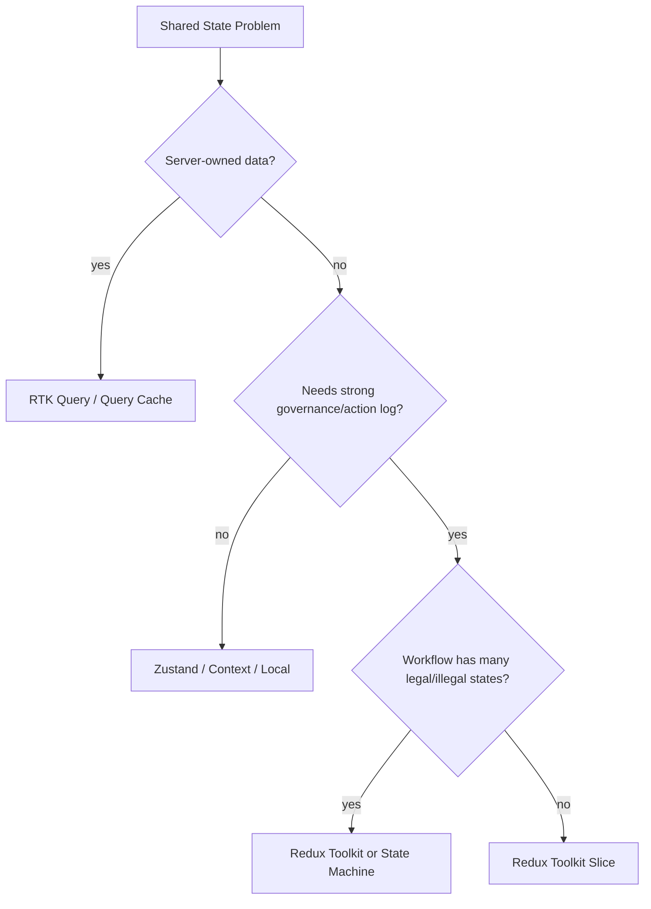

# Part 064 — Redux Toolkit in Production

Redux sering disalahpahami dari dua arah.

Arah pertama:

```txt
Redux itu selalu terlalu berat.
```

Arah kedua:

```txt
Semua state besar harus masuk Redux.
```

Keduanya lemah.
Redux Toolkit bukan sekadar global state library.
Dalam production team, Redux Toolkit adalah **governed state architecture**: action log, reducer transition, typed selectors, middleware, normalized entity utilities, async lifecycle convention, DevTools, dan ecosystem yang matang.

Gunakan Redux Toolkit saat masalahnya bukan hanya “component butuh state bersama”, tetapi:

```txt
- banyak team menyentuh state yang sama,
- transisi harus bisa ditelusuri,
- debugging butuh action timeline,
- state shape butuh normalisasi,
- business workflow butuh event/action vocabulary,
- side effects perlu middleware boundary,
- large app butuh conventions yang seragam,
- auditability dan regression testing lebih penting daripada minimal API.
```

Redux Toolkit adalah trade-off:

```txt
Lebih banyak struktur di depan.
Lebih sedikit kekacauan saat aplikasi dan tim membesar.
```

---

## 1. Redux Toolkit Dalam Taxonomy State

Redux Toolkit cocok untuk **shared client state** yang butuh governance.
Bukan semua state.

| State | Redux Toolkit? | Catatan |
|---|---:|---|
| Local input draft | Tidak | Pakai `useState` / form library |
| Modal open boolean lokal | Tidak | Local/lifted/context cukup |
| App-wide UI shell | Bisa | Jika banyak feature bergantung |
| Complex client entity state | Ya | `createEntityAdapter` membantu |
| Server data cache | Biasanya RTK Query, bukan slice manual | RTK Query bagian dari RTK ecosystem |
| Long-running workflow | Bisa | Reducer/action log berguna, tapi state machine mungkin lebih tepat |
| Permission/capability snapshot | Bisa | Tetap bukan final server authority |
| Audit-relevant UI transitions | Ya | Action timeline membantu debugging |
| Multi-step wizard shared across route | Bisa | Jika state perlu predictable transitions |

Decision diagram:



---

## 2. What Redux Toolkit Gives You

Redux Toolkit standardizes modern Redux usage.

Core pieces:

```txt
configureStore
  - creates store with good defaults
  - includes thunk middleware by default
  - sets up DevTools integration
  - enables middleware customization

createSlice
  - defines reducer + action creators together
  - uses Immer-style reducer logic internally
  - reduces action type boilerplate

createAsyncThunk
  - generates pending/fulfilled/rejected action lifecycle
  - includes requestId and thunkAPI

createEntityAdapter
  - normalized entity helpers
  - generated selectors

createSelector
  - memoized selectors

listenerMiddleware
  - action-driven side effects / workflows

RTK Query
  - data fetching/cache abstraction for Redux apps
```

Production meaning:

```txt
You get a language for state transitions.
You get a timeline of actions.
You get repeatable conventions for teams.
```

---

## 3. Basic Store Configuration

A production RTK app starts with store setup that exports types.

```tsx
// app/store.ts
import { configureStore } from '@reduxjs/toolkit';
import { caseWorkspaceReducer } from '@/features/case-workspace/case-workspace.slice';
import { invoiceReviewReducer } from '@/features/invoice-review/invoice-review.slice';

export const store = configureStore({
  reducer: {
    caseWorkspace: caseWorkspaceReducer,
    invoiceReview: invoiceReviewReducer,
  },
});

export type RootState = ReturnType<typeof store.getState>;
export type AppDispatch = typeof store.dispatch;
```

Typed hooks:

```tsx
// app/hooks.ts
import { useDispatch, useSelector } from 'react-redux';
import type { AppDispatch, RootState } from './store';

export const useAppDispatch = useDispatch.withTypes<AppDispatch>();
export const useAppSelector = useSelector.withTypes<RootState>();
```

Provider:

```tsx
import { Provider } from 'react-redux';
import { store } from './store';

root.render(
  <Provider store={store}>
    <App />
  </Provider>
);
```

Rule:

```txt
Never import RootState from feature slice.
RootState belongs to app/store boundary.
Feature selectors may accept RootState via exported selector functions.
```

---

## 4. Slice as State Boundary

A slice should represent a coherent state boundary.
Not necessarily one backend resource.

Bad slice names:

```txt
miscSlice
appSlice
commonSlice
dataSlice
```

Better:

```txt
caseWorkspaceSlice
invoiceReviewSlice
notificationCenterSlice
approvalDraftSlice
```

Example:

```tsx
import { createSlice, PayloadAction } from '@reduxjs/toolkit';

type CaseWorkspaceState = {
  activeTab: 'summary' | 'evidence' | 'timeline' | 'decision';
  selectedEvidenceIds: string[];
  rightPanel:
    | { tag: 'closed' }
    | { tag: 'evidenceDetail'; evidenceId: string }
    | { tag: 'commentThread'; threadId: string };
};

const initialState: CaseWorkspaceState = {
  activeTab: 'summary',
  selectedEvidenceIds: [],
  rightPanel: { tag: 'closed' },
};

const caseWorkspaceSlice = createSlice({
  name: 'caseWorkspace',
  initialState,
  reducers: {
    tabOpened(state, action: PayloadAction<CaseWorkspaceState['activeTab']>) {
      state.activeTab = action.payload;
    },

    evidenceToggled(state, action: PayloadAction<{ evidenceId: string }>) {
      const id = action.payload.evidenceId;
      const exists = state.selectedEvidenceIds.includes(id);

      state.selectedEvidenceIds = exists
        ? state.selectedEvidenceIds.filter((x) => x !== id)
        : [...state.selectedEvidenceIds, id];
    },

    evidenceDetailOpened(state, action: PayloadAction<{ evidenceId: string }>) {
      state.rightPanel = {
        tag: 'evidenceDetail',
        evidenceId: action.payload.evidenceId,
      };
    },

    rightPanelClosed(state) {
      state.rightPanel = { tag: 'closed' };
    },

    workspaceReset() {
      return initialState;
    },
  },
});

export const caseWorkspaceReducer = caseWorkspaceSlice.reducer;
export const caseWorkspaceActions = caseWorkspaceSlice.actions;
```

Notice action names:

```txt
tabOpened
evidenceToggled
evidenceDetailOpened
rightPanelClosed
workspaceReset
```

These are domain/UI events, not setters.

Anti-pattern:

```tsx
setActiveTab(state, action)
setSelectedEvidenceIds(state, action)
setRightPanel(state, action)
```

Setters leak implementation.
Events describe intent.

---

## 5. Immer Is Not A License For Bad State

Redux Toolkit lets you write mutating-looking reducer code using Immer.

```tsx
state.activeTab = 'timeline';
```

This is fine because Immer produces immutable updates.
But it does not fix bad state design.

Bad state:

```tsx
type State = {
  loading: boolean;
  success: boolean;
  error: boolean;
  data?: Case;
  errorMessage?: string;
};
```

This allows impossible state:

```txt
loading=true and success=true and error=true
```

Better:

```tsx
type LoadState =
  | { tag: 'idle' }
  | { tag: 'loading'; requestId: string }
  | { tag: 'success'; caseId: string }
  | { tag: 'error'; message: string };
```

Reducer should model transitions, not mutate booleans independently.

---

## 6. Selectors as Read Model

Do not let components know state shape too deeply.
Export selectors.

```tsx
// case-workspace.selectors.ts
import type { RootState } from '@/app/store';

export const selectCaseWorkspace = (state: RootState) => state.caseWorkspace;

export const selectActiveTab = (state: RootState) =>
  selectCaseWorkspace(state).activeTab;

export const selectSelectedEvidenceIds = (state: RootState) =>
  selectCaseWorkspace(state).selectedEvidenceIds;

export const selectSelectedEvidenceCount = (state: RootState) =>
  selectSelectedEvidenceIds(state).length;

export const selectIsEvidenceSelected = (evidenceId: string) =>
  (state: RootState) => selectSelectedEvidenceIds(state).includes(evidenceId);
```

Component:

```tsx
function EvidenceBadge() {
  const count = useAppSelector(selectSelectedEvidenceCount);
  return <span>{count}</span>;
}
```

Selector rule:

```txt
Component asks questions.
Selectors know state shape.
Reducers own transitions.
```

---

## 7. Memoized Selectors

When derived data is expensive or returns new references, use memoized selectors.

```tsx
import { createSelector } from '@reduxjs/toolkit';

const selectEvidenceEntities = (state: RootState) =>
  state.evidence.entities;

const selectSelectedEvidenceIds = (state: RootState) =>
  state.caseWorkspace.selectedEvidenceIds;

export const selectSelectedEvidenceItems = createSelector(
  [selectEvidenceEntities, selectSelectedEvidenceIds],
  (entities, ids) => ids.map((id) => entities[id]).filter(Boolean)
);
```

Avoid inline object selectors without equality:

```tsx
const value = useAppSelector((state) => ({
  count: state.caseWorkspace.selectedEvidenceIds.length,
  activeTab: state.caseWorkspace.activeTab,
}));
```

This creates a new object each call.
Use separate selectors, memoized selector, or `shallowEqual` where appropriate.

```tsx
import { shallowEqual } from 'react-redux';

const value = useAppSelector(
  (state) => ({
    count: selectSelectedEvidenceCount(state),
    activeTab: selectActiveTab(state),
  }),
  shallowEqual
);
```

---

## 8. Normalized State With `createEntityAdapter`

Redux shines when state is normalized and many parts of UI read the same entities.

Without normalization:

```tsx
type State = {
  cases: Array<{
    id: string;
    title: string;
    evidence: Evidence[];
  }>;
};
```

Problems:

```txt
- same entity duplicated in multiple arrays,
- updates require deep traversal,
- row component rerenders too widely,
- optimistic updates are harder,
- selectors become fragile.
```

With entity adapter:

```tsx
import {
  createEntityAdapter,
  createSlice,
  PayloadAction,
} from '@reduxjs/toolkit';

type Evidence = {
  id: string;
  caseId: string;
  label: string;
  status: 'new' | 'reviewed' | 'excluded';
};

const evidenceAdapter = createEntityAdapter<Evidence>({
  sortComparer: (a, b) => a.label.localeCompare(b.label),
});

const evidenceSlice = createSlice({
  name: 'evidence',
  initialState: evidenceAdapter.getInitialState({
    loadedCaseIds: [] as string[],
  }),
  reducers: {
    evidenceLoaded: evidenceAdapter.upsertMany,
    evidenceStatusChanged(
      state,
      action: PayloadAction<{ id: string; status: Evidence['status'] }>
    ) {
      evidenceAdapter.updateOne(state, {
        id: action.payload.id,
        changes: { status: action.payload.status },
      });
    },
  },
});
```

Selectors:

```tsx
const evidenceSelectors = evidenceAdapter.getSelectors<RootState>(
  (state) => state.evidence
);

export const selectEvidenceById = evidenceSelectors.selectById;
export const selectAllEvidence = evidenceSelectors.selectAll;
```

Feature-specific selector:

```tsx
export const selectEvidenceForCase = (caseId: string) =>
  createSelector([selectAllEvidence], (items) =>
    items.filter((item) => item.caseId === caseId)
  );
```

Caveat:

```txt
Selector factory must be scoped carefully.
If component creates a new memoized selector every render, memo cache is lost.
Use useMemo for parameterized memoized selector when needed.
```

---

## 9. Async Logic: Three Options

Redux Toolkit has several async boundaries.

```txt
1. createAsyncThunk
   - simple request lifecycle
   - manual reducers handle pending/fulfilled/rejected

2. listenerMiddleware
   - action-driven side effects
   - workflows triggered by actions
   - cancellation/debounce/orchestration

3. RTK Query
   - server-state cache
   - query/mutation endpoints
   - invalidation tags
   - generated hooks
```

Do not use slice + thunk as a homemade query cache if RTK Query fits.

---

## 10. `createAsyncThunk`: Request Lifecycle, Not Cache Strategy

Example:

```tsx
import { createAsyncThunk, createSlice } from '@reduxjs/toolkit';

export const fetchCaseSummary = createAsyncThunk(
  'caseSummary/fetchCaseSummary',
  async (caseId: string, thunkApi) => {
    const response = await caseApi.getSummary(caseId, {
      signal: thunkApi.signal,
    });
    return response.data;
  }
);

type CaseSummaryState = {
  entity: CaseSummary | null;
  status:
    | { tag: 'idle' }
    | { tag: 'loading'; requestId: string }
    | { tag: 'success' }
    | { tag: 'error'; message: string };
};

const initialState: CaseSummaryState = {
  entity: null,
  status: { tag: 'idle' },
};

const caseSummarySlice = createSlice({
  name: 'caseSummary',
  initialState,
  reducers: {},
  extraReducers: (builder) => {
    builder
      .addCase(fetchCaseSummary.pending, (state, action) => {
        state.status = {
          tag: 'loading',
          requestId: action.meta.requestId,
        };
      })
      .addCase(fetchCaseSummary.fulfilled, (state, action) => {
        if (
          state.status.tag === 'loading' &&
          state.status.requestId !== action.meta.requestId
        ) {
          return;
        }

        state.entity = action.payload;
        state.status = { tag: 'success' };
      })
      .addCase(fetchCaseSummary.rejected, (state, action) => {
        if (
          state.status.tag === 'loading' &&
          state.status.requestId !== action.meta.requestId
        ) {
          return;
        }

        state.status = {
          tag: 'error',
          message: action.error.message ?? 'Failed to fetch case summary',
        };
      });
  },
});
```

`createAsyncThunk` gives request lifecycle actions.
It does not decide your loading state shape or cache invalidation strategy.
You still own that design.

---

## 11. Listener Middleware: Action-Driven Effects

Listener middleware is useful when an action should trigger side effects without putting effect logic in React components.

Example:

```tsx
import { createListenerMiddleware } from '@reduxjs/toolkit';
import { caseWorkspaceActions } from '@/features/case-workspace/case-workspace.slice';

export const listenerMiddleware = createListenerMiddleware();

listenerMiddleware.startListening({
  actionCreator: caseWorkspaceActions.evidenceDetailOpened,
  effect: async (action, listenerApi) => {
    analytics.track('evidence_detail_opened', {
      evidenceId: action.payload.evidenceId,
    });
  },
});
```

Store setup:

```tsx
export const store = configureStore({
  reducer: rootReducer,
  middleware: (getDefaultMiddleware) =>
    getDefaultMiddleware().prepend(listenerMiddleware.middleware),
});
```

Good uses:

```txt
- analytics after domain/UI action,
- debounce search action,
- cancel stale workflows,
- persist small preference after action,
- coordinate actions across slices,
- trigger toast on fulfilled/rejected action.
```

Bad uses:

```txt
- hiding core business transition outside reducer,
- making implicit action chains nobody can trace,
- replacing server-state cache,
- mixing UI event and backend transaction without idempotency.
```

---

## 12. RTK Query Boundary

RTK Query is intended for server-state fetching/caching in Redux apps.
Use it when you need query keys, caching, invalidation, mutations, and generated hooks.

Example sketch:

```tsx
import { createApi, fetchBaseQuery } from '@reduxjs/toolkit/query/react';

export const caseApi = createApi({
  reducerPath: 'caseApi',
  baseQuery: fetchBaseQuery({ baseUrl: '/api' }),
  tagTypes: ['Case', 'Evidence'],
  endpoints: (builder) => ({
    getCase: builder.query<CaseDto, string>({
      query: (caseId) => `/cases/${caseId}`,
      providesTags: (_result, _error, caseId) => [{ type: 'Case', id: caseId }],
    }),

    approveCase: builder.mutation<void, { caseId: string }>({
      query: ({ caseId }) => ({
        url: `/cases/${caseId}/approve`,
        method: 'POST',
      }),
      invalidatesTags: (_result, _error, { caseId }) => [
        { type: 'Case', id: caseId },
      ],
    }),
  }),
});

export const { useGetCaseQuery, useApproveCaseMutation } = caseApi;
```

Store setup:

```tsx
export const store = configureStore({
  reducer: {
    [caseApi.reducerPath]: caseApi.reducer,
    caseWorkspace: caseWorkspaceReducer,
  },
  middleware: (getDefaultMiddleware) =>
    getDefaultMiddleware().concat(caseApi.middleware),
});
```

Boundary rule:

```txt
RTK Query owns remote data cache.
Slices own client UI/workflow state.
Do not duplicate server entities into slices unless you have a clear denormalized client editing model.
```

---

## 13. Component Usage Pattern

A component should read via selectors and dispatch action intent.

```tsx
function EvidenceRow({ evidenceId }: { evidenceId: string }) {
  const dispatch = useAppDispatch();
  const evidence = useAppSelector((state) =>
    selectEvidenceById(state, evidenceId)
  );
  const selected = useAppSelector(selectIsEvidenceSelected(evidenceId));

  if (!evidence) return null;

  return (
    <button
      aria-pressed={selected}
      onClick={() =>
        dispatch(caseWorkspaceActions.evidenceToggled({ evidenceId }))
      }
    >
      {evidence.label}
    </button>
  );
}
```

Keep component free from state shape details:

```tsx
// Bad
const selected = state.caseWorkspace.selectedEvidenceIds.includes(evidenceId);

// Good
const selected = useAppSelector(selectIsEvidenceSelected(evidenceId));
```

---

## 14. Feature Folder Structure

Recommended:

```txt
src/
  app/
    store.ts
    hooks.ts
  features/
    case-workspace/
      case-workspace.slice.ts
      case-workspace.selectors.ts
      case-workspace.types.ts
      case-workspace.listener.ts
      components/
        CaseWorkspacePage.tsx
        EvidencePanel.tsx
    evidence/
      evidence.slice.ts
      evidence.selectors.ts
    case-api/
      case-api.ts
```

Avoid folder-by-type for large apps:

```txt
reducers/
actions/
selectors/
components/
```

Feature folders preserve locality.
Shared app store composes reducers.

---

## 15. Cross-Slice Coordination

Cross-slice coordination should be explicit.

Option 1 — one action handled by multiple slices:

```tsx
const caseClosed = createAction<{ caseId: string }>('case/caseClosed');

const workspaceSlice = createSlice({
  name: 'caseWorkspace',
  initialState,
  reducers: {},
  extraReducers: (builder) => {
    builder.addCase(caseClosed, () => initialState);
  },
});

const notificationsSlice = createSlice({
  name: 'notifications',
  initialState: notificationsInitialState,
  reducers: {},
  extraReducers: (builder) => {
    builder.addCase(caseClosed, (state, action) => {
      state.items.push({
        id: crypto.randomUUID(),
        message: `Case ${action.payload.caseId} was closed`,
      });
    });
  },
});
```

Option 2 — listener dispatches follow-up actions:

```tsx
listenerMiddleware.startListening({
  actionCreator: caseActions.caseClosed,
  effect: async (action, api) => {
    api.dispatch(caseWorkspaceActions.workspaceReset());
    api.dispatch(notificationActions.toastAdded({
      message: `Case ${action.payload.caseId} closed`,
    }));
  },
});
```

Rule:

```txt
If it is a domain event, multiple reducers may react.
If it is a side effect, listener middleware may react.
Do not make component manually dispatch five low-level actions unless that sequence is truly UI-specific.
```

---

## 16. Middleware Governance

Redux middleware can become invisible complexity.
Use it deliberately.

Default middleware handles useful development checks and thunk.
Customize only with reason.

```tsx
export const store = configureStore({
  reducer: rootReducer,
  middleware: (getDefaultMiddleware) =>
    getDefaultMiddleware({
      serializableCheck: {
        ignoredActions: ['some/nonSerializableAction'],
      },
    }).prepend(listenerMiddleware.middleware),
});
```

Serializability rule:

```txt
Redux state and actions should generally be serializable.
Do not put class instances, DOM nodes, AbortController, Promise, Map/Set, or functions in Redux state unless you fully understand the debugging/devtools trade-off.
```

If you need non-serializable handles:

```txt
- store them in refs,
- external service registry,
- listener middleware local scope,
- or a dedicated non-React module.
```

---

## 17. Persistence With Redux

Persist only deliberate state.

Examples that may be persisted:

```txt
- user UI preferences,
- dismissed banners,
- saved table columns,
- draft if product requirement demands it.
```

Avoid persisting:

```txt
- loading flags,
- server cache without invalidation model,
- sensitive auth tokens without threat model,
- non-serializable values,
- data that should reset on logout/tenant switch.
```

Persistence policy should answer:

```txt
Which slices persist?
Which fields?
What version?
What migration?
What logout cleanup?
What tenant/user key?
What storage quota behavior?
```

---

## 18. Permission-Aware Redux State

For regulatory/enterprise systems, Redux often stores UI capability snapshots.

Example:

```tsx
type Capability =
  | 'case:read'
  | 'case:comment'
  | 'case:approve'
  | 'case:escalate';

type CapabilityState = {
  capabilitiesByCaseId: Record<string, Capability[]>;
};

export const selectCanApproveCase = (caseId: string) =>
  (state: RootState) =>
    state.capabilities.capabilitiesByCaseId[caseId]?.includes('case:approve') ?? false;
```

Important:

```txt
Client permission state controls UX affordances.
Server still enforces authorization.
```

Do not use Redux permission state as security boundary.
Use it for display, disabled state, routing hints, and explanatory UI.

---

## 19. Testing Redux Toolkit

Reducer tests:

```tsx
test('evidenceToggled selects then deselects evidence', () => {
  let state = caseWorkspaceReducer(
    undefined,
    caseWorkspaceActions.evidenceToggled({ evidenceId: 'e-1' })
  );

  expect(state.selectedEvidenceIds).toEqual(['e-1']);

  state = caseWorkspaceReducer(
    state,
    caseWorkspaceActions.evidenceToggled({ evidenceId: 'e-1' })
  );

  expect(state.selectedEvidenceIds).toEqual([]);
});
```

Selector tests:

```tsx
test('selectSelectedEvidenceCount returns count', () => {
  const state = buildRootState({
    caseWorkspace: {
      ...initialState,
      selectedEvidenceIds: ['a', 'b'],
    },
  });

  expect(selectSelectedEvidenceCount(state)).toBe(2);
});
```

Integration test with store:

```tsx
function renderWithStore(ui: React.ReactElement, preloadedState?: Partial<RootState>) {
  const store = configureStore({
    reducer: rootReducer,
    preloadedState,
  });

  return {
    store,
    ...render(<Provider store={store}>{ui}</Provider>),
  };
}
```

Async test:

```tsx
test('fetchCaseSummary handles fulfilled result', async () => {
  const store = setupTestStore();

  await store.dispatch(fetchCaseSummary('case-1'));

  expect(selectCaseSummaryStatus(store.getState()).tag).toBe('success');
});
```

Testing rule:

```txt
Reducer tests validate transition logic.
Selector tests validate read model.
Integration tests validate wiring.
Avoid testing Redux Toolkit internals.
```

---

## 20. Observability

Redux DevTools is one of Redux's major production-development strengths.
A good action log reads like a story.

Good:

```txt
caseWorkspace/evidenceToggled
caseWorkspace/evidenceDetailOpened
caseSummary/fetchCaseSummary/pending
caseSummary/fetchCaseSummary/fulfilled
case/approveStarted
case/approveSucceeded
```

Bad:

```txt
setValue
update
changeData
common/setState
```

For regulated workflow UI, action names become debugging evidence:

```txt
At 10:31:22 user opened evidence detail.
At 10:31:25 user selected evidence e-42.
At 10:31:31 approve mutation started.
At 10:31:33 approve mutation rejected.
Toast displayed with reason.
```

This is not legal audit by itself, but it is valuable engineering observability.

---

## 21. Performance Model

Redux performance depends heavily on selectors and state shape.

Avoid:

```tsx
const root = useAppSelector((state) => state);
```

Prefer narrow selectors:

```tsx
const activeTab = useAppSelector(selectActiveTab);
```

Avoid reducers that replace huge state unnecessarily.

```tsx
// Bad if it recreates too much
return expensiveDeepCloneAndModify(state);
```

Prefer normalized updates:

```tsx
evidenceAdapter.updateOne(state, {
  id,
  changes: { status: 'reviewed' },
});
```

Rerender containment strategy:

```txt
- normalize entities,
- row components select entity by ID,
- memoize expensive derived selectors,
- avoid inline object selectors,
- avoid root-state selection,
- split feature slices by lifecycle and ownership,
- profile before optimizing blindly.
```

---

## 22. Redux Toolkit vs Zustand

| Dimension | Zustand | Redux Toolkit |
|---|---|---|
| Boilerplate | Lower | Medium |
| Freedom | High | Lower but safer |
| Team governance | You must create | Built-in conventions |
| Action log | Middleware/devtools possible | Core strength |
| Reducer discipline | Optional | Central |
| Normalized helpers | Manual | `createEntityAdapter` |
| Async lifecycle | Manual | `createAsyncThunk`, listener, RTK Query |
| Server-state option | External tool usually | RTK Query integrated |
| Best fit | Pragmatic app/client UI store | Large app shared state with traceability |

Rule:

```txt
Zustand optimizes local freedom.
Redux Toolkit optimizes shared governance.
```

---

## 23. Redux Toolkit Failure Modes

### 23.1 Everything Goes Into Redux

Symptom:

```txt
input text, hover state, modal local state, fetch cache, permission, form draft, ephemeral animation state all live in Redux.
```

Fix:

```txt
Move local state local.
Move server state to RTK Query/query cache.
Keep Redux for shared client state needing governance.
```

---

### 23.2 Slice Is Just Setters

Symptom:

```tsx
reducers: {
  setActiveTab,
  setSelectedIds,
  setPanel,
  setLoading,
}
```

Fix:

```txt
Name actions as events/intents.
Encode invariant in reducer.
```

---

### 23.3 Boolean Lifecycle Explosion

Symptom:

```tsx
loading: false,
loaded: true,
failed: true,
```

Fix:

```txt
Use discriminated union lifecycle state.
```

---

### 23.4 Duplicated Server State

Symptom:

```txt
RTK Query cache has case data, slice also has case data, component reads both.
```

Fix:

```txt
One authority.
Use selectors/view models to combine cache data and client UI state.
```

---

### 23.5 Non-Serializable State

Symptom:

```txt
Redux DevTools breaks or state cannot be replayed because functions/classes/DOM nodes live in state.
```

Fix:

```txt
Keep Redux state serializable.
Move handles to refs/external services.
```

---

### 23.6 Action Chain Is Hidden In Middleware

Symptom:

```txt
Dispatch A mysteriously causes B, C, D across listeners; nobody knows why.
```

Fix:

```txt
Document listener flows.
Keep core state transitions in reducers.
Use listener for side effects/orchestration, not invisible business rules.
```

---

## 24. Refactor Recipes

### Local Reducer → Redux Slice

Use when same reducer state must be shared across routes/features.

```txt
1. Extract state and events types.
2. Move reducer transitions into createSlice reducers.
3. Replace local dispatch with Redux dispatch.
4. Export selectors.
5. Write reducer tests before moving UI.
```

---

### Redux Slice → RTK Query

Use when slice is really server cache.

```txt
1. Identify fetch lifecycle fields.
2. Define API endpoint and tags.
3. Replace thunk dispatch with generated query hook.
4. Remove duplicated entity state.
5. Keep client UI selection/filter state in slice if needed.
```

---

### Redux Global → Local State

Use when state has one owner and no shared governance need.

```txt
1. Find selectors used by only one subtree.
2. Move state to local reducer.
3. Pass data/commands through props/composition.
4. Remove slice after tests pass.
```

---

## 25. Production Checklist

Before adding or changing Redux state:

```txt
[ ] This state has a clear owner slice.
[ ] This state is not better represented as local state.
[ ] This state is not server cache better handled by RTK Query/query layer.
[ ] Action names describe events/intents, not setter mechanics.
[ ] Reducers enforce invariants.
[ ] Lifecycle state avoids boolean explosion.
[ ] Selectors hide internal state shape from components.
[ ] Expensive derived selectors are memoized.
[ ] Entity collections are normalized when needed.
[ ] Async request race/cancellation has been considered.
[ ] Non-serializable values are not stored in Redux state.
[ ] Cross-slice coordination is explicit.
[ ] Tests cover reducers, selectors, and critical integration paths.
[ ] DevTools action log is meaningful.
```

---

## 26. Latihan Implementasi

Bangun Redux Toolkit architecture untuk **case approval workspace**.

Requirement:

```txt
Slices:
- caseWorkspace: activeTab, selectedEvidenceIds, rightPanel
- capabilities: capabilitiesByCaseId
- notificationCenter: toast queue

RTK Query:
- getCase(caseId)
- getEvidence(caseId)
- approveCase(caseId)

Selectors:
- selectActiveTab
- selectSelectedEvidenceCount
- selectCanApproveCase(caseId)
- selectCaseApprovalViewModel(caseId)

Listener middleware:
- when approveCase fulfilled, add success toast and reset selection
- when approveCase rejected, add error toast

Tests:
- reducer transition for selection
- selector for canApprove
- integration for approve fulfilled listener
```

Constraint:

```txt
- Do not duplicate RTK Query case data into a normal slice.
- Do not store DOM nodes or AbortController in Redux state.
- Use discriminated union for rightPanel.
- Use event-style action names.
```

---

## 27. Ringkasan

Redux Toolkit adalah pilihan kuat ketika state bukan hanya soal “sharing”.
Ia berguna ketika state perlu governance, traceability, shared conventions, normalized updates, and action-based debugging.

Gunakan Redux Toolkit untuk:

```txt
- shared client state dengan banyak pembaca/penulis,
- state transition yang perlu dilacak,
- normalized entity state,
- action-driven side effects,
- app besar dengan banyak engineer,
- UI workflow yang butuh convention kuat.
```

Jangan gunakan Redux Toolkit untuk:

```txt
- semua local input state,
- server cache manual tanpa alasan,
- ephemeral animation/hover state,
- state yang hanya dibaca satu component,
- menyimpan non-serializable handles.
```

Redux yang baik terasa seperti event log yang bisa dipahami.
Redux yang buruk terasa seperti database global untuk semua variabel UI.

---

## Referensi

- Redux Toolkit — Usage Guide: https://redux-toolkit.js.org/usage/usage-guide
- Redux Toolkit — `createAsyncThunk`: https://redux-toolkit.js.org/api/createAsyncThunk
- Redux Toolkit — Usage With TypeScript: https://redux-toolkit.js.org/usage/usage-with-typescript
- Redux Toolkit — RTK Query Overview: https://redux-toolkit.js.org/rtk-query/overview
- React Redux — Hooks API: https://react-redux.js.org/api/hooks
