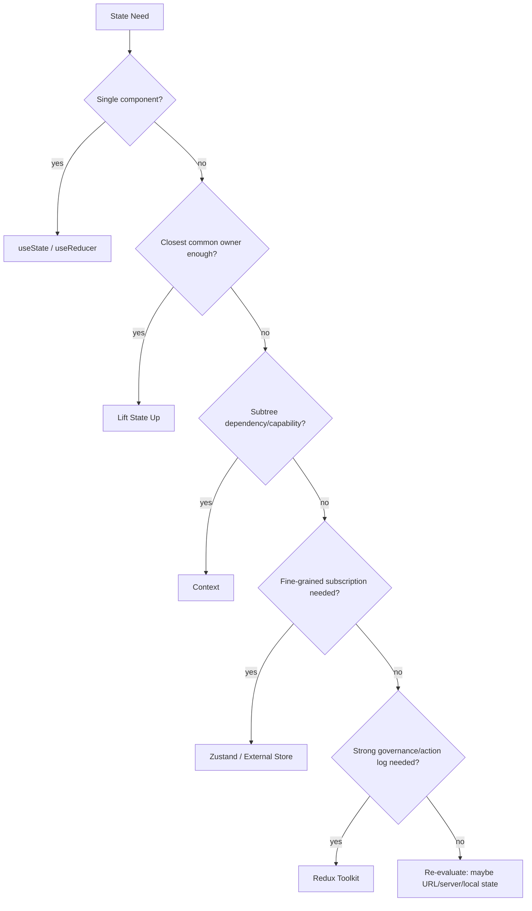
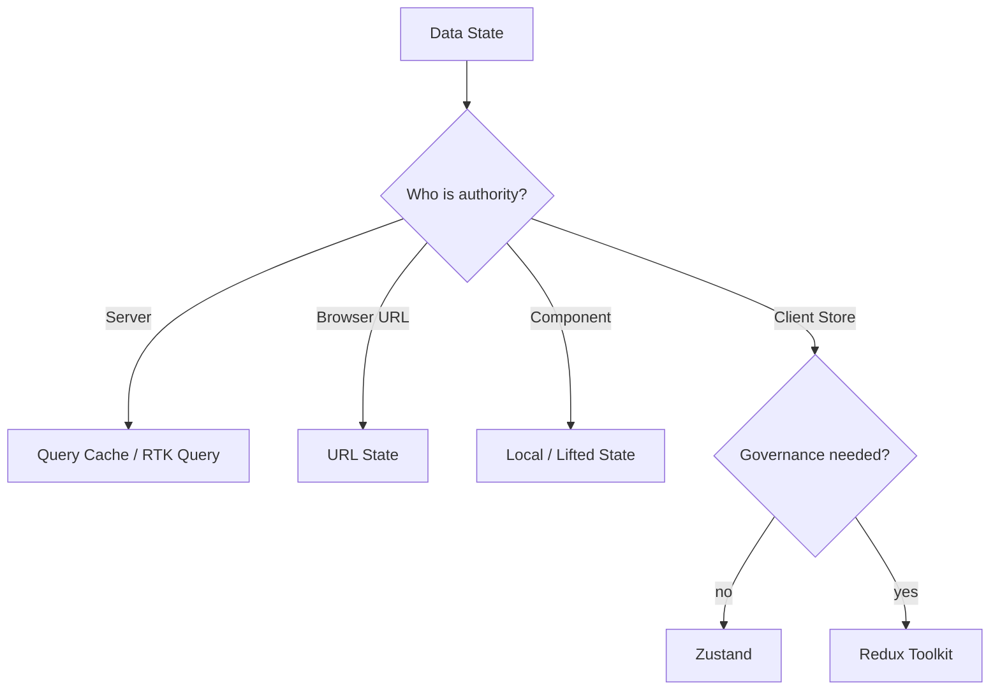
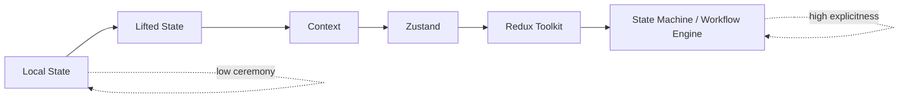
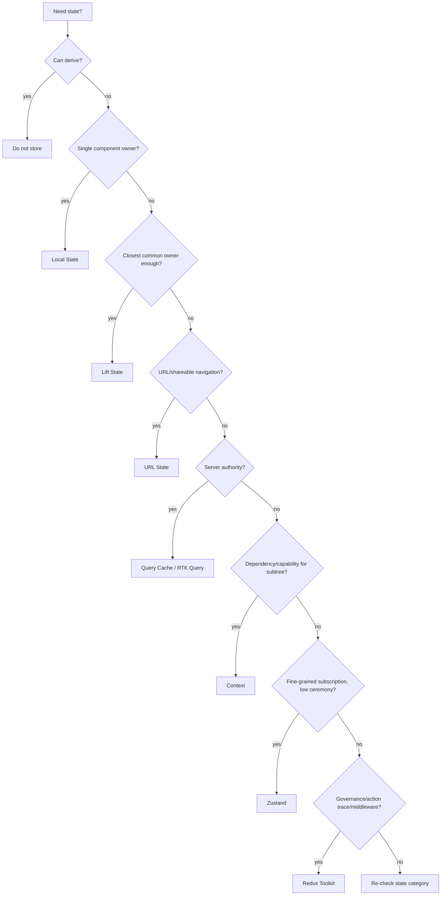

# Part 065 — Redux vs Zustand vs Context

Banyak diskusi state management React berhenti di level selera:

```txt
Context itu cukup.
Redux itu terlalu berat.
Zustand itu lebih simple.
```

Kalimat seperti itu terlalu dangkal untuk codebase besar.
Pertanyaan yang benar bukan “library mana paling bagus?”, tetapi:

```txt
State apa yang sedang kita kelola?
Siapa pemiliknya?
Siapa yang boleh mengubahnya?
Berapa luas radius pembacaannya?
Seberapa sering berubah?
Apakah perlu action log?
Apakah perlu selector granularity?
Apakah state ini server-owned, client-owned, workflow-owned, atau capability-owned?
Apa failure mode jika tool yang dipilih salah?
```

Context, Zustand, dan Redux Toolkit bukan tiga versi dari benda yang sama.
Mereka menyelesaikan kelas masalah yang overlap, tetapi pusat gravitasinya berbeda.

```txt
Context       = dependency/capability passing untuk subtree.
Zustand       = lightweight external store dengan selector ergonomics.
Redux Toolkit = governed state architecture dengan reducer/action/middleware convention.
```

Kalau kamu memilih berdasarkan “lebih populer” atau “lebih sedikit boilerplate”, kamu belum memilih arsitektur.
Kamu baru memilih ergonomi.

Arsitektur memilih berdasarkan invariant, failure mode, scale, dan maintenance cost.

---

## 1. First Principle: State Tool Is Ownership Tool

Setiap state management tool menjawab satu pertanyaan fundamental:

```txt
Di mana state hidup, dan siapa yang mengontrol perubahan state itu?
```

React local state menjawab:

```txt
State hidup di component instance.
```

Lifted state menjawab:

```txt
State hidup di closest owner yang mengoordinasi beberapa children.
```

Context menjawab:

```txt
Value disediakan oleh provider untuk subtree.
```

Zustand menjawab:

```txt
State hidup di external store yang dapat dibaca component melalui selector.
```

Redux Toolkit menjawab:

```txt
State hidup di centralized governed store, berubah lewat action/reducer/middleware convention.
```

Perbedaan ini kecil di aplikasi demo.
Perbedaan ini besar di aplikasi production.

Diagram ownership:



Mental model penting:

```txt
Jangan mulai dari library.
Mulai dari ownership.
```

---

## 2. The Three Tools in One Sentence Each

### Context

Context adalah mekanisme React untuk membuat value tersedia ke subtree tanpa prop drilling.
Context paling kuat ketika value-nya adalah **dependency**, **capability**, **configuration**, atau **low-frequency scoped state**.

Contoh cocok:

```txt
- theme
- locale
- direction
- form field context
- modal service capability
- permission snapshot untuk subtree
- feature flag reader
- analytics capability
- dependency injection untuk testing
```

Context bukan selector store.
Context update akan membuat consumer yang membaca context tersebut ikut masuk siklus render.

---

### Zustand

Zustand adalah external store ringan dengan API hook-friendly.
Ia cocok saat kamu butuh **shared client state** dengan selector subscription, sedikit ceremony, dan store kecil/menengah yang mudah dibaca.

Contoh cocok:

```txt
- UI workspace state
- selection state besar
- editor state client-owned
- command palette state
- modal/overlay registry
- client-side graph/layout state
- persisted user preference
- micro store per feature
```

Zustand kuat ketika tim butuh pragmatisme dan granularity, tetapi belum butuh governance Redux-level.

---

### Redux Toolkit

Redux Toolkit adalah Redux modern dengan convention resmi: `configureStore`, `createSlice`, middleware, typed hooks, selector, entity adapter, async lifecycle, dan DevTools timeline.
Ia cocok saat shared client state membutuhkan **governance**, **action vocabulary**, **observability**, **middleware boundary**, dan **team-scale consistency**.

Contoh cocok:

```txt
- large shared client state
- normalized client entity cache non-server-authoritative
- audit-relevant UI transitions
- cross-feature workflow state
- team-wide action/reducer convention
- debugging via action timeline
- deterministic state transition tests
```

Redux Toolkit bukan “global state untuk semua hal”.
Ia adalah struktur untuk state yang benar-benar layak digovern.

---

## 3. Quick Decision Table

| Question | Context | Zustand | Redux Toolkit |
|---|---:|---:|---:|
| Perlu menghindari prop drilling untuk dependency? | Sangat cocok | Bisa, tapi overkill | Bisa, tapi biasanya salah layer |
| State sering berubah dan banyak consumer? | Hati-hati | Cocok | Cocok |
| Perlu selector granular? | Tidak native | Cocok | Cocok via selector/react-redux |
| Perlu action log/DevTools timeline kuat? | Tidak | Terbatas/middleware | Sangat cocok |
| Perlu middleware governance? | Tidak | Terbatas | Sangat cocok |
| Perlu structure untuk banyak team? | Lemah | Sedang | Kuat |
| Perlu API minimal? | Kuat | Kuat | Sedang/lemah |
| Perlu normalized entity helpers? | Manual | Manual | Kuat via entity adapter |
| Cocok untuk capability passing? | Sangat cocok | Bisa | Jarang |
| Cocok untuk server-state cache? | Tidak | Tidak ideal | RTK Query bisa |
| Cocok untuk local component state? | Tidak | Biasanya tidak | Tidak |
| Cocok untuk subtree-scoped provider state? | Bisa | Bisa scoped store | Bisa, tapi berat |
| Debugging accidental global coupling? | Sulit | Sedang | Lebih mudah dengan actions |

Rule of thumb:

```txt
Context untuk membaca dependency.
Zustand untuk shared client state yang butuh granular subscription tanpa governance besar.
Redux Toolkit untuk shared client state yang butuh convention, traceability, dan team governance.
```

---

## 4. The Dangerous Question: “Can Context Replace Redux?”

Pertanyaan ini sering muncul, tetapi framing-nya lemah.

Context dan Redux Toolkit overlap pada satu area:

```txt
shared state yang dibaca banyak component
```

Tetapi keduanya tidak memiliki kontrak yang sama.

Context memberikan:

```txt
Provider -> Consumer dependency propagation
```

Redux Toolkit memberikan:

```txt
Store -> Action -> Reducer -> Middleware -> Selector -> Subscriber
```

Jika masalahmu hanya:

```txt
Saya tidak mau prop drilling theme/locale/session/capability.
```

Context cukup.

Jika masalahmu:

```txt
Saya butuh action vocabulary, transition log, middleware, normalized entity state, dan multi-team convention.
```

Context bukan replacement Redux.

Context dapat membawa reducer.
Tetapi reducer+context tetap tidak otomatis memberi:

```txt
- selector-level subscription native,
- middleware pipeline matang,
- DevTools action timeline sekuat Redux,
- ecosystem entity adapter,
- standard async lifecycle convention,
- team-wide state governance.
```

Reducer+Context adalah bagus untuk scoped complex state.
Bukan pengganti otomatis untuk governed app state.

---

## 5. Context: When It Is the Right Tool

Gunakan Context saat value memenuhi minimal satu dari kondisi ini:

```txt
- Dibutuhkan oleh banyak descendant dalam subtree.
- Value adalah dependency/capability, bukan volatile data utama.
- Update frequency rendah atau provider scope kecil.
- Provider hierarchy punya arti arsitektural.
- Consumer memang bergantung pada environment tersebut.
```

Contoh production:

```tsx
const PermissionContext = createContext<PermissionReader | null>(null);

export function PermissionProvider({
  permissions,
  children,
}: {
  permissions: PermissionSnapshot;
  children: React.ReactNode;
}) {
  const reader = useMemo(() => createPermissionReader(permissions), [permissions]);

  return (
    <PermissionContext.Provider value={reader}>
      {children}
    </PermissionContext.Provider>
  );
}

export function usePermission() {
  const reader = useContext(PermissionContext);
  if (!reader) {
    throw new Error('usePermission must be used inside PermissionProvider');
  }
  return reader;
}
```

Kenapa ini cocok?

```txt
Permission reader adalah capability.
Consumer tidak perlu tahu dari mana permission berasal.
Provider scope dapat berbeda per page/tenant/session.
```

Kapan mulai buruk?

```tsx
type AppContextValue = {
  user: User | null;
  theme: Theme;
  selectedRows: string[];
  currentSearchText: string;
  notifications: Notification[];
  draftInvoice: InvoiceDraft;
  setSelectedRows: Dispatch<SetStateAction<string[]>>;
  setCurrentSearchText: Dispatch<SetStateAction<string>>;
  setDraftInvoice: Dispatch<SetStateAction<InvoiceDraft>>;
};
```

Ini bukan context.
Ini dumping ground.

Masalahnya:

```txt
- domain tidak terkait masuk satu value,
- update kecil dapat memengaruhi banyak consumer,
- setter mentah bocor,
- ownership tidak jelas,
- testing butuh mock raksasa,
- refactor jadi mahal.
```

Context yang baik biasanya punya nama sempit:

```txt
ThemeContext
FieldContext
DialogContext
PermissionContext
AnalyticsContext
FormSectionContext
```

Context yang buruk biasanya punya nama terlalu luas:

```txt
AppContext
GlobalContext
SharedContext
CommonContext
StoreContext
```

---

## 6. Zustand: When It Is the Right Tool

Gunakan Zustand saat kamu butuh:

```txt
- shared client state,
- selector subscription,
- API kecil,
- store/action dekat dengan feature,
- tidak butuh action log governance berat,
- mudah membuat scoped store jika perlu,
- persistence middleware sederhana,
- subscription dari non-React code.
```

Contoh production: selection model besar.

```tsx
import { create } from 'zustand';

interface SelectionStore {
  selectedIds: Set<string>;
  isSelected(id: string): boolean;
  select(id: string): void;
  deselect(id: string): void;
  toggle(id: string): void;
  clear(): void;
}

export const useSelectionStore = create<SelectionStore>((set, get) => ({
  selectedIds: new Set<string>(),

  isSelected: (id) => get().selectedIds.has(id),

  select: (id) =>
    set((state) => {
      const next = new Set(state.selectedIds);
      next.add(id);
      return { selectedIds: next };
    }),

  deselect: (id) =>
    set((state) => {
      const next = new Set(state.selectedIds);
      next.delete(id);
      return { selectedIds: next };
    }),

  toggle: (id) =>
    set((state) => {
      const next = new Set(state.selectedIds);
      if (next.has(id)) next.delete(id);
      else next.add(id);
      return { selectedIds: next };
    }),

  clear: () => set({ selectedIds: new Set() }),
}));
```

Consumer granular:

```tsx
function Row({ id }: { id: string }) {
  const selected = useSelectionStore((state) => state.selectedIds.has(id));
  const toggle = useSelectionStore((state) => state.toggle);

  return (
    <button aria-pressed={selected} onClick={() => toggle(id)}>
      {selected ? 'Selected' : 'Select'}
    </button>
  );
}
```

Mengapa bukan Context?

```txt
Banyak row membaca bagian kecil dari state.
Perubahan selection satu row tidak seharusnya membuat semua consumer context membaca root value yang sama.
Selector subscription lebih natural.
```

Mengapa bukan Redux Toolkit?

```txt
Jika state ini feature-local, action log tidak audit-critical, dan tim tidak butuh convention Redux-level, Zustand cukup.
```

Zustand menjadi buruk ketika:

```txt
- semua feature membuat singleton store global tanpa boundary,
- action naming tidak konsisten,
- state server cache masuk store manual,
- persistence dipakai tanpa versioning/migration,
- selector mengembalikan object/array baru setiap render,
- store menjadi implicit dependency dari semua component.
```

Zustand itu simple.
Tetapi simple tidak berarti bebas desain.

---

## 7. Redux Toolkit: When It Is the Right Tool

Gunakan Redux Toolkit saat shared state butuh **governance**.

Governance berarti:

```txt
- transisi state harus punya nama,
- event/action vocabulary harus konsisten,
- debugging butuh timeline,
- side effects butuh middleware boundary,
- reducer transition perlu dites,
- entity state perlu normalisasi,
- banyak team bergantung pada state yang sama,
- refactor perlu dilakukan dengan contract jelas.
```

Contoh slice:

```tsx
import { createSlice, PayloadAction } from '@reduxjs/toolkit';

type BulkActionState =
  | { status: 'idle'; selectedIds: string[] }
  | { status: 'confirming'; selectedIds: string[]; operation: 'archive' | 'delete' }
  | { status: 'submitting'; selectedIds: string[]; operation: 'archive' | 'delete'; requestId: string }
  | { status: 'failed'; selectedIds: string[]; operation: 'archive' | 'delete'; message: string };

const initialState: BulkActionState = {
  status: 'idle',
  selectedIds: [],
};

const bulkActionSlice = createSlice({
  name: 'bulkAction',
  initialState,
  reducers: {
    selectionChanged(state, action: PayloadAction<string[]>) {
      if (state.status === 'submitting') return;
      return { status: 'idle', selectedIds: action.payload };
    },

    confirmationRequested(
      state,
      action: PayloadAction<{ operation: 'archive' | 'delete' }>,
    ) {
      if (state.status !== 'idle') return;
      if (state.selectedIds.length === 0) return;
      return {
        status: 'confirming',
        selectedIds: state.selectedIds,
        operation: action.payload.operation,
      };
    },

    submissionStarted(state, action: PayloadAction<{ requestId: string }>) {
      if (state.status !== 'confirming') return;
      return {
        status: 'submitting',
        selectedIds: state.selectedIds,
        operation: state.operation,
        requestId: action.payload.requestId,
      };
    },

    submissionFailed(state, action: PayloadAction<{ message: string }>) {
      if (state.status !== 'submitting') return;
      return {
        status: 'failed',
        selectedIds: state.selectedIds,
        operation: state.operation,
        message: action.payload.message,
      };
    },

    dismissed() {
      return initialState;
    },
  },
});
```

Perhatikan bentuk state:

```txt
status bukan boolean terpisah.
State shape mencegah illegal combinations.
Action names adalah domain vocabulary UI.
Reducer menjadi transition table yang bisa dites.
```

Redux Toolkit cocok karena workflow ini lebih dari “shared boolean”.
Ia adalah state machine-ish client workflow yang butuh traceability.

---

## 8. Comparison by Architectural Dimension

### 8.1 Ownership

| Tool | Ownership Shape |
|---|---|
| Context | Provider owns value for subtree |
| Zustand | Store owns state; component selects slice |
| Redux Toolkit | Store owns state; reducers own transition rules |

Kesalahan umum:

```txt
Menggunakan Context ketika ownership sebenarnya external store.
Menggunakan Zustand ketika ownership sebenarnya server cache.
Menggunakan Redux ketika ownership sebenarnya local component.
```

---

### 8.2 Update Frequency

| Update Frequency | Best Fit | Why |
|---|---|---|
| Very low | Context | Theme/locale/capability stable |
| Medium | Context or Zustand | Depends on consumer fan-out |
| High | Zustand / Redux | Selector subscription contains blast radius |
| Per keystroke local | Local state | Jangan angkat tanpa alasan |
| Server refresh | Query cache / RTK Query | Server authority/invalidation |

Context dengan high-frequency state sering mahal bukan karena Context “jelek”, tetapi karena Context tidak didesain sebagai fine-grained subscription store.

---

### 8.3 Sharing Radius

| Radius | Fit |
|---|---|
| Single component | Local state |
| Parent + direct children | Lifted state |
| Subtree dependency | Context |
| Cross-tree feature state | Zustand / Redux |
| App-wide governed state | Redux Toolkit |
| Shareable browser state | URL |
| Server-owned data | Query cache / RTK Query |

Sharing radius yang terlalu luas adalah smell.
State yang bisa local jangan dipaksa global.

---

### 8.4 Observability

| Tool | Observability Default |
|---|---|
| Context | Weak; mostly React DevTools/tree inspection |
| Zustand | Medium; can add devtools/logging middleware |
| Redux Toolkit | Strong; action timeline, middleware, DevTools ecosystem |

Jika debugging production membutuhkan pertanyaan:

```txt
Action apa yang mengubah state ini?
Urutannya apa?
Payload-nya apa?
Middleware apa yang berjalan?
```

Redux Toolkit lebih natural.

Jika debugging cukup dengan:

```txt
State slice ini berubah kapan dan consumer mana yang rerender?
```

Zustand bisa cukup.

Jika debugging adalah:

```txt
Provider mana yang memberi capability ini?
```

Context cukup.

---

### 8.5 Team Scale

Team scale bukan hanya jumlah engineer.
Team scale berarti:

```txt
- banyak ownership boundary,
- banyak feature team,
- turnover,
- onboarding,
- consistency requirement,
- refactor koordinasi,
- code review governance.
```

| Team/Codebase Shape | Best Fit |
|---|---|
| Small feature team, local product surface | Context/Zustand |
| Medium app, several independent features | Zustand + Context + Query cache |
| Large app, many teams, shared business state | Redux Toolkit or state machine layer |
| Design system primitives | Context + headless/compound patterns |
| Server-heavy app | Query cache first, store second |

Redux sering terlihat berat di awal.
Tetapi pada team besar, convention bisa lebih murah daripada kebebasan tanpa batas.

Zustand sering sangat produktif.
Tetapi pada team besar, tanpa convention, banyak store kecil bisa berubah menjadi distributed global state yang sulit diaudit.

Context sangat natural.
Tetapi jika dipakai sebagai store, coupling tersembunyinya sering baru terasa setelah tree besar.

---

## 9. Decision Matrix by State Category

| State Category | Recommended Tool | Reason |
|---|---|---|
| Theme | Context | Low-frequency dependency |
| Locale/i18n reader | Context | Capability/configuration |
| Form field label/error linkage | Context | Scoped compound relation |
| Input draft | Local state | Local ownership |
| Multi-field form aggregate | Local reducer/form library | Invariant and validation graph |
| Search filters shareable in URL | URL state | Shareable/navigation semantics |
| Server list data | TanStack Query / RTK Query | Server authority/cache/invalidation |
| Selected row IDs in large table | Zustand/Redux | Shared client state + selector need |
| Modal manager | Context capability or Zustand | Depends on stack complexity |
| Toast service | Context capability | Command/capability, low read need |
| Workspace layout | Zustand | Client-owned shared state |
| Complex domain client workflow | Redux Toolkit or XState | Transition trace/invariant |
| Normalized non-server client graph | Redux Toolkit | Entity helpers/governance |
| Permissions snapshot | Context or Query cache + Context reader | Server source, UI capability reader |
| Auth session raw token | Neither for sensitive token | Avoid unnecessary JS persistence |
| Feature flags | Context capability/query-backed | Scoped dependency |
| Analytics logger | Context capability | Dependency injection |
| Cross-microfrontend communication | Event bridge/external store carefully | Explicit boundary |

No single tool dominates this table.
That is the point.

---

## 10. Same Problem, Three Implementations

Misalnya kita punya UI selection untuk table.
Masalah:

```txt
- user bisa select/unselect row,
- toolbar butuh jumlah selected,
- row butuh tahu apakah dirinya selected,
- bulk action butuh selected IDs.
```

### 10.1 Context Version

Cocok jika table kecil/sedang dan subtree jelas.

```tsx
type SelectionContextValue = {
  selectedIds: ReadonlySet<string>;
  toggle(id: string): void;
  clear(): void;
};

const SelectionContext = createContext<SelectionContextValue | null>(null);

function SelectionProvider({ children }: { children: React.ReactNode }) {
  const [selectedIds, setSelectedIds] = useState(() => new Set<string>());

  const value = useMemo<SelectionContextValue>(() => ({
    selectedIds,
    toggle(id) {
      setSelectedIds((prev) => {
        const next = new Set(prev);
        if (next.has(id)) next.delete(id);
        else next.add(id);
        return next;
      });
    },
    clear() {
      setSelectedIds(new Set());
    },
  }), [selectedIds]);

  return <SelectionContext.Provider value={value}>{children}</SelectionContext.Provider>;
}
```

Trade-off:

```txt
Simple, scoped, easy.
But every consumer of SelectionContext observes same context value change.
```

### 10.2 Zustand Version

Cocok jika table besar dan row-level subscription penting.

```tsx
type SelectionState = {
  selected: Record<string, true>;
  toggle(id: string): void;
  clear(): void;
};

const useSelection = create<SelectionState>((set) => ({
  selected: {},
  toggle: (id) =>
    set((state) => {
      const selected = { ...state.selected };
      if (selected[id]) delete selected[id];
      else selected[id] = true;
      return { selected };
    }),
  clear: () => set({ selected: {} }),
}));

function Row({ id }: { id: string }) {
  const isSelected = useSelection((state) => Boolean(state.selected[id]));
  const toggle = useSelection((state) => state.toggle);
  return <button aria-pressed={isSelected} onClick={() => toggle(id)}>{id}</button>;
}
```

Trade-off:

```txt
Granular and compact.
But global singleton needs discipline or scoped store provider.
```

### 10.3 Redux Toolkit Version

Cocok jika selection bagian dari workflow besar, banyak team, action log penting.

```tsx
const selectionSlice = createSlice({
  name: 'selection',
  initialState: { selected: {} as Record<string, true> },
  reducers: {
    rowToggled(state, action: PayloadAction<string>) {
      const id = action.payload;
      if (state.selected[id]) delete state.selected[id];
      else state.selected[id] = true;
    },
    selectionCleared(state) {
      state.selected = {};
    },
  },
});

const selectIsSelected = (id: string) => (state: RootState) =>
  Boolean(state.selection.selected[id]);
```

Trade-off:

```txt
More structure.
Better action vocabulary, debugging, and shared convention.
```

The right answer depends on why selection exists.

```txt
Small table UI detail? Context/local.
Large interactive workspace? Zustand.
Audit-relevant workflow? Redux Toolkit.
```

---

## 11. The “Server State” Boundary

A common mistake:

```txt
Fetch server data, put it into Context/Zustand/Redux manually, then manually track loading/error/stale/invalidation.
```

This recreates a bad query cache.

Server state has different properties from client state:

```txt
- owned by server,
- can become stale without local action,
- has cache lifecycle,
- has refetch/invalidation semantics,
- has loading/error/retry state,
- has optimistic mutation conflict risk,
- can be shared by query key.
```

Decision:



Use Redux Toolkit with RTK Query if your app is already Redux-governed and server cache should live in that ecosystem.
Use TanStack Query if you want framework-agnostic server-state cache with dedicated query/mutation model.

Do not turn Context into cache.
Do not turn Zustand into cache unless you are intentionally building a domain-specific cache and accepting the complexity.
Do not use Redux slices as manual server cache when RTK Query or TanStack Query solves the lifecycle better.

---

## 12. Tool Selection by Failure Mode

Sometimes the best way to choose a tool is to ask what failure you fear most.

| Failure You Fear | Prefer |
|---|---|
| Prop drilling of stable capability | Context |
| Rerender fan-out from shared state | Zustand/Redux with selectors |
| Lack of action trace | Redux Toolkit |
| Too much boilerplate slowing feature teams | Zustand/Context |
| Global singleton sprawl | Context/scoped store/Redux governance |
| Accidental inconsistent domain transitions | Redux Toolkit/state machine |
| Manual server cache bugs | Query cache/RTK Query |
| Hard-to-test hidden dependency | Explicit props or Context with provider harness |
| Large normalized entity graph | Redux Toolkit |
| Overcoupled page orchestration | Domain hooks + local reducer + query cache |

Good architecture is not choosing the most powerful tool.
Good architecture is choosing the smallest tool that preserves the required invariant.

---

## 13. Context vs Zustand vs Redux in Performance Terms

Performance should not be guessed.
But architecture can reduce obvious risk.

### Context performance profile

```txt
- Consumer rerenders when the context value it reads changes.
- Provider value identity matters.
- Splitting context can reduce blast radius.
- Context is fine for low-frequency dependencies.
- Context is not a fine-grained selector subscription system by default.
```

Use when:

```txt
Value changes rarely or consumer count is controlled.
```

Avoid when:

```txt
Hundreds of rows consume high-frequency changing state.
```

### Zustand performance profile

```txt
- Component subscribes to selected slice.
- Selector/equality controls rerender.
- Store update can be granular if selectors are stable.
- Bad selectors returning new objects cause rerenders.
- Global store can create hidden dependencies.
```

Use when:

```txt
Many consumers need different small slices.
```

Avoid when:

```txt
Team lacks store conventions and state becomes opaque global mutable architecture.
```

### Redux Toolkit performance profile

```txt
- React-Redux uses subscription and selector model.
- Selectors can memoize derived data.
- Normalized state helps update locality.
- Action dispatch is explicit and observable.
- Boilerplate/convention overhead exists.
```

Use when:

```txt
State transition trace and team convention matter as much as render performance.
```

Avoid when:

```txt
The state is component-local or purely server-owned.
```

---

## 14. State Governance Spectrum



Increasing governance usually means:

```txt
+ stronger conventions
+ better traceability
+ clearer transition vocabulary
+ easier team-wide policy
- more ceremony
- more upfront design
- more abstraction surface
```

The mistake is not choosing Redux.
The mistake is using Redux for state that does not need governance.

The mistake is not choosing Zustand.
The mistake is using Zustand as ungoverned global mutable memory.

The mistake is not choosing Context.
The mistake is using Context as an unstructured global state container.

---

## 15. Migration Playbooks

### 15.1 Context to Zustand

Use when:

```txt
- context value changes frequently,
- many consumers read small parts,
- splitting providers becomes awkward,
- rerender fan-out is visible in profiler.
```

Steps:

```txt
1. Identify context value shape.
2. Separate read state from commands.
3. Move state and commands to external store.
4. Replace context consumer with selector hook.
5. Keep provider only if store must be scoped per subtree.
6. Add tests for state transitions.
7. Profile before/after.
```

Before:

```tsx
const { selectedIds, toggle } = useSelectionContext();
const selected = selectedIds.includes(id);
```

After:

```tsx
const selected = useSelectionStore((s) => Boolean(s.selected[id]));
const toggle = useSelectionStore((s) => s.toggle);
```

Invariant:

```txt
No component should subscribe to more state than it renders.
```

---

### 15.2 Zustand to Redux Toolkit

Use when:

```txt
- action vocabulary becomes important,
- many teams change the same store,
- debugging needs timeline,
- side effects need consistent middleware,
- normalized entity state grows,
- store conventions are drifting.
```

Steps:

```txt
1. Extract event names from Zustand actions.
2. Define slice state and reducers.
3. Move derived reads into selectors.
4. Move async orchestration to thunk/listener/RTK Query boundary.
5. Add action-level tests.
6. Deprecate old store action by action.
```

Do not migrate because Redux is “more enterprise”.
Migrate because governance cost is lower than ad-hoc store sprawl.

---

### 15.3 Redux Toolkit to Zustand or Local State

Use when:

```txt
- slice is only used by one feature,
- action log provides no value,
- state is UI-only and small,
- reducer ceremony hides simple behavior,
- team wants feature-local ownership.
```

Steps:

```txt
1. Audit slice consumers.
2. If only one route/page owns it, move state to page reducer or Zustand scoped store.
3. Replace global selectors with feature hook.
4. Keep action names as command names.
5. Delete reducer/middleware only after tests pass.
```

The goal is not minimalism.
The goal is correct ownership.

---

### 15.4 Store to Query Cache

Use when:

```txt
- state is server-owned,
- local update is mostly cache update,
- code manually tracks loading/error/refetch,
- invalidation bugs appear,
- multiple pages fetch same entity.
```

Steps:

```txt
1. Identify server authority.
2. Define query keys.
3. Replace manual fetch effect/store state with query hook.
4. Move mutation lifecycle to mutation API.
5. Replace manual entity sync with invalidation or optimistic cache update.
6. Keep only client-owned UI state in store.
```

Server state is not a moral category.
It is an authority category.

---

## 16. Architecture Recipes

### 16.1 Admin Dashboard

Recommended composition:

```txt
Context:
  - theme
  - permission reader
  - analytics

Query cache:
  - users
  - reports
  - metrics

Zustand:
  - dashboard layout
  - open panels
  - local workspace filters not shareable in URL

URL:
  - active tab
  - committed filters
  - pagination

Redux Toolkit:
  - only if dashboard workflows need shared action governance
```

Do not put metrics response into Context.
Do not put keystroke filter draft into Redux unless it drives governed workflow.

---

### 16.2 Case Management Workbench

Recommended composition:

```txt
Context:
  - case permission reader
  - audit logger capability
  - command bus capability for page-level actions

Query cache:
  - case details
  - documents
  - related parties
  - timeline

Zustand:
  - local workbench panel layout
  - selected document IDs
  - open drawers

Redux Toolkit:
  - cross-feature enforcement workflow state
  - bulk action state
  - normalized client-only review graph

State machine:
  - escalation lifecycle
  - multi-step approval with legal states
```

Why multiple tools?

Because multiple state categories exist.
A top-tier React codebase rarely uses one tool for all state.
It uses clear ownership boundaries.

---

### 16.3 Design System

Recommended composition:

```txt
Context:
  - theme tokens
  - density
  - direction
  - form field linkage
  - compound component coordination

Local state:
  - open state for primitive when uncontrolled
  - focus index
  - transient interaction state

External store:
  - usually avoid inside primitive design-system components
```

Design system components should not silently depend on app-global Zustand/Redux stores.
They should be portable.

---

### 16.4 Complex Editor

Recommended composition:

```txt
Local reducer:
  - small editor sections

Zustand/scoped external store:
  - large editor document state
  - selection/cursor/sidebar state
  - history/undo stack if client-owned

Query cache:
  - server document loading/saving

Redux Toolkit:
  - if editor state shared across many product modules with action governance

State machine:
  - save lifecycle, conflict resolution, publish workflow
```

Editor state is often client-owned and high-frequency.
Context alone usually fails here.

---

## 17. ADR Template for Choosing State Tool

Use this template in code review for important state architecture decisions.

```md
# ADR: State ownership for <feature>

## Context
What state is being introduced?
Who reads it?
Who writes it?
How often does it change?

## State Category
- [ ] local
- [ ] derived
- [ ] lifted
- [ ] context capability
- [ ] shared client state
- [ ] server state
- [ ] URL state
- [ ] persistent client state
- [ ] workflow state

## Decision
We will use <Context/Zustand/Redux Toolkit/Query Cache/Local>.

## Why
Explain ownership, lifecycle, sharing radius, update frequency, and governance need.

## Alternatives Rejected
Why not local?
Why not Context?
Why not Zustand?
Why not Redux Toolkit?
Why not query cache?

## Invariants
What must always be true?

## Failure Modes
What can go wrong and how will we detect it?

## Migration Plan
How can this decision be reversed if scale changes?
```

This prevents “library preference” from masquerading as architecture.

---

## 18. Code Review Heuristics

Ask these questions during review:

```txt
Is this state server-owned?
If yes, why is it not in a query cache?

Is this state read by many unrelated branches?
If yes, why is the sharing radius so wide?

Is this Context value changing frequently?
If yes, how is rerender fan-out controlled?

Is this Zustand store a singleton?
If yes, should it be scoped per page/session/test?

Is this Redux slice local to one component?
If yes, why is it global?

Are raw setters exposed across boundaries?
If yes, what invariant prevents illegal transitions?

Are actions named after UI events or domain intents?
Is that intentional?

Is persistence versioned and cleared on logout/tenant switch?

Are selectors stable?
Do they allocate new objects every call?

Can this state be reset by key/route unmount instead of global mutation?
```

A good review does not ask “why not Redux?” or “why not Zustand?” in isolation.
It asks whether the chosen tool preserves the state invariant with the least long-term cost.

---

## 19. Anti-Pattern Map

### 19.1 Context as App Dump

Symptom:

```txt
One AppContext contains user, permissions, theme, filters, drafts, notifications, and setters.
```

Fix:

```txt
Split by capability/domain/lifecycle.
Move volatile shared state to external store.
Move server state to query cache.
Move local drafts down.
```

---

### 19.2 Zustand Everywhere

Symptom:

```txt
Every feature creates a global singleton store.
State ownership becomes invisible.
```

Fix:

```txt
Require store owner per feature.
Prefer scoped store for route/workspace state.
Document persistence/version policy.
Add selectors and action naming convention.
```

---

### 19.3 Redux for Keystrokes

Symptom:

```txt
Every input change dispatches global actions despite no shared/governed need.
```

Fix:

```txt
Keep draft local.
Commit meaningful intent upward.
Use Redux only for workflow/domain transition, not every transient edit.
```

---

### 19.4 Manual Server Cache in Store

Symptom:

```txt
Store tracks data, loading, error, lastFetchedAt, retry, stale flags, invalidation maps.
```

Fix:

```txt
Use TanStack Query or RTK Query.
Keep client-only coordination state in store.
```

---

### 19.5 Tool Monoculture

Symptom:

```txt
Team rule says everything must use Redux, or everything must use Zustand, or Context only.
```

Fix:

```txt
Classify state first.
Use multiple tools with explicit boundaries.
Create decision matrix.
```

A single state tool for all state categories is usually architecture laziness disguised as consistency.

---

## 20. Final Decision Framework

Use this sequence:

```txt
1. Can it be derived during render?
   -> derive, do not store.

2. Is it owned by one component?
   -> local state.

3. Do several children need to coordinate?
   -> lift to closest common owner.

4. Is it shareable browser/navigation state?
   -> URL state.

5. Is it server-owned?
   -> query cache / RTK Query.

6. Is it a stable subtree dependency/capability?
   -> Context.

7. Is it shared client state needing fine-grained subscription and low ceremony?
   -> Zustand.

8. Is it shared client state needing governance, action trace, middleware, and team convention?
   -> Redux Toolkit.

9. Is it a legal-state workflow with guards/actions/invoked async behavior?
   -> reducer/state machine.
```

Mermaid version:



---

## 21. Practical Defaults

For most advanced React applications, a healthy default stack looks like this:

```txt
Local state:
  component-specific transient state

useReducer:
  local complex transition/invariant

Context:
  capability/configuration/subtree dependency

URL:
  shareable navigation/search state

Query cache:
  server-owned data

Zustand:
  shared client UI/workspace state needing selectors

Redux Toolkit:
  governed shared client state with action/middleware/team-scale needs

State machine:
  explicit workflow lifecycle with legal/illegal states
```

This is not tool sprawl if boundaries are clear.
It is state taxonomy implemented honestly.

---

## 22. Exercises

### Exercise 1 — Classify State

Take one existing screen and classify every state variable:

```txt
local / derived / lifted / context / URL / server / external store / workflow / persistent
```

Then answer:

```txt
Which state is currently too global?
Which state is currently too local?
Which state is duplicated?
Which state has unclear authority?
```

---

### Exercise 2 — Replace AppContext

Given an `AppContext`, split it into:

```txt
- capability context,
- query cache data,
- local page state,
- Zustand feature store,
- Redux governed slice if truly needed.
```

Write an ADR explaining each move.

---

### Exercise 3 — Same Feature, Three Tools

Implement the same selection feature with:

```txt
- Context,
- Zustand,
- Redux Toolkit.
```

Then compare:

```txt
bundle/API surface,
render fan-out,
testability,
action observability,
migration cost.
```

The goal is not to memorize syntax.
The goal is to feel the architectural trade-off.

---

## 23. Key Takeaways

```txt
Context is not a global store replacement.
Zustand is not a license for ungoverned global state.
Redux Toolkit is not mandatory for every shared state.
Server state does not belong in random client stores.
The correct tool follows from authority, ownership, lifecycle, sharing radius, volatility, and governance.
```

The top 1% React engineer is not the one who always picks the same state library.
It is the one who can explain why a specific state belongs exactly where it lives, what invariant that placement protects, and what failure mode it avoids.
