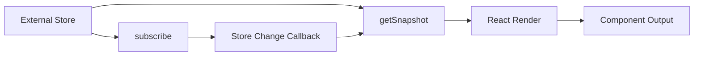
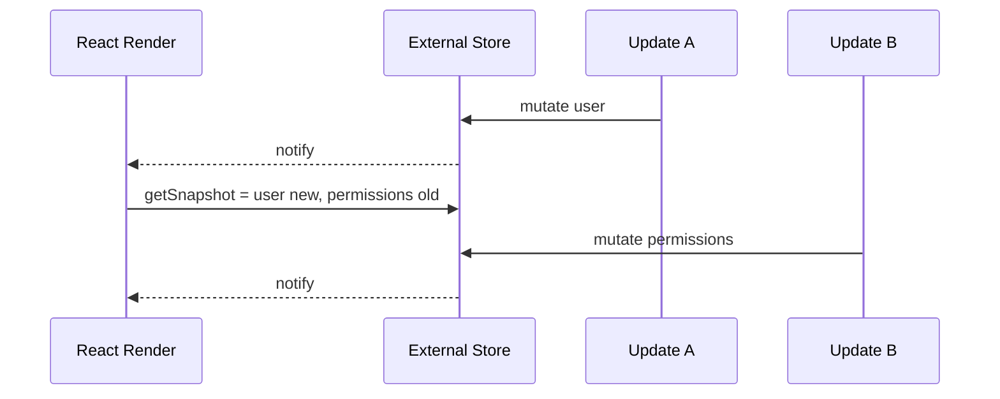
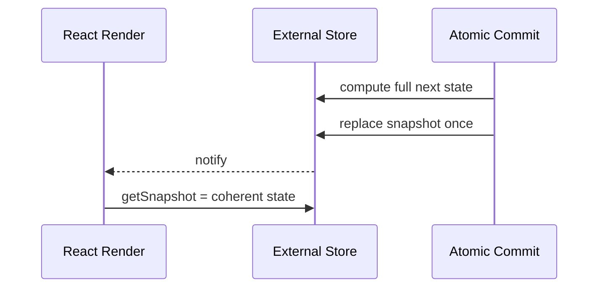

# Part 066 — External Store Failure Modes

External store terlihat sederhana:

```txt
state di luar React,
component subscribe,
store berubah,
UI rerender.
```

Tetapi di React modern, terutama dengan concurrent rendering, SSR, hydration, persistence, selector, dan multi-tab, external store punya kontrak yang tidak boleh dianggap remeh.

Kalau kontrak ini rusak, gejalanya sering tidak langsung:

```txt
- row tertentu rerender terus,
- UI kadang membaca state lama,
- hydration warning muncul hanya di production,
- listener leak setelah Strict Mode double mount,
- selector terlihat benar tapi selalu berubah,
- store singleton membawa data user sebelumnya,
- optimistic update hilang setelah rehydrate,
- command dipanggil dua kali,
- tab lain tidak sinkron,
- DevTools tidak membantu karena mutation tidak tercatat.
```

Part ini adalah katalog failure modes.
Bukan untuk menakut-nakuti.
Tapi untuk membuat kamu bisa mendesain, mereview, dan men-debug external store seperti engineer production.

---

## 1. What Counts as External Store?

External store adalah sumber state yang hidup di luar lifecycle state React component.

Contoh:

```txt
- Redux store
- Zustand store
- custom subscribe/getState store
- browser API state seperti online/offline status
- localStorage-backed state
- WebSocket session state
- BroadcastChannel state
- custom event emitter state
- URL/history adapter
- in-memory singleton cache
```

React component tidak memiliki state itu.
Component hanya membaca snapshot dan subscribe ke perubahan.

Mental model:



Kontrak dasarnya:

```txt
React harus bisa membaca snapshot yang konsisten.
React harus bisa subscribe dan unsubscribe dengan aman.
Snapshot yang sama harus punya identity stabil.
Perubahan store harus memberitahu React.
Server snapshot harus cocok dengan hydration jika SSR dipakai.
```

---

## 2. The `useSyncExternalStore` Contract

External store React-safe biasanya masuk melalui:

```tsx
const snapshot = useSyncExternalStore(
  subscribe,
  getSnapshot,
  getServerSnapshot,
);
```

Kontrak penting:

```txt
subscribe(callback)
  - mendaftarkan callback ke store,
  - memanggil callback saat store berubah,
  - mengembalikan unsubscribe function.

getSnapshot()
  - membaca current snapshot,
  - harus mengembalikan value yang sama secara identity jika data belum berubah,
  - tidak boleh selalu membuat object/array baru.

getServerSnapshot()
  - optional untuk client-only external store,
  - dibutuhkan jika component dirender di server,
  - value awal server harus match value saat hydration di client.
```

Minimal adapter:

```tsx
function useStore<T>(selector: (state: StoreState) => T): T {
  return useSyncExternalStore(
    store.subscribe,
    () => selector(store.getState()),
    () => selector(store.getInitialServerState()),
  );
}
```

Masalah: kode minimal ini belum cukup aman jika selector mengalokasikan value baru.
Nanti kita bahas.

---

## 3. Failure Mode Map

```mermaid
flowchart TD
    A[External Store Failure Modes] --> B[Snapshot Contract]
    A --> C[Subscription Contract]
    A --> D[Selector Contract]
    A --> E[Mutation Contract]
    A --> F[Lifecycle Contract]
    A --> G[SSR/Hydration Contract]
    A --> H[Persistence Contract]
    A --> I[Architecture Contract]

    B --> B1[Uncached snapshot]
    B --> B2[Mutable snapshot]
    B --> B3[Tearing]

    C --> C1[Listener leak]
    C --> C2[Resubscribe churn]
    C --> C3[Missed notification]

    D --> D1[Selector allocation]
    D --> D2[Bad equality]
    D --> D3[Over-subscription]

    E --> E1[Mutation in place]
    E --> E2[Command in render]
    E --> E3[Event loop]

    F --> F1[Singleton data leak]
    F --> F2[Zombie subscription]

    G --> G1[Hydration mismatch]
    G --> G2[Client-only store on server]

    H --> H1[Rehydrate flash]
    H --> H2[Version migration bug]

    I --> I1[Hidden global coupling]
    I --> I2[Manual server cache]
```



The rest of this part walks through each category.

---

## 4. Failure Mode: Uncached Snapshot

### Symptom

```txt
- Component rerenders repeatedly.
- React warns that getSnapshot result should be cached.
- UI feels stuck in a render loop.
```

### Broken Code

```tsx
function getSnapshot() {
  return {
    todos: store.todos,
    selectedIds: store.selectedIds,
  };
}
```

Every call returns a new object.
Even if underlying data did not change, identity changes.
React cannot know it is semantically same.

### Why It Breaks

External store snapshot is part of render input.
If the snapshot identity changes every read, React sees new input every time.

### Fix

Cache the snapshot and replace it only when store data changes.

```tsx
type Snapshot = {
  todos: Todo[];
  selectedIds: ReadonlySet<string>;
};

let currentState = {
  todos: [] as Todo[],
  selectedIds: new Set<string>(),
};

let currentSnapshot: Snapshot = {
  todos: currentState.todos,
  selectedIds: currentState.selectedIds,
};

function getSnapshot() {
  return currentSnapshot;
}

function setState(updater: (state: typeof currentState) => typeof currentState) {
  const nextState = updater(currentState);
  if (Object.is(nextState, currentState)) return;

  currentState = nextState;
  currentSnapshot = {
    todos: currentState.todos,
    selectedIds: currentState.selectedIds,
  };

  emitChange();
}
```

Invariant:

```txt
If data did not change, snapshot identity must not change.
```

Test:

```tsx
expect(getSnapshot()).toBe(getSnapshot());
```

---

## 5. Failure Mode: Mutable Snapshot

### Symptom

```txt
- UI sometimes does not update.
- Selector sees changed nested data without store notification.
- Time-travel/debugging impossible.
- Previous state is accidentally modified.
```

### Broken Code

```tsx
function addTodo(todo: Todo) {
  state.todos.push(todo);
  listeners.forEach((listener) => listener());
}
```

The array identity stays the same.
Selectors depending on `todos` may not detect change if equality is reference-based.

### Fix

Create a new state object and new changed branches.

```tsx
function addTodo(todo: Todo) {
  state = {
    ...state,
    todos: [...state.todos, todo],
  };
  emitChange();
}
```

For large stores, structural sharing is the minimum invariant:

```txt
Unchanged branches preserve identity.
Changed branches receive new identity.
Root snapshot changes when observable state changes.
```

Do not mutate snapshots after exposing them.
If necessary, freeze in development.

```tsx
function freezeDev<T>(value: T): T {
  if (process.env.NODE_ENV !== 'production') {
    return Object.freeze(value);
  }
  return value;
}
```

Freezing is not architecture.
It is a guardrail.

---

## 6. Failure Mode: Tearing / Inconsistent Read

### Symptom

```txt
- Two components render different values from the same store during one UI update.
- Derived data does not match base data.
- A concurrent render sees partial update.
```

### Cause

Store update is not atomic, or getSnapshot reads mutable pieces that can change during render.

Broken pattern:

```tsx
function updateUserAndPermissions(user: User, permissions: Permission[]) {
  store.user = user;
  emitChange();
  store.permissions = permissions;
  emitChange();
}
```

The UI can observe intermediate state:

```txt
new user + old permissions
```

### Fix

Commit related changes atomically.

```tsx
function updateSession(next: { user: User; permissions: Permission[] }) {
  state = {
    ...state,
    user: next.user,
    permissions: next.permissions,
  };
  emitChange();
}
```

For invariants:

```txt
A store update should publish one coherent snapshot.
Do not emit after partial mutation.
Do not expose mutable internals while update is in progress.
```

Diagram:



Correct sequence:



---

## 7. Failure Mode: Listener Leak

### Symptom

```txt
- Store has more listeners than mounted components.
- Actions run multiple times.
- Memory grows over time.
- Strict Mode exposes duplicate behavior in development.
```

### Broken Code

```tsx
function subscribe(callback: () => void) {
  listeners.add(callback);
  // missing unsubscribe
}
```

Or:

```tsx
function subscribe(callback: () => void) {
  window.addEventListener('storage', callback);
  return () => {
    window.removeEventListener('storage', () => callback());
  };
}
```

The remove function uses a different function reference.
The listener is never removed.

### Fix

Return exact cleanup.

```tsx
function subscribe(callback: () => void) {
  listeners.add(callback);
  return () => {
    listeners.delete(callback);
  };
}
```

Browser event version:

```tsx
function subscribe(callback: () => void) {
  const handler = () => callback();
  window.addEventListener('storage', handler);
  return () => window.removeEventListener('storage', handler);
}
```

Invariant:

```txt
Every subscribe must have exactly one corresponding unsubscribe path.
Cleanup must remove the exact registered listener.
```

Test:

```tsx
const unsubscribe = subscribe(listener);
expect(listenerCount()).toBe(1);
unsubscribe();
expect(listenerCount()).toBe(0);
```

---

## 8. Failure Mode: Resubscribe Churn

### Symptom

```txt
- Component unsubscribes/resubscribes every render.
- Performance degrades with many components.
- Store listeners churn despite no state change.
```

### Cause

`subscribe` function identity changes because it is defined inline with reactive values.

Broken:

```tsx
function useOnlineStatus(source: EventTarget) {
  return useSyncExternalStore(
    (callback) => {
      source.addEventListener('online', callback);
      return () => source.removeEventListener('online', callback);
    },
    () => navigator.onLine,
  );
}
```

This is not always disastrous, but if subscription setup is expensive, it matters.

### Fix

Keep subscribe stable when possible.

```tsx
function subscribeOnline(callback: () => void) {
  window.addEventListener('online', callback);
  window.addEventListener('offline', callback);

  return () => {
    window.removeEventListener('online', callback);
    window.removeEventListener('offline', callback);
  };
}

function getOnlineSnapshot() {
  return navigator.onLine;
}

export function useOnlineStatus() {
  return useSyncExternalStore(subscribeOnline, getOnlineSnapshot, () => true);
}
```

If subscription depends on props, isolate carefully:

```tsx
function useRoomStore(roomId: string) {
  const store = useMemo(() => getRoomStore(roomId), [roomId]);

  return useSyncExternalStore(
    store.subscribe,
    store.getSnapshot,
    store.getServerSnapshot,
  );
}
```

Invariant:

```txt
Changing subscription identity should mean the external subscription target truly changed.
```

---

## 9. Failure Mode: Missed Notification

### Symptom

```txt
- Store state changes, but UI does not update.
- Refresh fixes UI.
- Some actions update UI, others do not.
```

### Broken Code

```tsx
function setState(partial: Partial<State>) {
  state = { ...state, ...partial };
  // forgot emitChange()
}
```

Or conditional notification is wrong:

```tsx
function setState(partial: Partial<State>) {
  const next = { ...state, ...partial };
  if (next === state) return;
  state = next;
  emitChange();
}
```

`next === state` is always false because object spread creates new object.
But the opposite bug is also common: mutating in place and checking identity.

```tsx
function setName(name: string) {
  state.user.name = name;
  if (state === previousState) return;
  emitChange();
}
```

### Fix

Centralize update pipeline.

```tsx
function commit(next: State) {
  if (Object.is(next, state)) return;
  state = next;
  snapshot = next;
  for (const listener of listeners) listener();
}

function update(updater: (state: State) => State) {
  commit(updater(state));
}
```

Rule:

```txt
No action mutates state except through the store commit function.
```

---

## 10. Failure Mode: Selector Allocation

### Symptom

```txt
- Component rerenders on every store update.
- Selector seems to select same semantic data.
- Memoized child still rerenders.
```

### Broken Code

```tsx
const view = useStore((state) => ({
  name: state.user.name,
  canEdit: state.permissions.includes('edit'),
}));
```

The selector returns a new object every time.
Without equality function or memoization, identity always changes.

### Fix Option 1: Select primitive separately

```tsx
const name = useStore((state) => state.user.name);
const canEdit = useStore((state) => state.permissions.includes('edit'));
```

### Fix Option 2: Use shallow equality if library supports it

```tsx
const view = useStore(
  (state) => ({
    name: state.user.name,
    canEdit: state.permissions.includes('edit'),
  }),
  shallow,
);
```

### Fix Option 3: Memoize derived selector outside render

```tsx
const selectUserView = createSelector(
  [(state: State) => state.user.name, (state: State) => state.permissions],
  (name, permissions) => ({
    name,
    canEdit: permissions.includes('edit'),
  }),
);
```

Invariant:

```txt
Selector output identity should change only when the selected semantic value changes.
```

Review smell:

```txt
Selector returns {}, [], new Set(), new Map(), .filter(), .map() without memo/equality.
```

---

## 11. Failure Mode: Bad Equality Function

### Symptom

```txt
- UI misses updates.
- Component does not rerender when selected data changed.
- Equality optimization hides mutation bugs.
```

### Broken Code

```tsx
const user = useStore((state) => state.user, () => true);
```

This says every previous/next value is equal.
UI never updates.

More subtle:

```tsx
function equalById(a: User, b: User) {
  return a.id === b.id;
}
```

If `name` changes but `id` stays same, UI reading name will not update.

### Fix

Equality must match render dependency.

```tsx
const userLabel = useStore(
  (state) => ({ id: state.user.id, name: state.user.name }),
  shallow,
);
```

Or select exactly what is rendered:

```tsx
const userName = useStore((state) => state.user.name);
```

Invariant:

```txt
If rendered output would change, equality must return false.
```

---

## 12. Failure Mode: Over-Subscription

### Symptom

```txt
- Component rerenders when unrelated store fields change.
- Large pages rerender after small interaction.
- Store update has huge blast radius.
```

### Broken Code

```tsx
function Toolbar() {
  const state = useWorkspaceStore();
  return <span>{state.selectedIds.length}</span>;
}
```

The component subscribes to the entire store.

### Fix

Subscribe to minimum render dependency.

```tsx
function Toolbar() {
  const selectedCount = useWorkspaceStore((state) => state.selectedIds.length);
  return <span>{selectedCount}</span>;
}
```

Review heuristic:

```txt
No production component should subscribe to full store unless it truly renders full store.
```

Debug protocol:

```txt
1. Use profiler.
2. Identify component rerender source.
3. Inspect selector width.
4. Narrow selector.
5. Add equality/memoization only after narrowing.
```

---

## 13. Failure Mode: Under-Subscription

### Symptom

```txt
- Component reads store data but does not update when it changes.
- Action changes state, but UI remains stale.
```

### Broken Code

```tsx
function UserName() {
  const user = userStore.getState().user;
  return <span>{user.name}</span>;
}
```

Direct read during render without subscription.
React has no idea store changes should rerender this component.

### Fix

Use subscription hook.

```tsx
function UserName() {
  const name = useUserStore((state) => state.user.name);
  return <span>{name}</span>;
}
```

Direct `getState()` is acceptable in command/event code:

```tsx
function SaveButton() {
  const save = useSaveCommand();

  return (
    <button
      onClick={() => {
        const draft = editorStore.getState().draft;
        save(draft);
      }}
    >
      Save
    </button>
  );
}
```

But render reads must subscribe.

Invariant:

```txt
If render output depends on external store state, component must subscribe to that dependency.
```

---

## 14. Failure Mode: Command in Render

### Symptom

```txt
- Store updates during render.
- Infinite render loop.
- React purity violations.
- Behavior changes under Strict Mode/concurrent rendering.
```

### Broken Code

```tsx
function Guard({ user }: { user: User | null }) {
  const setUser = useSessionStore((state) => state.setUser);

  if (user) {
    setUser(user);
  }

  return null;
}
```

Render must be pure.
Updating external store during render is still a side effect.

### Fix

Move synchronization to effect if it is truly external sync.

```tsx
function Guard({ user }: { user: User | null }) {
  const setUser = useSessionStore((state) => state.setUser);

  useEffect(() => {
    if (user) setUser(user);
  }, [user, setUser]);

  return null;
}
```

Better: avoid sync if duplicate source of truth.
Maybe the component should read `user` directly from query/session provider instead of copying into store.

Decision:

```txt
If data can be derived from props/query/context, do not mirror it into external store.
If external system truly must be synchronized, use effect with cleanup/idempotency.
```

---

## 15. Failure Mode: Stale Closure in Store Actions

### Symptom

```txt
- Async action writes stale result.
- Fast repeated actions produce wrong final state.
- Latest request is overwritten by older response.
```

### Broken Code

```tsx
const useSearchStore = create<SearchState>((set) => ({
  query: '',
  results: [],
  async search(query) {
    set({ query });
    const results = await api.search(query);
    set({ results });
  },
}));
```

If `search('a')` returns after `search('ab')`, old result can overwrite new result.

### Fix: Request identity guard

```tsx
const useSearchStore = create<SearchState>((set, get) => ({
  query: '',
  requestId: null,
  results: [],

  async search(query) {
    const requestId = crypto.randomUUID();
    set({ query, requestId });

    const results = await api.search(query);

    if (get().requestId !== requestId) return;
    set({ results });
  },
}));
```

Invariant:

```txt
Async result may commit only if it still belongs to current request state.
```

For server-state, prefer query/mutation cache instead of hand-rolled async store unless this is truly client-owned workflow.

---

## 16. Failure Mode: Singleton Store Data Leak

### Symptom

```txt
- User A data appears after User B logs in.
- Tenant switch preserves old selection/preferences.
- Tests influence each other.
- SSR request data leaks across users.
```

### Cause

A singleton store outlives the logical session/tenant/request boundary.

Broken:

```tsx
export const useCaseStore = create<CaseStore>(() => ({
  selectedCaseIds: [],
  draftByCaseId: {},
}));
```

If the store is global, it persists until page reload unless explicitly reset.

### Fix Option 1: Reset on boundary change

```tsx
function TenantBoundary({ tenantId, children }: Props) {
  const reset = useCaseStore((state) => state.reset);

  useEffect(() => {
    reset();
  }, [tenantId, reset]);

  return children;
}
```

### Fix Option 2: Scoped store provider

```tsx
const StoreContext = createContext<StoreApi<CaseStore> | null>(null);

function CaseWorkspaceProvider({ caseId, children }: Props) {
  const storeRef = useRef<StoreApi<CaseStore> | null>(null);

  if (!storeRef.current) {
    storeRef.current = createCaseStore({ caseId });
  }

  return <StoreContext.Provider value={storeRef.current}>{children}</StoreContext.Provider>;
}
```

Invariant:

```txt
Store lifetime must not exceed the lifetime of data authority.
```

For SSR:

```txt
Never put per-request user data in module-level singleton store.
Create store per request or per client boundary.
```

---

## 17. Failure Mode: SSR/Hydration Mismatch

### Symptom

```txt
- Hydration warning.
- UI flashes from default state to persisted state.
- Server rendered markup does not match client initial snapshot.
```

### Broken Code

```tsx
function getSnapshot() {
  return localStorage.getItem('theme') ?? 'light';
}

function ThemeIcon() {
  const theme = useSyncExternalStore(subscribeTheme, getSnapshot);
  return <span>{theme}</span>;
}
```

On server, `localStorage` does not exist.
If component is rendered on server, it cannot read client storage.

### Fix Option 1: Provide server snapshot

```tsx
function getServerSnapshot() {
  return 'light';
}

function useTheme() {
  return useSyncExternalStore(subscribeTheme, getThemeSnapshot, getServerSnapshot);
}
```

But this still may flash if client persisted value is different.

### Fix Option 2: Bootstrap initial value into HTML

```html
<script>
  window.__INITIAL_THEME__ = "dark";
</script>
```

Then server snapshot and initial client snapshot can agree.

### Fix Option 3: Client-only boundary

If value cannot be known on server and mismatch is acceptable, defer rendering until client mounted.

```tsx
function ClientOnly({ children }: { children: React.ReactNode }) {
  const [mounted, setMounted] = useState(false);
  useEffect(() => setMounted(true), []);
  if (!mounted) return null;
  return children;
}
```

Use sparingly; it gives up SSR for that subtree.

Invariant:

```txt
Server snapshot must equal the first client hydration snapshot for server-rendered content.
```

---

## 18. Failure Mode: Persistence Rehydration Flash

### Symptom

```txt
- UI starts with default store state then jumps to persisted state.
- Actions happen before rehydrate finishes.
- Persisted schema old version crashes current UI.
```

### Cause

Persistence is asynchronous or not coordinated with app readiness.
Even synchronous localStorage can create mismatch if server snapshot differs.

Broken assumption:

```txt
Persist middleware means persistence is solved.
```

Persistence needs policy:

```txt
- storage key ownership,
- version,
- migration,
- partialize/whitelist,
- rehydrate status,
- logout cleanup,
- tenant cleanup,
- corrupt data fallback,
- sensitive data exclusion.
```

### Fix: Model hydration explicitly

```tsx
type StoreState = {
  hydration: 'pending' | 'ready' | 'failed';
  preferences: Preferences;
};
```

Render boundary:

```tsx
function PreferencesGate({ children }: { children: React.ReactNode }) {
  const hydration = usePreferencesStore((state) => state.hydration);

  if (hydration === 'pending') return <PreferencesSkeleton />;
  if (hydration === 'failed') return <PreferencesFallback />;

  return children;
}
```

Invariant:

```txt
UI that depends on persisted state must know whether persistence has been rehydrated.
```

---

## 19. Failure Mode: Cross-Tab Inconsistency

### Symptom

```txt
- User logs out in one tab but another tab still looks authenticated.
- Preferences change in one tab but another tab stays stale.
- Draft conflict appears between tabs.
```

### Cause

Store is memory-local per tab.
Persistence alone does not guarantee live synchronization.

### Fix Options

Use `storage` event for localStorage-backed sync:

```tsx
function subscribePreferences(callback: () => void) {
  const handler = (event: StorageEvent) => {
    if (event.key === 'preferences') callback();
  };

  window.addEventListener('storage', handler);
  return () => window.removeEventListener('storage', handler);
}
```

Use `BroadcastChannel` for explicit app events:

```tsx
const channel = new BroadcastChannel('session');

function broadcastLogout() {
  channel.postMessage({ type: 'logout' });
}

function subscribeSession(callback: () => void) {
  const handler = (event: MessageEvent) => {
    if (event.data?.type === 'logout') callback();
  };

  channel.addEventListener('message', handler);
  return () => channel.removeEventListener('message', handler);
}
```

Invariant:

```txt
If state meaning crosses tab boundary, the store needs cross-tab invalidation or synchronization policy.
```

Avoid syncing sensitive tokens through browser storage if your security model does not allow it.

---

## 20. Failure Mode: Event Loop Between Store and Effect

### Symptom

```txt
- Effect updates store.
- Store update rerenders component.
- Effect runs again.
- Infinite loop or repeated network calls.
```

### Broken Code

```tsx
function UserSync({ user }: { user: User }) {
  const session = useSessionStore((state) => state.session);
  const setSession = useSessionStore((state) => state.setSession);

  useEffect(() => {
    setSession({ user });
  }, [user, session, setSession]);

  return null;
}
```

Effect depends on `session`, but effect updates `session`.

### Fix

First question: should this sync exist?

If yes, depend only on source values and make update idempotent.

```tsx
useEffect(() => {
  setSessionFromUser(user);
}, [user, setSessionFromUser]);
```

Inside store action:

```tsx
setSessionFromUser(user) {
  const current = get().session.user;
  if (current?.id === user.id && current.version === user.version) return;
  set({ session: { user } });
}
```

Invariant:

```txt
Effects that synchronize external store must be idempotent.
Do not include target state as dependency unless the effect genuinely reacts to it.
```

---

## 21. Failure Mode: Hidden Global Coupling

### Symptom

```txt
- Component behavior depends on store not visible from props.
- Test setup requires many unrelated stores.
- Reusing component in another page breaks unexpectedly.
- Feature A changes store and Feature B changes behavior silently.
```

### Cause

External store import is a hidden dependency.

```tsx
function SubmitButton() {
  const canSubmit = useWorkflowStore((state) => state.canSubmit);
  return <button disabled={!canSubmit}>Submit</button>;
}
```

Maybe okay inside feature.
Bad inside reusable design system component.

### Fix

Keep external store reads at smart boundary.
Pass explicit props to reusable children.

```tsx
function SubmitButton({ disabled }: { disabled: boolean }) {
  return <button disabled={disabled}>Submit</button>;
}

function SubmitButtonContainer() {
  const canSubmit = useWorkflowStore((state) => state.canSubmit);
  return <SubmitButton disabled={!canSubmit} />;
}
```

Invariant:

```txt
Reusable components should not depend on app-global stores unless that dependency is part of their public contract.
```

Architecture rule:

```txt
Store-aware components belong at feature/application boundary.
Pure/reusable components receive props.
```

---

## 22. Failure Mode: Store as Manual Server Cache

### Symptom

```txt
- Store has loading/error/data/lastFetchedAt/stale flags for many endpoints.
- Invalidation is inconsistent.
- Duplicate fetches happen.
- Optimistic updates conflict with refetches.
- Cache bugs dominate feature work.
```

### Broken Architecture

```tsx
type UserStore = {
  users: Record<string, User>;
  loadingById: Record<string, boolean>;
  errorById: Record<string, string | null>;
  lastFetchedAtById: Record<string, number>;
  fetchUser(id: string): Promise<void>;
  invalidateUser(id: string): void;
};
```

You are building a query cache.
Maybe badly.

### Fix

Use a server-state cache abstraction:

```txt
- TanStack Query
- RTK Query
- framework loader/cache if appropriate
```

Keep external client store for client-owned state:

```txt
selected IDs
open panels
draft-only UI state
workflow state
local preferences
```

Invariant:

```txt
If server is authority, client store should not become long-lived source of truth unless it implements cache lifecycle deliberately.
```

---

## 23. Failure Mode: Unbounded Store Growth

### Symptom

```txt
- Store memory grows during navigation.
- Old entities never removed.
- Closed workspaces still keep drafts/listeners.
- Performance degrades over long sessions.
```

### Cause

External store has longer lifetime than UI workflows but no eviction/reset policy.

### Fix

Define lifecycle explicitly:

```txt
- reset on logout,
- reset on tenant switch,
- reset on route leave,
- LRU/TTL for cached client state,
- dispose scoped store on unmount,
- remove entity when workflow finishes.
```

Example:

```tsx
function WorkspaceRoute({ workspaceId }: Props) {
  const resetWorkspace = useWorkspaceStore((state) => state.resetWorkspace);

  useEffect(() => {
    return () => resetWorkspace(workspaceId);
  }, [workspaceId, resetWorkspace]);

  return <Workspace />;
}
```

Invariant:

```txt
Every external store must have a lifetime policy.
```

---

## 24. Failure Mode: Overloaded Actions

### Symptom

```txt
- One store action does validation, API call, navigation, toast, analytics, cache update, and state mutation.
- Tests become integration-heavy.
- Reusing action in another context causes unintended side effects.
```

### Broken Code

```tsx
async function approveCase(id: string) {
  set({ status: 'submitting' });
  await api.approve(id);
  queryClient.invalidateQueries(['case', id]);
  analytics.track('case_approved');
  toast.success('Approved');
  navigate('/cases');
  set({ status: 'done' });
}
```

### Fix

Separate domain transition, app command, and UI feedback.

```txt
Store action:
  transition local workflow state.

Mutation layer:
  call server and invalidate cache.

Orchestration hook:
  combine command, toast, navigation, analytics.
```

Example:

```tsx
function useApproveCaseCommand(caseId: string) {
  const markSubmitting = useApprovalStore((s) => s.markSubmitting);
  const markFailed = useApprovalStore((s) => s.markFailed);
  const mutation = useApproveCaseMutation();
  const toast = useToast();
  const navigate = useNavigate();

  return async function approve() {
    markSubmitting(caseId);

    try {
      await mutation.mutateAsync(caseId);
      toast.success('Case approved');
      navigate('/cases');
    } catch (error) {
      markFailed(caseId, toMessage(error));
    }
  };
}
```

Invariant:

```txt
Store action should not become a hidden application service unless that is an explicit architecture decision.
```

---

## 25. Failure Mode: Bad Store Boundary in Tests

### Symptom

```txt
- Tests pass individually but fail together.
- Store state leaks between tests.
- Tests require manual cleanup everywhere.
```

### Cause

Singleton store persists across tests.

### Fix Option 1: Reset after each test

```tsx
afterEach(() => {
  useSelectionStore.getState().reset();
});
```

### Fix Option 2: Store factory per test

```tsx
function createTestStore(overrides?: Partial<State>) {
  return createStore<State>(() => ({
    ...initialState,
    ...overrides,
  }));
}
```

### Fix Option 3: Provider-scoped store

```tsx
render(
  <StoreProvider store={createTestStore()}>
    <Feature />
  </StoreProvider>,
);
```

Invariant:

```txt
Tests must control store initial state and store lifetime.
```

---

## 26. Failure Mode: Action Without Invariant

### Symptom

```txt
- Store allows impossible states.
- UI has many booleans that conflict.
- Edge cases require if statements everywhere.
```

Broken:

```tsx
type UploadState = {
  isIdle: boolean;
  isUploading: boolean;
  isSuccess: boolean;
  isError: boolean;
  error?: string;
};
```

This allows:

```txt
isUploading=true and isSuccess=true
isIdle=true and error present
isError=false and error present
```

Fix:

```tsx
type UploadState =
  | { status: 'idle' }
  | { status: 'uploading'; requestId: string }
  | { status: 'success'; fileId: string }
  | { status: 'error'; message: string };
```

Invariant:

```txt
State shape should make illegal states impossible or at least hard to represent.
```

External store does not remove the need for reducer/state-machine thinking.
It amplifies it because more components can depend on the state.

---

## 27. Failure Mode: DevTools Illusion

### Symptom

```txt
- DevTools show state changed, but not why.
- Timeline misses side effects.
- Store mutation happened outside named action.
```

Zustand/Redux/Custom store observability differs.
Do not assume DevTools solves architecture.

Good observability records:

```txt
- command/action name,
- payload summary,
- previous relevant state,
- next relevant state,
- request ID,
- user/session/tenant boundary when allowed,
- error outcome,
- duration for async command.
```

For custom/Zustand store, consider action wrapper:

```tsx
function namedSet(actionName: string, updater: (state: State) => State) {
  const prev = state;
  const next = updater(prev);
  state = next;
  logStoreTransition({ actionName, prev, next });
  emitChange();
}
```

Invariant:

```txt
If external store state matters for debugging, mutations need names.
```

This is one reason Redux Toolkit remains valuable in large governed systems.

---

## 28. Debugging Protocol for External Store Bugs

When a bug appears, do not randomly add memoization.
Use a protocol.

### Step 1 — Classify the symptom

```txt
Does UI fail to update?
Does UI update too much?
Does UI show impossible state?
Does issue happen only SSR/hydration?
Does issue happen after navigation/logout/tenant switch?
Does issue happen after async race?
Does issue happen across tabs?
```

### Step 2 — Identify subscription width

```txt
Which selector does the component use?
Does it subscribe to full store?
Does selector allocate new object/array?
Does equality match rendered dependency?
```

### Step 3 — Inspect mutation path

```txt
Is state mutated in place?
Is emitChange called exactly once after atomic commit?
Does action publish coherent snapshot?
Is async result guarded by request ID?
```

### Step 4 — Inspect lifetime

```txt
Is store singleton or scoped?
When does it reset?
Does it leak across users/tests/routes?
Does SSR create per-request state?
```

### Step 5 — Inspect external boundaries

```txt
Does store mirror server data?
Does persisted state have version/migration?
Does cross-tab state sync matter?
Does effect create update loop?
```

### Step 6 — Add minimal fix

```txt
Narrow selector before adding memoization.
Fix snapshot identity before adding equality hacks.
Fix ownership before adding reset effects.
Use query cache before rebuilding server cache.
Use scoped store before adding global cleanup hacks.
```

---

## 29. Production Checklist

Before approving an external store, verify:

```txt
[ ] State category is client-owned, not secretly server-owned.
[ ] Store lifetime is defined.
[ ] Reset policy exists for logout/tenant/route/workspace if relevant.
[ ] Snapshot identity is stable when data does not change.
[ ] Updates are atomic and publish coherent snapshots.
[ ] Subscriptions return correct cleanup.
[ ] Render reads subscribe; event-only reads may use getState.
[ ] Selectors are narrow.
[ ] Selectors do not allocate unstable values without equality/memoization.
[ ] Equality function matches rendered dependency.
[ ] Async actions guard stale results.
[ ] Persistence has version, migration, whitelist, and corrupt-data fallback.
[ ] SSR/hydration snapshot policy is explicit.
[ ] Cross-tab sync policy exists if state crosses tab boundary.
[ ] Store mutations have names if debugging/audit matters.
[ ] Reusable components do not import app-global stores accidentally.
[ ] Tests can create/reset store deterministically.
```

---

## 30. Review Smells

Red flags:

```txt
const state = useStore();
```

Unless component truly renders entire store, this is over-subscription.

```txt
useStore((s) => ({ a: s.a, b: s.b }))
```

Without equality/memoization, this may allocate every update.

```txt
store.getState() inside render
```

Render read without subscription.

```txt
setStore(...) inside component body
```

Render side effect.

```txt
localStorage read during server render
```

Hydration risk.

```txt
create(...) at module level with request/session data
```

Lifetime leak risk.

```txt
state.serverUsers = response.users
```

Manual server cache smell.

```txt
AppStore contains auth, theme, filters, form drafts, notifications, workflow, API cache
```

State taxonomy failure.

---

## 31. Build a Safer External Store Skeleton

A minimal safer store skeleton:

```tsx
type Listener = () => void;

type StoreApi<State> = {
  getSnapshot(): State;
  subscribe(listener: Listener): () => void;
  update(actionName: string, updater: (state: State) => State): void;
  reset(): void;
};

export function createExternalStore<State>(initialState: State): StoreApi<State> {
  let state = initialState;
  const listeners = new Set<Listener>();

  function emit() {
    for (const listener of Array.from(listeners)) {
      listener();
    }
  }

  return {
    getSnapshot() {
      return state;
    },

    subscribe(listener) {
      listeners.add(listener);
      return () => listeners.delete(listener);
    },

    update(actionName, updater) {
      const next = updater(state);
      if (Object.is(next, state)) return;

      const previous = state;
      state = next;

      if (process.env.NODE_ENV !== 'production') {
        console.debug('[store]', actionName, { previous, next });
      }

      emit();
    },

    reset() {
      if (Object.is(state, initialState)) return;
      state = initialState;
      emit();
    },
  };
}
```

React adapter:

```tsx
function useExternalSelector<State, Selected>(
  store: StoreApi<State>,
  selector: (state: State) => Selected,
): Selected {
  return useSyncExternalStore(
    store.subscribe,
    () => selector(store.getSnapshot()),
    () => selector(store.getSnapshot()),
  );
}
```

This adapter still has selector allocation caveat.
To make it production-grade, add selector caching/equality or use a library that already solved this carefully.

Skeleton lesson:

```txt
A store is not just a variable.
A store is a contract: snapshot, subscription, atomic commit, lifetime, and observability.
```

---

## 32. External Store vs Context Failure Mode Difference

| Failure | Context | External Store |
|---|---|---|
| Rerender fan-out | Provider value change rerenders consumers | Over-wide selectors rerender subscribers |
| Hidden dependency | Consumer hidden under provider | Module-level store import hidden globally |
| Snapshot identity | Context value identity | getSnapshot/selector identity |
| Cleanup | Provider effects | subscribe/unsubscribe |
| Lifetime | Provider subtree | Store singleton/scoped lifetime |
| SSR | Provider initial value | getServerSnapshot/hydration |
| Debugging | Tree/provider inspection | Store/action/subscription inspection |

This matters because a refactor from Context to external store does not delete failure modes.
It changes them.

---

## 33. External Store vs Redux Toolkit Failure Mode Difference

Redux Toolkit is also an external store pattern, but with stronger conventions.

Custom/Zustand-style stores often fail through:

```txt
- hidden mutation,
- inconsistent action naming,
- selector instability,
- lifetime leakage,
- weak observability.
```

Redux Toolkit often fails through:

```txt
- putting too much local state globally,
- manual server cache in slices,
- action boilerplate for trivial state,
- selector overengineering,
- normalized state without ownership clarity.
```

Different tools, different failure modes.

Top-tier engineering means choosing which failure mode you are willing and prepared to manage.

---

## 34. Exercises

### Exercise 1 — Find Selector Smells

Audit a page that uses Zustand/Redux/custom store.
Find all selectors that:

```txt
- return whole store,
- return new object,
- return filtered/mapped array,
- use equality incorrectly,
- read store directly in render.
```

Refactor one component to subscribe to the smallest possible value.

---

### Exercise 2 — Add Lifetime Policy

Pick one external store and document:

```txt
- when it is created,
- who owns it,
- when it resets,
- whether it survives route change,
- whether it survives logout,
- whether it survives tenant switch,
- whether it survives tests,
- whether it is safe for SSR.
```

Then implement the missing reset/dispose path.

---

### Exercise 3 — Race Guard

Create an async store action that fetches search results.
Then add:

```txt
- requestId,
- cancellation or ignore-stale-result guard,
- pending/error state,
- test for out-of-order response.
```

Prove old response cannot overwrite new response.

---

### Exercise 4 — Persistence Migration

Persist a preferences store with version `1`.
Then change schema to version `2`.
Implement:

```txt
- migration,
- corrupt data fallback,
- logout cleanup,
- hydration-ready state.
```

---

## 35. Key Takeaways

```txt
External store is not just global state.
It is a contract between React render and non-React state.

getSnapshot must be stable.
subscribe must clean up.
updates must be atomic.
selectors must be narrow and stable.
store lifetime must be explicit.
SSR/hydration must have a snapshot policy.
persistence must have versioning and readiness.
server data should use server-state cache.
reusable components should avoid hidden global store coupling.
```

If Part 065 taught you how to choose an external store, Part 066 teaches you how not to get cut by it.

The sharp edge is not the library.
The sharp edge is violating the contract between ownership, subscription, snapshot, and lifecycle.
