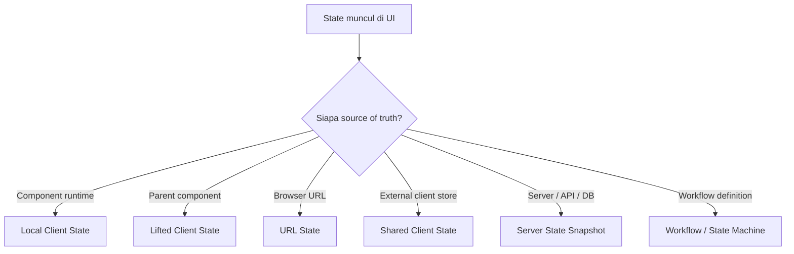
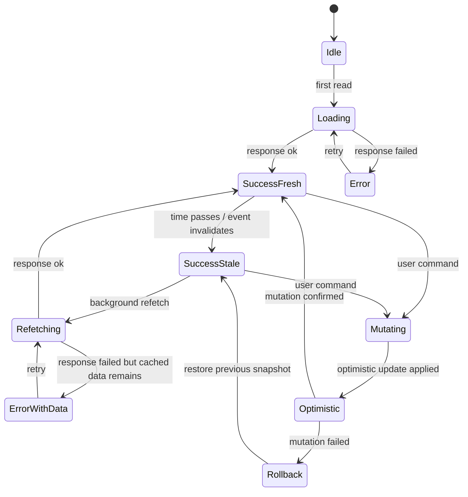
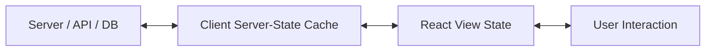
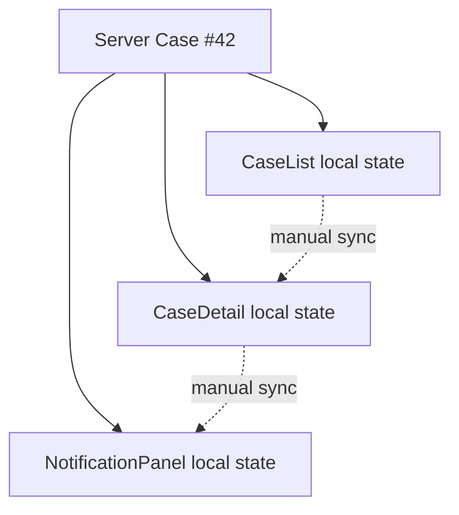
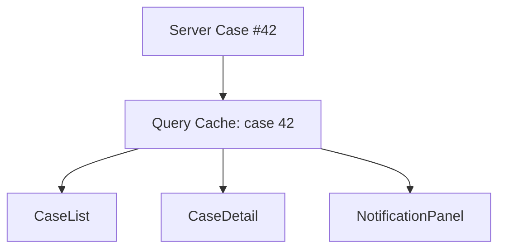
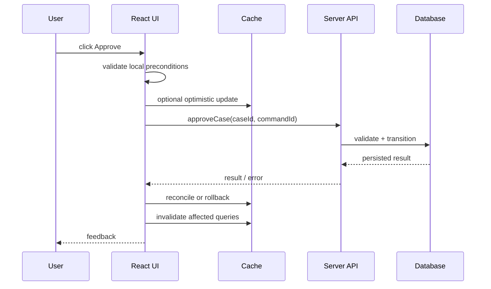
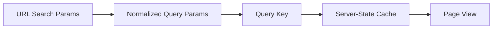
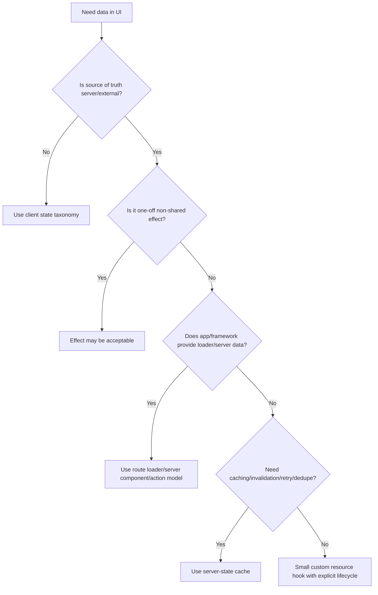

# Part 067 — Server State Is Not Client State

Client state dan server state sering terlihat sama karena sama-sama muncul sebagai data di layar. Keduanya bisa disimpan di variable, bisa masuk ke props, bisa memicu render, bisa punya loading/error state. Tetapi secara arsitektur, keduanya berbeda secara fundamental.

Client state adalah state yang **dimiliki aplikasi client**.

Server state adalah snapshot dari data yang **dimiliki sistem lain**.

Kalau perbedaan ini tidak dipegang, React app biasanya berubah menjadi kumpulan `useState`, `useEffect`, `setLoading`, `setError`, dan `setData` yang terlihat bekerja di demo, tetapi rapuh saat ada cache, pagination, optimistic update, tab lain, refetch, retry, stale response, permission change, logout, atau invalidation lintas screen.

Bagian ini adalah fondasi sebelum masuk TanStack Query, mutation design, cache invalidation, Suspense, Actions, dan optimistic workflow.

Kita tidak mulai dari library. Kita mulai dari ownership.

---

## 1. Definisi Singkat

```txt
Client state:
  State yang authoritative source-nya berada di browser/app runtime.

Server state:
  State yang authoritative source-nya berada di server/external system,
  sementara client hanya memegang snapshot/cache dari state tersebut.
```

Contoh client state:

```txt
- modal sedang terbuka atau tidak
- tab aktif
- draft text yang belum disubmit
- row yang sedang dipilih
- sort/filter sementara sebelum di-commit ke URL
- wizard step lokal
- sidebar collapsed
- pending local animation state
```

Contoh server state:

```txt
- daftar case dari backend
- detail invoice
- permission matrix user
- notification list
- status approval dari server
- search result
- profile user dari API
- feature flag dari remote config
- audit trail
```

Perbedaan utamanya bukan bentuk datanya. Perbedaannya adalah **siapa yang berhak menjadi source of truth**.

---

## 2. Kesalahan Mental Model yang Umum

Kesalahan paling umum:

```tsx
const [users, setUsers] = useState<User[]>([]);
const [loading, setLoading] = useState(false);
const [error, setError] = useState<Error | null>(null);

useEffect(() => {
  setLoading(true);

  fetchUsers()
    .then(setUsers)
    .catch(setError)
    .finally(() => setLoading(false));
}, []);
```

Kode ini tidak selalu salah. Untuk demo kecil, ini bisa cukup. Masalahnya adalah kode ini diam-diam mengklaim:

```txt
Component ini adalah owner dari:
- data users
- lifecycle request
- loading state
- error state
- retry policy
- caching policy
- freshness policy
- invalidation policy
- deduplication policy
- cancellation policy
- response race policy
```

Padahal component biasanya bukan owner yang tepat untuk semua responsibility itu.

Component seharusnya bertanya:

```txt
Aku butuh snapshot server data apa?
Seberapa fresh snapshot itu harus?
Kapan data dianggap stale?
Siapa yang boleh mengubah server data?
Mutation mana yang harus invalidate snapshot ini?
Apa yang terjadi jika snapshot lama sementara masih ditampilkan?
Apa yang terjadi jika request lama selesai setelah request baru?
Apakah screen lain memakai data yang sama?
Apakah data ini perlu survive navigation?
Apakah data ini perlu prefetch?
```

Kalau pertanyaan-pertanyaan itu tidak dijawab, server state akan menyamar sebagai local state.

---

## 3. Authority: Pertanyaan Pertama Sebelum State Management

Sebelum memilih `useState`, Context, Zustand, Redux, atau TanStack Query, jawab ini:

```txt
Authority-nya di mana?
```



Kalau source of truth-nya server, maka value di client hanyalah snapshot.

Snapshot punya umur. Snapshot bisa stale. Snapshot bisa salah. Snapshot bisa berbeda antar tab. Snapshot bisa berubah tanpa user melakukan apa pun di UI.

Client state tidak punya masalah ini dengan cara yang sama.

---

## 4. Local State vs Server State

| Dimension | Client State | Server State |
|---|---|---|
| Authority | Browser/component/app | Server/API/database/external system |
| Ownership | UI/app owns it | Client only caches a snapshot |
| Freshness | Always current relative to local runtime | May be stale immediately after read |
| Update | Synchronous local transition | Async mutation/request/command |
| Failure | Usually logic/state bug | Network, auth, permission, validation, conflict, timeout |
| Sharing | By React tree/store topology | By cache key/entity identity |
| Reset | Component unmount/key/session | Cache policy, invalidation, logout, gc |
| Persistence | Optional browser persistence | Server persistence is external |
| Consistency | Deterministic in one runtime | Distributed consistency problem |
| Tooling | `useState`, `useReducer`, Context, store | Query cache, loader, server components, resource cache |

The hard truth:

```txt
Server state is distributed state.
```

Even if you access it with `fetch('/api/users')`, the actual problem space is distributed systems: latency, concurrency, failure, retry, conflict, stale reads, duplicate commands, cache invalidation, and partial availability.

React component state alone is not designed to solve that entire problem.

---

## 5. Server State Lifecycle

Server state in UI usually has this lifecycle:



Notice how much state exists beyond `data | loading | error`.

A realistic server-state model needs to distinguish:

```txt
- no data yet
- fetching first data
- has data and fresh enough
- has data but stale
- has data and background refetching
- has data and refetch failed
- mutation pending
- optimistic mutation applied
- mutation failed and rollback needed
- request cancelled
- user no longer authorized
- server accepted command but final state is eventually consistent
```

If all of that is compressed into three booleans, bugs become inevitable.

---

## 6. The Three-Layer Model

A production React app should separate at least three layers:



Layer responsibilities:

```txt
Server:
  Owns truth, persistence, permission, validation, domain transitions.

Client server-state cache:
  Owns snapshots, freshness, dedupe, refetch, invalidation, retry,
  request identity, background sync, optimistic reconciliation.

React UI:
  Owns presentation, selection, local draft, visibility, layout,
  user intent, command wiring.
```

A common architecture bug is collapsing all three into one component.

```tsx
function CaseListPage() {
  // server snapshot
  const [cases, setCases] = useState<Case[]>([]);

  // request lifecycle
  const [loading, setLoading] = useState(false);
  const [error, setError] = useState<Error | null>(null);

  // local UI state
  const [selectedCaseId, setSelectedCaseId] = useState<string | null>(null);
  const [isFilterOpen, setIsFilterOpen] = useState(false);

  // server fetch policy
  useEffect(() => {
    // ...
  }, []);

  // server mutation policy
  async function approveCase(id: string) {
    // ...
  }

  // render
}
```

This page is now a view, cache, request coordinator, mutation manager, and domain command handler.

That is too many jobs.

---

## 7. What Makes Server State Hard?

Server state is hard because the client does not control the whole timeline.

### 7.1 Staleness

A snapshot can be old the moment it arrives.

```txt
T0: client reads case status = PENDING
T1: another user approves case
T2: client displays PENDING
```

No bug in React occurred. The snapshot is merely stale.

The architecture needs a freshness policy:

```txt
- Is stale data acceptable?
- How long is it acceptable?
- Should refetch happen on focus?
- Should refetch happen on reconnect?
- Should mutation invalidate this query?
- Should server push updates instead?
```

### 7.2 Multiple Consumers

Two screens may read the same server entity:

```txt
CaseList row displays status
CaseDetail header displays status
Notification panel displays status change
```

If each screen fetches and stores its own copy in local state, consistency becomes manual.



A cache creates a shared snapshot boundary:



### 7.3 Request Races

User changes filter quickly:

```txt
T0: request A = /cases?status=open starts
T1: user changes filter
T2: request B = /cases?status=closed starts
T3: request B resolves
T4: request A resolves late
```

If request A writes after B, UI shows wrong data.

This is not a rendering bug. It is request identity bug.

### 7.4 Network Failure Is Normal

With local state, update usually succeeds synchronously.

With server state, failure is a first-class path:

```txt
- network timeout
- DNS issue
- auth token expired
- permission revoked
- validation error
- conflict
- duplicate submission
- backend partial failure
- server accepted command but downstream system failed
```

The UI architecture must represent failure without corrupting state.

### 7.5 Mutations Are Commands, Not Setters

This is wrong mental model:

```txt
setCaseStatus('APPROVED')
```

Better:

```txt
approveCase(caseId)
  -> send command
  -> maybe optimistic UI
  -> await server result
  -> reconcile cache
  -> invalidate affected reads
  -> show command result
```

Server mutation is not a setter. It is a command crossing a distributed boundary.

---

## 8. Query Cache Is Not “Global State”

A server-state cache may be globally reachable, but conceptually it is not the same as global client state.

Client global state says:

```txt
The app owns this state globally.
```

Server-state cache says:

```txt
The app caches server snapshots by key.
```

That difference affects everything.

A Redux/Zustand store is often optimized for domain/UI state ownership.

A query cache is optimized for:

```txt
- key-based identity
- request deduplication
- stale/fresh lifecycle
- background refetch
- retry
- cancellation
- cache garbage collection
- invalidation
- optimistic mutation
- observers/subscribers
- SSR hydration/dehydration
```

That is why server-state libraries exist.

Not because `fetch` is hard.

Because **distributed cache lifecycle** is hard.

---

## 9. Query Key as Server Snapshot Identity

If server state is snapshot data, the query key is its identity.

```tsx
['cases', { status: 'open', page: 1 }]
['case', caseId]
['caseAuditTrail', caseId]
['currentUser']
['permissions', userId, tenantId]
```

A query key should answer:

```txt
What server snapshot is this?
What inputs define it?
When those inputs change, should this become a different snapshot?
Which mutations should invalidate it?
```

Bad query key:

```tsx
['cases']
```

for all filters.

Good query key:

```tsx
['cases', normalizeCaseSearchParams(params)]
```

because the search parameters are part of the snapshot identity.

---

## 10. Server State Belongs Near a Cache Boundary, Not Random Components

A component can consume server state, but should not necessarily own the full server-state lifecycle.

Bad boundary:

```tsx
function CaseRow({ caseId }: { caseId: string }) {
  const [caseData, setCaseData] = useState<Case | null>(null);

  useEffect(() => {
    fetchCase(caseId).then(setCaseData);
  }, [caseId]);

  return <span>{caseData?.status}</span>;
}
```

If 100 rows mount, you may trigger 100 independent fetch lifecycles with no dedupe, no shared cache, no invalidation story.

Better boundary:

```tsx
function CaseRow({ caseId }: { caseId: string }) {
  const caseSummary = useCaseSummary(caseId);

  return <span>{caseSummary.status}</span>;
}
```

Where `useCaseSummary` is backed by either:

```txt
- route loader data
- server component data
- TanStack Query cache
- RTK Query cache
- custom external cache
- normalized server-state resource layer
```

The important part is not library choice. The important part is that the server snapshot has an owner.

---

## 11. Derived Server State vs Copied Server State

Avoid copying server state into local state just to derive a value.

Bad:

```tsx
const { data: cases } = useCasesQuery(filters);
const [openCases, setOpenCases] = useState<Case[]>([]);

useEffect(() => {
  setOpenCases(cases?.filter((item) => item.status === 'OPEN') ?? []);
}, [cases]);
```

Better:

```tsx
const { data: cases } = useCasesQuery(filters);

const openCases = useMemo(() => {
  return cases?.filter((item) => item.status === 'OPEN') ?? [];
}, [cases]);
```

Or put the selector at the query/cache boundary if needed:

```tsx
const openCases = useOpenCases(filters);
```

Copying server state into local state creates a second source of truth.

Derived values should usually be calculated, not stored.

---

## 12. Local Draft Is Different from Copied Server State

Sometimes copying server data into local state is valid.

Example: edit form draft.

```tsx
function CaseEditForm({ caseId }: { caseId: string }) {
  const { data: serverCase } = useCase(caseId);
  const [draft, setDraft] = useState<CaseDraft | null>(null);

  useEffect(() => {
    if (!serverCase) return;
    setDraft(toDraft(serverCase));
  }, [serverCase?.id]);

  // user edits draft locally before submitting
}
```

This is not merely derived state. This is a new state with different ownership:

```txt
Server case:
  authoritative server snapshot.

Draft:
  user-owned local working copy.
```

But the reset rule must be explicit.

```txt
When should draft reset?
- when caseId changes?
- when server version changes?
- when user clicks reset?
- when save succeeds?
- never while dirty?
```

Without a reset policy, draft state becomes stale copied server state.

---

## 13. Server State and Consistency Models

UI engineers often ignore consistency models, but server-state bugs are consistency bugs.

### 13.1 Read-Your-Writes

After user updates a case, should they immediately see the new value?

```txt
User approves case.
UI should show APPROVED after success.
```

Ways to implement:

```txt
- mutation response updates cache
- invalidate and refetch
- optimistic update then reconcile
- navigate to confirmation screen
```

### 13.2 Eventual Consistency

Server may accept a command but downstream state updates later.

```txt
approveCase accepted
workflow engine processes transition asynchronously
case status changes after 2 seconds
```

UI should not pretend command confirmation equals final state unless server guarantees it.

Represent it explicitly:

```txt
PENDING_APPROVAL_COMMAND
APPROVAL_PROCESSING
APPROVED
APPROVAL_FAILED
```

### 13.3 Conflict

Two users edit the same resource.

```txt
User A edits version 3
User B edits version 3
User A saves -> version 4
User B saves -> conflict
```

The UI needs conflict handling:

```txt
- show stale version warning
- merge fields
- reload server copy
- retry with latest version
- force overwrite only if policy allows
```

### 13.4 Monotonic Reads

If user has already seen status `APPROVED`, should UI ever show older `PENDING` from stale cache?

Usually no.

That means cache reconciliation may need version/timestamp ordering.

---

## 14. Mutation Is a Distributed Transaction Boundary

A server mutation is not simply:

```tsx
await api.updateCase(payload);
```

It is a command lifecycle:



Questions a good UI must answer:

```txt
- Is command idempotent?
- What disables duplicate submit?
- Is optimistic update allowed?
- What is rollback state?
- What queries become stale?
- Does mutation response contain enough data to update cache?
- Should we navigate after success?
- What happens if request succeeds but response is lost?
```

These are server-state architecture questions, not button questions.

---

## 15. Optimistic UI Is a Contract, Not a Trick

Optimistic UI says:

```txt
We temporarily display a predicted future server state.
```

That prediction requires a contract.

Safe optimistic example:

```txt
Mark notification as read.
If server fails, revert to unread.
```

Riskier optimistic example:

```txt
Approve regulatory enforcement case.
If server rejects due to permission/workflow guard,
showing APPROVED even briefly may be misleading.
```

Optimistic UI decision matrix:

| Question | If yes | If no |
|---|---|---|
| Is operation easily reversible? | Optimistic is safer | Prefer pending state |
| Is domain risk low? | Optimistic acceptable | Be conservative |
| Does user expect instant feedback? | Consider optimistic | Use explicit progress |
| Can server reject due to business rule? | Need rollback/explanation | Simpler optimistic path |
| Is audit/regulatory impact high? | Avoid fake finality | Use command pending state |

In regulated workflows, prefer this:

```txt
APPROVAL_SUBMITTING
APPROVAL_ACCEPTED_FOR_PROCESSING
APPROVED
APPROVAL_REJECTED
```

instead of pretending server state changed immediately.

---

## 16. Invalidation Is the Real Design Problem

Fetching is easy.

Invalidation is hard.

After mutation, what data is no longer trustworthy?

Example mutation:

```txt
approveCase(caseId)
```

Affected snapshots may include:

```txt
- ['case', caseId]
- ['cases', { status: 'pending' }]
- ['cases', { status: 'approved' }]
- ['caseAuditTrail', caseId]
- ['dashboardMetrics']
- ['notifications']
- ['assignedWorkQueue', assigneeId]
```

A naive component-local fetch has no good place to express this graph.

A server-state cache can express invalidation centrally:

```txt
approveCase success
  -> invalidate case detail
  -> invalidate case lists containing old/new status
  -> invalidate dashboard metrics
  -> invalidate audit trail
```

But even with a library, someone must design the invalidation graph.

Do not outsource architecture to a hook call.

---

## 17. Cache Data Is Not Domain Data

A subtle but important distinction:

```txt
Domain data:
  The server-side business entity and rules.

Cache data:
  A client-side snapshot shaped for retrieval/rendering.
```

A cache can hold stale, partial, normalized, denormalized, paginated, optimistic, or placeholder data.

Do not make domain guarantees from cache state unless the backend contract supports it.

For example:

```tsx
if (caseData.status === 'APPROVED') {
  showApprovedBanner();
}
```

Fine for UI display.

But do not infer:

```txt
This user is now legally authorized to perform the next irreversible action.
```

Authorization and workflow transition validity must be confirmed at command boundary.

---

## 18. Server State Should Usually Not Live in Context

Bad:

```tsx
const CaseContext = createContext<{
  cases: Case[];
  refetchCases: () => Promise<void>;
  approveCase: (id: string) => Promise<void>;
} | null>(null);
```

This may work for one page, then slowly becomes a private query cache with fewer features:

```txt
- no query keys
- no request dedupe
- no staleTime
- no cache garbage collection
- no invalidation graph
- no observer model
- no background refetch
- no SSR hydration policy
```

Context is good for passing capability:

```tsx
<CaseCommandProvider value={caseCommandService}>
  <CasePage />
</CaseCommandProvider>
```

But using Context as server-state cache is usually a smell unless the scope is tiny and explicit.

---

## 19. Server State Should Usually Not Live in Redux/Zustand by Default

Redux/Zustand can hold server data. Sometimes that is reasonable.

But ask why.

Server-state cache libraries solve a different class of problems:

```txt
- query identity
- freshness
- refetch policy
- request dedupe
- mutation lifecycle
- retries
- invalidation
- cache GC
- devtools for query lifecycle
```

Redux/Zustand are stronger for:

```txt
- client-owned domain state
- cross-component UI state
- workflow state
- command/event orchestration
- state that is not naturally query-keyed
- high governance reducer/event architecture
```

Rule of thumb:

```txt
If the data is a server snapshot, start with a server-state abstraction.
If the data is app-owned state, use client state tools.
```

---

## 20. Server State and URL State

Search result data and search parameters are different states.

```txt
URL state:
  ?status=open&page=2&sort=createdAt.desc

Server state:
  response for that query
```

Good architecture:



Bad architecture:

```txt
Component local filter state
  -> effect fetches data
  -> local data state
  -> back button breaks
  -> refresh loses state
  -> cache key unclear
```

For shareable screens, URL state often defines server-state identity.

---

## 21. Server State and Permission

Permission is often server state too.

But it is security-sensitive server state.

UI permission state can improve UX:

```txt
- hide unavailable button
- show disabled reason
- avoid impossible flow
```

But it must not be treated as enforcement.

Command boundary still enforces permission server-side.

```tsx
function ApproveButton({ caseId }: { caseId: string }) {
  const permissions = useCasePermissions(caseId);
  const approveCase = useApproveCaseCommand();

  if (!permissions.canApprove) {
    return <Button disabled>{permissions.reason}</Button>;
  }

  return <Button onClick={() => approveCase(caseId)}>Approve</Button>;
}
```

Even if `canApprove` is true, server may still reject at submit time due to race, role change, or workflow transition.

---

## 22. A Production Server-State Read Model

Instead of returning just data, a read hook usually exposes a read model:

```tsx
type ServerRead<T> = {
  data: T | undefined;
  status: 'pending' | 'success' | 'error';
  error: unknown;
  isFetching: boolean;
  isStale: boolean;
  refetch: () => Promise<unknown>;
};
```

Why distinguish `status` and `isFetching`?

Because this is different:

```txt
No data yet, currently loading.
```

from this:

```txt
Has old data, background refetching.
```

UI behavior should differ:

```txt
No data yet:
  show skeleton.

Has data and refetching:
  keep data, show subtle refresh indicator.
```

---

## 23. Page Boundary Pattern

A good page boundary separates:

```txt
- URL parsing
- server-state read hooks
- local UI state
- command wiring
- view composition
```

Example:

```tsx
function CaseSearchPage() {
  const params = useCaseSearchParamsFromUrl();
  const casesQuery = useCasesQuery(params);
  const approveCase = useApproveCaseMutation();

  const [selectedCaseId, setSelectedCaseId] = useState<string | null>(null);

  return (
    <CaseSearchView
      params={params}
      cases={casesQuery.data ?? []}
      status={toViewStatus(casesQuery)}
      selectedCaseId={selectedCaseId}
      onSelectCase={setSelectedCaseId}
      onApproveCase={(id) => approveCase.mutate({ caseId: id })}
    />
  );
}
```

The view should not know cache policy.

The cache should not know local row selection.

The mutation should not be a setter.

---

## 24. The State Placement Decision for Server Data

Use this decision ladder:



Most product data in non-trivial apps lands in `G` or `I`.

---

## 25. When `useEffect` Fetch Is Acceptable

Fetching in an effect is not forbidden.

It can be acceptable when:

```txt
- the data is not needed for initial render quality
- no SSR/preload requirement exists
- no sharing/caching/invalidation is needed
- no mutation depends on it
- the component really owns the lifecycle
- race/cancellation is handled
- duplicate request in development/Strict Mode is acceptable or handled
```

Example: local preview metadata for a temporary file selected by the user.

```tsx
useEffect(() => {
  if (!file) return;

  let cancelled = false;

  readClientSideMetadata(file).then((metadata) => {
    if (!cancelled) {
      setMetadata(metadata);
    }
  });

  return () => {
    cancelled = true;
  };
}, [file]);
```

This is not a shared server resource. It is a local external operation.

For server product data, the threshold should be higher.

---

## 26. Case Study: Regulatory Case Queue

Imagine a regulatory enforcement platform.

Screen:

```txt
Case queue
- filters by status, assignee, region, priority
- pagination
- row selection
- bulk assign
- approve/reject workflow actions
- audit trail side panel
- permission-aware actions
- notifications update when assigned cases change
```

State classification:

| State | Type | Owner |
|---|---|---|
| `status=open&region=APAC&page=2` | URL state | Browser URL |
| Case queue result | Server state | Query cache snapshot from backend |
| Selected rows | Client state | Page component/store |
| Bulk action modal open | Client state | Page/modal manager |
| Draft assignment note | Local draft | Form component |
| Permissions | Server state | Permission API/cache |
| Approve command pending | Mutation lifecycle | Server-state mutation layer |
| Audit trail | Server state | Query cache keyed by caseId |
| Toast service | Capability | Context provider |
| Workflow transition rules | Server authority | Backend/workflow engine |

Wrong architecture:

```txt
One giant CaseQueueContext owns everything.
```

Better architecture:

```txt
URL params
  -> query keys
  -> server-state cache for queue/detail/audit/permissions
  -> page-owned selected rows
  -> modal manager capability
  -> mutation commands invalidate affected snapshots
```

---

## 27. Failure Modes

### Failure Mode 1 — Server Data Copied into Local State

Symptom:

```txt
UI shows stale value after mutation/refetch.
```

Cause:

```txt
Component copied query data into `useState` and forgot to sync all transitions.
```

Fix:

```txt
Use query data directly, derive during render, or create explicit draft state with reset policy.
```

### Failure Mode 2 — `loading` Boolean Lies

Symptom:

```txt
Spinner disappears while request A still in-flight,
or old request overwrites new data.
```

Cause:

```txt
Multiple requests share one boolean without request identity.
```

Fix:

```txt
Represent request identity or use server-state abstraction.
```

### Failure Mode 3 — No Invalidation Graph

Symptom:

```txt
Mutation succeeds but list/detail/dashboard disagree.
```

Cause:

```txt
Mutation did not update or invalidate all affected snapshots.
```

Fix:

```txt
Document affected query keys per mutation.
```

### Failure Mode 4 — Optimistic UI Without Rollback

Symptom:

```txt
UI permanently shows state that server rejected.
```

Cause:

```txt
Optimistic update applied but rollback/reconciliation missing.
```

Fix:

```txt
Store previous snapshot, rollback on error, refetch on uncertain result.
```

### Failure Mode 5 — Context as Hidden Query Cache

Symptom:

```txt
Provider grows huge, rerenders many consumers, invalidation becomes manual.
```

Cause:

```txt
Context used as server-state cache.
```

Fix:

```txt
Move server snapshots to query/cache layer; keep Context for capabilities or scoped client state.
```

### Failure Mode 6 — Treating Permission Snapshot as Enforcement

Symptom:

```txt
User sees button and command fails, or hidden button is treated as security.
```

Cause:

```txt
UI permission data confused with server enforcement.
```

Fix:

```txt
Use permission snapshot for UX only; enforce on server command boundary.
```

---

## 28. Design Checklist

Before implementing server state, answer:

```txt
1. What is the server resource identity?
2. What query key represents this snapshot?
3. Who consumes this snapshot?
4. How fresh must it be?
5. What makes it stale?
6. Which mutations affect it?
7. Is initial render allowed to show loading?
8. Is stale-while-revalidate acceptable?
9. Should this data be prefetched?
10. Should it survive navigation?
11. Does it need pagination/infinite loading?
12. Does mutation response update cache or only invalidate?
13. Is optimistic UI allowed?
14. What is rollback behavior?
15. How are authorization failures represented?
16. How are conflicts represented?
17. What is the testing strategy?
18. What is the observability story?
```

---

## 29. Implementation Heuristics

Use local state for:

```txt
- visibility
- selection
- local draft
- local interaction mode
- transient UI control
```

Use URL state for:

```txt
- shareable filters
- pagination
- sort
- route identity
- browser-navigation-sensitive state
```

Use server-state cache for:

```txt
- API read results
- entity detail
- search result
- permission snapshot
- notification list
- audit trail
- remote config
```

Use workflow/state machine for:

```txt
- multi-step command lifecycle
- strict transition rules
- async orchestration
- retry/rollback/compensation
```

Use Context for:

```txt
- capability passing
- scoped dependency injection
- design-system state
- low-frequency subtree state
```

---

## 30. Practical Refactor: From Local Fetch to Server-State Hook

Start:

```tsx
function CaseDetail({ caseId }: { caseId: string }) {
  const [data, setData] = useState<Case | null>(null);
  const [loading, setLoading] = useState(false);

  useEffect(() => {
    setLoading(true);
    getCase(caseId).then((next) => {
      setData(next);
      setLoading(false);
    });
  }, [caseId]);

  if (loading) return <Spinner />;
  if (!data) return null;

  return <CaseDetailView data={data} />;
}
```

Refactor boundary:

```tsx
function useCaseReadModel(caseId: string) {
  // This may internally use TanStack Query, RTK Query, route loader cache,
  // or a custom resource cache.
  return useCaseQuery(caseId);
}

function CaseDetail({ caseId }: { caseId: string }) {
  const caseRead = useCaseReadModel(caseId);

  return <CaseDetailView read={caseRead} />;
}
```

Now the component consumes a read model instead of owning network lifecycle.

---

## 31. Key Takeaways

```txt
1. Server state is not client state.
2. Server state is a cache snapshot of external authority.
3. Fetching is not the hard part; freshness, race, retry, and invalidation are.
4. Mutations are commands, not setters.
5. Query keys define server snapshot identity.
6. Context is not a query cache by default.
7. Optimistic UI requires a rollback/reconciliation contract.
8. Permission snapshots improve UX but do not enforce security.
9. Local draft is valid only with explicit reset policy.
10. Production React needs a server-state architecture, not scattered fetch effects.
```

---

## 32. Exercises

### Exercise 1 — Classify State

Take one complex page in your app and classify every state variable:

```txt
local UI
lifted client
URL
server snapshot
persistent browser
external store
workflow
capability
```

Then mark which ones are currently in the wrong owner.

### Exercise 2 — Mutation Invalidation Graph

Pick one mutation, for example:

```txt
approveCase(caseId)
```

Write every query/snapshot that becomes stale after success.

### Exercise 3 — Draft Reset Policy

Find one form initialized from server data. Document:

```txt
- When is draft initialized?
- When does draft reset?
- What happens if server data changes while draft is dirty?
- What happens after save succeeds?
```

### Exercise 4 — Replace One Fetch Effect

Find a component with `useEffect(fetch...)`. Decide whether it should become:

```txt
- route loader
- server component data
- TanStack Query/RTK Query
- custom resource hook
- remain effect with cancellation
```

Write the reason.

---

## 33. References

- React Documentation — `useEffect`
- React Documentation — Synchronizing with Effects
- React Documentation — You Might Not Need an Effect
- React Documentation — Managing State
- React Documentation — State as a Snapshot
- TanStack Query Documentation — Important Defaults
- TanStack Query Documentation — Query Keys
- Redux Toolkit Documentation — RTK Query Overview
