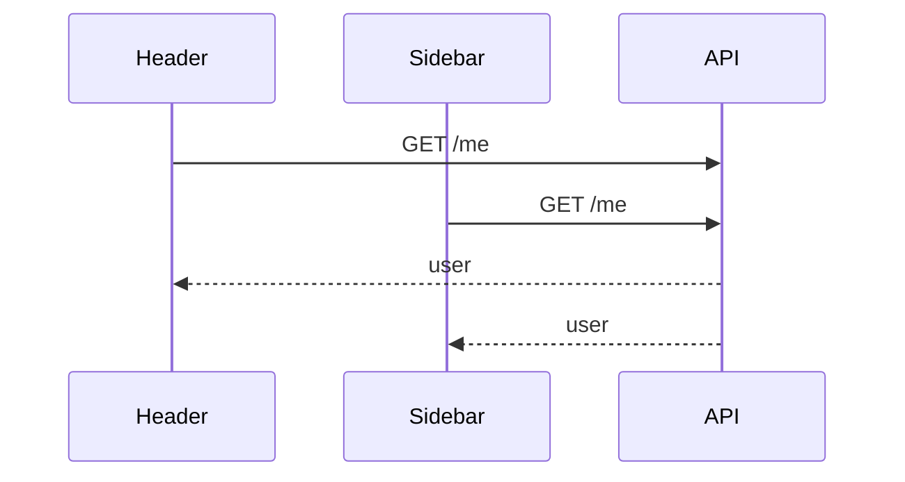
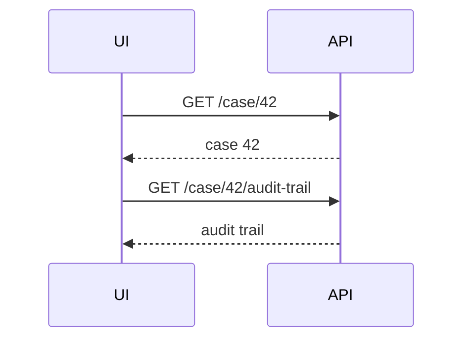
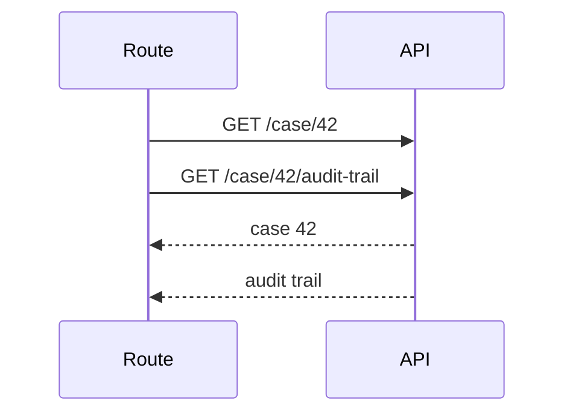

# Part 068 — Fetching with Effects: Why It Breaks Down

Fetching data inside `useEffect` is not illegal.

The problem is more precise:

```txt
Fetching server product data directly inside component effects
usually makes the component responsible for too many distributed-systems concerns.
```

This part does not say “never fetch in an effect.” That would be too simplistic.

Instead, we will build the failure model.

By the end, you should be able to look at any `useEffect(fetch...)` and decide whether it is:

```txt
- a valid local synchronization effect
- a temporary implementation
- an accidental query cache
- a race condition waiting to happen
- a server-state architecture smell
```

---

## 1. The Naive Fetch Effect

Most React developers write this early:

```tsx
function UserProfile({ userId }: { userId: string }) {
  const [user, setUser] = useState<User | null>(null);
  const [loading, setLoading] = useState(false);
  const [error, setError] = useState<unknown>(null);

  useEffect(() => {
    setLoading(true);
    setError(null);

    fetch(`/api/users/${userId}`)
      .then((response) => response.json())
      .then(setUser)
      .catch(setError)
      .finally(() => setLoading(false));
  }, [userId]);

  if (loading) return <Spinner />;
  if (error) return <ErrorMessage error={error} />;
  if (!user) return null;

  return <ProfileView user={user} />;
}
```

This code looks reasonable.

But it has hidden policy decisions:

```txt
- no server rendering data
- no preload
- no cache
- no request dedupe
- no stale response guard
- no abort policy
- no retry policy
- no invalidation policy
- no background refresh
- no stale-while-revalidate
- no optimistic reconciliation
- no cross-screen consistency
```

That is acceptable only if those policies truly do not matter.

In product applications, they usually matter.

---

## 2. Effect Fetching Is Synchronization, Not Data Architecture

`useEffect` is designed to synchronize a component with an external system.

Examples of external synchronization:

```txt
- connect/disconnect WebSocket
- subscribe/unsubscribe browser event
- start/stop timer
- integrate third-party widget
- update document title
- imperatively control external object
```

Fetching can be synchronization:

```txt
Component says: for this prop/state, start this external request.
```

But server data fetching for product UI is usually not just synchronization.

It also needs:

```txt
- identity
- cache
- freshness
- invalidation
- dedupe
- retry
- cancellation
- optimistic mutation
- request sharing
- SSR/preload
- hydration
- observability
```

`useEffect` gives you a lifecycle hook.

It does not give you a server-state system.

---

## 3. Failure Mode: Race Conditions

Consider this component:

```tsx
function CaseDetail({ caseId }: { caseId: string }) {
  const [caseData, setCaseData] = useState<Case | null>(null);

  useEffect(() => {
    getCase(caseId).then(setCaseData);
  }, [caseId]);

  return <CaseView data={caseData} />;
}
```

Timeline:

```txt
T0: caseId = A, request A starts
T1: user switches to caseId = B, request B starts
T2: request B resolves, UI shows case B
T3: request A resolves late, UI shows case A incorrectly
```

Nothing in `setCaseData` knows which request is current.

A basic guard:

```tsx
useEffect(() => {
  let ignore = false;

  async function load() {
    const result = await getCase(caseId);
    if (!ignore) {
      setCaseData(result);
    }
  }

  load();

  return () => {
    ignore = true;
  };
}, [caseId]);
```

This prevents old response from writing state after cleanup.

But now every component fetch must remember to implement race safety.

That is already a sign that the concern wants abstraction.

---

## 4. Failure Mode: Abort Is Not the Same as Ignore

Ignoring a stale response prevents state corruption.

Aborting a request prevents unnecessary work when supported.

```tsx
useEffect(() => {
  const controller = new AbortController();

  async function load() {
    try {
      const response = await fetch(`/api/cases/${caseId}`, {
        signal: controller.signal,
      });

      const result = await response.json();
      setCaseData(result);
    } catch (error) {
      if (controller.signal.aborted) return;
      setError(error);
    }
  }

  load();

  return () => {
    controller.abort();
  };
}, [caseId]);
```

But aborting does not solve every race:

```txt
- server may have already processed request
- non-fetch async APIs may not support abort
- mutation commands may not be safely abortable
- response may still need request identity check
```

Abort is useful. It is not a complete data architecture.

---

## 5. Failure Mode: Duplicate Requests

If two components need the same data:

```tsx
function Header() {
  const user = useCurrentUserEffectFetch();
  return <Avatar user={user} />;
}

function Sidebar() {
  const user = useCurrentUserEffectFetch();
  return <UserMenu user={user} />;
}
```

Each component may fetch independently.



A query cache would dedupe by key:

```txt
['currentUser'] -> one in-flight request shared by observers
```

Without a cache, dedupe becomes manual and scattered.

---

## 6. Failure Mode: Network Waterfalls

Parent fetches first. Child fetches after parent renders.

```tsx
function CasePage({ caseId }: { caseId: string }) {
  const caseData = useCaseEffectFetch(caseId);

  if (!caseData) return <Spinner />;

  return <AuditTrail caseId={caseData.id} />;
}

function AuditTrail({ caseId }: { caseId: string }) {
  const auditTrail = useAuditTrailEffectFetch(caseId);
  return <AuditTrailView items={auditTrail} />;
}
```

Timeline:

```txt
T0: render CasePage
T1: effect starts case request
T2: case response returns
T3: render AuditTrail
T4: effect starts audit request
T5: audit response returns
```

The requests are sequential even if they could have been planned earlier.



Better architecture often preloads or starts independent requests closer to the route/page boundary.



Effects run after render, so they are naturally late for initial data loading.

---

## 7. Failure Mode: No Server Rendering Data

Effects do not run during server render.

That means if the only data load happens in `useEffect`, the initial HTML cannot include the fetched data.

Typical sequence:

```txt
1. Server returns HTML with loading shell.
2. Browser downloads JS.
3. React hydrates.
4. Effect runs.
5. Fetch starts.
6. Data arrives.
7. Real content appears.
```

For internal dashboards, this may be acceptable.

For public pages, SEO-sensitive pages, slow networks, or high-latency regions, this can be poor UX.

Framework loaders, server components, route preloading, or server-state dehydration address this boundary better than component-local effects.

---

## 8. Failure Mode: Loading State Is Underspecified

Naive state:

```tsx
const [loading, setLoading] = useState(false);
```

But real server-state loading has multiple meanings:

```txt
- first load with no data
- background refetch with existing data
- refetch after error
- retry after failure
- mutation pending
- pagination next page loading
- dependent query waiting for input
```

A single boolean cannot express this.

Better read model:

```tsx
type ReadModel<T> =
  | { status: 'idle' }
  | { status: 'pending' }
  | { status: 'success'; data: T; isFetching: boolean; isStale: boolean }
  | { status: 'error'; error: unknown }
  | { status: 'error-with-data'; data: T; error: unknown; isFetching: false };
```

Even if a library exposes booleans, your UI should think in states, not random flags.

---

## 9. Failure Mode: Error State Is Underspecified

Naive error:

```tsx
const [error, setError] = useState<unknown>(null);
```

But server errors differ:

```txt
- unauthenticated
- unauthorized
- validation error
- conflict
- not found
- timeout
- offline
- server error
- partial failure
- stale version
- rate limit
```

UI behavior should differ:

```txt
401 unauthenticated:
  redirect/login refresh

403 unauthorized:
  show permission message

409 conflict:
  reload/merge/retry flow

422 validation:
  attach field errors

500:
  retry/report fallback
```

A component-local effect often collapses error semantics into one UI branch.

That is not enough for production workflows.

---

## 10. Failure Mode: Cache Is Accidentally Reimplemented

Developers notice duplicate fetches and add a module-level cache:

```ts
const userCache = new Map<string, User>();

export async function getCachedUser(userId: string) {
  const cached = userCache.get(userId);
  if (cached) return cached;

  const user = await getUser(userId);
  userCache.set(userId, user);
  return user;
}
```

Now ask:

```txt
- When does cache expire?
- How do listeners know it changed?
- How do in-flight requests dedupe?
- How are errors cached?
- How does logout clear it?
- How does mutation update it?
- How does SSR avoid cross-request leakage?
- How does tab focus trigger refetch?
- How does memory get released?
```

You started with `useEffect` and slowly built a worse query cache.

This is the common path.

---

## 11. Build From Scratch: From Effect to Resource Hook

Let us build the abstraction pressure step by step.

### Step 1 — Naive Hook

```tsx
function useCaseNaive(caseId: string) {
  const [data, setData] = useState<Case | null>(null);
  const [error, setError] = useState<unknown>(null);
  const [loading, setLoading] = useState(false);

  useEffect(() => {
    setLoading(true);
    setError(null);

    getCase(caseId)
      .then(setData)
      .catch(setError)
      .finally(() => setLoading(false));
  }, [caseId]);

  return { data, error, loading };
}
```

Bug: stale response can write.

### Step 2 — Ignore Stale Response

```tsx
function useCaseWithIgnore(caseId: string) {
  const [state, setState] = useState<{
    data: Case | null;
    error: unknown;
    loading: boolean;
  }>({ data: null, error: null, loading: false });

  useEffect(() => {
    let ignore = false;

    setState((prev) => ({ ...prev, loading: true, error: null }));

    getCase(caseId)
      .then((data) => {
        if (!ignore) {
          setState({ data, error: null, loading: false });
        }
      })
      .catch((error) => {
        if (!ignore) {
          setState((prev) => ({ ...prev, error, loading: false }));
        }
      });

    return () => {
      ignore = true;
    };
  }, [caseId]);

  return state;
}
```

Better, but repeated everywhere.

### Step 3 — Request Identity

```tsx
function useCaseWithRequestId(caseId: string) {
  const requestIdRef = useRef(0);
  const [state, setState] = useState<ReadState<Case>>({ status: 'idle' });

  useEffect(() => {
    const requestId = ++requestIdRef.current;

    setState({ status: 'pending' });

    getCase(caseId)
      .then((data) => {
        if (requestId !== requestIdRef.current) return;
        setState({ status: 'success', data });
      })
      .catch((error) => {
        if (requestId !== requestIdRef.current) return;
        setState({ status: 'error', error });
      });
  }, [caseId]);

  return state;
}
```

Now old responses cannot win.

But still no cache/dedupe.

### Step 4 — Add In-Flight Deduplication

```ts
type ResourceRecord<T> = {
  promise: Promise<T> | null;
  data: T | null;
  error: unknown;
};

const caseRecords = new Map<string, ResourceRecord<Case>>();

function getCaseRecord(caseId: string): ResourceRecord<Case> {
  let record = caseRecords.get(caseId);

  if (!record) {
    record = { promise: null, data: null, error: null };
    caseRecords.set(caseId, record);
  }

  return record;
}

function fetchCaseOnce(caseId: string) {
  const record = getCaseRecord(caseId);

  if (record.promise) {
    return record.promise;
  }

  record.promise = getCase(caseId)
    .then((data) => {
      record.data = data;
      record.error = null;
      return data;
    })
    .catch((error) => {
      record.error = error;
      throw error;
    })
    .finally(() => {
      record.promise = null;
    });

  return record.promise;
}
```

Now requests dedupe.

But consumers are not notified when cache changes.

### Step 5 — Add Subscribers

```ts
type Listener = () => void;

const listenersByKey = new Map<string, Set<Listener>>();

function subscribe(key: string, listener: Listener) {
  let listeners = listenersByKey.get(key);

  if (!listeners) {
    listeners = new Set();
    listenersByKey.set(key, listeners);
  }

  listeners.add(listener);

  return () => {
    listeners!.delete(listener);
  };
}

function notify(key: string) {
  listenersByKey.get(key)?.forEach((listener) => listener());
}
```

Now we are building an external store.

React integration wants `useSyncExternalStore`.

### Step 6 — Snapshot Contract

```ts
function getCaseSnapshot(caseId: string) {
  const record = getCaseRecord(caseId);

  if (record.data) {
    return { status: 'success' as const, data: record.data };
  }

  if (record.error) {
    return { status: 'error' as const, error: record.error };
  }

  return { status: 'pending' as const };
}
```

But this implementation allocates a new object every call.

For `useSyncExternalStore`, snapshots must be stable when data has not changed. Otherwise React may think the store changed continuously.

So now you need snapshot caching.

### Step 7 — Staleness Policy

Add:

```ts
type ResourceRecord<T> = {
  data: T | null;
  error: unknown;
  promise: Promise<T> | null;
  updatedAt: number | null;
};

function isStale(record: ResourceRecord<unknown>, staleTimeMs: number) {
  if (record.updatedAt === null) return true;
  return Date.now() - record.updatedAt > staleTimeMs;
}
```

Now you need:

```txt
- staleTime
- cacheTime/gcTime
- refetch on focus
- refetch on reconnect
- manual invalidation
- retry
- backoff
```

This is the moment you realize the library exists for a reason.

---

## 12. The Component Should Not Own the Cache Protocol

A component is good at:

```txt
- rendering a read model
- collecting user intent
- owning local interaction state
- composing child views
```

A component is bad at owning every server-state protocol:

```txt
- cache identity
- stale policy
- dedupe
- retries
- invalidation
- hydration
- garbage collection
- optimistic transaction log
```

That protocol should be centralized in a server-state layer.

---

## 13. Strict Mode Makes Bad Effects More Visible

In development, React Strict Mode may run extra setup/cleanup cycles to expose bugs in effects.

If your effect is not cleanup-safe, duplicate work may appear.

Bad effect:

```tsx
useEffect(() => {
  analytics.connect();
}, []);
```

No cleanup.

Better:

```tsx
useEffect(() => {
  const connection = analytics.connect();

  return () => {
    connection.disconnect();
  };
}, []);
```

For fetch effects, development behavior can reveal duplicate request assumptions.

The answer is not to disable Strict Mode. The answer is to make effects idempotent and cleanup-safe, or move server-state fetching to an abstraction with dedupe.

---

## 14. Effects Do Not Preload

An effect starts after render commit.

That means data fetching in effects is reactive, not planned.

Preload-oriented systems start earlier:

```txt
- route loader knows needed data before component renders
- server component reads data on server
- query prefetch starts on hover/navigation intent
- framework fetches in parallel for matched routes
```

Effect fetching says:

```txt
Render first, discover data need later.
```

That is often too late.

---

## 15. Effects Do Not Model Query Identity

An effect dependency array is not a query key.

```tsx
useEffect(() => {
  fetchCases(filters).then(setCases);
}, [filters]);
```

Problems:

```txt
- `filters` may be unstable object identity
- dependency identity may not equal server resource identity
- no cache identity exists outside this component
- invalidation cannot target this effect by key
```

A query key should be explicit and serializable enough for identity:

```tsx
['cases', { status, assigneeId, page, sort }]
```

An effect dependency array answers:

```txt
When should this synchronization re-run?
```

A query key answers:

```txt
Which server snapshot is this?
```

Different questions.

---

## 16. Effects Do Not Model Invalidation

Suppose this effect loads case detail:

```tsx
useEffect(() => {
  getCase(caseId).then(setCaseData);
}, [caseId]);
```

Elsewhere, mutation approves the case:

```tsx
async function approve() {
  await approveCase(caseId);
}
```

How does the detail effect know it should refetch?

Options:

```txt
- manually call a refetch callback
- toggle some state dependency
- emit event bus event
- force remount
- put data in context/store
- use server-state cache invalidation
```

The first five often become ad hoc invalidation.

Server-state cache gives invalidation a first-class place.

---

## 17. Effects Do Not Model Pagination Well

Infinite loading requires:

```txt
- page params
- accumulated pages
- dedupe per page
- next page availability
- loading next page vs loading first page
- error for next page while existing pages remain
- refetch all pages
- remove/insert item across pages after mutation
```

Naive effect state grows quickly:

```tsx
const [pages, setPages] = useState<CasePage[]>([]);
const [page, setPage] = useState(1);
const [loadingInitial, setLoadingInitial] = useState(false);
const [loadingMore, setLoadingMore] = useState(false);
const [hasNextPage, setHasNextPage] = useState(true);
const [error, setError] = useState<unknown>(null);
```

This is not just data fetching. It is a pagination cache.

---

## 18. Effects Do Not Model Retry Policy

Retry is not simply:

```tsx
catch(() => loadAgain())
```

Good retry policy needs:

```txt
- which errors are retryable?
- how many attempts?
- exponential backoff?
- jitter?
- pause when offline?
- retry on reconnect?
- user-visible retry button?
- preserve existing data while retrying?
```

A component effect should not independently invent retry policy for every API call.

---

## 19. Effects Do Not Model Auth Refresh Well

Auth failure often needs centralized handling:

```txt
- token expired
- refresh token request
- original request retry
- refresh failure -> logout
- prevent multiple simultaneous refreshes
- clear caches by tenant/user
```

If every effect fetch owns this, auth logic becomes duplicated and inconsistent.

Put it in API client/server-state layer.

---

## 20. Effects Do Not Model Cache Garbage Collection

Once data is fetched, how long should it stay?

```txt
- until component unmounts?
- until tab closes?
- for 5 minutes?
- forever until logout?
- while there are active observers?
- persisted between sessions?
```

Component-local state dies on unmount.

Module-level cache may never die.

Server-state cache has explicit garbage-collection policy.

---

## 21. When Fetching in Effects Is Fine

Use effect fetching when the operation is truly component-local synchronization.

Good examples:

```txt
- load metadata for a user-selected local file
- call browser/device API after component appears
- fetch non-shared preview data for an isolated widget
- one-off integration with third-party imperative SDK
- fire-and-clean subscription to an external object
```

Conditions:

```txt
- no SSR/preload need
- no cross-screen sharing
- no invalidation graph
- no dedupe requirement
- no optimistic mutation
- race/cancellation handled
- component truly owns lifecycle
```

Example:

```tsx
function FileMetadataPreview({ file }: { file: File | null }) {
  const [metadata, setMetadata] = useState<FileMetadata | null>(null);

  useEffect(() => {
    if (!file) {
      setMetadata(null);
      return;
    }

    let ignore = false;

    readFileMetadata(file).then((result) => {
      if (!ignore) {
        setMetadata(result);
      }
    });

    return () => {
      ignore = true;
    };
  }, [file]);

  return <MetadataView metadata={metadata} />;
}
```

This is a local async derivation from local input.

It is not shared server product data.

---

## 22. When Fetching in Effects Is a Smell

Smell checklist:

```txt
- Same data needed by multiple components
- Data should survive navigation
- Data should be prefetched
- Initial HTML should include data
- Mutation should invalidate it
- Stale data can be displayed while refetching
- Request should dedupe
- Retry policy matters
- Pagination/infinite query exists
- User can edit/mutate the resource
- Auth/permission/conflict errors matter
- Offline/reconnect/focus refetch matters
- Cache needs devtools/observability
```

If two or more apply, direct effect fetching is probably the wrong abstraction.

---

## 23. Alternative Data Boundaries

### 23.1 Route Loader

Useful when data belongs to route identity.

```txt
Route /cases/:caseId
  -> load case detail before rendering route
```

Good for:

```txt
- route-level data
- navigation-aware loading
- SSR framework integration
- parallel route matching
```

### 23.2 Server Components / Server Data Layer

Useful when framework supports server-first data reads.

Good for:

```txt
- data needed in initial HTML
- secrets/server-only logic
- avoiding client waterfall
- reducing client JS data orchestration
```

### 23.3 Server-State Cache

Useful for interactive client apps.

Good for:

```txt
- cached client-side reads
- background refetch
- mutations
- optimistic updates
- pagination
- cross-screen consistency
```

### 23.4 Custom Resource Store

Useful when requirements are special but limited.

Good for:

```txt
- browser API resource
- WebSocket-backed resource
- local-first sync object
- embedded SDK state
```

But if you rebuild query cache features, use query cache.

---

## 24. Migration Path from Effect Fetching

### Stage 1 — Encapsulate

Move repeated fetch effect into a custom hook.

```tsx
function useCase(caseId: string) {
  // still effect-based, but isolated
}
```

### Stage 2 — Add Correctness Guards

Add:

```txt
- request identity
- cleanup/abort
- discriminated read state
- stable error handling
```

### Stage 3 — Add Query Identity

Define resource key:

```ts
const caseKey = (caseId: string) => ['case', caseId] as const;
```

Even before adopting a library, this clarifies identity.

### Stage 4 — Move to Server-State Cache

Replace internal effect with query/cache abstraction.

```tsx
function useCase(caseId: string) {
  return useQuery({
    queryKey: caseKey(caseId),
    queryFn: () => getCase(caseId),
  });
}
```

### Stage 5 — Define Mutation Invalidation

```tsx
function useApproveCase() {
  const queryClient = useQueryClient();

  return useMutation({
    mutationFn: approveCase,
    onSuccess: (_, variables) => {
      queryClient.invalidateQueries({ queryKey: ['case', variables.caseId] });
      queryClient.invalidateQueries({ queryKey: ['cases'] });
    },
  });
}
```

The real improvement is not syntax.

The real improvement is that invalidation becomes part of architecture.

---

## 25. A Better Component Shape

Bad shape:

```tsx
function CaseDetailPage({ caseId }: { caseId: string }) {
  const [caseData, setCaseData] = useState<Case | null>(null);
  const [loading, setLoading] = useState(false);
  const [error, setError] = useState<unknown>(null);
  const [isApproveModalOpen, setApproveModalOpen] = useState(false);

  useEffect(() => {
    // network lifecycle
  }, [caseId]);

  async function approve() {
    // mutation lifecycle + invalidation
  }

  return ...;
}
```

Better shape:

```tsx
function CaseDetailPage({ caseId }: { caseId: string }) {
  const caseRead = useCase(caseId);
  const approveCase = useApproveCase();
  const [isApproveModalOpen, setApproveModalOpen] = useState(false);

  return (
    <CaseDetailView
      caseRead={caseRead}
      isApproveModalOpen={isApproveModalOpen}
      onOpenApproveModal={() => setApproveModalOpen(true)}
      onCloseApproveModal={() => setApproveModalOpen(false)}
      onConfirmApprove={() => approveCase.mutate({ caseId })}
    />
  );
}
```

Now responsibilities are clearer:

```txt
useCase:
  server read lifecycle

useApproveCase:
  server command lifecycle

local state:
  modal visibility

view:
  rendering and user intent
```

---

## 26. Suspense Does Not Magically Fix Bad Fetching

Suspense can improve loading boundary composition.

But Suspense is not cache identity by itself.

You still need:

```txt
- resource identity
- cache lifetime
- invalidation
- error boundary
- mutation lifecycle
- preloading strategy
```

Suspense answers:

```txt
How should UI wait for async data at render boundary?
```

It does not automatically answer:

```txt
When is this server snapshot stale?
```

---

## 27. React 19 Actions Do Not Replace Server-State Cache

React 19 Actions improve async transitions and form/mutation workflows.

They help with:

```txt
- pending state
- form submissions
- optimistic UI
- async transition handling
```

But they do not remove the need for read cache design.

After an action mutates server state, you still need to decide:

```txt
- which reads are stale?
- should data be revalidated?
- should cache be updated from action result?
- should optimistic state rollback?
```

Actions improve command ergonomics.

Server-state architecture still matters.

---

## 28. Testing Effect Fetching Is Awkward

Effect fetching tests need to handle:

```txt
- mount timing
- async resolution
- cleanup
- prop changes
- out-of-order responses
- unmount before response
- duplicate fetches
- loading/error transitions
```

If each component owns fetch lifecycle, each component test must repeat this.

With server-state hooks, tests can focus on:

```txt
- read hook behavior
- mutation invalidation
- view states
- integration journey
```

The boundary becomes testable.

---

## 29. Observability

In production, you need to answer:

```txt
- Which query is slow?
- Which endpoint retries often?
- Which cache invalidation is missing?
- Which mutation causes stale UI?
- Which screen waterfalls data?
- Which request was cancelled?
- Which error type dominates?
```

Scattered effects produce scattered telemetry.

A server-state layer can instrument:

```txt
- query key
- duration
- result type
- retry count
- cache hit/miss
- stale time
- invalidation source
- mutation lifecycle
```

Good frontend architecture is observable architecture.

---

## 30. Decision Matrix

| Requirement | Effect Fetch | Route Loader | Server-State Cache | Custom Resource Store |
|---|---:|---:|---:|---:|
| Component-local async sync | Good | Overkill | Maybe | Good |
| SSR initial data | Poor | Good | Good with dehydration | Custom work |
| Cache and stale policy | Manual | Framework-specific | Good | Manual |
| Deduplication | Manual | Good if loader-level | Good | Manual |
| Cross-screen sharing | Poor | Medium | Good | Medium |
| Mutation invalidation | Manual | Revalidation model | Good | Manual |
| Optimistic update | Manual | Limited | Good | Manual |
| Pagination/infinite | Manual-heavy | Medium | Good | Manual-heavy |
| Retry/focus/reconnect | Manual | Framework-specific | Good | Manual |
| External browser/SDK sync | Good | Poor | Poor/Maybe | Good |

---

## 31. Practical Rule

Use this rule:

```txt
If the data is server-owned and may be reused, invalidated, prefetched,
refetched, mutated, cached, or shared, do not let a random component effect own it.
```

Use an effect only when:

```txt
The component truly owns the external synchronization lifecycle.
```

---

## 32. Common Refactor Recipes

### Recipe 1 — Effect Fetch to Query Hook

Before:

```tsx
useEffect(() => {
  getCase(caseId).then(setCase);
}, [caseId]);
```

After:

```tsx
const caseRead = useCase(caseId);
```

Where:

```tsx
function useCase(caseId: string) {
  return useQuery({
    queryKey: ['case', caseId],
    queryFn: () => getCase(caseId),
  });
}
```

### Recipe 2 — Manual Refetch to Invalidation

Before:

```tsx
await approveCase(caseId);
await reloadCase();
await reloadCases();
```

After:

```tsx
await approveCase(caseId);
invalidateCaseRelatedSnapshots(caseId);
```

### Recipe 3 — Derived Local Data to Selector

Before:

```tsx
const [openCases, setOpenCases] = useState<Case[]>([]);

useEffect(() => {
  setOpenCases(cases.filter(isOpen));
}, [cases]);
```

After:

```tsx
const openCases = useMemo(() => cases.filter(isOpen), [cases]);
```

### Recipe 4 — Request Boolean to Read State

Before:

```tsx
const [loading, setLoading] = useState(false);
const [error, setError] = useState(null);
const [data, setData] = useState(null);
```

After:

```tsx
type ReadState<T> =
  | { status: 'pending' }
  | { status: 'success'; data: T; isFetching: boolean }
  | { status: 'error'; error: unknown };
```

### Recipe 5 — Event Bus Refresh to Query Key Invalidation

Before:

```tsx
eventBus.emit('case:changed', caseId);
```

After:

```tsx
queryClient.invalidateQueries({ queryKey: ['case', caseId] });
queryClient.invalidateQueries({ queryKey: ['cases'] });
```

---

## 33. Anti-Pattern Map

| Anti-Pattern | Symptom | Better Direction |
|---|---|---|
| Fetch in every component | duplicate requests | query cache or loader |
| Store API response in Context | rerender fan-out, manual invalidation | server-state cache |
| Copy query data to local state | stale duplicated data | derive or explicit draft |
| Boolean loading everywhere | inconsistent UI states | discriminated read state |
| Manual refresh callbacks | brittle dependency chain | invalidation graph |
| Mutation as setter | lost error/rollback semantics | command lifecycle |
| No request identity | stale response overwrite | request guard/cache observer |
| No cache key | cannot share/invalidate | explicit resource key |
| Effect waterfall | slow initial load | route/page-level preloading |
| Swallow all errors | poor UX/debugging | typed error handling |

---

## 34. Exercises

### Exercise 1 — Audit Fetch Effects

Find all `useEffect` blocks that call `fetch`, API client, or async data loader.

Classify each:

```txt
A. valid local synchronization
B. should become custom hook
C. should become route loader
D. should become server-state query
E. should become mutation/action flow
```

### Exercise 2 — Race Test

For one effect fetch, write a test where:

```txt
1. request A starts
2. props change
3. request B starts
4. request B resolves
5. request A resolves late
```

Expected:

```txt
UI must show B, never A.
```

### Exercise 3 — Waterfall Diagram

Pick one route. Draw all data requests and when they start.

Mark which requests can be parallelized or prefetched.

### Exercise 4 — Invalidation Map

Pick one mutation. Write:

```txt
mutation: approveCase(caseId)
invalidates:
  - ['case', caseId]
  - ['cases', filters?]
  - ['dashboardMetrics']
  - ['auditTrail', caseId]
```

Then check whether current code actually refreshes those snapshots.

### Exercise 5 — Loading State Rewrite

Replace `loading/error/data` booleans with a discriminated union read state in one component.

Observe how many impossible states disappear.

---

## 35. Key Takeaways

```txt
1. Fetching in effects is allowed but limited.
2. Effects run after render, so they are late for initial data loading.
3. Direct effect fetching does not provide cache, preload, dedupe, retry, or invalidation.
4. Race conditions must be handled explicitly if you fetch in effects.
5. Abort and ignore are useful but not complete architecture.
6. Effect dependency arrays are not query keys.
7. Mutation invalidation is the real design problem.
8. If you keep adding cache features around effects, use a server-state abstraction.
9. Use effects for local external synchronization.
10. Use loaders/server-state cache/resource stores for product server data.
```

---

## 36. References

- React Documentation — `useEffect`
- React Documentation — Synchronizing with Effects
- React Documentation — You Might Not Need an Effect
- React Documentation — Lifecycle of Reactive Effects
- React Documentation — State as a Snapshot
- React Documentation — React 19 Actions
- TanStack Query Documentation — Important Defaults
- TanStack Query Documentation — Query Keys
- TanStack Query Documentation — Query Cancellation
