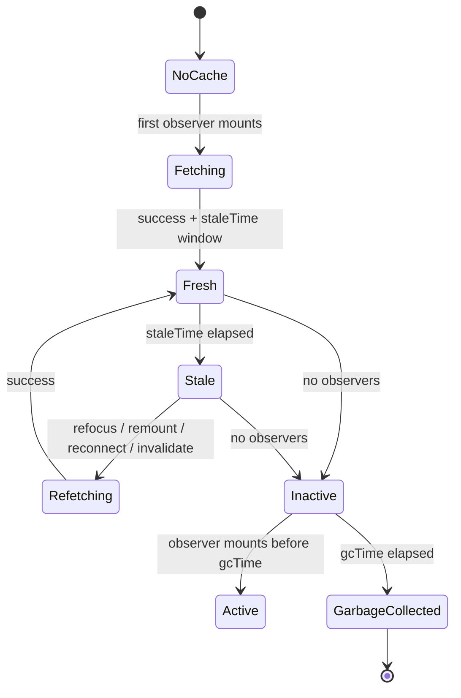

# Part 069 — TanStack Query Mental Model

TanStack Query is often introduced like this:

```txt
A data fetching library for React.
```

That description is technically useful, but architecturally incomplete.

The more useful mental model is:

```txt
TanStack Query is a server-state runtime.

It gives remote data:
- an address
- a cache entry
- a freshness policy
- observers
- retry behavior
- background refetch behavior
- garbage collection
- invalidation semantics
- mutation coordination hooks
- devtools visibility
```

A `useQuery` call is not merely “fetch on mount.”

A `useQuery` call is closer to:

```txt
Subscribe this component to the server-state record identified by this query key,
fetch it if policy says it should be fetched,
reuse cached data if policy says it can be reused,
notify this observer when relevant query state changes,
and keep this cache entry alive while it has observers.
```

That difference is the point of this part.

---

## 1. The Problem TanStack Query Solves

In Part 068, we saw that `useEffect(fetch...)` quickly becomes responsible for too much:

```txt
- loading state
- error state
- retry
- cancellation
- race guards
- cache reuse
- deduplication
- refetch on focus
- refetch on reconnect
- pagination
- invalidation
- optimistic updates
- SSR hydration
- stale data policy
- background reconciliation
```

That is not a React problem only.

It is a distributed state problem.

The server owns the data, but the UI needs a local projection of that data. That projection is necessarily imperfect:

```txt
server data in UI = cached remote truth + freshness policy + reconciliation mechanism
```

A plain React state variable does not know whether its value is:

```txt
- fresh
- stale
- refetching
- inactive
- invalidated
- garbage-collectable
- placeholder
- optimistic
- restored from hydration
```

TanStack Query gives those concepts explicit semantics.

---

## 2. Core Object Model

The runtime is easier to understand if you stop thinking in hooks first.

Think in runtime objects:

```mermaid
flowchart TD
    QC[QueryClient] --> QCache[QueryCache]
    QC --> MCache[MutationCache]

    QCache --> Q1[Query: ['cases', filters]]
    QCache --> Q2[Query: ['case', caseId]]
    QCache --> Q3[Query: ['permissions', userId]]

    Q1 --> O1[QueryObserver: SearchPage]
    Q1 --> O2[QueryObserver: ExportButton]
    Q2 --> O3[QueryObserver: CaseDetail]

    O1 --> C1[React Component]
    O2 --> C2[React Component]
    O3 --> C3[React Component]
```

### `QueryClient`

The `QueryClient` owns the caches and global policy.

It is where you configure defaults like:

```tsx
const queryClient = new QueryClient({
  defaultOptions: {
    queries: {
      staleTime: 30_000,
      gcTime: 5 * 60_000,
      retry: 2,
      refetchOnWindowFocus: true,
    },
  },
});
```

Architecturally:

```txt
QueryClient = server-state runtime instance
```

Do not create it inside a rendering path.

Bad:

```tsx
function App() {
  const client = new QueryClient(); // ❌ new cache on every render

  return <QueryClientProvider client={client}>{/* ... */}</QueryClientProvider>;
}
```

Good:

```tsx
const queryClient = new QueryClient();

function App() {
  return <QueryClientProvider client={queryClient}>{/* ... */}</QueryClientProvider>;
}
```

Or, when you need per-request/per-test/per-tenant isolation, create it at that boundary, not during normal render churn.

---

### `QueryCache`

The `QueryCache` stores query records.

A query record is not “component state.”

It is a cache entry identified by a query key:

```txt
queryKey -> query state
```

Example:

```tsx
useQuery({
  queryKey: ['cases', { status: 'open', page: 1 }],
  queryFn: () => fetchCases({ status: 'open', page: 1 }),
});
```

The cache entry is conceptually:

```ts
type QueryRecord<TData> = {
  queryKey: unknown[];
  data: TData | undefined;
  error: unknown;
  status: 'pending' | 'error' | 'success';
  fetchStatus: 'idle' | 'fetching' | 'paused';
  dataUpdatedAt: number;
  errorUpdatedAt: number;
  observers: Set<QueryObserver>;
  promise?: Promise<TData>;
  options: QueryOptions;
};
```

The real implementation has more detail, but this simplified shape is enough to reason with.

---

### `QueryObserver`

A component that calls `useQuery` does not own the query.

It owns an observer subscription to the query.

```txt
component -> observer -> query record -> cache
```

Multiple components can observe the same cache entry:

```tsx
function HeaderBadge() {
  const query = useQuery(openCasesOptions());
  return <Badge>{query.data?.total}</Badge>;
}

function CaseList() {
  const query = useQuery(openCasesOptions());
  return <CaseTable rows={query.data?.items ?? []} />;
}
```

If the options produce the same `queryKey`, both observers share the same cache entry.

That means:

```txt
- one cache entry
- one logical server-state record
- multiple React observers
- coordinated status/fetch/data updates
```

This is the first mental model upgrade from `useEffect(fetch...)`.

---

## 3. `useQuery` Is a Subscription, Not a Fetch Call

This is the most important sentence in this part:

```txt
useQuery declares a dependency on server state.
```

It does not mean:

```txt
run this network request now because this component mounted
```

It means:

```txt
this component needs the server-state value identified by this query key
```

The runtime decides whether to fetch based on:

```txt
- does the cache entry already exist?
- is the entry fresh or stale?
- is there already a fetch in flight?
- is the query enabled?
- is the app online?
- did the window regain focus?
- did the query become invalidated?
- is the observer active?
```

This distinction prevents architectural mistakes.

Bad mental model:

```txt
Component A fetches users.
Component B fetches users.
```

Better mental model:

```txt
Component A and B observe ['users', filters].
The query cache owns the server-state record.
```

---

## 4. Minimal Query

A minimal query needs two things:

```tsx
const query = useQuery({
  queryKey: ['case', caseId],
  queryFn: () => fetchCase(caseId),
});
```

But production code should rarely leave query definitions scattered inline.

Inline query options make it easy to accidentally diverge:

```tsx
useQuery({
  queryKey: ['case', caseId],
  queryFn: () => fetchCase(caseId),
  staleTime: 10_000,
});

useQuery({
  queryKey: ['case', id],
  queryFn: () => getCase(id),
  staleTime: 0,
});
```

Those two queries may represent the same domain resource with different policies.

A stronger architecture centralizes query options:

```tsx
import { queryOptions } from '@tanstack/react-query';

export const caseQueries = {
  detail: (caseId: string) =>
    queryOptions({
      queryKey: ['case', caseId] as const,
      queryFn: () => api.cases.getById(caseId),
      staleTime: 30_000,
    }),

  list: (filters: CaseFilters) =>
    queryOptions({
      queryKey: ['cases', normalizeCaseFilters(filters)] as const,
      queryFn: () => api.cases.search(filters),
      staleTime: 10_000,
    }),
};
```

Then components declare dependency without duplicating cache policy:

```tsx
function CaseDetailPage({ caseId }: { caseId: string }) {
  const caseQuery = useQuery(caseQueries.detail(caseId));

  if (caseQuery.isPending) return <CaseDetailSkeleton />;
  if (caseQuery.isError) return <CaseDetailError error={caseQuery.error} />;

  return <CaseDetailView value={caseQuery.data} />;
}
```

This gives you a domain query layer.

---

## 5. Query Key: The Cache Address

A query key is not a label.

It is the address of a server-state record.

```tsx
['case', caseId]
['cases', { status: 'open', page: 1 }]
['case-events', caseId, { limit: 50 }]
['permissions', tenantId, userId]
```

The key must include every variable that changes the returned data.

Bad:

```tsx
useQuery({
  queryKey: ['cases'],
  queryFn: () => fetchCases({ status, page }),
});
```

This collapses multiple resources into one cache entry.

Better:

```tsx
useQuery({
  queryKey: ['cases', { status, page }],
  queryFn: () => fetchCases({ status, page }),
});
```

The invariant:

```txt
If two query calls have the same key, they must represent the same server-state value.
If two query calls can return different values, they must not have the same key.
```

Part 070 goes deep into this.

---

## 6. Query Function: The Fetch Boundary

The query function should be boring.

```tsx
async function fetchCase(caseId: string): Promise<CaseDto> {
  const response = await fetch(`/api/cases/${caseId}`);

  if (!response.ok) {
    throw new ApiError(response.status, await response.text());
  }

  return response.json();
}
```

The query function should:

```txt
- return data
- throw errors
- respect cancellation when applicable
- avoid hidden component state
- avoid reading volatile UI state outside the query key
- avoid writing to unrelated stores
```

Bad:

```tsx
useQuery({
  queryKey: ['case', caseId],
  queryFn: async () => {
    const data = await fetchCase(caseId);
    setSelectedCase(data); // ❌ side effect into component/client state
    return data;
  },
});
```

Better:

```tsx
const caseQuery = useQuery(caseQueries.detail(caseId));
const selectedCase = caseQuery.data;
```

Or, if you need projection:

```tsx
const titleQuery = useQuery({
  ...caseQueries.detail(caseId),
  select: (caseItem) => caseItem.title,
});
```

The query function is not a workflow engine.

It is an adapter from query key parameters to server data.

---

## 7. Fresh, Stale, Active, Inactive, Garbage Collected

TanStack Query has lifecycle vocabulary.



Vocabulary:

| Term | Meaning |
|---|---|
| Fresh | Data is considered current according to `staleTime`. |
| Stale | Data may be shown, but should be eligible for background refetch. |
| Active | At least one observer is mounted. |
| Inactive | No observer is currently mounted, but cache may still keep data. |
| Garbage collected | The inactive query was removed after `gcTime`. |
| Invalidated | Query was explicitly marked stale, often after a mutation. |
| Fetching | Network/query function is currently running. |
| Pending | No successful data is available yet. |

This is a huge improvement over three booleans:

```ts
const [data, setData] = useState<T | null>(null);
const [loading, setLoading] = useState(false);
const [error, setError] = useState<unknown>(null);
```

Those booleans do not distinguish:

```txt
initial loading vs background refetch
stale-but-usable data vs missing data
inactive cache vs no cache
manual invalidation vs natural staleness
```

---

## 8. `staleTime` vs `gcTime`

These two options are often misunderstood.

```txt
staleTime = how long data is considered fresh
gcTime    = how long inactive data remains in cache before garbage collection
```

They answer different questions.

### `staleTime`

`staleTime` answers:

```txt
How long can the UI trust this cached value before it should become eligible for refetch?
```

Example:

```tsx
useQuery({
  queryKey: ['countries'],
  queryFn: fetchCountries,
  staleTime: 24 * 60 * 60 * 1000,
});
```

Reference tables can have long `staleTime`.

Highly volatile dashboards might use short `staleTime` or polling.

```tsx
useQuery({
  queryKey: ['case-queue-summary'],
  queryFn: fetchQueueSummary,
  staleTime: 5_000,
  refetchInterval: 15_000,
});
```

### `gcTime`

`gcTime` answers:

```txt
After nobody observes this query anymore, how long should the cache keep it around?
```

Example:

```tsx
useQuery({
  queryKey: ['case', caseId],
  queryFn: () => fetchCase(caseId),
  gcTime: 10 * 60_000,
});
```

This can make back-navigation feel instant.

But high cardinality data needs care:

```txt
['case', caseId] for thousands of visited case IDs
```

Long `gcTime` can retain too much memory.

---

## 9. Default Behavior Is Aggressive by Design

TanStack Query defaults are intentionally active.

A new user often sees “too many requests” because the defaults assume:

```txt
stale data should be refetched opportunistically
```

Common defaults to know:

```txt
- cached data is considered stale by default
- stale queries may refetch on mount
- stale queries may refetch on window focus
- stale queries may refetch on reconnect
- inactive queries are garbage-collected after a default interval
- failed queries are retried by default
```

Do not fight this by disabling everything globally.

Better:

```txt
Set explicit staleTime based on domain volatility.
```

Bad global reaction:

```tsx
new QueryClient({
  defaultOptions: {
    queries: {
      refetchOnWindowFocus: false,
      refetchOnReconnect: false,
      retry: false,
      staleTime: Infinity,
    },
  },
});
```

This silences symptoms by removing useful reconciliation.

Better domain policy:

```tsx
export const referenceQueries = {
  countries: () =>
    queryOptions({
      queryKey: ['reference', 'countries'],
      queryFn: api.reference.countries,
      staleTime: 24 * 60 * 60_000,
    }),
};

export const queueQueries = {
  summary: () =>
    queryOptions({
      queryKey: ['queue-summary'],
      queryFn: api.queue.summary,
      staleTime: 5_000,
      refetchInterval: 30_000,
    }),
};
```

---

## 10. Status vs Fetch Status

A robust UI distinguishes:

```txt
Do I have data?
Am I currently fetching?
```

These are not the same.

Typical query result fields include concepts like:

```txt
status: pending | error | success
fetchStatus: idle | fetching | paused
isPending
isError
isSuccess
isFetching
isRefetching
```

The key distinction:

```txt
pending = no successful data yet
fetching = query function currently running
```

That means you can have:

```txt
status: success
fetchStatus: fetching
```

The UI should render data and maybe show a subtle refresh indicator.

Bad:

```tsx
if (query.isFetching) return <FullPageSpinner />;
```

This causes flicker even when cached data exists.

Better:

```tsx
if (query.isPending) return <FullPageSkeleton />;
if (query.isError) return <ErrorState error={query.error} />;

return (
  <PageFrame>
    {query.isFetching ? <SmallRefreshIndicator /> : null}
    <CaseTable rows={query.data.items} />
  </PageFrame>
);
```

Production UI should usually distinguish:

```txt
hard loading = no usable data
soft loading = usable data + background refresh
```

---

## 11. Observer Sharing and Request Coordination

When two components observe the same query key, they share a cache entry.

```tsx
function CaseCountBadge() {
  const query = useQuery(caseQueries.list({ status: 'open', page: 1 }));
  return <Badge>{query.data?.total ?? 0}</Badge>;
}

function CaseListPanel() {
  const query = useQuery(caseQueries.list({ status: 'open', page: 1 }));
  return <CaseList rows={query.data?.items ?? []} />;
}
```

This is not duplication.

It is declaration.

The query cache coordinates the result.

Design consequence:

```txt
Do not manually lift server data only to avoid duplicate fetches.
```

Bad:

```tsx
function CasePage() {
  const [data, setData] = useState<CaseList | null>(null);

  useEffect(() => {
    fetchCases().then(setData);
  }, []);

  return (
    <>
      <CaseCountBadge data={data} />
      <CaseListPanel data={data} />
    </>
  );
}
```

Better:

```tsx
function CasePage() {
  return (
    <>
      <CaseCountBadge />
      <CaseListPanel />
    </>
  );
}
```

Both children can use the same domain query hook.

The query cache is the shared owner of server state.

---

## 12. Domain Query Hooks

A domain query hook is not just a wrapper around `useQuery`.

It is a boundary that encodes:

```txt
- query key shape
- query function
- freshness policy
- selection/projection
- enabled policy
- error normalization
- stable return contract
```

Example:

```tsx
export function useCaseDetail(caseId: string | null) {
  return useQuery({
    ...caseQueries.detail(caseId as string),
    enabled: Boolean(caseId),
  });
}
```

But be careful: too much wrapping can hide options needed by callers.

A flexible pattern:

```tsx
type UseCaseDetailOptions<TData> = {
  caseId: string;
  select?: (data: CaseDto) => TData;
  enabled?: boolean;
};

export function useCaseDetail<TData = CaseDto>({
  caseId,
  select,
  enabled = true,
}: UseCaseDetailOptions<TData>) {
  return useQuery({
    ...caseQueries.detail(caseId),
    select,
    enabled,
  });
}
```

Usage:

```tsx
const titleQuery = useCaseDetail({
  caseId,
  select: (caseItem) => caseItem.title,
});
```

Avoid wrapping every option blindly.

Bad:

```tsx
export function useCaseDetail(options: UseQueryOptions<any, any, any, any>) {
  return useQuery(options); // ❌ no domain contract
}
```

A domain hook should reduce accidental freedom, not re-export the entire library under a new name.

---

## 13. The `select` Option Is a Read Projection

`select` lets an observer subscribe to a projection of cached data.

```tsx
const assigneeQuery = useQuery({
  ...caseQueries.detail(caseId),
  select: (caseItem) => caseItem.assignee,
});
```

Mental model:

```txt
query cache stores raw data
observer receives selected projection
```

Use `select` when:

```txt
- component needs a small projection
- component should not know DTO shape
- derived value is purely synchronous
- projection improves rerender locality
```

Do not use `select` for:

```txt
- asynchronous transformation
- mutation side effects
- writing to stores
- permission decisions that need audit trail elsewhere
```

Bad:

```tsx
useQuery({
  ...caseQueries.detail(caseId),
  select: (caseItem) => {
    analytics.track('case_viewed'); // ❌ side effect in projection
    return caseItem;
  },
});
```

Better:

```tsx
const caseQuery = useQuery(caseQueries.detail(caseId));

useEffect(() => {
  if (caseQuery.data) {
    analytics.track('case_viewed', { caseId });
  }
}, [caseId, caseQuery.data]);
```

Even then, consider whether analytics belongs at route boundary rather than data boundary.

---

## 14. `enabled` Is Dependency Orchestration, Not an If Statement Around Hooks

You cannot conditionally call hooks.

Bad:

```tsx
if (caseId) {
  const query = useQuery(caseQueries.detail(caseId)); // ❌ conditional hook
}
```

Use `enabled` to represent query readiness:

```tsx
const caseQuery = useQuery({
  ...caseQueries.detail(caseId ?? 'missing'),
  enabled: caseId !== null,
});
```

A cleaner key factory can encode nullable readiness:

```tsx
function useMaybeCaseDetail(caseId: string | null) {
  return useQuery({
    queryKey: ['case', caseId],
    queryFn: () => {
      if (!caseId) throw new Error('caseId is required');
      return api.cases.getById(caseId);
    },
    enabled: Boolean(caseId),
  });
}
```

For dependent queries:

```tsx
const caseQuery = useQuery(caseQueries.detail(caseId));

const assigneeQuery = useQuery({
  ...userQueries.detail(caseQuery.data?.assigneeId ?? ''),
  enabled: Boolean(caseQuery.data?.assigneeId),
});
```

This expresses:

```txt
assignee query depends on case query result
```

without breaking hook order.

---

## 15. Placeholder Data vs Initial Data

These concepts are often confused.

### Placeholder data

Placeholder data is useful when you want a temporary display shape while real data loads.

Example:

```tsx
useQuery({
  ...caseQueries.detail(caseId),
  placeholderData: previousCasePreview,
});
```

Think:

```txt
placeholderData = observer-level temporary data for UX continuity
```

### Initial data

Initial data means you already have real data that can seed the cache.

Example:

```tsx
useQuery({
  ...caseQueries.detail(caseId),
  initialData: caseFromRouteLoader,
  initialDataUpdatedAt: loaderTimestamp,
});
```

Think:

```txt
initialData = cache seed
```

Use carefully.

Bad:

```tsx
useQuery({
  ...caseQueries.detail(caseId),
  initialData: {}, // ❌ fake data treated as real shape
});
```

Better:

```tsx
if (query.isPending) return <CaseSkeleton />;
```

Do not use fake initial data to avoid handling loading state.

---

## 16. Invalidation Is a Freshness Signal

After a mutation, you often know some query data is now outdated.

```tsx
const queryClient = useQueryClient();

const closeCaseMutation = useMutation({
  mutationFn: api.cases.close,
  onSuccess: (_, variables) => {
    queryClient.invalidateQueries({ queryKey: ['case', variables.caseId] });
    queryClient.invalidateQueries({ queryKey: ['cases'] });
  },
});
```

Invalidation does not mean:

```txt
delete everything and block the UI
```

It means:

```txt
mark matching queries stale;
if they are actively observed, refetch them in the background.
```

This is why query key design matters.

If your keys are sloppy, invalidation is sloppy.

Bad key taxonomy:

```txt
['data']
['list']
['detail']
```

Good key taxonomy:

```txt
['cases']
['cases', 'list', filters]
['cases', 'detail', caseId]
['cases', 'events', caseId, { limit }]
```

Part 070 expands this into a full key factory strategy.

---

## 17. Query Cache Is Not a Normalized Entity Store

A common mistake is expecting TanStack Query to behave like a fully normalized GraphQL cache.

TanStack Query primarily caches by query key.

That means this data:

```txt
['cases', 'list', { status: 'open' }]
['cases', 'detail', 'C-123']
```

may both contain the same case entity.

Updating one does not automatically update the other unless you:

```txt
- invalidate related queries
- update both cache entries manually
- design mutation responses to update targeted records
- use a normalized client store for client-owned entity state
```

This is not a weakness.

It is a design trade-off.

TanStack Query avoids requiring a global schema and instead gives you targeted invalidation, refetching, and manual atomic cache updates.

Decision heuristic:

```txt
If the server is source of truth and stale-then-refetch is acceptable:
use query invalidation.

If the UI owns complex editable entity graph before save:
use client state / reducer / external store.

If many query views must update instantly without refetch:
consider setQueryData carefully or add normalized client projection.
```

---

## 18. Architecture Boundary: Where Queries Belong

A production React application usually benefits from explicit layers.

```txt
api client       = HTTP/RPC details
query options   = query key + function + cache policy
query hook      = React adapter + select/enabled convenience
page boundary   = orchestration between queries, commands, route state
view component  = render data and emit intent
```

Example folder:

```txt
src/features/cases/
  api/
    caseApi.ts
  queries/
    caseQueries.ts
  hooks/
    useCaseDetail.ts
    useCaseList.ts
  components/
    CaseTable.tsx
    CaseDetailPanel.tsx
  pages/
    CaseSearchPage.tsx
```

API client:

```ts
export const caseApi = {
  search: (filters: CaseFilters) => http.get<CaseSearchResult>('/cases', { params: filters }),
  detail: (caseId: string) => http.get<CaseDto>(`/cases/${caseId}`),
};
```

Query options:

```ts
export const caseQueries = {
  all: () => ['cases'] as const,

  list: (filters: CaseFilters) =>
    queryOptions({
      queryKey: [...caseQueries.all(), 'list', normalizeCaseFilters(filters)] as const,
      queryFn: () => caseApi.search(filters),
      staleTime: 10_000,
    }),

  detail: (caseId: string) =>
    queryOptions({
      queryKey: [...caseQueries.all(), 'detail', caseId] as const,
      queryFn: () => caseApi.detail(caseId),
      staleTime: 30_000,
    }),
};
```

Page boundary:

```tsx
function CaseSearchPage() {
  const filters = useCaseSearchUrlState();
  const casesQuery = useQuery(caseQueries.list(filters));

  return (
    <CaseSearchLayout
      filters={<CaseFilters value={filters} />}
      result={<CaseSearchResultPanel query={casesQuery} />}
    />
  );
}
```

View component:

```tsx
function CaseSearchResultPanel({ query }: { query: UseQueryResult<CaseSearchResult> }) {
  if (query.isPending) return <CaseTableSkeleton />;
  if (query.isError) return <CaseTableError error={query.error} />;

  return <CaseTable rows={query.data.items} refreshing={query.isFetching} />;
}
```

The important separation:

```txt
View components should not invent server-state policy.
```

---

## 19. A Tiny Query Cache From Scratch

To make the runtime concrete, imagine a minimal query cache.

This is not production code.

It is a mental model.

```ts
type QueryKey = readonly unknown[];
type Listener = () => void;

type QueryState<T> = {
  data?: T;
  error?: unknown;
  status: 'pending' | 'success' | 'error';
  fetchStatus: 'idle' | 'fetching';
  updatedAt: number;
  promise?: Promise<T>;
  listeners: Set<Listener>;
};

class MiniQueryClient {
  private queries = new Map<string, QueryState<unknown>>();

  getKeyHash(queryKey: QueryKey): string {
    return JSON.stringify(queryKey);
  }

  getQuery<T>(queryKey: QueryKey): QueryState<T> {
    const hash = this.getKeyHash(queryKey);

    if (!this.queries.has(hash)) {
      this.queries.set(hash, {
        status: 'pending',
        fetchStatus: 'idle',
        updatedAt: 0,
        listeners: new Set(),
      });
    }

    return this.queries.get(hash) as QueryState<T>;
  }

  subscribe(queryKey: QueryKey, listener: Listener) {
    const query = this.getQuery(queryKey);
    query.listeners.add(listener);

    return () => {
      query.listeners.delete(listener);
    };
  }

  notify(queryKey: QueryKey) {
    const query = this.getQuery(queryKey);
    query.listeners.forEach((listener) => listener());
  }

  fetch<T>(queryKey: QueryKey, queryFn: () => Promise<T>) {
    const query = this.getQuery<T>(queryKey);

    if (query.promise) return query.promise;

    query.fetchStatus = 'fetching';
    this.notify(queryKey);

    query.promise = queryFn()
      .then((data) => {
        query.data = data;
        query.status = 'success';
        query.updatedAt = Date.now();
        return data;
      })
      .catch((error) => {
        query.error = error;
        query.status = 'error';
        throw error;
      })
      .finally(() => {
        query.fetchStatus = 'idle';
        query.promise = undefined;
        this.notify(queryKey);
      });

    return query.promise;
  }
}
```

The real TanStack Query has much more:

```txt
- observers
- retry policy
- cancellation
- stale time
- garbage collection
- focus manager
- online manager
- mutation cache
- structural sharing
- hydration
- devtools
```

But the core idea is visible:

```txt
query key -> query record -> observers -> policy-controlled fetch lifecycle
```

---

## 20. Error Handling Model

A query function should throw on failure.

```ts
async function getJson<T>(url: string): Promise<T> {
  const response = await fetch(url);

  if (!response.ok) {
    throw new ApiError({
      status: response.status,
      body: await response.text(),
    });
  }

  return response.json();
}
```

Then UI can branch:

```tsx
const query = useQuery(caseQueries.detail(caseId));

if (query.isPending) return <Loading />;
if (query.isError) return <ErrorState error={query.error} />;

return <CaseDetail data={query.data} />;
```

Production systems often normalize errors at the API boundary:

```ts
type ApiFailure =
  | { type: 'unauthorized' }
  | { type: 'forbidden'; reason?: string }
  | { type: 'not-found' }
  | { type: 'validation'; fields: Record<string, string[]> }
  | { type: 'network'; retryable: boolean }
  | { type: 'unknown'; original: unknown };
```

This makes the UI contract explicit:

```tsx
function CaseErrorState({ error }: { error: unknown }) {
  const failure = normalizeApiFailure(error);

  switch (failure.type) {
    case 'forbidden':
      return <ForbiddenState />;
    case 'not-found':
      return <NotFoundState />;
    case 'network':
      return <RetryableNetworkState />;
    default:
      return <GenericErrorState />;
  }
}
```

Do not scatter `error instanceof` checks across every component.

---

## 21. Retry Policy Is Domain Policy

Not every failed query should retry.

Good retry candidates:

```txt
- transient network failure
- 502 / 503 / 504
- temporary gateway timeout
```

Bad retry candidates:

```txt
- 400 bad request
- 401 unauthorized
- 403 forbidden
- 404 not found for stable resource
- validation errors
```

Example:

```tsx
const queryClient = new QueryClient({
  defaultOptions: {
    queries: {
      retry: (failureCount, error) => {
        const failure = normalizeApiFailure(error);

        if (failure.type === 'unauthorized') return false;
        if (failure.type === 'forbidden') return false;
        if (failure.type === 'not-found') return false;

        return failureCount < 2;
      },
    },
  },
});
```

Retry is not just UX.

It is load behavior against your backend.

A bad retry policy can amplify outages.

---

## 22. Background Refetch Is Reconciliation

Server data changes outside the current browser tab.

Examples:

```txt
- another user assigns a case
- a backend job recalculates status
- an SLA timer expires
- an admin changes permission
- a mutation succeeds from another screen
```

Background refetch is a reconciliation mechanism.

It lets stale data remain visible while the runtime refreshes it.

UI pattern:

```tsx
function CaseHeader({ caseId }: { caseId: string }) {
  const query = useQuery(caseQueries.detail(caseId));

  if (query.isPending) return <CaseHeaderSkeleton />;
  if (query.isError) return <CaseHeaderError error={query.error} />;

  return (
    <header>
      <h1>{query.data.title}</h1>
      {query.isFetching ? <span>Refreshing…</span> : null}
    </header>
  );
}
```

The user should not lose context just because fresh data is being fetched.

---

## 23. Query State Should Not Be Copied to Local State

This is a common smell:

```tsx
const query = useQuery(caseQueries.detail(caseId));
const [caseItem, setCaseItem] = useState<CaseDto | null>(null);

useEffect(() => {
  if (query.data) setCaseItem(query.data);
}, [query.data]);
```

Now there are two sources of truth:

```txt
query cache data
local component data
```

Better:

```tsx
const query = useQuery(caseQueries.detail(caseId));
const caseItem = query.data;
```

Exception: local editable draft.

```tsx
const query = useQuery(caseQueries.detail(caseId));
const [draft, setDraft] = useState<CaseDraft | null>(null);

useEffect(() => {
  if (query.data && draft === null) {
    setDraft(toDraft(query.data));
  }
}, [query.data, draft]);
```

Even here, be explicit:

```txt
server state = original record
draft state  = user-owned local edit buffer
```

Do not confuse a draft with a cache mirror.

---

## 24. Query Boundary and Permission Boundary

Permission data is server state, but it is also security-sensitive UI policy.

Example:

```tsx
const permissionQuery = useQuery(permissionQueries.forCase(caseId));
```

Do not let every button independently ask random permission questions with inconsistent keys.

Better:

```tsx
function CasePermissionBoundary({ caseId, children }: PropsWithChildren<{ caseId: string }>) {
  const permissions = useQuery(permissionQueries.forCase(caseId));

  if (permissions.isPending) return <PermissionSkeleton />;
  if (permissions.isError) return <PermissionError />;

  return (
    <CasePermissionContext.Provider value={permissions.data}>
      {children}
    </CasePermissionContext.Provider>
  );
}
```

Then view components read capabilities:

```tsx
function CloseCaseButton() {
  const permissions = useCasePermissions();
  const closeCase = useCloseCaseCommand();

  return (
    <Button disabled={!permissions.canClose} onClick={closeCase}>
      Close case
    </Button>
  );
}
```

But remember:

```txt
UI permission is not backend enforcement.
```

The server must still authorize commands.

---

## 25. Server State and Client State Can Cooperate

Do not turn TanStack Query into a replacement for every state tool.

Examples:

| Concern | Better owner |
|---|---|
| API result list | Query cache |
| Selected row id | URL or local state |
| Unsaved form draft | Local/reducer/form library |
| Modal open state | Local or overlay manager |
| Current authenticated user profile | Query cache, maybe bootstrapped |
| Feature flags | Query cache or boot capability provider |
| Complex wizard workflow | Reducer/state machine |
| Optimistic mutation result | Query mutation lifecycle + optional local workflow state |

A common composition:

```tsx
function CaseSearchPage() {
  const filters = useUrlFilters();
  const [selectedCaseId, setSelectedCaseId] = useState<string | null>(null);

  const casesQuery = useQuery(caseQueries.list(filters));

  return (
    <CaseSearchView
      filters={filters}
      query={casesQuery}
      selectedCaseId={selectedCaseId}
      onSelectCase={setSelectedCaseId}
    />
  );
}
```

Here:

```txt
filters          = URL state
casesQuery.data  = server state
selectedCaseId   = local UI state
```

No single tool owns everything.

---

## 26. Mutation Is Adjacent, Not Covered Fully Yet

Part 071 will go deep on mutation design.

For now, the mental model:

```txt
Query = read model of server state
Mutation = command that may change server state
Invalidation = freshness signal after command
Optimistic update = temporary local projection while command is pending
```

Example:

```tsx
const queryClient = useQueryClient();

const mutation = useMutation({
  mutationFn: api.cases.assign,
  onSuccess: (_, variables) => {
    queryClient.invalidateQueries({ queryKey: ['cases'] });
    queryClient.invalidateQueries({ queryKey: ['case', variables.caseId] });
  },
});
```

The page should not manually coordinate five `useEffect` blocks after save.

The mutation lifecycle should own command completion and cache reconciliation.

---

## 27. Failure Modes

### Failure Mode 1 — Treating Query as Local State

Symptom:

```tsx
const query = useQuery(...);
const [data, setData] = useState(query.data);
```

Problem:

```txt
two sources of truth
```

Fix:

```txt
Use query data directly, or create explicit draft state with reset/commit semantics.
```

---

### Failure Mode 2 — Missing Variables in Query Key

Symptom:

```tsx
useQuery({
  queryKey: ['cases'],
  queryFn: () => fetchCases(filters),
});
```

Problem:

```txt
different filter values overwrite one cache slot
```

Fix:

```tsx
queryKey: ['cases', normalizeFilters(filters)]
```

---

### Failure Mode 3 — Infinite Refetch Through Unstable Options

Symptom:

```tsx
useQuery({
  queryKey: ['cases', { filters, now: Date.now() }],
  queryFn: () => fetchCases(filters),
});
```

Problem:

```txt
query key changes every render
```

Fix:

```txt
Only include semantic data parameters in query keys.
```

---

### Failure Mode 4 — Using Query Cache as Global Client Store

Symptom:

```tsx
queryClient.setQueryData(['modal-state'], { open: true });
```

Problem:

```txt
client-owned UI state is hidden in server-state cache
```

Fix:

```txt
Use local state, context, reducer, external store, or overlay manager.
```

---

### Failure Mode 5 — Disabling Refetch Everywhere

Symptom:

```tsx
refetchOnWindowFocus: false
staleTime: Infinity
```

everywhere.

Problem:

```txt
stale UI becomes normal behavior
```

Fix:

```txt
Set domain-specific staleTime. Disable refetch only with a reason.
```

---

### Failure Mode 6 — Query Key Taxonomy Without Prefix Strategy

Symptom:

```txt
['case-list']
['case-detail', id]
['search-cases', filters]
['events-for-case', id]
```

Problem:

```txt
invalidation cannot target domain reliably
```

Fix:

```txt
Use stable prefixes:
['cases', 'list', filters]
['cases', 'detail', id]
['cases', 'events', id]
```

---

### Failure Mode 7 — Overusing `enabled` to Hide State Bugs

Symptom:

```tsx
enabled: Boolean(a && b && c && d && e)
```

Problem:

```txt
query readiness depends on unclear workflow state
```

Fix:

```txt
Model workflow explicitly. Use state machine/reducer when readiness is a transition problem.
```

---

## 28. Production Checklist

Before adding a query, answer:

```txt
1. What server resource does this represent?
2. Who owns the truth?
3. What is the exact query key?
4. Are all query function variables included in the key?
5. What is the freshness policy?
6. What is the garbage collection policy?
7. What should happen on window focus/reconnect?
8. Is retry safe for this endpoint?
9. Is the error normalized?
10. Is data copied into local state unnecessarily?
11. What mutations invalidate or update this query?
12. Is this query high-cardinality?
13. Does this query belong at page boundary, component boundary, or domain hook boundary?
14. Does this need SSR hydration/prefetch?
15. Can devtools explain what is happening?
```

---

## 29. Mental Model Summary

```txt
TanStack Query is not a nicer useEffect.
```

It is the server-state coordination layer.

A query has:

```txt
address      = queryKey
adapter      = queryFn
freshness    = staleTime / invalidation
retention    = gcTime
observers    = useQuery subscribers
status       = pending/error/success
fetch status = idle/fetching/paused
policy       = retry/refetch/focus/reconnect
```

The best React codebase does not ask:

```txt
Where should I put this fetch?
```

It asks:

```txt
What server-state record does this component observe?
What is its cache address?
What is its freshness policy?
What invalidates it?
```

That is the mental shift.

---

## 30. What Comes Next

Part 070 goes deeper into the most important part of this model:

```txt
query key design
```

Because query keys determine:

```txt
- cache reuse
- deduplication
- invalidation
- prefetching
- mutation reconciliation
- devtools readability
- route integration
- SSR hydration correctness
```

A bad query key is not a small naming issue.

It is a cache architecture bug.
