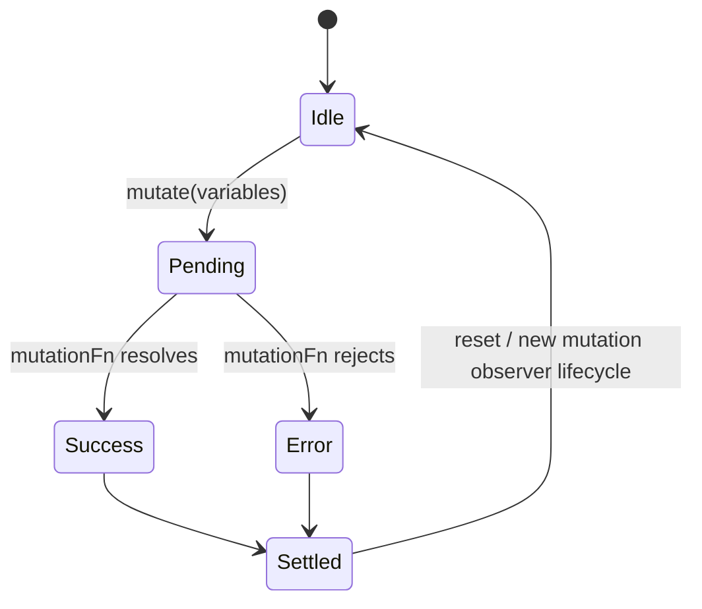
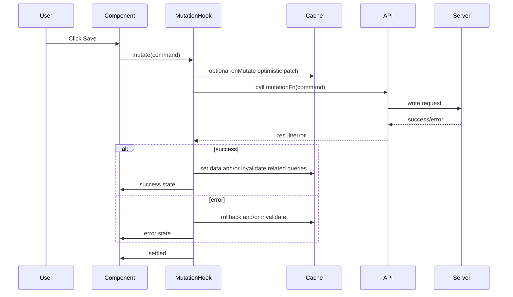
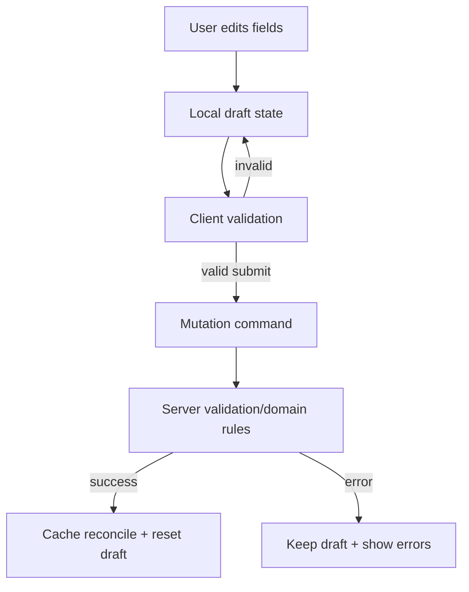

# Part 071 — Mutation Design

A mutation is not a fetch request with a different HTTP method.

A mutation is a **command**.

It asks the system of record to change something.

That means the frontend must answer harder questions than "how do I send this JSON?"

```txt
What changed?
Who owns the truth?
What local UI should change immediately?
What cache entries are now suspicious?
What happens if the server rejects the command?
What happens if the user clicks twice?
What happens if another mutation against the same entity is already pending?
What does success mean: request accepted, write committed, or projection updated?
```

If query design is about **reading remote truth safely**, mutation design is about **changing remote truth without corrupting the local illusion of consistency**.

TanStack Query gives you the primitives: `useMutation`, mutation lifecycle state, callbacks, invalidation, optimistic updates, mutation cache, retry, and mutation scopes.

Architecture still belongs to you.

---

## 1. Query vs Mutation

A query declares a dependency on async data.

A mutation performs an action.

| Concern | Query | Mutation |
|---|---|---|
| Primary semantic | Read | Write / command / side effect |
| Identity | `queryKey` addresses cached data | `mutationKey` identifies mutation defaults/state, not a durable data address |
| Lifecycle | fetch, stale, refetch, garbage collect | idle, pending, success, error, settled |
| Re-run model | Can refetch automatically | Runs only when commanded |
| Ownership | Server owns data | Server owns final write result |
| UI concern | loading/freshness/error | pending/disable/optimistic/rollback/toast/navigation |
| Cache effect | fills cache | invalidates, patches, removes, or reconciles cache |
| Risk | stale read | lost update, duplicate command, false success, inconsistent cache |

Core invariant:

```txt
A mutation is an intent to change server-owned state.
The UI may predict the outcome, but it must not forget who owns the final truth.
```

---

## 2. Mutation Lifecycle Mental Model

A mutation has a lifecycle.



In a real product, the lifecycle is bigger:



Important:

```txt
onMutate is before network.
onSuccess is after successful response.
onError is after rejected response.
onSettled is always after success or error.
```

Do not hide all domain behavior inside these callbacks. Use them to coordinate cache and UI lifecycle. Keep domain command semantics explicit.

---

## 3. Basic `useMutation` Shape

Minimal example:

```tsx
import { useMutation, useQueryClient } from '@tanstack/react-query';

type RenameProjectCommand = {
  projectId: string;
  name: string;
};

type Project = {
  id: string;
  name: string;
  updatedAt: string;
};

async function renameProject(command: RenameProjectCommand): Promise<Project> {
  const response = await fetch(`/api/projects/${command.projectId}/rename`, {
    method: 'POST',
    headers: { 'Content-Type': 'application/json' },
    body: JSON.stringify({ name: command.name }),
  });

  if (!response.ok) {
    throw new Error('Failed to rename project');
  }

  return response.json();
}

const projectKeys = {
  all: ['projects'] as const,
  detail: (projectId: string) => ['projects', 'detail', projectId] as const,
  lists: () => ['projects', 'list'] as const,
};

export function useRenameProject() {
  const queryClient = useQueryClient();

  return useMutation({
    mutationKey: ['projects', 'rename'],
    mutationFn: renameProject,
    onSuccess: (project) => {
      queryClient.setQueryData(projectKeys.detail(project.id), project);
      queryClient.invalidateQueries({ queryKey: projectKeys.lists() });
    },
  });
}
```

Usage:

```tsx
function RenameProjectForm({ projectId }: { projectId: string }) {
  const renameProject = useRenameProject();
  const [name, setName] = React.useState('');

  return (
    <form
      onSubmit={(event) => {
        event.preventDefault();
        renameProject.mutate({ projectId, name });
      }}
    >
      <input value={name} onChange={(event) => setName(event.target.value)} />
      <button disabled={renameProject.isPending}>Save</button>
      {renameProject.isError ? <p>{renameProject.error.message}</p> : null}
    </form>
  );
}
```

This is fine for a small feature.

Production mutation design asks what the mutation **means**.

---

## 4. Mutation Is a Command Boundary

A command should describe intent.

Bad:

```tsx
updateProject.mutate({
  id,
  payload: formState,
});
```

Better:

```tsx
renameProject.mutate({
  projectId,
  name: form.name.trim(),
});
```

Even better when the domain requires concurrency control:

```tsx
renameProject.mutate({
  projectId,
  name: form.name.trim(),
  expectedVersion: project.version,
  clientRequestId: crypto.randomUUID(),
});
```

A good mutation command has:

```txt
- a clear verb
- a domain target
- a minimal payload
- idempotency metadata when needed
- concurrency metadata when needed
- no raw component state leakage
- no arbitrary partial object unless the domain command is truly patch-like
```

### Command shape examples

| UI action | Weak command | Strong command |
|---|---|---|
| Save profile | `updateUser(form)` | `updateProfile({ userId, displayName, avatarId })` |
| Approve case | `updateStatus('approved')` | `approveCase({ caseId, reason, expectedVersion })` |
| Reorder item | `updateList(items)` | `moveItem({ listId, itemId, beforeItemId })` |
| Mark read | `updateNotification({ read: true })` | `markNotificationRead({ notificationId, seenAt })` |
| Delete record | `delete(id)` | `deleteProject({ projectId, expectedVersion })` |

A command should not expose implementation details of the current component tree.

---

## 5. Domain Mutation Hook Pattern

Do not scatter raw `useMutation` across views.

Create domain hooks.

```tsx
export function useApproveCase() {
  const queryClient = useQueryClient();

  return useMutation({
    mutationKey: ['cases', 'approve'],
    mutationFn: approveCase,
    onSuccess: (result, variables) => {
      queryClient.setQueryData(caseKeys.detail(variables.caseId), result.case);
      queryClient.invalidateQueries({ queryKey: caseKeys.timeline(variables.caseId) });
      queryClient.invalidateQueries({ queryKey: caseKeys.lists() });
    },
  });
}
```

The component sees a clean command port:

```tsx
function ApproveButton({ caseId, version }: Props) {
  const approveCase = useApproveCase();

  return (
    <button
      disabled={approveCase.isPending}
      onClick={() => {
        approveCase.mutate({
          caseId,
          expectedVersion: version,
          reason: 'Reviewed and valid',
        });
      }}
    >
      Approve
    </button>
  );
}
```

Benefits:

```txt
- view code expresses intent
- cache reconciliation is centralized
- invalidation policy is not duplicated
- optimistic update logic has one owner
- tests can focus on command semantics
- future backend shape changes do not rewrite every component
```

---

## 6. Mutation Lifecycle Callbacks as Coordination Points

The common callback structure:

```tsx
useMutation({
  mutationFn,
  onMutate: async (variables) => {
    // before network request
    // cancel conflicting reads
    // snapshot previous cache state
    // apply optimistic patch
    // return rollback context
  },
  onError: (error, variables, context) => {
    // rollback optimistic patch
    // surface recoverable error
  },
  onSuccess: (data, variables, context) => {
    // reconcile authoritative result
    // optionally set exact query data
  },
  onSettled: (data, error, variables, context) => {
    // invalidate related queries
    // cleanup temporary UI state
  },
});
```

Think of these as a protocol:

| Callback | Role | Usual cache operation |
|---|---|---|
| `onMutate` | prepare optimistic world | `cancelQueries`, `getQueryData`, `setQueryData` |
| `onError` | restore or compensate | rollback snapshot, invalidate suspicious data |
| `onSuccess` | reconcile with truth | `setQueryData` from server result |
| `onSettled` | force eventual consistency | `invalidateQueries` |

Do not use callbacks to hide core domain decisions. The domain command should already be explicit.

---

## 7. Invalidation vs Direct Cache Update

After a mutation succeeds, you have two broad strategies.

### Strategy A — invalidate

```tsx
onSuccess: () => {
  queryClient.invalidateQueries({ queryKey: projectKeys.lists() });
}
```

Use when:

```txt
- many queries may be affected
- server computes derived fields
- permissions may change
- list ordering/filter membership may change
- mutation response is incomplete
- correctness matters more than saving one request
```

### Strategy B — direct cache update

```tsx
onSuccess: (project) => {
  queryClient.setQueryData(projectKeys.detail(project.id), project);
}
```

Use when:

```txt
- mutation response contains authoritative entity
- affected cache address is exact
- update is cheap and deterministic
- you want instant detail-page consistency
```

### Strategy C — set detail, invalidate lists

This is often the best production default.

```tsx
onSuccess: (project) => {
  queryClient.setQueryData(projectKeys.detail(project.id), project);
  queryClient.invalidateQueries({ queryKey: projectKeys.lists() });
}
```

Why?

Detail cache is easy to update exactly.

List cache is often hard because filters, sort order, pagination, and membership rules may be server-defined.

---

## 8. Optimistic UI: Two Different Patterns

TanStack Query supports two practical optimistic approaches.

### Pattern 1 — UI-level optimism using mutation variables

This does not patch cache. It renders pending variables as a temporary row/state.

```tsx
function TodoList() {
  const todos = useTodos();
  const createTodo = useCreateTodo();

  return (
    <ul>
      {todos.data?.map((todo) => <li key={todo.id}>{todo.text}</li>)}

      {createTodo.isPending ? (
        <li style={{ opacity: 0.5 }}>{createTodo.variables.text}</li>
      ) : null}
    </ul>
  );
}
```

Use when:

```txt
- optimistic state is local to one component
- temporary row does not need to be globally visible
- rollback can be handled by simply not rendering pending variables
- you want lower cache complexity
```

### Pattern 2 — cache-level optimism with `onMutate`

```tsx
export function useCreateTodo() {
  const queryClient = useQueryClient();

  return useMutation({
    mutationKey: ['todos', 'create'],
    mutationFn: createTodo,
    onMutate: async (command) => {
      await queryClient.cancelQueries({ queryKey: todoKeys.list() });

      const previousTodos = queryClient.getQueryData<Todo[]>(todoKeys.list());
      const optimisticTodo: Todo = {
        id: `temp:${command.clientRequestId}`,
        text: command.text,
        status: 'pending',
      };

      queryClient.setQueryData<Todo[]>(todoKeys.list(), (old = []) => [
        optimisticTodo,
        ...old,
      ]);

      return { previousTodos, optimisticTodoId: optimisticTodo.id };
    },
    onError: (_error, _command, context) => {
      queryClient.setQueryData(todoKeys.list(), context?.previousTodos ?? []);
    },
    onSuccess: (createdTodo, _command, context) => {
      queryClient.setQueryData<Todo[]>(todoKeys.list(), (old = []) =>
        old.map((todo) =>
          todo.id === context?.optimisticTodoId ? createdTodo : todo,
        ),
      );
    },
    onSettled: () => {
      queryClient.invalidateQueries({ queryKey: todoKeys.list() });
    },
  });
}
```

Use when:

```txt
- multiple components should see optimistic state
- list/detail UI must feel instant
- the optimistic state participates in selection/counts/badges
- you can define reliable rollback/reconciliation
```

Optimistic cache update is powerful. It is also where many cache bugs are born.

---

## 9. Rollback Context Design

`onMutate` can return a context object.

Treat it like a rollback journal.

Bad:

```tsx
return { oldData };
```

Better:

```tsx
return {
  affectedKeys: [projectKeys.detail(projectId), projectKeys.lists()],
  previousProject,
  previousListPages,
  optimisticEntityId,
  startedAt: Date.now(),
};
```

A good rollback context records:

```txt
- which cache entries were touched
- previous snapshots required to restore
- temporary IDs inserted into collections
- request/client IDs for matching success result
- whether rollback is safe or only invalidation is safe
```

Sometimes rollback is wrong.

Example: user toggles a flag twice quickly.

```txt
Initial: false
Mutation A optimistic: true
Mutation B optimistic: false
A fails
Naive rollback to false might be okay by accident.
B succeeds
```

Now change the timing:

```txt
Initial: false
A optimistic: true
B optimistic: false
B succeeds
A fails later
Naive rollback from A restores false? okay.
```

Now use list reordering, partial updates, and server-derived fields. Snapshot rollback can easily erase newer optimistic changes.

When concurrent mutation interactions are complex, prefer:

```txt
- serial mutation scope
- entity-level command queue
- invalidation instead of manual rollback
- server version checks
- state machine workflow
```

---

## 10. Concurrent Mutations

By default, mutations can run in parallel.

That is usually good.

But parallel writes to the same logical resource can be dangerous.

Problem example:

```txt
PATCH project name -> "Alpha"
PATCH project name -> "Beta"
Responses arrive out of order.
The UI might show Alpha even though Beta was the last user intent.
```

### Defense 1 — latest intent tracking

```tsx
function useRenameProject() {
  const queryClient = useQueryClient();
  const latestRequestIdRef = React.useRef<string | null>(null);

  return useMutation({
    mutationFn: renameProject,
    onMutate: (command) => {
      latestRequestIdRef.current = command.clientRequestId;
    },
    onSuccess: (project, command) => {
      if (latestRequestIdRef.current !== command.clientRequestId) {
        return;
      }

      queryClient.setQueryData(projectKeys.detail(project.id), project);
    },
  });
}
```

This protects the UI cache from stale success responses, but it does not protect the server from lost updates.

### Defense 2 — version/ETag/precondition

```tsx
renameProject.mutate({
  projectId,
  name,
  expectedVersion: project.version,
});
```

The server rejects stale commands.

Frontend handles conflict.

### Defense 3 — mutation scope

When writes must be serialized client-side, use a mutation `scope`.

```tsx
useMutation({
  mutationFn: updateProject,
  scope: { id: `project:${projectId}` },
});
```

This queues mutations with the same scope id to run serially.

Use this when:

```txt
- operation order matters
- offline mutation queue must preserve order
- same entity cannot safely accept parallel writes
- duplicate command avoidance is more important than throughput
```

Do not use scope as a replacement for server-side concurrency control. It only serializes from this client session.

---

## 11. Idempotency and Duplicate Submit

Double submit is not a UX bug. It is a distributed systems bug with a button.

A robust mutation design handles duplicates at several layers.

### UI layer

```tsx
<button disabled={mutation.isPending}>Submit</button>
```

This reduces accidental duplicate intent.

It does not solve:

```txt
- double-click before disabled state renders
- retry after timeout
- browser refresh
- mobile network replay
- user opening two tabs
```

### Client command layer

```tsx
type CreateInvoiceCommand = {
  customerId: string;
  items: InvoiceItemInput[];
  clientRequestId: string;
};
```

### Server layer

The backend should treat `clientRequestId` / idempotency key as a deduplication key for non-idempotent commands.

Frontend rule:

```txt
If a mutation creates money, identity, workflow transition, or irreversible state,
include an idempotency key and expect the server to enforce it.
```

---

## 12. Error Taxonomy

Do not render every mutation error as "Something went wrong".

A mutation can fail for different reasons:

| Error type | Meaning | UI response |
|---|---|---|
| Validation | user input invalid | show field/form errors |
| Authorization | user cannot perform command | disable/hide or show permission error |
| Conflict | stale version / competing update | show conflict resolution path |
| Network | request not completed | retry / keep draft / show offline state |
| Server invariant | command rejected by domain rule | show domain message |
| Unknown | unexpected failure | generic error + log |

Model your API errors.

```tsx
type ApiError =
  | { type: 'validation'; fields: Record<string, string> }
  | { type: 'conflict'; currentVersion: number; message: string }
  | { type: 'forbidden'; message: string }
  | { type: 'network'; message: string }
  | { type: 'unknown'; message: string };
```

Then map errors deliberately.

```tsx
function SaveProjectError({ error }: { error: ApiError }) {
  switch (error.type) {
    case 'validation':
      return <FieldErrors fields={error.fields} />;
    case 'conflict':
      return <ConflictBanner message={error.message} />;
    case 'forbidden':
      return <PermissionBanner message={error.message} />;
    case 'network':
      return <RetryBanner message={error.message} />;
    case 'unknown':
      return <GenericError message={error.message} />;
  }
}
```

---

## 13. Retry Policy

Queries often retry by default because reading is usually safe.

Mutations are different.

A mutation retry can duplicate side effects if the server is not idempotent.

Use retry only when the command is safe to retry.

```tsx
useMutation({
  mutationFn: saveDraft,
  retry: 2,
  retryDelay: (attempt) => Math.min(1000 * 2 ** attempt, 30_000),
});
```

Retry is reasonable for:

```txt
- idempotent PUT-like updates
- save draft with idempotency key
- background sync queue
- marking read when duplicate success is harmless
```

Retry is dangerous for:

```txt
- payments
- irreversible workflow transitions
- one-time token consumption
- create operations without idempotency key
- external side effects such as sending email/SMS
```

Rule:

```txt
Do not configure mutation retry until you can explain idempotency.
```

---

## 14. Mutation Result Is Not Always the New Query Data

A mutation response can mean different things.

| Response shape | Meaning | Cache action |
|---|---|---|
| Full entity | authoritative detail snapshot | `setQueryData(detailKey, entity)` |
| Partial entity | incomplete projection | patch carefully or invalidate |
| Command receipt | accepted but not completed | show pending workflow and poll/refetch |
| Job ID | async processing started | navigate to job/status query |
| Empty `204` | server accepted write | invalidate related queries |
| Domain event | transition recorded | update timeline/event query or invalidate |

Do not assume successful mutation means all server projections are immediately updated.

Common enterprise case:

```txt
User approves case.
API returns 202 Accepted with commandId.
Workflow engine processes transition asynchronously.
Case detail updates later.
Timeline projection updates later.
List counters update later.
```

Correct UI architecture:

```txt
- show command accepted state
- invalidate or poll relevant queries
- optionally subscribe to workflow status
- avoid lying that final state is complete
```

---

## 15. Mutation + Navigation

Navigation after mutation is deceptively risky.

Bad:

```tsx
onSuccess: () => navigate('/projects');
```

Potential problems:

```txt
- destination list still stale
- user cannot see validation/concurrency warning
- success page assumes projection already updated
- navigation hides a failed background invalidation
```

Better:

```tsx
onSuccess: async (project) => {
  queryClient.setQueryData(projectKeys.detail(project.id), project);
  await queryClient.invalidateQueries({ queryKey: projectKeys.lists() });
  navigate(`/projects/${project.id}`);
}
```

Or for create workflows:

```tsx
onSuccess: (result) => {
  if (result.status === 'accepted') {
    navigate(`/imports/${result.jobId}`);
    return;
  }

  navigate(`/projects/${result.project.id}`);
}
```

Navigation is part of mutation orchestration. Treat it as a post-command transition.

---

## 16. Mutation + Form State

Form state has two phases:

```txt
Draft phase    : user edits local state
Command phase  : user submits intent to server
```

Do not mutate on every keystroke unless the product truly needs autosave.



A production form mutation hook should decide:

```txt
- should draft reset after success?
- should field errors map back into local form state?
- should server result replace current form values?
- can submit happen while another submit is pending?
- should dirty state survive network failure?
- should optimistic UI be field-level or cache-level?
```

Example:

```tsx
function ProjectSettingsForm({ project }: { project: Project }) {
  const [draft, setDraft] = React.useState(() => ({ name: project.name }));
  const save = useRenameProject();

  const dirty = draft.name !== project.name;

  return (
    <form
      onSubmit={(event) => {
        event.preventDefault();
        save.mutate(
          {
            projectId: project.id,
            name: draft.name,
            expectedVersion: project.version,
            clientRequestId: crypto.randomUUID(),
          },
          {
            onSuccess: (updatedProject) => {
              setDraft({ name: updatedProject.name });
            },
          },
        );
      }}
    >
      <input
        value={draft.name}
        onChange={(event) => setDraft({ name: event.target.value })}
      />
      <button disabled={!dirty || save.isPending}>Save</button>
    </form>
  );
}
```

Here local draft remains local. Server state stays in Query cache.

---

## 17. Mutation State Across Components

Sometimes one component triggers a mutation and another component must display pending state.

Examples:

```txt
- global upload progress
- background sync queue
- optimistic row inserted from modal into list
- notification badge for pending actions
```

TanStack Query provides mutation cache state access through `useMutationState`.

Example:

```tsx
import { useMutationState } from '@tanstack/react-query';

function PendingTodoCreates() {
  const pendingTodos = useMutationState({
    filters: {
      mutationKey: ['todos', 'create'],
      status: 'pending',
    },
    select: (mutation) => mutation.state.variables as CreateTodoCommand,
  });

  return pendingTodos.map((todo) => (
    <PendingTodoRow key={todo.clientRequestId} text={todo.text} />
  ));
}
```

Use this sparingly.

If many parts of the app need durable workflow state, you may need a workflow store or state machine, not mutation cache coupling.

---

## 18. Cache Reconciliation Recipes

### Create entity

```tsx
onSuccess: (created) => {
  queryClient.setQueryData(projectKeys.detail(created.id), created);
  queryClient.invalidateQueries({ queryKey: projectKeys.lists() });
}
```

### Update entity field

```tsx
onSuccess: (updated) => {
  queryClient.setQueryData(projectKeys.detail(updated.id), updated);
  queryClient.invalidateQueries({ queryKey: projectKeys.lists() });
}
```

### Delete entity

```tsx
onSuccess: (_result, variables) => {
  queryClient.removeQueries({ queryKey: projectKeys.detail(variables.projectId) });
  queryClient.invalidateQueries({ queryKey: projectKeys.lists() });
}
```

### Reorder list

Prefer invalidation unless order rules are fully client-known.

```tsx
onSuccess: () => {
  queryClient.invalidateQueries({ queryKey: boardKeys.columns(boardId) });
}
```

### Workflow transition

```tsx
onSuccess: (result, variables) => {
  queryClient.setQueryData(caseKeys.detail(variables.caseId), result.case);
  queryClient.invalidateQueries({ queryKey: caseKeys.timeline(variables.caseId) });
  queryClient.invalidateQueries({ queryKey: caseKeys.lists() });
}
```

### Permission-changing mutation

Invalidate broadly.

```tsx
onSuccess: () => {
  queryClient.invalidateQueries({ queryKey: ['permissions'] });
  queryClient.invalidateQueries({ queryKey: ['navigation'] });
  queryClient.invalidateQueries({ queryKey: ['cases'] });
}
```

Permission changes affect what can be seen, not only what is displayed.

---

## 19. Mutation Design for Regulated Workflows

For regulatory/case-management style systems, mutation design must preserve auditability.

Avoid generic commands:

```tsx
updateCase({ caseId, status: 'approved' });
```

Prefer explicit commands:

```tsx
approveCase({
  caseId,
  decisionReason,
  evidenceIds,
  expectedVersion,
  clientRequestId,
});
```

Why?

```txt
- audit trail should record business intent
- authorization can be checked per command
- validation differs per transition
- command idempotency matters
- conflict handling is explicit
- optimistic UI can represent "approval pending" not just status mutation
```

Mutation hooks become application service adapters:

```tsx
export function useApproveCase() {
  const queryClient = useQueryClient();

  return useMutation({
    mutationKey: ['cases', 'approve'],
    mutationFn: approveCase,
    retry: false,
    onSuccess: (result, command) => {
      queryClient.setQueryData(caseKeys.detail(command.caseId), result.case);
      queryClient.invalidateQueries({ queryKey: caseKeys.timeline(command.caseId) });
      queryClient.invalidateQueries({ queryKey: caseKeys.availableActions(command.caseId) });
      queryClient.invalidateQueries({ queryKey: caseKeys.lists() });
    },
  });
}
```

Notice the cache policy follows the domain effects:

```txt
Case detail changed.
Timeline changed.
Available actions changed.
Lists/counters may change.
```

---

## 20. Mutation Testing Strategy

Test mutation behavior at the boundary where bugs happen.

### Test command construction

```tsx
it('submits approve command with expected version', async () => {
  render(<ApproveButton caseId="case-1" version={7} />);

  await user.click(screen.getByRole('button', { name: /approve/i }));

  expect(api.approveCase).toHaveBeenCalledWith({
    caseId: 'case-1',
    expectedVersion: 7,
    reason: expect.any(String),
    clientRequestId: expect.any(String),
  });
});
```

### Test invalidation policy

```tsx
it('invalidates case timeline and lists after approval', async () => {
  const queryClient = createTestQueryClient();
  const invalidateSpy = vi.spyOn(queryClient, 'invalidateQueries');

  // render hook with QueryClientProvider
  // trigger mutation success

  expect(invalidateSpy).toHaveBeenCalledWith({ queryKey: caseKeys.timeline('case-1') });
  expect(invalidateSpy).toHaveBeenCalledWith({ queryKey: caseKeys.lists() });
});
```

### Test optimistic rollback

```tsx
it('rolls back optimistic todo when create fails', async () => {
  const queryClient = createTestQueryClient();
  queryClient.setQueryData(todoKeys.list(), []);

  server.rejectNextCreateTodo();

  // trigger mutation
  // assert temp todo appears
  // await failure
  // assert temp todo removed
});
```

Test matrix:

```txt
- success response reconciles exact cache
- error rolls back or invalidates
- duplicate click does not create duplicate command
- conflict error keeps draft and shows resolution path
- optimistic item has stable temp ID
- list invalidation covers filtered lists
- mutation does not retry unsafe commands
```

---

## 21. Mutation Failure Modes

### Failure Mode 1 — mutation used as query

Symptom:

```txt
Component calls mutation just to fetch data imperatively.
```

Fix:

```txt
Use query with proper key and enabled condition.
```

### Failure Mode 2 — invalidation too narrow

Symptom:

```txt
Detail page updated but sidebar count/list remains stale.
```

Fix:

```txt
Map mutation domain effects to query key families.
```

### Failure Mode 3 — direct cache patch too clever

Symptom:

```txt
Filtered/paginated list contains entity that no longer belongs.
```

Fix:

```txt
Patch exact detail; invalidate derived lists.
```

### Failure Mode 4 — optimistic update without rollback

Symptom:

```txt
User sees committed state after server rejects command.
```

Fix:

```txt
Use rollback context or invalidate after error.
```

### Failure Mode 5 — rollback erases newer update

Symptom:

```txt
Concurrent optimistic mutations overwrite each other.
```

Fix:

```txt
Use entity-scoped serial mutation, request IDs, server versioning, or invalidate instead of manual snapshot rollback.
```

### Failure Mode 6 — mutation response trusted too much

Symptom:

```txt
API returns partial payload, UI treats it as authoritative full entity.
```

Fix:

```txt
Only set exact cache when response shape matches that cache contract.
```

### Failure Mode 7 — duplicate command

Symptom:

```txt
Double click creates two invoices/orders/cases.
```

Fix:

```txt
Disable pending UI, use client request ID, require backend idempotency.
```

### Failure Mode 8 — unsafe retry

Symptom:

```txt
Network retry repeats irreversible operation.
```

Fix:

```txt
Disable retry unless idempotency is guaranteed.
```

### Failure Mode 9 — navigation hides failure

Symptom:

```txt
User navigates away before cache reconciliation/error display.
```

Fix:

```txt
Await critical invalidation or navigate to command status route.
```

---

## 22. Production Checklist

Before merging a mutation hook, answer:

```txt
Command
- What business intent does this mutation represent?
- Is the payload minimal and typed?
- Does it include idempotency/concurrency metadata when needed?

Lifecycle
- What happens while pending?
- What happens on validation error?
- What happens on conflict error?
- What happens on network failure?
- Is retry safe?

Cache
- Which detail queries are exact and can be updated directly?
- Which list/projection queries must be invalidated?
- Does permission/navigation/action availability need invalidation?
- Does optimistic update have rollback/reconciliation?

Concurrency
- Can two commands run at the same time?
- Does order matter?
- Do we need mutation scope?
- Does the server enforce version/idempotency?

UX
- Is duplicate submit prevented?
- Is draft preserved on failure?
- Is success shown only when true?
- Does navigation wait for required consistency?

Testing
- Are success/error/rollback/invalidation paths tested?
- Are duplicate/parallel cases tested if relevant?
```

---

## 23. Mental Model Summary

```txt
Query = remote read dependency.
Mutation = remote write command.
```

A good mutation design does not only call the server.

It coordinates:

```txt
- command intent
- pending UI
- validation/conflict/network error handling
- optimistic prediction
- cache reconciliation
- invalidation
- duplicate prevention
- concurrency policy
- navigation
- observability
```

The strongest frontend engineers treat mutations as the point where UI architecture meets distributed systems.

That is why mutation design deserves architecture-level attention.

---

## References

- TanStack Query React Docs — Mutations
- TanStack Query React Docs — useMutation
- TanStack Query React Docs — Optimistic Updates
- TanStack Query React Docs — Invalidations from Mutations
- TanStack Query React Docs — Query Invalidation
