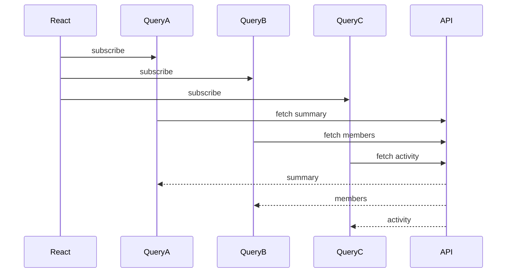
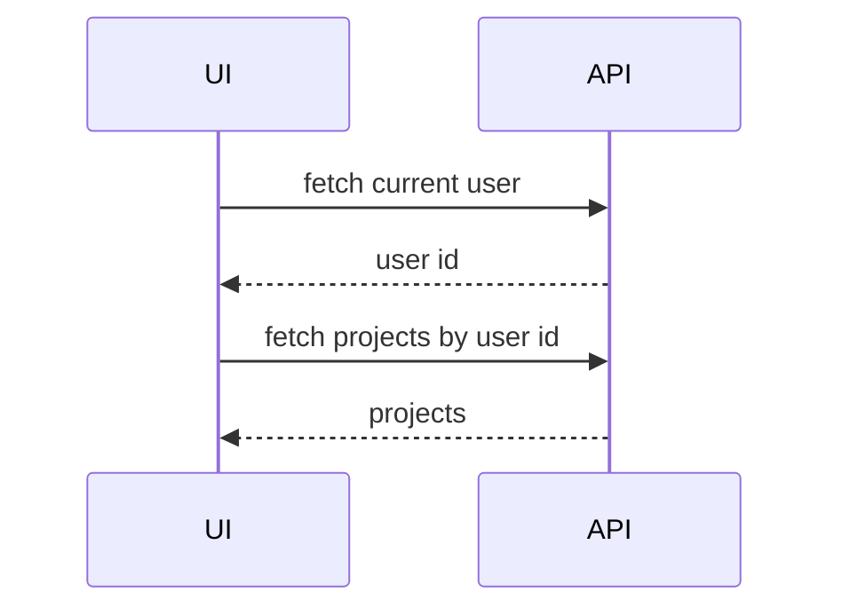
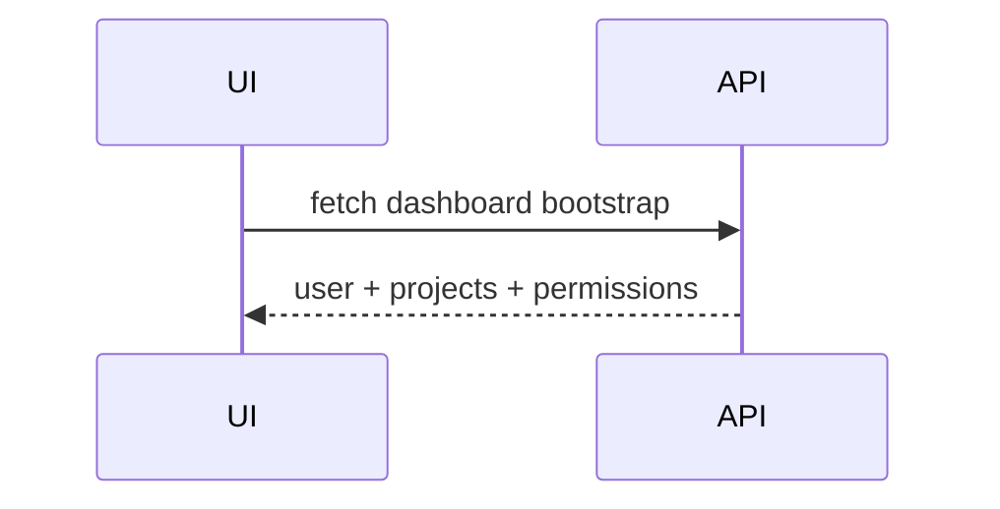
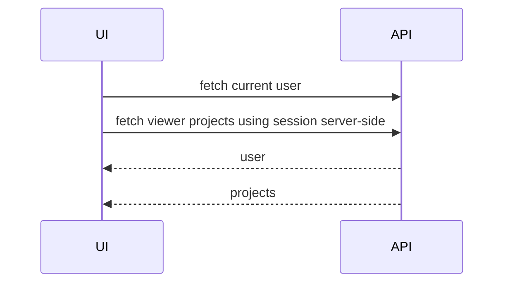

# Part 072 — Dependent, Parallel, and Infinite Queries

A real screen rarely depends on one server request.

A dashboard may need:

```txt
- current user
- permissions
- project summary
- issue list
- unread notification count
- feature flags
- audit timeline
```

A search page may need:

```txt
- query params
- filter metadata
- search result page
- saved views
- user preferences
- infinite pagination
```

A case detail page may need:

```txt
- case detail
- available actions
- timeline
- attachments
- related entities
- comments
```

The problem is not "how do I call multiple `useQuery`s?"

The problem is **async orchestration**.

```txt
Which requests can run now?
Which requests must wait?
Which requests should never exist until input is valid?
Which requests should be parallelized?
Which requests should be collapsed into one backend endpoint?
Which requests represent pagination, not separate resources?
```

TanStack Query gives you tools:

```txt
- normal `useQuery` side by side for static parallel queries
- `enabled` for dependent / conditional queries
- `useQueries` for dynamic parallel query sets
- `useInfiniteQuery` for cursor/page based lists
- query keys for cache identity
- cancellation and observer lifecycle under the hood
```

Architecture comes from choosing the right shape.

---

## 1. Query Orchestration Taxonomy

| Pattern | Meaning | Tool |
|---|---|---|
| Independent static queries | fixed number of unrelated requests | multiple `useQuery` calls |
| Dependent query | request B needs data from request A | `enabled` and derived key variables |
| Conditional query | request only valid when input exists | `enabled`, validated parameters |
| Dynamic parallel queries | number of requests changes | `useQueries` |
| Aggregated query | backend endpoint returns combined data | one `useQuery` |
| Infinite query | one logical list loaded by pages/cursors | `useInfiniteQuery` |
| Paginated query | page index/cursor is part of key | `useQuery` with page param |
| Prefetch orchestration | load before render/navigation | `prefetchQuery`, route loader, hover/load intent |

Core invariant:

```txt
A query should exist only when its key fully and validly describes the remote data it reads.
```

If the key is incomplete, the query is unsafe.

If the query waits unnecessarily, the UI is slow.

---

## 2. Static Parallel Queries

When the number of queries is fixed, just call hooks side by side.

```tsx
function ProjectDashboard() {
  const summary = useProjectSummaryQuery();
  const members = useProjectMembersQuery();
  const activity = useProjectActivityQuery();

  if (summary.isPending || members.isPending || activity.isPending) {
    return <DashboardSkeleton />;
  }

  if (summary.isError || members.isError || activity.isError) {
    return <DashboardError />;
  }

  return (
    <Dashboard
      summary={summary.data}
      members={members.data}
      activity={activity.data}
    />
  );
}
```

These queries can run concurrently because none depends on another.



Avoid this mistake:

```tsx
function Dashboard() {
  const summary = useQuery(...);

  React.useEffect(() => {
    // fetch members after summary manually
  }, [summary.data]);
}
```

That reintroduces effect-based orchestration and hides cache identity.

---

## 3. Loading State Composition

Multiple queries create multiple lifecycle states.

Do not flatten them too early.

Bad:

```tsx
const loading = summary.isLoading || members.isLoading || activity.isLoading;
const error = summary.error || members.error || activity.error;
```

This loses information.

Better:

```tsx
const dashboardState = getDashboardState({ summary, members, activity });
```

```tsx
type DashboardState =
  | { type: 'loading-initial' }
  | { type: 'partial'; summary: Summary; members?: Member[]; activity?: Activity[] }
  | { type: 'ready'; summary: Summary; members: Member[]; activity: Activity[] }
  | { type: 'error'; area: 'summary' | 'members' | 'activity'; error: Error };
```

Design question:

```txt
Does this screen require all data before rendering,
or can it render independent panels as each query resolves?
```

For independent panels, colocate boundaries:

```tsx
function Dashboard() {
  return (
    <DashboardLayout>
      <SummaryPanel />
      <MembersPanel />
      <ActivityPanel />
    </DashboardLayout>
  );
}
```

Each panel owns its query state.

This improves resilience and avoids one failed widget taking down the whole screen.

---

## 4. Dependent Queries

A dependent query waits for another query or derived value.

Example:

```tsx
function UserProjects() {
  const user = useQuery({
    queryKey: ['user', 'me'],
    queryFn: fetchCurrentUser,
  });

  const projects = useQuery({
    queryKey: ['projects', 'by-user', user.data?.id],
    queryFn: () => fetchProjectsByUser(user.data!.id),
    enabled: Boolean(user.data?.id),
  });

  // render...
}
```

The `enabled` flag prevents the second query from running until the user ID is known.

Important:

```txt
The key and queryFn must agree.
If queryFn reads user.data.id, the key must include user.data.id.
```

Better:

```tsx
function useProjectsByUser(userId: string | undefined) {
  return useQuery({
    queryKey: ['projects', 'by-user', userId],
    queryFn: () => fetchProjectsByUser(userId!),
    enabled: userId !== undefined,
  });
}
```

Component:

```tsx
function UserProjects() {
  const user = useCurrentUser();
  const projects = useProjectsByUser(user.data?.id);

  // render orchestration
}
```

---

## 5. The Waterfall Cost

Dependent queries are sometimes necessary.

They are also request waterfalls.



If both requests take 300ms, the screen waits roughly 600ms plus overhead.

Parallel alternative:



Or:



Rule:

```txt
Use dependent queries when dependency is real.
Do not manufacture dependency because the frontend endpoint shape is inconvenient.
```

If query B only needs current user because the API lacks a session-aware endpoint, the backend might be forcing a client waterfall.

---

## 6. Conditional Queries

A conditional query runs only when its inputs are valid.

Example: search.

```tsx
const search = useQuery({
  queryKey: ['cases', 'search', { q, filters }],
  queryFn: () => searchCases({ q, filters }),
  enabled: q.trim().length >= 3,
});
```

But do not mix raw invalid state into query keys carelessly.

Better:

```tsx
function parseSearchInput(raw: string): SearchInput | null {
  const q = raw.trim();

  if (q.length < 3) {
    return null;
  }

  return { q };
}

function useCaseSearch(rawInput: string) {
  const input = React.useMemo(() => parseSearchInput(rawInput), [rawInput]);

  return useQuery({
    queryKey: ['cases', 'search', input],
    queryFn: () => searchCases(input!),
    enabled: input !== null,
  });
}
```

The query key represents validated input.

---

## 7. Dependent Query Failure Modes

### Failure Mode 1 — queryFn reads value not in key

```tsx
const project = useQuery({
  queryKey: ['project'],
  queryFn: () => fetchProject(projectId),
});
```

Bug:

```txt
projectId changes but key does not.
Cache identity lies.
```

Fix:

```tsx
const project = useQuery({
  queryKey: ['project', projectId],
  queryFn: () => fetchProject(projectId),
  enabled: projectId !== undefined,
});
```

### Failure Mode 2 — enabled hides invalid key shape

```tsx
queryKey: ['project', projectId],
enabled: Boolean(projectId)
```

If `projectId` can be `''`, `null`, `undefined`, or malformed, validate it deliberately.

### Failure Mode 3 — unnecessary serial dependency

```txt
fetch user -> fetch permissions -> fetch navigation -> fetch dashboard
```

Ask whether the backend can expose a bootstrap endpoint or whether some reads can run from session context.

### Failure Mode 4 — dependent query stuck forever

A parent query may fail, making child query never run.

Do not show a child spinner forever. Render the dependency state.

```tsx
if (user.isError) return <CannotLoadUser error={user.error} />;
if (user.isPending) return <UserSkeleton />;
```

---

## 8. Dynamic Parallel Queries with `useQueries`

When the number of queries changes, do not call hooks inside loops.

Bad:

```tsx
for (const id of projectIds) {
  const project = useQuery(...); // invalid hooks pattern
}
```

Use `useQueries`.

```tsx
import { useQueries } from '@tanstack/react-query';

function ProjectCards({ projectIds }: { projectIds: string[] }) {
  const projectQueries = useQueries({
    queries: projectIds.map((projectId) => ({
      queryKey: ['projects', 'detail', projectId],
      queryFn: () => fetchProject(projectId),
      staleTime: 60_000,
    })),
  });

  return (
    <div>
      {projectQueries.map((query, index) => {
        const projectId = projectIds[index];

        if (query.isPending) return <ProjectCardSkeleton key={projectId} />;
        if (query.isError) return <ProjectCardError key={projectId} />;

        return <ProjectCard key={projectId} project={query.data} />;
      })}
    </div>
  );
}
```

`useQueries` returns results in the same order as the input queries.

Make sure input order is stable and keys are stable.

---

## 9. `useQueries` Combine Pattern

For complex screens, combine query results into a single read model.

```tsx
const result = useQueries({
  queries: projectIds.map((projectId) => ({
    queryKey: projectKeys.detail(projectId),
    queryFn: () => fetchProject(projectId),
  })),
  combine: (results) => ({
    data: results
      .map((result) => result.data)
      .filter((project): project is Project => project !== undefined),
    pending: results.some((result) => result.isPending),
    error: results.find((result) => result.error)?.error ?? null,
  }),
});
```

Use `combine` when the component needs aggregate state.

Avoid it when each card/panel can manage its own state independently.

---

## 10. Dynamic Parallel Query Failure Modes

### Failure Mode 1 — too many queries

```txt
Rendering 500 cards triggers 500 detail requests.
```

Fix options:

```txt
- backend batch endpoint
- list endpoint includes enough data
- virtualize visible rows
- prefetch on hover/viewport
- use staleTime to reduce refetch churn
```

### Failure Mode 2 — duplicate IDs

If `projectIds` contains duplicates, `useQueries` can produce repeated queries for same key.

Normalize first:

```tsx
const uniqueProjectIds = React.useMemo(
  () => Array.from(new Set(projectIds)),
  [projectIds],
);
```

### Failure Mode 3 — unstable query option objects causing churn

Use query option factories for consistency:

```tsx
const projectQueries = useQueries({
  queries: projectIds.map((id) => projectQueryOptions.detail(id)),
});
```

### Failure Mode 4 — dynamic parallel should have been aggregated

If the UI always needs all details together, use one batch endpoint.

```tsx
useQuery({
  queryKey: ['projects', 'batch', { ids: sortedIds }],
  queryFn: () => fetchProjectsByIds(sortedIds),
});
```

---

## 11. Paginated Query vs Infinite Query

Pagination has two common shapes.

### Page-based pagination

User explicitly moves page 1 → 2 → 3.

```tsx
const projects = useQuery({
  queryKey: ['projects', 'list', { page, pageSize, filters }],
  queryFn: () => fetchProjects({ page, pageSize, filters }),
});
```

Page is part of the key.

This is good when:

```txt
- URL contains page number
- user jumps between pages
- table pagination is explicit
- each page is a distinct view state
```

### Infinite query

User loads more within one logical list.

```tsx
const projects = useInfiniteQuery({
  queryKey: ['projects', 'infinite', { filters }],
  queryFn: ({ pageParam }) => fetchProjectsPage({ cursor: pageParam, filters }),
  initialPageParam: null as string | null,
  getNextPageParam: (lastPage) => lastPage.nextCursor,
});
```

Use infinite query when:

```txt
- UI appends pages into one scroll/list experience
- next page depends on cursor from previous page
- user does not treat page number as primary navigation
- pages are part of one logical cache value
```

---

## 12. Infinite Query Data Shape

`useInfiniteQuery` stores data like this:

```tsx
type InfiniteData<TPage, TPageParam> = {
  pages: TPage[];
  pageParams: TPageParam[];
};
```

Example response:

```tsx
type ProjectPage = {
  items: Project[];
  nextCursor: string | null;
};
```

Hook:

```tsx
function useInfiniteProjects(filters: ProjectFilters) {
  return useInfiniteQuery({
    queryKey: ['projects', 'infinite', filters],
    queryFn: ({ pageParam }) =>
      fetchProjectsPage({
        filters,
        cursor: pageParam,
      }),
    initialPageParam: null as string | null,
    getNextPageParam: (lastPage) => lastPage.nextCursor,
  });
}
```

Flattening for render:

```tsx
const projects = React.useMemo(
  () => query.data?.pages.flatMap((page) => page.items) ?? [],
  [query.data],
);
```

Render:

```tsx
<button
  disabled={!query.hasNextPage || query.isFetchingNextPage}
  onClick={() => query.fetchNextPage()}
>
  {query.isFetchingNextPage ? 'Loading more...' : 'Load more'}
</button>
```

---

## 13. Cursor vs Offset

Offset pagination:

```txt
GET /projects?page=3&pageSize=20
```

Cursor pagination:

```txt
GET /projects?cursor=eyJpZCI6IjEyMyJ9
```

| Concern | Offset | Cursor |
|---|---|---|
| Jump to page | easy | hard |
| Stable under inserts/deletes | weaker | stronger |
| Infinite scroll | okay for small/simple lists | usually better |
| Backend complexity | lower | higher |
| Query key | includes page | includes filter; cursor lives in pageParam |

For infinite query, cursor usually belongs to `pageParam`, not the top-level query key.

The query key describes the **logical list**.

The page param describes the **next segment of that list**.

---

## 14. Infinite Query Key Design

Bad:

```tsx
useInfiniteQuery({
  queryKey: ['projects', cursor],
  queryFn: ...,
});
```

This creates a separate query per cursor.

Better:

```tsx
useInfiniteQuery({
  queryKey: ['projects', 'infinite', { filters, sort }],
  queryFn: ({ pageParam }) => fetchProjectsPage({ cursor: pageParam, filters, sort }),
  initialPageParam: null,
  getNextPageParam: (lastPage) => lastPage.nextCursor,
});
```

Invariant:

```txt
Filters/sort/search define the list identity.
Cursor/pageParam defines traversal inside that list.
```

When filters change, the query key changes and a new logical list begins.

---

## 15. Infinite Query Cancellation and Double Fetch

Avoid triggering multiple next-page fetches.

```tsx
function LoadMoreButton({ query }: { query: UseInfiniteQueryResult<ProjectPage> }) {
  return (
    <button
      disabled={!query.hasNextPage || query.isFetchingNextPage}
      onClick={() => {
        if (!query.hasNextPage || query.isFetchingNextPage) return;
        query.fetchNextPage();
      }}
    >
      Load more
    </button>
  );
}
```

For intersection observer:

```tsx
React.useEffect(() => {
  if (!inView) return;
  if (!query.hasNextPage) return;
  if (query.isFetchingNextPage) return;

  query.fetchNextPage();
}, [inView, query.hasNextPage, query.isFetchingNextPage, query.fetchNextPage]);
```

Do not call `fetchNextPage` during render.

---

## 16. Infinite Query Memory Management

Infinite queries can grow without bound.

Questions:

```txt
How many pages can the user load?
How heavy is each row?
Do images/files attach large payloads?
Does the user need all previous pages in memory?
Does navigation preserve scroll/list state?
```

Options:

```txt
- use virtualization for DOM size
- use `maxPages` when only a window of pages is needed
- keep row payloads lean
- split heavy detail data into detail queries
- reset query on major filter changes
- avoid storing UI-only per-row state inside server page data
```

Example with limited pages:

```tsx
useInfiniteQuery({
  queryKey: ['feed', { topic }],
  queryFn: ({ pageParam }) => fetchFeed({ topic, cursor: pageParam }),
  initialPageParam: null,
  getNextPageParam: (lastPage) => lastPage.nextCursor,
  maxPages: 5,
});
```

Use `maxPages` only if older pages can be discarded without breaking UX.

---

## 17. Infinite Query + Selection State

Do not store row selection inside page data.

Bad:

```tsx
queryClient.setQueryData(feedKey, (data) => ({
  ...data,
  pages: data.pages.map((page) => ({
    ...page,
    items: page.items.map((item) => ({ ...item, selected: false })),
  })),
}));
```

Selection is client/UI state.

Keep it separate:

```tsx
const [selectedIds, setSelectedIds] = React.useState(() => new Set<string>());

const toggle = (id: string) => {
  setSelectedIds((current) => {
    const next = new Set(current);
    if (next.has(id)) next.delete(id);
    else next.add(id);
    return next;
  });
};
```

Server page data stays server data.

UI state stays UI state.

---

## 18. Infinite Query + Mutation

Mutation against items in infinite lists is tricky because the item may appear in multiple pages or no longer belong after update.

### Detail update strategy

If mutation response returns full item:

```tsx
onSuccess: (updatedItem) => {
  queryClient.setQueryData(itemKeys.detail(updatedItem.id), updatedItem);
  queryClient.invalidateQueries({ queryKey: itemKeys.infiniteLists() });
}
```

This is safe.

### Patch every page strategy

Use only when membership/order rules are stable.

```tsx
queryClient.setQueryData<InfiniteData<ProjectPage>>(
  projectKeys.infinite(filters),
  (old) => {
    if (!old) return old;

    return {
      ...old,
      pages: old.pages.map((page) => ({
        ...page,
        items: page.items.map((item) =>
          item.id === updated.id ? updated : item,
        ),
      })),
    };
  },
);
```

### Delete item strategy

```tsx
queryClient.setQueryData<InfiniteData<ProjectPage>>(
  projectKeys.infinite(filters),
  (old) => {
    if (!old) return old;

    return {
      ...old,
      pages: old.pages.map((page) => ({
        ...page,
        items: page.items.filter((item) => item.id !== deletedId),
      })),
    };
  },
);
```

But after delete, page sizes and `nextCursor` may become inconsistent.

For correctness, invalidate.

```tsx
queryClient.invalidateQueries({ queryKey: projectKeys.infiniteLists() });
```

---

## 19. Query Orchestration and Component Boundaries

Do not put all queries in the top page component by default.

Bad page orchestrator:

```tsx
function CasePage() {
  const caseQuery = useCase();
  const timelineQuery = useTimeline();
  const commentsQuery = useComments();
  const attachmentsQuery = useAttachments();
  const actionsQuery = useAvailableActions();

  if (anyLoading) return <FullPageSkeleton />;
  if (anyError) return <FullPageError />;

  return <HugeCasePage ... />;
}
```

Better:

```tsx
function CasePage() {
  return (
    <CaseLayout>
      <CaseHeader />
      <AvailableActions />
      <CaseTimeline />
      <CaseComments />
      <CaseAttachments />
    </CaseLayout>
  );
}
```

Each section owns its query unless the page truly needs atomic orchestration.

Use page-level orchestration when:

```txt
- data must be consistent as one read model
- route loader prefetches all critical data
- one failure should block the whole page
- permissions/gates must be resolved before rendering children
```

Use component-level query ownership when:

```txt
- panels are independent
- partial rendering improves UX
- failures can be localized
- data has different freshness/lifecycle settings
```

---

## 20. Backend Shape Matters

Frontend query orchestration often reveals backend API design problems.

### Bad API shape

```txt
GET /me
GET /users/:id/org
GET /orgs/:id/projects
GET /projects/:id/summary
```

The dashboard has a forced waterfall.

### Better API shape

```txt
GET /dashboard/bootstrap
```

or:

```txt
GET /viewer/projects
GET /dashboard/summary
GET /notifications/count
```

Each endpoint uses session identity server-side and can run in parallel.

Decision rule:

```txt
If the frontend must serially fetch IDs just to call the next endpoint,
consider whether the backend should expose a use-case-oriented read model.
```

Do not over-aggregate either.

A monster bootstrap endpoint can create:

```txt
- overfetching
- poor cache granularity
- unclear invalidation
- slow critical path
- tight coupling between independent panels
```

Design read models around screen needs and cache lifecycle.

---

## 21. Orchestration Decision Matrix

| Situation | Recommended shape |
|---|---|
| Screen has three independent widgets | three colocated queries |
| Query B needs ID from Query A | dependent query with `enabled` |
| Query B can use session identity server-side | avoid dependency; fetch in parallel |
| Need variable number of entity details | `useQueries` or batch endpoint |
| Need hundreds of entity details | batch endpoint or list endpoint projection |
| Need load-more feed | `useInfiniteQuery` |
| Need page jump table | paginated `useQuery` with `page` in key |
| Need all data atomically | aggregate endpoint or page-level orchestrator |
| Need route preload | route loader/prefetch with same query keys |
| Need expensive search | URL/draft debounce + conditional query |

---

## 22. Production Example: Case Detail Page

Query keys:

```tsx
const caseKeys = {
  all: ['cases'] as const,
  detail: (caseId: string) => ['cases', 'detail', caseId] as const,
  timeline: (caseId: string) => ['cases', 'timeline', caseId] as const,
  actions: (caseId: string) => ['cases', 'actions', caseId] as const,
  commentsInfinite: (caseId: string) => ['cases', 'comments', 'infinite', caseId] as const,
};
```

Hooks:

```tsx
function useCaseDetail(caseId: string | undefined) {
  return useQuery({
    queryKey: caseKeys.detail(caseId!),
    queryFn: () => fetchCaseDetail(caseId!),
    enabled: Boolean(caseId),
  });
}

function useCaseAvailableActions(caseId: string | undefined) {
  return useQuery({
    queryKey: caseKeys.actions(caseId!),
    queryFn: () => fetchAvailableActions(caseId!),
    enabled: Boolean(caseId),
    staleTime: 15_000,
  });
}

function useCaseComments(caseId: string | undefined) {
  return useInfiniteQuery({
    queryKey: caseKeys.commentsInfinite(caseId!),
    queryFn: ({ pageParam }) => fetchCaseComments({ caseId: caseId!, cursor: pageParam }),
    enabled: Boolean(caseId),
    initialPageParam: null as string | null,
    getNextPageParam: (lastPage) => lastPage.nextCursor,
  });
}
```

Component structure:

```tsx
function CaseDetailRoute() {
  const { caseId } = useParams();

  return (
    <CasePageShell caseId={caseId!}>
      <CaseHeader caseId={caseId!} />
      <CaseActionBar caseId={caseId!} />
      <CaseTimeline caseId={caseId!} />
      <CaseComments caseId={caseId!} />
    </CasePageShell>
  );
}
```

The route passes identity. Each section owns its read lifecycle.

After a transition mutation:

```tsx
onSuccess: (_result, command) => {
  queryClient.invalidateQueries({ queryKey: caseKeys.detail(command.caseId) });
  queryClient.invalidateQueries({ queryKey: caseKeys.actions(command.caseId) });
  queryClient.invalidateQueries({ queryKey: caseKeys.timeline(command.caseId) });
  queryClient.invalidateQueries({ queryKey: caseKeys.all });
}
```

Mutation effects map to query families.

---

## 23. Testing Query Orchestration

Test the shape, not implementation noise.

### Dependent query does not run before dependency

```tsx
it('does not fetch projects before user id exists', async () => {
  server.delayCurrentUser();

  render(<UserProjects />);

  expect(api.fetchProjectsByUser).not.toHaveBeenCalled();
});
```

### Query key changes when input changes

```tsx
it('fetches a new search result when canonical filters change', async () => {
  const { rerender } = render(<CaseSearch q="fraud" status="open" />);

  await screen.findByText(/result/i);

  rerender(<CaseSearch q="fraud" status="closed" />);

  expect(api.searchCases).toHaveBeenCalledWith({ q: 'fraud', status: 'closed' });
});
```

### Infinite query calls next page with cursor

```tsx
it('fetches next page using cursor from previous response', async () => {
  render(<ProjectFeed />);

  await screen.findByText('Project A');
  await user.click(screen.getByRole('button', { name: /load more/i }));

  expect(api.fetchProjectsPage).toHaveBeenCalledWith(
    expect.objectContaining({ cursor: 'cursor-after-page-1' }),
  );
});
```

### Duplicate next-page fetch prevented

```tsx
it('does not trigger next page twice while already fetching', async () => {
  render(<ProjectFeed />);

  const button = await screen.findByRole('button', { name: /load more/i });

  await user.dblClick(button);

  expect(api.fetchProjectsPage).toHaveBeenCalledTimes(2); // initial + one next page
});
```

---

## 24. Failure Modes

### Failure Mode 1 — accidental waterfall

Symptom:

```txt
A screen waits for A, then B, then C, even though B and C could run immediately.
```

Fix:

```txt
Run independent queries in parallel or redesign backend read model.
```

### Failure Mode 2 — query with invalid variables

Symptom:

```txt
Request fires with undefined/null/malformed ID.
```

Fix:

```txt
Validate input and use `enabled`.
```

### Failure Mode 3 — enabled query with lying key

Symptom:

```txt
Query waits correctly but cache key omits changing variable.
```

Fix:

```txt
Every variable used by queryFn must be represented in the query key.
```

### Failure Mode 4 — infinite cursor in query key

Symptom:

```txt
Each page becomes a separate query; infinite list cannot reconcile pages.
```

Fix:

```txt
Put filters/sort in key; put cursor in pageParam.
```

### Failure Mode 5 — infinite list stores UI state

Symptom:

```txt
Selection/edit state disappears or corrupts after refetch.
```

Fix:

```txt
Keep UI state separate from server page data.
```

### Failure Mode 6 — useQueries explosion

Symptom:

```txt
Rendering a list causes hundreds of detail requests.
```

Fix:

```txt
Use batch endpoint, richer list projection, virtualization, or prefetch on intent.
```

### Failure Mode 7 — one widget failure blocks whole page

Symptom:

```txt
Notification count failure hides the entire dashboard.
```

Fix:

```txt
Localize query boundaries unless atomic read model is required.
```

### Failure Mode 8 — filter change appends incompatible infinite pages

Symptom:

```txt
Search result contains rows from old filter.
```

Fix:

```txt
Include canonical filters in infinite query key.
```

### Failure Mode 9 — load-more race

Symptom:

```txt
Double intersection/click requests same cursor twice.
```

Fix:

```txt
Gate with hasNextPage and isFetchingNextPage.
```

---

## 25. Production Checklist

Before shipping query orchestration, answer:

```txt
Identity
- Does every query key include all queryFn variables?
- Are invalid/empty variables blocked before query runs?
- Are filters canonicalized?

Dependency
- Is this dependency real or accidental?
- Can backend remove client waterfall?
- Can independent panels load separately?

Parallelism
- Are fixed independent queries side by side?
- Are dynamic query sets using useQueries or a batch endpoint?
- Is query count bounded?

Infinite/Pagination
- Is this explicit pagination or infinite loading?
- Is cursor in pageParam, not query key?
- Is hasNextPage respected?
- Is double fetch prevented?
- Is memory bounded or virtualized?

Mutation interaction
- Which infinite/list/detail queries are invalidated after mutation?
- Are direct page patches safe under filtering/sorting?
- Is UI state separate from server page data?

UX
- Can page partially render?
- Are errors localized?
- Is loading state meaningful instead of one global spinner?
```

---

## 26. Mental Model Summary

Query orchestration is not about making many requests.

It is about giving each remote read the correct lifecycle.

```txt
Independent reads should run in parallel.
Dependent reads should wait only for real dependencies.
Dynamic reads should use useQueries or batch endpoints.
Infinite lists should treat pages as segments of one logical list.
Query keys must encode identity; page params encode traversal.
```

Bad query orchestration feels like React is slow.

Good query orchestration makes the UI feel inevitable:

```txt
Critical data arrives first.
Independent panels do not block each other.
Search does not fire invalid requests.
Infinite scroll does not duplicate pages.
Mutations update exactly what they should.
Backend read models match frontend use cases.
```

This is where frontend architecture and API architecture meet.

---

## References

- TanStack Query React Docs — Dependent Queries
- TanStack Query React Docs — Parallel Queries
- TanStack Query React Docs — useQueries
- TanStack Query React Docs — Infinite Queries
- TanStack Query React Docs — useInfiniteQuery
- TanStack Query React Docs — Query Keys
