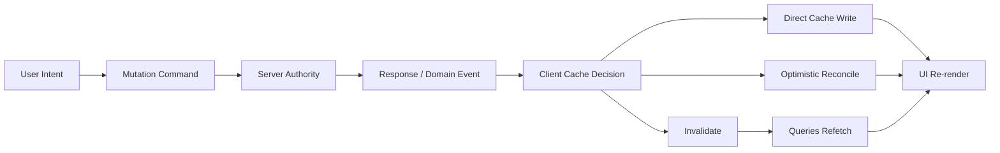
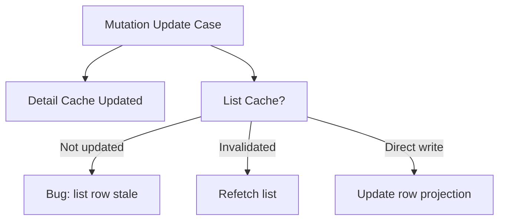
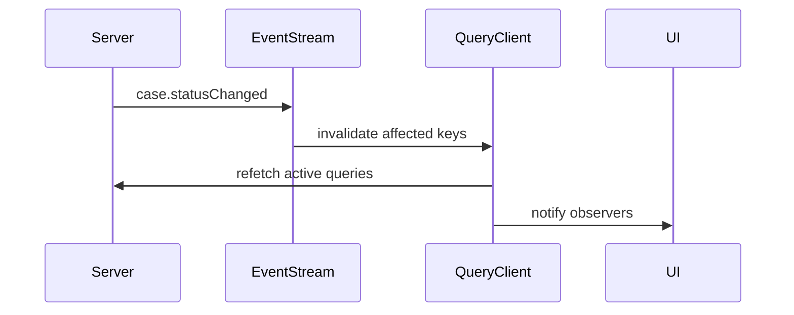

# Part 073 — Cache Invalidation Strategy

Cache invalidation bukan teknik kecil setelah mutation. Ia adalah desain konsistensi antara UI, cache, server, user action, dan waktu.

Kalau query key adalah alamat cache, invalidation adalah bahasa untuk mengatakan:

> “Data di alamat ini mungkin sudah tidak valid terhadap fakta server terbaru.”

Di React application besar, bug cache jarang muncul sebagai exception. Ia muncul sebagai UI yang tampak benar tetapi sebenarnya menampilkan fakta lama, list yang tidak sinkron dengan detail, badge count yang salah, optimistic row yang hilang, atau user yang melihat data tenant lain karena query key terlalu kasar.

Part ini membahas invalidation sebagai sistem, bukan sebagai potongan kode `queryClient.invalidateQueries(...)`.

---

## 1. Core Mental Model

Server state punya otoritas di server. Client cache hanyalah snapshot yang diberi lifecycle.



TanStack Query menyediakan mekanisme invalidation untuk menandai query sebagai stale dan, bila query sedang aktif, dapat memicu refetch. Tetapi library tidak tahu domain impact dari mutation. Itu tanggung jawab application architecture.

Contoh:

```ts
await approveCase(caseId)

queryClient.invalidateQueries({
  queryKey: ['cases'],
})
```

Kode itu berjalan, tetapi belum tentu benar. Pertanyaan sebenarnya:

```txt
Mutation approveCase berdampak ke apa?
- detail case?
- list case?
- queue count?
- dashboard metric?
- SLA badge?
- audit trail?
- task inbox?
- permission/capability snapshot?
```

Jika invalidation terlalu sempit, UI stale. Jika terlalu luas, app boros network dan terasa lambat.

---

## 2. Vocabulary yang Harus Jelas

| Istilah | Arti | Kesalahan Umum |
|---|---|---|
| Fresh | Cache dianggap masih valid berdasarkan policy | Menganggap fresh berarti pasti benar |
| Stale | Cache boleh dipakai tetapi perlu disegarkan | Menganggap stale berarti unusable |
| Invalidate | Menandai query sebagai stale | Menganggap invalidate selalu langsung refetch semua query |
| Refetch | Ambil ulang data dari server | Refetch terlalu sering untuk menutup desain key yang buruk |
| `staleTime` | Durasi data dianggap fresh | Dipakai sebagai pengganti domain invalidation |
| `gcTime` | Durasi cache tidak aktif bertahan sebelum dibuang | Disamakan dengan freshness |
| Direct cache write | Update cache manual dengan response mutation | Memalsukan logic server terlalu banyak |
| Optimistic update | Update UI sebelum server selesai | Tidak punya rollback/reconcile strategy |
| Query key | Address schema untuk cache | Key tidak memasukkan semua parameter yang memengaruhi data |

---

## 3. Salah Kaprah: “Invalidate Semua Setelah Mutation”

Pendekatan paling aman secara kebenaran kasar:

```ts
queryClient.invalidateQueries()
```

Tetapi ini bukan strategi. Ini cache flush.

Akibatnya:

1. network berlebihan,
2. loading state menyebar,
3. interaksi terasa tidak stabil,
4. cache kehilangan manfaat,
5. bug domain disembunyikan,
6. user experience bergantung pada latency.

Strategi yang lebih baik bukan selalu “lebih sempit”. Strategi yang benar adalah **sesuai impact graph mutation**.

---

## 4. Mutation Impact Map

Sebelum menulis invalidation, tulis impact map.

```ts
type MutationImpact = {
  mutation: 'case.approve'
  entity: { type: 'case'; id: string }
  affectedQueries: Array<{
    key: readonly unknown[]
    reason: string
    mode: 'invalidate' | 'write' | 'remove' | 'optimistic'
  }>
}
```

Contoh domain regulatory case management:

```ts
const approveCaseImpact = (caseId: string, tenantId: string): MutationImpact => ({
  mutation: 'case.approve',
  entity: { type: 'case', id: caseId },
  affectedQueries: [
    {
      key: caseKeys.detail(tenantId, caseId),
      reason: 'status and transitions changed',
      mode: 'invalidate',
    },
    {
      key: caseKeys.lists(tenantId),
      reason: 'case may move between queues',
      mode: 'invalidate',
    },
    {
      key: taskKeys.inbox(tenantId),
      reason: 'approval task may be completed',
      mode: 'invalidate',
    },
    {
      key: auditKeys.caseEvents(tenantId, caseId),
      reason: 'new approval event appended',
      mode: 'invalidate',
    },
    {
      key: dashboardKeys.caseMetrics(tenantId),
      reason: 'aggregate status counts changed',
      mode: 'invalidate',
    },
  ],
})
```

Dengan impact map, invalidation bukan scattered callback. Ia menjadi bagian dari domain contract.

---

## 5. Query Key Hierarchy sebagai Fondasi Invalidation

Invalidation yang baik dimulai dari key yang baik.

```ts
export const caseKeys = {
  all: (tenantId: string) => ['tenant', tenantId, 'cases'] as const,

  lists: (tenantId: string) =>
    [...caseKeys.all(tenantId), 'list'] as const,

  list: (
    tenantId: string,
    filters: CaseListFilters,
    page: PageCursor,
  ) =>
    [...caseKeys.lists(tenantId), canonicalizeCaseFilters(filters), page] as const,

  details: (tenantId: string) =>
    [...caseKeys.all(tenantId), 'detail'] as const,

  detail: (tenantId: string, caseId: string) =>
    [...caseKeys.details(tenantId), caseId] as const,

  transitions: (tenantId: string, caseId: string) =>
    [...caseKeys.detail(tenantId, caseId), 'transitions'] as const,
}
```

Desain ini membuat beberapa level invalidation mungkin:

```ts
// Semua case tenant ini.
queryClient.invalidateQueries({
  queryKey: caseKeys.all(tenantId),
})

// Semua list case, tetapi bukan detail.
queryClient.invalidateQueries({
  queryKey: caseKeys.lists(tenantId),
})

// Detail satu case.
queryClient.invalidateQueries({
  queryKey: caseKeys.detail(tenantId, caseId),
})
```

Query key hierarchy harus mengikuti domain hierarchy, bukan mengikuti folder structure UI.

Buruk:

```ts
['CasePage', filters]
['DashboardWidget', filters]
['SidebarCount']
```

Lebih baik:

```ts
['tenant', tenantId, 'cases', 'list', filters]
['tenant', tenantId, 'cases', 'metrics']
['tenant', tenantId, 'tasks', 'inbox-count']
```

UI boleh berubah. Domain data shape lebih stabil.

---

## 6. Invalidation Scope

Scope invalidation adalah keputusan biaya vs konsistensi.

| Scope | Contoh | Kapan Dipakai | Risiko |
|---|---|---|---|
| Entity detail | `case.detail(id)` | Mutation hanya mengubah satu entity | List/agregat tetap stale |
| Entity family | `case.details()` | Banyak detail mungkin berubah | Refetch detail yang tidak perlu |
| List family | `case.lists()` | Item bisa pindah list/filter/page | Boros jika banyak list aktif |
| Aggregate | `case.metrics()` | Count/dashboard berubah | Sering terlupakan |
| Tenant scope | `tenant(id)` | Bulk import, role change, major workflow change | Mahal |
| Global | semua query | Logout, tenant switch, critical consistency reset | Menghapus manfaat cache |

Default production rule:

```txt
Start from entity + known list family + known aggregate.
Jangan invalidate global kecuali boundary otoritas berubah.
```

Boundary otoritas berubah pada:

1. login/logout,
2. tenant switch,
3. role/permission switch,
4. environment switch,
5. feature flag set yang mengubah shape data,
6. impersonation,
7. schema version mismatch.

---

## 7. Empat Cara Menjaga Cache Setelah Mutation

### 7.1 Invalidate and Refetch

Paling sederhana dan paling aman saat server melakukan logic kompleks.

```ts
const approveCase = useMutation({
  mutationFn: api.approveCase,
  onSuccess: (_data, variables) => {
    queryClient.invalidateQueries({
      queryKey: caseKeys.detail(variables.tenantId, variables.caseId),
    })

    queryClient.invalidateQueries({
      queryKey: caseKeys.lists(variables.tenantId),
    })

    queryClient.invalidateQueries({
      queryKey: dashboardKeys.caseMetrics(variables.tenantId),
    })
  },
})
```

Gunakan saat:

1. server logic sulit direplikasi,
2. mutation mengubah banyak derived fields,
3. permission atau workflow transition berubah,
4. audit/event stream berubah,
5. response mutation tidak mengandung read model lengkap.

### 7.2 Direct Cache Write

Pakai response mutation untuk update cache.

```ts
const updateCaseTitle = useMutation({
  mutationFn: api.updateCaseTitle,
  onSuccess: (updatedCase, variables) => {
    queryClient.setQueryData(
      caseKeys.detail(variables.tenantId, variables.caseId),
      updatedCase,
    )
  },
})
```

Gunakan saat:

1. mutation response adalah read model yang lengkap,
2. impact hanya pada entity detail,
3. server tidak menambahkan derived data yang tidak diketahui client,
4. list item projection bisa diperbarui aman.

Untuk list projection:

```ts
queryClient.setQueriesData(
  { queryKey: caseKeys.lists(tenantId) },
  (old: CaseListPage | undefined) => {
    if (!old) return old

    return {
      ...old,
      items: old.items.map((item) =>
        item.id === updatedCase.id
          ? { ...item, title: updatedCase.title, updatedAt: updatedCase.updatedAt }
          : item,
      ),
    }
  },
)
```

Direct write terlihat cepat tetapi harus hati-hati. Jika mutation mengubah filter membership, item mungkin harus keluar dari list, bukan hanya diubah.

### 7.3 Optimistic Update + Rollback

Pakai saat latency compensation penting.

```ts
const renameCase = useMutation({
  mutationFn: api.renameCase,

  onMutate: async (variables) => {
    await queryClient.cancelQueries({
      queryKey: caseKeys.detail(variables.tenantId, variables.caseId),
    })

    const previous = queryClient.getQueryData<CaseDetail>(
      caseKeys.detail(variables.tenantId, variables.caseId),
    )

    queryClient.setQueryData<CaseDetail>(
      caseKeys.detail(variables.tenantId, variables.caseId),
      (old) =>
        old
          ? {
              ...old,
              title: variables.title,
              optimistic: true,
            }
          : old,
    )

    return { previous }
  },

  onError: (_error, variables, context) => {
    queryClient.setQueryData(
      caseKeys.detail(variables.tenantId, variables.caseId),
      context?.previous,
    )
  },

  onSettled: (_data, _error, variables) => {
    queryClient.invalidateQueries({
      queryKey: caseKeys.detail(variables.tenantId, variables.caseId),
    })
  },
})
```

Gunakan saat:

1. user expectation butuh immediate feedback,
2. command idempotent atau mudah direkonsiliasi,
3. conflict handling jelas,
4. rollback aman,
5. server response tetap menjadi final reconciliation.

Jangan optimistic untuk workflow yang hasilnya kompleks dan tergantung policy server, kecuali UI secara eksplisit menunjukkan pending/provisional state.

### 7.4 Remove/Reset Cache

Pakai ketika cache tidak boleh hidup lagi.

```ts
queryClient.removeQueries({
  queryKey: tenantKeys.all(previousTenantId),
})
```

Gunakan saat:

1. logout,
2. tenant switch,
3. permission downgrade,
4. private data harus dibersihkan,
5. schema version berubah,
6. impersonation selesai.

Invalidate tidak cukup untuk data sensitif. Invalidate masih menyisakan snapshot lama sampai refetch/GC. Untuk privacy boundary, remove/reset.

---

## 8. Invalidation dari Mutation: Pattern Helper

Jangan menulis invalidation manual di setiap component. Buat domain helper.

```ts
function invalidateCaseApproval(
  queryClient: QueryClient,
  input: {
    tenantId: string
    caseId: string
  },
) {
  const { tenantId, caseId } = input

  return Promise.all([
    queryClient.invalidateQueries({
      queryKey: caseKeys.detail(tenantId, caseId),
    }),
    queryClient.invalidateQueries({
      queryKey: caseKeys.lists(tenantId),
    }),
    queryClient.invalidateQueries({
      queryKey: taskKeys.inbox(tenantId),
    }),
    queryClient.invalidateQueries({
      queryKey: dashboardKeys.caseMetrics(tenantId),
    }),
    queryClient.invalidateQueries({
      queryKey: auditKeys.caseEvents(tenantId, caseId),
    }),
  ])
}
```

Mutation hook:

```ts
export function useApproveCase() {
  const queryClient = useQueryClient()

  return useMutation({
    mutationFn: api.approveCase,
    onSuccess: (_result, variables) => {
      return invalidateCaseApproval(queryClient, variables)
    },
  })
}
```

Keuntungannya:

1. invalidation terkonsolidasi,
2. mudah dites,
3. impact map bisa direview,
4. component tidak tahu detail cache topology,
5. domain mutation hook menjadi command boundary.

---

## 9. Invalidation dan `staleTime`

`staleTime` bukan pengganti invalidation. Ia adalah policy untuk freshness pasif.

```ts
useQuery({
  queryKey: caseKeys.detail(tenantId, caseId),
  queryFn: () => api.getCase(tenantId, caseId),
  staleTime: 30_000,
})
```

Maknanya:

```txt
Selama 30 detik, cache dianggap fresh untuk trigger otomatis seperti mount/focus.
```

Jika user melakukan mutation yang jelas mengubah data, invalidation tetap diperlukan.

```ts
onSuccess: () => {
  queryClient.invalidateQueries({
    queryKey: caseKeys.detail(tenantId, caseId),
  })
}
```

Rule praktis:

| Data | `staleTime` | Invalidation |
|---|---:|---|
| Static reference data | menit/jam | jarang, saat admin update |
| Case detail aktif | pendek/sedang | setelah mutation/domain event |
| Dashboard metric | pendek | setelah mutation besar atau event |
| Permission snapshot | pendek/sedang | setelah role/context change |
| Audit trail | bisa panjang | invalidate append query setelah event |
| Search results | tergantung filter | invalidate list family saat membership berubah |

---

## 10. Query Key Cardinality dan Memory

Key yang terlalu detail membuat cache meledak.

```ts
['cases', filters, sort, page, searchText, columnWidths, selectedRows]
```

Masalah:

1. `columnWidths` bukan server data parameter,
2. `selectedRows` bukan query parameter,
3. `searchText` draft bisa membuat query untuk setiap keypress,
4. object filter tidak canonical,
5. page cursor bisa membuat cache besar.

Pisahkan:

```ts
const committedFilters = useCommittedSearchParams()

useQuery({
  queryKey: caseKeys.list(tenantId, committedFilters, pageCursor),
  queryFn: () => api.searchCases(committedFilters, pageCursor),
})
```

Draft UI state:

```ts
const [draftFilters, setDraftFilters] = useState(initialFilters)
```

Committed server-state key:

```ts
const [searchParams, setSearchParams] = useSearchParams()
```

Query key hanya memuat parameter yang memengaruhi server response.

---

## 11. List vs Detail Consistency

Problem klasik: detail berhasil update, list masih stale.



Pilih salah satu:

### Option A — Invalidate List Family

```ts
queryClient.invalidateQueries({
  queryKey: caseKeys.lists(tenantId),
})
```

Aman jika membership/filter/page bisa berubah.

### Option B — Direct Write List Projection

```ts
queryClient.setQueriesData(
  { queryKey: caseKeys.lists(tenantId) },
  updateCaseRowProjection(updatedCase),
)
```

Aman jika perubahan hanya field yang tampil di row dan tidak memengaruhi membership.

### Option C — Hybrid

```ts
queryClient.setQueryData(
  caseKeys.detail(tenantId, caseId),
  updatedCase,
)

queryClient.invalidateQueries({
  queryKey: caseKeys.lists(tenantId),
})
```

Responsif pada detail, aman pada list.

Default untuk enterprise workflow:

```txt
Direct-write detail.
Invalidate list family.
Invalidate aggregate count.
```

---

## 12. Filter Membership Problem

Mutation bisa mengubah apakah item masih cocok dengan filter.

Contoh:

```txt
Current list filter: status = "PENDING_APPROVAL"
Mutation: approveCase(caseId)
New status: "APPROVED"
```

Jika direct write row:

```ts
{ id: caseId, status: 'APPROVED' }
```

Row masih muncul di list PENDING_APPROVAL. Itu salah.

Untuk membership-changing mutation, pilih:

```ts
queryClient.invalidateQueries({
  queryKey: caseKeys.lists(tenantId),
})
```

Atau jika ingin immediate UI:

```ts
queryClient.setQueriesData(
  { queryKey: caseKeys.lists(tenantId) },
  removeCaseFromFilteredPages(caseId),
)

queryClient.invalidateQueries({
  queryKey: caseKeys.lists(tenantId),
})
```

Optimistic removal + eventual refetch sering lebih aman daripada mencoba mereplikasi seluruh filter engine di client.

---

## 13. Aggregate and Badge Invalidation

Badge adalah sumber bug cache yang diremehkan.

```txt
Inbox: 12
Pending approval: 7
Overdue SLA: 3
```

Setelah mutation:

```txt
Case approved
Task completed
SLA bucket changed
```

Jika hanya detail/list invalidated, badge tetap salah.

Buat query key khusus aggregate:

```ts
export const metricKeys = {
  all: (tenantId: string) => ['tenant', tenantId, 'metrics'] as const,
  caseQueueCounts: (tenantId: string) =>
    [...metricKeys.all(tenantId), 'case-queue-counts'] as const,
  taskInboxCount: (tenantId: string) =>
    [...metricKeys.all(tenantId), 'task-inbox-count'] as const,
}
```

Mutation invalidation:

```ts
queryClient.invalidateQueries({
  queryKey: metricKeys.caseQueueCounts(tenantId),
})

queryClient.invalidateQueries({
  queryKey: metricKeys.taskInboxCount(tenantId),
})
```

Jika aggregate mahal, backend dapat mengirim domain event:

```ts
type ServerEvent =
  | { type: 'case.approved'; tenantId: string; caseId: string }
  | { type: 'task.completed'; tenantId: string; taskId: string }
```

Client event handler:

```ts
function handleServerEvent(event: ServerEvent) {
  switch (event.type) {
    case 'case.approved':
      queryClient.invalidateQueries({
        queryKey: caseKeys.detail(event.tenantId, event.caseId),
      })
      queryClient.invalidateQueries({
        queryKey: caseKeys.lists(event.tenantId),
      })
      queryClient.invalidateQueries({
        queryKey: metricKeys.caseQueueCounts(event.tenantId),
      })
      break
  }
}
```

---

## 14. Event-Driven Invalidation

Polling dan refetch on focus tidak cukup untuk collaborative atau workflow-heavy app.

Event-driven invalidation cocok ketika:

1. data bisa berubah oleh user lain,
2. background process mengubah status,
3. approval workflow otomatis,
4. SLA timer memindahkan case bucket,
5. integration callback memperbarui status,
6. websocket/SSE tersedia.



Handler harus idempotent.

```ts
function invalidateFromDomainEvent(event: DomainEvent) {
  if (event.tenantId !== currentTenantId) return

  switch (event.type) {
    case 'case.statusChanged':
      queryClient.invalidateQueries({
        queryKey: caseKeys.detail(event.tenantId, event.caseId),
      })
      queryClient.invalidateQueries({
        queryKey: caseKeys.lists(event.tenantId),
      })
      queryClient.invalidateQueries({
        queryKey: metricKeys.caseQueueCounts(event.tenantId),
      })
      return

    case 'permission.changed':
      queryClient.removeQueries({
        queryKey: tenantKeys.all(event.tenantId),
      })
      return
  }
}
```

Permission change sebaiknya remove/reset, bukan sekadar invalidate, karena data lama mungkin tidak boleh terlihat lagi.

---

## 15. Invalidation vs Direct Write Decision Matrix

| Pertanyaan | Jika Ya | Strategy |
|---|---|---|
| Response mutation berisi read model lengkap? | Ya | Direct write detail |
| Mutation mengubah filter membership? | Ya | Invalidate list family |
| Mutation mengubah aggregate/count? | Ya | Invalidate aggregate key |
| Server menjalankan workflow/policy kompleks? | Ya | Invalidate/refetch |
| User butuh immediate feedback? | Ya | Optimistic + rollback + refetch |
| Data sensitif tidak boleh tersisa? | Ya | Remove/reset query |
| Mutation hanya update field kecil? | Ya | Direct write projection |
| Banyak user bisa mengubah data yang sama? | Ya | Event-driven invalidation + refetch |
| Mutation bisa gagal karena conflict? | Ya | Optimistic dengan conflict UI atau hindari optimistic |

---

## 16. Cache Invalidation Layer Placement

Jangan letakkan invalidation di button component.

Buruk:

```tsx
function ApproveButton({ caseId }: Props) {
  const queryClient = useQueryClient()

  const mutation = useMutation({
    mutationFn: approveCase,
    onSuccess: () => {
      queryClient.invalidateQueries({ queryKey: ['cases'] })
      queryClient.invalidateQueries({ queryKey: ['dashboard'] })
    },
  })

  return <button onClick={() => mutation.mutate({ caseId })}>Approve</button>
}
```

Lebih baik:

```ts
export function useApproveCaseCommand() {
  const queryClient = useQueryClient()

  return useMutation({
    mutationFn: caseApi.approve,
    onSuccess: (_result, variables) => {
      return invalidateCaseApproval(queryClient, variables)
    },
  })
}
```

Component:

```tsx
function ApproveButton({ caseId, tenantId }: Props) {
  const approveCase = useApproveCaseCommand()

  return (
    <button
      disabled={approveCase.isPending}
      onClick={() => approveCase.mutate({ tenantId, caseId })}
    >
      Approve
    </button>
  )
}
```

Component mengirim intent. Domain hook mengelola command. Query invalidation layer tahu cache topology.

---

## 17. Optimistic Update Failure Modes

Optimistic update paling sering gagal karena client mereplikasi logic server secara naif.

### 17.1 Concurrent Optimistic Updates

User menekan beberapa action cepat:

```txt
assign owner A
change priority HIGH
approve case
```

Masing-masing mutation mengubah entity yang sama. Rollback mutation pertama bisa menimpa perubahan mutation kedua.

Mitigasi:

1. mutation scope/serialization untuk entity yang sama,
2. operation log lokal,
3. invalidate on settled,
4. response reconciliation,
5. jangan rollback seluruh object jika hanya satu field gagal,
6. idempotency key di server.

### 17.2 Server-Derived Fields

Client optimistic update:

```ts
status: 'APPROVED'
```

Server response sebenarnya:

```ts
status: 'ESCALATED_FOR_REVIEW'
reason: 'approval-limit-exceeded'
```

Mitigasi:

1. optimistic state diberi label `pending`,
2. jangan menyembunyikan final server reconciliation,
3. refetch detail/list setelah mutation,
4. tampilkan conflict/resolution jika hasil server berbeda signifikan.

### 17.3 Filter Membership Drift

Optimistic update mengubah status tetapi tidak menghapus item dari current filtered list.

Mitigasi:

1. remove dari filtered list sementara,
2. invalidate list family,
3. gunakan server response final untuk reconcile.

---

## 18. Query Invalidation Testing

Invalidation bisa dites tanpa render UI lengkap.

```ts
it('invalidates case detail, case lists, task inbox, and metrics after approval', async () => {
  const queryClient = new QueryClient()

  const invalidateSpy = vi.spyOn(queryClient, 'invalidateQueries')

  await invalidateCaseApproval(queryClient, {
    tenantId: 'tenant-1',
    caseId: 'case-1',
  })

  expect(invalidateSpy).toHaveBeenCalledWith({
    queryKey: caseKeys.detail('tenant-1', 'case-1'),
  })

  expect(invalidateSpy).toHaveBeenCalledWith({
    queryKey: caseKeys.lists('tenant-1'),
  })

  expect(invalidateSpy).toHaveBeenCalledWith({
    queryKey: taskKeys.inbox('tenant-1'),
  })

  expect(invalidateSpy).toHaveBeenCalledWith({
    queryKey: dashboardKeys.caseMetrics('tenant-1'),
  })
})
```

Tes yang lebih kuat: seed cache, jalankan mutation success handler, pastikan query state berubah sesuai expectation.

```ts
queryClient.setQueryData(caseKeys.detail('t1', 'c1'), oldCase)

await invalidateCaseApproval(queryClient, {
  tenantId: 't1',
  caseId: 'c1',
})

expect(queryClient.getQueryState(caseKeys.detail('t1', 'c1'))?.isInvalidated)
  .toBe(true)
```

---

## 19. Observability untuk Cache

Production debugging butuh visibility:

```txt
mutation.name
mutation.variables
affected.queryKeys
strategy: invalidate | write | optimistic | remove
duration
refetch result
error
rollback executed?
```

Contoh instrumentation:

```ts
function logCacheInvalidation(event: {
  mutation: string
  queryKey: readonly unknown[]
  reason: string
}) {
  analytics.track('cache.invalidated', {
    mutation: event.mutation,
    queryKey: JSON.stringify(event.queryKey),
    reason: event.reason,
  })
}
```

Jangan log sensitive data mentah di query key. Query key bisa berisi filter, search, tenant, atau identifier.

---

## 20. Case Study: Approval Workflow

### Domain

```txt
Regulatory case approval
- A case can be approved, rejected, escalated.
- Approval changes status, task inbox, audit trail, queue counts.
- Case may disappear from "Pending Approval" list.
- Permission/capability may change after approval.
```

### Query Keys

```ts
const keys = {
  caseDetail: caseKeys.detail(tenantId, caseId),
  pendingList: caseKeys.list(tenantId, { status: 'PENDING_APPROVAL' }, page),
  approvedList: caseKeys.list(tenantId, { status: 'APPROVED' }, page),
  taskInbox: taskKeys.inbox(tenantId),
  auditTrail: auditKeys.caseEvents(tenantId, caseId),
  metrics: metricKeys.caseQueueCounts(tenantId),
}
```

### Strategy

```txt
1. Show pending state on approve button.
2. Optimistically disable action surface.
3. Do not optimistically mark final approval if policy server can reroute.
4. On success:
   - direct-write detail if response contains full detail
   - invalidate list family
   - invalidate task inbox
   - invalidate audit trail
   - invalidate metrics
5. On conflict:
   - show conflict banner
   - refetch detail
   - refetch transition/capability query
```

### Implementation

```ts
export function useApproveCase() {
  const queryClient = useQueryClient()

  return useMutation({
    mutationFn: caseApi.approve,

    onMutate: async ({ tenantId, caseId }) => {
      await queryClient.cancelQueries({
        queryKey: caseKeys.detail(tenantId, caseId),
      })

      const previousDetail = queryClient.getQueryData<CaseDetail>(
        caseKeys.detail(tenantId, caseId),
      )

      queryClient.setQueryData<CaseDetail>(
        caseKeys.detail(tenantId, caseId),
        (old) =>
          old
            ? {
                ...old,
                commandState: {
                  type: 'approval-pending',
                },
              }
            : old,
      )

      return { previousDetail }
    },

    onError: (_error, variables, context) => {
      queryClient.setQueryData(
        caseKeys.detail(variables.tenantId, variables.caseId),
        context?.previousDetail,
      )
    },

    onSuccess: (approvedCase, variables) => {
      queryClient.setQueryData(
        caseKeys.detail(variables.tenantId, variables.caseId),
        approvedCase,
      )

      return invalidateCaseApproval(queryClient, variables)
    },

    onSettled: (_data, _error, variables) => {
      queryClient.invalidateQueries({
        queryKey: caseKeys.transitions(variables.tenantId, variables.caseId),
      })
    },
  })
}
```

---

## 21. Failure Modes

### 21.1 Query Key Too Broad

```ts
['cases']
```

Bug:

```txt
tenant A and tenant B share cache scope.
filters collide.
detail/list invalidation too expensive.
```

Fix:

```ts
['tenant', tenantId, 'cases', ...]
```

### 21.2 Query Key Too Narrow

```ts
['case', caseId]
```

Bug:

```txt
case detail changed but list/count/audit remain stale.
```

Fix: build mutation impact map.

### 21.3 Invalidation Hidden in Components

Bug:

```txt
same mutation has different invalidation depending on button/page.
```

Fix: domain command hook.

### 21.4 Direct Write Lies

Bug:

```txt
client updates status but server computes different final status.
```

Fix: direct write only when response is authoritative; otherwise invalidate/refetch.

### 21.5 Optimistic Rollback Overwrites Newer State

Bug:

```txt
mutation A rollback restores old object after mutation B succeeded.
```

Fix: field-level rollback, mutation serialization, invalidate on settle.

### 21.6 Aggregate Forgotten

Bug:

```txt
row correct, badge/count/dashboard wrong.
```

Fix: include aggregate keys in impact map.

### 21.7 Permission Boundary Leaks Data

Bug:

```txt
user loses permission but old cache remains visible.
```

Fix: remove/reset queries on authority boundary change.

---

## 22. Production Checklist

Before shipping a mutation, answer:

```txt
[ ] What entity does this mutation affect?
[ ] Can it change list membership?
[ ] Can it change aggregate counts?
[ ] Can it change permissions/capabilities?
[ ] Does mutation response contain full read model?
[ ] Is optimistic UI safe?
[ ] Is rollback defined?
[ ] Are concurrent mutations possible?
[ ] Are query keys tenant/user scoped?
[ ] Does invalidation live in domain hook, not component?
[ ] Are sensitive caches removed on logout/tenant switch?
[ ] Are invalidation decisions tested?
[ ] Is there observability for mutation + affected keys?
```

---

## 23. Exercises

### Exercise 1 — Build Query Key Factory

For a `violations` module, design keys for:

1. all violations by tenant,
2. list by filter/page,
3. detail by violation id,
4. evidence attachments,
5. audit events,
6. dashboard counts.

Then define which keys are affected by:

1. create violation,
2. update severity,
3. close violation,
4. upload evidence,
5. delete evidence.

### Exercise 2 — Refactor Scattered Invalidation

Given:

```ts
queryClient.invalidateQueries({ queryKey: ['cases'] })
queryClient.invalidateQueries({ queryKey: ['dashboard'] })
```

Move this into:

1. query key factories,
2. `invalidateCaseApproval`,
3. `useApproveCaseCommand`,
4. tests.

### Exercise 3 — Detect Unsafe Optimistic Update

A mutation changes case status from `OPEN` to `CLOSED`. The backend may instead return `NEEDS_REVIEW` if a policy rule fails.

Design:

1. optimistic UI strategy,
2. rollback strategy,
3. final reconciliation strategy,
4. conflict user experience.

---

## 24. Key Takeaways

Cache invalidation is not a random side effect. It is a consistency contract.

The mature mental model:

```txt
Mutation changes domain facts.
Domain facts map to query keys.
Query keys map to observers.
Observers drive UI.
Invalidation is how we reconcile cached snapshots with changed facts.
```

Good invalidation strategy requires:

1. query key hierarchy,
2. mutation impact map,
3. clear choice between invalidate, direct write, optimistic update, and remove,
4. domain-level command hooks,
5. testing and observability,
6. authority-boundary cleanup.

In small apps, broad invalidation works. In complex systems, broad invalidation becomes latency tax and stale-data camouflage. The top-tier approach is to make cache consistency explicit, localizable, reviewable, and testable.

---

## References

- TanStack Query — Query Invalidation: https://tanstack.com/query/latest/docs/framework/react/guides/query-invalidation
- TanStack Query — Invalidations from Mutations: https://tanstack.com/query/v5/docs/framework/react/guides/invalidations-from-mutations
- TanStack Query — Mutations: https://tanstack.com/query/latest/docs/framework/react/guides/mutations
- React — `useEffect`: https://react.dev/reference/react/useEffect
- React — Managing State: https://react.dev/learn/managing-state
