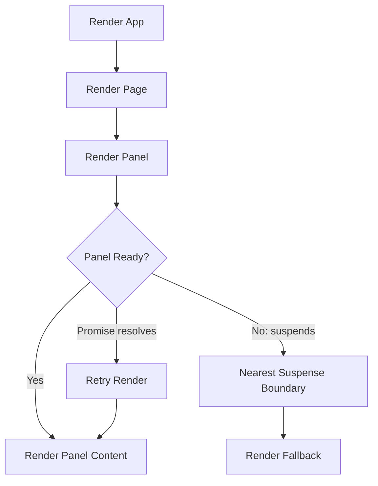
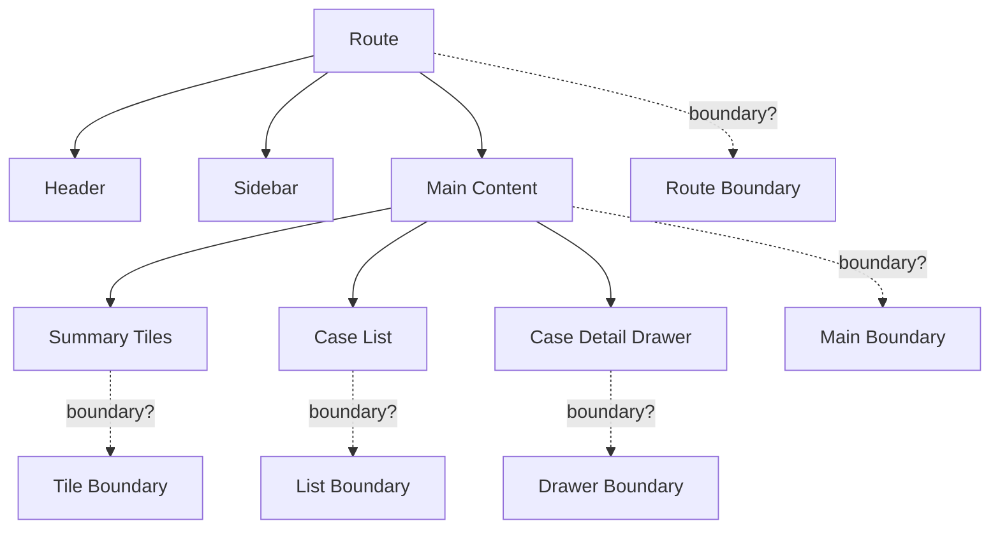
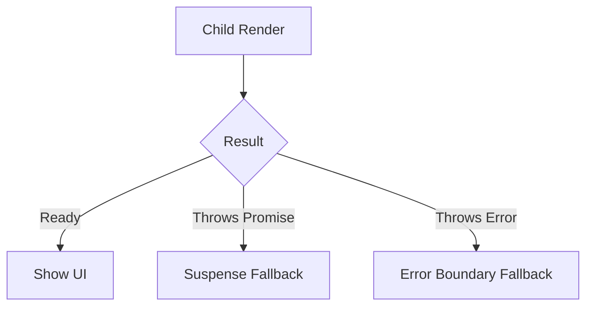
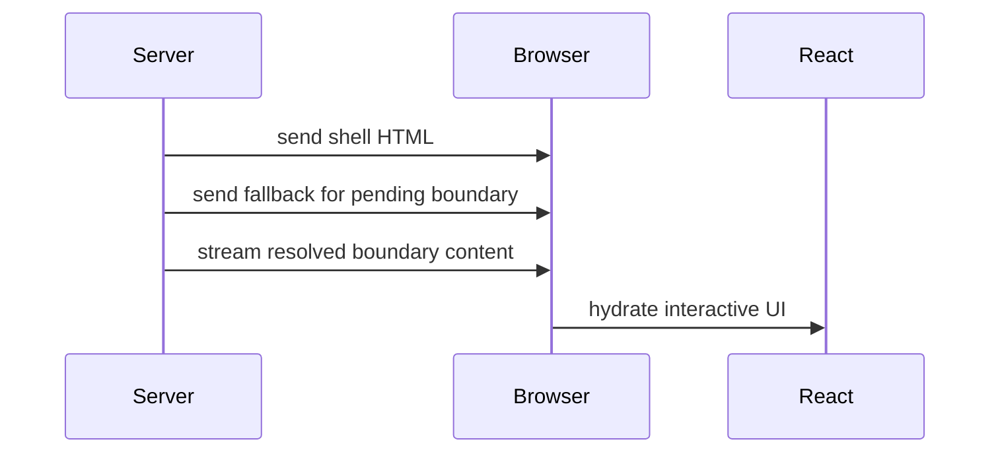

# Part 074 — React Suspense and Async Boundaries

Suspense bukan sekadar cara menampilkan spinner.

Suspense adalah boundary arsitektural untuk menyatakan:

> “Subtree ini belum siap dirender. Tampilkan fallback terdekat sampai dependency render-time-nya siap.”

Kalau loading state lokal menjawab “apakah request ini sedang berjalan?”, Suspense menjawab “apakah bagian UI ini siap tampil sebagai unit yang konsisten?”

Itu perbedaan besar.

---

## 1. Mental Model

React render harus menghasilkan UI. Jika sebuah child belum bisa menghasilkan UI karena menunggu resource Suspense-enabled, React dapat berhenti pada boundary terdekat dan menampilkan fallback.



Suspense boundary adalah unit loading. Ia bukan data-fetching library. Ia tidak otomatis mendeteksi fetch yang dilakukan di `useEffect`.

Contoh boundary:

```tsx
<Suspense fallback={<CaseDetailSkeleton />}>
  <CaseDetail caseId={caseId} />
</Suspense>
```

Kalimat penting:

```txt
Suspense mengatur rendering saat sesuatu belum siap.
Data layer tetap harus menyediakan resource yang bisa suspend.
```

---

## 2. Suspense Bukan Pengganti Semua Loading State

Masih ada loading state yang bukan Suspense:

| Situasi | Cocok dengan Suspense? | Alasannya |
|---|---:|---|
| Route-level data sebelum page siap | Ya | Boundary natural |
| Code splitting dengan `lazy` | Ya | React built-in support |
| Cached promise read dengan `use` | Ya | Render-time dependency |
| TanStack Query `useSuspenseQuery` | Ya | Library menyediakan Suspense integration |
| Button submit pending | Tidak selalu | Ini command state, bukan render readiness |
| Debounced search sedang fetch | Tergantung | Bisa pakai Suspense, tetapi sering lebih baik keep previous data |
| Background refresh | Tidak | UI lama bisa tetap tampil |
| Optimistic mutation | Tidak utama | Ini command/reconciliation state |
| Fetch di `useEffect` | Tidak otomatis | Suspense tidak melihat effect fetch |

Suspense buruk jika dipakai untuk semua loading kecil. UI akan sering fallback dan terasa berkedip.

---

## 3. Boundary Placement

Boundary placement adalah keputusan UX dan architecture.



### Too High

```tsx
<Suspense fallback={<FullPageSpinner />}>
  <CaseManagementPage />
</Suspense>
```

Masalah:

1. satu panel lambat membuat seluruh page hilang,
2. header/sidebar ikut fallback,
3. user kehilangan spatial context,
4. background refetch terasa seperti page crash.

### Too Low

```tsx
<Suspense fallback={<Spinner />}>
  <CaseTitle />
</Suspense>
<Suspense fallback={<Spinner />}>
  <CaseStatus />
</Suspense>
<Suspense fallback={<Spinner />}>
  <CaseOwner />
</Suspense>
```

Masalah:

1. loading fragmentasi,
2. banyak spinner,
3. layout shift,
4. sulit menjaga consistency antar field.

### Better

```tsx
<CaseLayout>
  <CaseHeader />

  <Suspense fallback={<CaseSummarySkeleton />}>
    <CaseSummary caseId={caseId} />
  </Suspense>

  <Suspense fallback={<CaseTimelineSkeleton />}>
    <CaseTimeline caseId={caseId} />
  </Suspense>
</CaseLayout>
```

Boundary mengikuti unit makna UI.

---

## 4. Boundary sebagai Consistency Unit

Suspense boundary harus membungkus bagian UI yang perlu tampil konsisten bersama.

Contoh buruk:

```tsx
<CaseStatus caseId={caseId} />
<Suspense fallback="Loading transitions...">
  <AvailableTransitions caseId={caseId} />
</Suspense>
```

Jika status sudah baru tetapi transitions masih lama/loading, user bisa melihat action yang tidak valid.

Lebih baik:

```tsx
<Suspense fallback={<CaseWorkflowSkeleton />}>
  <CaseWorkflowPanel caseId={caseId} />
</Suspense>
```

`CaseWorkflowPanel` membaca:

1. case status,
2. available transitions,
3. permission/capability,
4. pending command state.

Karena data tersebut membentuk satu decision surface, boundary-nya juga satu.

---

## 5. Fallback Design

Fallback bukan placeholder asal-asalan. Fallback adalah UI kontrak sementara.

Fallback yang baik:

1. mempertahankan layout,
2. menunjukkan struktur konten,
3. tidak menipu user dengan data palsu,
4. tidak memicu action,
5. tidak menggeser posisi berlebihan,
6. bisa diakses screen reader,
7. tidak terlalu lama tanpa feedback tambahan.

Contoh:

```tsx
function CaseListSkeleton() {
  return (
    <section aria-busy="true" aria-label="Loading cases">
      <div className="toolbar-skeleton" />
      <div className="row-skeleton" />
      <div className="row-skeleton" />
      <div className="row-skeleton" />
    </section>
  )
}
```

Buruk:

```tsx
<Suspense fallback={<div>Loading...</div>}>
  <CaseList />
</Suspense>
```

Untuk page internal engineering system, skeleton yang mempertahankan bentuk sering lebih baik daripada spinner tunggal.

---

## 6. Nested Suspense Boundaries

Nested boundaries mengizinkan progressive reveal.

```tsx
<Suspense fallback={<PageSkeleton />}>
  <CasePageShell />

  <Suspense fallback={<CaseSummarySkeleton />}>
    <CaseSummary />
  </Suspense>

  <Suspense fallback={<AuditTrailSkeleton />}>
    <AuditTrail />
  </Suspense>
</Suspense>
```

Gunakan nested boundary saat:

1. subtree punya readiness berbeda,
2. user bisa memakai sebagian page tanpa menunggu semua,
3. layout tetap stabil,
4. dependency tidak harus konsisten bersama.

Jangan nested boundary jika:

1. data harus tampil atomik,
2. fallback kecil membuat UI gaduh,
3. banyak boundary membuat mental model debugging sulit.

---

## 7. Suspense + Error Boundary

Suspense menangani “belum siap”. Error Boundary menangani “gagal render/throw”.

```tsx
<ErrorBoundary fallback={<CaseDetailError />}>
  <Suspense fallback={<CaseDetailSkeleton />}>
    <CaseDetail caseId={caseId} />
  </Suspense>
</ErrorBoundary>
```

Mental model:



Jangan mencampur loading dan error menjadi boolean soup di parent kalau data layer sudah bisa mengintegrasikan boundary.

Tetapi command error seperti gagal submit form masih sering lebih baik ditangani dekat command surface, bukan Error Boundary global.

---

## 8. Suspense-Enabled Data Sources

Suspense tidak aktif karena `fetch()` ada di component.

Tidak otomatis:

```tsx
function CaseDetail({ caseId }: Props) {
  const [caseDetail, setCaseDetail] = useState<CaseDetail | null>(null)

  useEffect(() => {
    fetchCase(caseId).then(setCaseDetail)
  }, [caseId])

  if (!caseDetail) return <Spinner />

  return <CaseDetailView caseDetail={caseDetail} />
}
```

Suspense-enabled:

```tsx
<Suspense fallback={<CaseDetailSkeleton />}>
  <CaseDetail caseId={caseId} />
</Suspense>
```

Dengan data source yang bisa suspend, misalnya framework/data library yang mendukung Suspense, atau cached promise yang dibaca saat render.

React modern mendukung `use` untuk membaca Promise/context dalam render, tetapi production integration harus memperhatikan caching. Membuat Promise baru setiap render akan menyebabkan loop/fallback terus menerus.

---

## 9. `use` and Cached Promise Boundary

Contoh sederhana:

```tsx
function CaseDetail({ casePromise }: Props) {
  const caseDetail = use(casePromise)

  return <CaseDetailView caseDetail={caseDetail} />
}
```

Parent:

```tsx
<Suspense fallback={<CaseDetailSkeleton />}>
  <CaseDetail casePromise={casePromise} />
</Suspense>
```

Yang penting: `casePromise` harus stabil dan dikelola di luar render child.

Buruk:

```tsx
function CaseDetail({ caseId }: Props) {
  const caseDetail = use(fetchCase(caseId))

  return <CaseDetailView caseDetail={caseDetail} />
}
```

Jika `fetchCase(caseId)` membuat Promise baru setiap render tanpa cache, boundary bisa terus suspend. Data source harus punya cache/resource identity.

---

## 10. TanStack Query Suspense Boundary

Dengan TanStack Query, suspense mode biasanya dipakai lewat hook Suspense-specific seperti `useSuspenseQuery`.

```tsx
function CaseDetail({ tenantId, caseId }: Props) {
  const { data } = useSuspenseQuery({
    queryKey: caseKeys.detail(tenantId, caseId),
    queryFn: () => api.getCase(tenantId, caseId),
  })

  return <CaseDetailView caseDetail={data} />
}
```

Boundary:

```tsx
<ErrorBoundary fallback={<CaseDetailError />}>
  <Suspense fallback={<CaseDetailSkeleton />}>
    <CaseDetail tenantId={tenantId} caseId={caseId} />
  </Suspense>
</ErrorBoundary>
```

Design note:

```txt
useSuspenseQuery moves initial pending state from local booleans into Suspense boundary.
But cache key, staleTime, invalidation, retry, and error behavior still need domain design.
```

---

## 11. Suspense vs Keep Previous Data

Search/list UI sering lebih baik tidak fallback ke skeleton setiap filter berubah.

Bad UX:

```txt
User types filter.
List disappears.
Skeleton appears.
List returns.
Repeat.
```

Alternative:

1. keep previous data,
2. show background pending indicator,
3. use transition,
4. commit search only after debounce/submit,
5. use Suspense only for initial route readiness.

Pattern:

```tsx
function CaseSearchPage() {
  const [isPending, startTransition] = useTransition()
  const [filters, setFilters] = useState(initialFilters)

  function applyFilters(next: Filters) {
    startTransition(() => {
      setFilters(next)
    })
  }

  return (
    <>
      <SearchToolbar
        filters={filters}
        isPending={isPending}
        onApply={applyFilters}
      />

      <Suspense fallback={<CaseListSkeleton />}>
        <CaseList filters={filters} />
      </Suspense>
    </>
  )
}
```

Jika data library mendukung keeping previous data, gunakan itu untuk menghindari UI collapse pada refetch biasa.

---

## 12. Route-Level Suspense

Route boundary cocok untuk data yang menentukan page readiness.

```tsx
function AppRoutes() {
  return (
    <Routes>
      <Route
        path="/cases/:caseId"
        element={
          <ErrorBoundary fallback={<RouteError />}>
            <Suspense fallback={<CaseRouteSkeleton />}>
              <CaseRoute />
            </Suspense>
          </ErrorBoundary>
        }
      />
    </Routes>
  )
}
```

Route-level boundary sebaiknya tidak membuat semua chrome hilang.

Lebih baik:

```tsx
<AppShell>
  <Sidebar />
  <Header />

  <main>
    <ErrorBoundary fallback={<RouteError />}>
      <Suspense fallback={<RouteContentSkeleton />}>
        <Outlet />
      </Suspense>
    </ErrorBoundary>
  </main>
</AppShell>
```

Shell tetap stabil. Route content boleh suspend.

---

## 13. Async Boundary for Workflow UI

Workflow UI sering punya beberapa dependency:

```txt
case detail
available transitions
permission/capability
task assignment
audit summary
```

Jangan pecah sembarang.

```tsx
function CaseWorkflowBoundary({ tenantId, caseId }: Props) {
  return (
    <ErrorBoundary fallback={<WorkflowError />}>
      <Suspense fallback={<WorkflowSkeleton />}>
        <CaseWorkflowPanel tenantId={tenantId} caseId={caseId} />
      </Suspense>
    </ErrorBoundary>
  )
}
```

Inside:

```tsx
function CaseWorkflowPanel({ tenantId, caseId }: Props) {
  const { data: detail } = useSuspenseQuery(caseDetailOptions(tenantId, caseId))
  const { data: transitions } = useSuspenseQuery(caseTransitionOptions(tenantId, caseId))
  const { data: capabilities } = useSuspenseQuery(caseCapabilityOptions(tenantId, caseId))

  return (
    <WorkflowView
      detail={detail}
      transitions={transitions}
      capabilities={capabilities}
    />
  )
}
```

Boundary ini memastikan user tidak melihat action surface yang setengah valid.

---

## 14. Parallel vs Sequential Suspense

Jika component membaca beberapa resources:

```tsx
function Panel() {
  const a = useSuspenseQuery(aOptions())
  const b = useSuspenseQuery(bOptions())
  const c = useSuspenseQuery(cOptions())

  return <View a={a.data} b={b.data} c={c.data} />
}
```

Tergantung data library, query bisa tetap dijalankan dengan observer masing-masing, tetapi desain dependency tetap penting.

Jika B butuh data dari A:

```tsx
function Panel() {
  const { data: caseDetail } = useSuspenseQuery(caseDetailOptions(caseId))

  const { data: transitions } = useSuspenseQuery(
    transitionOptions(caseDetail.workflowType),
  )

  return <View caseDetail={caseDetail} transitions={transitions} />
}
```

Ini dependency sequential. Jika tidak perlu sequential, jangan membuatnya sequential hanya karena component nesting.

Buat query options di boundary/page layer agar dependencies eksplisit.

---

## 15. Avoiding Waterfalls

Suspense bisa menyembunyikan waterfall, bukan menghapusnya.

Buruk:

```tsx
function CasePage() {
  return (
    <Suspense fallback={<Skeleton />}>
      <CaseHeader />
      <CaseBody />
      <CaseAudit />
    </Suspense>
  )
}

function CaseHeader() {
  const detail = useSuspenseQuery(caseDetailOptions(caseId))
  return ...
}

function CaseAudit() {
  const audit = useSuspenseQuery(caseAuditOptions(caseId))
  return ...
}
```

Jika resource hanya mulai saat component render dan render terhenti di query pertama, query lain bisa tertunda.

Mitigasi:

1. preload/prefetch di router/loader/page boundary,
2. use parallel query APIs bila tersedia,
3. hoist independent resources,
4. split Suspense boundaries,
5. design backend endpoint/read model untuk page composition.

Example prefetch:

```ts
await Promise.all([
  queryClient.prefetchQuery(caseDetailOptions(tenantId, caseId)),
  queryClient.prefetchQuery(caseAuditOptions(tenantId, caseId)),
  queryClient.prefetchQuery(caseMetricOptions(tenantId, caseId)),
])
```

Then render:

```tsx
<Suspense fallback={<CaseRouteSkeleton />}>
  <CaseRouteContent tenantId={tenantId} caseId={caseId} />
</Suspense>
```

---

## 16. Suspense and Transitions

Without transition, changing state that causes suspend may replace visible content with fallback.

With transition, React can keep already revealed UI visible while rendering non-urgent update.

```tsx
function CaseTabs() {
  const [tab, setTab] = useState<'summary' | 'audit'>('summary')
  const [isPending, startTransition] = useTransition()

  function selectTab(next: typeof tab) {
    startTransition(() => {
      setTab(next)
    })
  }

  return (
    <>
      <TabList value={tab} onChange={selectTab} pending={isPending} />

      <Suspense fallback={<TabPanelSkeleton />}>
        <TabPanel tab={tab} />
      </Suspense>
    </>
  )
}
```

Mental model:

```txt
Urgent update: input, click visual feedback.
Transition update: expensive/non-urgent UI replacement.
```

Use transition to prevent fallback from destroying already useful UI during navigation-like state changes.

---

## 17. Suspense and Server Rendering

Suspense boundaries are important for streaming rendering in frameworks that support it.

Conceptual flow:



For app architecture:

1. shell should be stable,
2. important above-the-fold content should have meaningful fallback,
3. non-critical panels can stream/reveal later,
4. Error Boundary strategy must match route/module boundary,
5. server/client cache hydration must agree.

Hydration mismatch often comes from:

1. reading browser-only state during server render,
2. non-deterministic fallback/content,
3. time/random values in render,
4. tenant/user data not scoped correctly,
5. cache not dehydrated/rehydrated consistently.

---

## 18. Suspense and Code Splitting

Classic Suspense use case:

```tsx
const CaseAuditPanel = lazy(() => import('./CaseAuditPanel'))

function CasePage() {
  return (
    <Suspense fallback={<AuditPanelSkeleton />}>
      <CaseAuditPanel />
    </Suspense>
  )
}
```

Code splitting boundary and data boundary may be same or separate.

Same boundary:

```tsx
<Suspense fallback={<AuditPanelSkeleton />}>
  <CaseAuditPanel caseId={caseId} />
</Suspense>
```

Separate boundary:

```tsx
<Suspense fallback={<CodeLoading />}>
  <LazyAuditModule>
    <Suspense fallback={<AuditDataSkeleton />}>
      <AuditTrail caseId={caseId} />
    </Suspense>
  </LazyAuditModule>
</Suspense>
```

Separate only if UX needs to distinguish code loading from data loading. Most apps do not need that granularity.

---

## 19. Boundary Architecture Patterns

### 19.1 Route Boundary

```tsx
<AppShell>
  <RouteErrorBoundary>
    <Suspense fallback={<RouteSkeleton />}>
      <CaseRoute />
    </Suspense>
  </RouteErrorBoundary>
</AppShell>
```

Use for route-level readiness.

### 19.2 Panel Boundary

```tsx
<DashboardGrid>
  <Suspense fallback={<MetricCardSkeleton />}>
    <OpenCasesMetric />
  </Suspense>

  <Suspense fallback={<MetricCardSkeleton />}>
    <OverdueSlaMetric />
  </Suspense>
</DashboardGrid>
```

Use when panels are independent.

### 19.3 Decision Surface Boundary

```tsx
<Suspense fallback={<ActionPanelSkeleton />}>
  <CaseActionPanel />
</Suspense>
```

Use when data must be consistent before user acts.

### 19.4 Progressive Detail Boundary

```tsx
<CaseHeader />

<Suspense fallback={<SummarySkeleton />}>
  <CaseSummary />
</Suspense>

<Suspense fallback={<AuditSkeleton />}>
  <AuditTrail />
</Suspense>
```

Use when summary and audit can reveal independently.

---

## 20. Designing Suspense Fallbacks as Contracts

Fallback must answer:

```txt
What is unavailable?
What remains stable?
Can the user still act?
How long might this take?
Is previous data better than fallback?
```

Examples:

### Detail Page

```tsx
function CaseDetailSkeleton() {
  return (
    <article aria-busy="true">
      <div className="title-skeleton" />
      <div className="metadata-grid-skeleton" />
      <div className="section-skeleton" />
    </article>
  )
}
```

### Action Panel

```tsx
function ActionPanelSkeleton() {
  return (
    <aside aria-busy="true" aria-label="Loading available actions">
      <button disabled>Loading actions…</button>
    </aside>
  )
}
```

### Search Results

Often better:

```tsx
<CaseList
  data={previousData}
  isFetching={isFetching}
  subtlePendingIndicator
/>
```

rather than hiding results behind Suspense fallback.

---

## 21. Anti-Pattern: Suspense for Command State

Bad:

```tsx
<Suspense fallback={<Submitting />}>
  <SubmitApprovalButton />
</Suspense>
```

Submit pending is not render readiness. It is command lifecycle.

Better:

```tsx
function SubmitApprovalButton() {
  const approve = useApproveCase()

  return (
    <button disabled={approve.isPending}>
      {approve.isPending ? 'Approving…' : 'Approve'}
    </button>
  )
}
```

Suspense is for async read/render dependency. Mutations need command state, optimistic state, rollback, and error feedback.

---

## 22. Anti-Pattern: Boundary Around Entire App

```tsx
<Suspense fallback={<FullScreenSpinner />}>
  <App />
</Suspense>
```

This makes every suspend look like application-wide loading.

Better:

```tsx
<AppProviders>
  <AppShell>
    <RouteBoundary />
  </AppShell>
</AppProviders>
```

Place boundaries at route, panel, and decision-surface levels.

---

## 23. Anti-Pattern: Fallback That Changes Layout

```tsx
<Suspense fallback={<Spinner />}>
  <DataGrid />
</Suspense>
```

If DataGrid is 700px tall and spinner is 40px, layout jumps.

Better:

```tsx
<Suspense fallback={<DataGridSkeleton rows={20} />}>
  <DataGrid />
</Suspense>
```

Fallback should reserve shape.

---

## 24. Anti-Pattern: Creating Promise During Render Without Cache

```tsx
function UserProfile({ userId }: Props) {
  const user = use(fetchUser(userId))
  return <Profile user={user} />
}
```

If `fetchUser` creates a new Promise each render, this is not a stable resource.

Better:

```ts
const userResourceCache = new Map<string, Promise<User>>()

function getUserPromise(userId: string) {
  let promise = userResourceCache.get(userId)

  if (!promise) {
    promise = fetchUser(userId)
    userResourceCache.set(userId, promise)
  }

  return promise
}
```

Then:

```tsx
function UserProfile({ userId }: Props) {
  const user = use(getUserPromise(userId))
  return <Profile user={user} />
}
```

In production, prefer framework or data library integration rather than hand-rolled cache unless you fully own invalidation, error, retry, eviction, and hydration.

---

## 25. Suspense Boundary Decision Matrix

| Question | Boundary Choice |
|---|---|
| Does this subtree represent route readiness? | Route content boundary |
| Can user use other parts while this loads? | Smaller panel boundary |
| Must several resources be consistent together? | One combined decision-surface boundary |
| Is previous data better than fallback? | Avoid Suspense fallback on refetch; keep previous data |
| Is this command/mutation pending? | Use command state, not Suspense |
| Is fallback layout-compatible? | Skeleton boundary |
| Can error be localized? | Pair with local Error Boundary |
| Does server render stream this content? | Boundary around streamable segment |
| Does data source actually support Suspense? | If no, Suspense will not help |

---

## 26. Testing Suspense Boundaries

Testing initial fallback:

```tsx
render(
  <Suspense fallback={<div>Loading case...</div>}>
    <CaseDetail caseId="case-1" />
  </Suspense>,
)

expect(screen.getByText('Loading case...')).toBeInTheDocument()
```

Testing resolved UI:

```tsx
expect(await screen.findByRole('heading', {
  name: /case-1/i,
})).toBeInTheDocument()
```

Testing error boundary:

```tsx
render(
  <ErrorBoundary fallback={<div>Could not load case</div>}>
    <Suspense fallback={<div>Loading...</div>}>
      <CaseDetail caseId="broken-case" />
    </Suspense>
  </ErrorBoundary>,
)

expect(await screen.findByText('Could not load case')).toBeInTheDocument()
```

Testing boundary placement is more architectural:

```txt
[ ] Does header remain visible while route content suspends?
[ ] Does action panel avoid showing invalid actions?
[ ] Does list keep previous data during background refetch?
[ ] Does fallback preserve layout?
[ ] Does error fallback localize failure?
```

---

## 27. Debugging Suspense Bugs

### Symptom: Fallback Never Resolves

Possible causes:

1. Promise recreated every render,
2. query key changes every render,
3. unstable filter object,
4. data source never resolves,
5. Error Boundary missing and error is swallowed elsewhere,
6. infinite retry loop.

### Symptom: Whole App Flashes Loading

Possible causes:

1. boundary too high,
2. route change not wrapped in transition,
3. background refetch causing suspend,
4. global Suspense around app shell.

### Symptom: Error Shows as Loading Forever

Possible causes:

1. Error Boundary absent,
2. data library retrying indefinitely,
3. fallback itself suspends,
4. error converted to pending state.

### Symptom: Waterfall

Possible causes:

1. resource starts only after parent resolves,
2. independent queries nested sequentially,
3. no route prefetch,
4. backend endpoint granularity wrong.

---

## 28. Case Study: Case Detail Route

### Requirements

```txt
Case detail route should:
- keep app shell visible,
- show skeleton for main content,
- load summary and audit progressively,
- not show action panel until permissions/transitions are ready,
- handle case-not-found locally,
- keep previous tab content during tab switch when possible.
```

### Architecture

```tsx
function CaseRoute() {
  const { tenantId, caseId } = useRouteParams()

  return (
    <CaseRouteLayout>
      <CaseRouteHeader tenantId={tenantId} caseId={caseId} />

      <ErrorBoundary fallback={<CaseMainError />}>
        <Suspense fallback={<CaseMainSkeleton />}>
          <CaseMain tenantId={tenantId} caseId={caseId} />
        </Suspense>
      </ErrorBoundary>

      <ErrorBoundary fallback={<CaseWorkflowError />}>
        <Suspense fallback={<CaseWorkflowSkeleton />}>
          <CaseWorkflowPanel tenantId={tenantId} caseId={caseId} />
        </Suspense>
      </ErrorBoundary>
    </CaseRouteLayout>
  )
}
```

### Main Content

```tsx
function CaseMain({ tenantId, caseId }: Props) {
  const { data: detail } = useSuspenseQuery(
    caseDetailOptions(tenantId, caseId),
  )

  return (
    <>
      <CaseSummary detail={detail} />

      <Suspense fallback={<AuditTrailSkeleton />}>
        <AuditTrail tenantId={tenantId} caseId={caseId} />
      </Suspense>
    </>
  )
}
```

### Workflow Panel

```tsx
function CaseWorkflowPanel({ tenantId, caseId }: Props) {
  const { data: detail } = useSuspenseQuery(
    caseDetailOptions(tenantId, caseId),
  )

  const { data: transitions } = useSuspenseQuery(
    caseTransitionOptions(tenantId, caseId),
  )

  const { data: capabilities } = useSuspenseQuery(
    caseCapabilityOptions(tenantId, caseId),
  )

  return (
    <WorkflowActions
      caseDetail={detail}
      transitions={transitions}
      capabilities={capabilities}
    />
  )
}
```

Design choice:

```txt
Audit can reveal separately.
Workflow actions cannot reveal until detail + transitions + capabilities are ready together.
```

---

## 29. Production Checklist

```txt
[ ] Is this async work read/render dependency, not command state?
[ ] Does data source actually support Suspense?
[ ] Is boundary placed at meaningful UI unit?
[ ] Is fallback layout-compatible?
[ ] Is Error Boundary paired with Suspense?
[ ] Is previous data better than fallback for refetch?
[ ] Are transitions used for non-urgent suspending updates?
[ ] Are independent resources prefetched or run in parallel?
[ ] Are tenant/user/cache keys stable?
[ ] Does SSR/hydration use compatible cache snapshots?
[ ] Can user act while data is partially loaded?
[ ] Are decision surfaces loaded atomically?
[ ] Are tests covering fallback, success, and error?
```

---

## 30. Exercises

### Exercise 1 — Boundary Audit

Take a complex page with:

1. header,
2. sidebar,
3. search results,
4. metrics cards,
5. detail drawer,
6. action panel.

Decide where Suspense boundaries should live and justify:

```txt
Boundary:
Fallback:
Data dependencies:
Can reveal independently?
Needs Error Boundary?
Should keep previous data?
```

### Exercise 2 — Refactor Boolean Loading State

Given:

```tsx
if (isLoading) return <Spinner />
if (error) return <ErrorMessage />
return <CaseDetail data={data} />
```

Refactor into:

1. Suspense-enabled query hook,
2. Suspense boundary,
3. Error Boundary,
4. layout-preserving fallback.

### Exercise 3 — Avoid Waterfall

Given a route that loads:

1. case detail,
2. audit trail,
3. metrics,
4. permissions.

Design prefetch/query orchestration so independent data starts in parallel but workflow action surface still renders atomically.

---

## 31. Key Takeaways

Suspense is not a spinner API. It is an async boundary primitive.

Use it to define:

1. what part of UI must be ready together,
2. where loading should be shown,
3. how progressive reveal should work,
4. how errors should be localized,
5. when old UI should remain visible,
6. how route/panel/workflow boundaries behave.

The mature mental model:

```txt
Local loading state describes a request.
Suspense describes readiness of a UI subtree.
Error Boundary describes failure of a UI subtree.
Transition describes priority of UI replacement.
Cache/data layer describes resource identity and freshness.
```

Good Suspense architecture is not about removing every `isLoading`. It is about making async UI boundaries explicit, stable, localized, and aligned with user tasks.

---

## References

- React — `<Suspense>`: https://react.dev/reference/react/Suspense
- React — `use`: https://react.dev/reference/react/use
- React — `lazy`: https://react.dev/reference/react/lazy
- React — `useTransition`: https://react.dev/reference/react/useTransition
- TanStack Query — Suspense Queries: https://tanstack.com/query/latest/docs/framework/react/reference/useSuspenseQuery
- TanStack Query — Query Invalidation: https://tanstack.com/query/latest/docs/framework/react/guides/query-invalidation
