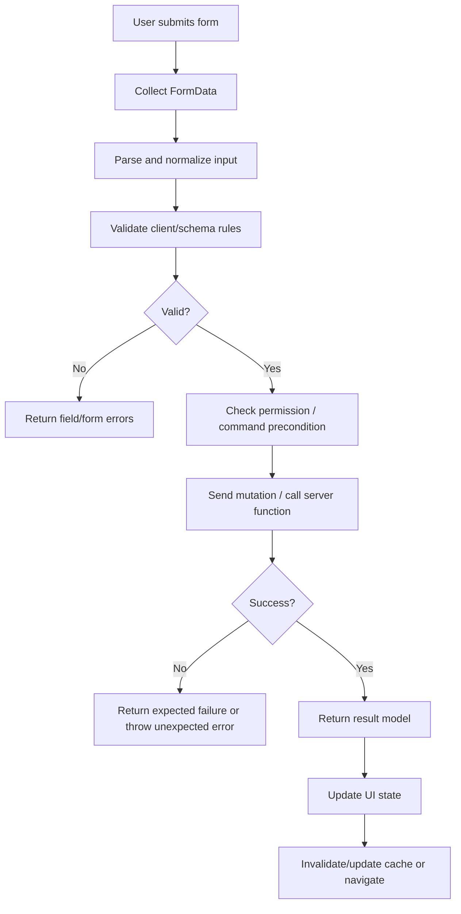

# Part 075 — React 19 Actions and Form State

> Form bukan sekadar kumpulan input.
>
> Dalam aplikasi production, form adalah **command boundary**: tempat user intent berubah menjadi perubahan sistem.

React 19 memperkenalkan model yang lebih eksplisit untuk pekerjaan async berbasis action: `action` prop di `<form>`, `useActionState`, `useFormStatus`, dan integrasi dengan transition. Ini bukan berarti semua form harus menjadi magic. Justru kebalikannya: React memberi primitive agar form bisa dimodelkan sebagai **transaction pipeline** yang punya pending state, result state, error state, reset behavior, dan progressive enhancement.

Bagian ini tidak membahas “cara membuat input controlled” dari nol. Itu sudah dibahas di Part 023 dan Part 047. Di sini fokusnya adalah:

```txt
user submits form
→ React starts an Action
→ pending state becomes observable
→ Action validates/mutates
→ Action returns result or throws
→ UI reconciles with result
→ uncontrolled fields may reset
→ cache/navigation/optimistic layer may update
```

---

## 1. Masalah Lama: `onSubmit` Menjadi Mini Runtime

Sebelum Actions, form async biasanya ditulis seperti ini:

```tsx
function ProfileForm() {
  const [name, setName] = useState("");
  const [status, setStatus] = useState<"idle" | "submitting" | "success" | "error">("idle");
  const [error, setError] = useState<string | null>(null);

  async function onSubmit(event: React.FormEvent<HTMLFormElement>) {
    event.preventDefault();

    setStatus("submitting");
    setError(null);

    try {
      await updateProfile({ name });
      setStatus("success");
    } catch (error) {
      setStatus("error");
      setError("Failed to update profile");
    }
  }

  return (
    <form onSubmit={onSubmit}>
      <input value={name} onChange={(event) => setName(event.target.value)} />
      <button disabled={status === "submitting"}>Save</button>
      {error && <p role="alert">{error}</p>}
    </form>
  );
}
```

Kode ini terlihat wajar. Tetapi di codebase besar, pola ini sering berkembang menjadi runtime kecil yang tidak sadar dirinya runtime:

```txt
manual preventDefault
manual pending state
manual error state
manual reset
manual duplicate-submit guard
manual race guard
manual server validation mapping
manual optimistic update
manual navigation after success
manual cache invalidation
manual accessibility status
manual retry policy
```

Yang salah bukan `onSubmit`. Yang salah adalah ketika kita menjadikan setiap form sebagai implementasi ad-hoc dari command lifecycle.

React 19 Actions memberi bentuk yang lebih native untuk lifecycle itu.

---

## 2. Mental Model: Form Action sebagai Command Boundary

Sebuah form action bukan “event handler biasa”. Ia lebih dekat ke command:

```txt
Command = intent user yang boleh mengubah state eksternal
```

Contoh command:

```txt
CreateInvoice
ApproveCase
UpdateProfile
AssignInvestigator
SubmitEvidence
ArchiveNotification
```

Dalam UI, command boundary yang sehat punya properti:

| Properti | Pertanyaan |
|---|---|
| Input | Data apa yang dikirim user? |
| Validation | Apakah input valid secara client dan server? |
| Authorization | Apakah user boleh menjalankan command? |
| Idempotency | Apa yang terjadi jika command terkirim dua kali? |
| Pending | Bagian UI mana yang harus disabled/loading? |
| Result | Apa bentuk sukses/gagal yang bisa dirender? |
| Cache effect | Query mana yang invalidated atau updated? |
| Navigation | Apakah sukses memindahkan halaman? |
| Audit | Apakah action perlu tercatat sebagai user intent? |
| Recovery | Jika gagal, apakah user bisa retry tanpa kehilangan input? |

React tidak menjawab semua hal di atas. React memberi primitive untuk menempatkannya dengan benar.

---

## 3. React 19 Actions: Apa yang Diselesaikan

Actions membuat function async dapat menjadi unit transisi state.

Dalam form:

```tsx
async function updateName(formData: FormData) {
  const name = String(formData.get("name") ?? "");
  await saveName(name);
}

export function NameForm() {
  return (
    <form action={updateName}>
      <input name="name" />
      <button>Save</button>
    </form>
  );
}
```

Perbedaan penting dari `onSubmit`:

```txt
<form action={fn}>
```

bukan hanya callback event. Function itu menerima `FormData` dan berjalan sebagai Action. Dalam React 19, form action juga berjalan dalam transition, sehingga React dapat mengelola pending state dan koordinasi render.

Namun action bukan cache manager, bukan validator universal, bukan authorization engine, dan bukan transport abstraction. Ia adalah UI command primitive.

---

## 4. Anatomy of a Production Form Action

Form action production-grade biasanya punya pipeline seperti ini:



Pisahkan error menjadi dua kategori:

| Jenis error | Cara menangani |
|---|---|
| Expected validation error | Return sebagai action state |
| Expected domain rejection | Return sebagai action state |
| Unauthorized/forbidden | Return atau route-level error, tergantung UX/security |
| Unexpected infrastructure error | Throw ke Error Boundary/logging layer |
| Network timeout | Return retryable state atau throw sesuai policy |

Jangan jadikan semua error string `"Something went wrong"`. Untuk system yang perlu defensibility, bentuk error adalah bagian dari contract.

---

## 5. `useActionState`: State dari Hasil Action

`useActionState` mengikat result dari Action ke state React.

Bentuk dasarnya:

```tsx
const [state, formAction, isPending] = useActionState(action, initialState);
```

Action menerima `previousState` sebagai argumen pertama, lalu payload action. Untuk `<form action={formAction}>`, payload berikutnya adalah `FormData`.

```tsx
type ProfileActionState =
  | {
      status: "idle";
      message: null;
      fieldErrors: {};
    }
  | {
      status: "invalid";
      message: string;
      fieldErrors: {
        name?: string;
        email?: string;
      };
    }
  | {
      status: "success";
      message: string;
      fieldErrors: {};
    };

const initialState: ProfileActionState = {
  status: "idle",
  message: null,
  fieldErrors: {},
};

async function updateProfileAction(
  previousState: ProfileActionState,
  formData: FormData
): Promise<ProfileActionState> {
  const name = String(formData.get("name") ?? "").trim();
  const email = String(formData.get("email") ?? "").trim();

  const fieldErrors: ProfileActionState["fieldErrors"] = {};

  if (name.length < 2) {
    fieldErrors.name = "Name must contain at least 2 characters.";
  }

  if (!email.includes("@")) {
    fieldErrors.email = "Email must be valid.";
  }

  if (Object.keys(fieldErrors).length > 0) {
    return {
      status: "invalid",
      message: "Please fix the highlighted fields.",
      fieldErrors,
    };
  }

  await updateProfile({ name, email });

  return {
    status: "success",
    message: "Profile updated.",
    fieldErrors: {},
  };
}

export function ProfileForm() {
  const [state, formAction, isPending] = useActionState(
    updateProfileAction,
    initialState
  );

  return (
    <form action={formAction}>
      <label>
        Name
        <input name="name" aria-invalid={Boolean(state.fieldErrors.name)} />
      </label>
      {state.fieldErrors.name && (
        <p role="alert">{state.fieldErrors.name}</p>
      )}

      <label>
        Email
        <input name="email" aria-invalid={Boolean(state.fieldErrors.email)} />
      </label>
      {state.fieldErrors.email && (
        <p role="alert">{state.fieldErrors.email}</p>
      )}

      <button disabled={isPending}>
        {isPending ? "Saving..." : "Save"}
      </button>

      {state.message && <p role="status">{state.message}</p>}
    </form>
  );
}
```

Perhatikan pola yang penting:

```txt
Action returns renderable state.
Component renders that state.
```

Jangan return object acak dari action lalu component menebak-nebak. Buat union yang eksplisit.

---

## 6. `previousState`: Bukan Tempat Menyembunyikan Database UI

Karena action menerima `previousState`, ada godaan untuk menjadikannya mini store.

Buruk:

```tsx
async function action(previousState: AnyHugeState, formData: FormData) {
  return {
    ...previousState,
    deeplyMutatedStuff: "...",
    cachedList: "...",
    modalState: "...",
    filters: "...",
  };
}
```

Lebih sehat:

```tsx
type ActionState =
  | { status: "idle"; fieldErrors: {}; formError: null }
  | { status: "invalid"; fieldErrors: FieldErrors; formError: string }
  | { status: "success"; fieldErrors: {}; formError: null; savedId: string };
```

`useActionState` cocok untuk state yang terkait langsung dengan action:

```txt
pending
last result
validation error
form-level error
success payload
```

Ia bukan pengganti:

```txt
server-state cache
normalized client store
workflow engine
large form model
global notification bus
audit/event pipeline
```

---

## 7. `useFormStatus`: Pending State untuk Subtree Form

`useFormStatus` membaca status dari form terdekat di atasnya.

Pola benar:

```tsx
import { useFormStatus } from "react-dom";

function SubmitButton() {
  const status = useFormStatus();

  return (
    <button type="submit" disabled={status.pending}>
      {status.pending ? "Saving..." : "Save"}
    </button>
  );
}

export function SettingsForm({ action }: { action: (formData: FormData) => void }) {
  return (
    <form action={action}>
      <input name="displayName" />
      <SubmitButton />
    </form>
  );
}
```

Pola yang sering membingungkan:

```tsx
function BadForm() {
  const status = useFormStatus();

  return (
    <form action={someAction}>
      <button disabled={status.pending}>Save</button>
    </form>
  );
}
```

`useFormStatus` membaca parent form. Jika dipanggil di component yang juga merender `<form>`, hook itu tidak membaca form yang sedang dibuat pada render yang sama. Buat child component seperti `SubmitButton`.

`useFormStatus` berguna ketika:

```txt
- banyak submit button ingin tahu pending state form
- design system punya <Button intent="submit" />
- field ingin disabled saat parent form submit
- UI ingin menampilkan data/method/action submission terakhir
```

Tetapi jangan memakai `useFormStatus` untuk state global. Scope-nya adalah form subtree.

---

## 8. Pending State: Jangan Disamaratakan

Ada beberapa level pending:

```txt
field-level pending
form-level pending
section-level pending
page-level pending
navigation-level pending
global command pending
```

`isPending` dari `useActionState` cocok untuk pending action tertentu. `useFormStatus().pending` cocok untuk child form. `useTransition` cocok untuk non-blocking transition di luar form atau ketika action dipanggil secara imperative.

Contoh:

```tsx
function SaveButton() {
  const { pending } = useFormStatus();

  return (
    <button type="submit" disabled={pending}>
      {pending ? "Saving invoice..." : "Save invoice"}
    </button>
  );
}
```

Jika form menyimpan invoice tetapi page juga sedang memuat attachment preview, jangan gabungkan semuanya ke satu boolean `loading`.

```txt
loading = true
```

adalah sumber kebohongan UI. Gunakan pending state yang dekat dengan pekerjaan yang benar.

---

## 9. Result Shape: Pakai Discriminated Union

State action yang sehat tidak ambigu.

Buruk:

```ts
type State = {
  error?: string;
  success?: boolean;
  data?: unknown;
};
```

Masalah:

```txt
success=true dan error terisi?
success=false dan data terisi?
tidak ada error tapi success undefined?
```

Lebih baik:

```ts
type SubmitCaseState =
  | {
      tag: "idle";
    }
  | {
      tag: "invalid";
      fieldErrors: Record<string, string>;
      formError: string;
    }
  | {
      tag: "rejected";
      reason: "permission_denied" | "stale_case" | "invalid_transition";
      message: string;
    }
  | {
      tag: "submitted";
      caseId: string;
      version: number;
      message: string;
    };
```

Action:

```tsx
async function submitCase(
  previous: SubmitCaseState,
  formData: FormData
): Promise<SubmitCaseState> {
  const input = parseSubmitCaseForm(formData);

  if (!input.ok) {
    return {
      tag: "invalid",
      fieldErrors: input.fieldErrors,
      formError: "Please fix the form.",
    };
  }

  const result = await submitCaseCommand(input.value);

  if (result.type === "permission_denied") {
    return {
      tag: "rejected",
      reason: "permission_denied",
      message: "You are not allowed to submit this case.",
    };
  }

  if (result.type === "invalid_transition") {
    return {
      tag: "rejected",
      reason: "invalid_transition",
      message: "This case can no longer be submitted.",
    };
  }

  return {
    tag: "submitted",
    caseId: result.caseId,
    version: result.version,
    message: "Case submitted.",
  };
}
```

Render:

```tsx
function SubmitCaseResult({ state }: { state: SubmitCaseState }) {
  switch (state.tag) {
    case "idle":
      return null;

    case "invalid":
      return <p role="alert">{state.formError}</p>;

    case "rejected":
      return <p role="alert">{state.message}</p>;

    case "submitted":
      return <p role="status">{state.message}</p>;
  }
}
```

Ini bukan TypeScript ceremony. Ini cara mencegah impossible UI state.

---

## 10. FormData Parsing: Jangan Bocorkan `FormData` ke Domain

`FormData` adalah transport shape, bukan domain input.

Buruk:

```ts
await approveCase(formData);
```

Lebih sehat:

```ts
type ApproveCaseInput = {
  caseId: string;
  comment: string;
  expectedVersion: number;
};

function parseApproveCaseForm(formData: FormData):
  | { ok: true; value: ApproveCaseInput }
  | { ok: false; fieldErrors: Record<string, string> } {
  const caseId = String(formData.get("caseId") ?? "");
  const comment = String(formData.get("comment") ?? "").trim();
  const expectedVersionRaw = String(formData.get("expectedVersion") ?? "");

  const fieldErrors: Record<string, string> = {};

  if (!caseId) {
    fieldErrors.caseId = "Missing case id.";
  }

  if (comment.length < 10) {
    fieldErrors.comment = "Comment must explain the approval decision.";
  }

  const expectedVersion = Number(expectedVersionRaw);

  if (!Number.isInteger(expectedVersion)) {
    fieldErrors.expectedVersion = "Invalid case version.";
  }

  if (Object.keys(fieldErrors).length > 0) {
    return { ok: false, fieldErrors };
  }

  return {
    ok: true,
    value: {
      caseId,
      comment,
      expectedVersion,
    },
  };
}
```

Boundary:

```txt
React FormData
→ parser
→ typed command input
→ domain/application command
```

Jangan biarkan domain function tahu nama `<input name="...">` jika tidak perlu. Nama field adalah UI contract. Command input adalah application contract.

---

## 11. Server Functions dan Framework Boundary

React 19 form features bekerja dengan Server Functions dalam environment/framework yang mendukung React Server Components dan server function transport. Tetapi plain React client app tidak otomatis punya server function runtime.

Model yang benar:

```txt
React primitive:
- form action
- useActionState
- useFormStatus
- useOptimistic
- transition integration

Framework/server runtime:
- where server function executes
- how request is transported
- how security boundary is enforced
- how cookies/session/database are accessed
- how route/cache revalidation works
```

Jangan mencampur dua hal ini.

Jika memakai Next.js/Remix/RSC-compatible framework, server function action mungkin bisa langsung dipakai di `<form action={serverFunction}>`.

Jika memakai SPA dengan REST/GraphQL API, action tetap bisa memanggil client-side API function:

```tsx
async function updateProfileAction(previous: State, formData: FormData): Promise<State> {
  const input = parseProfileForm(formData);

  if (!input.ok) {
    return {
      tag: "invalid",
      fieldErrors: input.fieldErrors,
    };
  }

  const response = await fetch("/api/profile", {
    method: "PUT",
    headers: {
      "Content-Type": "application/json",
      "Idempotency-Key": crypto.randomUUID(),
    },
    body: JSON.stringify(input.value),
  });

  if (!response.ok) {
    return {
      tag: "failed",
      message: "Could not save profile.",
    };
  }

  return {
    tag: "saved",
  };
}
```

React tidak menghapus kebutuhan API design.

---

## 12. Multiple Submit Actions dalam Satu Form

HTML sudah punya konsep submitter. React 19 form action dapat dikombinasikan dengan button-level action melalui `formAction`.

Contoh: draft vs publish.

```tsx
async function saveDraftAction(formData: FormData) {
  await saveArticleDraft(parseArticle(formData));
}

async function publishAction(formData: FormData) {
  await publishArticle(parseArticle(formData));
}

function ArticleForm() {
  return (
    <form action={saveDraftAction}>
      <input name="title" />
      <textarea name="body" />

      <button type="submit">Save draft</button>
      <button type="submit" formAction={publishAction}>
        Publish
      </button>
    </form>
  );
}
```

Dalam production, jangan hanya membedakan action dari label button. Buat command eksplisit:

```txt
SaveDraftArticle
PublishArticle
RequestReview
ArchiveArticle
```

Setiap command mungkin punya validation rule, permission, audit event, dan cache effect yang berbeda.

---

## 13. Progressive Enhancement dan `permalink`

`useActionState` memiliki parameter opsional `permalink`. Gunanya untuk mendukung progressive enhancement pada kasus tertentu: sebelum JavaScript bundle termuat, form bisa submit ke URL yang stabil dan React dapat menyambungkan hasilnya setelah hydration.

Mental model:

```txt
permalink = canonical URL untuk form action result
```

Gunakan ketika:

```txt
- form berada di feed/list dinamis
- page bisa berubah karena pagination/filter
- action perlu tetap bekerja sebelum JS siap
- server-rendered result perlu disambungkan kembali ke form yang sama
```

Jangan pakai `permalink` sebagai routing hack. Jika command sukses seharusnya redirect ke halaman detail, buat itu sebagai navigation policy yang eksplisit.

---

## 14. Form Reset Semantics

React form actions dapat melakukan reset pada uncontrolled field setelah action berhasil. Ini bagus untuk form seperti comment box:

```tsx
function CommentForm({ addComment }: { addComment: (formData: FormData) => Promise<void> }) {
  return (
    <form action={addComment}>
      <textarea name="comment" />
      <button>Post</button>
    </form>
  );
}
```

Setelah comment berhasil, textarea kosong adalah UX yang masuk akal.

Tetapi untuk enterprise form panjang, auto reset bisa menjadi berbahaya jika user butuh mempertahankan input setelah partial success/failure.

Decision:

| Form type | Reset after success? |
|---|---|
| Comment box | Ya |
| Search form | Tidak, biasanya URL state |
| Login form | Bisa, tergantung security |
| Multi-step case submission | Hati-hati |
| Payment form | Biasanya controlled by flow |
| Profile edit | Mungkin redirect atau keep success state |
| Bulk operation form | Biasanya keep summary/result |

Jika state harus dipertahankan, gunakan controlled fields atau desain result/navigation yang eksplisit.

---

## 15. Cache Boundary: Actions Bukan Server-State Cache

Setelah action berhasil, pertanyaan berikutnya:

```txt
Data mana yang sekarang stale?
```

React action tidak otomatis tahu query cache milik TanStack Query, normalized store, atau backend revalidation framework.

Contoh integrasi dengan TanStack Query di SPA:

```tsx
function UpdateProfileForm() {
  const queryClient = useQueryClient();

  const [state, formAction, isPending] = useActionState(
    async (previous: State, formData: FormData): Promise<State> => {
      const input = parseProfileForm(formData);

      if (!input.ok) {
        return { tag: "invalid", fieldErrors: input.fieldErrors };
      }

      await updateProfile(input.value);

      await queryClient.invalidateQueries({
        queryKey: ["profile", "me"],
      });

      return { tag: "saved" };
    },
    { tag: "idle" }
  );

  return (
    <form action={formAction}>
      {/* fields */}
      <button disabled={isPending}>Save</button>
    </form>
  );
}
```

Ini valid, tetapi untuk architecture yang lebih bersih, pisahkan command function:

```ts
async function updateProfileCommand(input: ProfileInput) {
  await api.updateProfile(input);
}
```

Lalu UI action hanya mengatur parsing/result/cache boundary.

---

## 16. Navigation After Action

Sukses command kadang tidak berarti tetap di halaman yang sama.

Contoh:

```txt
CreateInvoice success → go to invoice detail
ApproveCase success → stay and show updated status
SubmitApplication success → go to confirmation page
SaveDraft success → stay in editor
DeleteRecord success → go back to list
```

Jangan menyembunyikan navigation di util function tanpa dokumentasi. Navigation adalah bagian dari command result.

Pola eksplisit:

```ts
type CreateInvoiceState =
  | { tag: "idle" }
  | { tag: "invalid"; fieldErrors: FieldErrors }
  | { tag: "created"; invoiceId: string; next: { type: "redirect"; to: string } };
```

Render/effect boundary:

```tsx
function CreateInvoicePage() {
  const navigate = useNavigate();
  const [state, formAction, isPending] = useActionState(createInvoiceAction, {
    tag: "idle",
  });

  useEffect(() => {
    if (state.tag === "created") {
      navigate(state.next.to);
    }
  }, [state, navigate]);

  return (
    <form action={formAction}>
      {/* fields */}
      <button disabled={isPending}>Create</button>
    </form>
  );
}
```

Apakah navigation di `useEffect` boleh? Ya, karena itu sinkronisasi dengan external system/router berdasarkan committed state. Tetapi untuk framework yang menyediakan redirect dari server action, pakai mekanisme framework bila lebih tepat.

---

## 17. Duplicate Submit dan Idempotency

Disable button saat pending membantu UX, tetapi bukan guarantee.

User bisa:

```txt
double-click sangat cepat
refresh/resubmit
membuka dua tab
mengirim request manual
kehilangan koneksi lalu retry
```

Production command yang mengubah data penting butuh idempotency.

Minimal:

```tsx
function InvoiceCreateForm() {
  const idempotencyKey = useMemo(() => crypto.randomUUID(), []);

  async function createInvoiceAction(previous: State, formData: FormData): Promise<State> {
    const input = parseInvoiceForm(formData);

    if (!input.ok) {
      return { tag: "invalid", fieldErrors: input.fieldErrors };
    }

    const result = await createInvoice({
      ...input.value,
      idempotencyKey,
    });

    return {
      tag: "created",
      invoiceId: result.invoiceId,
    };
  }

  const [state, formAction, isPending] = useActionState(createInvoiceAction, {
    tag: "idle",
  });

  return (
    <form action={formAction}>
      <input type="hidden" name="idempotencyKey" value={idempotencyKey} />
      <button disabled={isPending}>Create invoice</button>
    </form>
  );
}
```

Tetapi idempotency key yang benar biasanya harus dikirim ke backend dan backend harus menyimpan command result per key.

Client-only idempotency adalah UX improvement, bukan consistency guarantee.

---

## 18. Permission dan Precondition

Form sering menampilkan button berdasarkan permission:

```tsx
{canApprove && <button>Approve</button>}
```

Itu hanya UI hint. Command tetap harus memeriksa permission di backend/application layer.

Action state bisa merepresentasikan rejection:

```ts
type ApproveState =
  | { tag: "idle" }
  | { tag: "invalid"; fieldErrors: FieldErrors }
  | { tag: "rejected"; reason: "permission_denied" | "stale_version"; message: string }
  | { tag: "approved"; caseId: string; version: number };
```

Precondition penting untuk regulatory/case management UI:

```txt
expectedVersion
currentStatus
actorRole
requiredComment
attachmentCompleteness
deadlineWindow
```

Jangan biarkan form submit “berhasil” hanya karena client masih menampilkan state lama.

---

## 19. Accessibility Contract

Form action yang production-grade harus punya feedback aksesibel.

Checklist:

```txt
- submit button disabled saat pending bila command tidak boleh double submit
- pending label spesifik: "Saving profile..." bukan hanya "Loading..."
- validation error terhubung ke field
- form-level error memakai role="alert" bila immediate attention
- success message memakai role="status" bila non-blocking
- aria-invalid pada field invalid
- aria-describedby mengarah ke pesan error/help
- focus management setelah submit gagal untuk form besar
```

Contoh field:

```tsx
<label htmlFor="email">Email</label>
<input
  id="email"
  name="email"
  aria-invalid={Boolean(state.fieldErrors.email)}
  aria-describedby={state.fieldErrors.email ? "email-error" : undefined}
/>
{state.fieldErrors.email && (
  <p id="email-error" role="alert">
    {state.fieldErrors.email}
  </p>
)}
```

Actions tidak otomatis membuat form aksesibel. Mereka hanya memberi lifecycle yang bisa dipakai untuk merender status dengan benar.

---

## 20. Pattern: Domain Action Hook

Untuk codebase besar, jangan ulangi parsing/cache/error mapping di page.

Buat domain hook:

```tsx
type UseUpdateProfileFormOptions = {
  onSaved?: () => void;
};

function useUpdateProfileForm(options: UseUpdateProfileFormOptions = {}) {
  const queryClient = useQueryClient();

  return useActionState(
    async (previous: ProfileState, formData: FormData): Promise<ProfileState> => {
      const input = parseProfileForm(formData);

      if (!input.ok) {
        return {
          tag: "invalid",
          fieldErrors: input.fieldErrors,
        };
      }

      const result = await updateProfileCommand(input.value);

      await queryClient.invalidateQueries({
        queryKey: ["profile", result.profileId],
      });

      options.onSaved?.();

      return {
        tag: "saved",
        profileId: result.profileId,
      };
    },
    { tag: "idle" } satisfies ProfileState
  );
}
```

Page:

```tsx
function ProfilePage() {
  const [state, action, isPending] = useUpdateProfileForm();

  return (
    <form action={action}>
      <ProfileFields errors={state.tag === "invalid" ? state.fieldErrors : {}} />
      <SubmitButton pending={isPending} />
    </form>
  );
}
```

Ini menjaga page tetap sebagai composition layer, bukan dumping ground.

---

## 21. Pattern: Action State Machine

Untuk command rumit, gunakan state machine eksplisit.

```ts
type CommandState =
  | { tag: "idle" }
  | { tag: "invalid"; fieldErrors: FieldErrors }
  | { tag: "submitting" }
  | { tag: "rejected"; reason: string }
  | { tag: "succeeded"; resultId: string };
```

`useActionState` sendiri memberi `isPending`, jadi biasanya tidak perlu menyimpan `submitting` sebagai state returned. Tetapi untuk workflow kompleks yang butuh riwayat, reason, atau step lanjutan, representasikan state secara eksplisit.

Bedakan:

```txt
isPending = action sedang berjalan sekarang
state.tag = hasil committed terakhir
```

Keduanya tidak selalu sama.

---

## 22. Interaction dengan Controlled Form Library

React 19 Actions tidak membunuh form library.

Library seperti React Hook Form tetap berguna untuk:

```txt
- form besar dengan banyak field
- field array
- schema validation kompleks
- controlled/uncontrolled hybrid optimization
- touched/dirty tracking
- dependent validation
- wizard
- integration dengan design system
```

Actions lebih cocok untuk command lifecycle.

Gabungan sehat:

```txt
form library:
- local field model
- touched/dirty
- client validation
- field array
- controlled/uncontrolled optimization

React action:
- submit lifecycle
- pending/result
- server validation result
- progressive enhancement when possible
```

Jangan memilih primitive berdasarkan hype. Pilih berdasarkan state topology.

---

## 23. Testing Strategy

Test action pipeline secara bertingkat.

### Parser test

```ts
it("rejects missing name", () => {
  const formData = new FormData();

  const result = parseProfileForm(formData);

  expect(result).toEqual({
    ok: false,
    fieldErrors: {
      name: "Name is required.",
    },
  });
});
```

### Action test

```ts
it("returns invalid state for invalid input", async () => {
  const formData = new FormData();
  formData.set("email", "not-email");

  const result = await updateProfileAction({ tag: "idle" }, formData);

  expect(result.tag).toBe("invalid");
});
```

### Component test

```tsx
it("disables submit while pending", async () => {
  render(<ProfileForm />);

  await user.click(screen.getByRole("button", { name: /save/i }));

  expect(screen.getByRole("button", { name: /saving/i })).toBeDisabled();
});
```

### Integration test

```txt
submit invalid form
→ field errors appear
→ focus moves or error is announced
→ valid submit calls command
→ query cache invalidated
→ success message or navigation happens
```

---

## 24. Failure Modes

| Failure mode | Symptom | Fix |
|---|---|---|
| Action state terlalu besar | Form action menjadi mini global store | Return hanya result terkait action |
| Field name bocor ke domain | Domain function menerima `FormData` | Parse ke command input |
| Semua error dilempar | Validation masuk Error Boundary | Return expected errors sebagai state |
| Semua error direturn | Unexpected infra failure tersembunyi | Throw unexpected errors |
| Pending global | Seluruh page disabled | Scope pending sesuai command |
| No idempotency | Double submit membuat duplicate record | Backend idempotency key |
| Auto reset merusak UX | User kehilangan input | Controlled fields atau explicit reset |
| Cache tidak invalidated | UI sukses tapi data lama | Buat mutation impact map |
| Permission hanya di UI | Unauthorized command lolos | Enforce di server/application layer |
| `useFormStatus` di tempat salah | `pending` tidak berubah | Pindah ke child form component |
| Result shape ambigu | Render penuh branching defensif | Discriminated union |
| Form action berisi terlalu banyak | Page sulit dites | Extract parser/command/domain hook |

---

## 25. Decision Matrix

| Situasi | Primitive |
|---|---|
| Simple uncontrolled form submit | `<form action={fn}>` |
| Need last result/error/pending | `useActionState` |
| Submit button inside design-system child | `useFormStatus` |
| Non-form async UI command | `useTransition` or mutation hook |
| Server-state mutation with cache | TanStack Query mutation / framework action + cache invalidation |
| Complex field state | Form library + action boundary |
| Multi-step workflow | State machine/reducer + action per command |
| Optimistic UI | `useOptimistic` or mutation cache optimistic update |
| Needs progressive enhancement | Form action + `useActionState` permalink where appropriate |

---

## 26. Production Checklist

Sebelum form action dianggap selesai:

```txt
[ ] Action result shape eksplisit
[ ] Expected validation/domain errors direturn, bukan throw
[ ] Unexpected errors masuk logging/error boundary
[ ] FormData diparse ke typed command input
[ ] Pending state scoped dengan benar
[ ] Submit button accessible dan tidak misleading
[ ] Field errors memakai aria-invalid/aria-describedby
[ ] Duplicate submit policy jelas
[ ] Idempotency ditangani di backend untuk command penting
[ ] Cache invalidation/update jelas
[ ] Navigation after success eksplisit
[ ] Auto reset behavior sesuai UX
[ ] Permission/precondition dicek server-side
[ ] Test parser, action, component, dan integration flow
```

---

## 27. Key Takeaways

```txt
React 19 Actions memberi primitive untuk command lifecycle.
```

Tetapi production-grade form tetap butuh desain:

```txt
input parsing
validation
permission
idempotency
pending scope
result shape
cache effect
navigation
accessibility
testing
```

Kalau Part 047 memodelkan form sebagai communication graph, Part 075 memodelkan submit sebagai **transaction boundary**.

React menyediakan rel. Engineer tetap harus mendesain jalurnya.

---

## References

- React 19 release notes — Actions, `useActionState`, `useOptimistic`, `<form>` Actions, and `useFormStatus`
- React API Reference — `useActionState`
- React DOM API Reference — `<form>`
- React DOM API Reference — `useFormStatus`
- React API Reference — `useTransition`
- React Learn — State as a Snapshot
- React Learn — Separating Events from Effects
