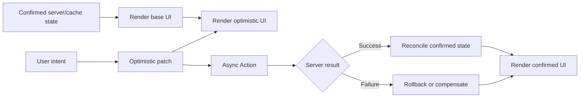

# Part 076 — `useOptimistic` and Latency Compensation

> Optimistic UI bukan “berbohong kepada user”.
>
> Optimistic UI adalah **latency compensation**: UI menampilkan prediksi transisi yang sangat mungkin berhasil, sambil tetap siap reconcile dengan authority sebenarnya.

Dalam aplikasi distributed, user intent berjalan lebih cepat daripada round-trip network. Kalau setiap klik menunggu server sebelum UI berubah, aplikasi terasa lambat. Tetapi kalau UI terlalu agresif, aplikasi bisa menampilkan state yang tidak pernah disetujui server.

`useOptimistic` adalah React 19 primitive untuk memodelkan state sementara selama async action berjalan. Ia bukan pengganti server-state cache, bukan global optimistic transaction engine, dan bukan cara untuk menghindari conflict handling.

Bagian ini membahas cara memakai optimistic UI dengan benar:

```txt
base state
→ optimistic patch
→ pending action
→ server result
→ reconciliation
→ rollback / compensate / confirm
```

---

## 1. Mental Model: Base State + Pending Patch

State authoritative biasanya berasal dari server/cache.

```txt
baseState = data terakhir yang sudah confirmed
```

Optimistic state adalah proyeksi sementara:

```txt
optimisticState = baseState + pending optimistic patches
```

Diagram:



Hal yang harus diingat:

```txt
Optimistic state bukan source of truth.
Optimistic state adalah speculative overlay.
```

Kalau overlay berubah menjadi source of truth, bug konsistensi tinggal menunggu waktu.

---

## 2. API `useOptimistic`

Bentuk dasar:

```tsx
const [optimisticState, addOptimistic] = useOptimistic(state, reducer);
```

Kontraknya:

```txt
value:
  state dasar ketika tidak ada action pending

reducer:
  pure function untuk menghitung optimistic state dari current state + optimistic action

optimisticState:
  state yang dirender sekarang

addOptimistic:
  function untuk menambahkan optimistic update selama Action berlangsung
```

Contoh minimal:

```tsx
function LikeButton({
  liked,
  updateLiked,
}: {
  liked: boolean;
  updateLiked: (liked: boolean) => Promise<void>;
}) {
  const [optimisticLiked, setOptimisticLiked] = useOptimistic(liked);

  async function submitAction() {
    setOptimisticLiked(!optimisticLiked);
    await updateLiked(!optimisticLiked);
  }

  return (
    <form action={submitAction}>
      <button type="submit">
        {optimisticLiked ? "Unlike" : "Like"}
      </button>
    </form>
  );
}
```

Namun contoh di atas terlalu naif untuk production karena membaca `optimisticLiked` untuk menentukan next value bisa salah saat ada multiple pending intent. Lebih baik kirim action eksplisit ke reducer.

---

## 3. Reducer Optimistic Lebih Aman

Gunakan reducer agar optimistic patch berbentuk event.

```tsx
type Todo = {
  id: string;
  text: string;
  completed: boolean;
  optimistic?: boolean;
};

type OptimisticTodoAction =
  | { type: "add"; todo: Todo }
  | { type: "toggle"; id: string }
  | { type: "remove"; id: string };

function optimisticTodoReducer(
  todos: Todo[],
  action: OptimisticTodoAction
): Todo[] {
  switch (action.type) {
    case "add":
      return [action.todo, ...todos];

    case "toggle":
      return todos.map((todo) =>
        todo.id === action.id
          ? { ...todo, completed: !todo.completed }
          : todo
      );

    case "remove":
      return todos.filter((todo) => todo.id !== action.id);
  }
}
```

Component:

```tsx
function TodoList({
  todos,
  createTodo,
}: {
  todos: Todo[];
  createTodo: (input: { text: string; clientId: string }) => Promise<Todo>;
}) {
  const [optimisticTodos, addOptimisticTodo] = useOptimistic(
    todos,
    optimisticTodoReducer
  );

  async function createTodoAction(formData: FormData) {
    const text = String(formData.get("text") ?? "").trim();

    if (!text) {
      return;
    }

    const clientId = crypto.randomUUID();

    addOptimisticTodo({
      type: "add",
      todo: {
        id: clientId,
        text,
        completed: false,
        optimistic: true,
      },
    });

    await createTodo({ text, clientId });
  }

  return (
    <>
      <form action={createTodoAction}>
        <input name="text" />
        <button>Add</button>
      </form>

      <ul>
        {optimisticTodos.map((todo) => (
          <li key={todo.id} aria-busy={todo.optimistic}>
            {todo.text}
            {todo.optimistic && " (saving...)"}
          </li>
        ))}
      </ul>
    </>
  );
}
```

Reducer membuat optimistic update menjadi:

```txt
deterministic
testable
composable
independent dari stale closure
```

---

## 4. Kapan Optimistic UI Layak Dipakai

Optimistic UI cocok ketika:

```txt
- success rate tinggi
- action reversible atau failure mudah dijelaskan
- user intent jelas
- server conflict jarang atau bisa direconcile
- action latency terasa mengganggu
- UI bisa menandai pending/speculative state
```

Contoh cocok:

```txt
like/unlike
mark as read
add comment
rename draft
toggle preference
reorder local list
archive notification
save lightweight setting
```

Contoh harus hati-hati:

```txt
payment
approval workflow legal/regulatory
permission-sensitive action
inventory reservation
case status transition
delete irreversible record
multi-actor conflict-heavy edit
```

Untuk domain high-stakes, optimistic UI masih mungkin, tetapi harus punya:

```txt
precondition
expected version
audit event
server rejection rendering
compensation path
clear pending indicator
```

---

## 5. Optimistic UI Bukan Satu Pola

Ada beberapa strategi latency compensation.

| Strategi | Contoh | Risiko |
|---|---|---|
| Immediate optimistic update | Like count naik langsung | Harus rollback jika gagal |
| Optimistic append | Comment muncul langsung | Temp ID mapping |
| Optimistic remove | Item hilang langsung | User bingung jika rollback |
| Optimistic disable | Button berubah pending, data belum berubah | UX lebih aman, kurang cepat |
| Optimistic reorder | Drag-and-drop urutan berubah | Conflict dengan server ordering |
| Optimistic navigation | Pindah halaman setelah submit | Bisa perlu recovery route |
| Pessimistic but responsive | Skeleton/pending only | Lebih aman, terasa lambat |

Jangan memakai optimistic update sebagai default. Gunakan berdasarkan domain semantics.

---

## 6. Rollback, Reconciliation, dan Compensation

Ketika server result datang, ada tiga kemungkinan.

### 6.1 Confirm

Server menerima action dan state cocok dengan optimistic prediction.

```txt
optimistic state ≈ confirmed state
```

UI cukup reconcile dengan data authoritative baru.

### 6.2 Rollback

Server menolak action dan UI kembali ke base state.

```txt
optimistic add comment
→ server rejects
→ remove optimistic comment
→ show error
```

`useOptimistic` membantu karena optimistic state hanya hidup selama action pending. Tetapi error UX tetap harus didesain.

### 6.3 Compensation

Rollback langsung kadang tidak cukup.

Contoh:

```txt
user clicks Approve
UI shows Approved pending
server says case already escalated
```

Rollback ke state lama saja tidak menjelaskan apa yang terjadi. UI perlu compensation message:

```txt
"This case was escalated by another reviewer before your approval was applied."
```

Untuk workflow domain, compensation lebih penting daripada rollback.

---

## 7. Temporary ID dan Server ID Mapping

Optimistic append butuh temporary ID.

```tsx
const clientId = crypto.randomUUID();

addOptimisticComment({
  type: "add",
  comment: {
    id: clientId,
    clientId,
    body,
    status: "pending",
  },
});

const saved = await createComment({
  clientId,
  body,
});
```

Backend sebaiknya menerima `clientId`/idempotency key agar:

```txt
- duplicate request bisa dedupe
- response bisa dikaitkan ke optimistic item
- retry tidak membuat item ganda
```

Server response:

```ts
type CreateCommentResponse = {
  clientId: string;
  commentId: string;
  body: string;
  createdAt: string;
};
```

Reconciliation:

```txt
clientId temp-123 → server id comment-987
```

Jika memakai server-state cache, update/invalidate cache sehingga base state berikutnya memakai server ID.

---

## 8. Optimistic Update dengan TanStack Query vs `useOptimistic`

`useOptimistic` bekerja sebagai render-level optimistic overlay.

TanStack Query optimistic update bekerja di cache-level, biasanya lewat `onMutate`, rollback context, dan cache update.

| Pertanyaan | `useOptimistic` | TanStack Query optimistic update |
|---|---|---|
| Scope | Component/subtree render overlay | Query cache global/scope QueryClient |
| Source | Base prop/state | Query cache |
| Bagus untuk | Form/action-local optimistic UI | Server-state cache mutation |
| Rollback | Action pending overlay hilang/reconcile | Manual rollback dari snapshot/context |
| Sharing | Tidak otomatis terlihat di component lain | Terlihat bagi semua subscriber query |
| Complexity | Lebih ringan | Lebih kuat untuk shared server state |

Decision:

```txt
Jika optimistic state hanya diperlukan di satu component/form:
  useOptimistic

Jika optimistic update harus terlihat di banyak subscriber server-state:
  cache-level optimistic update

Jika workflow punya banyak step/conflict:
  state machine + server-state cache + explicit compensation
```

---

## 9. Pattern: Optimistic Comment Form

```tsx
type Comment = {
  id: string;
  body: string;
  authorName: string;
  status: "confirmed" | "pending" | "failed";
};

type OptimisticCommentAction =
  | { type: "add-pending"; comment: Comment }
  | { type: "mark-failed"; id: string };

function optimisticCommentsReducer(
  comments: Comment[],
  action: OptimisticCommentAction
): Comment[] {
  switch (action.type) {
    case "add-pending":
      return [action.comment, ...comments];

    case "mark-failed":
      return comments.map((comment) =>
        comment.id === action.id
          ? { ...comment, status: "failed" }
          : comment
      );
  }
}

function CommentsPanel({
  comments,
  currentUser,
  createComment,
}: {
  comments: Comment[];
  currentUser: { name: string };
  createComment: (input: { body: string; clientId: string }) => Promise<void>;
}) {
  const [optimisticComments, addOptimisticComment] = useOptimistic(
    comments,
    optimisticCommentsReducer
  );

  async function addCommentAction(formData: FormData) {
    const body = String(formData.get("body") ?? "").trim();

    if (!body) {
      return;
    }

    const clientId = crypto.randomUUID();

    addOptimisticComment({
      type: "add-pending",
      comment: {
        id: clientId,
        body,
        authorName: currentUser.name,
        status: "pending",
      },
    });

    try {
      await createComment({ body, clientId });
    } catch {
      addOptimisticComment({
        type: "mark-failed",
        id: clientId,
      });
    }
  }

  return (
    <section>
      <form action={addCommentAction}>
        <textarea name="body" />
        <button>Post comment</button>
      </form>

      <ul>
        {optimisticComments.map((comment) => (
          <li key={comment.id} aria-busy={comment.status === "pending"}>
            <p>{comment.body}</p>
            <small>
              {comment.authorName}
              {comment.status === "pending" && " · sending"}
              {comment.status === "failed" && " · failed"}
            </small>
          </li>
        ))}
      </ul>
    </section>
  );
}
```

Catatan penting:

```txt
This example shows local failure marking.
In many real apps, failed state should be separate from confirmed comments.
```

Jika action gagal dan base `comments` tidak berubah, overlay pending akan hilang setelah action selesai. Untuk mempertahankan failed draft, simpan failed draft di local state atau form state terpisah. Jangan paksa `useOptimistic` menjadi persistent error store.

---

## 10. Pattern: Optimistic Toggle dengan Conflict Guard

Toggle terlihat sederhana, tetapi sering punya bug.

Naif:

```tsx
setOptimisticLiked(!liked);
await updateLiked(!liked);
```

Masalah:

```txt
liked bisa stale
dua klik cepat bisa menghasilkan urutan salah
server bisa punya state berbeda
```

Lebih baik kirim desired state dan expected version.

```tsx
type LikeState = {
  liked: boolean;
  count: number;
  version: number;
};

type OptimisticLikeAction = {
  type: "set-liked";
  liked: boolean;
};

function optimisticLikeReducer(
  state: LikeState,
  action: OptimisticLikeAction
): LikeState {
  if (state.liked === action.liked) {
    return state;
  }

  return {
    ...state,
    liked: action.liked,
    count: state.count + (action.liked ? 1 : -1),
  };
}

function LikeButton({
  value,
  saveLike,
}: {
  value: LikeState;
  saveLike: (input: { liked: boolean; expectedVersion: number }) => Promise<void>;
}) {
  const [optimisticValue, addOptimistic] = useOptimistic(
    value,
    optimisticLikeReducer
  );

  async function setLikedAction(formData: FormData) {
    const liked = formData.get("liked") === "true";

    addOptimistic({
      type: "set-liked",
      liked,
    });

    await saveLike({
      liked,
      expectedVersion: value.version,
    });
  }

  return (
    <form action={setLikedAction}>
      <input
        type="hidden"
        name="liked"
        value={String(!optimisticValue.liked)}
      />
      <button type="submit">
        {optimisticValue.liked ? "Unlike" : "Like"} · {optimisticValue.count}
      </button>
    </form>
  );
}
```

`expectedVersion` bukan UI nicety. Itu conflict boundary.

---

## 11. Multiple Pending Optimistic Actions

Bayangkan user membuat 3 comment cepat.

```txt
base comments: [A, B]
pending optimistic: [C*, D*, E*]
```

Reducer harus deterministic terhadap urutan patches.

```txt
base + patch1 + patch2 + patch3
```

Risiko:

```txt
- response server datang tidak berurutan
- temp ID mapping bentrok
- rollback patch lama menghapus patch baru
- invalidation refetch menghapus optimistic overlay terlalu cepat
```

Guideline:

```txt
- gunakan clientId unik per command
- jangan rollback berdasarkan posisi list
- reconcile berdasarkan identity
- response harus membawa clientId/idempotency key
- jangan mengandalkan urutan network response
```

Untuk shared cache-level optimistic update, simpan rollback snapshot per mutation, bukan global snapshot tunggal yang mudah menimpa mutation lain.

---

## 12. Optimistic Delete

Optimistic delete memberi UX cepat tetapi risiko tinggi.

```txt
item hilang
server gagal
item muncul lagi
user bingung
```

Alternatif yang lebih aman:

```txt
mark item as "deleting..."
disable interactions
hide visually after short delay
allow undo
remove after confirmed success
```

Contoh:

```tsx
type Row = {
  id: string;
  name: string;
  status: "active" | "deleting";
};

type OptimisticRowAction =
  | { type: "mark-deleting"; id: string }
  | { type: "remove"; id: string };

function optimisticRowsReducer(rows: Row[], action: OptimisticRowAction): Row[] {
  switch (action.type) {
    case "mark-deleting":
      return rows.map((row) =>
        row.id === action.id ? { ...row, status: "deleting" } : row
      );

    case "remove":
      return rows.filter((row) => row.id !== action.id);
  }
}
```

Untuk destructive action, sering lebih baik memakai confirmation + pending mark daripada langsung hilang.

---

## 13. Optimistic Workflow untuk Domain High-Stakes

Untuk approval/regulatory UI, optimistic UI harus konservatif.

Jangan:

```txt
Klik Approve → langsung tampil Approved final
```

Lebih aman:

```txt
Klik Approve → tampil "Approval pending..."
server success → tampil Approved
server rejects → tampil reason + current server state
```

State model:

```ts
type CaseStatusView =
  | { tag: "draft" }
  | { tag: "pending_approval"; optimistic: true; submittedAt: string }
  | { tag: "approved"; version: number }
  | { tag: "rejected"; reason: string; serverStatus: string };
```

Prinsip:

```txt
Semakin tinggi consequence domain, semakin eksplisit optimistic marker.
```

Optimistic UI boleh cepat, tetapi tidak boleh mengaburkan status authoritative.

---

## 14. Visual Language untuk Optimistic State

Optimistic state harus terlihat berbeda bila domain menuntut kepastian.

Pattern:

```txt
- pending badge
- dimmed row
- spinner inline kecil
- "sending..." text
- disable destructive secondary actions
- allow cancel/undo bila mungkin
- show "sync failed" state jika perlu persist
```

Jangan gunakan style yang membuat pending state terlihat final jika aksi punya risiko gagal.

Contoh:

```tsx
<li data-status={comment.status}>
  <p>{comment.body}</p>

  {comment.status === "pending" && (
    <small aria-live="polite">Sending...</small>
  )}

  {comment.status === "failed" && (
    <button type="button">Retry</button>
  )}
</li>
```

---

## 15. Error Handling: Rollback Saja Tidak Cukup

Jika optimistic action gagal, user perlu tahu:

```txt
Apa yang gagal?
Apakah data saya hilang?
Apakah bisa retry?
Apakah server state berubah?
```

Pola:

| Failure | UX |
|---|---|
| Network transient | Keep draft + retry |
| Validation error | Return field errors |
| Permission error | Explain not allowed, refresh capability |
| Conflict/stale version | Show server state and ask user to retry/reapply |
| Duplicate/idempotent success | Treat as success |
| Timeout unknown outcome | Show "status unknown" and refetch |

Timeout adalah kasus berbahaya:

```txt
client tidak tahu command berhasil atau gagal
```

Untuk action penting, backend harus punya idempotency key dan queryable command status.

---

## 16. Optimistic UI dan Cache Invalidation

Setelah optimistic action, jangan asal invalidate semua.

Impact map:

```txt
CreateComment(postId)
  - invalidate ["post", postId, "comments"]
  - maybe update ["post", postId, "summary"]
  - maybe invalidate ["feed"]

LikePost(postId)
  - update ["post", postId]
  - maybe invalidate ["feed"]
  - maybe not refetch immediately if count can be reconciled later
```

Dengan `useOptimistic`, base state sering datang dari props/query:

```tsx
const { data: comments } = useQuery(...);

const [optimisticComments, addOptimisticComment] = useOptimistic(
  comments ?? [],
  reducer
);
```

Jika query refetch menghasilkan data baru saat action masih pending, optimistic state harus tetap masuk akal. Reducer harus tahan terhadap base state yang berubah.

Rule:

```txt
Optimistic reducer harus pure dan identity-based.
```

Jangan bergantung pada index.

---

## 17. Stale Base State

Optimistic update dibangun dari base state. Kalau base state stale, optimistic result bisa salah.

Contoh:

```txt
base count = 10
other user already liked, server count = 11
you optimistic like → 11
server confirmed count → 12
```

UI harus reconcile dengan server result.

Strategi:

```txt
- show approximate count while pending
- server response returns authoritative aggregate
- refetch after success
- use expected version for conflict-sensitive actions
```

Jangan memperlakukan optimistic aggregate sebagai angka final.

---

## 18. Optimistic Queue dan Idempotency

Setiap optimistic command idealnya punya identity:

```ts
type OptimisticCommand = {
  clientCommandId: string;
  type: "create-comment";
  payload: {
    body: string;
  };
};
```

Manfaat:

```txt
- dedupe duplicate submit
- correlate server response
- retry safely
- audit user intent
- debug optimistic mismatch
```

Untuk domain penting, simpan command ID di backend:

```txt
clientCommandId → command result
```

Jika request diulang dengan ID sama, backend mengembalikan result yang sama.

---

## 19. Build From Scratch: Tiny Optimistic Overlay Model

Untuk memahami `useOptimistic`, bayangkan runtime sederhana:

```ts
type Patch<S, A> = {
  id: string;
  action: A;
};

function applyOptimisticPatches<S, A>(
  base: S,
  patches: Patch<S, A>[],
  reducer: (state: S, action: A) => S
): S {
  return patches.reduce(
    (state, patch) => reducer(state, patch.action),
    base
  );
}
```

Model konseptual:

```txt
base state changes when parent/server/cache updates
patch queue exists while action pending
render uses base + patches
patch removed/reconciled when action resolves
```

React mengelola detail lifecycle. Engineer tetap harus membuat reducer yang pure dan patch yang benar.

---

## 20. Testing Optimistic UI

Test optimistic UI bukan hanya klik lalu expect DOM berubah.

### Reducer test

```ts
it("optimistically appends comment", () => {
  const result = optimisticCommentsReducer([], {
    type: "add-pending",
    comment: {
      id: "client-1",
      body: "Hello",
      authorName: "Ari",
      status: "pending",
    },
  });

  expect(result).toEqual([
    {
      id: "client-1",
      body: "Hello",
      authorName: "Ari",
      status: "pending",
    },
  ]);
});
```

### Pending render test

```tsx
it("shows pending comment immediately", async () => {
  const createComment = vi.fn(
    () => new Promise<void>((resolve) => setTimeout(resolve, 1000))
  );

  render(
    <CommentsPanel
      comments={[]}
      currentUser={{ name: "Ari" }}
      createComment={createComment}
    />
  );

  await user.type(screen.getByRole("textbox"), "Hello");
  await user.click(screen.getByRole("button", { name: /post/i }));

  expect(screen.getByText("Hello")).toBeInTheDocument();
  expect(screen.getByText(/sending/i)).toBeInTheDocument();
});
```

### Failure test

```tsx
it("shows recovery UI when optimistic command fails", async () => {
  const createComment = vi.fn().mockRejectedValue(new Error("Network error"));

  render(
    <CommentsPanel
      comments={[]}
      currentUser={{ name: "Ari" }}
      createComment={createComment}
    />
  );

  await user.type(screen.getByRole("textbox"), "Hello");
  await user.click(screen.getByRole("button", { name: /post/i }));

  expect(await screen.findByText(/failed/i)).toBeInTheDocument();
});
```

### Conflict test

```txt
given case version 10
when user submits approve with expectedVersion 10
and server returns stale_version with current version 11
then UI shows conflict message and authoritative server status
```

---

## 21. Observability

Optimistic bug sulit dilacak tanpa event log.

Log minimal:

```txt
optimistic_command_created
optimistic_command_sent
optimistic_command_confirmed
optimistic_command_rejected
optimistic_command_reconciled
optimistic_command_timeout
```

Data:

```ts
type OptimisticEvent = {
  clientCommandId: string;
  commandType: string;
  entityType: string;
  entityId?: string;
  optimisticPatchType: string;
  startedAt: string;
  completedAt?: string;
  result: "confirmed" | "rejected" | "timeout" | "unknown";
};
```

Untuk UI regulatory/complex case management, event ini juga membantu menjelaskan:

```txt
UI menampilkan pending approval karena user menekan approve pada 10:12:03,
tetapi server menolak pada 10:12:04 karena case version sudah berubah.
```

---

## 22. Failure Modes

| Failure mode | Symptom | Fix |
|---|---|---|
| Optimistic state jadi source of truth | UI berbeda dari server setelah refetch | Treat optimistic as overlay |
| No temp ID | Pending item duplikat atau tidak bisa reconcile | Use clientId/idempotency key |
| Rollback by index | Item salah hilang saat list berubah | Reconcile by identity |
| No visible pending marker | User mengira state final | Show pending/speculative status |
| Optimistic destructive action terlalu agresif | Item hilang lalu muncul lagi | Mark deleting, delay remove, allow undo |
| Missing conflict handling | Server reject terasa seperti bug | Model stale version/domain rejection |
| Cache invalidation terlalu luas | UI flicker/refetch mahal | Use mutation impact map |
| Cache invalidation terlalu sempit | Confirmed data stale | Invalidate affected query keys |
| No idempotency | Retry membuat duplicate command | Backend idempotency key |
| Stale closure | Optimistic next value salah | Use reducer/action payload |
| Multi-tab mismatch | Tab lain tidak tahu pending/confirmed state | Broadcast/refetch/cross-tab policy |
| Unauthorized optimistic success | UI menampilkan aksi terlarang | Permission guard + server rejection handling |
| Timeout unknown | User tidak tahu action berhasil/gagal | Command status query/idempotency |

---

## 23. Decision Matrix

| Situation | Recommended approach |
|---|---|
| Single local form append | `useOptimistic` |
| Shared server-state list | TanStack Query optimistic cache update |
| High-stakes workflow | Pending marker + server confirmation |
| Irreversible delete | Pessimistic or undo-first design |
| Like/bookmark toggle | Optimistic with desired state and retry |
| Multi-actor entity edit | Expected version + conflict UI |
| Comment/chat send | Optimistic append + temp ID |
| Drag reorder | Optimistic order + server canonical order |
| Payment/financial transfer | Usually pessimistic confirmation |
| Permission-sensitive command | Conservative optimistic marker, never final success |

---

## 24. Production Checklist

```txt
[ ] Optimistic state clearly separated from confirmed state
[ ] Reducer is pure and identity-based
[ ] Pending/speculative UI is visible when domain requires it
[ ] Every optimistic command has clientCommandId/idempotency key when needed
[ ] Temp ID maps to server ID
[ ] Rollback/reconciliation handles out-of-order responses
[ ] Domain conflict has explicit UI
[ ] Failure state tells user what happened and what to do
[ ] Cache impact map is defined
[ ] Server response returns enough data to reconcile
[ ] Destructive actions are not over-optimistic
[ ] Tests cover success, failure, race, and conflict
[ ] Observability records optimistic lifecycle
```

---

## 25. Key Takeaways

```txt
useOptimistic gives React a native way to render speculative state during async actions.
```

Tetapi optimistic UI yang benar bukan hanya tentang “UI cepat”.

Ia butuh:

```txt
source of truth discipline
identity
idempotency
reconciliation
rollback/compensation
conflict handling
accessibility
observability
```

Aturan sederhananya:

```txt
Optimistic UI boleh cepat.
Authoritative state tetap harus benar.
```

Di Part 077, kita akan menutup Module 7 dengan failure modes server state: lost update, stale UI, duplicate submit, inconsistent cache, dan bug yang muncul ketika client, cache, optimistic overlay, dan server authority tidak dirancang sebagai satu sistem.

---

## References

- React API Reference — `useOptimistic`
- React 19 release notes — Actions and optimistic updates
- React API Reference — `useActionState`
- React DOM API Reference — `<form>`
- React API Reference — `useTransition`
- TanStack Query Docs — Optimistic Updates
- TanStack Query Docs — Mutations
