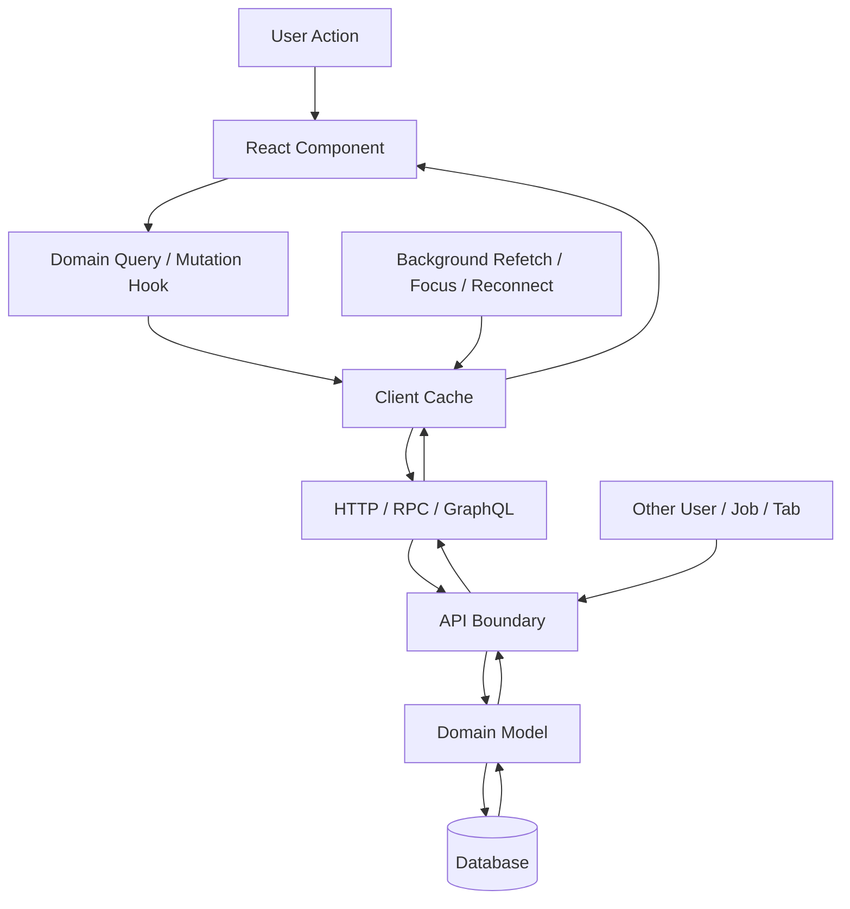
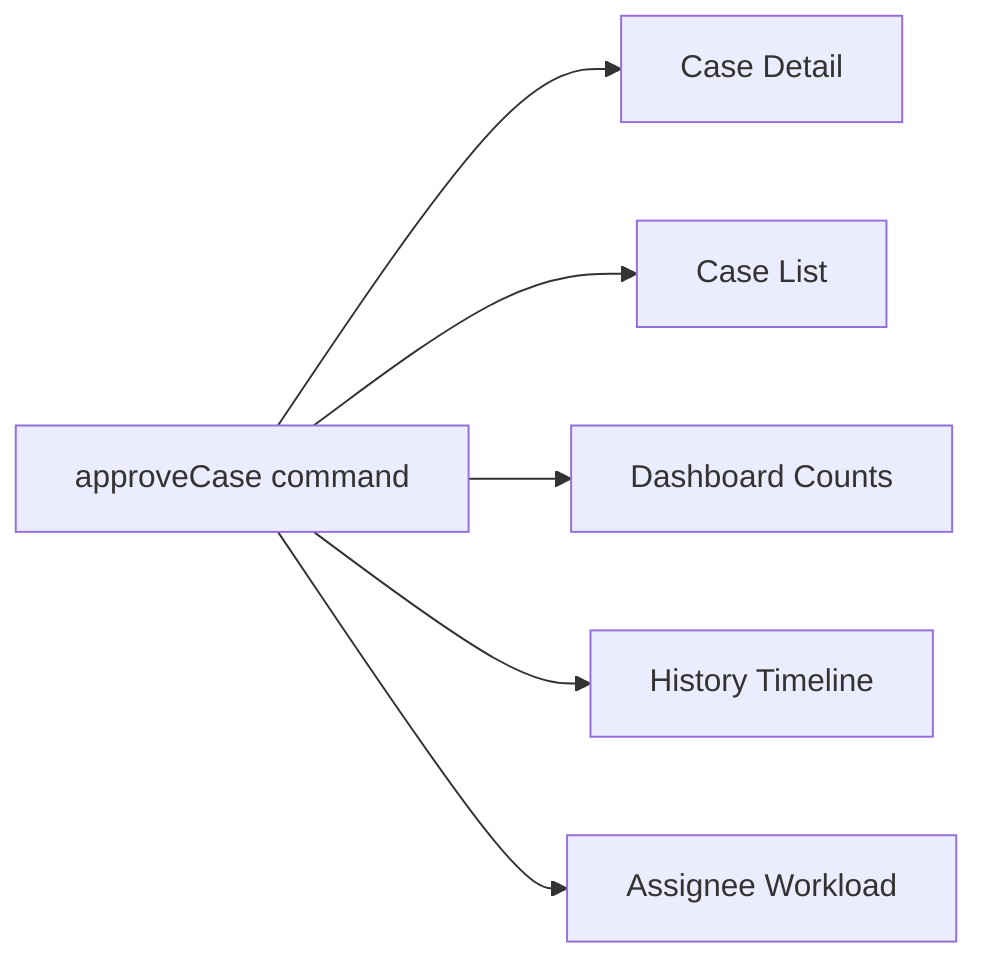
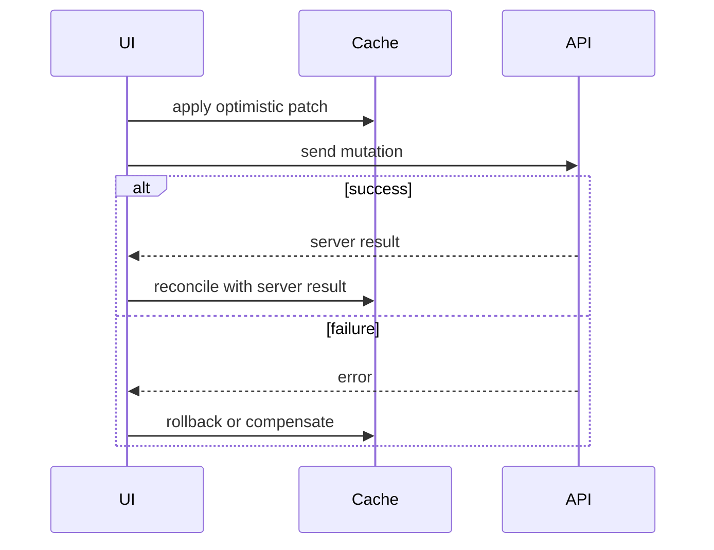

# Part 077 — Server State Failure Modes

Server state is not difficult because fetching JSON is difficult.

Server state is difficult because the UI is displaying a **temporary local observation** of an authoritative system that can change independently, fail independently, and disagree with what the user just attempted to do.

A small React app can survive with this mental model:

```tsx
const [data, setData] = useState(null);
const [loading, setLoading] = useState(false);
const [error, setError] = useState(null);
```

A production React system cannot.

At scale, the problem becomes:

```txt
Which server value did this component observe?
When was it observed?
Is it still fresh enough?
Who else can mutate it?
Which cached projections are affected by this mutation?
Can the same request complete out of order?
Can the user perform the command twice?
Can another tab mutate the same entity?
Can stale permissions leak an illegal action?
Can optimistic UI lie longer than allowed?
Can pagination drift under concurrent writes?
Can hydration show a different truth than the client cache?
```

This part is a failure-mode catalog. The goal is not to memorize every bug. The goal is to develop a diagnostic map so that when a server-state bug appears, you can classify it quickly and repair the correct boundary.

---

## 1. Server State Failure Model

A server-state bug usually appears as a UI bug, but its root is often a broken contract between these layers:



Server state is hard because updates can enter this graph from many directions:

- The current user performs a mutation.
- Another user changes the same entity.
- A background job changes data.
- Another browser tab changes data.
- A refetch returns older data after a newer response.
- A mutation succeeds but an invalidation misses one affected query.
- The server accepts a command but returns a projection that differs from the optimistic assumption.
- The UI hydrates with data that is already stale on the client.

React components are not the authority. The cache is not the authority. The backend is usually the authority, but even the backend may expose several projections with different freshness, consistency, and permission semantics.

### Core invariant

```txt
A React component should never pretend cached server data is locally owned state.
```

It can display server data. It can derive from server data. It can optimistically overlay server data. It can issue commands. But it should not silently become the owner of server truth.

---

## 2. Failure Taxonomy

Use this taxonomy when debugging.

| Failure family | Symptom | Root cause | Typical fix |
|---|---|---|---|
| Freshness failure | UI shows old data | stale cache, missing refetch, wrong `staleTime` | invalidate, refetch policy, push/event sync |
| Identity failure | wrong cache reused | query key missing variable | redesign query key factory |
| Race failure | older request overwrites newer result | no cancellation/request identity | abort, ignore stale response, query library |
| Invalidation failure | one screen updates, another stays stale | mutation impact map incomplete | explicit invalidation policy |
| Optimistic failure | UI lies after failed mutation | no rollback/reconciliation | `onMutate` rollback, server response merge |
| Lost update | user overwrites another update | no version/precondition | ETag/version/conflict handling |
| Duplicate command | double submit creates duplicate entity | no idempotency or pending guard | idempotency key, disable/serialize mutation |
| Projection drift | list/detail/count disagree | denormalized views not invalidated together | projection-aware invalidation |
| Pagination drift | duplicates/missing rows | offset pagination under writes | cursor pagination, stable sort, refetch windows |
| Permission drift | user sees stale action | cached permission outlives authority | invalidate permission snapshot, server enforce |
| Hydration mismatch | server HTML disagrees with client | different cache seed or auth state | dehydrate/hydrate correctly, request-scoped clients |
| Offline failure | commands vanish or replay incorrectly | no offline queue semantics | durable mutation queue, idempotent replay |

Do not start by asking “which library should we use?” Start by asking “which failure family is this?”

---

## 3. Stale UI Failure

### The bug

The user performs an action. The UI appears successful. A different screen still shows the old value.

Example:

```txt
Case detail page: status = APPROVED
Case list page: status = PENDING
Dashboard count: pending = 18, should be 17
```

This is not one bug. It is three projections of one domain transition.

### Root cause

The mutation updated or invalidated only one cache entry.

```tsx
await approveCase(caseId);
queryClient.invalidateQueries({ queryKey: ['case', caseId] });
```

This refreshes detail, but not:

```txt
['cases', 'list', filters]
['dashboard', 'case-counts']
['case-history', caseId]
['assignee-workload', assigneeId]
['notifications']
```

### Production rule

Every mutation needs an **impact map**.

```ts
const caseMutationImpact = {
  approve: (caseId: CaseId) => [
    caseKeys.detail(caseId),
    caseKeys.lists(),
    dashboardKeys.caseCounts(),
    auditKeys.caseHistory(caseId),
  ],
};
```

Then the mutation code uses the impact map, not ad-hoc key strings.

```tsx
function useApproveCase() {
  const queryClient = useQueryClient();

  return useMutation({
    mutationFn: approveCase,
    onSuccess: (_, variables) => {
      for (const key of caseMutationImpact.approve(variables.caseId)) {
        queryClient.invalidateQueries({ queryKey: key });
      }
    },
  });
}
```

### Better mental model

A mutation does not update “a component”.

A mutation invalidates a **domain projection set**.



### Checklist

Before shipping a mutation, answer:

```txt
Which entity changed?
Which list projections include that entity?
Which aggregate counts include it?
Which permission/action snapshots depend on it?
Which related entity projections should refresh?
Which route loaders or server-rendered pages cache it?
```

---

## 4. Query Identity Failure

### The bug

Changing filters does not change data, or two users see each other's cached result in the same app shell.

### Root cause

The query key does not encode the actual identity of the data.

Bad:

```tsx
useQuery({
  queryKey: ['cases'],
  queryFn: () => searchCases({ status, assigneeId, page }),
});
```

React Query/TanStack Query sees one cache address: `['cases']`. Your app sees many logical requests.

Correct:

```tsx
useQuery({
  queryKey: ['cases', 'search', { status, assigneeId, page }],
  queryFn: () => searchCases({ status, assigneeId, page }),
});
```

Better with a key factory:

```ts
export const caseKeys = {
  all: ['cases'] as const,
  detail: (caseId: string) => [...caseKeys.all, 'detail', caseId] as const,
  search: (params: CaseSearchParams) =>
    [...caseKeys.all, 'search', canonicalizeCaseSearchParams(params)] as const,
};
```

### Hidden variables

Query identity is not only visible UI filters.

Common missing variables:

```txt
tenantId
locale
timezone
current organization
permission scope
feature flag affecting projection
API version
currency
sort field
sort direction
page/cursor
search text after normalization
include/exclude fields
```

### Failure signature

If you see this pattern:

```txt
Screen A loaded data with parameter X.
Screen B asks for parameter Y.
Screen B briefly or permanently shows X.
```

Assume query key identity is incomplete until proven otherwise.

---

## 5. Race Condition Failure

### The bug

User types quickly. The UI displays result for an older search.

```txt
User typed: "compliance"
Response for "com" arrives after response for "compliance"
UI shows results for "com"
```

### Bad effect-based implementation

```tsx
useEffect(() => {
  setLoading(true);

  fetchCases(searchText).then((result) => {
    setData(result);
    setLoading(false);
  });
}, [searchText]);
```

Nothing prevents an older response from winning.

### Minimal guard

```tsx
useEffect(() => {
  let ignore = false;

  async function run() {
    setLoading(true);
    const result = await fetchCases(searchText);

    if (!ignore) {
      setData(result);
      setLoading(false);
    }
  }

  run();

  return () => {
    ignore = true;
  };
}, [searchText]);
```

This avoids committing stale response, but still does not solve caching, deduplication, SSR, retries, or invalidation.

### Abortable implementation

```tsx
useEffect(() => {
  const controller = new AbortController();

  async function run() {
    setLoading(true);

    try {
      const result = await fetchCases(searchText, {
        signal: controller.signal,
      });
      setData(result);
    } catch (error) {
      if (!controller.signal.aborted) {
        setError(error);
      }
    } finally {
      if (!controller.signal.aborted) {
        setLoading(false);
      }
    }
  }

  run();

  return () => controller.abort();
}, [searchText]);
```

### Query-library implementation

```tsx
useQuery({
  queryKey: caseKeys.search({ searchText }),
  queryFn: ({ signal }) => fetchCases({ searchText, signal }),
});
```

The query key separates identities. The signal supports cancellation. The cache avoids repeated fetches for the same identity.

### Design rule

```txt
Request identity must match state identity.
```

If the UI state says “searchText = compliance”, the committed server-state result must belong to that same identity.

---

## 6. Lost Update Failure

### The bug

Two users edit the same resource. User B unknowingly overwrites User A.

```txt
10:00 User A opens case note version 3
10:01 User B opens case note version 3
10:02 User A saves version 4
10:03 User B saves based on version 3
10:03 Server accepts B, A's edit disappears
```

This cannot be solved by React alone. It is a backend contract problem surfaced in UI.

### Weak client-only approach

```tsx
await saveNote({ id, body });
```

### Better command contract

```tsx
await saveNote({
  id,
  body,
  expectedVersion: note.version,
});
```

Server behavior:

```txt
if currentVersion !== expectedVersion:
  return 409 Conflict with current server value
else:
  save and increment version
```

### UI conflict model

```ts
type SaveNoteResult =
  | { type: 'saved'; note: Note }
  | { type: 'conflict'; serverNote: Note; attemptedBody: string };
```

The UI should not collapse conflict into generic error.

```tsx
if (result.type === 'conflict') {
  openConflictResolutionDialog({
    serverNote: result.serverNote,
    attemptedBody: result.attemptedBody,
  });
}
```

### Rule

If a command can overwrite durable business state, it needs a concurrency contract:

```txt
version number
ETag / If-Match
updatedAt precondition
idempotency key
operation token
server-side merge policy
```

React can display the conflict. React cannot invent correctness after the server accepts lost updates.

---

## 7. Duplicate Command Failure

### The bug

User double-clicks submit. Two records are created.

### Weak UI-only guard

```tsx
<button disabled={mutation.isPending}>Create</button>
```

This helps UX but is not a correctness guarantee.

The duplicate may still happen because:

```txt
double tap before disabled renders
browser retry
network retry
user opens another tab
mobile reconnect replay
back button resubmission
server timeout after successful write
```

### Correct architecture

Use an idempotency key for commands that create durable side effects.

```tsx
const commandId = crypto.randomUUID();

await createCase({
  commandId,
  payload,
});
```

Server invariant:

```txt
Same commandId + same actor + same operation = same result, not duplicate effect.
```

### Client-side mutation state

```tsx
const createCaseMutation = useMutation({
  mutationFn: createCase,
  scope: { id: 'create-case' },
});
```

Serializing or disabling in the client reduces accidental duplicate attempts. Idempotency in the server prevents duplicate durable effects.

### Rule

```txt
Disable button is UX.
Idempotency is correctness.
```

---

## 8. Optimistic Update Failure

Optimistic UI is not “pretend success”.

Optimistic UI is a temporary overlay with a reconciliation contract.



### Failure: no rollback

```tsx
onMutate: ({ caseId }) => {
  queryClient.setQueryData(caseKeys.detail(caseId), old => ({
    ...old,
    status: 'APPROVED',
  }));
}
```

If the mutation fails, the UI remains approved.

### Safer pattern

```tsx
useMutation({
  mutationFn: approveCase,
  onMutate: async ({ caseId }) => {
    await queryClient.cancelQueries({ queryKey: caseKeys.detail(caseId) });

    const previous = queryClient.getQueryData(caseKeys.detail(caseId));

    queryClient.setQueryData(caseKeys.detail(caseId), (old: Case | undefined) => {
      if (!old) return old;
      return { ...old, status: 'APPROVING' };
    });

    return { previous };
  },
  onError: (_error, { caseId }, context) => {
    queryClient.setQueryData(caseKeys.detail(caseId), context?.previous);
  },
  onSuccess: (serverCase) => {
    queryClient.setQueryData(caseKeys.detail(serverCase.id), serverCase);
  },
  onSettled: (_data, _error, { caseId }) => {
    queryClient.invalidateQueries({ queryKey: caseKeys.detail(caseId) });
  },
});
```

### Failure: optimistic patch changes too much

Bad:

```tsx
setEntireCaseList(optimisticCaseList);
```

If list sorting, filtering, permissions, or aggregate values depend on server rules, the optimistic model will drift.

Better:

```txt
Optimistically patch the smallest safe projection.
Invalidate projections whose recalculation depends on server-only rules.
```

### Failure: server response ignored

Optimistic update must converge to server truth.

```tsx
onSuccess: (serverResult) => {
  queryClient.setQueryData(caseKeys.detail(serverResult.id), serverResult);
}
```

Do not keep the optimistic value if the server canonicalizes fields:

```txt
status label
computed SLA
assigned queue
normalized name
server timestamp
audit metadata
permission-dependent actions
```

### Rule

```txt
Optimistic UI is acceptable only when rollback, reconciliation, and conflict policy are explicit.
```

---

## 9. Invalidation Blast Radius Failure

### The bug

After every mutation, the app invalidates everything.

```tsx
queryClient.invalidateQueries();
```

It “fixes” stale UI, but creates:

```txt
network storms
loading flicker
lost scroll position
wasted server CPU
hard-to-debug refetch cascades
janky transitions
poor offline behavior
```

### Better strategy

Classify invalidation by precision.

| Strategy | Use when | Cost |
|---|---|---|
| Direct cache write | server result fully replaces known entity | low network, must be correct |
| Detail invalidation | one entity changed | low |
| List-family invalidation | list membership/order may change | medium |
| Aggregate invalidation | counts/badges depend on mutation | medium |
| Route-level invalidation | route data contract changed | medium-high |
| Full cache invalidation | auth/tenant/session changed | high, rare |

### Mutation impact example

```ts
const impact = {
  updateCaseAssignee: ({ caseId, oldAssigneeId, newAssigneeId }) => [
    caseKeys.detail(caseId),
    caseKeys.lists(),
    workloadKeys.assignee(oldAssigneeId),
    workloadKeys.assignee(newAssigneeId),
  ],
};
```

### Rule

Invalidation should be **wide enough to be correct** and **narrow enough to be cheap**.

---

## 10. Projection Drift Failure

### The bug

Detail and list disagree.

```txt
Detail: priority = HIGH
List row: priority = MEDIUM
Dashboard: high priority count unchanged
```

### Root cause

The system treats all projections as if they are one cache entry.

In reality:

```txt
Entity detail projection != list row projection != dashboard aggregate projection
```

### Model projections explicitly

```ts
const caseKeys = {
  all: ['cases'] as const,
  detail: (id: string) => [...caseKeys.all, 'detail', id] as const,
  list: (params: CaseListParams) => [...caseKeys.all, 'list', params] as const,
  counts: (scope: CaseScope) => [...caseKeys.all, 'counts', scope] as const,
};
```

### Repair patterns

For entity fields that appear everywhere:

```tsx
queryClient.setQueryData(caseKeys.detail(caseId), serverCase);
queryClient.invalidateQueries({ queryKey: caseKeys.listPrefix() });
queryClient.invalidateQueries({ queryKey: caseKeys.countsPrefix() });
```

For server-computed membership/order:

```txt
Do not attempt to locally resort every list unless the sort/filter rule is fully client-known.
Invalidate the list family.
```

For aggregate values:

```txt
Prefer invalidation or server-pushed update.
Avoid optimistic aggregate arithmetic unless the rule is trivial and isolated.
```

---

## 11. Pagination and Infinite Query Drift

Pagination bugs are cache bugs plus ordering bugs.

### Offset pagination drift

```txt
Page 1: A B C D E
New item X inserted at top
Page 2 request offset=5 returns E F G H I
User sees duplicate E or misses one item
```

### Cursor pagination advantage

Cursor pagination uses a position based on the dataset ordering, not just a count offset.

```txt
Give me items after cursor=D
```

This is more stable when inserts happen before the current window.

### Infinite query failure modes

| Failure | Cause | Fix |
|---|---|---|
| Duplicate rows | overlapping pages after mutation/refetch | dedupe by id in view or refetch affected pages |
| Missing rows | offset shift | cursor pagination |
| Wrong next cursor | using client-computed cursor | use server-provided cursor |
| Memory growth | infinite pages never pruned | max pages / reset search boundary |
| Filter switch leakage | query key missing filter | include canonical filter in key |
| Optimistic insert wrong page | server sort rule unknown | show pending item separately or invalidate first page |

### Safer optimistic insert for infinite list

Instead of inserting directly into page arrays with uncertain ordering:

```tsx
const pendingItems = usePendingCreatedCases();

return (
  <CaseList
    pendingItems={pendingItems}
    pages={data.pages}
  />
);
```

Then reconcile when the server returns and the list refetches.

### Rule

```txt
If the backend owns ordering, the frontend should not pretend to own final pagination placement.
```

---

## 12. Permission Drift Failure

### The bug

A button remains visible after the user's permission changed.

Or worse: the UI allows a command based on stale permission, then the server rejects it.

### Root cause

Permission was cached as if it were static UI configuration.

```tsx
const { data: permissions } = useQuery({
  queryKey: ['permissions'],
  queryFn: getPermissions,
  staleTime: Infinity,
});
```

This may be valid for a stable session, but dangerous for systems with:

```txt
role changes
case assignment changes
workflow status changes
organization switching
policy changes
feature entitlement changes
license expiration
```

### Better model

Permissions are often projection state scoped by actor + resource + workflow state.

```ts
const permissionKeys = {
  caseActions: (caseId: string, actorId: string) =>
    ['permissions', 'case-actions', caseId, actorId] as const,
};
```

When a case transitions, invalidate action permission projection.

```tsx
onSuccess: (_, { caseId }) => {
  queryClient.invalidateQueries({ queryKey: caseKeys.detail(caseId) });
  queryClient.invalidateQueries({ queryKey: permissionKeys.caseActions(caseId, actorId) });
}
```

### Security rule

```txt
Frontend permission state is UX guidance.
Backend authorization is enforcement.
```

The UI should prevent obvious illegal actions, but never rely on UI state as the final authorization boundary.

---

## 13. Error Taxonomy Failure

### The bug

Every failure becomes:

```txt
Something went wrong.
```

This destroys user trust and makes retry behavior incorrect.

### Server-state errors are not all equal

| Error type | Example | UI behavior |
|---|---|---|
| Validation | invalid field | show field/form error |
| Auth required | session expired | login/re-auth flow |
| Forbidden | action not allowed | hide/disable action, explain |
| Conflict | version mismatch | conflict resolution |
| Not found | deleted resource | route-level empty/deleted state |
| Rate limit | too many requests | retry after, backoff |
| Transient network | offline/timeouts | retry, preserve draft |
| Server bug | 500 | error boundary/report |

### Typed result model

```ts
type CommandError =
  | { type: 'validation'; fieldErrors: Record<string, string> }
  | { type: 'forbidden'; reason: string }
  | { type: 'conflict'; current: Case }
  | { type: 'not-found' }
  | { type: 'network'; retryable: boolean }
  | { type: 'unexpected'; traceId?: string };
```

### Rule

```txt
If the user can respond differently, the error deserves a different state.
```

---

## 14. Retry Failure

Retries are not free.

### Good retry candidates

```txt
GET queries
idempotent commands
network timeout
temporary 503
rate-limit with retry-after policy
```

### Dangerous retry candidates

```txt
non-idempotent create command
payment/charging command
irreversible destructive command
approval/escalation command without command id
mutation with side effects but no idempotency key
```

### Rule

```txt
Queries can often retry.
Mutations should retry only when the command contract is idempotent or explicitly replay-safe.
```

If your mutation retry policy is copied from query retry policy, assume it is wrong until reviewed.

---

## 15. SSR and Hydration Failure

### The bug

The server-rendered page displays one value. The client immediately replaces it with another, or refetches unnecessarily on hydration.

### Common causes

```txt
server and client use different query keys
query client singleton shared across requests
server data not dehydrated into client
client auth/session differs from server request
staleTime too low for hydration use case
clock/timezone-based data differs
random/default values differ
```

### Request-scoped query client

Do not share one server query client across users.

```ts
function createRequestQueryClient() {
  return new QueryClient();
}
```

### Hydration invariant

```txt
The query key used to prefetch on the server must equal the query key used by the client component.
```

Bad:

```tsx
// server
prefetchQuery({ queryKey: ['case', id], queryFn: ... })

// client
useQuery({ queryKey: ['cases', 'detail', id], queryFn: ... })
```

The client will miss the prefetched cache.

### Rule

```txt
SSR server state is not HTML decoration. It is a cache seed with identity, freshness, and request scope.
```

---

## 16. Persistence Failure

Persisting a query cache can improve offline UX, but it can also preserve lies.

### Failure modes

```txt
old data shown after logout
tenant A data visible after tenant switch
stale permission cache restores illegal actions
schema changes break cached records
persisted cache survives role change
sensitive data written to localStorage
cache garbage collection discards persisted data earlier than expected
```

### Persistence policy

Every persisted server-state cache needs:

```txt
max age
schema version
auth/session scope
tenant scope
sensitive-data exclusion
logout cleanup
migration/drop policy
rehydration loading policy
```

### Example cache buster

```ts
const cacheScope = {
  schemaVersion: 3,
  tenantId,
  actorId,
};
```

If any scope changes, drop or isolate the persisted cache.

### Rule

```txt
Persistence extends the lifetime of bugs and data exposure.
Only persist cache entries whose lifecycle and sensitivity are explicit.
```

---

## 17. Multi-Tab Failure

### The bug

User updates a record in Tab A. Tab B remains stale or overwrites it.

### Strategy options

| Strategy | Use when |
|---|---|
| Refetch on focus | basic freshness |
| Broadcast channel | same-origin tab coordination |
| Storage event | simple localStorage-backed signals |
| WebSocket/SSE | server-pushed invalidation |
| Version precondition | correctness on write |

### Minimal broadcast invalidation

```ts
const channel = new BroadcastChannel('server-state-events');

export function publishCaseChanged(caseId: string) {
  channel.postMessage({ type: 'case.changed', caseId });
}

export function subscribeToServerStateEvents(onEvent: (event: unknown) => void) {
  channel.addEventListener('message', (event) => onEvent(event.data));
}
```

React adapter:

```tsx
useEffect(() => {
  return subscribeToServerStateEvents((event) => {
    if (event.type === 'case.changed') {
      queryClient.invalidateQueries({ queryKey: caseKeys.detail(event.caseId) });
      queryClient.invalidateQueries({ queryKey: caseKeys.lists() });
    }
  });
}, [queryClient]);
```

### Rule

```txt
Multi-tab freshness is a distributed systems problem in miniature.
Use invalidation signals and write preconditions, not hope.
```

---

## 18. Offline and Reconnect Failure

Offline UX requires command semantics, not just cache persistence.

### Questions before offline mutation support

```txt
Can this command be safely replayed?
Does it need idempotency key?
Can it expire?
What if permissions change before reconnect?
What if the target entity is deleted?
What order must queued commands preserve?
Can the user inspect/cancel pending commands?
```

### Pending command model

```ts
type PendingCommand = {
  commandId: string;
  type: 'case.comment.add';
  payload: AddCommentPayload;
  createdAt: string;
  status: 'queued' | 'sending' | 'failed' | 'confirmed';
};
```

### UX states

```txt
Saved locally
Waiting for connection
Sending
Server rejected
Conflict detected
Confirmed
```

### Rule

```txt
Offline support is not a fetch option. It is a command queue and reconciliation design.
```

---

## 19. Server-State Observability

Without observability, cache bugs become folklore.

### Log domain events, not component noise

Useful logs:

```txt
query_started key duration scope
query_failed key error_type retry_count
mutation_started command_id mutation_key entity_id
mutation_optimistic_applied command_id affected_keys
mutation_failed command_id error_type rollback_applied
mutation_success command_id affected_keys invalidated_keys
cache_invalidated reason keys
hydration_cache_miss query_key route
```

### Correlate client and server

Command payload should carry correlation where appropriate:

```ts
type CommandMeta = {
  commandId: string;
  clientRequestId: string;
  route: string;
};
```

### Debugging question set

```txt
What query key produced this value?
When was it fetched?
Was it fresh or stale?
Which mutation should have invalidated it?
Did invalidation happen?
Did refetch happen?
Did refetch fail?
Was an optimistic patch applied?
Was rollback applied?
Was another tab involved?
Did SSR seed this cache entry?
```

### Rule

```txt
A production cache needs an audit trail of why it changed, not just what value it currently holds.
```

---

## 20. Testing Server-State Failure Modes

### Test categories

| Category | What to prove |
|---|---|
| Query identity | changing each parameter creates distinct cache identity |
| Race | older response cannot overwrite newer identity |
| Invalidation | mutation invalidates all impacted projections |
| Optimistic rollback | failed command restores previous cache |
| Reconciliation | server result replaces optimistic assumption |
| Conflict | 409 has dedicated UI state |
| Duplicate submit | pending guard + idempotency metadata exists |
| Pagination | filter/cursor change resets appropriate pages |
| SSR hydration | server and client keys match |
| Permission drift | workflow transition refreshes action permissions |

### Example test: invalidation impact

```tsx
it('invalidates case detail, lists, and dashboard counts after approval', async () => {
  const queryClient = createTestQueryClient();
  const invalidateSpy = vi.spyOn(queryClient, 'invalidateQueries');

  await approveCaseMutation.onSuccess(undefined, { caseId: 'case-1' }, undefined);

  expect(invalidateSpy).toHaveBeenCalledWith({
    queryKey: caseKeys.detail('case-1'),
  });
  expect(invalidateSpy).toHaveBeenCalledWith({
    queryKey: caseKeys.lists(),
  });
  expect(invalidateSpy).toHaveBeenCalledWith({
    queryKey: dashboardKeys.caseCounts(),
  });
});
```

### Example test: optimistic rollback

```tsx
it('rolls back optimistic status when approval fails', async () => {
  const queryClient = createTestQueryClient();
  queryClient.setQueryData(caseKeys.detail('case-1'), {
    id: 'case-1',
    status: 'PENDING',
  });

  const context = await mutationOptions.onMutate?.({ caseId: 'case-1' });

  expect(queryClient.getQueryData(caseKeys.detail('case-1'))).toMatchObject({
    status: 'APPROVING',
  });

  mutationOptions.onError?.(new Error('Forbidden'), { caseId: 'case-1' }, context);

  expect(queryClient.getQueryData(caseKeys.detail('case-1'))).toMatchObject({
    status: 'PENDING',
  });
});
```

---

## 21. Production Checklist

Before shipping server-state code, check these invariants:

```txt
[ ] Every query has a complete key factory.
[ ] Query keys include tenant/session/locale/scope when they affect data.
[ ] Every mutation has an impact map.
[ ] Optimistic updates have rollback and reconciliation.
[ ] Commands that create durable side effects have idempotency keys.
[ ] Commands that overwrite durable state have version/precondition handling.
[ ] Error states distinguish validation, forbidden, conflict, not found, network, and unexpected errors.
[ ] Pagination uses stable cursor strategy when concurrent writes matter.
[ ] Permission/action projections are invalidated after workflow transitions.
[ ] SSR prefetch and client usage share the same query key factory.
[ ] Persisted cache is scoped by schema/session/tenant and cleared on logout.
[ ] Multi-tab behavior is explicitly handled or consciously accepted.
[ ] Query/mutation events are observable in development and production diagnostics.
```

---

## 22. Refactor Recipes

### Recipe A — From effect fetch to query cache

Before:

```tsx
useEffect(() => {
  let ignore = false;

  fetchCase(caseId).then((data) => {
    if (!ignore) setCase(data);
  });

  return () => {
    ignore = true;
  };
}, [caseId]);
```

After:

```tsx
function useCase(caseId: string) {
  return useQuery({
    queryKey: caseKeys.detail(caseId),
    queryFn: ({ signal }) => fetchCase(caseId, { signal }),
  });
}
```

### Recipe B — From ad-hoc invalidation to mutation impact map

Before:

```tsx
onSuccess: () => queryClient.invalidateQueries({ queryKey: ['cases'] })
```

After:

```tsx
onSuccess: (_, variables) => {
  for (const key of getApproveCaseImpact(variables.caseId)) {
    queryClient.invalidateQueries({ queryKey: key });
  }
}
```

### Recipe C — From generic error to typed command result

Before:

```tsx
catch {
  toast.error('Something went wrong');
}
```

After:

```tsx
switch (error.type) {
  case 'validation':
    form.setErrors(error.fieldErrors);
    break;
  case 'conflict':
    openConflictDialog(error.current);
    break;
  case 'forbidden':
    showForbiddenNotice(error.reason);
    break;
  default:
    reportUnexpectedError(error);
}
```

---

## 23. Final Mental Model

Server state is not “data in a hook”.

Server state is a distributed consistency problem whose local participant happens to be a React app.

The advanced engineer does not ask only:

```txt
How do I fetch this endpoint?
```

They ask:

```txt
What is the identity of this projection?
Who owns the truth?
How fresh must it be?
Which command changes it?
Which projections become stale?
Can the command be duplicated?
Can the update conflict?
Can optimistic UI be rolled back?
Can hydration seed the same key?
Can another tab or user invalidate this view?
What evidence will I have when this breaks in production?
```

That is the difference between API consumption and server-state architecture.

---

## References

- React documentation — `useEffect`: https://react.dev/reference/react/useEffect
- React documentation — Synchronizing with Effects: https://react.dev/learn/synchronizing-with-effects
- React documentation — State as a Snapshot: https://react.dev/learn/state-as-a-snapshot
- TanStack Query documentation — Query Invalidation: https://tanstack.com/query/latest/docs/framework/react/guides/query-invalidation
- TanStack Query documentation — Mutations: https://tanstack.com/query/latest/docs/framework/react/guides/mutations
- TanStack Query documentation — Query Keys: https://tanstack.com/query/v5/docs/framework/react/guides/query-keys
- TanStack Query documentation — Important Defaults: https://tanstack.com/query/latest/docs/framework/react/guides/important-defaults
