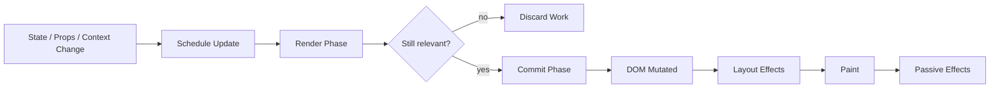
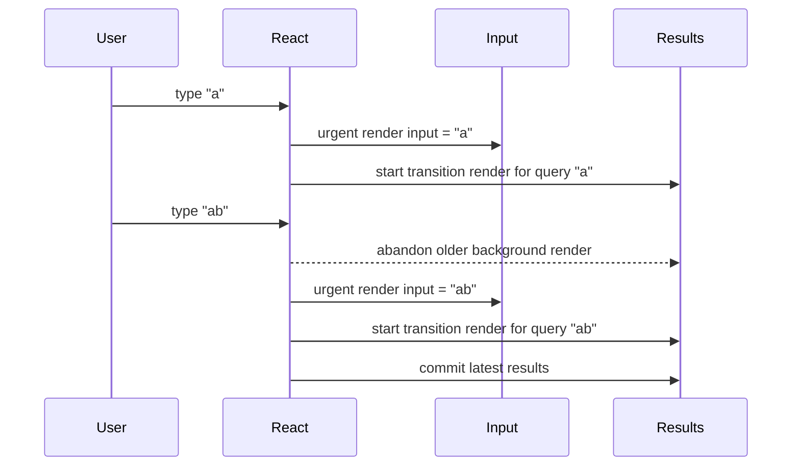
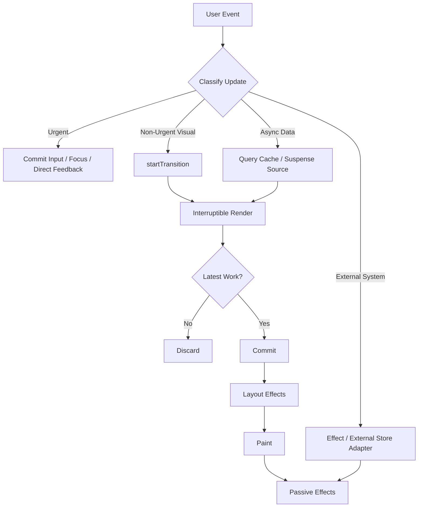

# Part 078 — React Concurrent Rendering Mental Model

Concurrent rendering is not “React uses multiple threads”.

Concurrent rendering means React can prepare UI work in a way that is **interruptible**, **prioritized**, and **discardable** before commit.

That one sentence changes how you design components.

In the old simplified model, a render starts and the browser waits until React finishes. In the concurrent model, some render work can be started, paused, abandoned, restarted, or superseded by a more urgent update.

If your components are pure, this is powerful.

If your render logic mutates external state, reads unstable mutable data, starts effects during render, or assumes render always commits, concurrent rendering exposes the bug.

This part builds the mental model needed before using `useTransition`, `useDeferredValue`, Suspense, streaming, React 19 Actions, or performance-oriented orchestration.

---

## 1. The Core Model

React has two broad phases:

```txt
render phase  ->  commit phase
```

Render phase:

```txt
calculate what the UI should look like
call components
produce a tree description
must be pure
can be interrupted/discarded
```

Commit phase:

```txt
apply changes to the host environment
update DOM
attach refs
run layout effects
then browser paints
then passive effects run
```

A simple diagram:



The advanced constraint:

```txt
Render may happen without commit.
Commit happens only for the winning render.
```

Therefore, render must not contain observable side effects.

---

## 2. What Concurrent Rendering Actually Enables

Concurrent rendering gives React room to prioritize user experience.

Example:

```txt
User types into input.
Input text update is urgent.
Large filtered result list update is non-urgent.
React should keep typing responsive while preparing the list in the background.
```

Without concurrency:

```txt
input update + expensive list render block together
```

With transition:

```txt
input update commits urgently
list update renders as interruptible background work
```

This is not magic. It is scheduling.

---

## 3. Urgent Update vs Transition Update

Not all updates have the same UX priority.

| Update type | Example | Should block interaction? |
|---|---|---|
| Urgent | typing in input, clicking checkbox, dragging slider | yes, must feel immediate |
| Transition | filter large result list, navigate to tab content, show search results | no, can be prepared in background |
| Background server refresh | stale query refetch | no, should avoid jank |
| Layout-critical | measure and place tooltip | yes, but keep tiny |

React's transition APIs let you mark updates as non-urgent.

```tsx
const [isPending, startTransition] = useTransition();

function handleSearchChange(nextText: string) {
  setInputText(nextText); // urgent

  startTransition(() => {
    setSearchQuery(nextText); // non-urgent
  });
}
```

### Important rule

```txt
The value controlled by an input should update urgently.
The expensive UI derived from that value may update in a transition.
```

Bad:

```tsx
startTransition(() => {
  setInputText(event.target.value);
});
```

This can make the input feel laggy because the controlled value itself is no longer urgent.

Good:

```tsx
setInputText(nextText);
startTransition(() => setFilter(nextText));
```

---

## 4. Concurrent Rendering Is Not Parallel DOM Mutation

A common misconception:

```txt
Concurrent React means two versions of the DOM update at the same time.
```

No.

The DOM commit is still coherent. React may prepare work in the background, but the committed UI is applied in a controlled commit phase.

The risk is not “half DOM”.

The risk is your code assuming that every render becomes visible.

Bad render side effect:

```tsx
function InvoiceRow({ invoice }: { invoice: Invoice }) {
  analytics.track('invoice_row_rendered', { id: invoice.id });
  return <tr>{invoice.number}</tr>;
}
```

In concurrent rendering, this may track rows that never commit.

Better:

```tsx
function InvoiceRow({ invoice }: { invoice: Invoice }) {
  useEffect(() => {
    analytics.track('invoice_row_visible', { id: invoice.id });
  }, [invoice.id]);

  return <tr>{invoice.number}</tr>;
}
```

Even this should be reviewed: visibility analytics for large lists may be better handled with IntersectionObserver, not per-row mount effects.

---

## 5. Render Purity Is a Concurrency Contract

React components must be pure with respect to props, state, and context.

Pure component logic:

```tsx
function Total({ items }: { items: Item[] }) {
  const total = items.reduce((sum, item) => sum + item.price, 0);
  return <span>{formatCurrency(total)}</span>;
}
```

Impure render logic:

```tsx
const renderedIds: string[] = [];

function Row({ item }: { item: Item }) {
  renderedIds.push(item.id);
  return <div>{item.name}</div>;
}
```

Why this breaks:

```txt
React may call Row during a render that is later discarded.
React may call Row again.
Strict Mode may double invoke in development to expose impurities.
The global array now contains entries that do not correspond to committed UI.
```

### Rule

```txt
If it changes something outside the component's returned JSX, it probably does not belong in render.
```

Allowed in render:

```txt
pure calculations
object/array mapping without mutation of inputs
creating JSX
reading props/state/context
throwing Promise/Error for supported Suspense/Error Boundary mechanisms
```

Not allowed in render:

```txt
network request side effect
analytics side effect
global mutation
DOM mutation
subscription
setTimeout
imperative store write
random id used as stable identity
Date.now used as persistent UI fact
```

---

## 6. Snapshot Model Under Concurrency

State is still a snapshot.

Each render sees one coherent snapshot of props, state, and context.

```tsx
function Counter() {
  const [count, setCount] = useState(0);

  function handleClick() {
    setCount(count + 1);
    setCount(count + 1);
    setCount(count + 1);
  }

  return <button onClick={handleClick}>{count}</button>;
}
```

This increments once because each `count + 1` uses the same render snapshot.

Correct when update depends on previous state:

```tsx
setCount((current) => current + 1);
setCount((current) => current + 1);
setCount((current) => current + 1);
```

Under concurrent rendering, this model becomes more important because a background render can be superseded by a newer update. Never use stale closure values for transition-critical state transitions.

### Rule

```txt
If the next value depends on the previous value, use an updater function or reducer event.
```

---

## 7. Timeline: Urgent + Transition Updates

Suppose a user types into a search box that filters a huge table.



The important behavior:

```txt
Older background work can be abandoned.
The user should see the latest committed consistent UI.
```

This is why render must be discardable.

---

## 8. `useTransition` Mental Model

`useTransition` returns:

```tsx
const [isPending, startTransition] = useTransition();
```

- `startTransition` marks state updates inside it as transition updates.
- `isPending` tells you whether a transition is pending.
- Transition renders are interruptible.
- Urgent updates can interrupt transition work.

### Example: search UI

```tsx
function CaseSearchPage() {
  const [input, setInput] = useState('');
  const [query, setQuery] = useState('');
  const [isPending, startTransition] = useTransition();

  function handleChange(event: React.ChangeEvent<HTMLInputElement>) {
    const next = event.target.value;

    setInput(next);

    startTransition(() => {
      setQuery(next);
    });
  }

  return (
    <section>
      <input value={input} onChange={handleChange} />
      {isPending ? <span>Updating results...</span> : null}
      <CaseResults query={query} />
    </section>
  );
}
```

### What this does not do

It does not make expensive JavaScript free.

If `CaseResults` does CPU-heavy work every render, transition can keep urgent updates responsive, but the expensive work still happens. You may still need:

```txt
virtualization
server-side search
memoized selectors
pagination
debounce for network pressure
web worker for CPU-heavy work
```

### Rule

```txt
Transitions improve scheduling. They do not replace architecture.
```

---

## 9. `startTransition` Outside Components

`startTransition` can be imported directly.

```tsx
import { startTransition } from 'react';

function externalStoreListener(nextState: StoreState) {
  startTransition(() => {
    store.setReactVisibleState(nextState);
  });
}
```

Use this only when you have a real scheduling boundary outside component code, such as a router, store, or data library integration.

### Risk

If you wrap everything in `startTransition`, you destroy priority semantics.

```txt
Urgent updates should stay urgent.
Non-urgent visual preparation can be transitional.
```

---

## 10. `useDeferredValue` Mental Model

`useDeferredValue` lets a value lag behind while React prepares expensive UI.

```tsx
const deferredQuery = useDeferredValue(query);
```

Then render expensive results from `deferredQuery`.

```tsx
<SearchInput value={query} onChange={setQuery} />
<CaseResults query={deferredQuery} />
```

### Difference from `useTransition`

| API | You control | Best for |
|---|---|---|
| `useTransition` | which update is non-urgent | event handler command flow |
| `useDeferredValue` | which value can lag | expensive child rendering from changing value |

### Stale indicator

```tsx
const deferredQuery = useDeferredValue(query);
const isStale = query !== deferredQuery;

return (
  <div style={{ opacity: isStale ? 0.6 : 1 }}>
    <CaseResults query={deferredQuery} />
  </div>
);
```

Do not hide that results are stale if the domain requires immediate trust.

For regulatory or case-management UI, stale result indicators may matter. A search result list that lags by 300ms is fine. A permission decision that lags silently may not be fine.

---

## 11. Suspense as Async Boundary

Suspense is not a spinner component.

Suspense is a boundary that says:

```txt
If this subtree cannot complete rendering yet, show this fallback while React waits for supported async work.
```

```tsx
<Suspense fallback={<CaseDetailSkeleton />}>
  <CaseDetail caseId={caseId} />
</Suspense>
```

### Boundary placement matters

Bad:

```tsx
<Suspense fallback={<FullPageSpinner />}>
  <EntireApplication />
</Suspense>
```

This creates huge blanking regions.

Better:

```tsx
<PageShell>
  <CaseHeader caseId={caseId} />

  <Suspense fallback={<CaseTimelineSkeleton />}>
    <CaseTimeline caseId={caseId} />
  </Suspense>

  <Suspense fallback={<RelatedCasesSkeleton />}>
    <RelatedCases caseId={caseId} />
  </Suspense>
</PageShell>
```

### Suspense and transitions

A transition can avoid hiding already-visible UI with a fallback too aggressively. This matters for navigation and tab switching.

```tsx
startTransition(() => {
  setSelectedTab('history');
});
```

Instead of immediately blanking the old tab, React can keep the previous UI while preparing the new one, depending on boundary placement and data source integration.

### Rule

```txt
Suspense boundary design is loading architecture.
```

---

## 12. React 19 Async Actions and Transitions

React 19 adds support for async functions in transitions and form Actions.

Conceptually:

```tsx
const [isPending, startTransition] = useTransition();

function handleSubmit() {
  startTransition(async () => {
    await saveCaseDraft();
    setMode('review');
  });
}
```

This lets pending state cover the async action flow more naturally than manually juggling local flags everywhere.

But it does not remove the need for command correctness.

You still need:

```txt
idempotency for duplicate command risk
error taxonomy
conflict handling
cache invalidation
permission enforcement
rollback/reconciliation for optimistic UI
```

### Rule

```txt
React Actions improve UI orchestration. They do not define your domain command semantics.
```

---

## 13. Effects Under Concurrent Rendering

Effects run after commit. Render may be discarded. Therefore, effects are where external synchronization belongs.

But effects also have failure modes.

### Effect lifecycle

```txt
render winning tree
commit DOM
run cleanup for changed old effects
run setup for new effects
```

Example:

```tsx
useEffect(() => {
  const connection = createConnection(roomId);
  connection.connect();

  return () => {
    connection.disconnect();
  };
}, [roomId]);
```

This says:

```txt
For committed UI with roomId X, synchronize connection to X.
When committed roomId changes or component unmounts, disconnect previous X.
```

### Failure: missing dependency

```tsx
useEffect(() => {
  const connection = createConnection(roomId);
  connection.connect();
  return () => connection.disconnect();
}, []);
```

This creates a stale synchronization contract. The component may render room B while the effect remains connected to room A.

### Failure: render-time subscription

```tsx
const connection = createConnection(roomId);
connection.connect();
```

This can run during discarded render and leak.

### Rule

```txt
Effects synchronize committed UI with external systems. They are not render calculations and not event handlers.
```

---

## 14. Layout Effects and Concurrent UX

`useLayoutEffect` runs after DOM mutation but before the browser repaints.

This is necessary for certain layout reads/writes:

```tsx
useLayoutEffect(() => {
  const rect = ref.current!.getBoundingClientRect();
  setPosition(computeTooltipPosition(rect));
}, []);
```

But because it blocks paint, it can erase the benefit of concurrent scheduling if overused.

### Failure modes

```txt
large layout effect blocks visible update
layout effect sets state repeatedly
measuring many rows individually
forced synchronous layout thrashing
using layout effect for work that can happen after paint
```

### Rule

```txt
Concurrent rendering helps before commit. A heavy layout effect can still block the user at commit time.
```

Keep layout effects small, localized, and measurable.

---

## 15. External Store Consistency

External stores must integrate with React's concurrent model correctly.

React provides `useSyncExternalStore` for this reason.

Bad pattern:

```tsx
function useStoreValue() {
  const [value, setValue] = useState(store.getState());

  useEffect(() => {
    return store.subscribe(() => setValue(store.getState()));
  }, []);

  return value;
}
```

This may work in simple cases, but it does not express the snapshot contract as directly as `useSyncExternalStore`.

Better:

```tsx
function useStoreValue() {
  return useSyncExternalStore(
    store.subscribe,
    store.getSnapshot,
    store.getServerSnapshot,
  );
}
```

### Snapshot rule

```txt
getSnapshot must return the same value if the store has not changed.
```

Bad:

```ts
getSnapshot() {
  return { ...state };
}
```

This returns a new object every call and can cause infinite rerender loops or unnecessary renders.

Good:

```ts
let currentSnapshot = state;

function setState(next: State) {
  currentSnapshot = next;
  listeners.forEach((listener) => listener());
}

function getSnapshot() {
  return currentSnapshot;
}
```

### Rule

```txt
Concurrent-safe external stores are snapshot systems, not random mutable globals.
```

---

## 16. Strict Mode as a Bug Finder

Strict Mode in development can double-invoke certain functions to expose accidental impurities.

Do not treat every Strict Mode issue as “React being annoying”.

Strict Mode often reveals bugs that concurrent rendering would make observable:

```txt
side effect in render
missing cleanup
non-idempotent setup
mutating props
unstable ref initialization
subscription leak
reducer impurity
```

### Example leak

```tsx
useEffect(() => {
  eventBus.subscribe('case.changed', handler);
}, []);
```

Missing cleanup.

Correct:

```tsx
useEffect(() => {
  return eventBus.subscribe('case.changed', handler);
}, [handler]);
```

### Rule

```txt
If Strict Mode exposes a duplicated effect, the fix is usually cleanup/idempotency, not disabling Strict Mode.
```

---

## 17. CPU Work and Scheduling

Concurrent rendering can interrupt React rendering work. It does not make arbitrary CPU work disappear.

Bad:

```tsx
function CaseResults({ cases }: { cases: Case[] }) {
  const scored = expensiveScoreAndSort(cases);
  return <Rows cases={scored} />;
}
```

If this is expensive, options include:

```txt
server-side sorting/filtering
pagination
virtualization
memoized selector keyed by stable inputs
web worker
precomputed read model
transition/deferred rendering
```

### Decision table

| Problem | Better tool |
|---|---|
| many DOM nodes | virtualization |
| expensive pure derived value | memoized selector |
| expensive backend-searchable computation | server query |
| CPU-heavy client-only algorithm | web worker |
| non-urgent visual update | transition/deferred value |
| repeated network search | debounce + cache |

### Rule

```txt
Scheduling is not a substitute for reducing work.
```

---

## 18. Concurrency and Component Identity

Concurrent rendering does not change React's state preservation rules:

```txt
same component type + same position/key = state preserved
changed type/key/position = state reset
```

But concurrent rendering can make accidental remounts more visible because transitions may preserve previous UI while preparing next UI.

### Bad unstable key

```tsx
<CaseEditor key={Math.random()} caseId={caseId} />
```

Every render resets the editor.

### Correct reset key

```tsx
<CaseEditor key={caseId} caseId={caseId} />
```

This intentionally resets when entity identity changes.

### Rule

```txt
Keys are identity contracts. Under concurrent rendering, identity bugs become UX continuity bugs.
```

---

## 19. Concurrency and Forms

Form state has urgent and non-urgent layers.

Urgent:

```txt
input value
cursor position
focus
composition text
checkbox checked state
```

Non-urgent:

```txt
large validation summary
search preview
derived expensive recommendation panel
autosave indicator
next-step preview
```

### Pattern

```tsx
function CaseForm() {
  const [draft, setDraft] = useState(initialDraft);
  const deferredDraft = useDeferredValue(draft);

  return (
    <>
      <CaseFields value={draft} onChange={setDraft} />
      <ExpensiveRiskPreview draft={deferredDraft} />
    </>
  );
}
```

Do not defer the input's own value.

### Rule

```txt
User input ownership stays urgent. Expensive projections from that input may lag.
```

---

## 20. Concurrency and Server State

Server-state libraries interact with concurrent rendering through:

```txt
cache subscription
Suspense support
transition-aware navigation
background refetch
stale data retention
optimistic updates
```

### Useful pattern: keep old data while fetching new data

For filter changes, you may want:

```txt
input changes now
old results remain visible
new results load in background
stale indicator shows transition
new results replace when ready
```

This avoids blanking.

### Suspense caution

A poorly placed Suspense boundary can make every small data change blank an entire page.

```tsx
<Suspense fallback={<FullScreenSpinner />}>
  <SearchPage />
</Suspense>
```

Better:

```tsx
<SearchShell>
  <SearchControls />
  <Suspense fallback={<ResultsSkeleton />}>
    <Results />
  </Suspense>
</SearchShell>
```

### Rule

```txt
Concurrent UX is built from cache policy + boundary placement + transition semantics.
```

---

## 21. Priority Inversion Failure

Priority inversion happens when low-value work blocks high-value interaction.

Examples:

```txt
typing blocked by huge result render
checkbox click blocked by dashboard recomputation
modal close blocked by analytics calculation
route transition blocked by unnecessary global provider rerender
```

### Diagnosis

Ask:

```txt
Which update is urgent?
Which update is visual but non-urgent?
Which subtree rerenders because of context/store fan-out?
Can expensive work be deferred, memoized, virtualized, or moved server-side?
```

### Repair ladder

```txt
1. Remove unnecessary state/effects.
2. Narrow state ownership.
3. Split context/provider boundaries.
4. Add selectors for external store subscriptions.
5. Memoize expensive pure selectors.
6. Virtualize large DOM.
7. Use transition/deferred value for non-urgent rendering.
8. Move CPU-heavy work to worker/server.
```

Do not start at step 7 if step 1 is the real bug.

---

## 22. Tearing Mental Model

Tearing means different parts of UI observe inconsistent versions of external mutable data during a render.

React state and context avoid this by being snapshot-based inside render.

External mutable stores need a proper snapshot protocol.

Bad:

```tsx
function A() {
  return <div>{externalStore.state.count}</div>;
}

function B() {
  return <div>{externalStore.state.count}</div>;
}
```

If `externalStore.state` mutates during render, A and B might observe different values.

Better:

```tsx
const count = useSyncExternalStore(
  externalStore.subscribe,
  externalStore.getSnapshot,
).count;
```

### Rule

```txt
Concurrent rendering requires reads to be snapshot-consistent.
```

---

## 23. Transition Failure Modes

| Failure | Symptom | Fix |
|---|---|---|
| Transitioning controlled input value | input lags | keep input update urgent |
| Wrapping everything in transition | UI feels delayed | classify update priority |
| No pending indicator | user thinks app ignored action | use `isPending` or stale indicator |
| Expensive commit/layout effect | transition still janks | reduce commit work |
| Stale callback inside transition | wrong update applied | updater function/reducer event |
| Transition hides important freshness | user sees stale critical data | explicit stale/pending marker |
| Transition used for command correctness | duplicate/conflict bugs remain | idempotency/precondition on backend |

---

## 24. Suspense Failure Modes

| Failure | Symptom | Fix |
|---|---|---|
| Huge boundary | full page blanks | smaller nested boundaries |
| Boundary too tiny | many skeleton flickers | group by user-perceived loading unit |
| No error boundary | rejected async crashes awkwardly | pair Suspense with Error Boundary |
| Fetch in effect expected to suspend | fallback never appears | use Suspense-enabled data source |
| Re-suspend hides revealed content | flicker on updates | transition-aware update / boundary redesign |
| Skeleton mismatches layout | layout shift | skeleton should preserve geometry |

---

## 25. A Production-Oriented Concurrency Diagram



This diagram is a practical review tool.

For any state update, ask:

```txt
Is this urgent?
Can it be transitioned?
Is it async data that belongs to cache/Suspense?
Is it an external synchronization that belongs in an effect?
Will render remain pure if React discards it?
```

---

## 26. Code Review Checklist

Use this checklist when reviewing concurrent-sensitive React code.

```txt
[ ] Component render is pure.
[ ] No external mutation during render.
[ ] No network/subscription/timer starts during render.
[ ] Random/time values are not used as stable identity in render.
[ ] State updates depending on previous state use updater/reducer.
[ ] Controlled input value updates are urgent.
[ ] Expensive result updates are transition/deferred where useful.
[ ] Pending/stale UI state is visible when domain requires it.
[ ] Suspense boundaries match user-perceived loading units.
[ ] Error boundaries pair with async/Suspense regions.
[ ] Layout effects are small and necessary.
[ ] External stores use `useSyncExternalStore` or a library with equivalent contract.
[ ] Snapshot values are stable when underlying store data has not changed.
[ ] Context updates do not fan out high-frequency global rerenders.
[ ] Strict Mode warnings/duplicates are treated as signals, not ignored.
```

---

## 27. Exercises

### Exercise 1 — Split urgent and non-urgent state

Take this component:

```tsx
function SearchPage() {
  const [query, setQuery] = useState('');
  const results = expensiveSearch(query);

  return (
    <>
      <input value={query} onChange={(e) => setQuery(e.target.value)} />
      <Results results={results} />
    </>
  );
}
```

Refactor it so the input stays urgent and the result calculation can lag.

Expected directions:

```txt
useDeferredValue(query)
useMemo for expensive pure calculation if inputs are stable
server-side search if dataset is too large
virtualization if result DOM is large
```

### Exercise 2 — Remove render impurity

Find every impure operation:

```tsx
function AuditPanel({ caseId }: { caseId: string }) {
  auditBus.publish('panel.rendered', { caseId });
  const now = Date.now();
  const id = Math.random();

  return <section id={`audit-${id}`}>Rendered at {now}</section>;
}
```

Refactor based on intent:

```txt
analytics belongs in effect or visibility observer
stable id belongs in useId or data identity
current time belongs in state/effect if it changes over time
```

### Exercise 3 — Suspense boundary placement

Given this layout:

```tsx
<Suspense fallback={<FullPageSpinner />}>
  <CasePage />
</Suspense>
```

Redesign boundaries for:

```txt
case header
case timeline
related cases
audit trail
comment editor
```

Expected direction: preserve page shell and show skeletons only for incomplete regions.

---

## 28. Final Mental Model

Concurrent React rewards code that is already architecturally clean.

It punishes code that smuggles side effects into render, relies on accidental synchronous timing, or treats all UI updates as equal priority.

The mature model is:

```txt
Render is pure calculation.
Commit is the only visible host mutation.
Effects synchronize committed UI with external systems.
Urgent updates protect direct manipulation.
Transitions make non-urgent visual work interruptible.
Deferred values let expensive children lag behind urgent input.
Suspense boundaries define loading architecture.
External stores must provide stable snapshots.
Server-state caches must coordinate freshness and identity.
```

Do not use concurrent features as decoration.

Use them only after you can clearly say:

```txt
This update is urgent.
That update is non-urgent.
This subtree may suspend.
This fallback preserves user orientation.
This external store read is snapshot-safe.
This render can be thrown away without consequence.
```

That is the concurrency-level React mental model.

---

## References

- React documentation — React v18 release notes: https://react.dev/blog/2022/03/29/react-v18
- React documentation — React v19 release notes: https://react.dev/blog/2024/12/05/react-19
- React documentation — `useTransition`: https://react.dev/reference/react/useTransition
- React documentation — `startTransition`: https://react.dev/reference/react/startTransition
- React documentation — `useDeferredValue`: https://react.dev/reference/react/useDeferredValue
- React documentation — `Suspense`: https://react.dev/reference/react/Suspense
- React documentation — Components and Hooks must be pure: https://react.dev/reference/rules/components-and-hooks-must-be-pure
- React documentation — `useSyncExternalStore`: https://react.dev/reference/react/useSyncExternalStore
