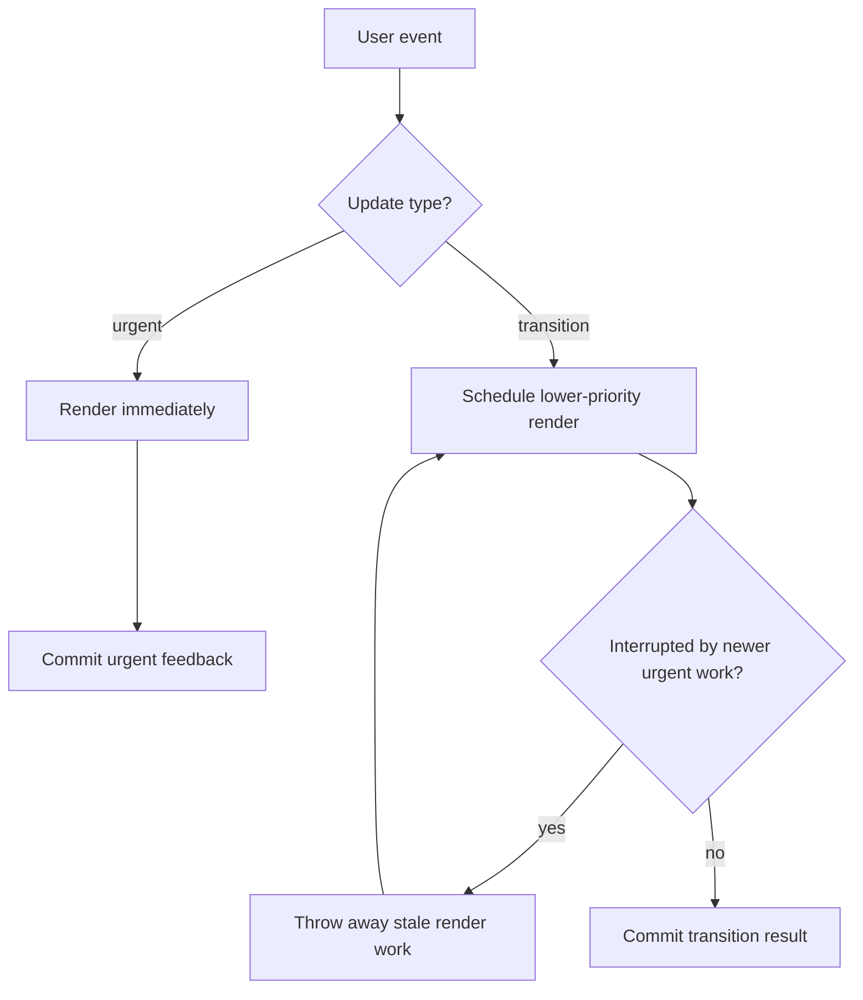
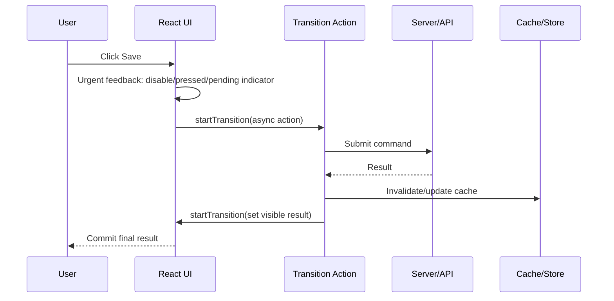

# Part 079 — `useTransition` in Production

`useTransition` is not a magic performance switch.

It is a scheduling contract.

It tells React:

> “This update is allowed to lag behind urgent user feedback. Keep the interface responsive. If newer urgent work appears, prefer that first.”

That sentence is the whole mental model. Everything else is a consequence.

A senior React engineer does not ask:

```txt
Should I use useTransition here because this render is slow?
```

They ask:

```txt
Which update is urgent?
Which update may be interrupted?
Which state controls user input and must never be deferred?
Which visual result may lag while the app stays responsive?
Can the user still understand the temporary mismatch?
```

If those questions are unclear, adding `useTransition` usually hides the real problem.

---

## 1. The Problem `useTransition` Solves

React apps often mix two different kinds of update in the same event.

Example: user clicks a tab.

```tsx
function ProductPage() {
  const [tab, setTab] = useState<'overview' | 'reviews' | 'pricing'>('overview');

  return (
    <>
      <TabBar value={tab} onChange={setTab} />
      <ExpensiveTabPanel tab={tab} />
    </>
  );
}
```

The click has two consequences:

1. The tab button should feel selected immediately.
2. The expensive panel may take time to render.

If both happen as one urgent update, the browser may feel frozen. The user clicked, but the UI cannot show feedback until React finishes expensive rendering.

`useTransition` lets you split the interaction into:

```txt
urgent feedback     : update immediately
transitioned result : update in background / interruptible render
```

---

## 2. Core Runtime Model



The important thing: React may abandon unfinished transition work.

That is good for responsiveness, but it creates a design constraint:

```txt
Transition render must be pure.
Transition state must tolerate being restarted.
Transition UI must tolerate being temporarily stale.
```

This is why the earlier parts about render purity, state snapshot, and effects are not theoretical. Concurrency makes those rules observable.

---

## 3. API Shape

```tsx
import { useTransition } from 'react';

function Component() {
  const [isPending, startTransition] = useTransition();

  function run() {
    startTransition(() => {
      // state updates here are marked as transition updates
    });
  }
}
```

`useTransition` returns:

```txt
isPending        : true while a transition is pending
startTransition  : function used to mark updates as transition work
```

Do not over-read `isPending`.

It does not mean:

```txt
network request is pending
specific entity is pending
specific mutation is pending
specific route is pending
```

It means:

```txt
some transition created by this hook is pending and has not finished showing its final result
```

For entity-specific mutation pending state, use mutation state. For form submission pending state, use form/action status. For page navigation pending state, use router/framework navigation state if available.

---

## 4. Urgent vs Transition Updates

A practical classification:

| Update | Usually urgent? | Can be transition? | Reason |
|---|---:|---:|---|
| Controlled text input value | Yes | No | Input must reflect keystrokes immediately |
| Checkbox toggle visual | Usually yes | Sometimes no | Direct manipulation feedback should be instant |
| Tab panel body | No | Yes | Heavy content may lag |
| Search result list | No | Yes | Query text must update first; results may lag |
| Route content | Usually no | Yes | Navigation shell can stay responsive |
| Modal open/close | Usually yes | Rarely | Close/open feedback should be immediate |
| Chart recomputation | No | Yes | Expensive visualization can lag |
| Validation summary | Depends | Often yes | Field typing urgent; full summary may lag |
| Toast notification | Yes | Usually no | Feedback should appear immediately |
| Cache invalidation render | No | Yes | Refetch/result reconciliation can be non-urgent |

Rule of thumb:

```txt
If delaying the update breaks direct manipulation, do not transition it.
If delaying the update preserves responsiveness and the temporary mismatch is understandable, transition it.
```

---

## 5. The Canonical Pattern: Urgent Shell, Transition Body

Bad:

```tsx
function SearchPage() {
  const [query, setQuery] = useState('');
  const [mode, setMode] = useState<'grid' | 'table'>('table');

  return (
    <>
      <input value={query} onChange={(e) => setQuery(e.target.value)} />
      <ModeSwitch value={mode} onChange={setMode} />
      <VeryExpensiveResults query={query} mode={mode} />
    </>
  );
}
```

Typing, mode switching, and expensive results all compete in the same urgent render path.

Better:

```tsx
function SearchPage() {
  const [query, setQuery] = useState('');
  const [mode, setMode] = useState<'grid' | 'table'>('table');
  const [resultView, setResultView] = useState({ query: '', mode: 'table' as const });
  const [isPending, startTransition] = useTransition();

  function updateQuery(nextQuery: string) {
    setQuery(nextQuery); // urgent: input must stay responsive

    startTransition(() => {
      setResultView((prev) => ({ ...prev, query: nextQuery }));
    });
  }

  function updateMode(nextMode: 'grid' | 'table') {
    setMode(nextMode); // urgent: control feedback

    startTransition(() => {
      setResultView((prev) => ({ ...prev, mode: nextMode }));
    });
  }

  return (
    <>
      <input value={query} onChange={(e) => updateQuery(e.target.value)} />
      <ModeSwitch value={mode} onChange={updateMode} />

      {isPending && <InlinePendingBadge>Updating results…</InlinePendingBadge>}

      <VeryExpensiveResults query={resultView.query} mode={resultView.mode} />
    </>
  );
}
```

This pattern makes the contract explicit:

```txt
control state = urgent
result view state = transition
```

However, this split duplicates state. That is not automatically wrong, but it creates an invariant:

```txt
resultView must eventually catch up to query/mode
```

If that invariant becomes hard to maintain, use `useDeferredValue` instead. Part 080 covers that.

---

## 6. The Better Default for Prop-Driven Lag: `useDeferredValue`

When you own the setter, `startTransition` is available.

When you receive a changing value and want to defer how a subtree consumes it, `useDeferredValue` is usually cleaner.

```tsx
function SearchResultsPanel({ query }: { query: string }) {
  const deferredQuery = useDeferredValue(query);
  return <Results query={deferredQuery} />;
}
```

Use `useTransition` when you control the state transition.

Use `useDeferredValue` when you want to defer a value you receive.

---

## 7. `useTransition` with Tabs

A common production pattern:

```tsx
function AnalyticsTabs() {
  const [selectedTab, setSelectedTab] = useState<'summary' | 'funnel' | 'retention'>('summary');
  const [visibleTab, setVisibleTab] = useState(selectedTab);
  const [isPending, startTransition] = useTransition();

  function selectTab(nextTab: typeof selectedTab) {
    setSelectedTab(nextTab);

    startTransition(() => {
      setVisibleTab(nextTab);
    });
  }

  return (
    <section>
      <TabList value={selectedTab} onChange={selectTab} pending={isPending} />
      <TabPanel tab={visibleTab} />
    </section>
  );
}
```

This creates a deliberate temporary mismatch:

```txt
selectedTab = what user selected now
visibleTab  = content currently rendered or rendering
```

That mismatch must be visible enough to avoid confusion.

A good UI says:

```txt
The tab selection changed; content is catching up.
```

A bad UI silently shows old content under a newly selected tab with no pending indication.

---

## 8. `useTransition` with Suspense

A Suspense boundary can show a fallback when child content suspends.

Without transition:

```txt
user changes query
→ new content suspends
→ boundary may replace old content with fallback
```

With transition:

```txt
user changes query
→ transition update suspends
→ React may keep already revealed content visible while new content loads
```

Architecture pattern:

```tsx
function CustomerPage() {
  const [customerId, setCustomerId] = useState('c_001');
  const [shownCustomerId, setShownCustomerId] = useState(customerId);
  const [isPending, startTransition] = useTransition();

  function selectCustomer(nextId: string) {
    setCustomerId(nextId);
    startTransition(() => setShownCustomerId(nextId));
  }

  return (
    <>
      <CustomerPicker value={customerId} onChange={selectCustomer} />
      {isPending && <PendingBar />}

      <Suspense fallback={<CustomerSkeleton />}>
        <CustomerDetail customerId={shownCustomerId} />
      </Suspense>
    </>
  );
}
```

The key design decision is fallback policy:

| Situation | Better UX |
|---|---|
| First load has no content | Show skeleton/fallback |
| Refreshing already visible content | Keep stale content + pending indicator |
| User changes high-level identity | Depends; stale detail may be misleading |
| Destructive mutation result | Avoid hiding confirmation behind stale content |

Do not use transitions to hide critical loading/error semantics. Stale UI can be dangerous when the user must know exact state before acting.

---

## 9. React 19 Actions and Async Transitions

React 19 extends transitions around async work. You can pass an async function to `startTransition` and use `isPending` while the Action is pending.

Example:

```tsx
function QuantityEditor({ initialQuantity }: { initialQuantity: number }) {
  const [quantity, setQuantity] = useState(initialQuantity);
  const [error, setError] = useState<string | null>(null);
  const [isPending, startTransition] = useTransition();

  function saveQuantity(nextQuantity: number) {
    startTransition(async () => {
      setError(null);

      try {
        const saved = await api.updateQuantity(nextQuantity);

        // Current React docs still require wrapping state updates after await
        // in another startTransition to mark them as transition updates.
        startTransition(() => {
          setQuantity(saved.quantity);
        });
      } catch (err) {
        startTransition(() => {
          setError(toUserMessage(err));
        });
      }
    });
  }

  return (
    <QuantityControl
      value={quantity}
      disabled={isPending}
      error={error}
      onChange={saveQuantity}
    />
  );
}
```

Important nuance:

```txt
Async work can be part of an Action.
State updates after await currently need another startTransition wrapper to be marked as transition updates.
```

This is a known limitation in the React API. Design your code so this rule is not hidden inside random event handlers.

A cleaner production shape:

```tsx
function useTransitionAction<TArgs extends unknown[]>(
  action: (...args: TArgs) => Promise<void>,
) {
  const [isPending, startTransition] = useTransition();

  const run = useCallback((...args: TArgs) => {
    startTransition(async () => {
      await action(...args);
    });
  }, [action, startTransition]);

  return { isPending, run };
}
```

Use with care: this wrapper tracks transition pending state, not necessarily domain-level mutation identity.

---

## 10. Transitions Are Not a Substitute for Server-State Tools

Wrong:

```tsx
startTransition(async () => {
  const result = await fetchCustomers(query);
  startTransition(() => setCustomers(result));
});
```

This may keep the UI responsive, but it does not solve:

```txt
cache identity
request deduplication
stale data
retry
abort
pagination
background refresh
invalidation after mutation
SSR hydration
```

Use `useTransition` for rendering priority and user experience coordination.

Use server-state tools for server data lifecycle.

Better:

```tsx
function CustomerSearchPage() {
  const [query, setQuery] = useState('');
  const [submittedQuery, setSubmittedQuery] = useState('');
  const [isPending, startTransition] = useTransition();

  const customersQuery = useCustomersQuery(submittedQuery);

  function submitSearch(nextQuery: string) {
    setQuery(nextQuery);

    startTransition(() => {
      setSubmittedQuery(nextQuery);
    });
  }

  return (
    <>
      <SearchBox value={query} onChange={setQuery} onSubmit={submitSearch} />
      <CustomerResults
        customers={customersQuery.data ?? []}
        loading={customersQuery.isLoading}
        refreshing={isPending || customersQuery.isFetching}
      />
    </>
  );
}
```

Here:

```txt
React transition = render scheduling
Query library     = server-state lifecycle
```

Do not blur the boundary.

---

## 11. Input Control Caveat

Do not transition the state that controls a text input.

Bad:

```tsx
function SearchBox() {
  const [text, setText] = useState('');
  const [isPending, startTransition] = useTransition();

  return (
    <input
      value={text}
      onChange={(event) => {
        startTransition(() => {
          setText(event.target.value);
        });
      }}
    />
  );
}
```

The input value is direct manipulation state. It must be urgent.

Correct:

```tsx
function SearchBox() {
  const [text, setText] = useState('');
  const [query, setQuery] = useState('');
  const [isPending, startTransition] = useTransition();

  function onChange(nextText: string) {
    setText(nextText);

    startTransition(() => {
      setQuery(nextText);
    });
  }

  return (
    <>
      <input value={text} onChange={(event) => onChange(event.target.value)} />
      {isPending && <span>Updating results…</span>}
      <SearchResults query={query} />
    </>
  );
}
```

Or use `useDeferredValue` for the query consumed by results.

---

## 12. Transition Boundary Placement

A transition boundary should live where the product decision is made.

Bad boundary:

```tsx
function ExpensiveGrid({ filters }: Props) {
  const [isPending, startTransition] = useTransition();
  // too late: grid does not own the filter transition
}
```

Better boundary:

```tsx
function SearchPage() {
  const [filters, setFilters] = useState(defaultFilters);
  const [appliedFilters, setAppliedFilters] = useState(defaultFilters);
  const [isPending, startTransition] = useTransition();

  function applyFilters(next: Filters) {
    setFilters(next);
    startTransition(() => setAppliedFilters(next));
  }

  return (
    <SearchLayout
      controls={<FilterPanel value={filters} onChange={applyFilters} />}
      result={<ResultGrid filters={appliedFilters} pending={isPending} />}
    />
  );
}
```

The page knows the UX policy:

```txt
controls urgent, results transition
```

So the page owns the transition.

---

## 13. Router Transitions

Client-side navigation often combines:

```txt
urgent feedback       : clicked link active/pressed state
transition work       : route tree render, data boundary, Suspense boundary
history mutation      : route framework responsibility
scroll/focus policy   : router/app shell responsibility
```

A simplified custom router pattern:

```tsx
function AppRouter() {
  const [route, setRoute] = useState(() => parseLocation(window.location));
  const [isPending, startTransition] = useTransition();

  const navigate = useCallback((href: string) => {
    window.history.pushState(null, '', href);

    startTransition(() => {
      setRoute(parseLocation(window.location));
    });
  }, [startTransition]);

  return (
    <RouterContext value={{ route, navigate, isNavigating: isPending }}>
      <AppShell pending={isPending}>
        <Suspense fallback={<RouteSkeleton />}>
          <RouteRenderer route={route} />
        </Suspense>
      </AppShell>
    </RouterContext>
  );
}
```

Production frameworks usually provide this machinery already. The lesson is not “build your own router”. The lesson is:

```txt
Navigation state is a classic transition use case.
```

---

## 14. Command Flow with Transition

For commands that change UI state after async work, draw the lifecycle explicitly.



Questions to answer in code review:

```txt
What is urgent feedback?
What is transition-rendered result?
What tracks network pending?
What tracks transition pending?
What handles error?
What handles rollback or retry?
What prevents duplicate submit?
```

Do not let `isPending` answer all of them.

---

## 15. `isPending` UX Patterns

Good uses:

```tsx
<button aria-busy={isPending} data-pending={isPending || undefined}>
  Reviews
</button>
```

```tsx
<div aria-live="polite">
  {isPending ? 'Updating view…' : null}
</div>
```

```tsx
<ResultPanel dimmed={isPending} />
```

Poor uses:

```tsx
{isPending ? <FullPageSpinner /> : <ExistingContent />}
```

That often defeats the purpose of a transition. The point is usually to keep useful existing UI visible while new work catches up.

A good pending indicator is:

```txt
local
non-destructive
understandable
not layout-jumping
not hiding useful old content unless correctness requires it
```

---

## 16. Failure Mode: Transitioning the Wrong State

Symptom:

```txt
input feels broken
button state lags
modal close feels delayed
screen reader announces stale selection
```

Cause:

```txt
direct manipulation state was marked as transition work
```

Fix:

```txt
split urgent control state from transition content state
```

---

## 17. Failure Mode: Hidden Stale UI

Symptom:

```txt
user selected Customer B, but detail panel still shows Customer A with no indication
```

Cause:

```txt
transition kept old content visible, but UI did not communicate staleness
```

Fix:

```tsx
const stale = selectedCustomerId !== shownCustomerId;

<CustomerDetailFrame aria-busy={stale || isPending} data-stale={stale || undefined}>
  <CustomerDetail customerId={shownCustomerId} />
</CustomerDetailFrame>
```

For regulated or financial workflows, be stricter. Stale content can create harmful decisions.

---

## 18. Failure Mode: Expecting Transition to Make Computation Faster

`useTransition` does not make expensive render work cheap.

It only changes when React may work on it and whether urgent work can interrupt it.

If the component is truly expensive, still consider:

```txt
memoization
virtualization
splitting components
moving computation out of render
precomputing read models
web worker for CPU-heavy pure computation
server-side aggregation
canvas/WebGL for huge visualizations
```

Transition is scheduling, not optimization of algorithmic complexity.

---

## 19. Failure Mode: Side Effects Inside Transition Render Path

Bad design:

```tsx
function ExpensivePanel({ tab }: { tab: string }) {
  analytics.track('tab_rendered', { tab }); // side effect during render
  return <Panel tab={tab} />;
}
```

Concurrent rendering may restart or abandon render work. This can duplicate side effects or record events for UI that never committed.

Correct:

```tsx
function ExpensivePanel({ tab }: { tab: string }) {
  useEffect(() => {
    analytics.track('tab_committed', { tab });
  }, [tab]);

  return <Panel tab={tab} />;
}
```

Even better: track user intent in the event handler and UI exposure in an effect, separately.

---

## 20. Failure Mode: Treating Multiple Transitions as Independent Queues

React currently batches multiple ongoing transitions together. Do not design code that assumes each `startTransition` gives you a perfectly isolated queue.

Bad mental model:

```txt
transition A has pending flag A
transition B has pending flag B
React guarantees separate scheduling and completion semantics
```

Safer model:

```txt
transition pending is a coarse UI scheduling signal
for domain-specific pending state, track domain-specific identity
```

Example:

```tsx
type PendingCommand =
  | { type: 'none' }
  | { type: 'saving-customer'; customerId: string }
  | { type: 'recalculating-report'; reportId: string };
```

Use domain state when the user must know exactly what is pending.

---

## 21. Pattern: Transitioned Expensive Derivation

Suppose an in-memory table has expensive grouping and sorting.

```tsx
function TransactionsExplorer({ transactions }: Props) {
  const [draftFilters, setDraftFilters] = useState(defaultFilters);
  const [appliedFilters, setAppliedFilters] = useState(defaultFilters);
  const [isPending, startTransition] = useTransition();

  const rows = useMemo(() => {
    return buildTransactionRows(transactions, appliedFilters);
  }, [transactions, appliedFilters]);

  function updateFilters(next: Filters) {
    setDraftFilters(next);
    startTransition(() => {
      setAppliedFilters(next);
    });
  }

  return (
    <ExplorerLayout
      filters={<TransactionFilters value={draftFilters} onChange={updateFilters} />}
      table={<TransactionTable rows={rows} busy={isPending} />}
    />
  );
}
```

This is useful only if:

```txt
TransactionFilters renders cheaply
TransactionTable is expensive
buildTransactionRows is tied to table render path
stale table while filters update is acceptable
```

If `buildTransactionRows` itself blocks the event before React can yield, consider moving CPU-heavy work away from render or using a worker.

---

## 22. Pattern: Transitioned Tree Expansion

```tsx
function CaseTree({ root }: { root: CaseNode }) {
  const [expandedDraft, setExpandedDraft] = useState<Set<string>>(() => new Set());
  const [expandedRendered, setExpandedRendered] = useState<Set<string>>(() => new Set());
  const [isPending, startTransition] = useTransition();

  function toggle(nodeId: string) {
    setExpandedDraft((current) => toggleSet(current, nodeId));

    startTransition(() => {
      setExpandedRendered((current) => toggleSet(current, nodeId));
    });
  }

  return (
    <TreeFrame pending={isPending}>
      <TreeView root={root} expanded={expandedRendered} onToggle={toggle} />
    </TreeFrame>
  );
}
```

But beware: if the tree view itself controls focus/keyboard navigation, splitting draft/rendered expansion may create accessibility mismatch. In that case prefer optimizing the tree, virtualizing it, or transitioning only non-interactive details.

---

## 23. Pattern: Transition Action Prop

A child should not always know whether a parent action is urgent or transition work.

You can expose an action prop:

```tsx
type SavePanelProps = {
  saveAction: (input: SaveInput) => void;
  pending: boolean;
};

function SavePanel({ saveAction, pending }: SavePanelProps) {
  return (
    <button disabled={pending} onClick={() => saveAction(readInput())}>
      {pending ? 'Saving…' : 'Save'}
    </button>
  );
}
```

Parent owns transition policy:

```tsx
function CasePage() {
  const [isPending, startTransition] = useTransition();

  function saveAction(input: SaveInput) {
    startTransition(async () => {
      await saveCase(input);
      startTransition(() => {
        // update visible state or invalidate cache
      });
    });
  }

  return <SavePanel saveAction={saveAction} pending={isPending} />;
}
```

This keeps the child reusable. It receives a command and pending status, not a scheduler implementation.

---

## 24. Performance Diagnosis Workflow

Do not add `useTransition` blindly. Use this sequence:

```txt
1. Reproduce the jank.
2. Identify the urgent interaction that feels blocked.
3. Profile render cost.
4. Find which subtree is expensive.
5. Check whether the expensive update can be stale/interrupted.
6. Add transition boundary at the owner of the UX policy.
7. Add pending/stale indication.
8. Re-profile.
9. If still slow, reduce actual work.
```

The key step is #5. Some updates cannot be stale.

---

## 25. Decision Matrix

| Question | If yes | If no |
|---|---|---|
| Do you own the state setter? | `useTransition` is possible | Consider `useDeferredValue` |
| Is the update direct input state? | Keep urgent | Transition may be valid |
| Can old content remain visible? | Transition good fit | Use explicit loading/disable/error flow |
| Is the problem network lifecycle? | Use server-state tool | Transition may help render UX only |
| Is CPU work outside render? | Worker/debounce/throttle | Transition can help render scheduling |
| Is stale UI dangerous? | Avoid or strongly label stale state | Transition acceptable |
| Need exact pending identity? | Track domain pending state | `isPending` enough for generic UI |

---

## 26. Code Review Checklist

Before approving `useTransition`, verify:

```txt
[ ] Direct input/control state is not transitioned.
[ ] There is a clear urgent vs non-urgent split.
[ ] Stale UI is either acceptable or visibly marked.
[ ] `isPending` is not misused as network/domain pending state.
[ ] State updates after await are correctly marked if needed.
[ ] Render path is pure and restart-safe.
[ ] Expensive subtree is actually the render bottleneck.
[ ] The transition boundary lives at the owner of the UX policy.
[ ] Error handling is explicit.
[ ] Server-state lifecycle is not reinvented with transition state.
```

---

## 27. Build From Scratch: Transition-Aware Search Shell

This pattern is useful for enterprise pages with filters, table, metrics, and export buttons.

```tsx
type SearchModel = {
  keyword: string;
  status: 'all' | 'open' | 'closed';
  page: number;
};

function CaseSearchPage() {
  const [draft, setDraft] = useState<SearchModel>({
    keyword: '',
    status: 'all',
    page: 1,
  });

  const [applied, setApplied] = useState(draft);
  const [isPending, startTransition] = useTransition();

  const query = useCasesQuery(applied);

  function updateDraft(patch: Partial<SearchModel>) {
    setDraft((current) => ({ ...current, ...patch, page: 1 }));
  }

  function apply() {
    startTransition(() => {
      setApplied(draft);
    });
  }

  function goToPage(page: number) {
    setDraft((current) => ({ ...current, page }));

    startTransition(() => {
      setApplied((current) => ({ ...current, page }));
    });
  }

  const refreshing = isPending || query.isFetching;

  return (
    <CaseSearchLayout
      filters={
        <CaseFilters
          value={draft}
          onChange={updateDraft}
          onApply={apply}
          disabled={false}
        />
      }
      results={
        <CaseResults
          cases={query.data?.items ?? []}
          page={applied.page}
          refreshing={refreshing}
          onPageChange={goToPage}
        />
      }
    />
  );
}
```

Why this is production-friendly:

```txt
Draft filter editing is urgent and local.
Applied query state changes in a transition.
Server-state lifecycle belongs to useCasesQuery.
Refresh indicator combines transition scheduling and query fetching.
Pagination is explicit command state.
```

Trade-off:

```txt
Draft and applied are intentionally separate. The invariant must be visible in names and tests.
```

---

## 28. What to Remember

`useTransition` is for non-blocking UI transitions.

It is not:

```txt
a debounce
an async request manager
a cache
a data fetching strategy
a replacement for virtualization
a way to make expensive code cheap
a safe place to hide stale correctness problems
```

The production mental model:

```txt
Urgent state represents direct user manipulation.
Transition state represents visual work that may lag.
Pending UI explains the lag.
Pure rendering makes interruption safe.
Domain pending state remains domain-owned.
```

If you can state those five sentences for a component, `useTransition` is probably being used well.
