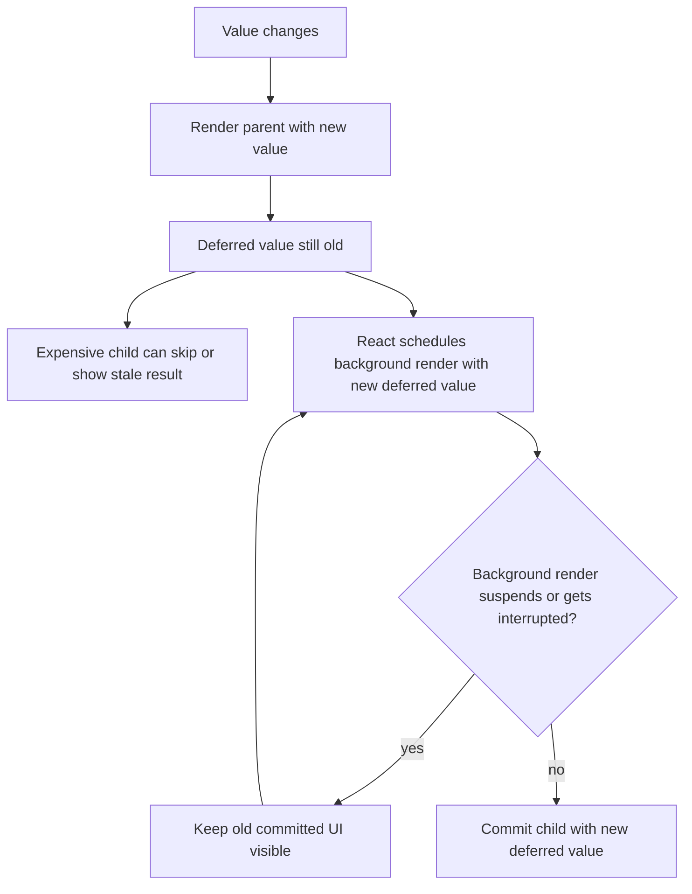

# Part 080 — `useDeferredValue`

`useDeferredValue` lets one part of the UI consume an older value while React prepares the newer value in the background.

That sounds small. In production React, it is powerful.

It gives you a way to say:

> “This value changed now, but this expensive subtree is allowed to lag behind.”

The important difference from `useTransition`:

```txt
useTransition    : you mark a state update as non-urgent when you call the setter
useDeferredValue : you receive a value and defer how part of the UI consumes it
```

So `useDeferredValue` is often better when:

```txt
You do not own the setter.
The value comes from props, context, router, store, or parent state.
You want an expensive child to catch up later.
You want stale content to remain visible instead of showing fallback.
```

---

## 1. The Basic Shape

```tsx
import { useDeferredValue } from 'react';

function SearchPage() {
  const [query, setQuery] = useState('');
  const deferredQuery = useDeferredValue(query);

  return (
    <>
      <input value={query} onChange={(event) => setQuery(event.target.value)} />
      <SearchResults query={deferredQuery} />
    </>
  );
}
```

`query` updates urgently.

`deferredQuery` may lag.

That means the input stays responsive even if `SearchResults` is expensive or suspends.

---

## 2. Runtime Model



`useDeferredValue` does not freeze the value forever. It creates a lagging version that catches up when React can complete the lower-priority render.

---

## 3. State Snapshot Mental Model

During a keystroke:

```txt
Render 1:
query = "react"
deferredQuery = "rea"

Background Render 2:
query = "react"
deferredQuery = "react"
```

That means your UI may intentionally show a mismatch:

```txt
input displays         : react
results correspond to  : rea
```

This is not a bug if the UI communicates it.

---

## 4. Stale UI Must Be Honest

A deferred value creates stale content. Stale content is acceptable only when users can understand it.

Good:

```tsx
function SearchPage() {
  const [query, setQuery] = useState('');
  const deferredQuery = useDeferredValue(query);
  const isStale = query !== deferredQuery;

  return (
    <>
      <input value={query} onChange={(event) => setQuery(event.target.value)} />

      <div aria-busy={isStale} style={{ opacity: isStale ? 0.6 : 1 }}>
        <SearchResults query={deferredQuery} />
      </div>
    </>
  );
}
```

Better in a design system:

```tsx
<ResultFrame stale={query !== deferredQuery} staleLabel="Updating results…">
  <SearchResults query={deferredQuery} />
</ResultFrame>
```

Bad:

```tsx
<SearchResults query={deferredQuery} />
```

with no indication that results do not match the latest query.

---

## 5. `useDeferredValue` vs `useTransition`

| Question | `useTransition` | `useDeferredValue` |
|---|---|---|
| Do you own the state setter? | Yes | Not required |
| Where is priority assigned? | At update time | At consumption time |
| Best for | Event-driven state transitions | Prop/context/store value lag |
| Pending flag included? | Yes, `isPending` | No direct pending flag |
| Stale detection | Usually compare two states | Compare value vs deferred value |
| Common use | Tabs, navigation, route content | Search results, large lists, expensive children |
| Input control state? | Must stay urgent | Original value stays urgent |

Simple rule:

```txt
If you are deciding how to update state, useTransition may fit.
If you are deciding how a subtree consumes state, useDeferredValue may fit.
```

---

## 6. `useDeferredValue` vs Debounce vs Throttle

This distinction matters.

| Technique | What it delays | Main use |
|---|---|---|
| Debounce | Calling logic until user stops | Reduce network/API calls |
| Throttle | Calling logic at fixed interval | Rate-limit events |
| `useDeferredValue` | Rendering a subtree with a newer value | Keep input/UI responsive |

`useDeferredValue` does **not** reduce network requests by itself.

Example:

```tsx
function SearchPage() {
  const [query, setQuery] = useState('');
  const deferredQuery = useDeferredValue(query);

  // If useSearchQuery fires for every query value elsewhere,
  // useDeferredValue alone does not automatically reduce requests.
  const result = useSearchQuery(deferredQuery);
}
```

This reduces query calls only if the server-state hook actually uses `deferredQuery` as its query key input.

Even then, fast typing may still produce multiple deferred updates depending on completion and interruption behavior. If the product requirement is “do not call API until user pauses for 400ms”, use debounce at the command/query boundary.

Good combined pattern:

```tsx
const debouncedQuery = useDebouncedValue(query, 300);
const deferredQuery = useDeferredValue(debouncedQuery);

const search = useSearchQuery(deferredQuery);
```

Here:

```txt
debounce controls request frequency
useDeferredValue controls render responsiveness
```

Do not confuse them.

---

## 7. The Memo Requirement

`useDeferredValue` helps only if the expensive subtree can avoid re-rendering while the deferred value has not changed.

Bad:

```tsx
function Page() {
  const [text, setText] = useState('');
  const deferredText = useDeferredValue(text);

  return (
    <>
      <input value={text} onChange={(e) => setText(e.target.value)} />
      <SlowList text={deferredText} />
    </>
  );
}
```

If `SlowList` re-renders for unrelated parent reasons anyway, you may still pay the cost.

Better:

```tsx
const SlowList = memo(function SlowList({ text }: { text: string }) {
  return <ExpensiveList text={text} />;
});

function Page() {
  const [text, setText] = useState('');
  const deferredText = useDeferredValue(text);

  return (
    <>
      <input value={text} onChange={(e) => setText(e.target.value)} />
      <SlowList text={deferredText} />
    </>
  );
}
```

The important path:

```txt
parent renders urgently with text = new value
useDeferredValue returns old deferredText
SlowList props are unchanged
memo lets SlowList skip this urgent render
background render later passes new deferredText
SlowList catches up
```

Without `memo`, the expensive child may render during the urgent pass anyway.

---

## 8. Stable Props Around Deferred Values

Even with deferred text, other unstable props can defeat memoization.

Bad:

```tsx
<SlowList
  text={deferredText}
  options={{ highlight: true }}
  onSelect={(item) => selectItem(item)}
/>
```

Every render creates new `options` and `onSelect`, so `memo` sees changed props.

Better:

```tsx
const options = useMemo(() => ({ highlight: true }), []);
const handleSelect = useCallback((item: Item) => {
  selectItem(item);
}, [selectItem]);

<SlowList text={deferredText} options={options} onSelect={handleSelect} />
```

React Compiler may reduce the need for manual memoization in many cases, but the architectural point remains:

```txt
The expensive subtree must have a stable input boundary.
```

---

## 9. Search Results Pattern

A production search screen has at least four states:

```txt
input query       : what user typed now
request query     : what server/cache is querying
deferred query    : what expensive result UI consumes
result state      : data/error/loading/fetching from server-state tool
```

A clean version:

```tsx
function CustomerSearchPage() {
  const [query, setQuery] = useState('');
  const deferredQuery = useDeferredValue(query);
  const isStale = query !== deferredQuery;

  const search = useCustomersQuery({ query: deferredQuery });

  return (
    <SearchPageLayout
      searchBox={
        <SearchBox
          value={query}
          onChange={setQuery}
          ariaLabel="Search customers"
        />
      }
      results={
        <ResultFrame stale={isStale || search.isFetching}>
          <CustomerResults
            customers={search.data?.items ?? []}
            loading={search.isLoading}
            error={search.error}
          />
        </ResultFrame>
      }
    />
  );
}
```

This is simple, but only correct if:

```txt
querying on every deferred query is acceptable
stale results are acceptable
server search can tolerate intermediate values
cache key uses deferredQuery
```

For expensive backend calls, add debounce before query key creation.

---

## 10. Suspense Integration

`useDeferredValue` integrates with Suspense.

If the background render with the new deferred value suspends, React can keep showing the previous committed content instead of replacing it with a fallback.

Pattern:

```tsx
function SearchPage() {
  const [query, setQuery] = useState('');
  const deferredQuery = useDeferredValue(query);
  const stale = query !== deferredQuery;

  return (
    <>
      <SearchInput value={query} onChange={setQuery} />

      <ResultFrame stale={stale}>
        <Suspense fallback={<InitialResultsSkeleton />}>
          <SearchResults query={deferredQuery} />
        </Suspense>
      </ResultFrame>
    </>
  );
}
```

The UX policy:

```txt
Initial load may show skeleton.
Refresh after previous results exist should keep old results visible.
Staleness indicator tells user results are catching up.
```

This is different from a normal loading spinner that removes useful content.

---

## 11. Large List Pattern

```tsx
const TransactionList = memo(function TransactionList({ filter }: { filter: Filter }) {
  const rows = useMemo(() => buildRows(filter), [filter]);
  return <VirtualizedTable rows={rows} />;
});

function TransactionsPage() {
  const [filter, setFilter] = useState<Filter>(defaultFilter);
  const deferredFilter = useDeferredValue(filter);
  const stale = filter !== deferredFilter;

  return (
    <>
      <FilterPanel value={filter} onChange={setFilter} />
      <TableFrame stale={stale}>
        <TransactionList filter={deferredFilter} />
      </TableFrame>
    </>
  );
}
```

Caveat: `filter !== deferredFilter` works only if filter identity reflects logical changes. If your filter object is recreated on every render, stale detection breaks.

Use stable updates:

```tsx
setFilter((current) =>
  current.status === nextStatus
    ? current
    : { ...current, status: nextStatus }
);
```

Or compare serialized/canonical form:

```tsx
const filterKey = makeFilterKey(filter);
const deferredFilterKey = useDeferredValue(filterKey);
```

---

## 12. Object Identity Trap

Bad:

```tsx
function Page({ rawFilters }: { rawFilters: RawFilters }) {
  const filters = normalizeFilters(rawFilters); // new object every render
  const deferredFilters = useDeferredValue(filters);

  return <Results filters={deferredFilters} />;
}
```

If `normalizeFilters` returns a new object every render, React sees a new value every render.

Better:

```tsx
function Page({ rawFilters }: { rawFilters: RawFilters }) {
  const filters = useMemo(() => normalizeFilters(rawFilters), [rawFilters]);
  const deferredFilters = useDeferredValue(filters);

  return <Results filters={deferredFilters} />;
}
```

Even better: use canonical primitive keys where possible.

```tsx
const filterKey = useMemo(() => encodeFilters(rawFilters), [rawFilters]);
const deferredFilterKey = useDeferredValue(filterKey);
```

---

## 13. Deferred URL State

URL state often updates urgently when navigation happens, but some expensive panels can consume deferred route/search state.

```tsx
function ReportsRoute() {
  const [searchParams, setSearchParams] = useSearchParams();
  const queryKey = canonicalizeReportParams(searchParams);
  const deferredQueryKey = useDeferredValue(queryKey);

  const stale = queryKey !== deferredQueryKey;

  return (
    <>
      <ReportControls value={queryKey} onChange={(next) => setSearchParams(next)} />
      <ReportFrame stale={stale}>
        <ReportTable queryKey={deferredQueryKey} />
      </ReportFrame>
    </>
  );
}
```

This works when:

```txt
URL changes immediately for shareability/navigation
expensive report rendering may catch up later
stale report is visibly marked
```

Do not defer URL updates themselves if browser back/forward correctness depends on them.

---

## 14. Deferred Context Value Consumption

Suppose a context provides global filters.

```tsx
function DashboardPanel() {
  const filters = useDashboardFilters();
  const deferredFilters = useDeferredValue(filters);
  const stale = filters !== deferredFilters;

  return (
    <Panel stale={stale}>
      <ExpensiveDashboard filters={deferredFilters} />
    </Panel>
  );
}
```

This can reduce perceived jank in one panel without changing the provider.

But it does not prevent the component reading context from re-rendering. It only allows the expensive child to consume an older value if the child boundary is stable and memoized.

For very high-frequency global state, use selector-based external store subscription instead of dumping volatile values into context.

---

## 15. Deferred External Store Selection

External store selector output can be deferred at the consumer boundary.

```tsx
function AuditTrailPanel() {
  const filters = useAuditStore((s) => s.filters);
  const deferredFilters = useDeferredValue(filters);

  return <AuditTrailList filters={deferredFilters} />;
}
```

This is useful when:

```txt
store update is needed immediately elsewhere
this specific panel is expensive and may lag
selector output has stable identity
stale panel is acceptable
```

If the selector creates new arrays/objects every time, fix the selector first.

---

## 16. Deferred Value and Effects

Effects run only for committed renders.

If a background render with the new deferred value suspends or is interrupted, its effects do not run until that render commits.

That means this is generally okay:

```tsx
function ResultsAnalytics({ query }: { query: string }) {
  const deferredQuery = useDeferredValue(query);

  useEffect(() => {
    analytics.track('results_viewed', { query: deferredQuery });
  }, [deferredQuery]);

  return <Results query={deferredQuery} />;
}
```

The effect represents committed exposure of results for `deferredQuery`, not user typing intent.

If you need to track typing intent, track `query` in the event handler or a different effect. Do not mix intent and exposure events.

---

## 17. Failure Mode: Using Deferred Value for Correctness

Bad:

```tsx
const deferredPermission = useDeferredValue(permission);

return deferredPermission.canApprove
  ? <ApproveButton />
  : null;
```

Permissions should usually not lag. Showing a stale approval button can be a real correctness issue.

Do not defer:

```txt
permission/capability checks
security-critical visibility
payment amount confirmation
destructive action eligibility
legal/regulatory status
identity/tenant boundary
```

Deferred UI is for UX responsiveness, not authorization semantics.

---

## 18. Failure Mode: Hidden Stale Results

Symptom:

```txt
input says “alice” but results are still for “ali”; user thinks search is wrong
```

Cause:

```txt
no stale indicator
```

Fix:

```tsx
const stale = query !== deferredQuery;

<ResultFrame
  aria-busy={stale}
  data-stale={stale || undefined}
  footer={stale ? 'Updating results…' : null}
>
  <Results query={deferredQuery} />
</ResultFrame>
```

A stale indicator should be close to stale content, not only in a global app bar.

---

## 19. Failure Mode: Expecting Network Reduction

Symptom:

```txt
API still called on every keystroke
```

Cause:

```txt
useDeferredValue defers rendering, not event frequency
```

Fix:

```tsx
const debouncedQuery = useDebouncedValue(query, 300);
const deferredQuery = useDeferredValue(debouncedQuery);
const result = useSearchQuery(deferredQuery);
```

Or use explicit submit/apply behavior:

```tsx
const [draftQuery, setDraftQuery] = useState('');
const [submittedQuery, setSubmittedQuery] = useState('');
const deferredSubmittedQuery = useDeferredValue(submittedQuery);
```

---

## 20. Failure Mode: Deferring a New Object Every Render

Symptom:

```txt
expensive child still rerenders constantly
```

Cause:

```txt
deferred value identity changes every parent render
```

Bad:

```tsx
const deferred = useDeferredValue({ query, status });
```

Better:

```tsx
const searchModel = useMemo(() => ({ query, status }), [query, status]);
const deferred = useDeferredValue(searchModel);
```

Or better still:

```tsx
const searchKey = `${status}:${query}`;
const deferredSearchKey = useDeferredValue(searchKey);
```

---

## 21. Failure Mode: No Memo Boundary

Symptom:

```txt
input still janks even though deferred value is used
```

Cause:

```txt
expensive child rerenders during urgent parent render anyway
```

Fix:

```tsx
const ExpensiveResults = memo(function ExpensiveResults({ query }: { query: string }) {
  return <ActualExpensiveResults query={query} />;
});
```

Then ensure other props are stable.

---

## 22. Failure Mode: Stale Closure Around Deferred Value

Bad:

```tsx
function SearchPage() {
  const [query, setQuery] = useState('');
  const deferredQuery = useDeferredValue(query);

  const exportResults = useCallback(() => {
    exportSearch(deferredQuery);
  }, []); // wrong
}
```

This captures the initial deferred query.

Correct:

```tsx
const exportResults = useCallback(() => {
  exportSearch(deferredQuery);
}, [deferredQuery]);
```

But ask the product question:

```txt
Should export use latest typed query or currently displayed results query?
```

Those are different.

Explicit API:

```tsx
<ExportButton
  latestQuery={query}
  displayedQuery={deferredQuery}
  onExportDisplayed={() => exportSearch(deferredQuery)}
/>
```

---

## 23. Failure Mode: Deferring Workflow State

Bad:

```tsx
const deferredStep = useDeferredValue(currentStep);
return <WorkflowStep step={deferredStep} />;
```

A wizard/current step usually represents navigation and focus order. Deferring it can create confusing keyboard/screen-reader behavior.

Prefer transitions for expensive subcontent inside a step, not for the step identity itself.

```tsx
<WizardShell currentStep={currentStep}>
  <StepBody model={deferredStepModel} />
</WizardShell>
```

---

## 24. Pattern: Deferred Projection, Not Deferred Truth

This is the safest mental model.

```txt
Truth should update immediately.
Projection may be deferred.
```

Example:

```tsx
function EnforcementDashboard() {
  const [filters, setFilters] = useState(defaultFilters);
  const projectionKey = useMemo(() => buildProjectionKey(filters), [filters]);
  const deferredProjectionKey = useDeferredValue(projectionKey);

  return (
    <>
      <FilterControls value={filters} onChange={setFilters} />
      <DashboardProjection projectionKey={deferredProjectionKey} />
    </>
  );
}
```

Here:

```txt
filters = truth
projectionKey = read model identity
deferredProjectionKey = stale-friendly rendering key
```

Do not defer the truth if other interactions depend on it.

---

## 25. Pattern: Deferred Expensive Formatting

Sometimes the data is stable but formatting/rendering is expensive.

```tsx
const ReportPreview = memo(function ReportPreview({ markdown }: { markdown: string }) {
  const html = useMemo(() => renderMarkdown(markdown), [markdown]);
  return <article dangerouslySetInnerHTML={{ __html: html }} />;
});

function MarkdownEditor() {
  const [markdown, setMarkdown] = useState('');
  const deferredMarkdown = useDeferredValue(markdown);
  const stale = markdown !== deferredMarkdown;

  return (
    <EditorLayout
      editor={<textarea value={markdown} onChange={(e) => setMarkdown(e.target.value)} />}
      preview={
        <PreviewFrame stale={stale}>
          <ReportPreview markdown={deferredMarkdown} />
        </PreviewFrame>
      }
    />
  );
}
```

This keeps typing responsive while preview catches up.

If markdown rendering is extremely expensive and blocks main thread heavily, move parsing to a worker. `useDeferredValue` can interrupt React render work; it cannot make arbitrary synchronous CPU work disappear.

---

## 26. Pattern: Deferred Chart Model

```tsx
function MetricsPage({ events }: { events: Event[] }) {
  const [range, setRange] = useState<DateRange>(last30Days());
  const deferredRange = useDeferredValue(range);
  const stale = range !== deferredRange;

  return (
    <>
      <DateRangePicker value={range} onChange={setRange} />
      <ChartFrame stale={stale}>
        <MetricsChart events={events} range={deferredRange} />
      </ChartFrame>
    </>
  );
}
```

But if chart aggregation is expensive:

```tsx
const chartModel = useMemo(
  () => buildChartModel(events, deferredRange),
  [events, deferredRange],
);
```

And if aggregation still blocks, use a worker or server aggregation. Deferred rendering is not a replacement for data architecture.

---

## 27. Pattern: Deferred Server-State Projection

Server-state query returns data quickly from cache, but the projection is expensive.

```tsx
function CaseAnalyticsPanel({ queryKey }: { queryKey: CaseQueryKey }) {
  const query = useCasesQuery(queryKey);
  const deferredData = useDeferredValue(query.data);
  const stale = query.data !== deferredData;

  const model = useMemo(() => {
    return buildAnalyticsModel(deferredData ?? []);
  }, [deferredData]);

  return <AnalyticsView model={model} stale={stale || query.isFetching} />;
}
```

This is valid only if:

```txt
old analytics can remain visible while new data catches up
stale indicator exists
permission/security data is not deferred
```

---

## 28. Testing Deferred UI

Test behavior, not scheduler internals.

Example test intent:

```txt
When user types a new query:
- input reflects latest query immediately
- results may still show previous query
- stale indicator appears
- eventually results catch up
```

Pseudo-test:

```tsx
it('keeps input responsive while results catch up', async () => {
  render(<SearchPage />);

  await user.type(screen.getByRole('searchbox'), 'alice');

  expect(screen.getByRole('searchbox')).toHaveValue('alice');
  expect(screen.getByText(/updating results/i)).toBeInTheDocument();

  await screen.findByText(/results for alice/i);
});
```

Avoid asserting exact intermediate scheduler timing. React scheduling is an implementation detail.

---

## 29. Observability

Deferred UI bugs are often user-perception bugs. Add observability at the boundary.

Useful events:

```txt
search_input_changed
search_results_stale_started
search_results_committed
search_results_stale_duration_ms
```

Do not emit analytics during render. Emit committed exposure from effects.

```tsx
function ResultExposure({ displayedQuery }: { displayedQuery: string }) {
  useEffect(() => {
    analytics.track('search_results_committed', { displayedQuery });
  }, [displayedQuery]);

  return null;
}
```

---

## 30. Decision Matrix

| Question | Use `useDeferredValue`? | Alternative |
|---|---:|---|
| Expensive child consumes rapidly changing value? | Yes | Memo/virtualization also likely |
| You do not own the state setter? | Yes | `useTransition` may not be available |
| Need to reduce API calls? | Not alone | Debounce/throttle/submit |
| Value controls text input? | Defer consumer, not input value | Keep input urgent |
| Value is permission/security critical? | No | Use latest value immediately |
| Stale content is acceptable with indicator? | Yes | Explicit loading/reset if stale is unsafe |
| Child is not memoized and expensive? | Maybe ineffective | Add stable memo boundary |
| CPU work is outside React render? | Maybe insufficient | Worker/debounce/server aggregation |

---

## 31. Code Review Checklist

Before approving `useDeferredValue`, verify:

```txt
[ ] The latest truth still updates urgently.
[ ] Only stale-friendly projection/rendering is deferred.
[ ] Stale UI is visibly communicated.
[ ] The expensive subtree has a stable memo boundary.
[ ] Deferred value identity is stable and meaningful.
[ ] The code does not expect fewer network requests unless query key uses deferred/debounced value.
[ ] Permission/security/status-critical values are not deferred.
[ ] Effects represent committed deferred value exposure, not abandoned render work.
[ ] Tests assert behavior, not exact scheduler timing.
```

---

## 32. What to Remember

`useDeferredValue` is a consumer-side scheduling tool.

It lets React keep the latest value for urgent UI while an expensive subtree continues to render an older value and catches up later.

Use it when:

```txt
the source value must update now
the projection may lag
the stale state is understandable
the expensive child can skip urgent renders
```

Do not use it when:

```txt
you need authorization correctness
you need to reduce network calls by itself
you have no memo/stable boundary
the stale UI would mislead users
the expensive work is not React render work
```

The production invariant:

```txt
Truth is urgent. Projection may be deferred. Staleness must be honest.
```
