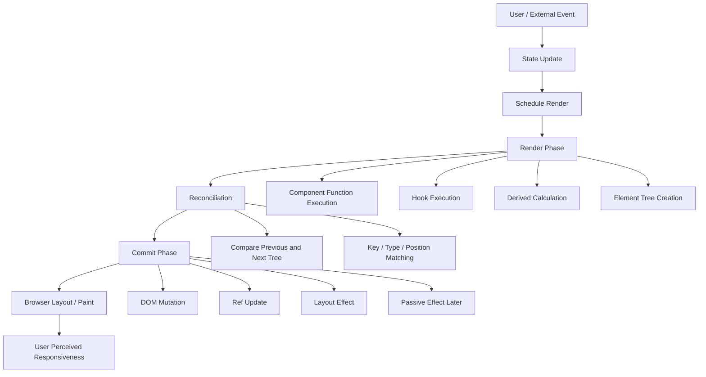
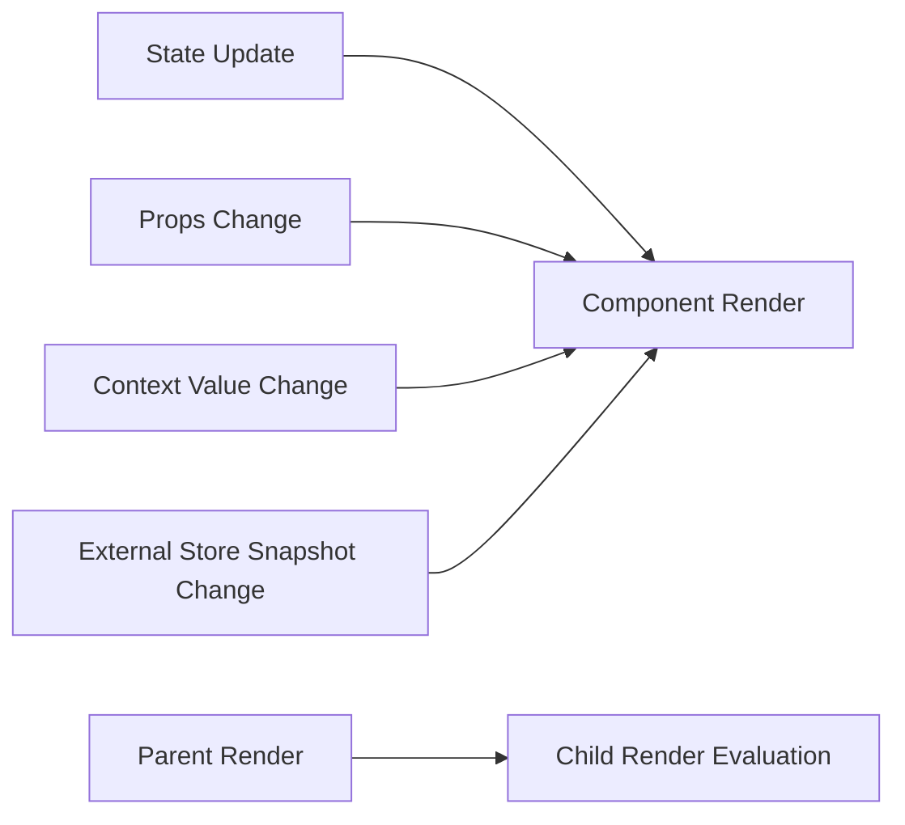
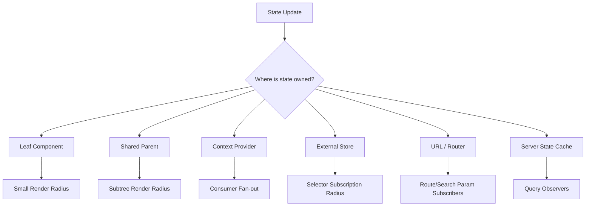
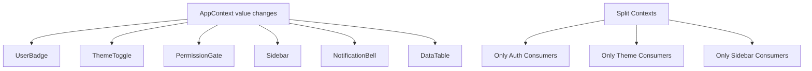
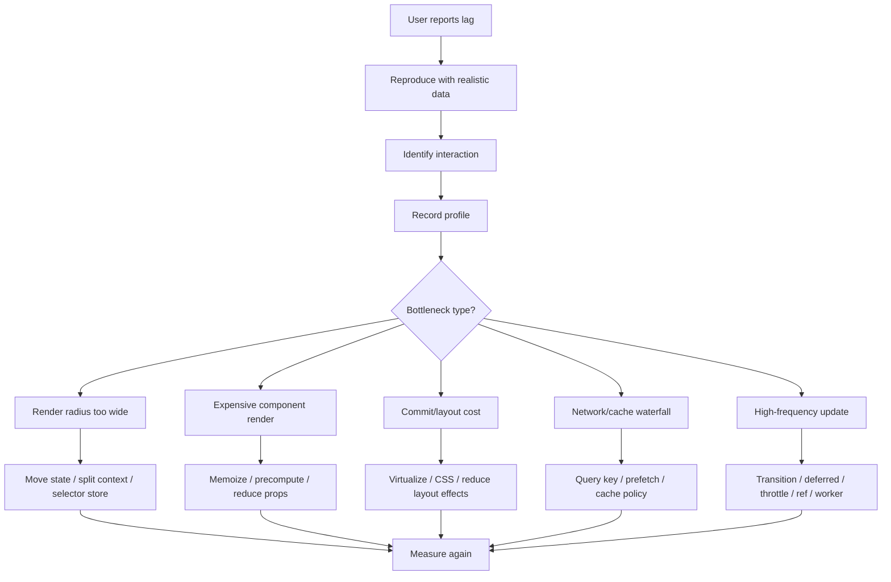
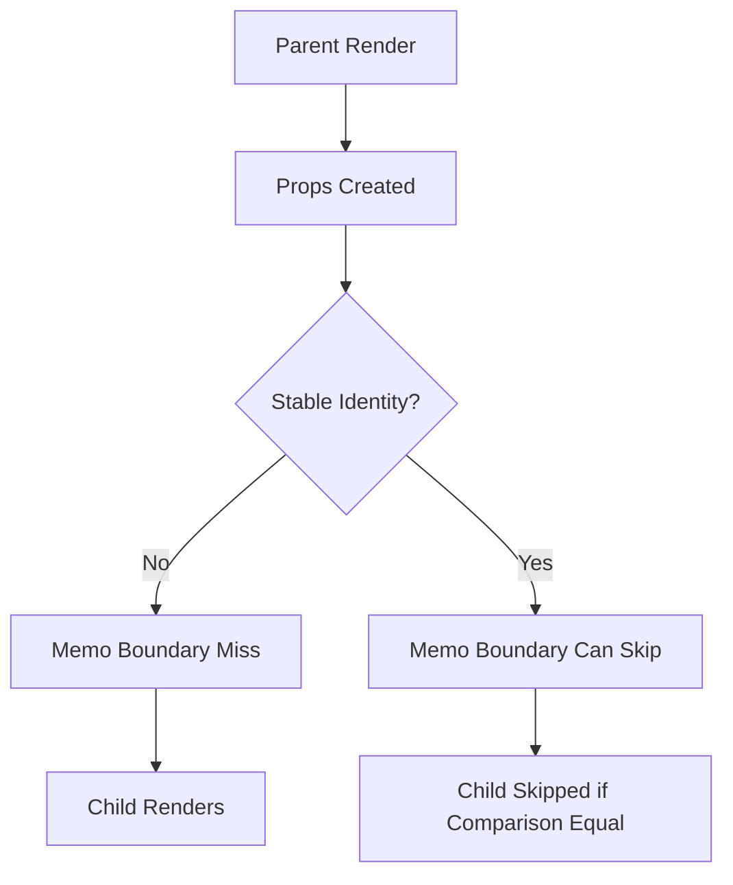

# Part 081 — Render Performance Model

Performance React yang bagus bukan dimulai dari `memo`, `useMemo`, atau `useCallback`.

Performance React yang bagus dimulai dari kemampuan menjawab pertanyaan ini:

```txt
Update apa yang terjadi?
State mana yang berubah?
Component mana yang harus membaca state itu?
Berapa luas area tree yang terdampak?
Berapa mahal render calculation-nya?
Berapa mahal commit DOM-nya?
Apakah user benar-benar merasakan lag?
```

Kalau pertanyaan itu belum jelas, memoization sering hanya menjadi plester. Ia bisa mengurangi gejala, tetapi tidak memperbaiki topologi state, boundary komponen, atau desain subscription yang salah.

Part ini membangun model kerja untuk membaca biaya render React secara sistematis.

---

## 1. Target Mental Model

React performance bukan satu angka. Ia adalah hasil dari beberapa biaya yang bertumpuk:



Render performance harus dipahami sebagai pipeline, bukan sebagai satu masalah bernama “terlalu banyak re-render”.

Sering kali re-render itu normal dan murah. Yang berbahaya adalah:

1. re-render yang terlalu luas,
2. render calculation yang mahal,
3. commit/layout yang mahal,
4. identity yang tidak stabil sehingga optimization tidak bekerja,
5. subscription yang terlalu kasar,
6. effect/layout effect yang melakukan kerja berat,
7. async boundary yang membuat UI bolak-balik loading,
8. list besar tanpa windowing,
9. update high-frequency yang ditempatkan di owner terlalu tinggi.

---

## 2. Definisi: Render Bukan Paint

Di React, “render” berarti React memanggil component untuk menghitung UI berikutnya.

Render tidak otomatis berarti DOM berubah.

```txt
render = calculate next React tree
commit = apply accepted changes to host environment
paint  = browser displays pixels
```

Konsekuensinya:

```tsx
function UserCard({ user }: { user: User }) {
  console.log('render UserCard');
  return <div>{user.name}</div>;
}
```

Log di atas bisa muncul walaupun DOM akhirnya tidak berubah secara signifikan.

Jangan menganggap setiap render adalah bug. Render adalah mekanisme React bekerja. Yang perlu dikendalikan adalah biaya dan radiusnya.

---

## 3. Empat Jenis Biaya dalam React UI

### 3.1 Scheduling cost

Biaya ketika update masuk dan React menentukan kapan update diproses.

Contoh:

```tsx
setSearchText(next);
startTransition(() => {
  setFilter(next);
});
```

Input text adalah update urgent. Filtering list besar bisa menjadi transition.

Scheduling cost biasanya bukan akar masalah utama, tetapi menjadi penting saat update high-frequency seperti typing, dragging, resizing, scrolling, streaming, atau real-time data.

### 3.2 Render cost

Biaya menjalankan component functions dan hook logic.

Render cost naik jika:

- tree terlalu luas,
- component melakukan kalkulasi mahal,
- banyak object/function dibuat ulang dan melewati memo boundary,
- derived data dihitung berulang di banyak component,
- context update membuat banyak consumer render,
- list besar dirender penuh.

### 3.3 Reconciliation cost

Biaya React membandingkan previous tree dan next tree.

Reconciliation cost naik jika:

- list panjang berubah tanpa key stabil,
- element type berubah-ubah,
- tree shape sering berubah drastis,
- wrapper/component identity tidak stabil,
- dynamic composition menyebabkan remount tidak perlu.

### 3.4 Commit/browser cost

Biaya mengubah DOM, menjalankan layout effects, layout, paint, composite.

Commit/browser cost naik jika:

- DOM mutation banyak,
- layout measurement dan DOM write bercampur,
- `useLayoutEffect` berat,
- style recalculation besar,
- layout thrashing,
- animasi mengubah layout property,
- portal/modal/overlay melakukan focus dan scroll lock berlebihan,
- table/list besar dimount sekaligus.

---

## 4. Render Trigger: Mengapa Component Render?

Component render karena salah satu input render berubah atau parent render membuat child ikut dievaluasi.

Input render utama:

```txt
props
state
context
external store snapshot
```

Diagram:



Penting: parent render biasanya membuat child function dieksekusi, kecuali ada optimization boundary seperti `memo` dan props-nya dianggap sama.

---

## 5. Performance Smell yang Sering Disalahartikan

### Smell 1 — “Component ini render lagi, berarti buruk”

Belum tentu.

Re-render murah tidak perlu dioptimasi. Optimization sendiri punya biaya:

- complexity,
- dependency correctness,
- stale closure risk,
- false confidence,
- cognitive load,
- custom equality bug,
- hidden correctness dependency.

### Smell 2 — “Tambahkan `useCallback` ke semua handler”

Tidak. Function baru pada render itu normal. Ia baru penting jika function tersebut melewati memo boundary, menjadi dependency effect, atau masuk ke subscription API yang sensitif identity.

### Smell 3 — “Context lambat”

Context tidak otomatis lambat. Yang lambat adalah context value yang terlalu volatile dan dibaca terlalu banyak consumer.

### Smell 4 — “Redux/Zustand pasti lebih cepat”

External store bisa lebih granular, tetapi juga bisa lebih buruk jika selector buruk, snapshot tidak stabil, listener bocor, atau semua component subscribe ke root state.

### Smell 5 — “React Compiler berarti performance selesai”

React Compiler membantu automatic memoization, tetapi tidak mengubah fakta bahwa state topology, context fan-out, list size, browser layout, network waterfall, dan invalidation strategy tetap harus didesain.

---

## 6. State Topology adalah Performance Topology

State placement menentukan radius render.



Rule praktis:

```txt
Semakin tinggi state berada, semakin luas potensi render radius.
Semakin sering state berubah, semakin dekat ia harus ditempatkan ke consumer yang benar-benar membutuhkannya.
```

Contoh buruk:

```tsx
function DashboardPage() {
  const [hoveredRowId, setHoveredRowId] = useState<string | null>(null);

  return (
    <DashboardShell hoveredRowId={hoveredRowId} onHoverRow={setHoveredRowId} />
  );
}
```

`hoveredRowId` adalah ephemeral high-frequency UI state. Menaruhnya di page-level membuat satu halaman terdampak hover.

Lebih baik:

```tsx
function DataTable({ rows }: { rows: Row[] }) {
  const [hoveredRowId, setHoveredRowId] = useState<string | null>(null);

  return rows.map(row => (
    <TableRow
      key={row.id}
      row={row}
      hovered={hoveredRowId === row.id}
      onHover={() => setHoveredRowId(row.id)}
    />
  ));
}
```

Atau lebih baik lagi jika hover hanya styling:

```css
.table-row:hover {
  background: var(--row-hover-bg);
}
```

Tidak semua visual state harus menjadi React state.

---

## 7. Render Radius

Render radius adalah area component tree yang perlu dievaluasi akibat update.

Contoh:

```tsx
function App() {
  const [query, setQuery] = useState('');

  return (
    <Layout>
      <SearchBox value={query} onChange={setQuery} />
      <Sidebar />
      <Results query={query} />
      <Footer />
    </Layout>
  );
}
```

Setiap perubahan `query` membuat `App` render, lalu subtree dievaluasi. Jika `Sidebar` dan `Footer` mahal, ini berpotensi buruk walaupun mereka tidak memakai `query`.

Refactor 1 — turunkan owner:

```tsx
function App() {
  return (
    <Layout>
      <SearchExperience />
      <Sidebar />
      <Footer />
    </Layout>
  );
}

function SearchExperience() {
  const [query, setQuery] = useState('');

  return (
    <>
      <SearchBox value={query} onChange={setQuery} />
      <Results query={query} />
    </>
  );
}
```

Render radius mengecil tanpa satu pun `memo`.

Refactor 2 — composition children boundary:

```tsx
function SearchLayout({ children }: { children: React.ReactNode }) {
  const [query, setQuery] = useState('');

  return (
    <section>
      <SearchBox value={query} onChange={setQuery} />
      <Results query={query} />
      {children}
    </section>
  );
}
```

Tetapi hati-hati: children yang dibuat oleh parent bisa tetap memiliki identity baru tergantung cara composition ditulis. Jangan gunakan children sebagai optimization magic. Ukur.

---

## 8. Parent Render dan Child Render

Saat parent render, React mengeksekusi JSX parent. Child element object dibuat ulang.

```tsx
function Parent({ count }: { count: number }) {
  return <Child value="stable" />;
}
```

`Parent` render ulang saat `count` berubah. `Child` secara default bisa ikut dievaluasi. Jika `Child` mahal dan props-nya stabil, `memo(Child)` bisa membantu.

```tsx
const Child = memo(function Child({ value }: { value: string }) {
  return <ExpensiveView value={value} />;
});
```

Tetapi `memo` hanya berguna jika props benar-benar stabil.

Tidak berguna:

```tsx
const Child = memo(function Child({ options }: { options: Options }) {
  return <ExpensiveView options={options} />;
});

function Parent() {
  return <Child options={{ density: 'compact' }} />;
}
```

`options` selalu object baru.

Lebih baik:

```tsx
const compactOptions = { density: 'compact' } as const;

function Parent() {
  return <Child options={compactOptions} />;
}
```

Atau:

```tsx
function Parent({ density }: { density: Density }) {
  const options = useMemo(() => ({ density }), [density]);
  return <Child options={options} />;
}
```

---

## 9. Identity Stability

React performance sering bukan tentang nilai, tetapi tentang identity.

```txt
primitive value equality: 1 === 1
object identity: {} !== {}
function identity: (() => {}) !== (() => {})
array identity: [] !== []
```

Identity penting untuk:

- `memo`,
- `useMemo`,
- `useCallback`,
- effect dependencies,
- context value,
- external store selectors,
- query keys,
- list keys,
- props comparison,
- event subscription cleanup.

Contoh context value buruk:

```tsx
<AuthContext.Provider value={{ user, logout }}>
  {children}
</AuthContext.Provider>
```

Setiap provider render membuat object baru. Semua consumer melihat context value berubah.

Lebih baik:

```tsx
const value = useMemo(() => ({ user, logout }), [user, logout]);

return <AuthContext.Provider value={value}>{children}</AuthContext.Provider>;
```

Lebih baik lagi jika `logout` tidak perlu berubah dan state/action dipisah:

```tsx
<AuthStateContext.Provider value={user}>
  <AuthActionsContext.Provider value={actions}>
    {children}
  </AuthActionsContext.Provider>
</AuthStateContext.Provider>
```

---

## 10. Context Fan-Out

Context update membuat consumer yang membaca context tersebut render ulang.

Masalah muncul jika context berisi terlalu banyak hal:

```tsx
type AppContextValue = {
  user: User | null;
  theme: Theme;
  permissions: Permission[];
  sidebarOpen: boolean;
  hoveredRowId: string | null;
  notifications: Notification[];
};
```

Satu perubahan `hoveredRowId` bisa mengenai consumer theme, permission, notification, dan user jika mereka membaca context yang sama.

Refactor:

```txt
AuthContext          low-frequency identity/session
ThemeContext         low-frequency design token
PermissionContext    medium-frequency capability snapshot
SidebarContext       local layout subtree state
NotificationStore    external/server-state cache
HoveredRowState      local component state / CSS hover
```

Diagram fan-out:



Performance fix terbaik sering adalah memecah provider berdasarkan volatility dan audience.

---

## 11. Derived Data Cost

Derived data adalah data yang dihitung dari input render.

Murah:

```tsx
const fullName = `${user.firstName} ${user.lastName}`;
```

Mahal:

```tsx
const visibleRows = rows
  .filter(row => matchesFilters(row, filters))
  .sort(compareRows)
  .map(enrichRow);
```

Jika `rows` besar, hitungannya mahal, dan component sering render, gunakan memoization atau pindahkan derivation ke boundary yang lebih tepat.

```tsx
const visibleRows = useMemo(() => {
  return rows
    .filter(row => matchesFilters(row, filters))
    .sort(compareRows)
    .map(enrichRow);
}, [rows, filters]);
```

Tetapi pertanyaan desainnya:

```txt
Apakah derivation ini view-specific?
Apakah bisa dihitung di selector external store?
Apakah bisa menjadi server query parameter?
Apakah query key sudah mencerminkan filter/sort?
Apakah jumlah row perlu virtualized?
```

Jangan langsung `useMemo` sebelum memahami sumber biaya.

---

## 12. List Performance

List besar adalah sumber biaya umum.

Masalah utama:

- semua row dirender,
- semua row subscribe ke context/store yang volatile,
- key tidak stabil,
- cell renderer membuat function/object baru,
- sorting/filtering dihitung di render setiap keystroke,
- selection state ada di parent terlalu tinggi,
- row height dinamis tanpa strategi measurement,
- pagination/infinite query tidak punya boundary cache jelas.

Contoh buruk:

```tsx
function Table({ rows, selectedIds, onToggle }: Props) {
  return (
    <tbody>
      {rows.map((row, index) => (
        <Row
          key={index}
          row={row}
          selected={selectedIds.includes(row.id)}
          onToggle={() => onToggle(row.id)}
        />
      ))}
    </tbody>
  );
}
```

Masalah:

- `key={index}` rapuh saat reorder/insert/delete,
- `selectedIds.includes` O(n) per row,
- callback baru per row,
- semua row dirender penuh,
- tidak ada virtualization.

Perbaikan awal:

```tsx
function Table({ rows, selectedIds, onToggle }: Props) {
  const selectedSet = useMemo(() => new Set(selectedIds), [selectedIds]);

  return (
    <tbody>
      {rows.map(row => (
        <Row
          key={row.id}
          row={row}
          selected={selectedSet.has(row.id)}
          onToggle={onToggle}
        />
      ))}
    </tbody>
  );
}

const Row = memo(function Row({ row, selected, onToggle }: RowProps) {
  return (
    <tr>
      <td>{row.name}</td>
      <td>
        <input
          type="checkbox"
          checked={selected}
          onChange={() => onToggle(row.id)}
        />
      </td>
    </tr>
  );
});
```

Untuk list besar, memo saja tidak cukup. Gunakan windowing/virtualization agar DOM yang dibuat terbatas.

---

## 13. Key Stability dan State Preservation

Key adalah bagian dari identity. Key buruk bisa menyebabkan:

- remount tidak perlu,
- state row pindah ke row lain,
- input kehilangan fokus,
- animation reset,
- expensive component mount ulang,
- selection/render mismatch.

Buruk:

```tsx
items.map((item, index) => <Row key={index} item={item} />)
```

Lebih baik:

```tsx
items.map(item => <Row key={item.id} item={item} />)
```

Key bukan performance hint saja. Key adalah identity contract.

---

## 14. Commit Cost: Ketika Render Murah tetapi UI Tetap Lambat

Kadang render time kecil, tetapi UI tetap terasa lambat karena commit/browser cost.

Contoh sumber commit/browser cost:

```txt
- mount 5.000 DOM nodes
- sync layout measurement di banyak component
- style recalculation besar
- forced reflow dari read/write layout bergantian
- useLayoutEffect berat
- focus management berulang
- image decode/layout shift
- CSS containment tidak ada
```

Contoh layout thrashing:

```tsx
useLayoutEffect(() => {
  for (const node of nodes) {
    const width = node.getBoundingClientRect().width;
    node.style.width = `${width + 10}px`;
  }
}, [nodes]);
```

Masalah: read layout dan write style bercampur dalam loop.

Lebih baik:

```tsx
useLayoutEffect(() => {
  const widths = nodes.map(node => node.getBoundingClientRect().width);

  nodes.forEach((node, index) => {
    node.style.width = `${widths[index] + 10}px`;
  });
}, [nodes]);
```

Lebih baik lagi jika bisa pindah ke CSS.

---

## 15. Effects sebagai Performance Risk

Effect yang tidak perlu menambah render pass.

Buruk:

```tsx
function UserName({ user }: { user: User }) {
  const [fullName, setFullName] = useState('');

  useEffect(() => {
    setFullName(`${user.firstName} ${user.lastName}`);
  }, [user.firstName, user.lastName]);

  return <span>{fullName}</span>;
}
```

Ini membuat render dengan state lama, lalu effect, lalu render lagi.

Benar:

```tsx
function UserName({ user }: { user: User }) {
  const fullName = `${user.firstName} ${user.lastName}`;
  return <span>{fullName}</span>;
}
```

Effect untuk synchronization dengan external system, bukan derivation internal.

---

## 16. High-Frequency Updates

High-frequency update adalah update yang terjadi puluhan sampai ratusan kali per detik.

Contoh:

- typing,
- pointer move,
- drag,
- scroll,
- resize,
- real-time cursor,
- animation,
- streaming events,
- sensor updates.

Pertanyaan utama:

```txt
Apakah setiap event harus masuk React state?
Apakah CSS bisa menyelesaikan?
Apakah ref cukup?
Apakah update perlu dibatch/throttle/debounce?
Apakah state owner terlalu tinggi?
Apakah expensive consumer bisa deferred/transition?
Apakah visualization perlu canvas/WebGL/off-main-thread?
```

Contoh pointer position yang tidak harus membuat seluruh component render:

```tsx
function DragPreview() {
  const ref = useRef<HTMLDivElement | null>(null);

  useEffect(() => {
    function onPointerMove(event: PointerEvent) {
      const node = ref.current;
      if (!node) return;
      node.style.transform = `translate(${event.clientX}px, ${event.clientY}px)`;
    }

    window.addEventListener('pointermove', onPointerMove);
    return () => window.removeEventListener('pointermove', onPointerMove);
  }, []);

  return <div ref={ref} className="drag-preview" />;
}
```

Ini adalah imperative escape hatch. Valid untuk visual high-frequency state jika tidak perlu memengaruhi React render model.

---

## 17. Urgent vs Non-Urgent Work

React concurrent features membantu memisahkan update urgent dan non-urgent.

Typing harus urgent.

Filtering 20.000 rows bisa non-urgent.

```tsx
function SearchPage() {
  const [input, setInput] = useState('');
  const [query, setQuery] = useState('');
  const [isPending, startTransition] = useTransition();

  function handleChange(next: string) {
    setInput(next);
    startTransition(() => {
      setQuery(next);
    });
  }

  return (
    <>
      <SearchBox value={input} onChange={handleChange} />
      {isPending && <InlinePending />}
      <Results query={query} />
    </>
  );
}
```

Ini tidak mengurangi total work. Ini membuat work berat tidak memblokir input urgent.

Jika total work terlalu besar, tetap perlu:

- virtualize,
- server-side filter,
- memoize derived data,
- reduce render radius,
- move expensive computation off main thread,
- use better data structure.

---

## 18. Deferred Value vs Debounce

`useDeferredValue` menunda konsumsi nilai oleh expensive UI. Ia bukan debounce network.

```tsx
const deferredQuery = useDeferredValue(query);

return <Results query={deferredQuery} />;
```

Debounce mengurangi frekuensi update/side-effect.

```tsx
const debouncedQuery = useDebouncedValue(query, 300);

useQuery({
  queryKey: ['search', debouncedQuery],
  queryFn: () => searchApi(debouncedQuery),
});
```

Decision:

```txt
Input terasa lambat karena rendering result mahal? useDeferredValue / transition.
API terlalu sering dipanggil? debounce atau server-state policy.
List terlalu besar? virtualization.
Filter calculation mahal? memoization / worker / server query.
```

---

## 19. Server State Performance

Server state performance bukan hanya render performance.

Masalah umum:

- query key tidak stabil,
- query key terlalu granular,
- query key terlalu kasar,
- cache invalidation terlalu luas,
- refetch waterfall,
- duplicate query karena provider/route boundary salah,
- optimistic update menulis terlalu banyak cache,
- infinite query page count terlalu besar,
- stale UI akibat invalidation kurang tepat.

Contoh query key buruk:

```tsx
useQuery({
  queryKey: ['cases', { filters, now: Date.now() }],
  queryFn: fetchCases,
});
```

`Date.now()` membuat cache address selalu baru.

Lebih baik:

```tsx
useQuery({
  queryKey: caseKeys.list(canonicalizeFilters(filters)),
  queryFn: () => fetchCases(filters),
});
```

Performance server state dimulai dari cache identity.

---

## 20. External Store Performance

External store biasanya dipakai untuk mengurangi render fan-out melalui selector subscription.

Buruk:

```tsx
const state = useAppStore();
const selected = state.selectedIds.includes(id);
```

Component subscribe ke seluruh store.

Lebih baik:

```tsx
const selected = useAppStore(state => state.selectedIds.has(id));
```

Tetapi selector juga punya risiko.

Buruk:

```tsx
const item = useAppStore(state => ({
  id: state.items[id].id,
  name: state.items[id].name,
}));
```

Selector selalu mengembalikan object baru. Tanpa equality yang sesuai, component render terus.

Lebih baik:

```tsx
const name = useAppStore(state => state.items[id].name);
```

Atau gunakan shallow equality jika object selector memang diperlukan.

---

## 21. React Compiler dan Render Performance

React Compiler mengubah baseline optimization: banyak manual memoization yang sebelumnya diperlukan bisa menjadi tidak perlu.

Tetapi compiler tidak menghapus kebutuhan untuk:

- state co-location,
- context splitting,
- key stability,
- external store contract,
- query key design,
- Suspense boundary placement,
- list virtualization,
- avoiding unnecessary effects,
- browser layout optimization,
- measuring with profiler.

Compiler membantu cache calculation dan skip unnecessary re-render dalam batas yang bisa dianalisis. Ia tidak bisa membuat desain state yang salah menjadi benar secara arsitektural.

Rule:

```txt
React Compiler mengurangi kebutuhan memoization manual.
Ia tidak menggantikan performance architecture.
```

---

## 22. Profiling Workflow

Jangan optimasi dari firasat. Gunakan workflow.



Minimum profiling protocol:

1. gunakan data set realistis,
2. matikan noise dev-only bila perlu,
3. rekam interaction spesifik,
4. cari component yang render lama,
5. bedakan render time dari commit/browser time,
6. catat mengapa component render,
7. terapkan satu perubahan,
8. ukur ulang,
9. simpan hasil sebagai catatan arsitektur.

---

## 23. Reading Profiler Metrics

React Profiler memberi beberapa sinyal penting.

### actualDuration

Berapa lama subtree benar-benar butuh untuk render update saat ini.

Jika `actualDuration` tinggi:

- component render mahal,
- banyak descendant render,
- memoization tidak efektif,
- derived calculation mahal,
- list terlalu besar.

### baseDuration

Estimasi biaya render subtree tanpa memoization.

Jika `baseDuration` tinggi tetapi `actualDuration` turun setelah memoization, optimization bekerja.

Jika keduanya tinggi, desain tree/derivation/list mungkin perlu diubah.

### commit time

Kapan commit terjadi. Jika commit/browser work berat, React render optimization saja tidak cukup.

---

## 24. Why-Did-This-Render Reasoning

Saat component render, tanya:

```txt
Apakah props berubah?
Props mana yang berubah identity-nya?
Apakah state lokal berubah?
Apakah context berubah?
Apakah external store selector berubah?
Apakah parent render dan component tidak punya memo boundary?
Apakah key berubah sehingga remount?
```

Checklist manual:

```tsx
function DebugProps({ props }: { props: Record<string, unknown> }) {
  const previous = useRef(props);

  useEffect(() => {
    for (const key of Object.keys(props)) {
      if (!Object.is(previous.current[key], props[key])) {
        console.log('changed prop', key, {
          before: previous.current[key],
          after: props[key],
        });
      }
    }

    previous.current = props;
  });

  return null;
}
```

Ini bukan production utility. Ini cara berpikir.

---

## 25. Performance Optimization Ladder

Gunakan urutan ini sebelum lompat ke memoization agresif.

```txt
1. Confirm user-visible problem.
2. Reproduce with realistic data.
3. Identify update source.
4. Reduce state radius.
5. Remove unnecessary effects.
6. Stabilize keys and component identity.
7. Split context by volatility/audience.
8. Use selector-based subscription where needed.
9. Memoize expensive calculation or component boundary.
10. Use transition/deferred value for non-urgent rendering.
11. Virtualize large lists.
12. Fix browser layout/paint cost.
13. Move heavy computation off main thread if needed.
14. Measure again.
```

---

## 26. Anti-Pattern: Global Page State for Everything

Buruk:

```tsx
function CasePage() {
  const [state, setState] = useState({
    selectedTab: 'summary',
    hoveredCommentId: null,
    draftNote: '',
    filters: {},
    modalOpen: false,
    scrollPosition: 0,
    selectedAttachmentId: null,
  });

  return <CasePageView state={state} setState={setState} />;
}
```

Masalah:

- semua update mengubah object besar,
- semua child menerima props besar,
- memo boundary sulit bekerja,
- state volatility tercampur,
- ownership tidak jelas,
- render radius luas.

Lebih baik pisahkan berdasarkan lifecycle:

```txt
selectedTab             URL / local route state
draftNote               local form state
filters                 URL/query state
modalOpen               modal orchestrator/local state
hoveredCommentId        CSS/local row state
scrollPosition          ref/browser state
selectedAttachmentId    local or URL if deep-linkable
caseData                server-state cache
permission              capability/context/server snapshot
```

---

## 27. Anti-Pattern: Optimization by Blanket Memoization

Buruk:

```tsx
export default memo(function Everything(props) {
  const value = useMemo(() => compute(props), [props]);
  const handleClick = useCallback(() => doSomething(props), [props]);

  return <View value={value} onClick={handleClick} />;
});
```

Jika `props` selalu object baru, semua memoization di atas gagal.

Optimization yang benar harus memahami identity graph:



---

## 28. Anti-Pattern: Effect-Based Performance Fix

Buruk:

```tsx
const [visibleRows, setVisibleRows] = useState<Row[]>([]);

useEffect(() => {
  setVisibleRows(filterRows(rows, filters));
}, [rows, filters]);
```

Ini menambah render pass dan membuat derived state bisa tertinggal.

Lebih baik:

```tsx
const visibleRows = useMemo(
  () => filterRows(rows, filters),
  [rows, filters]
);
```

Atau server-side:

```tsx
const query = useQuery({
  queryKey: ['cases', filters],
  queryFn: () => fetchCases(filters),
});
```

---

## 29. Production Performance Review Template

Gunakan template ini saat review PR yang mengubah state/render path.

```md
## React Performance Review

### Interaction
- Interaction yang berubah:
- Frekuensi update:
- Data size realistis:

### State topology
- State owner:
- Consumer:
- Volatility:
- Sharing radius:
- Reset boundary:

### Render radius
- Component yang terdampak:
- Context yang berubah:
- External store selector:
- Query observer:

### Identity
- Key stabil:
- Object props stabil:
- Callback props stabil bila perlu:
- Context value stabil:

### Expensive work
- Derived calculation:
- List size:
- DOM size:
- Layout effect:
- Network waterfall:

### Optimization
- Co-location:
- Memoization:
- Context split:
- Selector:
- Virtualization:
- Transition/deferred:

### Evidence
- Profiling before:
- Profiling after:
- User-visible improvement:
```

---

## 30. Real Case: Search Page

Masalah:

```tsx
function SearchPage() {
  const [query, setQuery] = useState('');
  const [filters, setFilters] = useState(defaultFilters);

  const results = useQuery({
    queryKey: ['search', query, filters],
    queryFn: () => search({ query, filters }),
  });

  return (
    <PageLayout>
      <SearchInput value={query} onChange={setQuery} />
      <FilterPanel filters={filters} onChange={setFilters} />
      <ResultList rows={results.data ?? []} />
      <AnalyticsPanel query={query} filters={filters} />
    </PageLayout>
  );
}
```

Gejala:

- typing memicu query baru setiap karakter,
- whole page render,
- result list besar render ulang,
- analytics panel render setiap keystroke,
- filters object tidak canonical.

Refactor:

```tsx
function SearchPage() {
  return (
    <PageLayout>
      <SearchExperience />
      <AnalyticsBoundary />
    </PageLayout>
  );
}

function SearchExperience() {
  const [input, setInput] = useState('');
  const deferredInput = useDeferredValue(input);
  const [filters, setFilters] = useUrlFilters();

  const searchParams = useMemo(
    () => canonicalizeSearchParams({ query: deferredInput, filters }),
    [deferredInput, filters]
  );

  const results = useQuery({
    queryKey: searchKeys.results(searchParams),
    queryFn: () => search(searchParams),
    enabled: searchParams.query.length >= 2,
  });

  return (
    <>
      <SearchInput value={input} onChange={setInput} />
      <FilterPanel filters={filters} onChange={setFilters} />
      <VirtualizedResultList rows={results.data?.items ?? []} />
    </>
  );
}
```

Perubahan:

- input tetap urgent,
- result consumption deferred,
- filters shareable via URL,
- query key canonical,
- list virtualized,
- analytics boundary tidak ikut semua state lokal.

---

## 31. Real Case: Permission-Aware UI

Masalah:

```tsx
const PermissionContext = createContext({
  permissions: [],
  canEdit: false,
  canApprove: false,
  canDelete: false,
  canComment: false,
  refreshPermissions: () => {},
});
```

Semua permission consumer render saat object berubah.

Refactor:

```tsx
function useCanApprove(caseId: string) {
  return usePermissionStore(state => state.byCase[caseId]?.canApprove ?? false);
}

function ApproveButton({ caseId }: { caseId: string }) {
  const canApprove = useCanApprove(caseId);
  const approve = useApproveCaseCommand(caseId);

  if (!canApprove) return null;
  return <Button onClick={approve}>Approve</Button>;
}
```

Permission bisa menjadi:

- server-state snapshot jika berasal dari backend,
- external store jika banyak granular subscription,
- capability context jika hanya command/service passing,
- local prop jika page already owns it.

Performance mengikuti ownership.

---

## 32. Failure Modes

### 32.1 Render storm

Gejala: satu interaction membuat terlalu banyak component render.

Penyebab:

- state terlalu tinggi,
- context terlalu besar,
- root store subscription,
- provider value tidak stabil,
- query invalidation terlalu luas.

Fix:

- co-locate state,
- split context,
- selector subscription,
- refine query keys,
- memo boundary hanya setelah radius benar.

### 32.2 Memo boundary miss

Gejala: component `memo` tetap render.

Penyebab:

- props object/function/array selalu baru,
- custom equality salah,
- context berubah,
- local state berubah,
- children identity berubah.

Fix:

- stabilize props,
- reduce props shape,
- split component,
- avoid unnecessary object props,
- move context read outside memoized child.

### 32.3 Commit bottleneck

Gejala: React render tidak besar, tetapi interaction tetap jank.

Penyebab:

- DOM terlalu besar,
- layout effect berat,
- layout thrashing,
- CSS/layout expensive,
- image/media heavy.

Fix:

- virtualize,
- reduce DOM,
- move work to CSS/compositor,
- batch layout read/write,
- remove unnecessary layout effects.

### 32.4 Derived calculation bottleneck

Gejala: CPU spike saat filter/sort/search.

Penyebab:

- O(n log n) setiap keystroke,
- repeated selector computation,
- no memoization,
- poor data structure.

Fix:

- `useMemo`,
- selector memoization,
- Set/Map indexes,
- server-side query,
- worker for heavy pure compute.

### 32.5 Network waterfall perceived as render slowness

Gejala: UI terasa lambat, tetapi render bukan bottleneck.

Penyebab:

- nested fetch after mount,
- dependent query tidak perlu,
- no prefetch,
- route boundary salah,
- cache invalidated too broadly.

Fix:

- prefetch,
- route-level data strategy,
- parallel query,
- better query key,
- Suspense boundary placement.

---

## 33. Render Performance Decision Matrix

| Symptom | Likely Root | First Fix | Later Fix |
|---|---|---|---|
| Typing lag | expensive result render | `useDeferredValue` / transition | virtualize / server search |
| Every page section renders | state too high | move state down | split orchestration boundary |
| Context consumers all render | context fan-out | split context | external store selectors |
| Memoized child still renders | unstable props | stabilize identity | reduce prop surface |
| Large list slow | too much DOM | virtualization | pagination/infinite query |
| Render fast but UI janks | commit/layout cost | reduce DOM/layout effects | CSS containment/compositor |
| Fetching feels slow | waterfall/cache miss | query key/prefetch | route data architecture |
| Store subscribers all render | broad selector | narrow selector | normalized store |
| Modal open janks | portal/focus/layout work | lazy mount/reduce content | modal manager optimization |
| Hover/drag janks | high-frequency React state | CSS/ref/throttle | off-main-thread/canvas |

---

## 34. Engineering Heuristics

Use these defaults:

```txt
Prefer state co-location before memoization.
Prefer stable state topology before stable callback identity.
Prefer derived calculation in render over effect-based derived state.
Prefer URL state for shareable navigation state.
Prefer server-state cache for remote authority.
Prefer external store selector for broad, granular, high-sharing client state.
Prefer virtualization for large DOM, not memoization only.
Prefer transition/deferred for responsiveness, not total work reduction.
Prefer measurement over intuition.
```

---

## 35. Practical Exercises

### Exercise 1 — Render radius audit

Take one page in your app. For each state variable, write:

```txt
state name:
owner:
consumer count:
update frequency:
render radius:
should move? yes/no:
```

Then move one high-frequency state closer to its consumer.

### Exercise 2 — Context fan-out map

For every context provider, document:

```txt
context name:
value fields:
which fields change frequently:
which components consume it:
can split state/actions:
can split by domain:
```

### Exercise 3 — List bottleneck diagnosis

Profile one list with realistic data.

Check:

- row count,
- DOM node count,
- key stability,
- row render time,
- selected/hover state ownership,
- callback/object prop stability,
- virtualization feasibility.

### Exercise 4 — Derived data cost

Find one expensive derived calculation.

Decide:

```txt
inline render calculation?
useMemo?
selector memoization?
server query?
worker?
precomputed index?
```

---

## 36. Summary

Render performance is architecture.

The highest leverage fixes are usually not cosmetic memoization. They are:

```txt
correct state ownership,
small render radius,
stable identity where it matters,
context split by volatility,
selector-based subscription for granular external state,
query key and invalidation design for server state,
virtualization for large DOM,
transition/deferred value for responsiveness,
removal of unnecessary effects,
profiling before and after.
```

A strong React engineer does not ask “where should I add memo?”.

They ask:

```txt
What changed?
Who owns it?
Who consumes it?
How often does it change?
How much tree does it touch?
Which part is expensive: render, commit, browser, network, or calculation?
What invariant must remain true after optimizing?
```

That is the render performance model.
