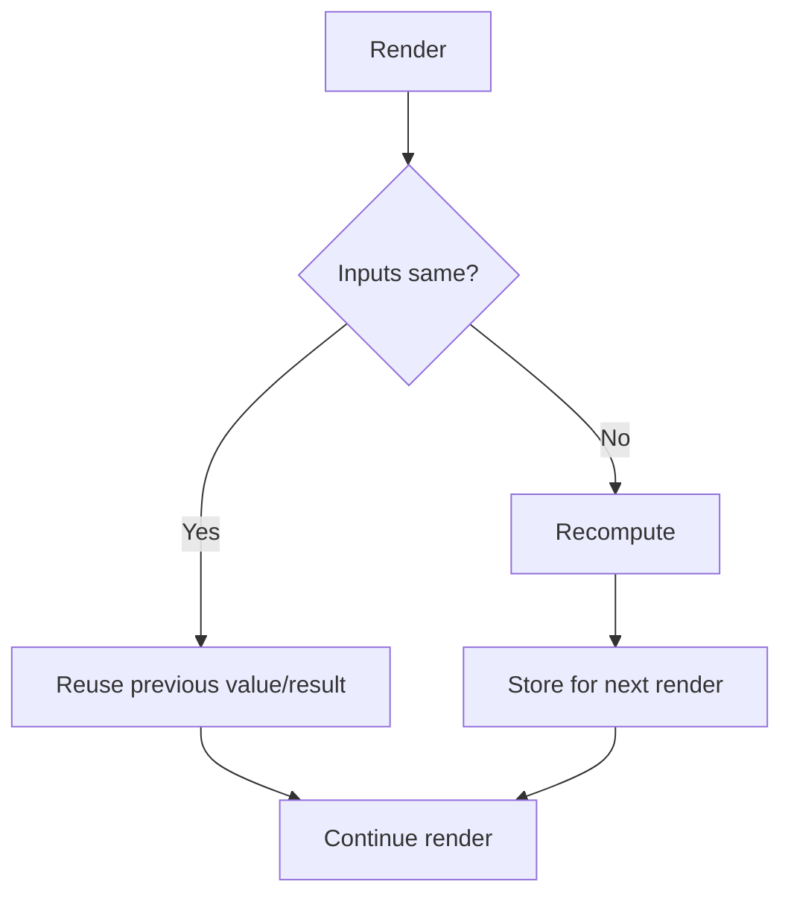
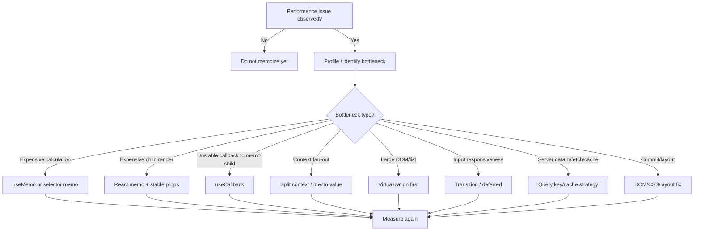

# Part 082 — Memoization Decision Framework

Memoization adalah cache.

Cache selalu punya trade-off:

```txt
lebih sedikit recomputation
vs
lebih banyak complexity, dependency risk, stale data risk, memory cost, dan debugging cost
```

Di React, memoization sering disalahgunakan karena terlihat mudah:

```tsx
const value = useMemo(() => expensiveThing(input), [input]);
const onClick = useCallback(() => doThing(input), [input]);
export default memo(Component);
```

Tetapi pertanyaan yang benar bukan “bisa dimemoize atau tidak?”.

Pertanyaan yang benar:

```txt
Apa yang ingin dicegah?
Recalculation?
Child re-render?
Effect resubscription?
Context fan-out?
Selector churn?
Expensive object allocation?
Reference instability across boundary?
```

Tanpa jawaban itu, memoization biasanya berubah menjadi ritual.

---

## 1. Target Mental Model

Memoization menyimpan hasil berdasarkan dependency atau input comparison.



Dalam React, ada beberapa lapisan memoization:

```txt
React.memo             skip component render if props equal
useMemo                cache computed value
useCallback            cache function identity
selector memoization   cache derived data from store/query
context value memo     stabilize provider value
query cache            cache server state by query key
React Compiler         automatic memoization where valid
```

Masing-masing menyelesaikan masalah berbeda.

---

## 2. Golden Rule

```txt
Memoization adalah performance optimization, bukan correctness mechanism.
```

Jika aplikasi rusak tanpa `useMemo`, `useCallback`, atau `memo`, maka kemungkinan ada bug desain:

- effect dependency salah,
- state derivation salah,
- callback contract salah,
- mutation object/reference salah,
- subscription cleanup salah,
- component tidak pure,
- external store snapshot tidak stabil,
- code bergantung pada identity untuk correctness.

Memoization boleh membantu stabilitas identity untuk effect atau boundary tertentu, tetapi invariant aplikasi tidak boleh bergantung pada “kebetulan cache”.

---

## 3. Jenis Memoization dan Masalah yang Diselesaikan

| Tool | Mencegah | Cocok Saat | Tidak Cocok Saat |
|---|---|---|---|
| `useMemo` | recalculation / unstable object identity | kalkulasi mahal, object prop ke memo child, dependency effect stabil | kalkulasi murah, dependency selalu berubah |
| `useCallback` | function identity berubah | callback dikirim ke memo child, dependency effect/subscription | handler lokal biasa |
| `memo` | child render dengan props sama | child render mahal dan props stabil | props selalu baru, child murah |
| context value memo | semua consumer render karena value object baru | provider value object/function | context terlalu besar/volatile |
| selector memo | repeated derived data | store/query derived data mahal | selector murah, input selalu berubah |
| custom equality | skip update dengan perbandingan khusus | data shape kecil dan comparison aman | deep compare besar, function props |
| React Compiler | automatic memoization | code pure dan compiler-compatible | impure render, dynamic escape hatches |

---

## 4. Decision Tree



Kalau bottleneck bukan recalculation atau render skip, memoization mungkin bukan alat yang benar.

---

## 5. `useMemo`: Cache Computed Value

`useMemo` menyimpan hasil kalkulasi antar render selama dependency sama.

Contoh valid:

```tsx
const visibleRows = useMemo(() => {
  return rows
    .filter(row => matchesFilters(row, filters))
    .sort(compareRows);
}, [rows, filters]);
```

Valid jika:

- `rows` besar,
- filter/sort mahal,
- component sering render karena input lain,
- `rows` dan `filters` punya identity stabil yang benar,
- hasil dipakai oleh expensive subtree.

Tidak perlu:

```tsx
const fullName = useMemo(() => {
  return `${user.firstName} ${user.lastName}`;
}, [user.firstName, user.lastName]);
```

String concatenation murah. Ini menambah noise.

---

## 6. `useMemo` untuk Stabilkan Object Prop

Kadang `useMemo` bukan untuk menghemat kalkulasi, tetapi untuk menjaga identity object.

```tsx
const chartOptions = useMemo(
  () => ({
    density,
    showLegend,
    currency,
  }),
  [density, showLegend, currency]
);

return <MemoizedChart data={data} options={chartOptions} />;
```

Ini valid jika:

- `MemoizedChart` memakai `memo`,
- chart render mahal,
- options berubah jarang,
- tanpa stable options, memo boundary selalu miss.

Tetapi jika child tidak memoized atau murah, `useMemo` ini tidak memberi banyak nilai.

---

## 7. `useMemo` untuk Effect Dependency

Kadang object dependency membuat effect resubscribe terus.

Buruk:

```tsx
function ChatRoom({ roomId }: { roomId: string }) {
  const options = { serverUrl: 'wss://chat.example.com', roomId };

  useEffect(() => {
    const connection = createConnection(options);
    connection.connect();
    return () => connection.disconnect();
  }, [options]);
}
```

`options` selalu baru, effect reconnect setiap render.

Perbaikan paling sederhana: pindahkan object ke dalam effect.

```tsx
function ChatRoom({ roomId }: { roomId: string }) {
  useEffect(() => {
    const options = { serverUrl: 'wss://chat.example.com', roomId };
    const connection = createConnection(options);
    connection.connect();
    return () => connection.disconnect();
  }, [roomId]);
}
```

Jika object memang perlu dibagi ke beberapa tempat, baru pertimbangkan `useMemo`.

```tsx
const options = useMemo(
  () => ({ serverUrl: 'wss://chat.example.com', roomId }),
  [roomId]
);
```

Preferensi:

```txt
Remove unnecessary dependency > move object/function inside effect > useMemo/useCallback for stable dependency
```

---

## 8. `useCallback`: Cache Function Identity

`useCallback(fn, deps)` secara konseptual sama dengan:

```tsx
useMemo(() => fn, deps)
```

Ia menyimpan function identity.

Valid:

```tsx
const handleToggle = useCallback((id: string) => {
  dispatch({ type: 'toggle', id });
}, []);

return <MemoizedTable rows={rows} onToggle={handleToggle} />;
```

Valid jika:

- callback melewati memo boundary,
- child render mahal,
- child membandingkan props secara shallow,
- dependency callback stabil.

Tidak perlu:

```tsx
<button onClick={useCallback(() => setOpen(true), [])}>Open</button>
```

Handler lokal pada element biasa tidak perlu `useCallback`.

---

## 9. Functional Updater untuk Mengurangi Dependency

Buruk:

```tsx
const addTodo = useCallback((text: string) => {
  setTodos([...todos, { id: createId(), text }]);
}, [todos]);
```

`addTodo` berubah setiap `todos` berubah.

Lebih baik:

```tsx
const addTodo = useCallback((text: string) => {
  setTodos(current => [...current, { id: createId(), text }]);
}, []);
```

Functional updater membuat callback tidak perlu membaca snapshot `todos` dari closure.

Ini bukan hack. Ini dependency correctness.

---

## 10. `memo`: Skip Component Render

`memo` membuat React dapat melewati render component jika props sama menurut shallow comparison.

```tsx
const UserRow = memo(function UserRow({ user, selected, onSelect }: Props) {
  return (
    <tr>
      <td>{user.name}</td>
      <td>
        <input
          type="checkbox"
          checked={selected}
          onChange={() => onSelect(user.id)}
        />
      </td>
    </tr>
  );
});
```

Valid jika:

- component sering menerima props yang sama,
- render component mahal,
- parent sering render karena alasan lain,
- props stabil,
- component pure.

Tidak berguna jika:

```tsx
<UserRow
  user={{ id: user.id, name: user.name }}
  selected={selectedIds.includes(user.id)}
  onSelect={() => selectUser(user.id)}
/>
```

Object dan function selalu baru.

---

## 11. Custom Equality pada `memo`

React `memo` bisa menerima custom compare.

```tsx
const Chart = memo(
  function Chart({ points, width, height }: Props) {
    return <CanvasChart points={points} width={width} height={height} />;
  },
  (prev, next) => {
    return (
      prev.points === next.points &&
      prev.width === next.width &&
      prev.height === next.height
    );
  }
);
```

Custom compare valid jika:

- props shape jelas,
- comparison lebih murah dari render,
- semua props termasuk functions dibanding dengan benar,
- tidak deep compare struktur besar setiap update,
- tidak menyembunyikan mutation bug.

Bahaya:

```tsx
(prev, next) => prev.user.id === next.user.id
```

Jika `user.name` berubah tetapi `id` sama, UI stale.

Custom equality adalah kontrak correctness. Jangan menulisnya longgar.

---

## 12. Memoization dan Mutation

Memoization mengasumsikan immutable update/identity meaningful.

Buruk:

```tsx
user.name = 'Alice';
setUser(user);
```

React dan memo boundary bisa melihat reference yang sama. UI bisa stale.

Benar:

```tsx
setUser(current => ({ ...current, name: 'Alice' }));
```

Untuk nested data:

```tsx
setState(current => ({
  ...current,
  users: {
    ...current.users,
    [id]: {
      ...current.users[id],
      name: 'Alice',
    },
  },
}));
```

Structural sharing membuat memoization punya sinyal yang benar.

---

## 13. Memoization dan Children

`children` juga props.

```tsx
const Panel = memo(function Panel({ children }: { children: React.ReactNode }) {
  return <section>{children}</section>;
});

function Parent() {
  return (
    <Panel>
      <ExpensiveChild />
    </Panel>
  );
}
```

Apakah `Panel` bisa skip? Tergantung identity children yang diterima.

Jangan mengandalkan `memo` pada wrapper dengan dynamic children sebagai optimization utama. Lebih baik pindahkan state agar wrapper tidak render, atau buat boundary lebih tepat.

---

## 14. Memoization dan Context

`memo` tidak mencegah render akibat context yang dibaca component berubah.

```tsx
const UserBadge = memo(function UserBadge() {
  const user = useContext(AuthContext);
  return <span>{user.name}</span>;
});
```

Jika `AuthContext` value berubah, `UserBadge` render walaupun `memo` dipakai.

Refactor jika hanya sebagian context dibutuhkan:

```tsx
function UserBadgeContainer() {
  const userName = useUserName();
  return <UserBadge userName={userName} />;
}

const UserBadge = memo(function UserBadge({ userName }: { userName: string }) {
  return <span>{userName}</span>;
});
```

Atau gunakan context splitting / selector store jika granularity dibutuhkan.

---

## 15. Context Value Memoization

Provider value object harus stabil jika provider sering render.

Buruk:

```tsx
return (
  <ThemeContext.Provider value={{ theme, setTheme }}>
    {children}
  </ThemeContext.Provider>
);
```

Lebih baik:

```tsx
const value = useMemo(() => ({ theme, setTheme }), [theme]);

return (
  <ThemeContext.Provider value={value}>
    {children}
  </ThemeContext.Provider>
);
```

Namun jangan berhenti di sini jika context terlalu besar.

```txt
Memoizing provider value fixes accidental identity churn.
It does not fix bad context domain design.
```

Jika `theme` berubah, semua consumer tetap render. Itu benar. Jika terlalu banyak consumer terdampak, split context atau pindah ke selector store.

---

## 16. Selector Memoization

Selector memoization menyimpan derived data dari store/cache.

Contoh tanpa memo:

```tsx
function selectVisibleCases(state: CaseState, filters: Filters) {
  return state.caseIds
    .map(id => state.cases[id])
    .filter(item => matches(item, filters));
}
```

Jika dipanggil oleh banyak component, kalkulasi diulang.

Memoized selector:

```tsx
function createVisibleCasesSelector() {
  let previousCases: CaseState['cases'] | null = null;
  let previousIds: string[] | null = null;
  let previousFilters: Filters | null = null;
  let previousResult: Case[] = [];

  return function selectVisibleCases(state: CaseState, filters: Filters) {
    if (
      previousCases === state.cases &&
      previousIds === state.caseIds &&
      previousFilters === filters
    ) {
      return previousResult;
    }

    previousCases = state.cases;
    previousIds = state.caseIds;
    previousFilters = filters;
    previousResult = state.caseIds
      .map(id => state.cases[id])
      .filter(item => matches(item, filters));

    return previousResult;
  };
}
```

Selector memoization valid jika:

- derived calculation mahal,
- input identity meaningful,
- selector instance lifetime benar,
- result identity dipakai untuk skip downstream render.

---

## 17. Per-Component Selector Instance

Jika selector menerima props berbeda per component, jangan selalu pakai satu global selector cache.

Buruk:

```tsx
const selectCaseById = createSelector(
  [(state: State) => state.cases, (_: State, id: string) => id],
  (cases, id) => cases[id]
);
```

Jika dipakai oleh banyak id bergantian, cache satu-entry bisa churn.

Per-component selector:

```tsx
function CaseRow({ id }: { id: string }) {
  const selectCase = useMemo(() => createCaseSelector(), []);
  const item = useStore(state => selectCase(state, id));

  return <Row item={item} />;
}
```

Atau gunakan store selector yang langsung memilih primitive/small slice.

---

## 18. Query Selector / `select` Option

Server-state cache juga bisa punya selector.

```tsx
const caseTitle = useQuery({
  queryKey: caseKeys.detail(caseId),
  queryFn: () => fetchCase(caseId),
  select: data => data.title,
});
```

Ini berguna jika component hanya butuh sebagian data.

Namun tetap ingat:

- query key menentukan cache entry,
- `select` menentukan projection untuk observer,
- invalidation tetap berdasarkan query key,
- selector harus pure,
- expensive select mungkin perlu stabil/memoized tergantung library behavior dan data identity.

---

## 19. Memoization dan React Compiler

React Compiler melakukan automatic memoization pada component/hook yang dapat dianalisis dan memenuhi rules/purity.

Implikasi:

```txt
Kurangi blanket useMemo/useCallback/React.memo.
Tulis komponen pure dan jelas.
Gunakan manual memoization sebagai escape hatch yang disengaja.
Jangan bergantung pada memoization untuk correctness.
```

Manual memoization tetap relevan untuk:

- stabilizing dependency effect tertentu,
- library boundary yang membutuhkan stable reference,
- external subscription API,
- expensive custom comparison yang compiler tidak bisa infer,
- non-React cache lifecycle,
- selector instance lifetime,
- documented public API stability.

Tetapi memoization manual yang berlebihan bisa melawan keterbacaan dan menyembunyikan desain state yang salah.

---

## 20. React Compiler Compatibility Mindset

Agar compiler dan manual optimization bekerja, component harus pure:

```txt
No mutation during render.
No side effect during render.
No dependency on render call count.
No conditional Hook call.
No hidden mutable global read that changes unpredictably.
No memoization for correctness.
```

Buruk:

```tsx
const cache: string[] = [];

function Component({ value }: { value: string }) {
  cache.push(value);
  return <div>{cache.length}</div>;
}
```

Render punya side effect. Concurrent rendering dan compiler optimization bisa membuat hasil sulit diprediksi.

Benar:

```tsx
function Component({ value }: { value: string }) {
  return <div>{value}</div>;
}
```

Memoization bukan solusi untuk impurity. Hapus impurity.

---

## 21. Dependency Array Correctness

Dependency array bukan daftar manual yang boleh dipilih sesuka hati.

Ia menggambarkan reactive values yang dibaca.

Buruk:

```tsx
const submit = useCallback(() => {
  api.save(form);
}, []); // form hilang dari dependency
```

Callback menyimpan stale `form`.

Benar:

```tsx
const submit = useCallback(() => {
  api.save(form);
}, [api, form]);
```

Atau ubah desain:

```tsx
const submit = useCallback((form: FormState) => {
  api.save(form);
}, [api]);
```

Dependency dapat dikurangi dengan mengubah API, bukan dengan menghapus dependency secara paksa.

---

## 22. Cost Model: Memoization Tidak Gratis

Memoization punya biaya:

```txt
dependency comparison
cache storage
extra code
mental overhead
possible stale closure
possible memory retention
possible custom equality bug
possible false negative/positive skip
```

Contoh `useMemo` yang lebih mahal dari kalkulasinya:

```tsx
const isActive = useMemo(() => id === activeId, [id, activeId]);
```

Cukup:

```tsx
const isActive = id === activeId;
```

Gunakan memoization ketika biaya recomputation/render lebih besar dari biaya memoization dan complexity-nya.

---

## 23. Memory Retention Risk

Memoization menyimpan reference.

```tsx
const indexed = useMemo(() => buildHugeIndex(data), [data]);
```

Jika `data` besar dan `indexed` besar, memory footprint naik. Ini mungkin benar, tetapi harus disengaja.

Pertanyaan:

```txt
Berapa ukuran input?
Berapa ukuran output cache?
Berapa lama component hidup?
Apakah cache harus invalidated?
Apakah data bisa dipindah ke worker/store/server?
```

Memoization bisa mempercepat CPU dengan menukar memory.

---

## 24. Stale Closure Risk

`useCallback` sering menciptakan bug stale closure jika dependency dihapus.

Buruk:

```tsx
const handleSave = useCallback(async () => {
  await save(draft);
  setStatus(`Saved ${draft.title}`);
}, []);
```

`draft` stale.

Benar:

```tsx
const handleSave = useCallback(async () => {
  await save(draft);
  setStatus(`Saved ${draft.title}`);
}, [draft]);
```

Atau command menerima payload:

```tsx
const saveDraft = useCallback(async (nextDraft: Draft) => {
  await save(nextDraft);
  setStatus(`Saved ${nextDraft.title}`);
}, []);
```

API command yang menerima payload sering lebih stabil daripada callback yang membaca terlalu banyak closure.

---

## 25. Stable Callback Pattern with Ref

Kadang external system membutuhkan stable subscription callback tetapi callback perlu membaca latest state.

Pattern:

```tsx
function useLatest<T>(value: T) {
  const ref = useRef(value);

  useEffect(() => {
    ref.current = value;
  }, [value]);

  return ref;
}

function useWindowEvent<K extends keyof WindowEventMap>(
  type: K,
  handler: (event: WindowEventMap[K]) => void
) {
  const handlerRef = useLatest(handler);

  useEffect(() => {
    function listener(event: WindowEventMap[K]) {
      handlerRef.current(event);
    }

    window.addEventListener(type, listener);
    return () => window.removeEventListener(type, listener);
  }, [type, handlerRef]);
}
```

Ini adalah escape hatch untuk external subscription. Jangan pakai untuk menyembunyikan dependency internal render biasa.

---

## 26. Memoization dan API Design

Kadang callback instability adalah gejala API yang salah.

Buruk:

```tsx
<ItemRow
  item={item}
  onDelete={() => deleteItem(item.id)}
  onArchive={() => archiveItem(item.id)}
  onAssign={(userId) => assignItem(item.id, userId)}
/>
```

Setiap row menerima function baru.

Alternatif:

```tsx
<ItemRow
  item={item}
  commands={commands}
/>
```

Dengan commands stabil:

```tsx
const commands = useMemo(() => ({
  deleteItem,
  archiveItem,
  assignItem,
}), [deleteItem, archiveItem, assignItem]);
```

Atau row callback menerima id:

```tsx
<ItemRow
  item={item}
  onDelete={deleteItem}
  onArchive={archiveItem}
  onAssign={assignItem}
/>
```

Di dalam row:

```tsx
<button onClick={() => onDelete(item.id)}>Delete</button>
```

Function inline masih ada di row, tetapi parent-to-child prop identity lebih stabil.

---

## 27. Memoization dan Component Boundary

Kadang memoization lebih efektif jika component dipecah.

Buruk:

```tsx
function CasePanel({ caseData, comments, permissions, filters }: Props) {
  const visibleComments = useMemo(
    () => filterComments(comments, filters),
    [comments, filters]
  );

  return (
    <section>
      <CaseHeader caseData={caseData} />
      <PermissionToolbar permissions={permissions} />
      <CommentList comments={visibleComments} />
    </section>
  );
}
```

Jika `filters` berubah, whole `CasePanel` render.

Lebih baik:

```tsx
function CasePanel({ caseData, comments, permissions }: Props) {
  return (
    <section>
      <CaseHeader caseData={caseData} />
      <PermissionToolbar permissions={permissions} />
      <CommentSearch comments={comments} />
    </section>
  );
}

function CommentSearch({ comments }: { comments: Comment[] }) {
  const [filters, setFilters] = useState(defaultFilters);
  const visibleComments = useMemo(
    () => filterComments(comments, filters),
    [comments, filters]
  );

  return <CommentList comments={visibleComments} onFilter={setFilters} />;
}
```

Boundary first, memo second.

---

## 28. Memoization dan Large Lists

For large lists, there are three different problems:

```txt
Too much derived work
Too many row renders
Too many DOM nodes
```

Solutions differ:

| Problem | Tool |
|---|---|
| filter/sort expensive | `useMemo`, server query, worker |
| row re-render too often | `memo`, stable props, selector per row |
| DOM too large | virtualization/windowing |

Do not solve 10.000 DOM nodes with `useMemo` only.

---

## 29. Memoization dan Form

Forms can have many fields. Bad memoization can create stale validation; no memoization can create render fan-out.

Good pattern:

```tsx
const Field = memo(function Field({
  name,
  value,
  error,
  onChange,
}: FieldProps) {
  return (
    <label>
      {name}
      <input value={value} onChange={event => onChange(name, event.target.value)} />
      {error && <span>{error}</span>}
    </label>
  );
});
```

Parent stabilizes command:

```tsx
const setFieldValue = useCallback((name: string, value: string) => {
  dispatch({ type: 'field.changed', name, value });
}, []);
```

Each field receives primitive `value` and `error`. Memo boundary can work.

Bad pattern:

```tsx
<Field
  field={{ name, value, error }}
  onChange={(value) => setFieldValue(name, value)}
/>
```

Object/function props churn.

---

## 30. Memoization dan Permissions

Permission checks can be expensive if repeatedly computed from large policy graphs.

Bad:

```tsx
const canApprove = computePermission(user, caseData, policy, 'approve');
```

If expensive and repeated:

```tsx
const canApprove = useMemo(
  () => computePermission(user, caseData, policy, 'approve'),
  [user, caseData, policy]
);
```

But better architecture might be:

```tsx
const canApprove = usePermission(caseId, 'approve');
```

Where permission snapshot is:

- returned by backend,
- cached by query key,
- selected by external store,
- or injected as capability context.

Memoization should not hide authorization uncertainty. UI permission is not security boundary.

---

## 31. Memoization dan External Store Selectors

Bad:

```tsx
const item = useStore(state => ({
  name: state.items[id].name,
  status: state.items[id].status,
}));
```

This returns a new object every time selector runs.

Options:

```tsx
const name = useStore(state => state.items[id].name);
const status = useStore(state => state.items[id].status);
```

Or:

```tsx
const item = useStore(
  state => ({
    name: state.items[id].name,
    status: state.items[id].status,
  }),
  shallow
);
```

Selector output identity matters as much as input identity.

---

## 32. Memoization and Server State Projection

If server returns a large entity and many small components consume fields, avoid passing the entire object everywhere.

Bad:

```tsx
<CaseHeader case={caseQuery.data} />
<CaseStatus case={caseQuery.data} />
<CaseOwner case={caseQuery.data} />
```

Each component receives large object. Any object identity change can cause all to render.

Better:

```tsx
<CaseHeader title={caseData.title} reference={caseData.reference} />
<CaseStatus status={caseData.status} />
<CaseOwner ownerName={caseData.owner.name} />
```

Or use query `select`/external store selectors if data is shared broadly.

---

## 33. Anti-Pattern: Memoizing Everything

Bad:

```tsx
const a = useMemo(() => props.a, [props.a]);
const b = useMemo(() => props.b + 1, [props.b]);
const c = useCallback(() => setOpen(true), []);
const d = useMemo(() => ({ label: 'Save' }), []);
```

Problems:

- noisy code,
- review fatigue,
- dependency risk,
- no measured value,
- makes real performance boundaries harder to see.

Use memoization where it marks a real boundary.

---

## 34. Anti-Pattern: Deep Compare Everything

Bad:

```tsx
const Chart = memo(ChartImpl, (prev, next) => {
  return JSON.stringify(prev) === JSON.stringify(next);
});
```

Problems:

- expensive comparison,
- ignores function semantics,
- order/key issues,
- breaks on non-serializable values,
- may cost more than render,
- hides mutation problems.

Prefer stable identity and structural sharing.

---

## 35. Anti-Pattern: Lying to Dependency Array

Bad:

```tsx
const value = useMemo(() => compute(a, b), [a]);
```

This is not optimization. It is stale data.

If `b` should not cause recompute, change the calculation or state model. Do not omit dependency.

---

## 36. Anti-Pattern: Memoization for Effect Control

Bad:

```tsx
const stableOptions = useMemo(() => options, []);

useEffect(() => {
  connect(stableOptions);
}, [stableOptions]);
```

If `options` changes but effect should not reconnect, define which option fields are actually reactive.

```tsx
useEffect(() => {
  connect({ roomId, serverUrl });
}, [roomId, serverUrl]);
```

If some values are non-reactive runtime configuration, place them outside component or in stable capability context.

---

## 37. Anti-Pattern: Custom Equality Ignores Callback

Bad:

```tsx
const Button = memo(ButtonImpl, (prev, next) => {
  return prev.label === next.label;
});
```

If `onClick` changes but equality ignores it, button may call stale function.

Correct custom equality must compare every prop whose value affects output or behavior.

```tsx
const Button = memo(ButtonImpl, (prev, next) => {
  return prev.label === next.label && prev.onClick === next.onClick;
});
```

---

## 38. Production Memoization Review Template

```md
## Memoization Review

### Problem
- What is slow?
- Is it user-visible?
- Profiling evidence:

### Boundary
- Are we preventing recalculation or re-render?
- Which component/calculation is expensive?
- What is the expected skip rate?

### Inputs
- Are dependencies complete?
- Are input identities stable?
- Are objects/functions recreated unnecessarily?

### Correctness
- Would the app still be correct if memoization were removed?
- Any stale closure risk?
- Any mutation risk?
- Any custom equality risk?

### Alternatives
- Move state down?
- Split component?
- Split context?
- Use selector store?
- Virtualize list?
- Use transition/deferred?
- Fix query key/invalidation?

### Measurement
- Before:
- After:
- Net improvement:
```

---

## 39. Decision Matrix

| Situation | Recommended Action |
|---|---|
| Cheap calculation | No `useMemo` |
| Expensive calculation with stable deps | `useMemo` |
| Object prop breaks memo child | `useMemo` object or change prop shape |
| Callback passed to normal DOM element | No `useCallback` needed |
| Callback passed to memoized expensive child | `useCallback` |
| Child expensive, props often same | `memo` |
| Child cheap | No `memo` |
| Context value object recreated | `useMemo` provider value |
| Context too broad | Split context before memo tricks |
| Store selector returns object | return primitive or use equality/memo selector |
| Large list DOM huge | Virtualize, memo row later |
| Input lag from result rendering | `useDeferredValue` / transition |
| Network too frequent | debounce/query policy, not `useMemo` only |
| Effect reconnects due object dep | move object inside effect or memo carefully |
| Manual memo everywhere | remove unless measured/justified |
| Compiler enabled | prefer pure code, manual memo only as escape hatch |

---

## 40. Build From Scratch: Tiny Memo Cache

To understand `useMemo`, build a tiny conceptual cache.

```ts
function createMemoCell<T>() {
  let initialized = false;
  let previousDeps: unknown[] = [];
  let previousValue: T;

  return function memoize(factory: () => T, deps: unknown[]) {
    if (initialized && depsEqual(previousDeps, deps)) {
      return previousValue;
    }

    initialized = true;
    previousDeps = deps;
    previousValue = factory();
    return previousValue;
  };
}

function depsEqual(a: unknown[], b: unknown[]) {
  if (a.length !== b.length) return false;

  for (let i = 0; i < a.length; i += 1) {
    if (!Object.is(a[i], b[i])) return false;
  }

  return true;
}
```

This model explains three things:

1. dependencies must be complete,
2. object/function identity matters,
3. cache is per hook position/component instance.

---

## 41. Build From Scratch: Shallow Compare for `memo`

Conceptual shallow props comparison:

```ts
function shallowEqualObjects(
  previous: Record<string, unknown>,
  next: Record<string, unknown>
) {
  const previousKeys = Object.keys(previous);
  const nextKeys = Object.keys(next);

  if (previousKeys.length !== nextKeys.length) {
    return false;
  }

  for (const key of previousKeys) {
    if (!Object.prototype.hasOwnProperty.call(next, key)) {
      return false;
    }

    if (!Object.is(previous[key], next[key])) {
      return false;
    }
  }

  return true;
}
```

This explains why these props break memo boundary:

```tsx
<Component options={{ dense: true }} onClick={() => save()} />
```

Both object and function are new each render.

---

## 42. Refactor Recipe: Remove Bad Memoization

Before:

```tsx
function UserCard({ user }: { user: User }) {
  const fullName = useMemo(
    () => `${user.firstName} ${user.lastName}`,
    [user.firstName, user.lastName]
  );

  const handleClick = useCallback(() => {
    console.log(user.id);
  }, [user.id]);

  return <button onClick={handleClick}>{fullName}</button>;
}
```

After:

```tsx
function UserCard({ user }: { user: User }) {
  const fullName = `${user.firstName} ${user.lastName}`;

  return (
    <button onClick={() => console.log(user.id)}>
      {fullName}
    </button>
  );
}
```

This is better if no expensive memo child or measured bottleneck exists.

---

## 43. Refactor Recipe: Make Memo Useful

Before:

```tsx
const Chart = memo(ChartImpl);

function Dashboard({ data, currency }: Props) {
  return (
    <Chart
      data={data}
      options={{ currency, showLegend: true }}
      onPointClick={(point) => console.log(point.id)}
    />
  );
}
```

`Chart` memo likely misses.

After:

```tsx
const Chart = memo(ChartImpl);

function Dashboard({ data, currency }: Props) {
  const options = useMemo(
    () => ({ currency, showLegend: true }),
    [currency]
  );

  const handlePointClick = useCallback((point: Point) => {
    console.log(point.id);
  }, []);

  return (
    <Chart
      data={data}
      options={options}
      onPointClick={handlePointClick}
    />
  );
}
```

Now memo boundary has stable props.

Still measure. If chart is cheap, this complexity may not be worth it.

---

## 44. Refactor Recipe: Replace Memo with State Topology

Before:

```tsx
function Page() {
  const [draft, setDraft] = useState('');

  return (
    <>
      <HeavySidebar />
      <Editor draft={draft} onChange={setDraft} />
      <HeavyAuditPanel />
    </>
  );
}

const HeavySidebar = memo(HeavySidebarImpl);
const HeavyAuditPanel = memo(HeavyAuditPanelImpl);
```

After:

```tsx
function Page() {
  return (
    <>
      <HeavySidebar />
      <EditorBoundary />
      <HeavyAuditPanel />
    </>
  );
}

function EditorBoundary() {
  const [draft, setDraft] = useState('');
  return <Editor draft={draft} onChange={setDraft} />;
}
```

State topology removes the need to protect unrelated siblings with memo.

---

## 45. Refactor Recipe: Context Split Before Memo

Before:

```tsx
const AppContext = createContext<AppContextValue | null>(null);

function AppProvider({ children }: PropsWithChildren) {
  const [sidebarOpen, setSidebarOpen] = useState(false);
  const [theme, setTheme] = useState('dark');
  const [user, setUser] = useState<User | null>(null);

  const value = useMemo(
    () => ({ sidebarOpen, setSidebarOpen, theme, setTheme, user, setUser }),
    [sidebarOpen, theme, user]
  );

  return <AppContext.Provider value={value}>{children}</AppContext.Provider>;
}
```

`useMemo` stabilizes object only when fields do not change. It does not stop theme consumers from rerendering when sidebar changes if they read same context value.

After:

```tsx
<AuthProvider>
  <ThemeProvider>
    <SidebarProvider>{children}</SidebarProvider>
  </ThemeProvider>
</AuthProvider>
```

Split by domain and volatility.

---

## 46. Refactor Recipe: Selector Instead of Memo Child

Before:

```tsx
function Row({ id }: { id: string }) {
  const state = useStore();
  const item = state.items[id];

  return <RowView item={item} />;
}
```

After:

```tsx
function Row({ id }: { id: string }) {
  const item = useStore(state => state.items[id]);
  return <RowView item={item} />;
}
```

If `item` identity is structurally shared, row only updates when that item changes.

---

## 47. Memoization Checklist

Before adding memoization, answer:

```txt
1. What user-visible issue exists?
2. What measurement supports it?
3. Are we reducing render, calculation, or identity churn?
4. Are dependencies complete?
5. Are input identities stable?
6. Is memoization cheaper than recomputation/render?
7. Would app remain correct without memoization?
8. Is there a state topology fix instead?
9. Is there a context split or selector fix instead?
10. Did we measure after?
```

If you cannot answer these, do not add memoization yet.

---

## 48. Engineering Heuristics

```txt
Do not memoize cheap calculations.
Do not use useCallback for local DOM handlers by default.
Do not add memo to every component.
Do not omit dependencies to keep identity stable.
Do not use deep compare as default strategy.
Do not rely on memoization for correctness.

Do memoize expensive pure calculations with stable dependencies.
Do stabilize object/function props that cross expensive memo boundaries.
Do split state and context before memoizing broadly.
Do use selectors for granular external store reads.
Do use structural sharing to make identity meaningful.
Do measure before and after.
Do keep manual memoization intentional in React Compiler codebases.
```

---

## 49. Practical Exercises

### Exercise 1 — Memoization audit

Pick one React module and classify every `useMemo`, `useCallback`, and `memo`:

```txt
location:
reason:
prevents:
deps complete:
measured value:
can remove:
```

Remove the ones that exist only by habit.

### Exercise 2 — Make one memo boundary actually work

Find one expensive child wrapped in `memo`. Log which props change. Stabilize only the props that break the boundary.

### Exercise 3 — Replace memoization with state co-location

Find one parent that uses memoized siblings to protect them from local state changes. Move the state into a smaller boundary and remove unnecessary memoization.

### Exercise 4 — Selector output identity

Find one store selector that returns object/array. Decide:

```txt
Can it return primitive?
Can it return existing object reference?
Does it need shallow equality?
Does it need memoized selector instance?
```

---

## 50. Summary

Memoization is not a philosophy. It is a targeted cache.

Use it when you know:

```txt
what is expensive,
which identity must be stable,
which boundary should skip,
which dependencies define correctness,
and how to prove improvement.
```

Default architecture order:

```txt
state topology
component boundary
context/domain split
selector subscription
query/cache design
list virtualization
transition/deferred scheduling
memoization
```

In modern React, especially with React Compiler, the best code is not the code with the most `useMemo` and `useCallback`.

The best code is pure, well-owned, low-radius, easy to profile, and memoized only where the boundary is real.
