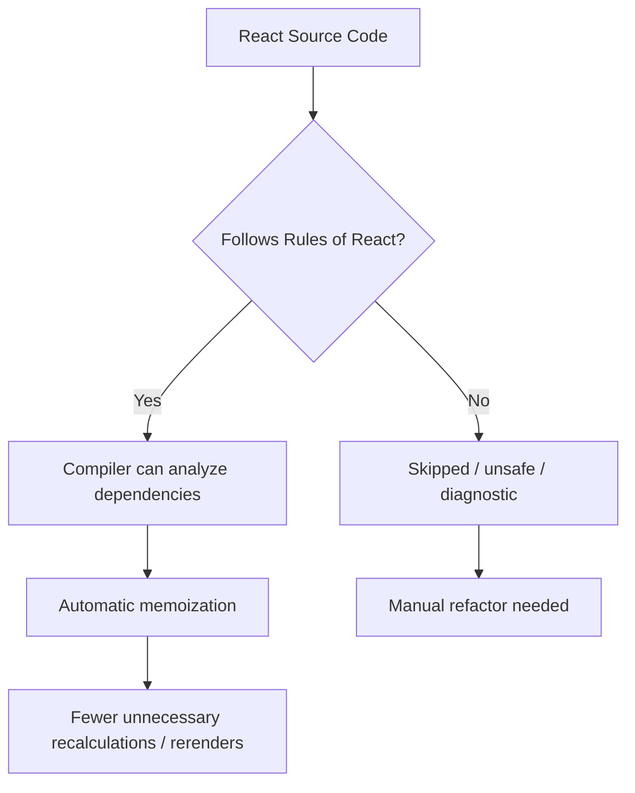
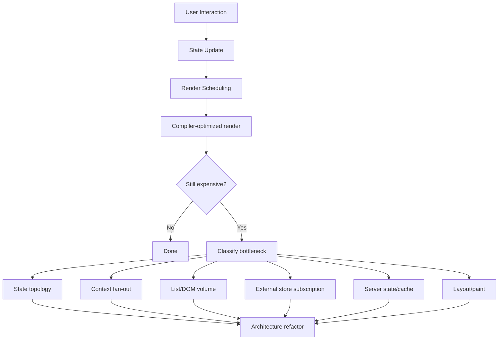
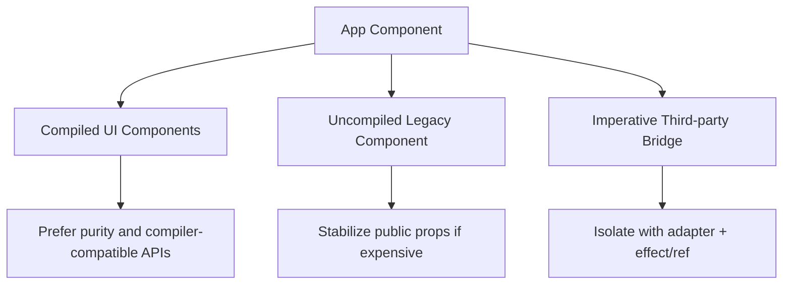
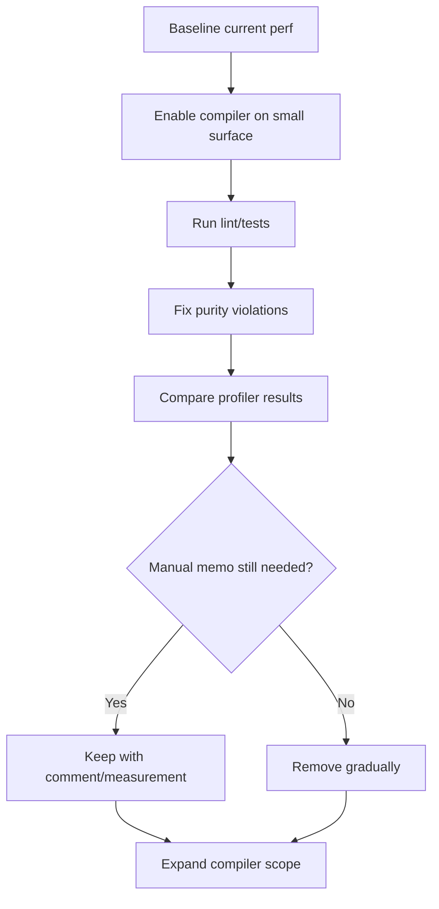

# Part 083 — React Compiler-Era Performance

React Compiler mengubah baseline performance React.

Sebelum compiler, engineer sering melakukan ritual ini:

```tsx
const value = useMemo(() => compute(input), [input]);
const onSubmit = useCallback(() => submit(input), [input]);
const Card = memo(function Card(props) {
  return <div>{props.title}</div>;
});
```

Kadang benar. Sering hanya noise.

Di era compiler, pertanyaan berubah dari:

```txt
Apa yang harus saya memoize secara manual?
```

menjadi:

```txt
Apakah code saya cukup pure, explicit, dan compiler-compatible sehingga React bisa mengoptimalkannya dengan aman?
```

Compiler bukan alasan untuk berhenti memahami performance. Justru sebaliknya: compiler membuat performance engineering bergeser dari **micro memoization** ke **program shape, state topology, render purity, dan boundary design**.

---

## 1. Mental Model

React Compiler adalah build-time optimizer.

Tujuannya bukan mengubah model React, tetapi mengoptimalkan code React yang mengikuti rules React.



Compiler hanya aman bila component dan hook dapat dianalisis sebagai fungsi yang pure terhadap input React:

```txt
props + state + context -> JSX
```

Jika render membaca/mengubah hal mutable sembarangan, menulis ke external system, mengandalkan waktu/random, atau melakukan mutation yang melanggar purity, compiler kehilangan ruang aman untuk optimasi.

---

## 2. Apa yang Berubah dari Era Manual Memoization

Sebelum compiler, performance React sering terlihat seperti ini:

```txt
profile -> temukan rerender -> tambahkan memo/useMemo/useCallback -> ukur lagi
```

Di era compiler, baseline yang lebih baik adalah:

```txt
pastikan purity -> bentuk state topology benar -> aktifkan compiler -> profile -> memo/manual optimize hanya untuk kasus tersisa
```

Perbandingan:

| Area | Sebelum Compiler | Dengan Compiler |
|---|---|---|
| Component render skip | banyak `React.memo` manual | banyak kasus dapat dioptimalkan otomatis |
| Value/function identity | banyak `useMemo` / `useCallback` | banyak identity stabil dapat dihasilkan compiler |
| Early return cases | sulit dimemoize manual setelah branch tertentu | compiler bisa menganalisis lebih dalam pada code valid |
| Correctness | tetap harus benar tanpa memo | tetap harus benar tanpa memo |
| Bottleneck besar | state topology/list/context tetap perlu desain | tetap perlu desain |
| Debugging | manual memo sering menyembunyikan bau desain | compiler memaksa code lebih pure dan eksplisit |

Golden rule tetap sama:

```txt
Memoization adalah optimization, bukan correctness mechanism.
```

Kalau aplikasi hanya benar saat memakai `useMemo`, biasanya masalahnya bukan performance, tetapi invariant atau mutation.

---

## 3. Compiler Tidak Menghilangkan Semua Masalah Performance

Compiler membantu pada kelas masalah tertentu:

```txt
unnecessary recomputation
unnecessary rerender karena identity yang bisa dianalisis
manual memoization boilerplate
```

Compiler tidak otomatis menyelesaikan:

```txt
context value terlalu volatile
state diletakkan terlalu tinggi
list ribuan row tanpa virtualization
DOM/layout thrashing
network waterfall
server-state invalidation salah
expensive chart/DOM library
large JSON parsing di main thread
subscription eksternal yang terlalu broad
query key salah
component impure
```

Dengan kata lain:

```txt
Compiler mengurangi biaya render yang tidak perlu.
Compiler tidak memperbaiki arsitektur state yang salah.
```

---

## 4. Performance Model Baru



Compiler membuat pertanyaan performance menjadi lebih struktural:

```txt
Kenapa update ini menyentuh subtree sebesar ini?
Kenapa consumer context terlalu banyak?
Kenapa state high-frequency berada di provider global?
Kenapa derived data mahal dihitung di banyak tempat?
Kenapa expensive DOM tetap dimount semua?
```

---

## 5. Compiler-Compatible Code

Compiler paling efektif pada code yang mengikuti rules ini:

```txt
component pure
hook pure kecuali effect/event boundary
props/state tidak dimutasi
render tidak punya side effect
object/function dependency eksplisit
state shape tidak ambigu
external mutable object tidak dibaca sebagai sumber render tanpa subscription
```

Contoh buruk:

```tsx
let globalCounter = 0;

function CounterLabel() {
  globalCounter += 1;
  return <span>{globalCounter}</span>;
}
```

Masalah:

- render melakukan mutation,
- output bergantung pada jumlah render,
- concurrent rendering dapat membuat hasil tidak intuitif,
- compiler tidak punya model aman.

Versi benar:

```tsx
function CounterLabel({ count }: { count: number }) {
  return <span>{count}</span>;
}
```

Input eksplisit. Output deterministik.

---

## 6. Purity Lebih Penting daripada `useMemo`

Code ini sering tampak “optimized”, tetapi sebenarnya rapuh:

```tsx
function ProductList({ products }: { products: Product[] }) {
  const visible = useMemo(() => {
    products.sort((a, b) => a.name.localeCompare(b.name));
    return products;
  }, [products]);

  return <Rows rows={visible} />;
}
```

`useMemo` tidak menyelamatkan mutation.

`sort` memutasi array asal. Kalau `products` berasal dari props/query cache/store, ini bisa merusak referential integrity dan membuat cache/entity invariant bocor.

Versi benar:

```tsx
function ProductList({ products }: { products: Product[] }) {
  const visible = [...products].sort((a, b) => a.name.localeCompare(b.name));
  return <Rows rows={visible} />;
}
```

Di era compiler, bentuk ini lebih sehat. Compiler punya kesempatan untuk mengoptimalkan kalkulasi yang pure. Manual memoization bisa dipertimbangkan lagi hanya bila profiling membuktikan kalkulasinya mahal dan belum cukup dioptimalkan.

---

## 7. Apa Nasib `useMemo`, `useCallback`, dan `memo`?

Mereka tidak hilang. Tetapi frekuensinya harus turun.

Gunakan manual memoization saat ada alasan eksplisit:

| Tool | Masih Valid Saat |
|---|---|
| `useMemo` | kalkulasi mahal, dependency jelas, hasil dipakai expensive subtree, compiler tidak cukup atau belum aktif |
| `useCallback` | function identity menjadi bagian dari external subscription, imperative API, memo child boundary, atau dependency effect valid |
| `memo` | library boundary, compiled/uncompiled boundary, child sangat mahal, props stabil dan comparison murah |
| custom equality | data kecil, comparison aman, measured benefit jelas |

Jangan gunakan hanya karena:

```txt
takut rerender
lint noise
kebiasaan lama
mengira function baru selalu mahal
mengira object literal selalu masalah
```

Function allocation biasanya bukan bottleneck utama. Yang mahal adalah render subtree besar, DOM update, layout, expensive calculation, dan fan-out state.

---

## 8. Manual Memoization yang Masih Arsitektural

Ada memoization yang bukan sekadar micro-optimization, tetapi boundary contract.

Contoh context value:

```tsx
function PermissionProvider({ children }: { children: React.ReactNode }) {
  const permissions = usePermissionSnapshot();

  const value = useMemo(() => ({
    can(action: string, resource: string) {
      return evaluatePermission(permissions, action, resource);
    },
  }), [permissions]);

  return (
    <PermissionContext value={value}>
      {children}
    </PermissionContext>
  );
}
```

Kenapa masih masuk akal?

- provider value identity memengaruhi seluruh consumer,
- context fan-out bisa besar,
- API capability harus stabil,
- `permissions` adalah dependency aktual.

Tetapi jika `permissions` berubah sangat sering, `useMemo` tidak cukup. Solusinya bukan memo lebih banyak, tetapi pecah context atau pindah ke selector/external store.

---

## 9. Compiler Directives: Escape Hatch, Bukan Gaya Hidup

React Compiler menyediakan directive seperti:

```tsx
function Component() {
  "use memo";
  return <div />;
}
```

Dan:

```tsx
function Component() {
  "use no memo";
  return <div />;
}
```

Gunakan directive sebagai boundary eksplisit:

| Directive | Makna Arsitektural |
|---|---|
| `"use memo"` | component/hook ini sengaja ingin dianalisis/dioptimalkan oleh compiler |
| `"use no memo"` | component/hook ini sengaja dikecualikan sementara atau karena incompatible boundary |

Jangan menabur directive tanpa alasan. Directive harus punya comment/ADR kecil jika dipakai di code production:

```tsx
function ThirdPartyChartBridge(props: ChartBridgeProps) {
  "use no memo";
  // This component wraps a mutable third-party chart instance.
  // Keep it outside compiler optimization until the adapter is refactored.
  return <ChartBridgeImpl {...props} />;
}
```

---

## 10. Compiler Boundary dengan Library dan Third-Party Code

Codebase production jarang full homogeneous.

Biasanya ada:

```txt
app code compiled
internal component library maybe compiled
legacy package not compiled
third-party package not compiled
chart/map/editor library imperative
microfrontend boundary
```

Compiler boundary strategy:



At boundary, manual memoization masih bisa berguna:

```tsx
const editorConfig = useMemo(() => ({
  readonly,
  language,
  theme,
}), [readonly, language, theme]);

return <LegacyEditor config={editorConfig} />;
```

Alasannya bukan karena semua object literal buruk, tetapi karena legacy child mungkin melakukan expensive re-initialization saat identity berubah.

---

## 11. React Compiler dan State Topology

Compiler tidak bisa memperbaiki state yang diletakkan terlalu tinggi.

Buruk:

```tsx
function AppShell() {
  const [draftSearch, setDraftSearch] = useState("");

  return (
    <AppProviders>
      <Header search={draftSearch} onSearchChange={setDraftSearch} />
      <MainRoutes draftSearch={draftSearch} />
      <Footer />
    </AppProviders>
  );
}
```

Jika `draftSearch` hanya dipakai di satu search page, state ini terlalu tinggi. Setiap ketikan menyentuh app shell.

Lebih baik:

```tsx
function SearchPage() {
  const [draftSearch, setDraftSearch] = useState("");

  return (
    <SearchLayout>
      <SearchBox value={draftSearch} onChange={setDraftSearch} />
      <SearchResults draftSearch={draftSearch} />
    </SearchLayout>
  );
}
```

Compiler bisa mengurangi beberapa biaya render, tetapi state topology yang benar tetap mengurangi render radius secara fundamental.

---

## 12. React Compiler dan Context

Compiler tidak mengubah fakta bahwa context consumer membaca value context sebagai input render.

Jika provider value berubah, consumer yang membaca context perlu dihitung ulang terhadap value baru.

Buruk:

```tsx
<AppContext value={{ user, permissions, theme, flags, draftSearch, setDraftSearch }}>
  <App />
</AppContext>
```

Masalah:

- terlalu banyak domain dalam satu context,
- value object baru mudah berubah,
- state high-frequency bercampur dengan low-frequency capability,
- consumer sulit diketahui dependency sebenarnya.

Lebih baik:

```tsx
<AuthContext value={authValue}>
  <ThemeContext value={themeValue}>
    <FeatureFlagContext value={flagValue}>
      <App />
    </FeatureFlagContext>
  </ThemeContext>
</AuthContext>
```

Atau untuk state high-frequency:

```txt
context hanya membawa store/capability stabil
component subscribe ke slice lewat selector
```

Compiler membantu render lokal, bukan memperbaiki context taxonomy.

---

## 13. React Compiler dan External Store

External store tetap harus mengikuti kontrak snapshot.

Kalau `getSnapshot` selalu membuat object baru, render bisa loop atau selalu miss:

```tsx
function getSnapshot() {
  return { ...store.getState() }; // buruk jika dipanggil setiap render tanpa caching
}
```

Benar:

```tsx
let currentState = initialState;
let currentSnapshot = currentState;

function getSnapshot() {
  return currentSnapshot;
}

function setState(updater: (state: State) => State) {
  const next = updater(currentState);
  if (Object.is(next, currentState)) return;
  currentState = next;
  currentSnapshot = next;
  listeners.forEach(listener => listener());
}
```

Compiler tidak mengganti `useSyncExternalStore`. External subscription harus benar secara semantic.

---

## 14. Profiling di Era Compiler

Jangan berasumsi compiler menyelesaikan semua hal. Tetap ukur.

Profiling workflow:

```txt
1. Reproduce interaction lambat.
2. Aktifkan React DevTools Profiler / browser performance tools.
3. Identifikasi apakah bottleneck render, commit, layout, network, JS CPU, atau memory.
4. Cek render radius dan komponen yang sering render.
5. Cek context/provider/store/query update source.
6. Cek apakah compiler aktif untuk area itu.
7. Refactor topology/boundary sebelum menambah manual memo.
8. Ukur ulang.
```

Diagnosis matrix:

| Symptom | Kemungkinan Penyebab | Fix Pertama |
|---|---|---|
| input lag | expensive subtree ikut update urgent | colocate state, `useDeferredValue`, split component |
| semua halaman rerender | state di root/provider global | turunkan state, split provider |
| context consumer banyak rerender | provider value volatile | split context, memo value, selector store |
| chart re-init | config identity berubah atau imperative adapter buruk | stable config, adapter effect cleanup |
| list lambat | terlalu banyak DOM/render | virtualization, row memo, selector per row |
| update cache lambat | invalidation terlalu luas | query key hierarchy, targeted update |
| memory naik | memo cache/listener leak | cleanup, reduce cache cardinality |

---

## 15. Migration Strategy ke Compiler-Era Codebase

Jangan migrasi dengan “hapus semua memo”. Itu sembrono.

Gunakan staged migration:



Langkah praktis:

```txt
1. Tambahkan lint rules React Hooks/Compiler.
2. Aktifkan compiler di area non-kritis dulu.
3. Perbaiki mutation/render impurity yang terdeteksi.
4. Jangan hapus memo manual yang menjaga library boundary sebelum diukur.
5. Tambahkan regression test untuk workflow penting.
6. Profile before/after untuk interaksi mahal.
7. Dokumentasikan exception dengan ADR/comment singkat.
```

---

## 16. Manual Memo Removal Checklist

Sebelum menghapus `useMemo`:

```txt
Apakah kalkulasi mahal?
Apakah hasil dikirim ke memo child?
Apakah hasil dipakai sebagai dependency effect/subscription?
Apakah object identity dipakai third-party bridge?
Apakah compiler aktif di file/component ini?
Apakah ada benchmark/profile before-after?
```

Sebelum menghapus `useCallback`:

```txt
Apakah callback dikirim ke memo child?
Apakah callback dipakai sebagai dependency effect?
Apakah callback didaftarkan ke external system?
Apakah callback identity menjadi bagian dari imperative contract?
```

Sebelum menghapus `memo`:

```txt
Apakah component expensive?
Apakah props biasanya stabil?
Apakah child berada di compiled boundary?
Apakah parent sering render karena state lain?
Apakah custom equality aman?
```

Jika jawabannya tidak jelas, jangan refactor berdasarkan selera. Ukur.

---

## 17. Compiler-Era Component API Design

Agar compiler dan performance natural, desain component API harus menghindari konfigurasi yang terlalu dinamis.

Lebih baik:

```tsx
<DataTable
  rows={rows}
  columns={columns}
  getRowId={(row) => row.id}
  onRowSelect={handleRowSelect}
/>
```

Daripada:

```tsx
<DataTable
  config={{
    rows,
    columns,
    callbacks: {
      onSelect: handleRowSelect,
    },
    behavior: {
      selectable: true,
      virtualized: true,
    },
  }}
/>
```

Konfigurasi object besar sering membuat dependency tidak jelas:

```txt
Apa yang berubah?
Apa yang mahal?
Apa yang harus invalidate?
Apa yang harus preserve?
```

API eksplisit membantu manusia, compiler, profiler, dan tests.

---

## 18. Common Failure Modes

### 18.1 Compiler dijadikan alasan tidak profile

Salah:

```txt
Compiler sudah aktif, berarti performance aman.
```

Benar:

```txt
Compiler mengurangi sebagian overhead. Bottleneck tetap harus diukur.
```

### 18.2 Menghapus manual memo yang melindungi boundary legacy

Jika component membungkus chart/editor/map imperative, identity mungkin mengontrol re-initialization. Hapus memo hanya setelah adapter benar.

### 18.3 Code impure lalu berharap compiler menyelamatkan

Compiler tidak membuat code impure menjadi benar. Perbaiki purity dulu.

### 18.4 Provider global tetap terlalu volatile

Compiler tidak mengubah semantic context. Provider volatile tetap membuat consumer membaca value baru.

### 18.5 Query/cache invalidation dianggap render problem

Kadang UI lambat atau salah bukan karena render, tetapi karena cache invalidation terlalu luas atau stale.

### 18.6 Custom equality lebih mahal dari render

Deep compare besar dapat lebih mahal daripada render yang ingin dihindari.

---

## 19. Production Review Checklist

Gunakan checklist ini saat review PR performance di era compiler:

```txt
[ ] Component render pure dan deterministic.
[ ] Tidak ada mutation props/state/query data.
[ ] State berada di owner tersempit yang benar.
[ ] Context tidak mencampur state volatile dan capability low-frequency.
[ ] External store memakai snapshot stabil.
[ ] Manual memoization punya alasan eksplisit.
[ ] Compiler exception punya comment/ADR kecil.
[ ] Performance claim didukung profiling.
[ ] Large list memakai virtualization/row boundary bila perlu.
[ ] Async/server-state bottleneck tidak diperlakukan sebagai render-only problem.
```

---

## 20. Latihan Implementasi

Ambil satu page React yang terasa lambat.

Tulis audit berikut:

```txt
Interaction:
Expected latency:
Observed latency:
Update source:
Render radius:
Compiler enabled? yes/no
Manual memoization present:
Context providers touched:
External stores touched:
Server queries touched:
Main bottleneck class:
Refactor candidate:
Measured after:
```

Kemudian lakukan refactor kecil:

```txt
1. Turunkan state yang terlalu tinggi, atau
2. Split context yang volatile, atau
3. Pindahkan derived data ke selector, atau
4. Tambahkan deferred/transition boundary, atau
5. Stabilkan legacy bridge props, atau
6. Hapus memo manual yang terbukti tidak perlu.
```

Jangan lakukan semua sekaligus. Performance engineering yang baik butuh isolasi sebab-akibat.

---

## 21. Kesimpulan

React Compiler menaikkan baseline performance, tetapi tidak menggantikan arsitektur.

Engineer kuat di era compiler bukan yang paling banyak menulis `useMemo`, tetapi yang bisa menjawab:

```txt
Apakah code ini pure?
Apakah state topology-nya benar?
Apakah provider terlalu volatile?
Apakah expensive subtree punya boundary tepat?
Apakah bottleneck render, commit, layout, network, atau cache?
Apakah manual memo ini masih punya alasan setelah compiler aktif?
```

Performance React modern adalah gabungan:

```txt
purity
+ state ownership
+ compiler-compatible code
+ context/store/query boundary
+ profiling discipline
+ targeted manual optimization
```

Compiler mengurangi boilerplate. Ia tidak menghapus kebutuhan berpikir.

---

## References

- React Compiler — https://react.dev/learn/react-compiler
- React Compiler Introduction — https://react.dev/learn/react-compiler/introduction
- React Compiler Directives — https://react.dev/reference/react-compiler/directives
- `"use memo"` Directive — https://react.dev/reference/react-compiler/directives/use-memo
- `"use no memo"` Directive — https://react.dev/reference/react-compiler/directives/use-no-memo
- `memo` Reference — https://react.dev/reference/react/memo
- `useMemo` Reference — https://react.dev/reference/react/useMemo
- Components and Hooks Must Be Pure — https://react.dev/reference/rules/components-and-hooks-must-be-pure
