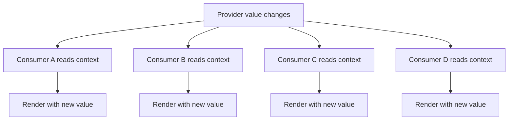
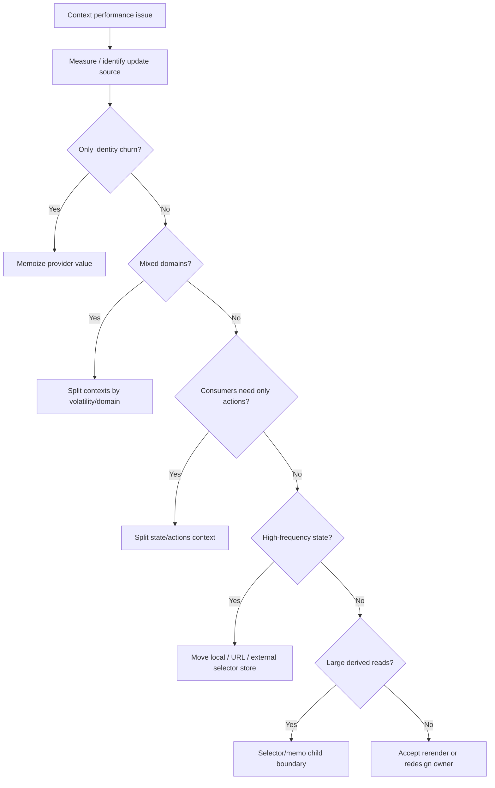

# Part 084 — Context Performance Refactoring

Context bukan lambat secara otomatis.

Context menjadi mahal ketika dipakai untuk value yang:

```txt
terlalu besar
terlalu sering berubah
terlalu tinggi scope-nya
terlalu banyak consumer-nya
terlalu implicit dependency-nya
```

Masalah Context jarang diselesaikan dengan satu `useMemo`. Biasanya butuh refactor topology.

Part ini adalah playbook praktis untuk membaca, mendiagnosis, dan memperbaiki Context performance di codebase besar.

---

## 1. Mental Model

Consumer context membaca value dari provider terdekat di atasnya.



Jika provider value berubah, semua consumer yang membaca context itu harus dievaluasi terhadap value baru.

Jadi pertanyaan performance Context bukan:

```txt
Bagaimana menghentikan semua rerender?
```

Pertanyaan yang benar:

```txt
Apakah semua consumer memang membutuhkan perubahan value ini?
```

Kalau jawabannya tidak, context boundary-nya terlalu besar.

---

## 2. Anatomy of a Bad Provider

Contoh provider yang terlihat nyaman tetapi berbahaya:

```tsx
const AppContext = createContext<AppContextValue | null>(null);

function AppProvider({ children }: { children: React.ReactNode }) {
  const [user, setUser] = useState<User | null>(null);
  const [theme, setTheme] = useState<Theme>("light");
  const [draftSearch, setDraftSearch] = useState("");
  const [selectedRows, setSelectedRows] = useState<string[]>([]);
  const [toastQueue, setToastQueue] = useState<Toast[]>([]);

  return (
    <AppContext value={{
      user,
      setUser,
      theme,
      setTheme,
      draftSearch,
      setDraftSearch,
      selectedRows,
      setSelectedRows,
      toastQueue,
      setToastQueue,
    }}>
      {children}
    </AppContext>
  );
}
```

Masalahnya bukan hanya object literal baru.

Masalah sebenarnya:

```txt
auth state, theme, search draft, selection, toast queue dicampur dalam satu invalidation domain
```

Setiap perubahan `draftSearch` membuat consumer yang hanya butuh `theme` ikut membaca context baru.

---

## 3. Diagnosis: Identity Problem atau Topology Problem?

Context performance punya dua kelas masalah.

### 3.1 Identity Problem

Provider value berubah padahal semantic value sama.

Contoh:

```tsx
<AuthContext value={{ user, logout }}>
  {children}
</AuthContext>
```

Jika `logout` dibuat ulang setiap render dan object value juga dibuat ulang, consumer dapat rerender walau `user` sama.

Fix awal:

```tsx
const logout = useCallback(() => {
  authClient.logout();
}, [authClient]);

const value = useMemo(() => ({ user, logout }), [user, logout]);

return <AuthContext value={value}>{children}</AuthContext>;
```

### 3.2 Topology Problem

Provider value memang sering berubah, dan terlalu banyak consumer terdampak.

Contoh:

```tsx
<DashboardContext value={{ filters, setFilters, hoveredRowId, setHoveredRowId }}>
  <Dashboard />
</DashboardContext>
```

`hoveredRowId` berubah sangat sering. `filters` berubah jarang. Mencampurnya adalah topology bug.

Fix bukan sekadar `useMemo`. Fix-nya split/migrate.

---

## 4. Context Refactoring Ladder

Gunakan urutan ini. Jangan langsung lompat ke global store.



Refactor paling murah yang benar adalah refactor yang menyelesaikan cause paling dekat.

---

## 5. Refactor 1 — Memoize Provider Value

Ini fix untuk identity churn, bukan untuk mixed volatile state.

Before:

```tsx
function ThemeProvider({ children }: { children: React.ReactNode }) {
  const [theme, setTheme] = useState<Theme>("light");

  return (
    <ThemeContext value={{ theme, setTheme }}>
      {children}
    </ThemeContext>
  );
}
```

After:

```tsx
function ThemeProvider({ children }: { children: React.ReactNode }) {
  const [theme, setTheme] = useState<Theme>("light");

  const value = useMemo(() => ({ theme, setTheme }), [theme]);

  return (
    <ThemeContext value={value}>
      {children}
    </ThemeContext>
  );
}
```

Catatan:

- `setTheme` identity stabil dari React.
- dependency cukup `[theme]`.
- consumer tetap rerender saat `theme` berubah.
- ini tidak memecahkan masalah jika `theme` berubah terlalu sering atau context terlalu luas.

---

## 6. Refactor 2 — Split State and Actions Context

Banyak component hanya butuh command, bukan state.

Before:

```tsx
const CartContext = createContext<CartContextValue | null>(null);

function AddToCartButton({ productId }: { productId: string }) {
  const { addItem } = useCart();
  return <button onClick={() => addItem(productId)}>Add</button>;
}
```

Jika `CartContext` juga membawa `items`, tombol ikut rerender setiap cart berubah.

After:

```tsx
const CartStateContext = createContext<CartState | null>(null);
const CartActionsContext = createContext<CartActions | null>(null);

function CartProvider({ children }: { children: React.ReactNode }) {
  const [state, dispatch] = useReducer(cartReducer, initialCartState);

  const actions = useMemo<CartActions>(() => ({
    addItem(productId) {
      dispatch({ type: "item.added", productId });
    },
    removeItem(productId) {
      dispatch({ type: "item.removed", productId });
    },
  }), []);

  return (
    <CartActionsContext value={actions}>
      <CartStateContext value={state}>
        {children}
      </CartStateContext>
    </CartActionsContext>
  );
}
```

Now:

```tsx
function AddToCartButton({ productId }: { productId: string }) {
  const { addItem } = useCartActions();
  return <button onClick={() => addItem(productId)}>Add</button>;
}
```

`AddToCartButton` tidak perlu subscribe ke `CartStateContext`.

---

## 7. Refactor 3 — Split by Domain

Jika satu context membawa banyak domain, pecah berdasarkan alasan berubah.

Before:

```tsx
<AppContext value={{ auth, theme, flags, permissions, layout, notifications }}>
  {children}
</AppContext>
```

After:

```tsx
<AuthProvider>
  <PermissionProvider>
    <ThemeProvider>
      <FeatureFlagProvider>
        <NotificationProvider>
          {children}
        </NotificationProvider>
      </FeatureFlagProvider>
    </ThemeProvider>
  </PermissionProvider>
</AuthProvider>
```

Jangan takut provider nesting jika domain jelas. Yang berbahaya bukan nesting, tetapi dependency tersembunyi.

Jika nesting terlalu noisy, buat composition helper:

```tsx
function AppProviders({ children }: { children: React.ReactNode }) {
  return (
    <AuthProvider>
      <PermissionProvider>
        <ThemeProvider>
          <FeatureFlagProvider>
            {children}
          </FeatureFlagProvider>
        </ThemeProvider>
      </PermissionProvider>
    </AuthProvider>
  );
}
```

---

## 8. Refactor 4 — Split by Volatility

Volatility lebih penting daripada nama domain.

Contoh dashboard:

| State | Volatility | Scope Ideal |
|---|---:|---|
| saved filters | rendah | URL/query/cache |
| draft filter input | sedang/tinggi | local component |
| hovered row | tinggi | local row/table state |
| selected row IDs | sedang | table provider/external store |
| permissions | rendah | permission context |
| viewport measurement | tinggi | local/external layout store |

Jangan mencampur high-frequency state dengan low-frequency dependency.

Bad:

```tsx
<TableContext value={{ columns, selectedIds, hoveredId, measuredWidths }}>
  <Table />
</TableContext>
```

Better:

```tsx
<TableConfigContext value={tableConfig}>
  <TableSelectionProvider>
    <TableMeasurementStoreProvider>
      <Table />
    </TableMeasurementStoreProvider>
  </TableSelectionProvider>
</TableConfigContext>
```

Atau lebih sederhana: `hoveredId` tetap local di row/table, tidak masuk provider.

---

## 9. Refactor 5 — Memoized Child Boundary

Kadang consumer butuh context, tetapi expensive child hanya butuh sebagian kecil.

Before:

```tsx
function ProductPanel() {
  const { theme, density, products } = useDashboardContext();

  return (
    <ExpensiveProductGrid
      density={density}
      products={products}
    />
  );
}
```

Jika `theme` berubah, `ProductPanel` rerender dan child juga ikut jika props identity berubah.

After:

```tsx
function ProductPanel() {
  const { density, products } = useDashboardContext();

  return (
    <MemoizedProductGrid
      density={density}
      products={products}
    />
  );
}

const MemoizedProductGrid = memo(function ProductGrid(props: ProductGridProps) {
  return <ExpensiveProductGridImpl {...props} />;
});
```

Ini bukan solusi utama untuk context yang salah bentuk, tetapi berguna sebagai containment boundary.

---

## 10. Refactor 6 — Context Carries Store, Consumers Select Slice

Untuk shared client state dengan banyak consumer dan update granular, Context bisa membawa store stabil. Consumer subscribe ke slice via external store.

```tsx
type StoreApi<State> = {
  getState(): State;
  subscribe(listener: () => void): () => void;
  setState(updater: (state: State) => State): void;
};

const DashboardStoreContext = createContext<StoreApi<DashboardState> | null>(null);

function DashboardStoreProvider({ children }: { children: React.ReactNode }) {
  const storeRef = useRef<StoreApi<DashboardState> | null>(null);

  if (storeRef.current === null) {
    storeRef.current = createDashboardStore(initialDashboardState);
  }

  return (
    <DashboardStoreContext value={storeRef.current}>
      {children}
    </DashboardStoreContext>
  );
}
```

Selector hook:

```tsx
function useDashboardSelector<T>(
  selector: (state: DashboardState) => T,
  isEqual: (a: T, b: T) => boolean = Object.is
): T {
  const store = useRequiredContext(DashboardStoreContext);
  const lastRef = useRef<T>();

  return useSyncExternalStore(
    store.subscribe,
    () => {
      const selected = selector(store.getState());
      const last = lastRef.current;

      if (last !== undefined && isEqual(last, selected)) {
        return last;
      }

      lastRef.current = selected;
      return selected;
    },
    () => selector(store.getState())
  );
}
```

Now component reads only what it needs:

```tsx
function SelectedCount() {
  const count = useDashboardSelector(state => state.selectedIds.length);
  return <span>{count}</span>;
}
```

Context value is stable. Store updates are granular.

This is the bridge from Context to external store architecture.

---

## 11. Refactor 7 — Move High-Frequency State Out of Context

High-frequency state includes:

```txt
mouse position
hovered row
drag position
scroll position
resize measurement
text draft per keystroke
animation frame state
realtime cursor
```

Putting these into Context is usually wrong.

Bad:

```tsx
<CanvasContext value={{ mousePosition, selectedTool, zoom }}>
  <Canvas />
</CanvasContext>
```

Every mouse move updates context.

Better options:

```txt
local ref for non-rendering value
local state at narrow component
requestAnimationFrame subscription store
canvas imperative layer
external store with selector
CSS/DOM state where appropriate
```

Example:

```tsx
function usePointerRef() {
  const pointerRef = useRef({ x: 0, y: 0 });

  const onPointerMove = useCallback((event: React.PointerEvent) => {
    pointerRef.current = { x: event.clientX, y: event.clientY };
  }, []);

  return { pointerRef, onPointerMove };
}
```

If value is not needed for render, it should not be React state/context.

---

## 12. Refactor 8 — Move Server State Out of Context

Server state in Context often causes stale data and broad rerender.

Bad:

```tsx
<UserContext value={{ users, reloadUsers, updateUser }}>
  {children}
</UserContext>
```

Better:

```tsx
function useUsersQuery(filters: UserFilters) {
  return useQuery({
    queryKey: ["users", "list", filters],
    queryFn: () => fetchUsers(filters),
  });
}

function useUpdateUserMutation() {
  const queryClient = useQueryClient();

  return useMutation({
    mutationFn: updateUser,
    onSuccess: () => {
      queryClient.invalidateQueries({ queryKey: ["users"] });
    },
  });
}
```

Context may still carry capability:

```tsx
<ApiClientContext value={apiClient}>
  {children}
</ApiClientContext>
```

But cache lifecycle belongs to a server-state manager, not hand-rolled Context.

---

## 13. Refactor 9 — Provider Scope Narrowing

Provider location controls blast radius.

Bad:

```tsx
function App() {
  return (
    <TableProvider>
      <Routes />
    </TableProvider>
  );
}
```

If only one route needs table state, provider is too high.

Better:

```tsx
function CasesRoute() {
  return (
    <CaseTableProvider>
      <CaseSearchPage />
    </CaseTableProvider>
  );
}
```

Provider should be placed at the smallest stable subtree that needs the dependency.

Rule:

```txt
Place provider at the nearest durable boundary shared by all consumers, not at the app root by default.
```

---

## 14. Refactor 10 — Scoped Override Instead of Global Mutation

Context is excellent for scoped override.

Example design system:

```tsx
<DensityProvider value="compact">
  <Sidebar />
</DensityProvider>

<DensityProvider value="comfortable">
  <MainContent />
</DensityProvider>
```

This is better than global mutable density state if different subtrees need different behavior.

For performance, scoped override also narrows rerender blast radius:

```txt
changing sidebar density does not imply changing main content density
```

---

## 15. Refactor 11 — Derived Context Value

Do not put large derived objects into context if they can be selected locally.

Bad:

```tsx
<PermissionContext value={{
  permissions,
  visibleMenuItems: computeVisibleMenuItems(menuItems, permissions),
  editableFields: computeEditableFields(schema, permissions),
}}>
  {children}
</PermissionContext>
```

This couples unrelated derived views.

Better:

```tsx
function useCan(action: Action, resource: Resource) {
  const permissions = usePermissions();
  return evaluatePermission(permissions, action, resource);
}

function useVisibleMenuItems(menuItems: MenuItem[]) {
  const permissions = usePermissions();

  return useMemo(() => {
    return menuItems.filter(item => evaluatePermission(permissions, "view", item.resource));
  }, [menuItems, permissions]);
}
```

Keep context value primitive/canonical. Derive view-specific data near consumer.

---

## 16. Context Performance Anti-Patterns

### 16.1 `AppContext`

A single context for everything is almost always a hidden global store.

### 16.2 Raw setter leakage

```tsx
const { setState } = useSomethingContext();
```

Consumers can create illegal state transitions. Prefer domain commands.

### 16.3 High-frequency context

Hover, mouse, scroll, drag, input draft, animation state do not belong in broad context.

### 16.4 Provider value as giant object

Large object value increases accidental dependency and hides volatility.

### 16.5 Default value trap

A default object may hide missing provider bugs and make tests lie.

Use strict context for required dependencies.

### 16.6 Derived view models inside provider

Provider becomes god object computing every consumer projection.

### 16.7 Context as event bus

Events have time semantics. Context has value semantics. Mixing them creates lost events and stale reads.

---

## 17. Debugging Protocol

When a context-based area is slow:

```txt
1. Identify interaction.
2. Identify state update source.
3. Identify provider whose value changes.
4. Count consumer fan-out.
5. Classify value fields by domain and volatility.
6. Find consumers that only need actions.
7. Find high-frequency values.
8. Find server-state values.
9. Apply smallest refactor.
10. Profile again.
```

Add temporary instrumentation:

```tsx
function useRenderLog(name: string) {
  const countRef = useRef(0);
  countRef.current += 1;

  useEffect(() => {
    console.debug(`${name} rendered ${countRef.current} times`);
  });
}
```

Use sparingly. Prefer profiler for final evidence.

---

## 18. Example: Refactoring a Slow Case Table

Before:

```tsx
<CaseTableContext value={{
  cases,
  filters,
  setFilters,
  selectedIds,
  setSelectedIds,
  hoveredId,
  setHoveredId,
  permissions,
  columns,
  columnWidths,
  setColumnWidths,
}}>
  <CaseTable />
</CaseTableContext>
```

Symptoms:

```txt
typing filter lags
hovering row rerenders toolbar
resizing column rerenders rows
permissions rarely change but all consumers read same context
```

Refactor:

```tsx
<PermissionContext value={permissionValue}>
  <CaseTableConfigContext value={configValue}>
    <CaseSelectionStoreProvider>
      <CaseColumnMeasurementStoreProvider>
        <CaseTable />
      </CaseColumnMeasurementStoreProvider>
    </CaseSelectionStoreProvider>
  </CaseTableConfigContext>
</PermissionContext>
```

State placement:

| Data | New Location |
|---|---|
| `cases` | TanStack Query / server-state cache |
| `filters` committed | URL state / query key |
| `draftFilter` | local input state |
| `selectedIds` | table-scoped external selector store |
| `hoveredId` | local row/table state or ref |
| `permissions` | low-frequency permission context |
| `columns` | config context |
| `columnWidths` | measurement store/local persistent state |

Resulting principle:

```txt
Every state class gets an invalidation domain matching its lifecycle.
```

---

## 19. Testing Refactored Context

Test behavior, not implementation detail.

```tsx
it("does not require state subscription for action-only consumer", async () => {
  render(
    <CartProvider>
      <AddToCartButton productId="p1" />
      <CartSummary />
    </CartProvider>
  );

  await user.click(screen.getByRole("button", { name: /add/i }));

  expect(screen.getByText(/1 item/i)).toBeInTheDocument();
});
```

For store selector, test selector behavior directly:

```tsx
it("notifies selected count subscribers only when selected count changes", () => {
  const store = createDashboardStore(initialState);
  const notifications: number[] = [];

  const unsubscribe = subscribeSelector(
    store,
    state => state.selectedIds.length,
    count => notifications.push(count)
  );

  store.setState(state => ({ ...state, hoveredId: "row-1" }));
  store.setState(state => ({ ...state, selectedIds: ["row-1"] }));

  expect(notifications).toEqual([1]);
  unsubscribe();
});
```

Performance-sensitive code needs both behavioral and subscription tests.

---

## 20. ADR Template for Context Refactor

Use this for non-trivial refactor:

```md
# ADR: Split CaseTableContext

## Problem
CaseTableContext mixes server data, URL filters, selection state, hover state, permissions, and layout measurements.
High-frequency updates rerender unrelated consumers.

## Decision
Split into PermissionContext, CaseTableConfigContext, CaseSelectionStoreProvider, and CaseColumnMeasurementStoreProvider.
Move cases to query cache and filters to URL state.

## Consequences
- More providers but clearer ownership.
- Selection updates become granular.
- Hover state no longer invalidates toolbar.
- Server data lifecycle handled by query cache.

## Rollout
1. Add new providers beside old context.
2. Migrate consumers by dependency class.
3. Remove old context fields incrementally.
4. Profile before/after.
```

Context refactor affects architecture. Document the reason.

---

## 21. Production Checklist

```txt
[ ] Provider scope is no higher than necessary.
[ ] Context represents one domain or one capability.
[ ] High-frequency state is not in broad context.
[ ] Server state is not hand-rolled in context.
[ ] Provider value identity is stable when semantic value is stable.
[ ] State and actions are split when action-only consumers exist.
[ ] Consumers do not receive giant context objects when they need one field.
[ ] Derived view models are computed near consumer unless shared intentionally.
[ ] External store is used when granular subscription is required.
[ ] Refactor impact is measured with profiler.
```

---

## 22. Kesimpulan

Context performance bukan tentang membenci Context.

Context bagus untuk:

```txt
scoped dependency
capability passing
theme/design-system tokens
permissions snapshot
provider override
compound component coordination
small subtree state
```

Context buruk untuk:

```txt
giant global app state
high-frequency interaction state
server-state cache
large normalized entities dengan banyak slice consumer
event stream
selection/hover/measurement pada table besar tanpa selector
```

Refactor yang benar mengikuti pertanyaan:

```txt
Apa value yang berubah?
Siapa consumer yang benar-benar butuh perubahan itu?
Apakah state ini punya lifecycle yang sama dengan context-nya?
Apakah provider terlalu tinggi?
Apakah ini identity problem atau topology problem?
```

Context bukan state manager universal. Context adalah dependency propagation mechanism. Gunakan sesuai bentuknya.

---

## References

- `useContext` Reference — https://react.dev/reference/react/useContext
- `createContext` Reference — https://react.dev/reference/react/createContext
- Passing Data Deeply with Context — https://react.dev/learn/passing-data-deeply-with-context
- Scaling Up with Reducer and Context — https://react.dev/learn/scaling-up-with-reducer-and-context
- `useSyncExternalStore` Reference — https://react.dev/reference/react/useSyncExternalStore
- `memo` Reference — https://react.dev/reference/react/memo
