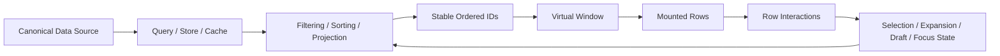
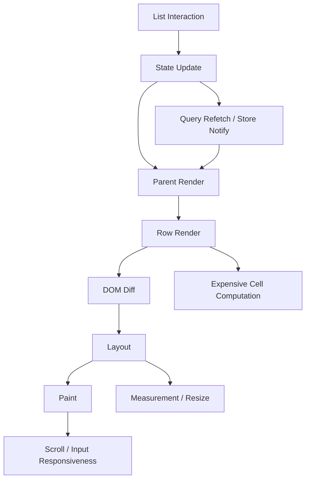
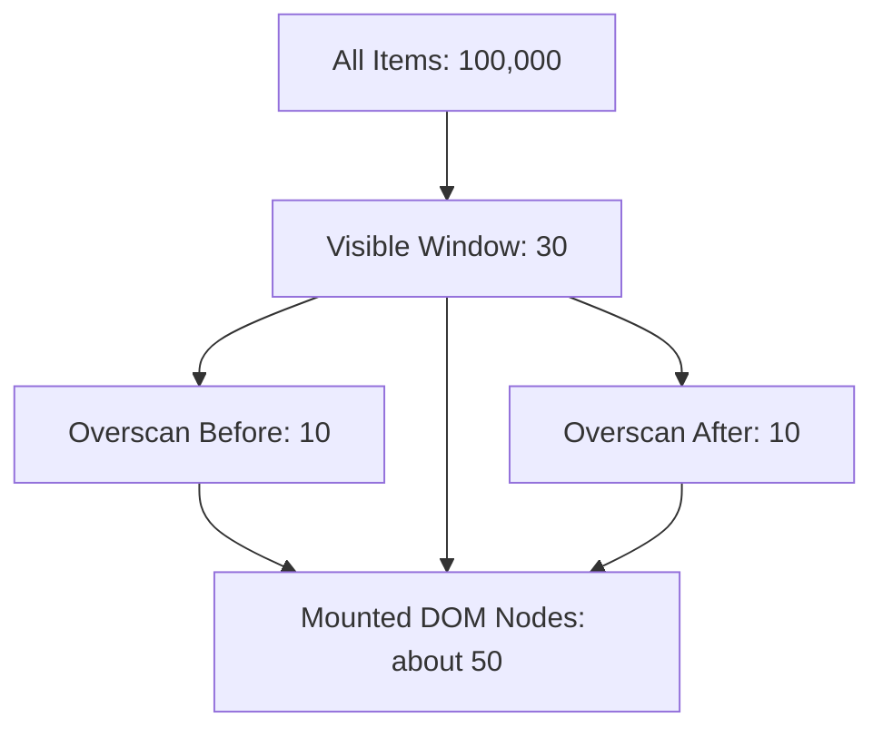
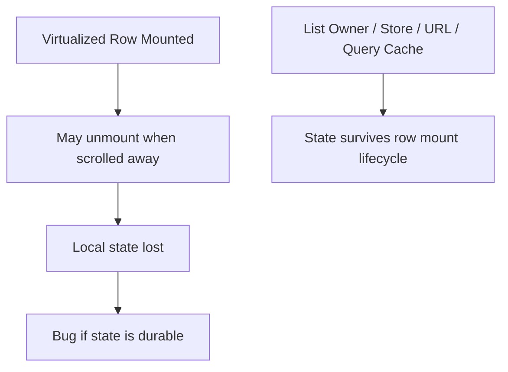
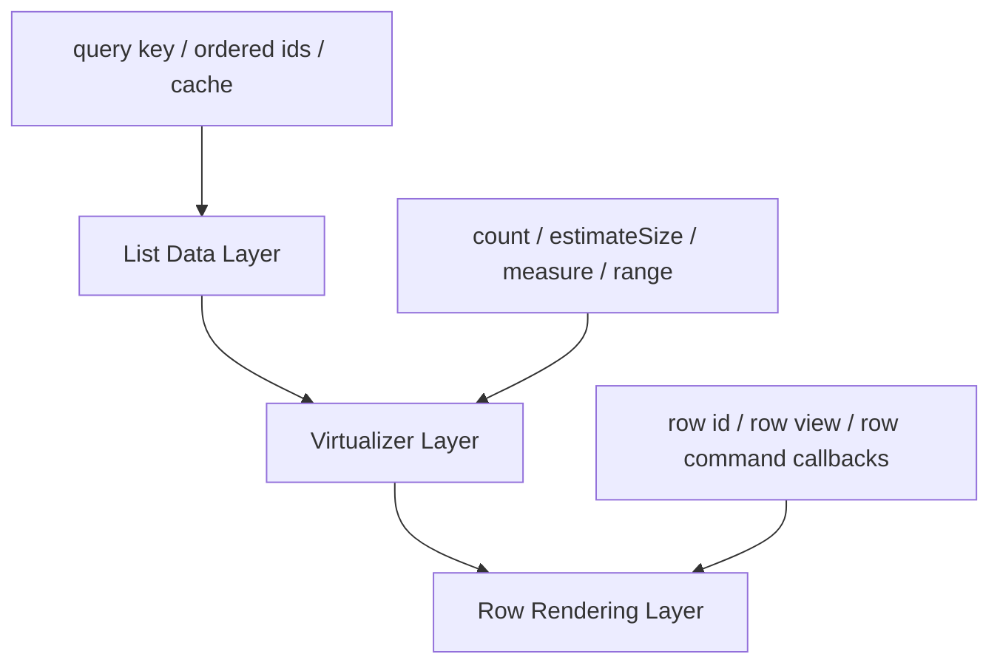
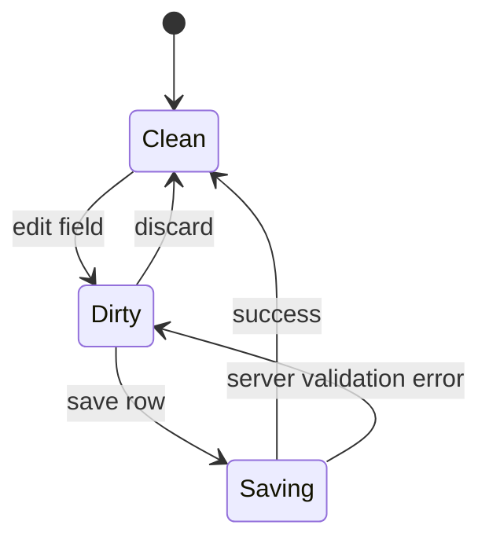
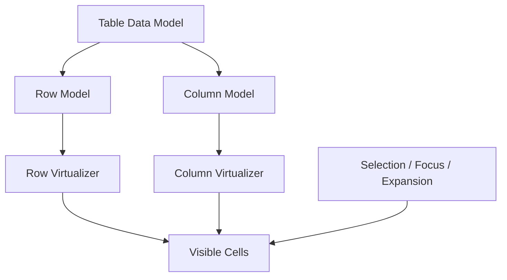
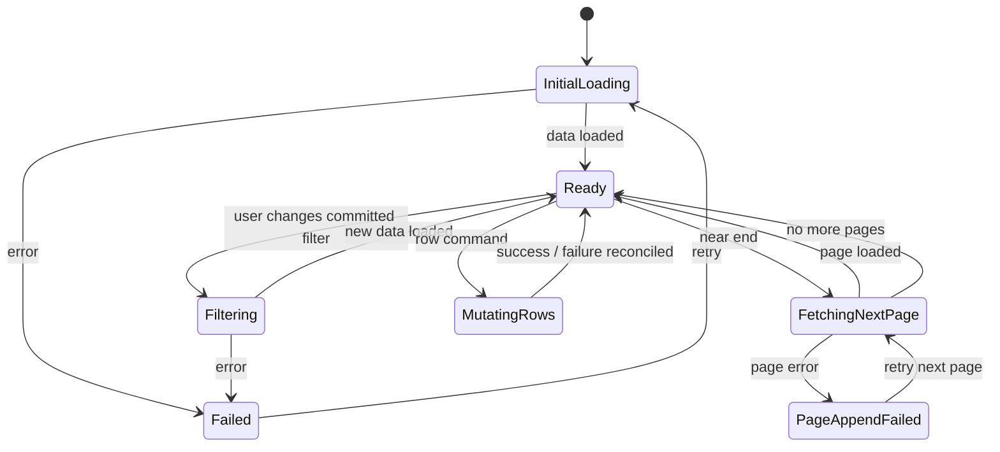

# Part 085 — Large List and Virtualized UI State

Large list performance is rarely solved by one trick.

A slow table, search result page, inbox, audit log, queue screen, tree grid, or notification center usually has several problems tangled together:

1. too many DOM nodes,
2. too much render work,
3. unstable row identity,
4. selection state stored by array index,
5. fetch pagination coupled to scroll position,
6. expensive derived data inside every row,
7. context fan-out across thousands of consumers,
8. measurement work blocking paint,
9. scroll state being lost during refresh,
10. accessibility semantics broken by virtualization.

Virtualization reduces the number of mounted elements. It does not automatically fix state ownership, query key design, event contracts, selection invariants, or measurement lifecycle. This part is about the architecture around virtualized UI, not merely about installing a virtual list library.

We will treat a large list as a **stateful projection pipeline**:



The key idea:

> In a large list, row state must be keyed by durable identity, not by visual position.

If this invariant is broken, virtualization will expose the bug immediately because rows mount, unmount, and reuse layout positions aggressively.

---

## 1. The Real Performance Model of Large Lists

A list has several cost centers.



A list can be slow for different reasons:

| Symptom | Likely cause | First diagnostic |
|---|---|---|
| Typing in filter input lags | expensive list render tied to urgent input state | isolate input state, defer list state, profile render cost |
| Scroll janks | too many DOM nodes or layout measurement | inspect node count, use virtualization, avoid layout thrash |
| Selecting one row rerenders all rows | selection state shape or unstable props | profile row renders, use keyed selector/read model |
| Expanding row resets after scroll | row state stored inside virtualized row | move state to owner keyed by row id |
| Wrong checkbox appears selected | state keyed by index | key by stable item id |
| Refetch jumps scroll | data replacement changes list identity | preserve ordered ids, anchor by item id |
| Infinite list duplicates rows | cursor merge bug or unstable query key | inspect page identity and merge policy |
| Massive memory usage | too much data retained or oversized cache | tune query cache, window loaded pages, avoid per-row closures |

Do not start by adding `memo` everywhere. First ask: **what kind of cost is this?**

---

## 2. Vocabulary

### Large list

A UI that renders enough items that naive rendering harms responsiveness, memory, layout, accessibility, or maintainability. The exact number depends on row complexity, device, browser, and update frequency. A thousand plain text rows may be cheap; a hundred interactive rows with menus, tooltips, charts, permissions, validation, and subscriptions may be expensive.

### Virtualization / windowing

Rendering only the visible portion of a list plus an overscan buffer, while using spacer elements or transforms to preserve scroll geometry.



### Row identity

The durable identity of an item, usually an entity id. It must survive sorting, filtering, pagination, virtualization, refetch, and optimistic updates.

### Visual index

The current position of an item in the rendered projection. It is not stable. It changes when users sort, filter, insert, delete, paginate, or when pages arrive.

### Ordered IDs

The list projection represented as stable ids in visual order:

```ts
const visibleIds = ['case-101', 'case-202', 'case-303'];
```

Rows then read entity data by id.

```tsx
function CaseRow({ id }: { id: CaseId }) {
  const row = useCaseById(id);
  return <div>{row.title}</div>;
}
```

This simple separation is the backbone of scalable list UI.

---

## 3. Why Naive Lists Fail

A naive list usually looks harmless:

```tsx
function CaseList({ cases }: { cases: Case[] }) {
  return (
    <div>
      {cases.map((item, index) => (
        <CaseRow key={index} item={item} />
      ))}
    </div>
  );
}
```

The visible bugs are delayed until the list grows or becomes interactive.

Problems:

1. `key={index}` binds component identity to position.
2. row state may attach to the wrong case after sorting/filtering.
3. every row receives a full object that may change identity after refetch.
4. parent render can cascade to every row.
5. row-level effects mount for all rows.
6. selection state may be stored as an array of selected indexes.
7. filtering and sorting may be recalculated on every keystroke.
8. scroll position may not survive data refresh.
9. hidden row state disappears if virtualization unmounts it.

Use stable entity identity:

```tsx
function CaseList({ cases }: { cases: Case[] }) {
  return (
    <div>
      {cases.map((item) => (
        <CaseRow key={item.id} id={item.id} />
      ))}
    </div>
  );
}
```

But stable keys alone are not enough. You also need stable state ownership.

---

## 4. The Core Invariant: List State Must Not Depend on Mounted Rows

Virtualized rows are temporary. They are a rendering detail.

Therefore, anything that must survive scroll must not live only inside row component state.



Good local row state:

- hover state,
- transient focus ring detail,
- uncontrolled DOM measurement cache that can be recomputed,
- temporary animation state that can reset safely.

Bad local row state:

- selected/not selected,
- expanded/collapsed if expected to persist,
- edited draft if scroll must preserve it,
- row validation result,
- async mutation status,
- row-specific server data cache,
- focused logical row if keyboard navigation must survive virtualization.

A practical rule:

> If the user would be surprised that it resets when the row leaves the viewport, it is not row-local state.

---

## 5. Canonical State Shape for Large Lists

A robust large-list model separates canonical entity data, projection, UI state, and scroll state.

```ts
type CaseId = string;

type CaseEntity = {
  id: CaseId;
  title: string;
  status: 'open' | 'pending' | 'closed';
  assigneeId: string | null;
  updatedAt: string;
};

type CaseListState = {
  entitiesById: Record<CaseId, CaseEntity>;
  orderedIds: CaseId[];

  selectedIds: Set<CaseId>;
  expandedIds: Set<CaseId>;
  focusedId: CaseId | null;

  draftsById: Record<CaseId, Partial<CaseEntity>>;
  mutationById: Record<CaseId, { kind: 'idle' | 'pending' | 'failed'; error?: string }>;

  viewport: {
    anchorId: CaseId | null;
    scrollOffset: number;
  };
};
```

Important separation:

| State | Owner | Keyed by | Reason |
|---|---|---|---|
| entity data | server-state cache or normalized client store | entity id | canonical read model |
| visible order | list query/projection owner | query/filter/sort | visual ordering |
| selection | list owner or external store | entity id | survives sorting/filtering/virtualization |
| expansion | list owner | entity id | survives mount/unmount |
| drafts | form/list owner | entity id | user work must not vanish on scroll |
| mutation status | mutation layer/list owner | entity id or command id | row feedback |
| focus | roving focus owner | entity id | keyboard navigation |
| scroll | virtualizer/browser/list owner | offset and/or anchor id | restore viewport |

This shape avoids the most common large-list failure: treating row components as state owners for durable state.

---

## 6. Virtualization Architecture

A virtualized list has three layers:



### Layer 1: Data layer

Responsible for:

- query key,
- server data,
- page merge,
- ordered ids,
- filtering/sorting projection,
- selected/expanded/draft/focus state.

### Layer 2: Virtualizer layer

Responsible for:

- count,
- estimated row size,
- visible range,
- overscan,
- scroll element,
- measuring dynamic row height,
- scroll-to-index or scroll-to-offset.

### Layer 3: Row rendering layer

Responsible for:

- rendering a row for a given id,
- exposing row interactions as events/commands,
- reading minimal row state,
- avoiding global subscriptions,
- preserving semantic and accessibility contracts.

Keep these layers separate. A row should not know how pagination works. A virtualizer should not know business selection rules. A query cache should not know which DOM element is focused.

---

## 7. Minimal Virtualized List Example

Using a headless virtualizer, the shape is typically:

```tsx
import { useVirtualizer } from '@tanstack/react-virtual';
import { useRef } from 'react';

function CaseVirtualList({ ids }: { ids: CaseId[] }) {
  const parentRef = useRef<HTMLDivElement | null>(null);

  const virtualizer = useVirtualizer({
    count: ids.length,
    getScrollElement: () => parentRef.current,
    estimateSize: () => 56,
    overscan: 8,
  });

  return (
    <div ref={parentRef} className="h-full overflow-auto">
      <div
        style={{
          height: virtualizer.getTotalSize(),
          position: 'relative',
        }}
      >
        {virtualizer.getVirtualItems().map((virtualItem) => {
          const id = ids[virtualItem.index];

          return (
            <div
              key={id}
              data-index={virtualItem.index}
              ref={virtualizer.measureElement}
              style={{
                position: 'absolute',
                top: 0,
                left: 0,
                width: '100%',
                transform: `translateY(${virtualItem.start}px)`,
              }}
            >
              <CaseRow id={id} />
            </div>
          );
        })}
      </div>
    </div>
  );
}
```

Notice:

1. virtualizer indexes into `ids`, not into mutable entity objects,
2. React key uses `id`, not `virtualItem.key` if the rendered row state should attach to entity identity,
3. row receives `id`, not a large unstable prop object,
4. measurement belongs to virtualizer wrapper,
5. durable row state lives outside `CaseRow`.

Some libraries prefer `virtualItem.key`; that can be correct for measurement/cache identity. But for React component state identity, the entity id is usually the safer key when row component state must be tied to item identity. Be explicit about what identity each key represents.

---

## 8. Index Is a View Coordinate, Not Entity Identity

This is one of the most expensive mistakes in list UI.

Bad:

```ts
type SelectionState = {
  selectedIndexes: number[];
};
```

Why it fails:

- sorting changes indexes,
- filtering changes indexes,
- pagination changes indexes,
- infinite loading inserts before/after,
- virtualization reuses visual slots,
- server refresh may reorder rows,
- optimistic insert shifts indexes.

Good:

```ts
type SelectionState = {
  selectedIds: Set<CaseId>;
};
```

Then visual state is derived:

```tsx
function CaseRow({ id }: { id: CaseId }) {
  const selected = useCaseSelection((s) => s.selectedIds.has(id));

  return <Row selected={selected} />;
}
```

When you need index, derive it from the current projection:

```ts
const indexById = new Map(visibleIds.map((id, index) => [id, index]));
```

Do not persist `indexById` as source of truth. It is a projection artifact.

---

## 9. Selection State in Large Lists

Selection becomes subtle when lists are filtered, paginated, virtualized, or server-backed.

There are two common selection models.

### Explicit selected IDs

```ts
type Selection = {
  mode: 'explicit';
  selectedIds: Set<CaseId>;
};
```

Good for:

- small to medium selections,
- direct row selection,
- stable loaded result set,
- client-owned lists.

### Select all matching query with exclusions

```ts
type Selection =
  | {
      mode: 'explicit';
      selectedIds: Set<CaseId>;
    }
  | {
      mode: 'allMatchingFilter';
      filterFingerprint: string;
      excludedIds: Set<CaseId>;
    };
```

Good for:

- inboxes,
- admin tables,
- case queues,
- search results with many pages,
- server-side filtering.

A “select all” checkbox in a paginated server-backed list must answer:

```txt
Do you mean all visible rows on this page?
Do you mean all loaded rows?
Do you mean all rows matching the current filter on the server?
```

If the UI does not answer this, the implementation will be wrong.

### Selection invariant

```txt
A selected row must be identified by durable entity identity or by a server-side query predicate, never by viewport position.
```

---

## 10. Expansion State

Expandable rows have the same issue.

Bad:

```tsx
function CaseRow({ caseItem }: { caseItem: Case }) {
  const [expanded, setExpanded] = useState(false);
  // resets when virtualized row unmounts
}
```

Good if expansion must persist:

```ts
type ExpansionState = {
  expandedIds: Set<CaseId>;
};
```

```tsx
function CaseRow({ id }: { id: CaseId }) {
  const expanded = useCaseListState((s) => s.expandedIds.has(id));
  const toggleExpanded = useCaseListActions((a) => a.toggleExpanded);

  return (
    <article>
      <button onClick={() => toggleExpanded(id)}>
        {expanded ? 'Collapse' : 'Expand'}
      </button>
      {expanded ? <CaseDetails id={id} /> : null}
    </article>
  );
}
```

For details loaded on expansion, separate expansion state from detail query:

```tsx
function CaseDetails({ id }: { id: CaseId }) {
  const query = useCaseDetailsQuery(id);
  // detail server state lives in query cache
}
```

Expansion says: “the user wants details visible.”

Query cache says: “this detail data is fresh/stale/loading/error.”

Do not merge them into a single boolean.

---

## 11. Row Draft State

Editable virtualized rows are dangerous.

If a user edits a row, scrolls away, then scrolls back, should the draft remain?

Usually yes.

Then draft state must live outside the row component.

```ts
type DraftState = {
  draftsById: Record<CaseId, Partial<CaseUpdate>>;
  dirtyIds: Set<CaseId>;
};
```

```tsx
function EditableAssigneeCell({ id }: { id: CaseId }) {
  const value = useCaseDraftValue(id, 'assigneeId');
  const setDraftValue = useCaseDraftActions((a) => a.setDraftValue);

  return (
    <AssigneeSelect
      value={value}
      onChange={(next) => setDraftValue(id, 'assigneeId', next)}
    />
  );
}
```

Draft state needs an explicit lifecycle:



Do not let virtualization define this lifecycle.

---

## 12. Infinite Lists and Server State

Infinite lists combine two hard problems:

1. scrolling and virtualization,
2. server-state pagination/cursor consistency.

Keep the shape explicit:

```ts
type InfiniteReadModel = {
  pages: Array<{
    cursor: string | null;
    nextCursor: string | null;
    ids: CaseId[];
  }>;
  entitiesById: Record<CaseId, CaseEntity>;
};

function flattenIds(model: InfiniteReadModel): CaseId[] {
  return model.pages.flatMap((page) => page.ids);
}
```

Important invariants:

1. every page has a stable cursor identity,
2. duplicate ids are either deduped or intentionally preserved with a compound key,
3. optimistic inserts have temp ids that reconcile to server ids,
4. deletion removes ids from all loaded projections,
5. refresh does not blindly append duplicate pages,
6. query key includes every filter/sort parameter that changes the list,
7. selected IDs survive page unload if selection model requires it.

### Infinite scroll trigger

A common virtualizer pattern:

```tsx
function useLoadMoreWhenNearEnd(args: {
  virtualItems: Array<{ index: number }>;
  totalCount: number;
  hasNextPage: boolean;
  isFetchingNextPage: boolean;
  fetchNextPage: () => void;
}) {
  useEffect(() => {
    const last = args.virtualItems.at(-1);
    if (!last) return;

    const nearEnd = last.index >= args.totalCount - 8;

    if (nearEnd && args.hasNextPage && !args.isFetchingNextPage) {
      args.fetchNextPage();
    }
  }, [
    args.virtualItems,
    args.totalCount,
    args.hasNextPage,
    args.isFetchingNextPage,
    args.fetchNextPage,
  ]);
}
```

This effect is valid because it synchronizes scroll observation with server query loading. But be careful: `virtualItems` identity may change often. In production, derive stable primitive values first:

```tsx
const lastVirtualIndex = virtualizer.getVirtualItems().at(-1)?.index ?? -1;

useEffect(() => {
  const nearEnd = lastVirtualIndex >= ids.length - 8;
  if (nearEnd && hasNextPage && !isFetchingNextPage) {
    fetchNextPage();
  }
}, [lastVirtualIndex, ids.length, hasNextPage, isFetchingNextPage, fetchNextPage]);
```

---

## 13. Scroll Preservation

Scroll preservation is not one problem. There are several variants.

| Scenario | Preservation strategy |
|---|---|
| user navigates away and back | restore scroll offset or anchor id |
| data refresh changes row heights | restore by anchor id, not raw offset only |
| new items inserted at top | maintain visual anchor |
| filter changes | reset to top or preserve nearest matching anchor depending on UX |
| route parameter changes | reset unless same logical list |
| optimistic insert | scroll to inserted item only if user intent requires it |

Offset is fragile when rows have dynamic height or list content changes. Anchor-based preservation is more stable.

```ts
type ScrollAnchor = {
  id: CaseId;
  offsetWithinItem: number;
};
```

On restore:

1. find the current index of `anchor.id`,
2. scroll to that index,
3. adjust by `offsetWithinItem` if supported,
4. fall back to top if anchor no longer exists.

### Do not preserve scroll blindly

Some state changes should reset the list:

- new search term,
- new major filter,
- new tenant/workspace,
- new route resource,
- new sort order that changes user intent.

Other changes should preserve:

- background refetch,
- minor row update,
- selection changes,
- expansion of below-the-fold row,
- server reconciliation that keeps anchor item.

Make this a product decision, not an accidental behavior.

---

## 14. Dynamic Row Height

Fixed-height virtualization is simpler and faster. Dynamic-height virtualization is more realistic and more dangerous.

Dynamic height causes:

- measurement work,
- scroll jump,
- layout thrash,
- incorrect estimated total size,
- expensive reflow,
- complexity around expanded rows and images.

Prefer fixed or bounded height when possible.

```tsx
const virtualizer = useVirtualizer({
  count: ids.length,
  getScrollElement: () => parentRef.current,
  estimateSize: () => 64,
  overscan: 10,
});
```

If rows expand, measure only the wrapper and avoid reading layout in render.

```tsx
<div ref={virtualizer.measureElement} data-index={virtualItem.index}>
  <CaseRow id={id} />
</div>
```

Rules:

1. never measure during render,
2. batch DOM measurement where possible,
3. use `ResizeObserver`-backed measurement when library supports it,
4. keep row layout predictable,
5. lazy-load heavy expanded content,
6. avoid images without dimensions,
7. avoid measuring deeply nested cells independently unless required.

---

## 15. Overscan Is a Trade-Off

Overscan renders items outside the visible viewport to reduce blanking during fast scroll.

Low overscan:

- fewer DOM nodes,
- less memory,
- more risk of blank/late rendering.

High overscan:

- smoother fast scroll,
- more render work,
- more effects/subscriptions mounted,
- more memory.

Choose overscan based on row cost and scroll velocity.

```ts
const virtualizer = useVirtualizer({
  count: ids.length,
  getScrollElement: () => parentRef.current,
  estimateSize: () => 56,
  overscan: 6,
});
```

Do not cargo-cult overscan. Profile it.

For heavy rows, it may be better to render lightweight row shells and lazy-mount expensive details only when stable/visible.

---

## 16. Row Rendering Contract

A row in a large list should receive minimal stable inputs.

Bad:

```tsx
<CaseRow
  item={item}
  permissions={permissions}
  currentUser={currentUser}
  filters={filters}
  onSelect={(selected) => updateSelection(item.id, selected)}
  onAssign={(assigneeId) => assign(item.id, assigneeId)}
/>
```

Problems:

- many props change identity,
- callbacks are recreated,
- row knows too much global context,
- row rerenders for unrelated changes,
- prop surface expands.

Better:

```tsx
<CaseRow id={id} />
```

Inside row:

```tsx
function CaseRow({ id }: { id: CaseId }) {
  const row = useCaseRowReadModel(id);
  const commands = useCaseRowCommands();

  return (
    <CaseRowView
      row={row}
      onToggleSelected={() => commands.toggleSelected(id)}
      onOpen={() => commands.openCase(id)}
    />
  );
}
```

Best for very large/high-frequency lists:

```tsx
const CaseRow = memo(function CaseRow({ id }: { id: CaseId }) {
  const row = useCaseRowSelector(id);
  const toggleSelected = useCaseListCommand((c) => c.toggleSelected);

  return <CaseRowView row={row} onToggleSelected={() => toggleSelected(id)} />;
});
```

Use memoization after measuring. But the architectural idea is correct even before memoization: rows should read what they need, not receive the whole world.

---

## 17. Context Fan-Out in Lists

Context can destroy list performance when many rows consume a high-volatility context.

Example:

```tsx
const CaseListContext = createContext<{
  selectedIds: Set<CaseId>;
  filters: Filters;
  sort: Sort;
  permissions: PermissionSnapshot;
  toggleSelected: (id: CaseId) => void;
} | null>(null);
```

If `selectedIds` changes, every row consuming this context may rerender.

Refactor ladder:

1. split commands from state,
2. split low-volatility context from high-volatility context,
3. derive row-specific props in a parent only for visible rows,
4. use external store with selector subscription,
5. move server state to query cache,
6. move URL state to router/search params,
7. keep context for capabilities, not high-frequency row state.

Better:

```tsx
const CaseListCommandsContext = createContext<CaseListCommands | null>(null);
```

Then state reads use selectors:

```tsx
const selected = useCaseListStore((s) => s.selectedIds.has(id));
```

---

## 18. Filtering and Sorting

Filtering and sorting large lists can be expensive and semantically tricky.

There are two broad models.

### Client-side projection

Use when:

- data set is small enough to load,
- filter/sort is local-only,
- user expects instant interaction,
- data authority is already loaded.

```tsx
const visibleIds = useMemo(() => {
  return allIds
    .filter((id) => matchesFilter(entitiesById[id], filter))
    .sort((a, b) => compareCases(entitiesById[a], entitiesById[b], sort));
}, [allIds, entitiesById, filter, sort]);
```

Caution: `entitiesById` identity may change often. Use normalized structural sharing where possible.

### Server-side projection

Use when:

- data set is large,
- filter/sort must match backend semantics,
- security/permission filters matter,
- pagination/cursor comes from server,
- aggregate counts are server-derived.

```tsx
const query = useCasesQuery({ filter, sort, pageSize: 50 });
```

Here, filter/sort belongs in query key.

```ts
const caseListKey = ['cases', tenantId, { filter, sort, pageSize }];
```

Do not partially include filter state. If a parameter changes the returned data, it belongs in the query key.

---

## 19. Search Input and List Rendering

A common bug:

```tsx
const [search, setSearch] = useState('');
const visibleIds = expensiveFilter(ids, search);

return <input value={search} onChange={(e) => setSearch(e.target.value)} />;
```

Typing is urgent. Rendering a huge filtered list is not.

Option 1: draft and commit

```tsx
const [draft, setDraft] = useState('');
const [committed, setCommitted] = useState('');

return (
  <form onSubmit={(e) => { e.preventDefault(); setCommitted(draft); }}>
    <input value={draft} onChange={(e) => setDraft(e.target.value)} />
  </form>
);
```

Option 2: defer list consumption

```tsx
const [search, setSearch] = useState('');
const deferredSearch = useDeferredValue(search);

const visibleIds = useMemo(
  () => filterIds(ids, deferredSearch),
  [ids, deferredSearch]
);
```

Option 3: server-side query with debounced committed search

```tsx
const [draft, setDraft] = useState('');
const debouncedSearch = useDebouncedValue(draft, 300);
const query = useCasesQuery({ search: debouncedSearch });
```

Choose by semantics:

| Pattern | Best when |
|---|---|
| draft/commit | search is explicit and expensive |
| deferred value | local filtering can lag behind input |
| debounce | network request should not fire per keystroke |
| transition | update can be marked non-urgent |

Do not use `useDeferredValue` as a network debounce. It defers rendering, not the source update itself.

---

## 20. Virtualized Tables and Grids

Tables are harder than lists because they combine:

- row virtualization,
- column virtualization,
- sticky headers,
- sticky columns,
- dynamic cell sizes,
- column resize,
- keyboard navigation,
- accessibility semantics,
- sort/filter state,
- selection state,
- aggregation rows.

A robust grid splits ownership:



State taxonomy:

| State | Owner |
|---|---|
| columns definition | table configuration owner |
| column order/visibility | user preference or table owner |
| column width | table layout owner, maybe persisted |
| row order | server query or client projection |
| row selection | table interaction owner |
| focused cell | roving focus owner |
| edited cell draft | table draft owner keyed by row id + column id |
| server mutation | mutation layer keyed by row id + command |

Do not key cell state by row index and column index unless the grid is purely static. In business applications, rows and columns move.

Use:

```ts
type CellKey = `${RowId}:${ColumnId}`;
```

or a structured key.

---

## 21. Accessibility in Virtualized Lists

Virtualization can break accessibility if you only think in pixels.

Issues:

- screen readers may not see unmounted content,
- row count semantics may be wrong,
- keyboard navigation may target unmounted elements,
- `aria-activedescendant` may point to missing DOM nodes,
- focus may be lost on scroll,
- table/list roles may be invalid due to wrapper divs,
- dynamic loading may not be announced.

Principles:

1. preserve correct roles where possible,
2. expose total count when relevant,
3. ensure focused item is mounted before focusing it,
4. use roving focus or `aria-activedescendant` carefully,
5. announce loading more results,
6. avoid trapping keyboard users in invisible content,
7. provide non-virtualized or paginated fallback for certain assistive flows when needed.

Example roving focus model:

```ts
type FocusState = {
  activeId: CaseId | null;
};
```

Keyboard event:

```tsx
function moveFocus(delta: number) {
  const currentIndex = activeId ? indexById.get(activeId) ?? 0 : 0;
  const nextIndex = clamp(currentIndex + delta, 0, visibleIds.length - 1);
  const nextId = visibleIds[nextIndex];

  setActiveId(nextId);
  virtualizer.scrollToIndex(nextIndex, { align: 'auto' });
}
```

Then focus only after the virtualizer has mounted the target row. This may require a layout effect or library-specific callback.

---

## 22. Row Effects Are Dangerous

A virtualized list mounts and unmounts rows frequently. If each row starts effects, you may create performance and correctness bugs.

Bad:

```tsx
function CaseRow({ id }: { id: CaseId }) {
  useEffect(() => {
    analytics.track('row_visible', { id });
  }, [id]);
}
```

This may fire repeatedly during scroll, overscan, remount, or layout recalculation.

Better:

- use an intersection/visibility observer at list boundary,
- batch visibility events,
- dedupe by id and time window,
- emit analytics from stable visibility model, not mount lifecycle.

Bad:

```tsx
function CaseRow({ id }: { id: CaseId }) {
  useEffect(() => {
    subscribeToCase(id);
    return () => unsubscribeFromCase(id);
  }, [id]);
}
```

If subscription is expensive and row visibility changes frequently, this thrashes.

Alternative:

- subscribe at page/list level for visible ids as a batch,
- use server push topic for the whole query,
- use query cache invalidation events,
- use external store that batches updates.

Mount is not visibility. Visibility is not selection. Selection is not focus. Model them separately.

---

## 23. High-Frequency Row Updates

Consider a live queue where statuses update every second.

Naive model:

```tsx
const rows = useContext(LiveRowsContext);
```

Every row rerenders when any row changes.

Better:

```tsx
function QueueRow({ id }: { id: QueueItemId }) {
  const status = useQueueStore((s) => s.entities[id]?.status);
  const priority = useQueueStore((s) => s.entities[id]?.priority);

  return <QueueRowView status={status} priority={priority} />;
}
```

Even better, if updates are extremely frequent:

- batch external store notifications,
- separate hot fields from cold fields,
- avoid passing giant objects,
- use structural sharing,
- isolate animation layer,
- consider canvas/WebGL for extreme visualization cases,
- sample or throttle non-critical updates.

React can handle many updates, but you must design update radius.

---

## 24. Permission-Aware Rows

Enterprise rows often render actions based on permissions.

Bad:

```tsx
function Row({ item, user, policies }: Props) {
  const canApprove = evaluatePolicy(user, policies, item);
}
```

If policy evaluation is expensive and repeated for many rows, cache or precompute capability read model.

Better:

```ts
type CaseRowCapability = {
  canOpen: boolean;
  canAssign: boolean;
  canApprove: boolean;
  canEscalate: boolean;
};
```

```tsx
function CaseRow({ id }: { id: CaseId }) {
  const capability = useCaseCapability(id);
  return <CaseRowActions capability={capability} />;
}
```

But do not mistake UI permission for backend authorization. UI capability is a rendering hint and UX guard. Backend remains authoritative.

---

## 25. Large List State Machine

Complex list screens benefit from explicit states.



Do not represent everything as booleans:

```ts
// fragile
{
  isLoading: boolean;
  isFetchingMore: boolean;
  isError: boolean;
  isMutating: boolean;
}
```

Prefer state that encodes valid combinations:

```ts
type ListLoadState =
  | { tag: 'initial-loading' }
  | { tag: 'failed'; error: Error }
  | { tag: 'ready'; hasNextPage: boolean }
  | { tag: 'fetching-next-page'; hasNextPage: true }
  | { tag: 'page-append-failed'; error: Error };
```

Server-state libraries expose status fields. You still need to map them to coherent UX states.

---

## 26. Practical Architecture: Case Queue Screen

```tsx
function CaseQueuePage() {
  const [urlState, setUrlState] = useCaseQueueUrlState();

  return (
    <CaseQueueProvider urlState={urlState} setUrlState={setUrlState}>
      <CaseQueueToolbar />
      <CaseQueueVirtualList />
      <CaseQueueBulkActionBar />
    </CaseQueueProvider>
  );
}
```

Provider owns client interaction state:

```tsx
function CaseQueueProvider({ children, urlState, setUrlState }: Props) {
  const [selection, dispatchSelection] = useReducer(selectionReducer, initialSelection);
  const [expandedIds, setExpandedIds] = useState(() => new Set<CaseId>());
  const commands = useMemo(
    () => ({
      setUrlState,
      toggleExpanded(id: CaseId) {
        setExpandedIds((prev) => toggleSet(prev, id));
      },
      dispatchSelection,
    }),
    [setUrlState]
  );

  return (
    <CaseQueueCommandsContext.Provider value={commands}>
      <CaseQueueSelectionContext.Provider value={selection}>
        {children}
      </CaseQueueSelectionContext.Provider>
    </CaseQueueCommandsContext.Provider>
  );
}
```

List reads server state:

```tsx
function CaseQueueVirtualList() {
  const urlState = useCaseQueueUrlStateValue();
  const query = useInfiniteCasesQuery(urlState);
  const ids = useMemo(() => flattenCaseIds(query.data), [query.data]);

  return <CaseVirtualList ids={ids} />;
}
```

Row reads narrowly:

```tsx
const CaseRow = memo(function CaseRow({ id }: { id: CaseId }) {
  const row = useCaseRowReadModel(id);
  const selected = useCaseSelected(id);
  const expanded = useCaseExpanded(id);
  const commands = useCaseQueueCommands();

  return (
    <CaseRowView
      row={row}
      selected={selected}
      expanded={expanded}
      onToggleSelected={() => commands.dispatchSelection({ type: 'toggle', id })}
      onToggleExpanded={() => commands.toggleExpanded(id)}
    />
  );
});
```

This is the pattern:

```txt
URL state owns query parameters.
Server-state cache owns remote data.
List provider owns interaction state.
Virtualizer owns viewport projection.
Rows own only ephemeral render-local state.
```

---

## 27. Failure Modes

### Failure mode 1: key by index

Symptom:

- wrong row selected,
- expanded state moves to another row,
- input draft appears in wrong item after sort/filter.

Fix:

- key by durable id,
- store state by durable id.

### Failure mode 2: row-local durable state

Symptom:

- expansion/draft/selection disappears after scroll.

Fix:

- move durable state to list owner/store keyed by id.

### Failure mode 3: selection semantics undefined

Symptom:

- “select all” selects only visible rows but user expected all results,
- bulk action affects wrong set.

Fix:

- distinguish visible/page/loaded/all-matching selection.

### Failure mode 4: context fan-out

Symptom:

- selecting one row rerenders every visible row or entire page.

Fix:

- split context,
- use selector store,
- memoize row view,
- profile before/after.

### Failure mode 5: unstable query key

Symptom:

- infinite list refetches constantly,
- cache misses,
- duplicated pages.

Fix:

- stable query key factory,
- include all data-affecting params,
- avoid unserializable/transient values.

### Failure mode 6: scroll jump after data refresh

Symptom:

- user loses position during background refetch.

Fix:

- preserve anchor id,
- structural sharing,
- stable ordered ids,
- avoid replacing projection unnecessarily.

### Failure mode 7: dynamic measurement thrash

Symptom:

- scroll jank,
- layout cost spikes,
- rows jump during expand/collapse.

Fix:

- prefer fixed heights,
- bound dynamic content,
- use measurement API correctly,
- avoid sync layout reads in render.

### Failure mode 8: row effect storms

Symptom:

- analytics spam,
- subscription churn,
- memory leak under scroll.

Fix:

- visibility observer at list level,
- batched subscriptions,
- dedupe events.

### Failure mode 9: virtualized accessibility breakage

Symptom:

- keyboard navigation skips items,
- screen reader count wrong,
- focus disappears.

Fix:

- model logical focus by id,
- scroll item into mounted range before focusing,
- preserve roles and count metadata,
- test with keyboard and screen reader.

---

## 28. Review Checklist

Use this before approving a large-list implementation.

```txt
Identity
[ ] Are React keys stable entity ids?
[ ] Is selection keyed by id or query predicate, not index?
[ ] Is expansion keyed by id if it must persist?
[ ] Are editable drafts keyed by id?

State ownership
[ ] Does durable row state live outside virtualized row components?
[ ] Is server data owned by query/cache/store, not copied into local state?
[ ] Is URL-worthy state stored in URL?
[ ] Are row effects minimized?

Performance
[ ] Is list render cost measured with Profiler?
[ ] Is context fan-out avoided?
[ ] Do rows receive minimal stable props?
[ ] Is overscan tuned, not guessed?
[ ] Are dynamic heights necessary and measured safely?

Async/server state
[ ] Are query keys complete and stable?
[ ] Does infinite pagination dedupe or define duplicate policy?
[ ] Does mutation update/invalidate affected projections?
[ ] Does background refresh preserve scroll anchor?

Accessibility
[ ] Is keyboard navigation stable under virtualization?
[ ] Does focused item remain mounted or get mounted before focus?
[ ] Are roles/aria attributes valid despite wrappers?
[ ] Is loading more content announced where appropriate?

Failure handling
[ ] What happens when next page fails?
[ ] What happens when selected item disappears from filter?
[ ] What happens when optimistic item reconciles to server id?
[ ] What happens when permission changes while rows are selected?
```

---

## 29. Mental Model Summary

Large-list architecture is not only about rendering fewer rows.

It is about keeping these identities separate:

```txt
entity identity      -> durable business object
visual index         -> current projection coordinate
React key            -> component identity
query key            -> server-state cache identity
cell key             -> row + column identity
scroll anchor        -> viewport restoration identity
mutation command id  -> async lifecycle identity
```

When these identities collapse into `index`, the list becomes fragile.

The production rule:

> Virtualization is a rendering optimization. It must not become the source of truth for business state.

---

## 30. References

- React docs — Lists and Keys: https://react.dev/learn/rendering-lists
- React docs — Preserving and Resetting State: https://react.dev/learn/preserving-and-resetting-state
- React docs — Profiler: https://react.dev/reference/react/Profiler
- React docs — `useDeferredValue`: https://react.dev/reference/react/useDeferredValue
- TanStack Virtual docs — Introduction: https://tanstack.com/virtual/latest/docs/introduction
- TanStack Virtual docs — Virtualizer API: https://tanstack.com/virtual/latest/docs/api/virtualizer
- web.dev — Virtualize large lists with react-window: https://web.dev/articles/virtualize-long-lists-react-window

---

## Seri Status

Belum selesai. Lanjut ke:

```txt
learn-react-hooks-state-composition-orchestration-part-086-performance-debugging.mdx
```
