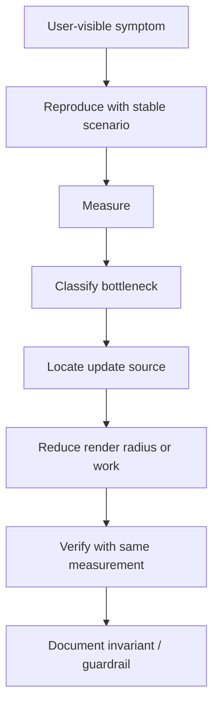
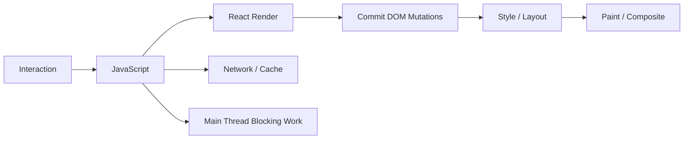
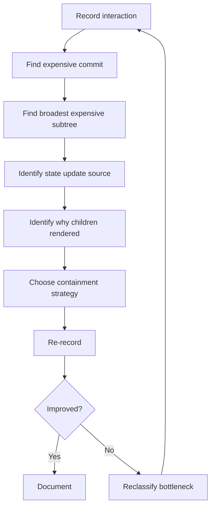
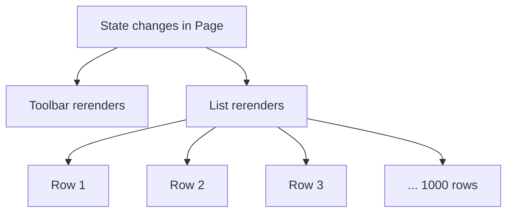
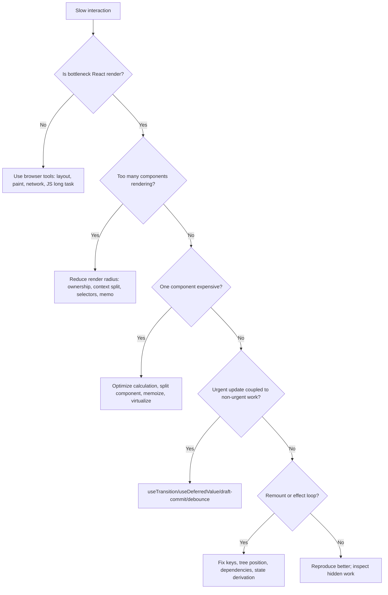

# Part 086 — Performance Debugging

Performance debugging is not guessing where to place `memo`.

It is a disciplined process:



React performance bugs are usually one of these:

1. too many components render,
2. one component renders too expensively,
3. render triggers expensive derivation repeatedly,
4. context update fans out too widely,
5. external store subscription is too broad,
6. effects cause state loops or redundant work,
7. layout/paint cost dominates after React commits,
8. network/server-state lifecycle causes UI churn,
9. input updates are coupled to non-urgent rendering,
10. identity instability defeats memoization.

This part gives a production debugging workflow.

The goal is not “make every render disappear.” The goal is:

```txt
Keep urgent interactions responsive.
Keep update radius proportional to the state change.
Keep expensive work visible, measured, and owned.
```

---

## 1. Do Not Optimize Before Classifying

A slow React screen may be slow for reasons React Profiler cannot fully explain.



React Profiler helps understand render cost and render frequency. Browser Performance tools help understand layout, paint, scripting, long tasks, memory, and network waterfall.

Use both.

| Symptom | Tool first |
|---|---|
| component rerenders unexpectedly | React DevTools Profiler / component highlight |
| typing janks | React Profiler + browser Performance panel |
| scroll janks | browser Performance panel + DOM node count |
| one interaction causes massive render | React Profiler flamegraph/ranked view |
| page load slow | network waterfall + framework/server profiling |
| after-render layout spike | browser Performance panel |
| memory grows after navigation | browser memory tools + effect cleanup review |

Do not blame React render if the bottleneck is layout thrashing, images, network, or synchronous storage.

---

## 2. The Measurement Contract

Before changing code, define the measurement.

```txt
Scenario: type "urgent" into case search box with 2,000 loaded rows.
Expected UX: keystroke remains responsive under 100 ms perceived latency.
Baseline: input update causes CaseQueuePage and 2,000 CaseRow renders.
Metric: React commit duration, number of row renders, browser long tasks.
```

A performance fix without a reproducible scenario is folklore.

A good scenario has:

1. fixed data volume,
2. fixed device/browser profile if possible,
3. fixed interaction path,
4. baseline recording,
5. target metric,
6. before/after comparison.

---

## 3. React Profiler Mental Model

React provides a `<Profiler>` API and React DevTools Profiler.

The `<Profiler>` API measures rendering performance of a React tree programmatically:

```tsx
import { Profiler } from 'react';

function onRender(
  id: string,
  phase: 'mount' | 'update' | 'nested-update',
  actualDuration: number,
  baseDuration: number,
  startTime: number,
  commitTime: number
) {
  console.table({ id, phase, actualDuration, baseDuration, startTime, commitTime });
}

export function CaseQueueProfiled() {
  return (
    <Profiler id="CaseQueue" onRender={onRender}>
      <CaseQueuePage />
    </Profiler>
  );
}
```

Interpretation:

| Metric | Meaning |
|---|---|
| `actualDuration` | time spent rendering this update for the profiled tree |
| `baseDuration` | estimated cost of rendering the whole subtree without memoization |
| `phase` | mount/update/nested-update |
| `commitTime` | when React committed this update |

If `actualDuration` is close to `baseDuration` on updates, memoization/containment may not be helping.

If `actualDuration` drops after memoization but browser still janks, layout/paint or non-React work may dominate.

---

## 4. Debugging Workflow

Use this loop.



The order matters.

Do not ask “what should I memoize?” first.

Ask:

1. what interaction is slow?
2. which commit is expensive?
3. which subtree dominates the commit?
4. what state update caused it?
5. which props/context/store snapshots changed?
6. is the work necessary?
7. can ownership/topology reduce update radius?
8. can memoization skip work safely?
9. can scheduling make the update non-urgent?
10. can virtualization reduce DOM/render volume?

---

## 5. Render Radius

**Render radius** is the size of the component tree affected by a state change.



If row selection state lives in page component, selecting one row may rerender the whole page.

Possible fixes:

| Cause | Fix |
|---|---|
| state owner too high | move state down or split owner |
| context value too broad | split context or use selector store |
| row props unstable | pass id and select inside row |
| expensive derived data in parent | memoize or move derivation to query/store selector |
| server data copied to local state | use cache read model directly |
| input state tied to list projection | defer/transition/commit search |

Render radius is usually an architecture problem before it is a memoization problem.

---

## 6. Why Did This Component Render?

A component renders when:

1. its own state updates,
2. its parent renders and does not bail out,
3. context it reads changes,
4. external store snapshot it subscribes to changes,
5. a hook used inside it triggers an update,
6. it remounts because identity changed.

Debug each possibility.

### Own state update

Look for local `useState` / `useReducer` updates.

```tsx
const [open, setOpen] = useState(false);
```

Ask:

- is this state owned at the right level?
- should this state be local, URL, context, external store, or server cache?
- does updating it require the whole subtree to render?

### Parent render

Parent render normally means child function may run too.

Containment options:

- move child outside volatile parent,
- split component,
- pass JSX as children to stable wrapper,
- use `memo` when props are stable,
- reduce prop object/function churn.

### Context change

Any component reading a context is coupled to its value changes.

Ask:

- is the context value stable?
- is it too broad?
- can commands and state be split?
- should high-frequency state move to external store selector?

### External store snapshot change

With `useSyncExternalStore`, snapshot identity matters.

Bad:

```ts
function getSnapshot() {
  return { ...store.state };
}
```

This returns a new object every time and can cause infinite or unnecessary renders.

Good:

```ts
function getSnapshot() {
  return cachedSnapshot;
}
```

### Remount

Remount appears as state reset or mount phase.

Causes:

- unstable key,
- component type defined inside another component,
- conditional tree shape changes,
- switching wrapper hierarchy,
- route boundary replacement.

---

## 7. Identity Debugging

Most unnecessary renders are identity bugs.

### Object identity

Bad:

```tsx
<CaseRow options={{ compact: true, showAssignee: true }} />
```

This creates a new object every render.

Better:

```tsx
const rowOptions = useMemo(
  () => ({ compact: true, showAssignee: true }),
  []
);

<CaseRow options={rowOptions} />
```

Better still, when small primitive props are clearer:

```tsx
<CaseRow compact showAssignee />
```

### Function identity

Bad:

```tsx
<CaseRow onOpen={() => openCase(id)} />
```

This may be fine if `CaseRow` is not memoized or cheap. It matters when many memoized rows rely on stable props.

Options:

```tsx
const openCase = useCallback((id: CaseId) => {
  navigate(`/cases/${id}`);
}, [navigate]);
```

Then:

```tsx
<CaseRow id={id} onOpen={openCase} />
```

Inside row:

```tsx
function CaseRow({ id, onOpen }: Props) {
  return <button onClick={() => onOpen(id)}>Open</button>;
}
```

### Component identity

Bad:

```tsx
function Page() {
  function Row() {
    return <div />;
  }

  return <Row />;
}
```

`Row` is a new component type every render. This can cause remounts.

Define component types at module scope unless you intentionally need dynamic component identity.

---

## 8. Context Performance Diagnosis

Context is often blamed too late. The problem is not Context itself; it is broad subscription.

Bad:

```tsx
<AppContext.Provider value={{ user, theme, filters, selectedIds, setFilters, toggleSelected }}>
  {children}
</AppContext.Provider>
```

Every consumer subscribes to the entire value identity.

Diagnosis:

1. find provider value construction,
2. list fields inside value,
3. mark each field volatility,
4. list consumer groups,
5. identify high-frequency field with broad consumer set.

```txt
Field          Volatility      Consumers
user           low             header, permission gates
filters        medium          toolbar, list query
selectedIds    high            rows, bulk action bar
theme          low             design system components
toggleSelected stable?         rows
```

Refactor:

```tsx
<UserContext.Provider value={user}>
  <ThemeContext.Provider value={theme}>
    <CaseFiltersContext.Provider value={filters}>
      <CaseSelectionStoreProvider>{children}</CaseSelectionStoreProvider>
    </CaseFiltersContext.Provider>
  </ThemeContext.Provider>
</UserContext.Provider>
```

Or split state and commands:

```tsx
<CaseSelectionCommandsContext.Provider value={commands}>
  <CaseSelectionStoreProvider>{children}</CaseSelectionStoreProvider>
</CaseSelectionCommandsContext.Provider>
```

If every row must know whether it is selected, use selector subscription:

```tsx
const selected = useCaseSelectionStore((s) => s.selectedIds.has(id));
```

---

## 9. Effect Performance Diagnosis

Effects can create performance problems in three ways:

1. they run too often,
2. they update state unnecessarily,
3. their cleanup/setup is expensive.

Bad pattern:

```tsx
useEffect(() => {
  setFullName(firstName + ' ' + lastName);
}, [firstName, lastName]);
```

This causes an extra render for derived data.

Better:

```tsx
const fullName = firstName + ' ' + lastName;
```

Bad pattern:

```tsx
useEffect(() => {
  setFilteredItems(filterItems(items, filter));
}, [items, filter]);
```

Better:

```tsx
const filteredItems = useMemo(() => filterItems(items, filter), [items, filter]);
```

Or, for server-backed lists, move filter into query key.

### Effect audit checklist

```txt
[ ] Is this synchronizing with an external system?
[ ] Could this be calculated during render?
[ ] Could this be handled in the event that caused it?
[ ] Does this effect set state that causes another effect?
[ ] Is cleanup symmetrical with setup?
[ ] Are dependencies complete and stable?
[ ] Does Strict Mode expose duplicate setup/cleanup bugs?
```

Effects are not a general-purpose state derivation engine.

---

## 10. Layout and Paint Debugging

React may render quickly, then the browser may spend too long on layout/paint.

Causes:

- reading layout after writing DOM,
- measuring many elements,
- large DOM tree,
- complex CSS selectors,
- expensive shadows/filters/backdrop blur,
- large images without dimensions,
- sticky columns/headers with heavy layout,
- dynamic row heights in virtualized lists.

A common layout thrash:

```tsx
useLayoutEffect(() => {
  const height = ref.current!.getBoundingClientRect().height;
  setHeight(height);
});
```

If this runs for many rows, it blocks paint and may create a render/layout loop.

Better:

- use library measurement API,
- use `ResizeObserver`,
- measure at container boundary,
- avoid measuring on every render,
- prefer fixed dimensions,
- cache stable measurements,
- use CSS containment where appropriate,
- profile in browser Performance panel.

React Profiler does not fully capture browser layout cost. Use browser tools.

---

## 11. Input Responsiveness Debugging

Typing and pointer interactions are urgent. Large UI updates often are not.

Bad:

```tsx
const [query, setQuery] = useState('');
const results = expensiveSearch(data, query);
```

The input update and expensive results update are coupled.

Options:

### Split draft and committed state

```tsx
const [draft, setDraft] = useState('');
const [committed, setCommitted] = useState('');
```

### Use deferred value for expensive consumer

```tsx
const deferredQuery = useDeferredValue(query);
const results = useMemo(() => expensiveSearch(data, deferredQuery), [data, deferredQuery]);
```

### Use transition for non-urgent update

```tsx
const [isPending, startTransition] = useTransition();

function onFilterChange(next: Filter) {
  setDraftFilter(next);
  startTransition(() => {
    setCommittedFilter(next);
  });
}
```

### Server request debounce

```tsx
const debouncedQuery = useDebouncedValue(query, 300);
const resultsQuery = useSearchQuery(debouncedQuery);
```

Choose based on semantics. Do not use scheduling as a substitute for reducing unnecessary work.

---

## 12. Memoization Debugging

Memoization only works when inputs are stable and correctness does not depend on recomputation.

### `memo`

Use when:

- component renders often with same props,
- render cost is non-trivial,
- props can be kept stable,
- correctness does not rely on render side effects.

```tsx
const CaseRowView = memo(function CaseRowView({ row, selected, onOpen }: Props) {
  return <div>{row.title}</div>;
});
```

### `useMemo`

Use when:

- calculation is expensive,
- dependencies are stable and correct,
- cached value helps avoid child rerenders or recomputation.

```tsx
const visibleIds = useMemo(
  () => computeVisibleIds(allIds, filters, sort),
  [allIds, filters, sort]
);
```

### `useCallback`

Use when:

- function identity affects memoized child or effect dependency,
- callback is passed into a subscription/dependency-sensitive API,
- command boundary needs stable identity.

```tsx
const toggleSelected = useCallback((id: CaseId) => {
  dispatch({ type: 'toggleSelected', id });
}, []);
```

### Failed memoization signs

- dependencies include an object recreated every render,
- memoized child still rerenders because context changed,
- custom comparator hides real prop changes,
- expensive calculation moved into `useMemo` but dependency changes every render,
- stale closure bug appears after “optimization.”

Memoization is not architecture. It is a local cache.

---

## 13. React Compiler Era Debugging

React Compiler can automatically memoize compatible code and reduce the need for manual `useMemo`, `useCallback`, and `memo` in many cases. But it does not remove the need for performance architecture.

Compiler cannot fix:

- wrong state ownership,
- excessive context fan-out,
- poor query key design,
- layout thrash,
- too many DOM nodes,
- network waterfall,
- illegal render side effects,
- row state keyed by index,
- synchronous storage on hot path,
- high-frequency external store notifications.

Compiler-compatible code should follow React purity rules:

```txt
Components and Hooks must be pure.
No mutation of non-local values during render.
No side effects during render.
Stable dataflow through props/state/context.
```

Debugging in compiler era:

1. profile first,
2. check if component is compiled or skipped,
3. fix purity/lint violations,
4. remove obsolete manual memo only when safe,
5. keep manual memo for explicit compatibility boundaries if needed,
6. verify behavior and performance after each change.

---

## 14. External Store Debugging

External stores introduce a different class of performance bugs.

### Too broad subscription

Bad:

```tsx
const state = useStore();
const selected = state.selectedIds.has(id);
```

The row rerenders for any store change.

Good:

```tsx
const selected = useStore((s) => s.selectedIds.has(id));
```

### Unstable selector result

Bad:

```tsx
const row = useStore((s) => ({
  title: s.entities[id].title,
  status: s.entities[id].status,
}));
```

This creates a new object every time unless the store hook uses equality.

Better:

```tsx
const row = useStore(
  (s) => ({
    title: s.entities[id].title,
    status: s.entities[id].status,
  }),
  shallow
);
```

Or split primitives:

```tsx
const title = useStore((s) => s.entities[id].title);
const status = useStore((s) => s.entities[id].status);
```

### Snapshot mutation

If the store mutates state in place, React may not see change correctly or selector equality may lie.

Use immutable updates or explicit versioning.

---

## 15. Server State Debugging

Server-state performance bugs often look like React render bugs.

Symptoms:

- refetch on every render,
- duplicate requests,
- loading flicker,
- rows disappear during background refresh,
- optimistic update causes full list reset,
- pagination appends duplicates,
- mutation invalidates too broadly.

Debug query identity:

```ts
const queryKey = ['cases', tenantId, { filter, sort, page }];
```

Ask:

1. is every data-affecting parameter in the key?
2. is the key stable and serializable?
3. is `queryFn` stable where library requires it?
4. is `enabled` preventing premature dependent queries?
5. are stale time and gc time appropriate?
6. is invalidation too broad or too narrow?
7. does optimistic update preserve structural sharing?
8. does background refetch preserve scroll/list anchor?

Do not copy server-state cache data into local state just to “control” it. That often creates stale duplicated state and extra renders.

---

## 16. Remount Debugging

A performance bug may actually be a remount bug.

Symptoms:

- input loses focus,
- local state resets,
- effects run as mount again,
- animation restarts,
- Profiler shows mount instead of update.

Common causes:

```tsx
// key changes every render
<Component key={crypto.randomUUID()} />
```

```tsx
// component type recreated every render
function Parent() {
  const Child = () => <div />;
  return <Child />;
}
```

```tsx
// conditional tree position changes
{mode === 'edit' ? <Editor /> : <Viewer />}
```

Some remounts are intentional. For example, using `key={caseId}` to reset a form when case changes. The bug is accidental remount.

Debug method:

1. add mount/unmount log temporarily,
2. inspect keys,
3. inspect conditional tree shape,
4. inspect route boundaries,
5. inspect provider position changes,
6. confirm with Profiler phase.

---

## 17. Large List Debugging Protocol

For a slow list:

```txt
1. Count mounted rows and DOM nodes.
2. Profile selecting one row.
3. Profile typing filter/search.
4. Profile scroll.
5. Check row keys.
6. Check row props identity.
7. Check context consumers inside row.
8. Check row effects.
9. Check virtualization overscan/measurement.
10. Check query key and data replacement.
```

Typical fixes by symptom:

| Symptom | Fix |
|---|---|
| selecting row rerenders all rows | selector store or row-local subscription keyed by id |
| typing filter lags | deferred/committed filter, transition, server debounce |
| scroll janks | virtualization, fixed row height, reduce row DOM/effects |
| row state moves | stable key and state keyed by id |
| data refresh jumps scroll | anchor preservation and stable projection |
| row menus slow | lazy mount menu content, portal manager, reduce context reads |

---

## 18. Hidden Work: Logging, Analytics, and Dev Tools

Production performance can be hurt by non-UI work:

- console logging large objects,
- analytics per row render,
- debug serialization,
- Redux/devtools recording large actions,
- source maps in certain environments,
- validation schemas running on every keystroke,
- permission engine running per row render,
- synchronous localStorage reads,
- JSON stringify in render.

Search for these in hot paths:

```txt
console.log
JSON.stringify
localStorage.getItem
new Intl.*
new Date
sort(
filter(
map(
crypto.randomUUID
structuredClone
schema.parse
policy.evaluate
```

Not all are bad. They are suspicious when executed during render or high-frequency interactions.

---

## 19. Performance Budgets

A mature codebase defines budgets.

Example:

```txt
Case queue screen:
- Initial render of visible list under 200 ms on reference laptop.
- Selecting one row rerenders at most selected row + bulk action bar.
- Typing in search input has no long task over 50 ms with 2,000 loaded rows.
- Virtualized list mounts fewer than 100 row DOM trees at default viewport.
- Background refetch does not reset scroll anchor.
- Opening row action menu does not rerender unrelated rows.
```

Budgets convert subjective performance arguments into engineering constraints.

---

## 20. Optimization Decision Tree



Use the smallest fix that addresses the measured cause.

---

## 21. What Not To Do

Do not:

1. add `memo` to every component blindly,
2. write custom comparators before measuring,
3. suppress exhaustive-deps to “reduce rerenders,”
4. move all state to global store to avoid prop drilling,
5. move all state to Context to avoid store complexity,
6. copy server data into local state for convenience,
7. use index keys in dynamic lists,
8. use `useLayoutEffect` for normal effects,
9. run expensive permission/formatting logic in every row render,
10. treat React Compiler as a substitute for state topology.

Most of these create correctness bugs disguised as performance fixes.

---

## 22. Case Study: Search Page Lag

Initial code:

```tsx
function SearchPage({ cases }: { cases: Case[] }) {
  const [search, setSearch] = useState('');
  const [selectedIds, setSelectedIds] = useState(() => new Set<CaseId>());

  const visibleCases = cases
    .filter((c) => c.title.includes(search))
    .sort((a, b) => b.updatedAt.localeCompare(a.updatedAt));

  return (
    <>
      <input value={search} onChange={(e) => setSearch(e.target.value)} />
      {visibleCases.map((item, index) => (
        <CaseRow
          key={index}
          item={item}
          selected={selectedIds.has(item.id)}
          onToggle={() => {
            setSelectedIds((prev) => toggleSet(prev, item.id));
          }}
        />
      ))}
    </>
  );
}
```

Measured problems:

1. input rerenders all rows on every keystroke,
2. filtering/sorting runs synchronously on urgent input,
3. row key is index,
4. callback identity changes per row,
5. every row is mounted,
6. selection update rerenders whole list.

Refactor:

```tsx
function SearchPage() {
  const [draftSearch, setDraftSearch] = useState('');
  const deferredSearch = useDeferredValue(draftSearch);

  const ids = useCaseSearchIds(deferredSearch);

  return (
    <CaseSelectionProvider>
      <SearchBox value={draftSearch} onChange={setDraftSearch} />
      <CaseVirtualList ids={ids} />
      <BulkActionBar />
    </CaseSelectionProvider>
  );
}
```

Row:

```tsx
const CaseRow = memo(function CaseRow({ id }: { id: CaseId }) {
  const row = useCaseRowReadModel(id);
  const selected = useCaseSelectionStore((s) => s.selectedIds.has(id));
  const toggle = useCaseSelectionCommands((c) => c.toggle);

  return <CaseRowView row={row} selected={selected} onToggle={() => toggle(id)} />;
});
```

Result:

```txt
Input update no longer forces all rows synchronously.
Rows are keyed by id.
Only visible rows mount.
Selection update affects selected row and bulk bar, not whole page.
Search result consumption may lag behind input safely.
```

---

## 23. Debugging Checklist

```txt
Reproduction
[ ] Do I have a fixed scenario and data volume?
[ ] Can I reproduce in production-like build?
[ ] Is Strict Mode double behavior understood?

Measurement
[ ] Did I record React Profiler data?
[ ] Did I inspect browser long tasks/layout/paint if needed?
[ ] Do I know whether bottleneck is render, commit, layout, network, or JS outside React?

Render cause
[ ] Which state update caused the expensive commit?
[ ] Which subtree dominates actualDuration?
[ ] Are components rerendering due to parent, context, store, or own state?
[ ] Are there accidental remounts?

Identity
[ ] Are object/function props stable where memoization depends on them?
[ ] Are keys stable and semantically correct?
[ ] Are component types defined outside render?

State topology
[ ] Is state owned at the right level?
[ ] Is Context too broad or too volatile?
[ ] Would selector subscription reduce fan-out?
[ ] Is server state duplicated into local state?

Effects
[ ] Are effects only synchronizing external systems?
[ ] Are dependencies complete?
[ ] Are effects causing extra render loops?
[ ] Is layout work blocking paint unnecessarily?

Fix verification
[ ] Did I re-measure the same scenario?
[ ] Did correctness remain intact?
[ ] Did I document the invariant to prevent regression?
```

---

## 24. Mental Model Summary

Performance debugging in React is a topology problem, not just a hook problem.

The durable questions are:

```txt
What changed?
Who owns that state?
Who subscribed to it?
How far did the update propagate?
What work ran because of it?
Was that work necessary for the user-visible result?
Can we reduce the radius, defer the work, or virtualize the output?
```

The strongest engineers do not optimize by superstition. They build a trace from symptom to state update to render radius to work cost to fix.

---

## 25. References

- React docs — `<Profiler>`: https://react.dev/reference/react/Profiler
- React docs — React Developer Tools: https://react.dev/learn/react-developer-tools
- React docs — `memo`: https://react.dev/reference/react/memo
- React docs — `useMemo`: https://react.dev/reference/react/useMemo
- React docs — `useCallback`: https://react.dev/reference/react/useCallback
- React docs — `useTransition`: https://react.dev/reference/react/useTransition
- React docs — `useDeferredValue`: https://react.dev/reference/react/useDeferredValue
- React docs — React Compiler: https://react.dev/learn/react-compiler
- TanStack Virtual docs: https://tanstack.com/virtual/latest

---

## Seri Status

Belum selesai. Part 086 menutup **Module 8 — Concurrency, Scheduling, and Performance**.

Lanjut ke:

```txt
learn-react-hooks-state-composition-orchestration-part-087-ui-workflow-state.mdx
learn-react-hooks-state-composition-orchestration-part-088-state-machine-thinking-for-react.mdx
```
