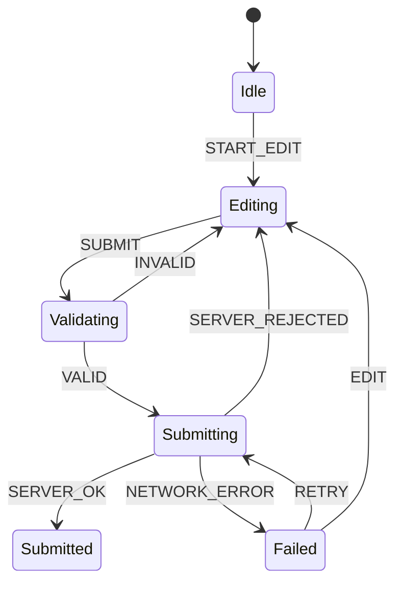
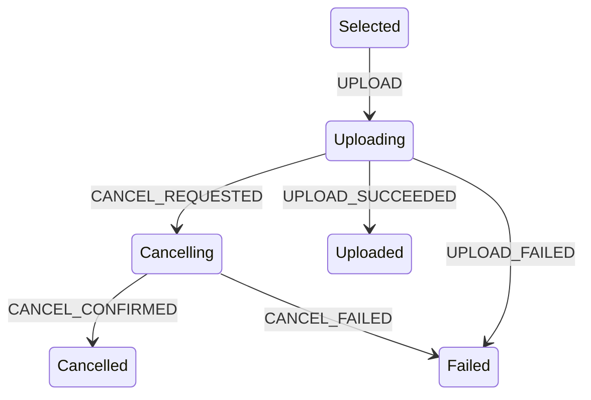
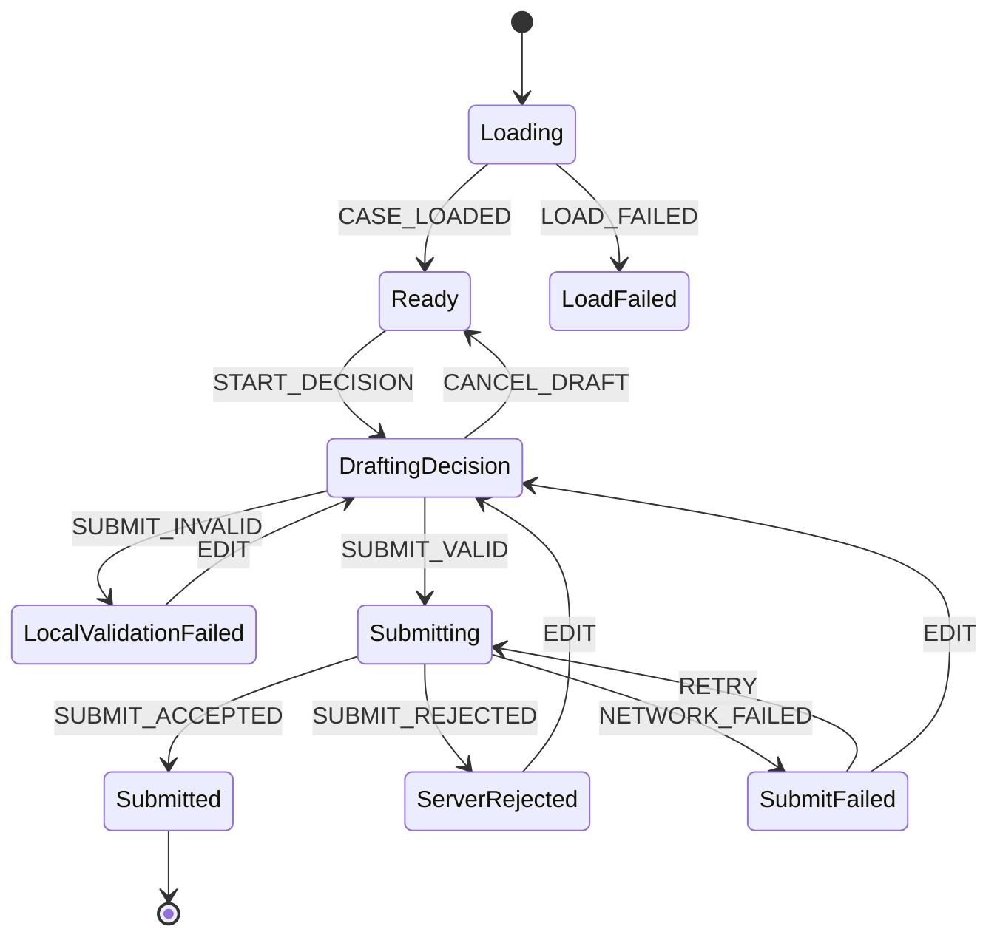

# Part 087 — UI Workflow State

Workflow state adalah state yang menjelaskan **posisi sebuah user journey di dalam proses**.

Ini berbeda dari local UI state biasa seperti `isOpen`, `selectedTab`, atau `inputValue`. Workflow state biasanya punya:

- fase yang saling eksklusif;
- event yang menggerakkan transisi;
- precondition sebelum transisi boleh terjadi;
- side effect yang terjadi setelah command dikirim;
- hasil async yang bisa sukses, gagal, dibatalkan, atau retry;
- jejak audit/analytics;
- aturan permission;
- aturan cleanup saat screen ditutup atau entity berubah.

Di codebase kecil, workflow sering terlihat seperti beberapa boolean:

```tsx
const [isEditing, setIsEditing] = useState(false);
const [isSubmitting, setIsSubmitting] = useState(false);
const [isSuccess, setIsSuccess] = useState(false);
const [error, setError] = useState<Error | null>(null);
```

Di codebase besar, bentuk seperti itu hampir selalu berubah menjadi state yang ambigu:

```txt
isEditing = true
isSubmitting = true
isSuccess = true
error = not null
```

Pertanyaan sederhana: **screen sedang dalam keadaan apa?**

Tidak jelas.

Part ini membahas cara memodelkan workflow state di React sebelum kita masuk ke state machine formal di Part 088.

---

## 1. Workflow State Bukan “More State”

Workflow state bukan berarti menambah state sebanyak-banyaknya. Justru sebaliknya: workflow state adalah cara **mengurangi ambiguity**.

State biasa menjawab:

```txt
Nilai sekarang apa?
```

Workflow state menjawab:

```txt
User journey sedang di fase apa?
Event apa yang valid dari fase ini?
Command apa yang sedang berjalan?
Apa yang harus terjadi jika command berhasil/gagal?
Apa state berikutnya yang legal?
```

Contoh: halaman approval enforcement case.

```txt
idle
→ reviewing
→ submittingDecision
→ submitted
```

Tetapi realita production biasanya seperti ini:

```txt
idle
→ loadingCase
→ readyForReview
→ editingDecision
→ validatingLocally
→ submittingDecision
→ waitingForServerConfirmation
→ submitted
→ auditLogged
```

Dan jalur gagal:

```txt
submittingDecision
→ submissionFailedRetryable
→ submittingDecision
```

Atau gagal final:

```txt
submittingDecision
→ submissionRejectedByPolicy
```

Workflow state muncul ketika UI tidak hanya menampilkan data, tetapi juga **mengorkestrasi proses**.

---

## 2. Kapan Sebuah State Menjadi Workflow State?

Gunakan sinyal berikut.

| Sinyal | Artinya |
|---|---|
| Banyak boolean saling terkait | Ada state eksklusif yang belum dimodelkan |
| Banyak `if` di event handler | Ada transition logic tersembunyi |
| Banyak `useEffect` untuk mengubah state lain | Ada workflow lifecycle yang bocor |
| Banyak pending/error/success flag | Ada async command lifecycle |
| Banyak disable button berdasarkan kombinasi kondisi | Ada precondition/guard |
| Ada retry/cancel/undo | Ada transition graph |
| Ada multi-step journey | Ada finite states |
| Ada audit trail/analytics per tindakan | Ada domain event boundary |
| Ada permission dan policy | Ada guard yang harus eksplisit |
| Ada optimistic update | Ada temporary state dan reconciliation |

Jika hanya ada satu input text, itu bukan workflow. Jika ada draft decision, validation, permission, submit, rollback, server rejection, audit, dan next action, itu workflow.

---

## 3. Mental Model: Workflow = State + Event + Transition + Effect Boundary

Workflow bisa dipikirkan sebagai empat benda:

```txt
state      = posisi sekarang
 event     = sesuatu yang terjadi
transition = perubahan state yang legal
effect     = kerja di luar render/reducer
```

Diagram minimal:



Hal yang penting: event tidak selalu langsung berarti state berubah. Event harus melewati transition rule.

```txt
SUBMIT dari Editing boleh.
SUBMIT dari Submitted tidak boleh.
RETRY dari Failed boleh.
RETRY dari Idle tidak boleh.
```

---

## 4. Anti-Pattern: Boolean Workflow

### Bentuk rapuh

```tsx
function ApprovalPanel() {
  const [isEditing, setEditing] = useState(false);
  const [isSubmitting, setSubmitting] = useState(false);
  const [isSubmitted, setSubmitted] = useState(false);
  const [error, setError] = useState<string | null>(null);

  async function submit() {
    setSubmitting(true);
    setError(null);

    try {
      await api.submitDecision();
      setSubmitted(true);
      setEditing(false);
    } catch (err) {
      setError('Failed');
    } finally {
      setSubmitting(false);
    }
  }
}
```

Masalahnya bukan cuma style. Masalahnya adalah **state space meledak**.

Dengan empat boolean/nullable fields:

```txt
isEditing: 2 kemungkinan
isSubmitting: 2 kemungkinan
isSubmitted: 2 kemungkinan
error: 2 kemungkinan
```

Total kombinasi kasar: `2 × 2 × 2 × 2 = 16`.

Padahal workflow legal mungkin hanya:

```txt
idle
editing
submitting
submitted
failed
```

Hanya 5 state legal. Sisanya adalah state liar.

### Bentuk lebih aman

```tsx
type ApprovalWorkflow =
  | { status: 'idle' }
  | { status: 'editing'; draft: DecisionDraft }
  | { status: 'submitting'; draft: DecisionDraft; requestId: string }
  | { status: 'submitted'; decisionId: string }
  | { status: 'failed'; draft: DecisionDraft; error: string; retryable: boolean };
```

Sekarang illegal combination tidak mudah muncul. `error` hanya ada di `failed`. `requestId` hanya ada di `submitting`. `decisionId` hanya ada di `submitted`.

---

## 5. Workflow State Shape

Gunakan discriminated union untuk state workflow.

```tsx
type UploadWorkflow =
  | { tag: 'empty' }
  | { tag: 'selected'; file: File }
  | { tag: 'validating'; file: File }
  | { tag: 'invalid'; file: File; reason: string }
  | { tag: 'uploading'; file: File; progress: number; uploadId: string }
  | { tag: 'uploaded'; assetId: string; fileName: string }
  | { tag: 'failed'; file: File; error: string; canRetry: boolean };
```

Gunakan property discriminator yang konsisten:

```txt
tag
status
state
phase
```

Saya lebih suka `status` untuk application state biasa, dan `tag` untuk state machine-ish union. Yang penting konsisten dalam satu module.

### Kenapa bukan `status + banyak optional field`?

Ini lebih lemah:

```tsx
type UploadWorkflow = {
  status: 'empty' | 'selected' | 'uploading' | 'uploaded' | 'failed';
  file?: File;
  progress?: number;
  assetId?: string;
  error?: string;
};
```

Karena TypeScript masih memungkinkan:

```tsx
{
  status: 'uploaded',
  error: 'Network failed',
  progress: 30,
}
```

Dengan union, state shape menjadi executable documentation.

---

## 6. Event Shape

Workflow harus digerakkan oleh event, bukan setter acak.

```tsx
type UploadEvent =
  | { type: 'FILE_SELECTED'; file: File }
  | { type: 'VALIDATION_STARTED' }
  | { type: 'VALIDATION_FAILED'; reason: string }
  | { type: 'VALIDATION_PASSED' }
  | { type: 'UPLOAD_STARTED'; uploadId: string }
  | { type: 'UPLOAD_PROGRESS'; progress: number }
  | { type: 'UPLOAD_SUCCEEDED'; assetId: string }
  | { type: 'UPLOAD_FAILED'; error: string; retryable: boolean }
  | { type: 'RETRY' }
  | { type: 'CANCEL' }
  | { type: 'RESET' };
```

Event bukan command API publik harus sama persis dengan DOM event. DOM event terlalu rendah level.

```txt
click button       = DOM/user event
SUBMIT_DECISION   = UI intent event
submitDecision()  = application command
DecisionSubmitted = domain event/server result
```

Workflow reducer sebaiknya menerima **intent/result event**, bukan raw DOM event.

---

## 7. Reducer untuk Workflow Lokal

```tsx
function uploadReducer(state: UploadWorkflow, event: UploadEvent): UploadWorkflow {
  switch (state.tag) {
    case 'empty':
      switch (event.type) {
        case 'FILE_SELECTED':
          return { tag: 'selected', file: event.file };
        default:
          return state;
      }

    case 'selected':
      switch (event.type) {
        case 'VALIDATION_STARTED':
          return { tag: 'validating', file: state.file };
        case 'RESET':
          return { tag: 'empty' };
        default:
          return state;
      }

    case 'validating':
      switch (event.type) {
        case 'VALIDATION_PASSED':
          return { tag: 'uploading', file: state.file, progress: 0, uploadId: crypto.randomUUID() };
        case 'VALIDATION_FAILED':
          return { tag: 'invalid', file: state.file, reason: event.reason };
        case 'CANCEL':
          return { tag: 'selected', file: state.file };
        default:
          return state;
      }

    case 'invalid':
      switch (event.type) {
        case 'FILE_SELECTED':
          return { tag: 'selected', file: event.file };
        case 'RESET':
          return { tag: 'empty' };
        default:
          return state;
      }

    case 'uploading':
      switch (event.type) {
        case 'UPLOAD_PROGRESS':
          return { ...state, progress: event.progress };
        case 'UPLOAD_SUCCEEDED':
          return { tag: 'uploaded', assetId: event.assetId, fileName: state.file.name };
        case 'UPLOAD_FAILED':
          return { tag: 'failed', file: state.file, error: event.error, canRetry: event.retryable };
        default:
          return state;
      }

    case 'failed':
      switch (event.type) {
        case 'RETRY':
          return state.canRetry
            ? { tag: 'uploading', file: state.file, progress: 0, uploadId: crypto.randomUUID() }
            : state;
        case 'FILE_SELECTED':
          return { tag: 'selected', file: event.file };
        case 'RESET':
          return { tag: 'empty' };
        default:
          return state;
      }

    case 'uploaded':
      switch (event.type) {
        case 'RESET':
          return { tag: 'empty' };
        default:
          return state;
      }
  }
}
```

Ada satu hal yang sengaja salah di reducer ini: `crypto.randomUUID()` berada di reducer. Reducer idealnya pure. ID/requestId seharusnya dibuat di event handler/command boundary, lalu dikirim sebagai payload event.

Versi lebih benar:

```tsx
case 'validating':
  switch (event.type) {
    case 'VALIDATION_PASSED':
      return {
        tag: 'readyToUpload',
        file: state.file,
      };
  }
```

Lalu command boundary:

```tsx
function startUpload() {
  const uploadId = crypto.randomUUID();
  dispatch({ type: 'UPLOAD_STARTED', uploadId });
}
```

Workflow reducer harus deterministic agar mudah dites.

---

## 8. Separating Transition and Effect

Workflow sering butuh side effect:

- call API;
- start upload;
- abort request;
- write analytics;
- navigate;
- show toast;
- open modal;
- request permission;
- subscribe progress stream.

Jangan masukkan side effect ke reducer. Reducer menjawab:

```txt
Jika state sekarang S dan event E terjadi, state berikutnya apa?
```

Effect/command boundary menjawab:

```txt
Kerja eksternal apa yang perlu dijalankan sebagai akibat dari event/transition?
```

### Pattern: command handler owns side effect

```tsx
function useUploadWorkflow() {
  const [state, dispatch] = useReducer(uploadReducer, { tag: 'empty' } as UploadWorkflow);

  async function validateSelectedFile(file: File) {
    dispatch({ type: 'VALIDATION_STARTED' });

    const result = validateFile(file);
    if (!result.ok) {
      dispatch({ type: 'VALIDATION_FAILED', reason: result.reason });
      return;
    }

    dispatch({ type: 'VALIDATION_PASSED' });
  }

  async function upload(file: File) {
    const uploadId = crypto.randomUUID();
    dispatch({ type: 'UPLOAD_STARTED', uploadId });

    try {
      const assetId = await uploadFile(file, {
        onProgress(progress) {
          dispatch({ type: 'UPLOAD_PROGRESS', progress });
        },
      });

      dispatch({ type: 'UPLOAD_SUCCEEDED', assetId });
    } catch (error) {
      dispatch({
        type: 'UPLOAD_FAILED',
        error: normalizeError(error),
        retryable: isRetryable(error),
      });
    }
  }

  return { state, dispatch, validateSelectedFile, upload };
}
```

Masih ada pertanyaan: kapan `upload(file)` dipanggil? Ada dua pendekatan.

---

## 9. Approach A: Explicit Command from UI

```tsx
function UploadBox() {
  const { state, dispatch, upload } = useUploadWorkflow();

  return (
    <button
      disabled={state.tag !== 'selected'}
      onClick={() => {
        if (state.tag !== 'selected') return;
        upload(state.file);
      }}
    >
      Upload
    </button>
  );
}
```

Kelebihan:

- mudah dilacak;
- side effect terjadi karena user event;
- tidak perlu effect orchestration;
- cocok untuk button-driven workflow.

Kelemahan:

- UI component tahu kapan command dipanggil;
- beberapa command chain bisa tersebar.

---

## 10. Approach B: Effect Watches State Phase

```tsx
function useUploadWorkflow() {
  const [state, dispatch] = useReducer(uploadReducer, { tag: 'empty' } as UploadWorkflow);

  useEffect(() => {
    if (state.tag !== 'readyToUpload') return;

    let cancelled = false;
    const uploadId = crypto.randomUUID();

    dispatch({ type: 'UPLOAD_STARTED', uploadId });

    uploadFile(state.file)
      .then((assetId) => {
        if (!cancelled) dispatch({ type: 'UPLOAD_SUCCEEDED', assetId });
      })
      .catch((error) => {
        if (!cancelled) {
          dispatch({ type: 'UPLOAD_FAILED', error: normalizeError(error), retryable: isRetryable(error) });
        }
      });

    return () => {
      cancelled = true;
    };
  }, [state]);

  return { state, dispatch };
}
```

Kelebihan:

- workflow hook mengorkestrasi transisi internal;
- UI hanya dispatch intent;
- cocok untuk automatic transition.

Kelemahan:

- harus sangat hati-hati terhadap dependency;
- Strict Mode dapat mengeksekusi setup/cleanup development cycle;
- side effect berbasis state bisa menjadi tidak jelas jika terlalu banyak.

Prinsipnya: effect yang menonton phase workflow valid jika benar-benar menyinkronkan dengan sistem eksternal. Tetapi jangan pakai effect untuk derivasi state sederhana.

---

## 11. Request Identity Guard

Workflow async harus melindungi diri dari response lama.

Kasus:

```txt
User submit A
User edit ulang
User submit B
Response A datang setelah B
```

Jika tidak ada request identity, response A bisa menimpa state B.

```tsx
type SubmitState =
  | { tag: 'editing'; draft: Draft }
  | { tag: 'submitting'; draft: Draft; requestId: string }
  | { tag: 'submitted'; decisionId: string }
  | { tag: 'failed'; draft: Draft; requestId: string; error: string };

type SubmitEvent =
  | { type: 'SUBMIT_STARTED'; requestId: string }
  | { type: 'SUBMIT_SUCCEEDED'; requestId: string; decisionId: string }
  | { type: 'SUBMIT_FAILED'; requestId: string; error: string };
```

Reducer:

```tsx
case 'submitting':
  switch (event.type) {
    case 'SUBMIT_SUCCEEDED':
      if (event.requestId !== state.requestId) return state;
      return { tag: 'submitted', decisionId: event.decisionId };

    case 'SUBMIT_FAILED':
      if (event.requestId !== state.requestId) return state;
      return { tag: 'failed', draft: state.draft, requestId: event.requestId, error: event.error };
  }
```

Ini bukan detail kecil. Ini salah satu invariant paling penting dalam UI async.

---

## 12. Cancellation as First-Class Transition

Cancellation bukan hanya `abortController.abort()`.

Cancellation adalah event workflow.

```tsx
type UploadEvent =
  | { type: 'CANCEL_REQUESTED' }
  | { type: 'CANCELLED'; requestId: string };
```

State:

```tsx
type UploadWorkflow =
  | { tag: 'uploading'; uploadId: string; file: File; progress: number }
  | { tag: 'cancelling'; uploadId: string; file: File; progress: number }
  | { tag: 'cancelled'; file: File };
```

Kenapa perlu `cancelling`?

Karena cancel bisa async:

- abort local request;
- call server to cancel job;
- release reserved resource;
- wait for background job cancellation confirmation.

Diagram:



Jika UI langsung lompat ke `selected` setelah cancel button, user bisa melihat state palsu padahal server job masih berjalan.

---

## 13. Retry as Transition, Not Button Trick

Retry tidak sama dengan “panggil function lagi”. Retry harus mempertimbangkan:

- apakah error retryable;
- apakah payload masih valid;
- apakah token/permission masih valid;
- apakah command idempotent;
- apakah optimistic state perlu dipertahankan;
- apakah retry memakai backoff;
- apakah retry harus membuat request baru.

```tsx
type FailedSubmit = {
  tag: 'failed';
  draft: Draft;
  error: string;
  retryable: boolean;
  attempts: number;
  lastRequestId: string;
};
```

Transition:

```tsx
case 'failed':
  if (event.type === 'RETRY') {
    if (!state.retryable) return state;
    if (state.attempts >= 3) return { ...state, retryable: false };

    return {
      tag: 'submitting',
      draft: state.draft,
      requestId: event.requestId,
      attempts: state.attempts + 1,
    };
  }
```

UI:

```tsx
<button disabled={state.tag !== 'failed' || !state.retryable} onClick={retry}>
  Retry
</button>
```

Button hanya surface. Policy ada di transition.

---

## 14. Undo and Compensation

Undo pada workflow berbeda-beda:

| Jenis undo | Cara kerja |
|---|---|
| Local undo | Restore previous client state |
| Optimistic undo | Rollback optimistic overlay |
| Server undo | Kirim compensating command |
| Soft delete undo | Restore item sebelum retention window selesai |
| Workflow undo | Kembalikan ke fase sebelumnya jika legal |

Contoh delete optimistic:

```tsx
type DeleteWorkflow =
  | { tag: 'idle' }
  | { tag: 'optimisticallyDeleted'; item: Item; undoDeadline: number; requestId: string }
  | { tag: 'deleting'; item: Item; requestId: string }
  | { tag: 'deleted'; itemId: string }
  | { tag: 'restoreFailed'; item: Item; error: string };
```

Undo bukan sekadar `setDeleted(false)`. Undo adalah transition dengan deadline, request identity, dan command boundary.

---

## 15. Multi-Step Forms as Workflow

Wizard/multi-step form adalah workflow klasik.

Bad smell:

```tsx
const [step, setStep] = useState(0);
const [isValid, setIsValid] = useState(false);
const [isSubmitting, setSubmitting] = useState(false);
const [serverError, setServerError] = useState(null);
```

Lebih kuat:

```tsx
type RegistrationWorkflow =
  | { tag: 'accountStep'; draft: AccountDraft }
  | { tag: 'profileStep'; account: AccountDraft; draft: ProfileDraft }
  | { tag: 'reviewStep'; data: RegistrationData }
  | { tag: 'submitting'; data: RegistrationData; requestId: string }
  | { tag: 'submitted'; userId: string }
  | { tag: 'failed'; data: RegistrationData; error: string };
```

Guard:

```tsx
function canGoNext(state: RegistrationWorkflow): boolean {
  switch (state.tag) {
    case 'accountStep':
      return isValidAccount(state.draft);
    case 'profileStep':
      return isValidProfile(state.draft);
    case 'reviewStep':
      return true;
    default:
      return false;
  }
}
```

Transition:

```tsx
function next(state: RegistrationWorkflow): RegistrationWorkflow {
  switch (state.tag) {
    case 'accountStep':
      if (!isValidAccount(state.draft)) return state;
      return { tag: 'profileStep', account: state.draft, draft: emptyProfileDraft() };

    case 'profileStep':
      if (!isValidProfile(state.draft)) return state;
      return { tag: 'reviewStep', data: { account: state.account, profile: state.draft } };

    default:
      return state;
  }
}
```

Jangan jadikan `step++` sebagai workflow rule. Step number adalah representation detail. Workflow phase adalah domain-level truth.

---

## 16. Approval Workflow Example

Regulatory/case-management UI biasanya punya workflow lebih kaya daripada todo app.

Contoh screen: enforcement case decision.



State shape:

```tsx
type CaseDecisionWorkflow =
  | { tag: 'loading'; caseId: string }
  | { tag: 'loadFailed'; caseId: string; error: string }
  | { tag: 'ready'; case: EnforcementCase; permissions: PermissionSnapshot }
  | { tag: 'draftingDecision'; case: EnforcementCase; draft: DecisionDraft; permissions: PermissionSnapshot }
  | { tag: 'localValidationFailed'; case: EnforcementCase; draft: DecisionDraft; issues: ValidationIssue[]; permissions: PermissionSnapshot }
  | { tag: 'submitting'; case: EnforcementCase; draft: DecisionDraft; requestId: string; permissions: PermissionSnapshot }
  | { tag: 'serverRejected'; case: EnforcementCase; draft: DecisionDraft; rejection: ServerRejection; permissions: PermissionSnapshot }
  | { tag: 'submitFailed'; case: EnforcementCase; draft: DecisionDraft; error: string; retryable: boolean; permissions: PermissionSnapshot }
  | { tag: 'submitted'; caseId: string; decisionId: string };
```

Perhatikan `permissions` ikut state, bukan dibaca acak dari global pada setiap render. Kenapa? Karena permission bisa berubah saat workflow berjalan. Anda perlu menentukan apakah permission snapshot diambil saat case loaded, saat command dikirim, atau selalu live. Itu keputusan domain, bukan detail UI.

---

## 17. Permission as Guard

```tsx
function canSubmitDecision(state: CaseDecisionWorkflow): boolean {
  if (state.tag !== 'draftingDecision') return false;
  if (!state.permissions.canSubmitDecision) return false;
  if (!isCompleteDecisionDraft(state.draft)) return false;
  if (state.case.status !== 'open') return false;
  return true;
}
```

Guard harus reusable:

- button disabled;
- command handler;
- reducer transition;
- test;
- audit reason.

Jangan hanya taruh di JSX:

```tsx
<button disabled={!permission.canSubmitDecision || !isValid}>Submit</button>
```

Itu hanya presentation guard. Command boundary tetap harus menjaga guard karena event bisa datang dari keyboard shortcut, retry, atau programmatic call.

---

## 18. Workflow Commands

Buat command API yang domain-oriented.

```tsx
function useCaseDecisionWorkflow(caseId: string) {
  const [state, dispatch] = useReducer(reducer, { tag: 'loading', caseId });

  const commands = {
    startDecision() {
      dispatch({ type: 'START_DECISION' });
    },

    editDraft(patch: Partial<DecisionDraft>) {
      dispatch({ type: 'EDIT_DRAFT', patch });
    },

    async submitDecision() {
      if (!canSubmitDecision(state)) return;

      const requestId = crypto.randomUUID();
      dispatch({ type: 'SUBMIT_STARTED', requestId });

      try {
        const result = await api.submitDecision({
          caseId: state.case.id,
          draft: state.draft,
          idempotencyKey: requestId,
        });

        dispatch({ type: 'SUBMIT_ACCEPTED', requestId, decisionId: result.decisionId });
      } catch (error) {
        dispatch(toSubmitFailureEvent(requestId, error));
      }
    },
  };

  return { state, commands };
}
```

Catatan penting: `commands.submitDecision` membaca `state`. Jika function ini diteruskan jauh, perhatikan stale closure dan identity. Untuk workflow besar, command biasanya dibungkus dengan `useCallback`, atau hook mengembalikan command yang menerima snapshot eksplisit, atau memakai reducer/effect state machine formal.

---

## 19. Workflow State and Server State

Jangan campur semua ke satu reducer.

Server state:

```txt
case detail
case list
available actions
attachments
comments
```

Workflow state:

```txt
current decision draft phase
submission request id
server rejection state
retry/cancel phase
```

Biasanya:

```tsx
const caseQuery = useCaseQuery(caseId);
const workflow = useCaseDecisionWorkflow({
  case: caseQuery.data,
  permissions: caseQuery.data?.permissions,
});
```

Server-state cache tetap bertanggung jawab atas freshness data dari server. Workflow reducer bertanggung jawab atas local journey.

Jangan copy semua query data ke workflow state tanpa alasan. Copy hanya snapshot yang memang diperlukan untuk draft/transition/audit.

---

## 20. Workflow State and URL State

Sebagian workflow harus masuk URL:

- selected tab;
- search filters;
- current step jika shareable/resumable;
- modal route;
- selected entity id.

Sebagian tidak boleh masuk URL:

- sensitive draft;
- server rejection details yang private;
- transient upload progress;
- optimistic temporary state;
- token/requestId;
- internal validation graph.

Rule praktis:

```txt
Jika state harus survive refresh/share/back-forward dan aman diekspos, pertimbangkan URL.
Jika state transient, private, atau command lifecycle, jangan masukkan URL.
```

---

## 21. Workflow State and Context

Context cocok untuk workflow jika:

- workflow mengoordinasi subtree tertentu;
- banyak child perlu membaca phase atau dispatch command;
- provider scope jelas;
- update frequency masih masuk akal.

Contoh wizard provider:

```tsx
function WizardProvider({ children }: { children: React.ReactNode }) {
  const workflow = useRegistrationWorkflow();

  return (
    <WizardStateContext.Provider value={workflow.state}>
      <WizardCommandsContext.Provider value={workflow.commands}>
        {children}
      </WizardCommandsContext.Provider>
    </WizardStateContext.Provider>
  );
}
```

Pisahkan state dan commands agar consumer yang hanya butuh command tidak rerender setiap state berubah.

---

## 22. Workflow State and External Store

External store cocok jika workflow:

- dipakai lintas route/subtree;
- harus survive unmount;
- butuh granular subscription;
- punya banyak actor/panel;
- harus diobservasi/logged secara konsisten.

Tetapi jangan jadikan external store sebagai tempat membuang semua workflow. Jika workflow hanya milik satu modal, local reducer lebih baik.

Decision:

| Workflow scope | Tool default |
|---|---|
| Satu component kecil | `useState`/`useReducer` |
| Satu subtree/screen | reducer + context |
| Lintas subtree/route | external store |
| Server data lifecycle | query cache |
| Banyak finite states/guards/effects | state machine |
| Parallel/actor workflow | statechart/actor model |

---

## 23. Observability for Workflow

Workflow sulit debug jika transition tidak tercatat.

Tambahkan transition logging di development:

```tsx
function useLoggedReducer<S, E extends { type: string }>(
  reducer: (state: S, event: E) => S,
  initialState: S,
  name: string,
) {
  const [state, dispatchBase] = useReducer(reducer, initialState);

  const dispatch = useCallback((event: E) => {
    if (process.env.NODE_ENV !== 'production') {
      console.groupCollapsed(`[${name}] ${event.type}`);
      console.log('event', event);
      console.groupEnd();
    }
    dispatchBase(event);
  }, [name]);

  return [state, dispatch] as const;
}
```

Lebih baik lagi: log state before/after via wrapped reducer di test/devtools, bukan di production UI path.

Untuk enterprise workflow, event log bisa menjadi audit breadcrumb:

```txt
CASE_LOADED
START_DECISION
EDIT_DRAFT
SUBMIT_STARTED
SUBMIT_REJECTED
EDIT_DRAFT
SUBMIT_STARTED
SUBMIT_ACCEPTED
```

---

## 24. Testing Workflow

Workflow state harus bisa dites tanpa render React.

```tsx
it('does not submit invalid decision', () => {
  const state: CaseDecisionWorkflow = {
    tag: 'draftingDecision',
    case: openCase,
    draft: incompleteDraft,
    permissions: { canSubmitDecision: true },
  };

  const next = reducer(state, { type: 'SUBMIT_REQUESTED', requestId: 'r1' });

  expect(next.tag).toBe('localValidationFailed');
});
```

Test transition penting:

- valid event from each state;
- invalid event from each state;
- guard failure;
- async success with correct request id;
- async success with stale request id;
- retry limit;
- cancellation;
- reset/remount;
- permission change;
- server rejection;
- optimistic rollback.

Jika workflow tidak bisa dites sebagai transition system, kemungkinan logic terlalu tersebar di JSX/effect/event handler.

---

## 25. Common Workflow Failure Modes

### 25.1 Impossible Boolean Combination

Gejala:

```txt
Button disabled tapi spinner muncul.
Error muncul bersamaan dengan success banner.
Modal close tetapi submit masih berjalan.
```

Penyebab:

```txt
Workflow dimodelkan sebagai boolean flags.
```

Refactor:

```txt
Boolean flags → discriminated union phase.
```

---

### 25.2 Transition Logic Spread Across Components

Gejala:

```txt
Step bisa dilewati dari satu tombol tapi tidak dari keyboard shortcut.
```

Penyebab:

```txt
Guard hanya ada di JSX tertentu.
```

Refactor:

```txt
Centralize guard + command boundary.
```

---

### 25.3 Effect Chain Workflow

Gejala:

```tsx
useEffect(() => setB(...), [a]);
useEffect(() => setC(...), [b]);
useEffect(() => submit(), [c]);
```

Penyebab:

```txt
Workflow disembunyikan sebagai chain effect.
```

Refactor:

```txt
Explicit event/transition/command orchestration.
```

---

### 25.4 Stale Async Result

Gejala:

```txt
Response lama menimpa draft baru.
```

Refactor:

```txt
requestId/idempotency key + stale result guard.
```

---

### 25.5 Permission Drift

Gejala:

```txt
Button submit enabled, server menolak karena permission berubah.
```

Refactor:

```txt
Treat UI permission as hint; server remains authority. Capture permission snapshot if workflow needs it. Handle server rejection as legal state.
```

---

### 25.6 Workflow Lost on Remount

Gejala:

```txt
Modal close/open atau route transition menghapus progress tanpa sengaja.
```

Refactor:

```txt
Decide lifetime: local component, provider scope, URL, external store, or server draft.
```

---

## 26. Workflow Design Checklist

Sebelum menulis code, jawab:

```txt
1. Apa semua fase legal workflow ini?
2. Event apa yang bisa terjadi dari tiap fase?
3. Fase mana yang saling eksklusif?
4. Data apa yang hanya valid di fase tertentu?
5. Guard apa yang mencegah transisi?
6. Command eksternal apa yang dijalankan?
7. Bagaimana success/failure/cancel/retry dimodelkan?
8. Apakah async result perlu request identity?
9. Apakah workflow survive unmount/refresh/navigation?
10. Apakah ada URL state?
11. Apakah ada server-state cache?
12. Apakah ada optimistic state?
13. Apa audit/observability event-nya?
14. Apa test transition minimalnya?
```

Jika jawabannya tidak eksplisit, UI mungkin terlihat benar di happy path, tapi rapuh di edge case.

---

## 27. Production Heuristics

Gunakan heuristik ini:

```txt
1 boolean      → mungkin local state biasa.
2-3 boolean yang saling bergantung → pertimbangkan union.
Ada async command → tambahkan request identity.
Ada retry/cancel/undo → workflow state.
Ada multi-step path → transition graph.
Ada permission/policy → guard function.
Ada banyak illegal state → reducer/state machine.
Ada parallel async/sub-workflow → statechart/actor model.
```

Jangan langsung memakai XState untuk semua hal. Tetapi jangan juga memaksa workflow besar hidup dalam lima `useState`.

---

## 28. Mini Exercise

Ambil workflow upload dokumen:

```txt
empty
selected
validating
invalid
uploading
uploaded
failed
```

Tambahkan requirement:

```txt
1. User bisa cancel upload.
2. Cancel butuh konfirmasi server.
3. Upload bisa retry maksimal 3 kali.
4. File yang sudah invalid bisa diganti.
5. Response lama tidak boleh menimpa upload baru.
```

Tugas:

1. Tulis union state.
2. Tulis union event.
3. Tulis reducer transition.
4. Tulis guard `canRetry` dan `canCancel`.
5. Tulis test untuk stale success response.

Jika Anda bisa menyelesaikan ini tanpa JSX, berarti workflow model Anda mulai sehat.

---

## 29. Ringkasan

Workflow state adalah state yang merepresentasikan **fase proses**, bukan hanya nilai UI.

Prinsip utama:

- modelkan fase legal secara eksplisit;
- kurangi boolean liar;
- simpan data hanya di state yang membutuhkan data itu;
- gerakkan workflow dengan event;
- pisahkan transition dari side effect;
- jadikan guard reusable;
- lindungi async dengan request identity;
- jadikan retry/cancel/undo sebagai transition;
- pilih lifetime state dengan sadar;
- test workflow sebagai transition system.

Setelah workflow mulai memiliki banyak state, guard, retry, cancellation, nested flow, atau parallel task, kita butuh bahasa yang lebih formal.

Itulah topik Part 088: **State Machine Thinking for React**.

---

## Referensi

- React — Managing State: https://react.dev/learn/managing-state
- React — Extracting State Logic into a Reducer: https://react.dev/learn/extracting-state-logic-into-a-reducer
- React — Scaling Up with Reducer and Context: https://react.dev/learn/scaling-up-with-reducer-and-context
- React — State as a Snapshot: https://react.dev/learn/state-as-a-snapshot
- React — Synchronizing with Effects: https://react.dev/learn/synchronizing-with-effects
