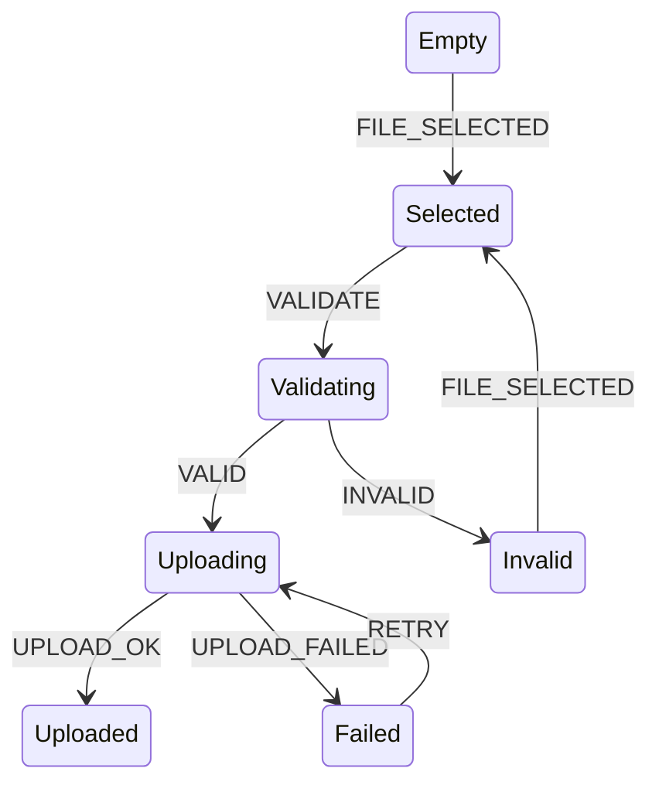
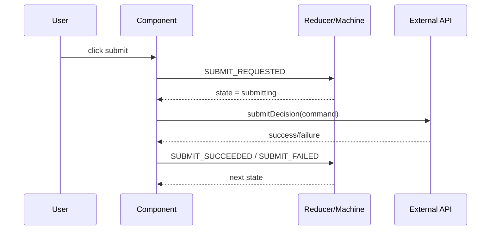
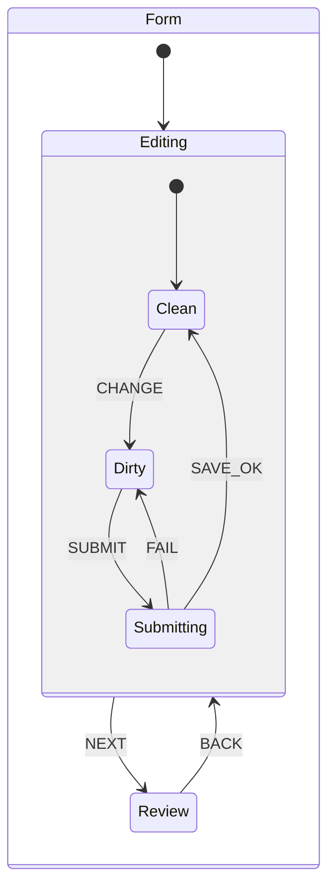
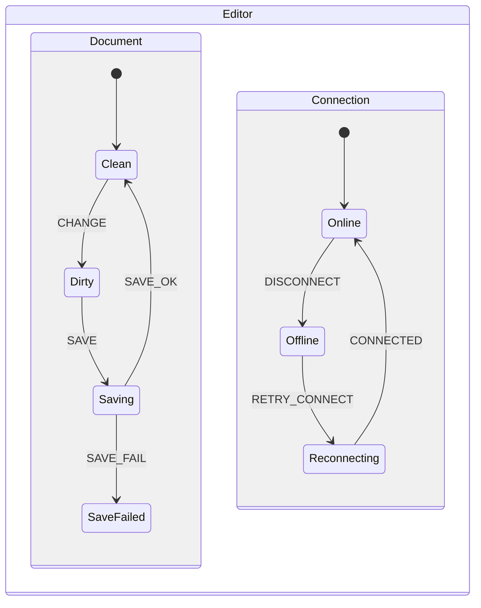
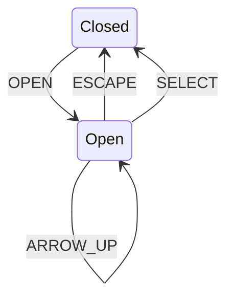
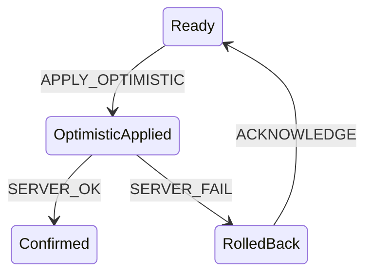
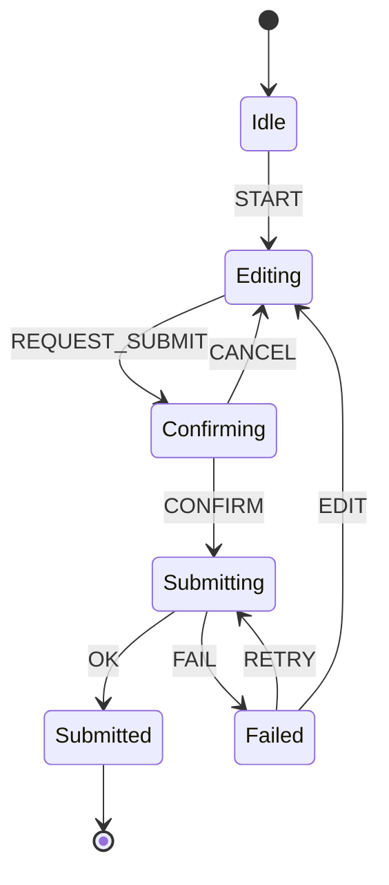

# Part 088 — State Machine Thinking for React

Part sebelumnya membahas workflow state sebagai fase perjalanan UI. Part ini menambahkan bahasa yang lebih presisi: **state machine**.

State machine thinking bukan berarti semua UI harus memakai library state machine. Ini adalah cara berpikir untuk membuat behavior eksplisit.

Tujuannya sederhana:

```txt
Tidak semua event valid dari semua state.
Tidak semua kombinasi state legal.
Tidak semua side effect boleh terjadi kapan saja.
```

State machine membuat tiga hal terlihat:

```txt
state sekarang
 event yang diterima
state berikutnya yang legal
```

Di React, state machine thinking sangat berguna ketika UI memiliki:

- multi-step workflow;
- async command lifecycle;
- retry/cancel/undo;
- permission guard;
- modal/overlay orchestration;
- form submission lifecycle;
- optimistic update;
- parallel task;
- nested sub-flow;
- long-lived process yang harus bisa di-debug.

---

## 1. Reducer vs State Machine

Reducer adalah function:

```txt
(state, event) => nextState
```

State machine adalah model yang membatasi:

```txt
Dari state S, event E boleh/tidak boleh terjadi.
Jika boleh, next state harus T.
```

Semua state machine bisa diimplementasikan dengan reducer. Tetapi tidak semua reducer mengekspresikan state machine dengan jelas.

Reducer longgar:

```tsx
function reducer(state: State, event: Event): State {
  switch (event.type) {
    case 'SUBMIT':
      return { ...state, isSubmitting: true };
    case 'SUCCESS':
      return { ...state, isSubmitting: false, isSuccess: true };
    case 'FAIL':
      return { ...state, isSubmitting: false, error: event.error };
    default:
      return state;
  }
}
```

State machine reducer:

```tsx
function reducer(state: State, event: Event): State {
  switch (state.tag) {
    case 'editing':
      switch (event.type) {
        case 'SUBMIT':
          return { tag: 'submitting', draft: state.draft, requestId: event.requestId };
        default:
          return state;
      }

    case 'submitting':
      switch (event.type) {
        case 'SUCCESS':
          if (event.requestId !== state.requestId) return state;
          return { tag: 'submitted', id: event.id };
        case 'FAIL':
          if (event.requestId !== state.requestId) return state;
          return { tag: 'failed', draft: state.draft, error: event.error };
        default:
          return state;
      }
  }
}
```

Perbedaan utamanya: machine reducer menjadikan **state saat ini sebagai pintu masuk utama**.

---

## 2. Finite State

Finite state berarti jumlah state legal terbatas dan bisa disebutkan.

Contoh upload:

```txt
empty
selected
validating
invalid
uploading
uploaded
failed
```

Jika Anda tidak bisa menyebutkan daftar state legal, berarti behavior UI masih implicit.

Finite tidak berarti kecil. Artinya bounded.

```txt
Aplikasi besar boleh punya banyak workflow.
Setiap workflow harus punya state space yang bisa dimengerti.
```

---

## 3. Events

Event adalah sesuatu yang terjadi terhadap machine.

```tsx
type Event =
  | { type: 'FILE_SELECTED'; file: File }
  | { type: 'VALIDATION_PASSED' }
  | { type: 'VALIDATION_FAILED'; reason: string }
  | { type: 'UPLOAD_STARTED'; requestId: string }
  | { type: 'UPLOAD_SUCCEEDED'; requestId: string; assetId: string }
  | { type: 'UPLOAD_FAILED'; requestId: string; error: string }
  | { type: 'CANCEL' }
  | { type: 'RETRY'; requestId: string };
```

Event harus dinamai berdasarkan makna, bukan detail UI.

Buruk:

```txt
BUTTON_CLICKED
INPUT_CHANGED
MODAL_CLOSED
```

Lebih baik:

```txt
SUBMIT_REQUESTED
DECISION_DRAFT_CHANGED
REVIEW_CANCELLED
```

Tentu ada konteks. Untuk komponen primitive, `onOpenChange` masuk akal. Untuk workflow domain, `SUBMIT_DECISION_REQUESTED` lebih jelas.

---

## 4. Transitions

Transition adalah edge dari state ke state lain.



Machine bukan hanya daftar state. Machine adalah graph.

Pertanyaan inti:

```txt
Dari state ini, event apa yang valid?
Jika event valid, masuk ke state apa?
Jika event tidak valid, apa yang harus terjadi?
```

Ada tiga policy untuk invalid event:

| Policy | Cocok untuk |
|---|---|
| Ignore | UI event yang harmless, seperti double click saat disabled |
| Throw in development | Workflow invariant violation |
| Convert to explicit error | Domain/process violation yang perlu ditampilkan |

Production biasanya ignore untuk event user yang harmless, tapi log invariant violation di development.

---

## 5. Guards

Guard adalah condition yang menentukan transition boleh terjadi atau tidak.

```tsx
function canSubmit(state: WorkflowState): boolean {
  return state.tag === 'editing'
    && isValidDraft(state.draft)
    && state.permissions.canSubmit;
}
```

Transition:

```tsx
case 'editing':
  if (event.type === 'SUBMIT_REQUESTED') {
    if (!canSubmit(state)) {
      return { tag: 'validationFailed', draft: state.draft, issues: validateDraft(state.draft) };
    }

    return {
      tag: 'submitting',
      draft: state.draft,
      requestId: event.requestId,
    };
  }
```

Guard harus pure. Jangan call API di guard. Guard menjawab boleh/tidak berdasarkan snapshot yang sudah tersedia.

---

## 6. Actions vs Effects

Dalam state machine literature, action sering berarti kerja yang terjadi saat transition. Di React, kita harus hati-hati membedakan:

```txt
pure transition action = menghitung next state
side effect action     = call API, log analytics, navigate, set timer
```

Untuk React reducer, side effect tidak boleh berada di reducer.

Gunakan boundary:

```txt
UI event handler → dispatch event → reducer calculates state
command/effect boundary → external system → dispatch result event
```

Diagram:



---

## 7. Entry and Exit Actions

State machines sering punya konsep:

```txt
entry action = saat masuk state
exit action  = saat keluar state
```

Di React manual implementation, ini biasanya dilakukan dengan effect yang menonton state phase.

```tsx
useEffect(() => {
  if (state.tag !== 'submitting') return;

  const controller = new AbortController();

  submitDecision(state.draft, { signal: controller.signal })
    .then((result) => dispatch({ type: 'SUBMIT_SUCCEEDED', requestId: state.requestId, id: result.id }))
    .catch((error) => {
      if (controller.signal.aborted) return;
      dispatch({ type: 'SUBMIT_FAILED', requestId: state.requestId, error: normalizeError(error) });
    });

  return () => controller.abort();
}, [state]);
```

Ini valid jika `submitting` benar-benar berarti “sedang sinkron dengan external system”. Tetapi tetap hati-hati:

- dependency harus benar;
- cleanup harus idempotent;
- Strict Mode development bisa menjalankan setup/cleanup ekstra;
- stale response harus dicegah dengan request id.

---

## 8. Statechart: State Machine yang Lebih Kuat

Finite state machine datar cukup untuk workflow kecil. Untuk workflow kompleks, statechart menambahkan:

- nested/hierarchical states;
- parallel/orthogonal states;
- history state;
- delayed transitions;
- invoked services/actors;
- event communication.

Statecharts dipopulerkan oleh David Harel sebagai visual formalism untuk complex systems. Ide besarnya: state diagrams biasa cepat meledak ketika butuh hierarchy dan concurrency; statecharts memperkenalkan clustering/hierarchy, orthogonality/concurrency, dan communication.

Contoh explosion tanpa hierarchy:

```txt
editingClean
editingDirty
editingSubmitting
reviewClean
reviewDirty
reviewSubmitting
```

Dengan hierarchy:

```txt
form
  editing
    clean
    dirty
    submitting
  review
    clean
    dirty
    submitting
```

Diagram:



---

## 9. Hierarchical State

Hierarchical state mengurangi duplikasi behavior.

Contoh: semua substate dalam `authenticated` boleh `LOGOUT`.

Tanpa hierarchy:

```txt
Dashboard + LOGOUT → unauthenticated
Settings + LOGOUT → unauthenticated
Billing + LOGOUT → unauthenticated
Profile + LOGOUT → unauthenticated
```

Dengan hierarchy:

```txt
authenticated
  dashboard
  settings
  billing
  profile

LOGOUT dari authenticated → unauthenticated
```

Manual React implementation bisa dilakukan dengan nested union:

```tsx
type AppState =
  | { tag: 'unauthenticated' }
  | {
      tag: 'authenticated';
      user: User;
      screen:
        | { tag: 'dashboard' }
        | { tag: 'settings' }
        | { tag: 'billing' };
    };
```

Reducer:

```tsx
function reducer(state: AppState, event: Event): AppState {
  if (state.tag === 'authenticated' && event.type === 'LOGOUT') {
    return { tag: 'unauthenticated' };
  }

  switch (state.tag) {
    case 'unauthenticated':
      // auth events
      return state;
    case 'authenticated':
      return reduceAuthenticated(state, event);
  }
}
```

Hierarchy harus dipakai untuk mengurangi duplication, bukan untuk membuat model makin sulit dibaca.

---

## 10. Parallel State

Parallel state berarti beberapa region aktif bersamaan.

Contoh editor:

```txt
Document region:
  clean | dirty | saving | saveFailed
Connection region:
  online | offline | reconnecting
Presence region:
  idle | active | away
```

Jika dipaksa ke flat state, kombinasi meledak:

```txt
cleanOnlineIdle
cleanOnlineActive
cleanOfflineIdle
savingOnlineActive
saveFailedReconnectingAway
...
```

Dengan parallel regions:



Manual React representation:

```tsx
type EditorState = {
  document: DocumentRegion;
  connection: ConnectionRegion;
  presence: PresenceRegion;
};
```

Reducer delegates:

```tsx
function editorReducer(state: EditorState, event: EditorEvent): EditorState {
  return {
    document: reduceDocument(state.document, event),
    connection: reduceConnection(state.connection, event),
    presence: reducePresence(state.presence, event),
  };
}
```

Caveat: event bisa mempengaruhi beberapa region. Pastikan invariant lintas-region dites.

---

## 11. History State

History state berarti kembali ke substate terakhir.

Contoh:

```txt
User sedang di wizard step 3.
Modal help dibuka.
Modal ditutup.
User kembali ke step 3, bukan step 1.
```

Manual representation:

```tsx
type WizardState =
  | { tag: 'running'; step: Step; history?: never }
  | { tag: 'helpOpen'; previousStep: Step };
```

Transition:

```tsx
case 'running':
  if (event.type === 'OPEN_HELP') {
    return { tag: 'helpOpen', previousStep: state.step };
  }
  return state;

case 'helpOpen':
  if (event.type === 'CLOSE_HELP') {
    return { tag: 'running', step: state.previousStep };
  }
  return state;
```

Jangan simpan history jika tidak ada requirement. History menambah kompleksitas dan potensi stale reference.

---

## 12. Actor Thinking

Actor adalah unit behavior independen yang:

- punya state sendiri;
- menerima event/message;
- bisa mengirim event/message;
- punya lifecycle;
- bisa spawn child actor;
- bisa dihentikan.

Untuk React UI, actor thinking berguna saat satu screen punya banyak workflow kecil independen:

- setiap upload item;
- setiap chat conversation;
- setiap background job row;
- setiap document editor tab;
- setiap modal instance;
- setiap workflow case card.

Contoh:

```txt
UploadManager actor
  ├── UploadItem actor #1
  ├── UploadItem actor #2
  └── UploadItem actor #3
```

Manual React implementation bisa berupa store map:

```tsx
type UploadActorState = {
  id: string;
  state: UploadWorkflow;
};

type UploadManagerState = {
  actors: Record<string, UploadActorState>;
};
```

Tetapi setelah actor lifecycle dan event routing makin kompleks, library seperti XState/Stately mulai masuk akal. XState v5 memodelkan logic dengan state machines dan actors, serta bisa dipakai lintas React/Vue/Svelte/backend.

---

## 13. Machine Config from Scratch

Sebelum memakai library, kita bisa membangun mini machine config untuk memahami ide dasarnya.

```tsx
type MachineConfig<State extends string, Event extends string> = {
  initial: State;
  states: Record<State, {
    on?: Partial<Record<Event, State>>;
  }>;
};

const uploadMachine = {
  initial: 'empty',
  states: {
    empty: {
      on: { FILE_SELECTED: 'selected' },
    },
    selected: {
      on: { VALIDATE: 'validating', RESET: 'empty' },
    },
    validating: {
      on: { VALID: 'uploading', INVALID: 'invalid' },
    },
    invalid: {
      on: { FILE_SELECTED: 'selected', RESET: 'empty' },
    },
    uploading: {
      on: { UPLOAD_OK: 'uploaded', UPLOAD_FAILED: 'failed' },
    },
    failed: {
      on: { RETRY: 'uploading', RESET: 'empty' },
    },
    uploaded: {
      on: { RESET: 'empty' },
    },
  },
} as const;
```

Interpreter minimal:

```tsx
function transition<State extends string, Event extends string>(
  config: MachineConfig<State, Event>,
  state: State,
  event: Event,
): State {
  return config.states[state].on?.[event] ?? state;
}
```

Hook:

```tsx
function useMachine<State extends string, Event extends string>(
  config: MachineConfig<State, Event>,
) {
  const [state, setState] = useState(config.initial);

  const send = useCallback((event: Event) => {
    setState((current) => transition(config, current, event));
  }, [config]);

  return [state, send] as const;
}
```

Ini hanya untuk belajar. Production machine butuh context, guard, action, invoked service, delayed transition, actor, devtools, serialization, testing, dan type inference lebih kuat.

---

## 14. Machine with Context

State tag tidak cukup untuk data.

```tsx
type UploadContext = {
  file?: File;
  assetId?: string;
  error?: string;
  attempts: number;
};
```

Machine state:

```tsx
type MachineState = {
  value: 'empty' | 'selected' | 'uploading' | 'uploaded' | 'failed';
  context: UploadContext;
};
```

Transition bisa mengubah state value dan context.

```tsx
function reducer(state: MachineState, event: UploadEvent): MachineState {
  switch (state.value) {
    case 'empty':
      if (event.type === 'FILE_SELECTED') {
        return { value: 'selected', context: { file: event.file, attempts: 0 } };
      }
      return state;

    case 'selected':
      if (event.type === 'UPLOAD') {
        return { value: 'uploading', context: state.context };
      }
      return state;

    case 'uploading':
      if (event.type === 'UPLOAD_OK') {
        return { value: 'uploaded', context: { ...state.context, assetId: event.assetId } };
      }
      if (event.type === 'UPLOAD_FAIL') {
        return {
          value: 'failed',
          context: {
            ...state.context,
            error: event.error,
            attempts: state.context.attempts + 1,
          },
        };
      }
      return state;

    default:
      return state;
  }
}
```

Alternative union state lebih TypeScript-safe untuk data yang hanya valid di state tertentu. Machine context lebih cocok untuk library machine/statechart yang memisahkan `value` dan `context`.

Trade-off:

| Approach | Kelebihan | Risiko |
|---|---|---|
| Discriminated union | Data validity kuat per state | Bisa verbose |
| Machine `value + context` | Mirip XState, mudah introspect | Context bisa punya optional field liar |
| Hybrid | Value + typed context per state | Butuh type design lebih serius |

---

## 15. Guards in Config

Mini config dengan guard:

```tsx
type Transition<S, C, E> = {
  target: S;
  guard?: (context: C, event: E) => boolean;
};
```

Contoh:

```tsx
const submitTransition = {
  target: 'submitting',
  guard: (ctx: FormContext) => isValid(ctx.draft) && ctx.permissions.canSubmit,
};
```

Guard harus:

```txt
pure
synchronous
based on current context/event
free from side effects
```

Jika butuh server validation, itu bukan guard lokal. Itu invoked service/async command yang menghasilkan event `SERVER_VALIDATION_PASSED` atau `SERVER_VALIDATION_FAILED`.

---

## 16. Actions in Config

Transition action bisa dipakai untuk update context atau emit internal event.

```tsx
type Assign<C, E> = (context: C, event: E) => C;
```

Contoh:

```tsx
const assignError = (ctx: UploadContext, event: UploadEvent): UploadContext => {
  if (event.type !== 'UPLOAD_FAIL') return ctx;
  return { ...ctx, error: event.error, attempts: ctx.attempts + 1 };
};
```

Prinsip production:

```txt
Pure assign/action boleh di transition calculation.
Impure side effect harus di boundary lain.
```

---

## 17. Invoked Service

Invoked service adalah external work yang dimulai saat masuk state tertentu.

Contoh konseptual:

```txt
state: submitting
invoke: submitDecision
onDone: submitted
onError: failed
```

Manual React:

```tsx
useEffect(() => {
  if (state.tag !== 'submitting') return;

  const controller = new AbortController();
  const { requestId, draft } = state;

  submitDecision(draft, { signal: controller.signal })
    .then((result) => dispatch({ type: 'SUBMIT_DONE', requestId, result }))
    .catch((error) => {
      if (!controller.signal.aborted) {
        dispatch({ type: 'SUBMIT_ERROR', requestId, error });
      }
    });

  return () => controller.abort();
}, [state]);
```

Dengan XState, konsep invoke sudah native. Tetapi memahami versi manual penting agar Anda tahu apa yang library abstraksikan.

---

## 18. Delayed Transition

Contoh snackbar:

```txt
visible → hidden after 5 seconds
```

Manual:

```tsx
useEffect(() => {
  if (state.tag !== 'visible') return;

  const id = window.setTimeout(() => {
    dispatch({ type: 'TIMEOUT' });
  }, 5000);

  return () => window.clearTimeout(id);
}, [state]);
```

Machine concept:

```txt
after 5000ms → hidden
```

Delayed transition harus cleanup saat state keluar. Jika tidak, timeout lama bisa menembakkan event ke workflow baru.

---

## 19. UI as Projection of Machine State

Komponen React sebaiknya menjadi projection:

```tsx
function SubmitPanel({ state, send }: Props) {
  switch (state.tag) {
    case 'editing':
      return <EditForm draft={state.draft} onSubmit={() => send({ type: 'SUBMIT' })} />;

    case 'submitting':
      return <PendingPanel message="Submitting decision..." />;

    case 'failed':
      return <ErrorPanel error={state.error} onRetry={() => send({ type: 'RETRY' })} />;

    case 'submitted':
      return <SuccessPanel decisionId={state.decisionId} />;
  }
}
```

JSX tidak boleh menjadi tempat utama workflow rule. JSX membaca state dan mengirim event.

---

## 20. State Machine and Accessibility

State machine bukan hanya untuk data. Accessibility behavior sering berbentuk state machine:

- menu: closed/open, focused item, selected item;
- combobox: idle/open/filtering/selecting;
- dialog: closed/opening/open/closing;
- tooltip: hidden/waiting/visible;
- tabs: selected tab, focus roving;
- drag and drop: idle/dragging/dropping/cancelled.

Contoh menu:



Jika accessibility primitive diimplementasikan hanya dengan boolean `isOpen`, edge case keyboard/focus biasanya bocor.

---

## 21. Machine Boundary in React Architecture

Letakkan machine pada boundary yang tepat.

| Boundary | Cocok untuk |
|---|---|
| Component-local hook | modal kecil, upload kecil, local wizard |
| Provider-scoped machine | screen workflow, multi-part form |
| External actor/store | long-lived workflow lintas route |
| Server-backed workflow | proses bisnis yang authoritative di backend |
| Component library primitive | menu, tabs, dialog, combobox |

Jangan menaruh semua machine global. State machine tetap punya ownership dan lifetime.

---

## 22. When Reducer Is Enough

Reducer cukup jika:

```txt
- state datar;
- transition sedikit;
- tidak ada nested/parallel state;
- side effect bisa dikelola di command handler;
- tidak perlu visualization/devtools machine;
- testing transition sederhana cukup.
```

Contoh:

```txt
editing → submitting → success/failed
```

`useReducer` dengan discriminated union sudah cukup.

---

## 23. When to Move to State Machine Library

Pertimbangkan library jika:

```txt
- workflow punya nested state;
- workflow punya parallel regions;
- banyak invoked async services;
- banyak delayed transitions;
- ada actor/child workflow;
- event routing kompleks;
- business stakeholder perlu visual model;
- transition testing manual mulai berat;
- team butuh shared formalism.
```

XState/Stately memberi bahasa untuk state machines, statecharts, dan actors; dokumentasi resminya menekankan event-driven programming, statecharts, actors, dan penggunaan lintas framework termasuk React.

Tetapi jangan gunakan library untuk menutupi model yang belum dipahami. Library memperjelas model yang benar; library tidak otomatis memperbaiki model yang kacau.

---

## 24. State Machine Does Not Replace Server Authority

UI state machine bukan source of truth domain final.

UI bisa memodelkan:

```txt
readyToSubmit
submitting
submittedLocally
serverRejected
```

Tetapi server tetap authority untuk:

```txt
apakah command valid
apakah permission valid
apakah entity version masih terbaru
apakah business rule terpenuhi
```

Jangan berpikir karena UI machine melarang illegal transition, server tidak perlu validasi. UI machine meningkatkan UX dan consistency. Server tetap menjaga system invariant.

---

## 25. State Machine and Optimistic UI

Optimistic UI adalah temporary branch.



State shape:

```tsx
type LikeWorkflow =
  | { tag: 'ready'; liked: boolean }
  | { tag: 'optimistic'; previous: boolean; optimistic: boolean; requestId: string }
  | { tag: 'failed'; liked: boolean; error: string };
```

State machine membantu menjawab:

```txt
Apa yang terjadi jika user klik lagi saat optimistic request berjalan?
Apakah kita queue, ignore, replace, atau cancel?
Apa yang terjadi jika server response pertama datang setelah request kedua?
```

Tanpa machine thinking, optimistic UI mudah menjadi kumpulan patch yang tidak deterministik.

---

## 26. State Machine Testing

Transition table test:

```tsx
const cases = [
  ['editing', 'SUBMIT', 'submitting'],
  ['submitting', 'SUCCESS', 'submitted'],
  ['submitting', 'FAIL', 'failed'],
  ['failed', 'RETRY', 'submitting'],
] as const;

for (const [from, event, to] of cases) {
  it(`${from} + ${event} -> ${to}`, () => {
    const state = makeState(from);
    const next = reducer(state, makeEvent(event));
    expect(next.tag).toBe(to);
  });
}
```

Invalid event test:

```tsx
it('ignores stale success after retry creates a new request', () => {
  const state = {
    tag: 'submitting',
    draft,
    requestId: 'new-request',
  } as const;

  const next = reducer(state, {
    type: 'SUBMIT_SUCCEEDED',
    requestId: 'old-request',
    decisionId: 'd1',
  });

  expect(next).toBe(state);
});
```

Guard test:

```tsx
it('does not submit when permission is missing', () => {
  const state = {
    tag: 'editing',
    draft: validDraft,
    permissions: { canSubmit: false },
  } as const;

  expect(canSubmit(state)).toBe(false);
});
```

State machine makes tests systematic because the graph is finite.

---

## 27. Mermaid as Design Artifact

Untuk workflow penting, gambar machine sebelum implementasi.



Diagram bukan dekorasi. Diagram harus sesuai dengan reducer/machine test.

Praktik yang baik:

```txt
Diagram → state union → event union → transition reducer → transition tests → component projection
```

---

## 28. Naming Rules

State names harus menyatakan kondisi, bukan aksi.

Baik:

```txt
editing
submitting
failed
submitted
waitingForConfirmation
```

Buruk:

```txt
submit
clickSubmit
validate
callApi
```

Event names harus menyatakan kejadian/intent.

Baik:

```txt
SUBMIT_REQUESTED
SUBMIT_CONFIRMED
SUBMIT_SUCCEEDED
SUBMIT_FAILED
```

Buruk:

```txt
SET_LOADING
SET_SUCCESS
HANDLE_CLICK
```

Action/command names harus menyatakan operasi.

```txt
submitDecision()
validateDraft()
cancelUpload()
restoreDeletedItem()
```

---

## 29. Failure Modes

### 29.1 Event Accepted from Wrong State

Gejala:

```txt
SUCCESS event mengubah idle menjadi submitted.
```

Penyebab:

```txt
Reducer switch by event first, bukan by state first.
```

Refactor:

```txt
Switch state first, event second.
```

---

### 29.2 Guard Only in UI

Gejala:

```txt
Button disabled, tapi keyboard shortcut tetap submit.
```

Refactor:

```txt
Guard di command/machine, UI hanya menampilkan guard result.
```

---

### 29.3 Side Effect in Reducer

Gejala:

```txt
Test flaky, Strict Mode aneh, transition tidak deterministic.
```

Refactor:

```txt
Reducer pure. Side effect di command handler/effect/invoked service.
```

---

### 29.4 Flat Machine Explosion

Gejala:

```txt
State names makin panjang dan kombinatorial.
```

Refactor:

```txt
Gunakan hierarchy atau parallel regions.
```

---

### 29.5 Context Blob

Gejala:

```txt
Machine punya context raksasa dengan banyak optional field.
```

Refactor:

```txt
Pindahkan data ke state-specific union atau pecah machine.
```

---

### 29.6 Machine Too Global

Gejala:

```txt
Modal kecil bergantung pada app-level machine dan sulit reuse.
```

Refactor:

```txt
Turunkan ownership. Machine harus punya lifetime yang tepat.
```

---

## 30. Decision Framework

Gunakan ini:

```txt
Apakah hanya state sederhana?
→ useState

Apakah update logic mulai bercabang tapi masih lokal?
→ useReducer + discriminated union

Apakah banyak child dalam subtree perlu akses workflow?
→ reducer + context

Apakah workflow punya nested/parallel state atau invoked services?
→ state machine/statechart

Apakah banyak instance workflow independen saling berkomunikasi?
→ actor model

Apakah state sebenarnya milik server?
→ server-state cache + command lifecycle
```

Jangan pilih tool dari popularitas. Pilih dari struktur masalah.

---

## 31. Mini Exercise

Modelkan workflow “review case decision”:

Requirement:

```txt
1. Case harus loaded sebelum review.
2. Reviewer bisa mulai draft decision.
3. Draft harus valid sebelum submit.
4. Submit butuh confirmation modal.
5. Server bisa accept, reject karena policy, atau gagal network.
6. Network failure bisa retry.
7. Policy rejection harus kembali ke editing dengan rejection details.
8. Response lama tidak boleh menimpa request baru.
```

Tugas:

1. Buat Mermaid state diagram.
2. Buat union state.
3. Buat union event.
4. Buat guard `canSubmit`.
5. Buat reducer state-first.
6. Buat test stale response.
7. Jelaskan lifetime state: local, context, external store, atau server-backed.

---

## 32. Ringkasan

State machine thinking memberi React UI bahasa untuk behavior yang eksplisit.

Prinsip utama:

- sebutkan finite states;
- event harus bermakna;
- transition harus legal dari state tertentu;
- guard harus pure dan reusable;
- reducer harus deterministic;
- side effect harus di boundary;
- request identity melindungi async workflow;
- hierarchy mengurangi duplikasi;
- parallel state mencegah state explosion;
- actor model berguna untuk banyak workflow independen;
- UI adalah projection dari machine state;
- diagram dan tests harus mencerminkan graph yang sama.

State machine bukan silver bullet. Tetapi untuk workflow React yang kompleks, state machine thinking adalah perbedaan antara UI yang “kebetulan jalan” dan UI yang bisa dijelaskan, dites, di-debug, dan dievolusi.

Part berikutnya akan membangun mini state machine hook dari scratch agar konsep ini tidak berhenti sebagai teori.

---

## Referensi

- React — Managing State: https://react.dev/learn/managing-state
- React — Extracting State Logic into a Reducer: https://react.dev/learn/extracting-state-logic-into-a-reducer
- React — Scaling Up with Reducer and Context: https://react.dev/learn/scaling-up-with-reducer-and-context
- Stately/XState Docs: https://stately.ai/docs/xstate
- Stately — State machines and statecharts: https://stately.ai/docs/state-machines-and-statecharts
- David Harel — Statecharts: A Visual Formalism for Complex Systems: https://www.state-machine.com/doc/Harel87.pdf
