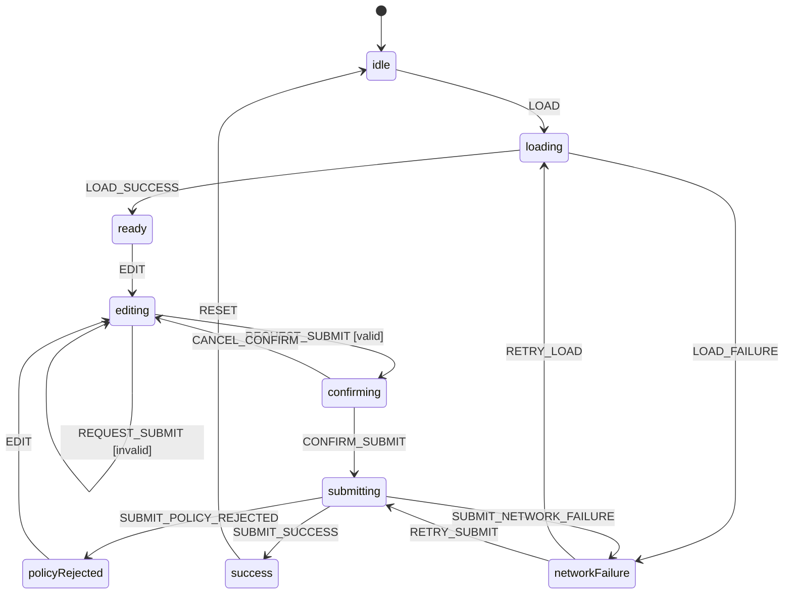

# Part 089 — Build a State Machine Hook from Scratch

Part sebelumnya membangun cara berpikir state machine. Part ini menurunkannya menjadi implementasi kecil yang bisa dipakai di React.

Tujuannya bukan membuat pengganti XState. Tujuannya adalah memahami mesin di balik pola itu:

```txt
config → current state → event → transition resolution → next state → effects/actions
```

Kalau kamu bisa membangun versi kecilnya, kamu akan lebih tajam saat memakai library production seperti XState, reducer, Zustand, atau workflow engine internal.

Kita akan membangun:

```txt
useMachine(machine, options)
```

dengan fitur minimal tetapi penting:

- finite states;
- event-driven transition;
- guard;
- actions;
- context update;
- entry action;
- exit action;
- invoke async service;
- cancellation on state exit;
- request identity protection;
- typed event/state style;
- testable transition function;
- React adapter yang menjaga side effect tidak terjadi di render.

Batas desain:

```txt
Ini educational engine.
Bukan production replacement untuk XState.
Tidak menangani semua statecharts: hierarchy, parallel states, history state, spawned actors, delayed transitions lengkap, inspector, serialization, tooling.
```

Tetapi engine kecil ini cukup untuk memahami prinsip.

---

## 1. Problem yang Akan Kita Pecahkan

Kita pakai workflow review case:

```txt
idle
loading
ready
editing
confirming
submitting
success
policyRejected
networkFailure
```

Event yang relevan:

```txt
LOAD
LOAD_SUCCESS
LOAD_FAILURE
EDIT
REQUEST_SUBMIT
CANCEL_CONFIRM
CONFIRM_SUBMIT
SUBMIT_SUCCESS
SUBMIT_POLICY_REJECTED
SUBMIT_NETWORK_FAILURE
RETRY
RESET
```

Bug yang ingin dicegah:

- submit sebelum case loaded;
- submit draft invalid;
- network response lama menimpa state baru;
- user bisa retry dari state yang salah;
- confirmation modal tertinggal setelah submit;
- effect async jalan ulang dari render;
- reducer melakukan side effect;
- transition tidak bisa dites secara deterministik.

---

## 2. Diagram Target



Perhatikan satu hal: **transition graph adalah kontrak**, bukan dokumentasi hiasan.

Kalau diagram berkata `CONFIRM_SUBMIT` hanya valid dari `confirming`, reducer tidak boleh menerima event itu dari `editing` atau `idle`.

---

## 3. Mesin Minimal: Apa yang Harus Ada?

Sebuah state machine runtime minimal butuh lima bagian:

```txt
1. current finite state
2. context tambahan
3. event
4. transition resolver
5. side-effect runner di luar transition pure
```

Finite state menjawab:

```txt
workflow sedang di fase apa?
```

Context menjawab:

```txt
payload/data tambahan apa yang diperlukan oleh workflow?
```

Contoh:

```ts
type ReviewValue =
  | 'idle'
  | 'loading'
  | 'ready'
  | 'editing'
  | 'confirming'
  | 'submitting'
  | 'success'
  | 'policyRejected'
  | 'networkFailure';

type ReviewContext = {
  caseId: string | null;
  caseData: CaseData | null;
  draft: DecisionDraft;
  requestId: string | null;
  error: string | null;
  policyErrors: string[];
};
```

State value adalah fase. Context adalah data tambahan.

Jangan membaliknya.

Buruk:

```ts
type State = {
  isLoading: boolean;
  isEditing: boolean;
  isConfirming: boolean;
  isSubmitting: boolean;
  isSuccess: boolean;
};
```

Bagus:

```ts
type State = {
  value: 'loading' | 'editing' | 'submitting' | 'success';
  context: ReviewContext;
};
```

Boolean banyak biasanya menyembunyikan finite state.

---

## 4. Kontrak State Machine Engine

Kita mulai dari tipe generik.

```ts
type AnyEvent = { type: string };

type MachineState<TValue extends string, TContext> = {
  value: TValue;
  context: TContext;
};
```

Transition bisa berupa:

```txt
state A + event E → state B
```

atau:

```txt
state A + event E → tetap state A + action/error
```

Kita butuh guard:

```ts
type Guard<TContext, TEvent extends AnyEvent> = (args: {
  context: TContext;
  event: TEvent;
}) => boolean;
```

Kita butuh action:

```ts
type Action<TContext, TEvent extends AnyEvent> = (args: {
  context: TContext;
  event: TEvent;
}) => void;


type GuardArgs<TContext, TEvent extends AnyEvent> = {
  context: TContext;
  event: TEvent;
};
```

Tetapi hati-hati: action yang melakukan side effect tidak boleh dijalankan di reducer React.

Karena itu transition pure akan **mengembalikan daftar action**, bukan menjalankannya.

---

## 5. Transition Result

Transition resolver harus deterministic.

Input:

```txt
current state + event
```

Output:

```txt
next state + actionsToRun
```

```ts
type TransitionResult<TValue extends string, TContext, TEvent extends AnyEvent> = {
  state: MachineState<TValue, TContext>;
  actions: Array<Action<TContext, TEvent>>;
};
```

Dengan kontrak ini, transition function bisa dites tanpa React.

```ts
const result = transition(machine, currentState, { type: 'CONFIRM_SUBMIT' });

expect(result.state.value).toBe('submitting');
expect(result.actions).toHaveLength(1);
```

Jangan kirim HTTP request dari transition function.

Transition function harus seperti reducer:

```txt
pure
predictable
repeatable
safe under Strict Mode
```

---

## 6. Machine Config Minimal

Kita definisikan config seperti ini:

```ts
type TransitionConfig<TValue extends string, TContext, TEvent extends AnyEvent> = {
  target?: TValue;
  guard?: Guard<TContext, TEvent>;
  actions?: Array<Action<TContext, TEvent>>;
  assign?: (args: { context: TContext; event: TEvent }) => Partial<TContext>;
};

type StateNodeConfig<TValue extends string, TContext, TEvent extends AnyEvent> = {
  entry?: Array<Action<TContext, TEvent>>;
  exit?: Array<Action<TContext, TEvent>>;
  on?: Partial<Record<TEvent['type'], TransitionConfig<TValue, TContext, TEvent> | Array<TransitionConfig<TValue, TContext, TEvent>>>>;
};

type MachineConfig<TValue extends string, TContext, TEvent extends AnyEvent> = {
  initial: TValue;
  context: TContext;
  states: Record<TValue, StateNodeConfig<TValue, TContext, TEvent>>;
};
```

Catatan penting:

```txt
on[eventType] boleh single transition atau array transition.
Array berguna untuk guard priority.
```

Contoh:

```ts
REQUEST_SUBMIT: [
  {
    guard: canSubmit,
    target: 'confirming'
  },
  {
    actions: [showValidationErrors]
  }
]
```

Artinya:

```txt
Jika valid → confirming.
Jika tidak valid → tetap editing, jalankan action validasi.
```

---

## 7. Pure Transition Resolver

Implementasi inti:

```ts
function resolveTransition<TValue extends string, TContext, TEvent extends AnyEvent>(
  machine: MachineConfig<TValue, TContext, TEvent>,
  current: MachineState<TValue, TContext>,
  event: TEvent
): TransitionResult<TValue, TContext, TEvent> {
  const stateNode = machine.states[current.value];
  const rawTransition = stateNode.on?.[event.type];

  if (!rawTransition) {
    return { state: current, actions: [] };
  }

  const candidates = Array.isArray(rawTransition) ? rawTransition : [rawTransition];

  const selected = candidates.find((candidate) => {
    if (!candidate.guard) return true;
    return candidate.guard({ context: current.context, event });
  });

  if (!selected) {
    return { state: current, actions: [] };
  }

  const nextValue = selected.target ?? current.value;
  const assigned = selected.assign?.({ context: current.context, event }) ?? {};
  const nextContext = {
    ...current.context,
    ...assigned,
  };

  const exits = nextValue !== current.value ? stateNode.exit ?? [] : [];
  const entries = nextValue !== current.value ? machine.states[nextValue].entry ?? [] : [];

  return {
    state: {
      value: nextValue,
      context: nextContext,
    },
    actions: [...exits, ...(selected.actions ?? []), ...entries],
  };
}
```

Urutan action:

```txt
exit current state
transition actions
entry next state
```

Ini bukan satu-satunya urutan yang mungkin, tetapi urutan ini mudah dipahami.

Yang penting: pilih satu kontrak dan dokumentasikan.

---

## 8. Kenapa Actions Dikembalikan, Bukan Dijalankan?

Karena React render dan reducer harus pure.

Buruk:

```ts
function reducer(state, event) {
  if (event.type === 'CONFIRM_SUBMIT') {
    fetch('/submit'); // side effect di reducer
    return { value: 'submitting' };
  }
}
```

Bagus:

```ts
const result = resolveTransition(machine, state, event);
// reducer hanya menyimpan result.state
// effect runner menjalankan result.actions setelah commit
```

Ini membedakan:

```txt
state transition = keputusan pure
side effect = konsekuensi setelah state berubah
```

Di production, pemisahan ini mencegah:

- double request di Strict Mode;
- request dari render speculative;
- action berjalan tetapi state gagal commit;
- test reducer butuh mock network;
- retry/cancel susah dilacak.

---

## 9. React Adapter: Reducer Internal

Kita butuh reducer yang menyimpan state machine snapshot dan action queue.

```ts
type RuntimeState<TValue extends string, TContext, TEvent extends AnyEvent> = {
  machineState: MachineState<TValue, TContext>;
  queuedActions: Array<Action<TContext, TEvent>>;
};

type RuntimeEvent<TEvent extends AnyEvent> =
  | { type: 'SEND'; event: TEvent }
  | { type: 'FLUSH_ACTIONS' };
```

Reducer:

```ts
function createRuntimeReducer<TValue extends string, TContext, TEvent extends AnyEvent>(
  machine: MachineConfig<TValue, TContext, TEvent>
) {
  return function reducer(
    runtime: RuntimeState<TValue, TContext, TEvent>,
    runtimeEvent: RuntimeEvent<TEvent>
  ): RuntimeState<TValue, TContext, TEvent> {
    switch (runtimeEvent.type) {
      case 'SEND': {
        const result = resolveTransition(machine, runtime.machineState, runtimeEvent.event);
        return {
          machineState: result.state,
          queuedActions: result.actions,
        };
      }

      case 'FLUSH_ACTIONS': {
        return {
          ...runtime,
          queuedActions: [],
        };
      }

      default: {
        return runtime;
      }
    }
  };
}
```

Sekilas terlihat action queue hanya satu batch. Itu cukup untuk mesin kecil.

Kalau kamu butuh nested send, delayed event, spawned actors, dan inspection, jangan perbesar engine ini sembarangan. Pakai library statechart production.

---

## 10. Hook `useMachine`

```tsx
import { useCallback, useEffect, useMemo, useReducer } from 'react';

function useMachine<TValue extends string, TContext, TEvent extends AnyEvent>(
  machine: MachineConfig<TValue, TContext, TEvent>
) {
  const reducer = useMemo(() => createRuntimeReducer(machine), [machine]);

  const [runtime, dispatch] = useReducer(reducer, {
    machineState: {
      value: machine.initial,
      context: machine.context,
    },
    queuedActions: [],
  });

  const send = useCallback((event: TEvent) => {
    dispatch({ type: 'SEND', event });
  }, []);

  useEffect(() => {
    if (runtime.queuedActions.length === 0) return;

    for (const action of runtime.queuedActions) {
      action({
        context: runtime.machineState.context,
        event: { type: '__ACTION_FLUSH__' } as TEvent,
      });
    }

    dispatch({ type: 'FLUSH_ACTIONS' });
  }, [runtime.queuedActions, runtime.machineState.context]);

  return [runtime.machineState, send] as const;
}
```

Ada masalah pada versi ini.

Action menerima event palsu `__ACTION_FLUSH__`. Padahal action sering butuh event asli.

Kita perlu menyimpan action bersama event pemicunya.

---

## 11. Action Queue yang Benar

Ubah action queue menjadi:

```ts
type QueuedAction<TContext, TEvent extends AnyEvent> = {
  action: Action<TContext, TEvent>;
  event: TEvent;
};
```

Transition result:

```ts
type TransitionResult<TValue extends string, TContext, TEvent extends AnyEvent> = {
  state: MachineState<TValue, TContext>;
  actions: Array<QueuedAction<TContext, TEvent>>;
};
```

Resolver:

```ts
const actions = [...exits, ...(selected.actions ?? []), ...entries].map((action) => ({
  action,
  event,
}));
```

Runner:

```tsx
useEffect(() => {
  if (runtime.queuedActions.length === 0) return;

  for (const item of runtime.queuedActions) {
    item.action({
      context: runtime.machineState.context,
      event: item.event,
    });
  }

  dispatch({ type: 'FLUSH_ACTIONS' });
}, [runtime.queuedActions, runtime.machineState.context]);
```

Lebih benar. Tetapi masih ada masalah: actions tidak bisa mengirim event balik ke machine.

Untuk async service, action perlu akses `send`.

---

## 12. Action Environment

Action sebaiknya menerima environment:

```ts
type MachineEnv<TEvent extends AnyEvent> = {
  send: (event: TEvent) => void;
  signal?: AbortSignal;
};

type Action<TContext, TEvent extends AnyEvent> = (args: {
  context: TContext;
  event: TEvent;
  env: MachineEnv<TEvent>;
}) => void | Promise<void>;

type ActionArgs<TContext, TEvent extends AnyEvent> = {
  context: TContext;
  event: TEvent;
  env: MachineEnv<TEvent>;
};

type InvokeArgs<TContext, TEvent extends AnyEvent> = {
  context: TContext;
  event: TEvent;
  signal: AbortSignal;
  send: (event: TEvent) => void;
};
```

Sekarang action bisa:

```ts
async function submitDecision({ context, env }: ActionArgs<ReviewContext, ReviewEvent>) {
  try {
    const result = await api.submitDecision(context.caseId!, context.draft, {
      signal: env.signal,
    });

    env.send({
      type: 'SUBMIT_SUCCESS',
      requestId: context.requestId!,
      result,
    });
  } catch (error) {
    env.send({
      type: 'SUBMIT_NETWORK_FAILURE',
      requestId: context.requestId!,
      message: String(error),
    });
  }
}
```

Tetapi jika state keluar dari `submitting`, action async harus bisa dibatalkan.

---

## 13. Invoke: Async Service yang Hidup di State Tertentu

Action cocok untuk fire-and-forget. Untuk async lifecycle yang melekat pada state, kita butuh `invoke`.

Contoh:

```txt
Saat masuk state submitting → jalankan submit service.
Saat keluar dari submitting → cancel service.
```

Config:

```ts
type InvokeConfig<TContext, TEvent extends AnyEvent> = {
  src: (args: {
    context: TContext;
    event: TEvent;
    signal: AbortSignal;
    send: (event: TEvent) => void;
  }) => Promise<void>;
};

type StateNodeConfig<TValue extends string, TContext, TEvent extends AnyEvent> = {
  entry?: Array<Action<TContext, TEvent>>;
  exit?: Array<Action<TContext, TEvent>>;
  invoke?: InvokeConfig<TContext, TEvent>;
  on?: Partial<Record<TEvent['type'], TransitionConfig<TValue, TContext, TEvent> | Array<TransitionConfig<TValue, TContext, TEvent>>>>;
};
```

Invoke dijalankan saat state dimasuki.

Invoke dihentikan saat state ditinggalkan.

---

## 14. Runtime Invoke Manager

Kita butuh effect yang memperhatikan `machineState.value`.

```tsx
function useInvoke<TValue extends string, TContext, TEvent extends AnyEvent>(
  machine: MachineConfig<TValue, TContext, TEvent>,
  state: MachineState<TValue, TContext>,
  lastEvent: TEvent | null,
  send: (event: TEvent) => void
) {
  useEffect(() => {
    const invoke = machine.states[state.value].invoke;
    if (!invoke || !lastEvent) return;

    const controller = new AbortController();

    invoke.src({
      context: state.context,
      event: lastEvent,
      signal: controller.signal,
      send,
    }).catch((error) => {
      if (controller.signal.aborted) return;
      console.error('Uncaught invoked service error', error);
    });

    return () => {
      controller.abort();
    };
  }, [machine, state.value, state.context, lastEvent, send]);
}
```

Ini educational, tapi ada trade-off.

Dependency `state.context` bisa membuat invoke restart saat context object identity berubah meski state value sama.

Production runtime biasanya punya snapshot lifecycle yang lebih halus.

Untuk mesin kecil, kita bisa lebih ketat:

```txt
Invoke hanya dijalankan saat state value berubah.
Context yang dipakai adalah context saat masuk state.
```

Caranya: simpan `enteredAt` atau `stateRevision`.

---

## 15. Runtime dengan Revision

Tambahkan revision:

```ts
type MachineState<TValue extends string, TContext> = {
  value: TValue;
  context: TContext;
  revision: number;
};
```

Saat target state berubah:

```ts
const changedState = nextValue !== current.value;

const nextState = {
  value: nextValue,
  context: nextContext,
  revision: changedState ? current.revision + 1 : current.revision,
};
```

Invoke effect depend pada:

```tsx
[state.value, state.revision]
```

bukan seluruh context.

```tsx
useEffect(() => {
  const invoke = machine.states[state.value].invoke;
  if (!invoke || !lastEvent) return;

  const controller = new AbortController();
  const contextAtEntry = state.context;
  const eventAtEntry = lastEvent;

  void invoke.src({
    context: contextAtEntry,
    event: eventAtEntry,
    signal: controller.signal,
    send,
  });

  return () => controller.abort();
}, [machine, state.value, state.revision, lastEvent, send]);
```

Sekarang invoke mengikuti lifecycle state entry.

---

## 16. Request Identity Guard

Cancellation tidak selalu cukup.

Server response lama bisa tetap datang jika:

- network stack tidak membatalkan request;
- backend sudah memproses command;
- promise sudah resolved sebelum abort;
- client adapter tidak mendukung AbortSignal.

Karena itu event response harus membawa `requestId`.

```ts
type ReviewEvent =
  | { type: 'CONFIRM_SUBMIT' }
  | { type: 'SUBMIT_SUCCESS'; requestId: string; result: SubmitResult }
  | { type: 'SUBMIT_POLICY_REJECTED'; requestId: string; errors: string[] }
  | { type: 'SUBMIT_NETWORK_FAILURE'; requestId: string; message: string };
```

Guard:

```ts
const isCurrentRequest = ({ context, event }: GuardArgs<ReviewContext, ReviewEvent>) => {
  if (!('requestId' in event)) return false;
  return event.requestId === context.requestId;
};
```

Transition:

```ts
submitting: {
  invoke: { src: submitDecision },
  on: {
    SUBMIT_SUCCESS: {
      guard: isCurrentRequest,
      target: 'success',
      assign: ({ event }) => ({ result: event.result, requestId: null })
    },
    SUBMIT_POLICY_REJECTED: {
      guard: isCurrentRequest,
      target: 'policyRejected',
      assign: ({ event }) => ({ policyErrors: event.errors, requestId: null })
    },
    SUBMIT_NETWORK_FAILURE: {
      guard: isCurrentRequest,
      target: 'networkFailure',
      assign: ({ event }) => ({ error: event.message, requestId: null })
    }
  }
}
```

Ini invariant penting:

```txt
Response hanya boleh memengaruhi workflow jika berasal dari request aktif.
```

---

## 17. Contoh Machine Config: Review Decision

```ts
type DecisionDraft = {
  decision: 'approve' | 'reject' | null;
  note: string;
};

type CaseData = {
  id: string;
  status: 'open' | 'closed';
  title: string;
};

type SubmitResult = {
  decisionId: string;
};

type ReviewContext = {
  caseId: string | null;
  caseData: CaseData | null;
  draft: DecisionDraft;
  requestId: string | null;
  result: SubmitResult | null;
  error: string | null;
  policyErrors: string[];
};

type ReviewEvent =
  | { type: 'LOAD'; caseId: string }
  | { type: 'LOAD_SUCCESS'; requestId: string; caseData: CaseData }
  | { type: 'LOAD_FAILURE'; requestId: string; message: string }
  | { type: 'EDIT'; patch: Partial<DecisionDraft> }
  | { type: 'REQUEST_SUBMIT' }
  | { type: 'CANCEL_CONFIRM' }
  | { type: 'CONFIRM_SUBMIT' }
  | { type: 'SUBMIT_SUCCESS'; requestId: string; result: SubmitResult }
  | { type: 'SUBMIT_POLICY_REJECTED'; requestId: string; errors: string[] }
  | { type: 'SUBMIT_NETWORK_FAILURE'; requestId: string; message: string }
  | { type: 'RETRY' }
  | { type: 'RESET' };
```

Initial context:

```ts
const initialContext: ReviewContext = {
  caseId: null,
  caseData: null,
  draft: { decision: null, note: '' },
  requestId: null,
  result: null,
  error: null,
  policyErrors: [],
};
```

Guard:

```ts
function canSubmit({ context }: GuardArgs<ReviewContext, ReviewEvent>) {
  return context.draft.decision !== null && context.draft.note.trim().length >= 10;
}

function matchesCurrentRequest({ context, event }: GuardArgs<ReviewContext, ReviewEvent>) {
  return 'requestId' in event && event.requestId === context.requestId;
}
```

Request ID helper:

```ts
function newRequestId() {
  return crypto.randomUUID();
}
```

---

## 18. Submit Service

```ts
async function submitDecisionService({
  context,
  signal,
  send,
}: InvokeArgs<ReviewContext, ReviewEvent>) {
  const requestId = context.requestId;
  if (!requestId || !context.caseId) return;

  try {
    const response = await fetch(`/api/cases/${context.caseId}/decision`, {
      method: 'POST',
      signal,
      headers: { 'Content-Type': 'application/json' },
      body: JSON.stringify(context.draft),
    });

    if (response.status === 409 || response.status === 422) {
      const body = await response.json();
      send({
        type: 'SUBMIT_POLICY_REJECTED',
        requestId,
        errors: body.errors ?? ['Policy rejected this decision'],
      });
      return;
    }

    if (!response.ok) {
      send({
        type: 'SUBMIT_NETWORK_FAILURE',
        requestId,
        message: `Submit failed: ${response.status}`,
      });
      return;
    }

    const result = await response.json();
    send({ type: 'SUBMIT_SUCCESS', requestId, result });
  } catch (error) {
    if (signal.aborted) return;

    send({
      type: 'SUBMIT_NETWORK_FAILURE',
      requestId,
      message: error instanceof Error ? error.message : String(error),
    });
  }
}
```

Service tidak mengubah React state langsung.

Service hanya mengirim event.

Itu membuat async path tetap masuk transition graph.

---

## 19. Machine Config Lengkap

```ts
const reviewMachine: MachineConfig<ReviewValue, ReviewContext, ReviewEvent> = {
  initial: 'idle',
  context: initialContext,
  states: {
    idle: {
      on: {
        LOAD: {
          target: 'loading',
          assign: ({ event }) => ({
            caseId: event.caseId,
            requestId: newRequestId(),
            error: null,
            policyErrors: [],
          }),
        },
      },
    },

    loading: {
      invoke: { src: loadCaseService },
      on: {
        LOAD_SUCCESS: {
          guard: matchesCurrentRequest,
          target: 'ready',
          assign: ({ event }) => ({
            caseData: event.caseData,
            requestId: null,
            error: null,
          }),
        },
        LOAD_FAILURE: {
          guard: matchesCurrentRequest,
          target: 'networkFailure',
          assign: ({ event }) => ({
            requestId: null,
            error: event.message,
          }),
        },
      },
    },

    ready: {
      on: {
        EDIT: {
          target: 'editing',
          assign: ({ context, event }) => ({
            draft: { ...context.draft, ...event.patch },
            error: null,
            policyErrors: [],
          }),
        },
        RESET: {
          target: 'idle',
          assign: () => initialContext,
        },
      },
    },

    editing: {
      on: {
        EDIT: {
          assign: ({ context, event }) => ({
            draft: { ...context.draft, ...event.patch },
            policyErrors: [],
          }),
        },
        REQUEST_SUBMIT: [
          {
            guard: canSubmit,
            target: 'confirming',
          },
          {
            assign: () => ({
              error: 'Draft belum valid untuk submit.',
            }),
          },
        ],
      },
    },

    confirming: {
      on: {
        CANCEL_CONFIRM: { target: 'editing' },
        CONFIRM_SUBMIT: {
          target: 'submitting',
          assign: () => ({
            requestId: newRequestId(),
            error: null,
            policyErrors: [],
          }),
        },
      },
    },

    submitting: {
      invoke: { src: submitDecisionService },
      on: {
        SUBMIT_SUCCESS: {
          guard: matchesCurrentRequest,
          target: 'success',
          assign: ({ event }) => ({
            result: event.result,
            requestId: null,
          }),
        },
        SUBMIT_POLICY_REJECTED: {
          guard: matchesCurrentRequest,
          target: 'policyRejected',
          assign: ({ event }) => ({
            policyErrors: event.errors,
            requestId: null,
          }),
        },
        SUBMIT_NETWORK_FAILURE: {
          guard: matchesCurrentRequest,
          target: 'networkFailure',
          assign: ({ event }) => ({
            error: event.message,
            requestId: null,
          }),
        },
      },
    },

    policyRejected: {
      on: {
        EDIT: {
          target: 'editing',
          assign: ({ context, event }) => ({
            draft: { ...context.draft, ...event.patch },
            policyErrors: [],
          }),
        },
      },
    },

    networkFailure: {
      on: {
        RETRY: {
          target: 'submitting',
          assign: () => ({
            requestId: newRequestId(),
            error: null,
          }),
        },
        RESET: {
          target: 'idle',
          assign: () => initialContext,
        },
      },
    },

    success: {
      on: {
        RESET: {
          target: 'idle',
          assign: () => initialContext,
        },
      },
    },
  },
};
```

Ada bug desain kecil di atas: `RETRY` dari `networkFailure` selalu submit, padahal failure bisa berasal dari load atau submit.

Solusi: context harus menyimpan failed operation.

```ts
type ReviewContext = {
  // ...
  failedOperation: 'load' | 'submit' | null;
};
```

Lalu:

```ts
networkFailure: {
  on: {
    RETRY: [
      {
        guard: ({ context }) => context.failedOperation === 'load',
        target: 'loading',
        assign: () => ({ requestId: newRequestId(), error: null }),
      },
      {
        guard: ({ context }) => context.failedOperation === 'submit',
        target: 'submitting',
        assign: () => ({ requestId: newRequestId(), error: null }),
      },
    ],
  },
}
```

Ini contoh kenapa state machine memaksa kita menemukan invariant yang kabur.

---

## 20. UI Adapter

```tsx
function CaseReviewScreen({ caseId }: { caseId: string }) {
  const [state, send] = useMachine(reviewMachine);

  useEffect(() => {
    send({ type: 'LOAD', caseId });
  }, [caseId, send]);

  if (state.value === 'loading') {
    return <LoadingState />;
  }

  if (state.value === 'networkFailure') {
    return (
      <FailureState
        message={state.context.error ?? 'Terjadi kesalahan.'}
        onRetry={() => send({ type: 'RETRY' })}
      />
    );
  }

  if (state.value === 'success') {
    return <SuccessState result={state.context.result} />;
  }

  return (
    <ReviewEditor
      caseData={state.context.caseData}
      draft={state.context.draft}
      disabled={state.value === 'submitting'}
      policyErrors={state.context.policyErrors}
      onChange={(patch) => send({ type: 'EDIT', patch })}
      onSubmitIntent={() => send({ type: 'REQUEST_SUBMIT' })}
    >
      {state.value === 'confirming' ? (
        <ConfirmSubmitDialog
          onCancel={() => send({ type: 'CANCEL_CONFIRM' })}
          onConfirm={() => send({ type: 'CONFIRM_SUBMIT' })}
        />
      ) : null}
    </ReviewEditor>
  );
}
```

UI tidak menentukan transition sendiri.

UI hanya:

```txt
membaca snapshot
mengirim event
```

Itu boundary yang sehat.

---

## 21. Jangan Membuat UI Memeriksa State Secara Tersebar

Buruk:

```tsx
<Button
  disabled={!draft.decision || draft.note.length < 10 || isSubmitting || isClosed}
  onClick={() => {
    if (!draft.decision) return;
    if (isSubmitting) return;
    setConfirmOpen(true);
  }}
>
  Submit
</Button>
```

Masalah:

- rule tersebar di view;
- guard tidak bisa dites sebagai workflow rule;
- disabled condition belum tentu sama dengan submit condition;
- logic bisa diverge antar screen;
- race condition tidak terlihat.

Bagus:

```tsx
<Button onClick={() => send({ type: 'REQUEST_SUBMIT' })}>
  Submit
</Button>
```

Lalu machine menentukan valid/tidak.

UI boleh menampilkan hint:

```tsx
const submitDisabled = state.value !== 'editing' || !canSubmit({
  context: state.context,
  event: { type: 'REQUEST_SUBMIT' },
});
```

Tetapi source of truth tetap guard machine.

---

## 22. Selector Hook untuk Machine State

Kalau machine dipasang di Context, jangan semua child subscribe ke seluruh state.

Minimal selector:

```tsx
function useMachineSelector<TSelected>(
  state: MachineState<ReviewValue, ReviewContext>,
  selector: (state: MachineState<ReviewValue, ReviewContext>) => TSelected
) {
  return selector(state);
}
```

Ini belum mengurangi rerender kalau provider value berubah.

Untuk mengurangi rerender serius, machine runtime harus menjadi external store:

```txt
actor.getSnapshot()
actor.subscribe(listener)
actor.send(event)
```

Lalu React membaca dengan `useSyncExternalStore`.

Inilah salah satu alasan library seperti XState memakai actor model.

React hook sederhana cukup untuk local workflow. Untuk shared workflow besar, lebih baik runtime actor/external store.

---

## 23. Dari Hook ke Actor Kecil

Actor minimal:

```ts
type Listener<TSnapshot> = (snapshot: TSnapshot) => void;

type MachineActor<TValue extends string, TContext, TEvent extends AnyEvent> = {
  getSnapshot(): MachineState<TValue, TContext>;
  subscribe(listener: Listener<MachineState<TValue, TContext>>): () => void;
  send(event: TEvent): void;
};
```

Implementasi konseptual:

```ts
function createMachineActor<TValue extends string, TContext, TEvent extends AnyEvent>(
  machine: MachineConfig<TValue, TContext, TEvent>
): MachineActor<TValue, TContext, TEvent> {
  let snapshot: MachineState<TValue, TContext> = {
    value: machine.initial,
    context: machine.context,
    revision: 0,
  };

  const listeners = new Set<Listener<MachineState<TValue, TContext>>>();

  return {
    getSnapshot() {
      return snapshot;
    },

    subscribe(listener) {
      listeners.add(listener);
      return () => listeners.delete(listener);
    },

    send(event) {
      const result = resolveTransition(machine, snapshot, event);
      snapshot = result.state;
      for (const listener of listeners) listener(snapshot);
      // action/invoke runner belum ditambahkan di contoh pendek ini
    },
  };
}
```

React adapter:

```tsx
function useActorSnapshot<TValue extends string, TContext, TEvent extends AnyEvent>(
  actor: MachineActor<TValue, TContext, TEvent>
) {
  return useSyncExternalStore(actor.subscribe, actor.getSnapshot, actor.getSnapshot);
}
```

Ini menunjukkan jalur evolusi:

```txt
useReducer machine hook
→ actor runtime
→ external-store subscription
→ selector subscription
→ statechart/actor library
```

---

## 24. Testing Transition Tanpa React

Transition test harus menjadi test utama.

```ts
describe('reviewMachine', () => {
  it('does not allow submit when draft is invalid', () => {
    const state = {
      value: 'editing' as const,
      context: {
        ...initialContext,
        draft: { decision: 'approve', note: 'short' },
      },
      revision: 0,
    };

    const result = resolveTransition(reviewMachine, state, { type: 'REQUEST_SUBMIT' });

    expect(result.state.value).toBe('editing');
    expect(result.state.context.error).toBe('Draft belum valid untuk submit.');
  });

  it('moves from confirming to submitting', () => {
    const state = {
      value: 'confirming' as const,
      context: {
        ...initialContext,
        draft: { decision: 'approve', note: 'Valid note for decision' },
      },
      revision: 1,
    };

    const result = resolveTransition(reviewMachine, state, { type: 'CONFIRM_SUBMIT' });

    expect(result.state.value).toBe('submitting');
    expect(result.state.context.requestId).toEqual(expect.any(String));
  });
});
```

Jangan hanya mengetes DOM.

Untuk workflow kompleks, test DOM saja terlalu lambat dan terlalu tidak spesifik.

Test ideal:

```txt
transition tests → prove graph correctness
hook tests → prove React adapter lifecycle
component tests → prove rendering and event wiring
E2E tests → prove end-to-end integration
```

---

## 25. Testing Stale Response

```ts
it('ignores stale submit response', () => {
  const state = {
    value: 'submitting' as const,
    context: {
      ...initialContext,
      requestId: 'request-new',
    },
    revision: 2,
  };

  const result = resolveTransition(reviewMachine, state, {
    type: 'SUBMIT_SUCCESS',
    requestId: 'request-old',
    result: { decisionId: 'decision-1' },
  });

  expect(result.state.value).toBe('submitting');
  expect(result.state.context.result).toBeNull();
});
```

Ini test yang sering menyelamatkan production UI.

Tanpa request identity, UI bisa menampilkan success untuk command yang sudah tidak relevan.

---

## 26. Testing Invoke Cancellation

Untuk hook-level test, kamu ingin membuktikan:

```txt
enter submitting → service starts
exit submitting → AbortController.abort() called
aborted service tidak mengirim failure event
```

Pseudocode:

```ts
it('cancels invoked service when leaving state', async () => {
  const aborts: AbortSignal[] = [];

  const service = vi.fn(async ({ signal }) => {
    aborts.push(signal);
    await never();
  });

  const machine = createTestMachineWithInvoke(service);

  const { result } = renderHook(() => useMachine(machine));

  act(() => result.current[1]({ type: 'START' }));
  expect(service).toHaveBeenCalledTimes(1);

  act(() => result.current[1]({ type: 'CANCEL' }));
  expect(aborts[0].aborted).toBe(true);
});
```

Detail test tergantung test runner, tetapi invariant-nya jelas.

---

## 27. Entry dan Exit Action: Pakai Secara Terbatas

Entry action berguna untuk:

- logging transition;
- analytics breadcrumb;
- focus management command;
- starting non-async side effect kecil;
- reset local imperative resource.

Exit action berguna untuk:

- cleanup non-React resource;
- logging cancel/abandon;
- releasing lock;
- clearing timer.

Tetapi jangan memasukkan semua behavior ke entry/exit.

Jika behavior punya lifecycle async dan perlu cancel, pakai `invoke`.

Jika behavior adalah update context, pakai `assign`.

Jika behavior adalah domain command ke server, modelkan sebagai state yang meng-invoke service.

---

## 28. Guard Harus Pure

Guard buruk:

```ts
const canSubmit = () => {
  analytics.track('checking submit');
  return Math.random() > 0.5;
};
```

Guard bagus:

```ts
const canSubmit = ({ context }) => {
  return context.draft.decision !== null && context.draft.note.trim().length >= 10;
};
```

Guard harus:

- pure;
- cepat;
- tidak mutate context;
- tidak request network;
- tidak membaca waktu global kecuali memang event/context membawa clock;
- mudah dites.

Kalau guard butuh waktu sekarang, inject clock ke context atau event:

```ts
{ type: 'REQUEST_SUBMIT', now: Date }
```

atau capability:

```ts
services.clock.now()
```

Tetapi jangan sembunyikan source nondeterminism.

---

## 29. Assign Harus Immutable

Buruk:

```ts
assign: ({ context, event }) => {
  context.draft.note = event.note;
  return context;
}
```

Bagus:

```ts
assign: ({ context, event }) => ({
  draft: {
    ...context.draft,
    note: event.note,
  },
})
```

Dalam engine kecil ini, `assign` mengembalikan partial context.

Konsekuensinya:

```txt
assign tidak boleh mengembalikan object context lengkap jika tidak perlu.
assign tidak boleh mutate context lama.
assign tidak boleh menjalankan side effect.
```

---

## 30. Event Naming

Event machine sebaiknya bukan nama handler UI mentah.

Kurang baik:

```ts
{ type: 'BUTTON_CLICKED' }
{ type: 'MODAL_OK_CLICKED' }
```

Lebih baik:

```ts
{ type: 'REQUEST_SUBMIT' }
{ type: 'CONFIRM_SUBMIT' }
{ type: 'CANCEL_CONFIRM' }
```

Alasannya:

```txt
UI bisa berubah, intent tetap.
```

Button bisa diganti keyboard shortcut. Modal bisa diganti inline confirmation. Event workflow tetap sama.

---

## 31. Illegal Event Policy

Apa yang terjadi jika event tidak valid dari state sekarang?

Pilihan:

```txt
ignore silently
warn in development
throw in test
record metric
```

Untuk UI production, ignore sering aman.

Untuk development, warning berguna.

```ts
if (!rawTransition && process.env.NODE_ENV !== 'production') {
  console.warn(`Event ${event.type} ignored in state ${current.value}`);
}
```

Untuk workflow regulated/high-risk, kamu mungkin ingin event invalid masuk audit metric:

```txt
review.submit_confirmed_while_not_confirming
```

Tetapi jangan membuat user crash hanya karena double click lama tiba terlambat.

---

## 32. Why Not Just `useReducer`?

Bisa. Engine ini pada dasarnya adalah reducer dengan struktur.

Perbedaannya:

```txt
useReducer biasa:
  bebas menerima event apapun dari state apapun
  transition legal/illegal tersembunyi di switch
  entry/exit/invoke tidak eksplisit
  diagram sulit diturunkan dari config

mini machine:
  state node eksplisit
  transition per state eksplisit
  guard/action dipisah
  invoke punya lifecycle
  diagram lebih natural
```

Untuk workflow kecil, `useReducer` sudah cukup.

Untuk workflow yang punya banyak fase, machine config lebih mudah direview.

---

## 33. Why Not Use XState Immediately?

Untuk production complex workflow, sering kali sebaiknya ya.

Tetapi belajar dari scratch memberi tiga manfaat:

```txt
1. Kamu paham apa yang dilakukan library.
2. Kamu tahu kapan library memang diperlukan.
3. Kamu tidak menulis pseudo-state-machine yang lebih buruk dari reducer biasa.
```

Gunakan mini machine untuk:

- belajar;
- local workflow sederhana;
- prototype;
- internal primitive kecil dengan batas jelas.

Gunakan XState/statechart library untuk:

- hierarchy;
- parallel states;
- actors;
- invoked/spawned services;
- devtools/visualizer;
- model-based tests;
- many independent workflow instances;
- workflow yang perlu dibaca lintas tim.

---

## 34. Failure Modes Mini Engine

### 34.1 Side Effect Masuk Transition

Gejala:

- request double;
- test sulit;
- Strict Mode memperlihatkan perilaku aneh.

Fix:

```txt
Transition mengembalikan action/invoke descriptor, runner menjalankan setelah commit.
```

### 34.2 Context Terlalu Besar

Gejala:

- machine menjadi dumping ground;
- semua event membawa terlalu banyak data;
- UI unrelated ikut rerender.

Fix:

```txt
Simpan hanya context yang dibutuhkan workflow.
Server data tetap di query cache.
View-only state tetap lokal.
```

### 34.3 Event Terlalu UI-Specific

Gejala:

- workflow rusak saat desain UI berubah;
- machine tahu terlalu banyak tentang button/modal.

Fix:

```txt
Event harus merepresentasikan intent/domain workflow.
```

### 34.4 Guard Tidak Pure

Gejala:

- transition tidak deterministic;
- test flaky;
- behavior berubah antar render.

Fix:

```txt
Guard hanya membaca context/event/capability eksplisit.
```

### 34.5 Async Tanpa Request Identity

Gejala:

- response lama overwrite state baru;
- success muncul setelah cancel;
- error muncul setelah user retry.

Fix:

```txt
Event response membawa requestId, transition guard memvalidasi requestId.
```

### 34.6 Invoke Restart Karena Context Identity

Gejala:

- service restart saat field edit;
- duplicate request;
- cancel tidak diharapkan.

Fix:

```txt
Invoke lifecycle mengikuti state entry revision, bukan setiap context identity change.
```

### 34.7 Machine Jadi Global Store

Gejala:

- semua domain masuk satu machine;
- event graph tidak bisa dibaca;
- perubahan kecil berisiko besar.

Fix:

```txt
Pisah machine berdasarkan workflow boundary.
Gunakan actor/child machine jika workflow independen.
```

---

## 35. Refactor Ladder

```txt
useState booleans
→ useReducer dengan union state
→ machine config lokal
→ machine hook + invoke
→ actor runtime + external store
→ XState/statechart production
```

Jangan lompat hanya karena kompleksitas terasa tinggi.

Cari sinyal:

```txt
Apakah event legal tergantung state sekarang?
Apakah ada async lifecycle yang perlu cancel/retry?
Apakah ada banyak impossible states?
Apakah workflow harus divisualisasikan?
Apakah perlu actor independen?
Apakah banyak tim harus membaca behavior yang sama?
```

Jika ya, naikkan level.

---

## 36. Production Checklist

Sebelum memakai machine hook internal, cek:

```txt
[ ] Transition function pure.
[ ] Guards pure dan dites.
[ ] Assign immutable.
[ ] Illegal events punya policy.
[ ] Async service lewat invoke/action runner, bukan reducer.
[ ] Invoke punya cancellation.
[ ] Response event punya requestId.
[ ] Context tidak menyimpan server cache besar.
[ ] UI hanya membaca snapshot dan mengirim event.
[ ] Transition tests mencakup happy path dan illegal path.
[ ] Stale response test ada.
[ ] Strict Mode tidak menggandakan command.
[ ] Machine boundary jelas: local, context, external actor, atau app-level.
```

---

## 37. Mini Exercise

Bangun machine hook untuk workflow upload dokumen:

Requirement:

```txt
1. User memilih file.
2. File divalidasi ukuran dan tipe.
3. Jika valid, user bisa upload.
4. Upload bisa progress.
5. Upload bisa cancel.
6. Server bisa reject karena virus scan.
7. Network failure bisa retry.
8. Cancel harus abort request.
9. Response lama tidak boleh mengubah upload baru.
```

Tugas:

1. Buat state diagram Mermaid.
2. Buat `UploadValue` union.
3. Buat `UploadContext`.
4. Buat `UploadEvent`.
5. Buat guard `isValidFile`.
6. Buat invoke `uploadFileService`.
7. Buat test stale response.
8. Buat test cancel abort.
9. Jelaskan kapan cukup pakai reducer dan kapan perlu XState.

---

## 38. Ringkasan

State machine hook kecil mengajarkan struktur dasar workflow React:

```txt
state value menentukan fase
context menyimpan data tambahan
event membawa intent/result
transition resolver harus pure
guard menjaga legal transition
action/invoke berjalan setelah state decision
async response harus kembali sebagai event
request identity melindungi dari stale response
UI membaca snapshot dan mengirim event
```

Engine kecil ini bukan tujuan akhir. Ia adalah kaca pembesar.

Setelah memahami implementasinya, library seperti XState tidak lagi terasa magis. Kamu akan melihatnya sebagai runtime actor/statechart yang memformalkan hal-hal yang baru saja kita bangun manual: transition graph, lifecycle, invoke, actors, subscription, visualization, dan tooling.

Part berikutnya membahas XState dengan React: bagaimana memakai library production tanpa membawa mental model yang salah.

---

## Referensi

- React — `useReducer`: https://react.dev/reference/react/useReducer
- React — Extracting State Logic into a Reducer: https://react.dev/learn/extracting-state-logic-into-a-reducer
- React — Components and Hooks must be pure: https://react.dev/reference/rules/components-and-hooks-must-be-pure
- React — `useSyncExternalStore`: https://react.dev/reference/react/useSyncExternalStore
- Stately/XState — XState docs: https://stately.ai/docs/xstate
- Stately/XState — State machines and statecharts: https://stately.ai/docs/state-machines-and-statecharts
