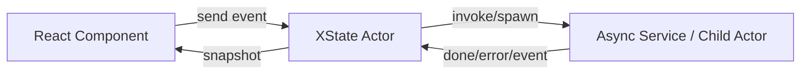

# Part 090 — XState with React

Part sebelumnya membangun state machine hook dari scratch. Sekarang kita naik ke tool production: **XState v5** dengan React.

Tujuan part ini bukan tutorial klik-counter. Tujuannya adalah membuat kamu bisa menjawab:

```txt
Kapan machine harus local?
Kapan actor harus hidup di provider?
Kapan menggunakan invoke?
Kapan menggunakan spawned actor?
Bagaimana memisahkan UI event, workflow event, dan server command?
Bagaimana mencegah machine berubah menjadi global store?
Bagaimana mengetes machine tanpa render React?
```

XState bukan “Redux alternatif”. XState adalah runtime untuk:

- finite state machine;
- statechart;
- actor;
- event-driven workflow;
- invoked service;
- spawned process;
- orchestration logic yang bisa divisualisasikan dan dites.

React tetap bertugas sebagai view runtime.

XState bertugas sebagai behavior runtime.

---

## 1. Mental Model: React View, XState Behavior

React component sebaiknya melihat XState actor seperti ini:

```txt
snapshot = apa keadaan workflow sekarang?
send(event) = intent/result apa yang masuk ke workflow?
```

React tidak perlu tahu transition table internal.

XState tidak perlu tahu DOM detail.



Batas sehat:

```txt
React:
  render snapshot
  wire user intent to send(event)
  host local visual state if needed

XState:
  legal states
  legal events
  guards
  context updates
  invoked services
  spawned actors
  retry/cancel/timeout
```

Jika React component masih berisi banyak `if currentState === ... then setX(...)`, machine belum mengambil tanggung jawab yang tepat.

---

## 2. Instalasi

XState React package memakai `xstate` sebagai peer dependency.

```bash
npm install xstate @xstate/react
```

atau:

```bash
pnpm add xstate @xstate/react
```

Gunakan pola XState v5, bukan v4.

Sinyal v5:

```txt
setup(...).createMachine(...)
fromPromise(...)
createActor(...)
useActor(...)
useMachine(...) sebagai alias useActor untuk machine
snapshot.value
snapshot.context
snapshot.matches(...)
```

---

## 3. Machine Pertama yang Layak Production

Kita pakai workflow review decision lagi.

```ts
import { setup, assign } from 'xstate';

type DecisionDraft = {
  decision: 'approve' | 'reject' | null;
  note: string;
};

type CaseData = {
  id: string;
  title: string;
  status: 'open' | 'closed';
};

type SubmitResult = {
  decisionId: string;
};

type ReviewContext = {
  caseId: string;
  caseData: CaseData | null;
  draft: DecisionDraft;
  result: SubmitResult | null;
  error: string | null;
  policyErrors: string[];
};

type ReviewEvent =
  | { type: 'edit'; patch: Partial<DecisionDraft> }
  | { type: 'requestSubmit' }
  | { type: 'cancelConfirm' }
  | { type: 'confirmSubmit' }
  | { type: 'retry' }
  | { type: 'reset' };
```

Kita mulai tanpa async.

```ts
const reviewMachine = setup({
  types: {
    context: {} as ReviewContext,
    events: {} as ReviewEvent,
    input: {} as { caseId: string; caseData: CaseData | null },
  },
  guards: {
    canSubmit: ({ context }) => {
      return context.draft.decision !== null && context.draft.note.trim().length >= 10;
    },
  },
  actions: {
    applyDraftPatch: assign({
      draft: ({ context, event }) => {
        if (event.type !== 'edit') return context.draft;
        return { ...context.draft, ...event.patch };
      },
      policyErrors: () => [],
      error: () => null,
    }),
    markInvalidDraft: assign({
      error: () => 'Draft belum valid untuk submit.',
    }),
  },
}).createMachine({
  id: 'reviewDecision',
  initial: 'editing',
  context: ({ input }) => ({
    caseId: input.caseId,
    caseData: input.caseData,
    draft: { decision: null, note: '' },
    result: null,
    error: null,
    policyErrors: [],
  }),
  states: {
    editing: {
      on: {
        edit: {
          actions: 'applyDraftPatch',
        },
        requestSubmit: [
          {
            guard: 'canSubmit',
            target: 'confirming',
          },
          {
            actions: 'markInvalidDraft',
          },
        ],
      },
    },
    confirming: {
      on: {
        cancelConfirm: { target: 'editing' },
        confirmSubmit: { target: 'submitting' },
      },
    },
    submitting: {},
  },
});
```

Hal yang penting:

```txt
Context bukan state value.
State value adalah fase workflow.
Guards adalah rule legal transition.
Actions mengubah context atau melakukan effect yang dinyatakan di machine.
```

---

## 4. Menggunakan Machine di React

```tsx
import { useMachine } from '@xstate/react';

function ReviewDecisionScreen({ caseId, caseData }: Props) {
  const [snapshot, send] = useMachine(reviewMachine, {
    input: { caseId, caseData },
  });

  return (
    <section>
      {snapshot.context.error ? (
        <InlineError message={snapshot.context.error} />
      ) : null}

      <DecisionEditor
        draft={snapshot.context.draft}
        disabled={snapshot.matches('submitting')}
        onChange={(patch) => send({ type: 'edit', patch })}
      />

      {snapshot.matches('editing') ? (
        <button onClick={() => send({ type: 'requestSubmit' })}>
          Submit
        </button>
      ) : null}

      {snapshot.matches('confirming') ? (
        <ConfirmSubmitDialog
          onCancel={() => send({ type: 'cancelConfirm' })}
          onConfirm={() => send({ type: 'confirmSubmit' })}
        />
      ) : null}
    </section>
  );
}
```

`useMachine(machine, options)` membuat actor dari machine dan menjalankannya selama lifetime component.

Kontrak UI:

```txt
snapshot dibaca saat render.
send dipanggil dari event handler/effect.
Machine menentukan transition legal.
```

---

## 5. `snapshot.value`, `snapshot.context`, dan `snapshot.matches`

Jangan membandingkan state value secara rapuh jika machine bisa nested.

Untuk flat state:

```ts
snapshot.value === 'editing'
```

masih oke.

Untuk nested state, pakai:

```ts
snapshot.matches({ submitting: 'waitingForServer' })
```

atau:

```ts
snapshot.matches('editing')
```

Snapshot juga berisi context:

```ts
snapshot.context.draft
snapshot.context.error
snapshot.context.policyErrors
```

Jaga agar context tidak menjadi dumping ground.

Context ideal berisi data yang diperlukan untuk workflow, bukan semua data screen.

---

## 6. Event Naming: XState Tidak Memaksa Domain yang Baik

XState akan menerima event type apa pun yang kamu definisikan.

Buruk:

```ts
{ type: 'clickSubmitButton' }
{ type: 'modalOkClicked' }
```

Lebih baik:

```ts
{ type: 'requestSubmit' }
{ type: 'confirmSubmit' }
{ type: 'cancelConfirm' }
```

Event harus mewakili intent/result workflow.

DOM event adalah detail UI. Machine event adalah bahasa workflow.

---

## 7. Actions: Jangan Campur Semua Hal

Di XState, action bisa dipakai untuk:

- update context via `assign`;
- logging;
- analytics breadcrumb;
- send event ke actor lain;
- effect kecil yang tidak memiliki lifecycle panjang.

Tetapi command async yang perlu pending/success/error/cancel sebaiknya menjadi state + invoke.

Buruk:

```ts
actions: {
  submitNow: async ({ context }) => {
    await fetch('/api/submit', { method: 'POST', body: JSON.stringify(context.draft) });
  }
}
```

Masalah:

```txt
pending state tidak eksplisit
error path tidak eksplisit
cancel sulit
retry sulit
response tidak menjadi event dalam graph
```

Bagus:

```txt
confirming --confirmSubmit--> submitting
submitting invokes submitDecision
onDone --> success
onError --> failure/policyRejected
```

---

## 8. Invoke dengan `fromPromise`

XState v5 menyediakan actor logic creator seperti `fromPromise`.

```ts
import { setup, assign, fromPromise } from 'xstate';

type SubmitInput = {
  caseId: string;
  draft: DecisionDraft;
};

const submitDecision = fromPromise(async ({ input }: { input: SubmitInput }) => {
  const response = await fetch(`/api/cases/${input.caseId}/decision`, {
    method: 'POST',
    headers: { 'Content-Type': 'application/json' },
    body: JSON.stringify(input.draft),
  });

  if (response.status === 422 || response.status === 409) {
    const body = await response.json();
    throw { kind: 'policy', errors: body.errors ?? ['Policy rejected'] };
  }

  if (!response.ok) {
    throw { kind: 'network', message: `HTTP ${response.status}` };
  }

  return (await response.json()) as SubmitResult;
});
```

Machine:

```ts
const reviewMachine = setup({
  types: {
    context: {} as ReviewContext,
    events: {} as ReviewEvent,
    input: {} as { caseId: string; caseData: CaseData | null },
  },
  actors: {
    submitDecision,
  },
  guards: {
    canSubmit: ({ context }) => {
      return context.draft.decision !== null && context.draft.note.trim().length >= 10;
    },
    isPolicyError: ({ event }) => {
      return typeof event.error === 'object' &&
        event.error !== null &&
        'kind' in event.error &&
        event.error.kind === 'policy';
    },
  },
  actions: {
    applyDraftPatch: assign({
      draft: ({ context, event }) => {
        if (event.type !== 'edit') return context.draft;
        return { ...context.draft, ...event.patch };
      },
      error: () => null,
      policyErrors: () => [],
    }),
    assignSubmitResult: assign({
      result: ({ event }) => {
        if (event.type !== 'xstate.done.actor.submitDecision') return null;
        return event.output;
      },
    }),
    assignPolicyErrors: assign({
      policyErrors: ({ event }) => {
        const error = event.error as { errors?: string[] };
        return error.errors ?? ['Policy rejected'];
      },
    }),
    assignNetworkError: assign({
      error: ({ event }) => {
        const error = event.error as { message?: string };
        return error.message ?? 'Network failure';
      },
    }),
  },
}).createMachine({
  id: 'reviewDecision',
  initial: 'editing',
  context: ({ input }) => ({
    caseId: input.caseId,
    caseData: input.caseData,
    draft: { decision: null, note: '' },
    result: null,
    error: null,
    policyErrors: [],
  }),
  states: {
    editing: {
      on: {
        edit: { actions: 'applyDraftPatch' },
        requestSubmit: [
          { guard: 'canSubmit', target: 'confirming' },
          { actions: assign({ error: () => 'Draft belum valid.' }) },
        ],
      },
    },
    confirming: {
      on: {
        cancelConfirm: { target: 'editing' },
        confirmSubmit: { target: 'submitting' },
      },
    },
    submitting: {
      invoke: {
        id: 'submitDecision',
        src: 'submitDecision',
        input: ({ context }) => ({
          caseId: context.caseId,
          draft: context.draft,
        }),
        onDone: {
          target: 'success',
          actions: 'assignSubmitResult',
        },
        onError: [
          {
            guard: 'isPolicyError',
            target: 'policyRejected',
            actions: 'assignPolicyErrors',
          },
          {
            target: 'networkFailure',
            actions: 'assignNetworkError',
          },
        ],
      },
    },
    policyRejected: {
      on: {
        edit: {
          target: 'editing',
          actions: 'applyDraftPatch',
        },
      },
    },
    networkFailure: {
      on: {
        retry: { target: 'submitting' },
        edit: {
          target: 'editing',
          actions: 'applyDraftPatch',
        },
      },
    },
    success: {
      type: 'final',
    },
  },
});
```

Catatan:

```txt
Invoked actor dimulai saat state submitting dimasuki.
Invoked actor dihentikan saat state submitting ditinggalkan.
onDone/onError adalah event graph, bukan callback acak.
```

---

## 9. Tentang Abort dan Cancellation

Invoke lifecycle membantu: actor yang di-invoke akan berhenti saat state keluar.

Tetapi fetch cancellation bergantung pada implementasi service. Jangan mengasumsikan semua promise benar-benar bisa dibatalkan.

Untuk workflow high-risk, tetap desain:

```txt
idempotency key di server
request identity / command id
guard terhadap stale result jika result bisa kembali dari jalur lain
```

XState memberi lifecycle. Sistem terdistribusi tetap membutuhkan idempotency.

---

## 10. `useMachine` vs `useActor`

Di `@xstate/react` v5, `useMachine(machine, options?)` adalah alias dari `useActor(machine, options?)` untuk machine.

Gunakan `useMachine` jika ingin jelas bahwa yang dipakai adalah machine.

Gunakan `useActor` jika actor logic bisa bukan hanya machine:

- machine actor;
- promise actor;
- transition actor;
- observable actor;
- callback actor.

Praktis:

```tsx
const [snapshot, send, actorRef] = useMachine(reviewMachine, {
  input: { caseId, caseData },
});
```

atau:

```tsx
const [snapshot, send, actorRef] = useActor(reviewMachine, {
  input: { caseId, caseData },
});
```

Yang penting: actor hidup selama lifetime component.

---

## 11. Local Machine vs Provider Machine

Machine local cocok jika workflow instance hanya milik satu screen/component.

```tsx
function ReviewDecisionScreen() {
  const [snapshot, send] = useMachine(reviewMachine, { input });
  // ...
}
```

Provider machine cocok jika banyak child jauh butuh actor yang sama.

```tsx
const ReviewActorContext = createContext<ActorRefFrom<typeof reviewMachine> | null>(null);

function ReviewProvider({ children, input }: PropsWithChildren<{ input: ReviewInput }>) {
  const actorRef = useActorRef(reviewMachine, { input });

  return (
    <ReviewActorContext.Provider value={actorRef}>
      {children}
    </ReviewActorContext.Provider>
  );
}
```

Consumer:

```tsx
function useReviewActor() {
  const actor = useContext(ReviewActorContext);
  if (!actor) throw new Error('useReviewActor must be used inside ReviewProvider');
  return actor;
}
```

Lalu selector:

```tsx
import { useSelector } from '@xstate/react';

function SubmitButton() {
  const actor = useReviewActor();
  const canShowSubmit = useSelector(actor, (snapshot) => snapshot.matches('editing'));

  return canShowSubmit ? (
    <button onClick={() => actor.send({ type: 'requestSubmit' })}>
      Submit
    </button>
  ) : null;
}
```

Pattern ini menghindari semua consumer rerender karena semua membaca seluruh snapshot.

---

## 12. `useActorRef` untuk Stabilitas Provider

Jika provider menyimpan `[snapshot, send]` sebagai context value, semua consumer akan rerender saat snapshot berubah.

Kurang baik:

```tsx
const value = useMachine(reviewMachine, { input });
return <Context.Provider value={value}>{children}</Context.Provider>;
```

Lebih baik untuk shared actor:

```tsx
const actorRef = useActorRef(reviewMachine, { input });
return <Context.Provider value={actorRef}>{children}</Context.Provider>;
```

Lalu consumer memilih potongan snapshot dengan `useSelector`.

Ini mirip prinsip external store selector:

```txt
Provider membagikan stable capability.
Consumer subscribe ke bagian state yang dibutuhkan.
```

---

## 13. Selector Granularity

Buruk:

```tsx
const snapshot = useSelector(actor, (s) => s);
```

Ini sama saja subscribe ke semua.

Lebih baik:

```tsx
const isSubmitting = useSelector(actor, (s) => s.matches('submitting'));
const error = useSelector(actor, (s) => s.context.error);
const note = useSelector(actor, (s) => s.context.draft.note);
```

Untuk object hasil selector, gunakan equality function jika perlu:

```tsx
const summary = useSelector(
  actor,
  (s) => ({
    value: s.value,
    error: s.context.error,
  }),
  (a, b) => a.value === b.value && a.error === b.error
);
```

Tetapi jangan terlalu cepat micro-optimize.

Mulai dari correctness, lalu profile.

---

## 14. Input vs Context

XState v5 membedakan input saat actor dibuat dan context runtime.

Input:

```txt
data awal dari luar actor
```

Context:

```txt
data internal yang berubah bersama workflow
```

Contoh:

```tsx
const [snapshot, send] = useMachine(reviewMachine, {
  input: {
    caseId,
    caseData,
  },
});
```

Machine:

```ts
context: ({ input }) => ({
  caseId: input.caseId,
  caseData: input.caseData,
  draft: { decision: null, note: '' },
  result: null,
  error: null,
  policyErrors: [],
})
```

Jangan memperlakukan perubahan prop sebagai perubahan input otomatis.

Jika `caseId` berubah dan machine harus reset, pilih salah satu:

```txt
1. key component by caseId → remount actor
2. send event { type: 'caseChanged', caseId }
3. actor parent mengelola child actor per case
```

Untuk screen sederhana:

```tsx
<ReviewDecisionScreen key={caseId} caseId={caseId} />
```

Untuk workflow long-lived, lebih baik event eksplisit.

---

## 15. Context Update dengan `assign`

`assign` adalah cara utama mengubah context.

```ts
import { assign } from 'xstate';

const applyDraftPatch = assign({
  draft: ({ context, event }) => {
    if (event.type !== 'edit') return context.draft;
    return {
      ...context.draft,
      ...event.patch,
    };
  },
});
```

Jangan mutate context.

Buruk:

```ts
assign(({ context, event }) => {
  context.draft.note = event.note;
  return context;
})
```

Bagus:

```ts
assign({
  draft: ({ context, event }) => ({ ...context.draft, note: event.note }),
})
```

Jika context mulai besar, itu sinyal untuk memeriksa:

```txt
Apakah data ini sebenarnya server state?
Apakah ini view-local state?
Apakah ini child actor state?
Apakah ini derived value?
```

---

## 16. Guards dengan Params

Guard bukan hanya function global. Guard bisa diberi params.

Contoh konseptual:

```ts
setup({
  guards: {
    minNoteLength: ({ context }, params: { min: number }) => {
      return context.draft.note.trim().length >= params.min;
    },
  },
}).createMachine({
  states: {
    editing: {
      on: {
        requestSubmit: {
          guard: { type: 'minNoteLength', params: { min: 10 } },
          target: 'confirming',
        },
      },
    },
  },
});
```

Gunakan guard params untuk rule yang sama dengan threshold berbeda.

Jangan buat guard membaca constant tersembunyi dari file lain jika rule harus jelas di graph.

---

## 17. Actions dengan Params

Action juga bisa diberi params.

Contoh:

```ts
setup({
  actions: {
    trackWorkflow: (_, params: { name: string }) => {
      analytics.track(params.name);
    },
  },
}).createMachine({
  states: {
    success: {
      entry: {
        type: 'trackWorkflow',
        params: { name: 'review_decision_success' },
      },
    },
  },
});
```

Gunakan untuk:

- analytics event name;
- toast message;
- logging label;
- command target kecil.

Tetapi jangan menyembunyikan domain behavior besar di params action.

---

## 18. Entry dan Exit Actions

```ts
submitting: {
  entry: 'trackSubmitStarted',
  exit: 'trackSubmitFinishedOrAbandoned',
  invoke: { /* ... */ }
}
```

Entry/exit useful, tetapi jangan jadikan “lifecycle methods” seperti class component lama.

Pertanyaan sebelum menaruh action di entry:

```txt
Apakah action ini konsekuensi masuk state?
Apakah action ini aman dijalankan sekali per entry?
Apakah action ini perlu cancel? Jika ya, invoke/actor lebih tepat.
```

---

## 19. Error Modeling

Jangan hanya punya satu `failure` state jika error behavior berbeda.

Kurang baik:

```txt
submitting → failure
```

Lebih baik:

```txt
submitting → policyRejected
submitting → networkFailure
submitting → unauthorized
submitting → conflict
```

Kenapa?

Karena UI behavior berbeda:

```txt
policyRejected → user edit draft
networkFailure → user retry
unauthorized → redirect/re-auth
conflict → reload latest server state
```

State machine harus memodelkan behavioral difference, bukan HTTP category mentah saja.

---

## 20. Invoked Actor vs Spawned Actor

Invoke:

```txt
child actor hidup selama parent state aktif
keluar state → child dihentikan
```

Cocok untuk:

- fetch saat loading state;
- submit saat submitting state;
- timer saat waiting state;
- subscription saat connected state.

Spawn:

```txt
child actor dibuat dan dikelola manual dalam context/parent
bisa hidup melampaui satu state
bisa banyak instance
```

Cocok untuk:

- banyak upload independen;
- banyak row process;
- chat room actor;
- long-running background task;
- wizard sub-flow independen.

Jangan spawn kalau invoke cukup.

Spawn menambah lifecycle complexity.

---

## 21. Actor Model untuk React UI

Actor punya tiga properti inti:

```txt
state/snapshot internal
mailbox event
lifecycle sendiri
```

Dalam React, actor berguna saat:

- ada banyak instance workflow independen;
- child workflow tidak perlu membuat parent rerender setiap perubahan;
- proses async punya lifecycle sendiri;
- event antar workflow perlu eksplisit;
- state machine terlalu besar jika semua masuk satu parent.

Contoh upload list:

```txt
UploadManagerActor
  ├── UploadActor(file A)
  ├── UploadActor(file B)
  └── UploadActor(file C)
```

Masing-masing upload bisa:

```txt
validating → uploading → scanning → complete
validating → rejected
uploading → canceled
uploading → networkFailure
```

Parent cukup tahu aggregate:

```txt
total files
completed count
failed count
```

---

## 22. Jangan Masukkan Server Cache ke Machine

Machine boleh meng-orchestrate command, tetapi server data yang punya freshness/cache lifecycle biasanya lebih tepat di TanStack Query/RTK Query/framework loader.

Buruk:

```txt
machine.context.allCases = huge list from server
machine.context.caseDetail = server cache copy
machine.context.lookupTables = cached API response
```

Lebih baik:

```txt
query cache owns server state
machine owns workflow state
mutation result invalidates query cache
machine receives success/failure intent
```

Pattern:

```tsx
const caseQuery = useCaseQuery(caseId);
const [snapshot, send] = useMachine(reviewMachine, {
  input: { caseId, caseData: caseQuery.data ?? null },
});
```

Mutation can be inside XState invoke or outside via React Query mutation depending on ownership.

Decision:

```txt
If command lifecycle is workflow-critical → invoke in machine.
If command is simple server mutation/cache concern → use mutation hook and send result event.
```

---

## 23. Combining XState and TanStack Query

Option A: Machine invokes API directly and UI invalidates query on success.

```tsx
useEffect(() => {
  if (snapshot.matches('success')) {
    queryClient.invalidateQueries({ queryKey: caseKeys.detail(caseId) });
  }
}, [snapshot.value, caseId, queryClient]);
```

This is simple but spreads cache side effect in React.

Option B: Provide queryClient as machine input/service dependency.

```ts
context: ({ input }) => ({
  queryClient: input.queryClient,
  // ...
})
```

But this can couple machine to UI infrastructure.

Option C: Machine emits domain event, application boundary handles invalidation.

```txt
machine reaches success
application command boundary invalidates affected queries
```

For regulated/business workflow, Option C is often cleaner.

---

## 24. Routing and Machine Lifetime

Route-level workflow:

```txt
actor lifetime = route lifetime
```

Component:

```tsx
<Route path="/cases/:caseId/review" element={<ReviewRoute />} />
```

Inside route:

```tsx
function ReviewRoute() {
  const { caseId } = useParams();
  return <ReviewDecisionScreen key={caseId} caseId={caseId!} />;
}
```

Keying by `caseId` remounts machine when case changes.

Use event instead if you need preserve some state across route param changes.

```tsx
useEffect(() => {
  actor.send({ type: 'caseChanged', caseId });
}, [actor, caseId]);
```

Rule:

```txt
Remount for new workflow identity.
Event for transition inside same workflow identity.
```

---

## 25. Parallel and Nested States

XState shines when state is not flat.

Example: review screen has two independent dimensions:

```txt
main workflow: editing/confirming/submitting/success
panel: details/history/comments
```

Without parallel states, you may encode:

```txt
editingWithDetails
editingWithHistory
submittingWithDetails
submittingWithHistory
...
```

That explodes.

Parallel statechart says:

```txt
main and panel evolve independently
```

Conceptual config:

```ts
createMachine({
  type: 'parallel',
  states: {
    main: {
      initial: 'editing',
      states: {
        editing: {},
        confirming: {},
        submitting: {},
        success: {},
      },
    },
    panel: {
      initial: 'details',
      states: {
        details: {},
        history: {},
        comments: {},
      },
    },
  },
});
```

Use parallel states when dimensions are truly independent.

Do not use parallel states just because the diagram looks impressive.

---

## 26. Hierarchical States

Hierarchy reduces duplicated transitions.

Example:

```txt
editing
  pristine
  dirty
  invalid
```

All editing substates may handle `cancel` the same way.

```ts
editing: {
  initial: 'pristine',
  on: {
    cancel: { target: 'ready' },
  },
  states: {
    pristine: {},
    dirty: {},
    invalid: {},
  },
}
```

Hierarchy is useful when:

```txt
substates share transitions
substates share entry/exit behavior
parent state has semantic meaning
UI often asks “am I in editing?”
```

Then UI can ask:

```ts
snapshot.matches('editing')
```

or:

```ts
snapshot.matches({ editing: 'dirty' })
```

---

## 27. Tags for UI Conditions

Instead of checking many state values, use tags for UI affordances.

Concept:

```ts
states: {
  editing: {
    tags: ['canEdit', 'canRequestSubmit'],
  },
  submitting: {
    tags: ['busy'],
  },
  networkFailure: {
    tags: ['canRetry'],
  },
}
```

UI:

```tsx
const canEdit = snapshot.hasTag('canEdit');
const busy = snapshot.hasTag('busy');
```

Tags are useful for view projection.

But do not let tags replace guards.

Guard decides transition legality.

Tag helps UI render affordance.

---

## 28. Testing XState Machines

Machine tests should not need React.

Basic test:

```ts
import { createActor } from 'xstate';

it('moves from editing to confirming when draft is valid', () => {
  const actor = createActor(reviewMachine, {
    input: { caseId: 'case-1', caseData: null },
  });

  actor.start();

  actor.send({ type: 'edit', patch: { decision: 'approve', note: 'A valid decision note' } });
  actor.send({ type: 'requestSubmit' });

  expect(actor.getSnapshot().matches('confirming')).toBe(true);
});
```

Invalid path:

```ts
it('stays editing when draft is invalid', () => {
  const actor = createActor(reviewMachine, {
    input: { caseId: 'case-1', caseData: null },
  }).start();

  actor.send({ type: 'requestSubmit' });

  const snapshot = actor.getSnapshot();
  expect(snapshot.matches('editing')).toBe(true);
  expect(snapshot.context.error).toBe('Draft belum valid.');
});
```

Testing machine this way is fast and precise.

---

## 29. Testing Invoked Services

Inject actor/service implementation via setup or machine options.

For test:

```ts
const testMachine = reviewMachine.provide({
  actors: {
    submitDecision: fromPromise(async () => ({ decisionId: 'd-1' })),
  },
});

it('goes to success when submit resolves', async () => {
  const actor = createActor(testMachine, {
    input: { caseId: 'case-1', caseData: null },
  }).start();

  actor.send({ type: 'edit', patch: { decision: 'approve', note: 'A valid decision note' } });
  actor.send({ type: 'requestSubmit' });
  actor.send({ type: 'confirmSubmit' });

  await waitFor(() => {
    expect(actor.getSnapshot().matches('success')).toBe(true);
  });
});
```

Testing strategy:

```txt
Pure transition path: actor test
Async actor success/failure: provided actor implementation
React wiring: component test
End-to-end: browser test
```

---

## 30. Model-Based Testing

XState ecosystem supports graph thinking. Even if you do not adopt full model-based testing, think in graph coverage.

Ask:

```txt
Have we tested every state?
Have we tested every transition?
Have we tested invalid events?
Have we tested each guard true/false?
Have we tested each invoked actor success/error/cancel?
```

Do not only test happy path.

Workflow bugs hide in edges.

---

## 31. Visualization and Reviews

One major benefit of statecharts is reviewability.

For complex business workflow, code review should inspect:

- diagram/state graph;
- event vocabulary;
- guards;
- actions;
- invoked actors;
- context shape;
- final states;
- invalid transition behavior.

Good review question:

```txt
From state policyRejected, what events are legal?
```

Bad review question:

```txt
Does the button look fine?
```

Both matter, but workflow correctness is deeper.

---

## 32. Machine Boundary Decision

Use XState local machine when:

```txt
workflow belongs to one component/screen
few consumers
machine lifetime equals component lifetime
```

Use provider actor when:

```txt
many descendants need same workflow
need selector subscription
commands are sent from distant UI
```

Use parent/child actors when:

```txt
many independent instances
child lifecycle differs from parent state
child emits result to parent
```

Use server-state cache when:

```txt
data freshness/cache/invalidation is the core problem
```

Use reducer when:

```txt
state is local, finite, and has no complex async lifecycle
```

---

## 33. Anti-Pattern: XState as Global App Store

Buruk:

```txt
AppMachine
  context:
    user
    theme
    notifications
    allCases
    currentCase
    permissions
    modalState
    formDrafts
    cache
    featureFlags
```

Ini bukan state machine. Ini global object dengan event bus.

XState machine harus punya coherent behavior boundary.

Lebih baik:

```txt
Auth/session capability: auth provider/store
Server data: query cache
Theme: context/design system
Modal stack: overlay actor/provider
Review decision: review machine
Upload file: upload actor per file
```

Pisahkan berdasarkan lifecycle dan ownership.

---

## 34. Anti-Pattern: Over-Modeling Simple UI

Tidak semua UI butuh XState.

Jangan buat machine untuk:

```txt
isPopoverOpen local boolean
single text input
simple tab selected value
small controlled component
one-off toggle
```

Kecuali komponen itu punya accessibility/workflow behavior yang memang kompleks.

Rule:

```txt
Jika transition graph tidak memberi nilai review/testing, pakai state biasa.
```

---

## 35. Anti-Pattern: Context Menjadi Tempat Semua Data

Machine context harus kecil.

Buruk:

```ts
context: {
  caseDetail: hugeServerResponse,
  allUsers: usersFromAPI,
  searchResults: cachedSearchResults,
  tableRows: computedRows,
  selectedTab: 'details',
  formDraft: draft,
}
```

Lebih baik:

```ts
context: {
  caseId,
  draft,
  policyErrors,
  commandId,
}
```

Server data dibaca dari cache melalui query key.

Derived data dihitung selector.

UI-only state tetap lokal.

---

## 36. Anti-Pattern: Sending Events During Render

Buruk:

```tsx
function Screen() {
  const [snapshot, send] = useMachine(machine);

  if (snapshot.matches('idle')) {
    send({ type: 'load' });
  }

  return null;
}
```

Ini side effect di render.

Bagus:

```tsx
useEffect(() => {
  if (snapshot.matches('idle')) {
    send({ type: 'load' });
  }
}, [snapshot.value, send]);
```

Lebih baik lagi jika load adalah initial transition/invoke dari machine sendiri.

```txt
initial: loading
loading invokes loadCase
```

---

## 37. Anti-Pattern: Duplicating Machine State in React State

Buruk:

```tsx
const [isSubmitting, setIsSubmitting] = useState(false);
const [snapshot, send] = useMachine(machine);

useEffect(() => {
  setIsSubmitting(snapshot.matches('submitting'));
}, [snapshot]);
```

Bagus:

```tsx
const isSubmitting = snapshot.matches('submitting');
```

Derived view state tidak perlu disimpan.

---

## 38. Anti-Pattern: Machine Depends on React Component Internals

Buruk:

```ts
actions: {
  closeModal: () => setModalOpen(false),
}
```

Machine tidak boleh memegang setter React component.

Lebih baik:

```txt
machine enters editing
UI derives modal open from snapshot.matches('confirming')
```

Atau jika perlu capability:

```ts
actions: {
  focusFirstError: ({ context }) => context.ui.focusFirstError(),
}
```

Tetapi capability harus eksplisit dan stabil.

---

## 39. Strict Mode and React Semantics

React Strict Mode dapat menjalankan beberapa lifecycle development-only untuk mendeteksi impurity. Jangan desain machine integration yang bergantung pada effect hanya berjalan sekali tanpa cleanup.

Prinsip:

```txt
Machine creation harus stabil.
Invoke harus punya cleanup.
Async command harus idempotent atau punya command id.
No send during render.
No side effect in selector.
```

Jika development memperlihatkan duplicate behavior, jangan langsung menyalahkan Strict Mode. Biasanya ada impurity/lifecycle leak.

---

## 40. XState in Forms

Untuk form sederhana, React state atau form library cukup.

Gunakan XState ketika form punya workflow:

```txt
editing
validatingClient
confirming
submitting
serverRejected
requiresAdditionalInfo
submitted
```

Field-level state tidak selalu harus masuk machine.

Pattern sehat:

```txt
form library/local state owns field dirtiness/value
machine owns submission workflow
server response event updates workflow/context
```

Jangan membuat machine menangani setiap keystroke jika tidak perlu.

---

## 41. XState in Modals and Overlays

Modal confirmation cocok untuk machine jika modal adalah bagian dari workflow.

```txt
editing → confirming → submitting
```

Modal manager global bisa berupa actor berbeda.

```txt
ReviewMachine sends command to OverlayActor?
```

Tetapi sering lebih sederhana:

```tsx
{snapshot.matches('confirming') && <ConfirmDialog />}
```

Karena modal open/closed adalah projection dari workflow state.

Jangan simpan `isConfirmOpen` terpisah jika sudah ada `confirming` state.

---

## 42. XState in Authorization-Aware UI

Permission check bisa berada di:

```txt
server response
route loader
capability context
machine guard
UI affordance tag
```

Machine guard cocok untuk workflow precondition:

```ts
guards: {
  canSubmitDecision: ({ context }) => context.permissions.canSubmitDecision,
}
```

UI tetap bisa hide/disable affordance:

```tsx
const canSubmit = snapshot.hasTag('canRequestSubmit');
```

Tetapi security tetap di server.

Client guard adalah UX/invariant guard, bukan enforcement final.

---

## 43. Observability

Untuk workflow penting, log transition event.

Jangan log seluruh context mentah jika berisi data sensitif.

Log minimal:

```txt
machineId
actorId
fromState
eventType
toState
commandId/requestId
caseId
errorKind
latencyMs
```

Observability membantu menjawab:

```txt
User stuck di state apa?
Event terakhir apa?
Guard mana yang menolak?
Async service mana yang gagal?
Apakah retry berhasil?
```

Untuk regulated workflow, transition log bisa menjadi dasar audit UI behavior. Tetap pisahkan dari audit backend resmi.

---

## 44. Migration dari Reducer ke XState

Langkah aman:

```txt
1. Identifikasi union state di reducer.
2. Daftar event existing.
3. Pindahkan switch by state, bukan switch by event.
4. Extract guards.
5. Extract assign actions.
6. Ubah async branch menjadi invoke.
7. Ganti setState/dispatch React dengan send(event).
8. Tambah tests per transition.
9. Pasang machine di component.
10. Baru pertimbangkan provider/actor sharing.
```

Jangan migrasi sekaligus seluruh app.

Mulai dari satu workflow yang paling banyak bug.

---

## 45. Migration dari XState v4 ke v5: Pitfall Konseptual

Jika codebase lama memakai XState v4, jangan copy-paste pattern lama tanpa membaca migration guide.

Perhatikan perubahan besar seperti:

```txt
setup-based typing
actor-first mental model
fromPromise/fromTransition/fromCallback actor logic creators
input saat createActor/useMachine
provide untuk implementasi actor/action/guard di test/runtime
```

Prinsip migrasi:

```txt
Jangan hanya membuat compile hijau.
Uji ulang actor lifecycle, invoke, typing, dan event names.
```

---

## 46. Decision Matrix

```txt
Need only simple local field/toggle?
→ useState

Need multiple related local transitions, no async lifecycle complex?
→ useReducer

Need explicit legal/illegal workflow states?
→ XState local machine

Need shared workflow across subtree?
→ XState actor in provider + useSelector

Need many independent child workflows?
→ parent/child actors, spawn or invoked machine actors

Need server cache/freshness/invalidation?
→ TanStack Query/RTK Query, machine only orchestrates command

Need visual review/model-based tests?
→ XState/statechart
```

---

## 47. Production Checklist

Sebelum merge XState workflow:

```txt
[ ] Machine boundary jelas.
[ ] Context kecil dan bukan server cache dumping ground.
[ ] Event names mewakili intent/result workflow.
[ ] Guards pure dan dites.
[ ] Async command modeled as invoke jika punya lifecycle.
[ ] Error states berbeda jika behavior berbeda.
[ ] UI tidak duplicate machine state ke useState.
[ ] Provider membagikan actorRef, bukan snapshot besar, jika banyak consumer.
[ ] Consumer memakai useSelector untuk granular reads.
[ ] No send during render.
[ ] Machine tests mencakup happy path, invalid path, guard false, async success/error.
[ ] Route key/remount policy jelas.
[ ] Server enforcement tetap di backend.
[ ] Observability tidak membocorkan data sensitif.
```

---

## 48. Mini Exercise

Ambil workflow upload dokumen dari Part 089 dan implementasikan dengan XState v5.

Requirement:

```txt
selected
validating
invalid
ready
uploading
scanning
complete
networkFailure
virusRejected
canceled
```

Tugas:

1. Buat `setup({ types, guards, actors, actions })`.
2. Buat `uploadFile` actor dengan `fromPromise`.
3. Modelkan `cancel` dari `uploading`.
4. Modelkan `retry` dari `networkFailure`.
5. Modelkan `virusRejected` sebagai state berbeda dari `networkFailure`.
6. Gunakan `useMachine` untuk local screen.
7. Ubah menjadi provider actor + `useSelector`.
8. Tulis test transition valid/invalid file.
9. Tulis test upload success.
10. Tulis test upload rejected.
11. Jelaskan data mana yang tetap di server-state cache.
```

---

## 49. Ringkasan

XState dengan React efektif jika kamu menjaga boundary:

```txt
React render snapshot.
React mengirim event.
XState menjaga legal state graph.
XState mengelola invoked actor lifecycle.
Context menyimpan workflow data, bukan cache besar.
Server state tetap punya cache owner sendiri.
Provider membagikan actorRef jika workflow dibaca banyak child.
Selector membatasi rerender.
Machine tests memverifikasi behavior tanpa DOM.
```

XState bukan alat untuk membuat semua state menjadi global dan rumit. XState adalah alat untuk membuat behavior eksplisit, finite, reviewable, testable, dan observable.

Gunakan ketika masalahmu memang orchestration.

Part berikutnya akan masuk ke actor model untuk UI orchestration: parent-child actor, spawned actor, isolated workflow instance, dan komunikasi antar actor tanpa membuat React tree menjadi pusat semua koordinasi.

---

## Referensi

- XState React — `@xstate/react`: https://stately.ai/docs/xstate-react
- XState — Core docs: https://stately.ai/docs/xstate
- XState — Invoke: https://stately.ai/docs/invoke
- XState — Actions: https://stately.ai/docs/actions
- XState — Input: https://stately.ai/docs/input
- XState — TypeScript: https://stately.ai/docs/typescript
- XState — Migration from v4 to v5: https://stately.ai/docs/migration
- React — Components and Hooks must be pure: https://react.dev/reference/rules/components-and-hooks-must-be-pure
- React — `useContext`: https://react.dev/reference/react/useContext
