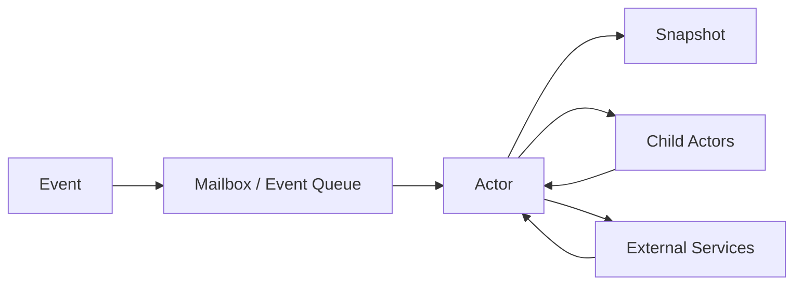
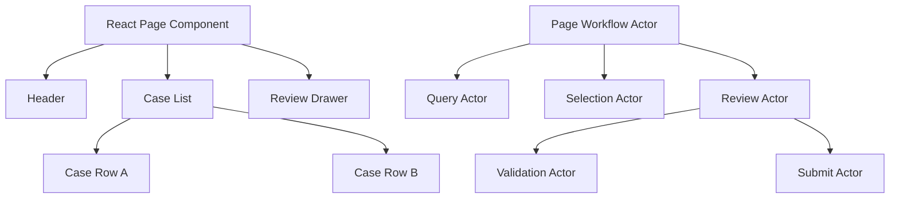
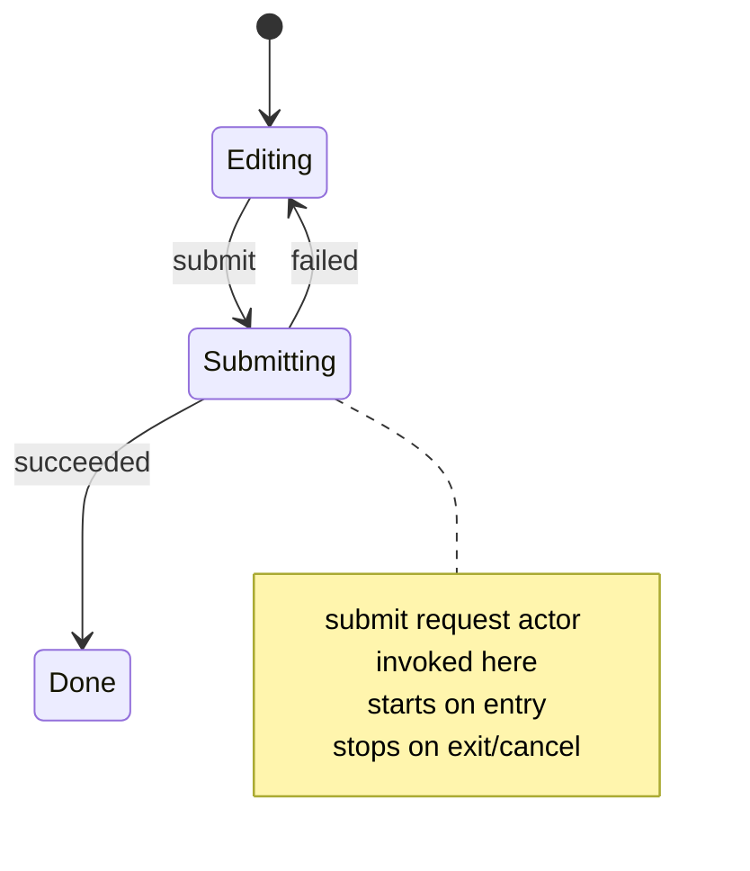
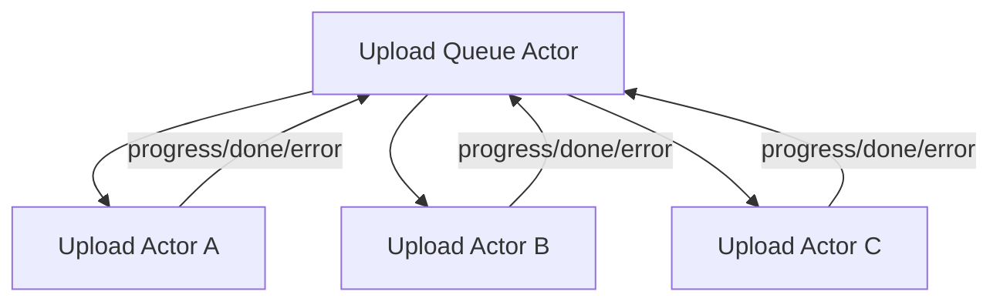
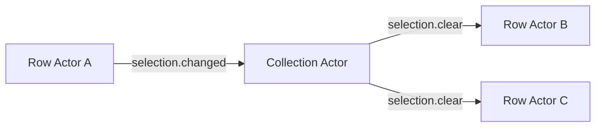
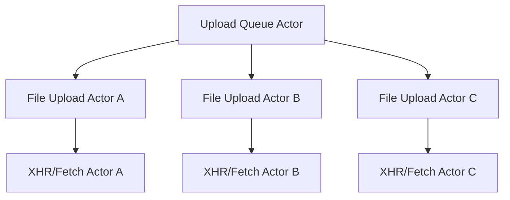

# Part 091 — Actor Model for UI Orchestration

Part sebelumnya membahas XState dengan React. Sekarang kita zoom out: **actor model sebagai cara mendesain orchestration**, bahkan sebelum memilih XState, Zustand, reducer, atau custom store.

Actor model berguna ketika satu UI bukan lagi sekadar kumpulan component, tetapi kumpulan proses kecil yang:

- punya state sendiri;
- menerima event;
- mengirim event;
- hidup dan mati pada lifecycle tertentu;
- menjalankan async work;
- bisa gagal, dibatalkan, retry, atau dikompensasi;
- butuh koordinasi tanpa membuat satu global store raksasa.

Contoh nyata:

```txt
case management screen
multi-file upload
multi-step onboarding
approval workflow
bulk operation dashboard
notification center
chat / inbox
background sync panel
wizard dengan autosave
modal stack dengan confirm workflow
long-running import/export job monitor
```

Jika semua itu diletakkan di satu component parent dengan banyak `useState`, hasilnya biasanya bukan “simple React”. Hasilnya adalah **distributed workflow tanpa model eksplisit**.

Actor model memberi struktur.

---

## 1. Actor Model dalam Bahasa UI

Dalam konteks UI, actor adalah unit perilaku yang:

```txt
owns state
receives events
updates itself through legal transitions
may emit snapshots
may send events to other actors
may start/stop child actors
may run async work through invoked/spawned actors
```

Actor bukan harus thread. Actor bukan harus backend process. Dalam frontend, actor sering hanya object runtime yang menjaga state + event protocol.

Mental model:



React component membaca snapshot actor dan mengirim event.

```txt
React component:
  snapshot -> render
  user action -> send(event)

Actor:
  event -> transition
  transition -> next snapshot
  transition -> effects/child actors/messages
```

Yang penting: React tidak perlu tahu semua detail internal actor.

---

## 2. React Tree Bukan Actor Tree

Kesalahan umum: menganggap component tree otomatis sama dengan behavior tree.

Tidak selalu.

Component tree adalah struktur rendering.

Actor tree adalah struktur lifecycle perilaku.



Kadang satu actor dipakai oleh banyak component.

Kadang satu component menampilkan snapshot dari beberapa actor.

Kadang actor hidup lebih lama daripada component tertentu.

Kadang actor harus mati saat route berubah.

Karena itu, pertanyaan desainnya bukan:

```txt
Component mana yang butuh state ini?
```

Tetapi:

```txt
Proses apa yang memiliki state ini?
Kapan proses ini dimulai?
Kapan proses ini selesai?
Siapa yang boleh mengirim event ke proses ini?
Snapshot apa yang boleh dibaca UI?
Apa yang terjadi saat proses gagal, dibatalkan, atau ditinggalkan?
```

---

## 3. Kapan Actor Model Layak Dipakai?

Actor model bukan default untuk semua state.

Gunakan actor model ketika ada **process identity**.

Sinyal kuat:

```txt
1. Ada lifecycle jelas:
   idle -> editing -> validating -> submitting -> succeeded/failed

2. Ada banyak event legal/ilegal:
   submit hanya legal jika valid
   retry hanya legal setelah failed
   cancel hanya legal saat pending

3. Ada async work yang perlu cancellation atau request identity.

4. Ada banyak instance proses sejenis:
   upload file A/B/C masing-masing punya progress dan failure.

5. Ada parent-child workflow:
   dashboard actor mengelola banyak row actors.

6. Ada workflow yang perlu observability:
   audit trail, breadcrumb, state transition logging.

7. Ada risiko impossible state:
   isSubmitting true tapi submitResult juga null dan error lama masih tampil.
```

Tidak perlu actor model untuk:

```txt
input lokal sederhana
boolean toggle lokal
computed derived value
view-only formatting
state ephemeral yang tidak punya lifecycle kompleks
```

Rule praktis:

```txt
Jika kamu bisa menjelaskan state dengan satu value dan dua event, pakai useState.
Jika kamu butuh invariant beberapa field, pakai reducer.
Jika kamu butuh lifecycle process dengan event legal/ilegal, pertimbangkan machine.
Jika kamu butuh banyak process instance yang hidup/mati dinamis, pertimbangkan actor model.
```

---

## 4. Actor Boundary

Actor boundary adalah kontrak.

Satu actor harus jelas dalam enam hal:

```txt
1. Ownership
   State apa yang dimiliki actor?

2. Events
   Event apa yang diterima?

3. Snapshot
   Data apa yang diekspos untuk UI/actor lain?

4. Commands/effects
   External work apa yang boleh dijalankan?

5. Lifecycle
   Kapan actor dibuat, dihentikan, reset, atau diganti?

6. Supervision
   Siapa yang menangani failure child actor?
```

Contoh actor boundary buruk:

```ts
send({ type: 'SET_ANYTHING', key: 'status', value: 'done' });
```

Ini bukan event protocol. Ini remote setter.

Actor boundary baik:

```ts
type UploadEvent =
  | { type: 'file.selected'; file: File }
  | { type: 'upload.requested' }
  | { type: 'upload.progress'; loaded: number; total: number }
  | { type: 'upload.succeeded'; assetId: string }
  | { type: 'upload.failed'; reason: string }
  | { type: 'upload.cancelled' }
  | { type: 'retry.requested' };
```

Event menjelaskan kejadian/intensi, bukan field mutation.

---

## 5. Actor Snapshot Harus Read Model, Bukan Internal Memory Dump

Actor snapshot yang diekspos ke UI sebaiknya berupa read model.

Buruk:

```ts
type UploadSnapshot = {
  rawMachineState: unknown;
  mutableContext: any;
  internalQueue: unknown[];
  abortController: AbortController | null;
};
```

Lebih baik:

```ts
type UploadViewSnapshot = {
  phase: 'idle' | 'selected' | 'uploading' | 'failed' | 'completed';
  fileName: string | null;
  progressPercent: number;
  canStart: boolean;
  canCancel: boolean;
  canRetry: boolean;
  errorMessage: string | null;
  assetId: string | null;
};
```

UI membutuhkan kemampuan menjawab:

```txt
Apa yang harus ditampilkan?
Tombol mana yang enabled?
Pesan apa yang muncul?
Event apa yang bisa dikirim sekarang?
```

UI tidak membutuhkan semua internal detail actor.

---

## 6. Actor Types dalam React Application

Tidak semua actor sama. Klasifikasi ini membantu menentukan lifecycle dan boundary.

### 6.1 Workflow Actor

Mengelola proses bisnis/UI yang punya fase legal.

```txt
review decision
multi-step form
bulk approval
checkout
file import
```

State biasanya finite:

```txt
idle -> editing -> validating -> submitting -> success/error
```

### 6.2 Entity Actor

Mengelola satu instance entity aktif.

```txt
row actor for file upload
case actor for expanded case row
chat thread actor
notification actor
```

Cocok ketika banyak instance berjalan paralel.

### 6.3 Collection Actor

Mengelola daftar actor/entity.

```txt
upload queue actor
case selection actor
task board actor
```

Tugasnya bukan menyimpan semua detail child, tetapi mengelola registry, selection, aggregation, dan routing event.

### 6.4 Service Actor

Membungkus external system.

```txt
websocket actor
broadcast-channel actor
timer actor
online-status actor
analytics actor
```

Ini biasanya capability/process actor, bukan UI state utama.

### 6.5 Overlay Actor

Mengelola modal/drawer/toast/confirmation.

```txt
modal stack actor
toast queue actor
command palette actor
```

### 6.6 Form Actor

Mengelola form lifecycle.

```txt
draft
validation
touched/dirty
server error mapping
autosave
submit
resume
```

Form actor tidak selalu perlu XState. Bisa reducer. Tetapi saat multi-step + async validation + autosave + branching, actor model sangat membantu.

---

## 7. Invoke vs Spawn

Dalam XState, dua konsep penting:

```txt
invoke:
  actor hidup karena parent sedang berada di state tertentu
  actor berhenti ketika state itu keluar
  cocok untuk finite/known async work

spawn:
  actor dibuat secara dinamis
  actor bisa hidup sampai dihentikan eksplisit/lifecycle parent selesai
  cocok untuk jumlah actor yang dinamis/unknown
```

Diagram:



Untuk spawned actor:



Gunakan invoke untuk:

```txt
load current case
submit current form
validate current step
wait for timeout
listen while state active
```

Gunakan spawn untuk:

```txt
one actor per uploaded file
one actor per chat thread
one actor per active job
one actor per editable row
one actor per background task
```

Anti-pattern:

```txt
Memakai global spawned actor untuk semua hal hanya agar bisa diakses dari mana saja.
```

Itu biasanya bukan actor model. Itu global mutable service yang disamarkan.

---

## 8. Parent-Child Actor Communication

Actor communication harus explicit.

Ada beberapa bentuk:

```txt
parent sends command/event to child
child emits event/result to parent
parent reads child snapshot
parent aggregates child state
sibling communication lewat parent mediator
```

Jangan desain sibling actor saling tahu terlalu banyak.

Buruk:

```txt
RowActor A -> RowActor B -> RowActor C
```

Lebih sehat:

```txt
RowActor A -> ParentActor -> RowActor B
```



Parent bertugas sebagai coordinator.

Child bertugas sebagai isolated process.

---

## 9. Build from Scratch: Minimal Actor Runtime

Sebelum XState, pahami runtime kecil ini.

```ts
type Listener<TSnapshot> = (snapshot: TSnapshot) => void;

type Actor<TEvent, TSnapshot> = {
  send(event: TEvent): void;
  getSnapshot(): TSnapshot;
  subscribe(listener: Listener<TSnapshot>): () => void;
  stop(): void;
};
```

Actor minimal:

```ts
function createActor<TEvent, TSnapshot>(options: {
  initialSnapshot: TSnapshot;
  transition: (snapshot: TSnapshot, event: TEvent) => TSnapshot;
}): Actor<TEvent, TSnapshot> {
  let snapshot = options.initialSnapshot;
  let stopped = false;
  const listeners = new Set<Listener<TSnapshot>>();

  function emit() {
    for (const listener of listeners) {
      listener(snapshot);
    }
  }

  return {
    send(event) {
      if (stopped) return;
      const next = options.transition(snapshot, event);
      if (Object.is(next, snapshot)) return;
      snapshot = next;
      emit();
    },
    getSnapshot() {
      return snapshot;
    },
    subscribe(listener) {
      if (stopped) return () => {};
      listeners.add(listener);
      return () => listeners.delete(listener);
    },
    stop() {
      stopped = true;
      listeners.clear();
    },
  };
}
```

React adapter:

```ts
import { useSyncExternalStore } from 'react';

function useActorSnapshot<TEvent, TSnapshot>(actor: Actor<TEvent, TSnapshot>) {
  return useSyncExternalStore(
    actor.subscribe,
    actor.getSnapshot,
    actor.getSnapshot,
  );
}
```

Component:

```tsx
type CounterEvent =
  | { type: 'increment' }
  | { type: 'decrement' };

type CounterSnapshot = {
  count: number;
  canDecrement: boolean;
};

const counterActor = createActor<CounterEvent, CounterSnapshot>({
  initialSnapshot: { count: 0, canDecrement: false },
  transition(snapshot, event) {
    switch (event.type) {
      case 'increment': {
        const count = snapshot.count + 1;
        return { count, canDecrement: count > 0 };
      }
      case 'decrement': {
        const count = Math.max(0, snapshot.count - 1);
        return { count, canDecrement: count > 0 };
      }
    }
  },
});

function CounterView() {
  const snapshot = useActorSnapshot(counterActor);

  return (
    <section>
      <p>{snapshot.count}</p>
      <button onClick={() => counterActor.send({ type: 'decrement' })} disabled={!snapshot.canDecrement}>
        -
      </button>
      <button onClick={() => counterActor.send({ type: 'increment' })}>
        +
      </button>
    </section>
  );
}
```

Ini belum punya child actor, async, queue, supervision, atau cancellation. Tetapi kontraknya sudah terlihat:

```txt
send event
read snapshot
subscribe snapshot
stop actor
```

---

## 10. Store vs Actor

External store dan actor terlihat mirip, tetapi mindset-nya berbeda.

```txt
Store:
  data container + update functions
  focus: current data and selectors

Actor:
  behavior process + event protocol
  focus: legal transitions, lifecycle, messages, child actors
```

Perbandingan:

| Pertanyaan | Store | Actor |
|---|---|---|
| Apa pusat desain? | State shape | Event protocol + lifecycle |
| Cocok untuk | Shared client state | Workflow/process state |
| Update | Set/dispatch action | Send event |
| Async | Middleware/action/query | Invoked/spawned actor |
| Banyak instance dinamis | Bisa, tapi manual | Natural |
| Illegal state prevention | Reducer/invariant | State machine/transition protocol |
| Observability | Action log | Event + transition log |

Zustand/Redux bisa menampung workflow, tetapi actor model memaksa kamu mendesain lifecycle dan event legality lebih eksplisit.

---

## 11. Example: Multi-File Upload as Actor System

Masalah:

```txt
User memilih banyak file.
Setiap file punya progress sendiri.
File bisa cancel/retry sendiri.
Queue punya aggregate progress.
Beberapa file boleh upload paralel, tapi maksimal 3.
Jika route ditinggalkan, active upload harus cancel/confirm.
```

Jika semua state ada di parent:

```ts
type UploadItem = {
  id: string;
  file: File;
  status: 'queued' | 'uploading' | 'failed' | 'done';
  progress: number;
  error?: string;
};
```

Ini masih oke untuk versi kecil.

Tetapi ketika setiap file punya cancellation, retry, backoff, chunking, checksum, dan server reconciliation, satu array state akan menjadi kompleks.

Actor decomposition:



Queue actor owns:

```txt
file actor registry
concurrency limit
aggregate progress
bulk cancel
bulk retry
which files are active
```

File actor owns:

```txt
selected file
upload phase
progress
abort controller/request id
retry count
final asset id
per-file error
```

This prevents a single parent reducer from knowing every tiny lifecycle detail.

---

## 12. Event Protocol untuk Upload System

Queue events:

```ts
type UploadQueueEvent =
  | { type: 'files.added'; files: File[] }
  | { type: 'file.remove.requested'; fileId: string }
  | { type: 'file.start.requested'; fileId: string }
  | { type: 'file.cancel.requested'; fileId: string }
  | { type: 'file.retry.requested'; fileId: string }
  | { type: 'file.progressed'; fileId: string; loaded: number; total: number }
  | { type: 'file.completed'; fileId: string; assetId: string }
  | { type: 'file.failed'; fileId: string; reason: string }
  | { type: 'queue.cancelAll.requested' };
```

File actor events:

```ts
type FileUploadEvent =
  | { type: 'start' }
  | { type: 'progress'; loaded: number; total: number }
  | { type: 'complete'; assetId: string }
  | { type: 'fail'; reason: string }
  | { type: 'cancel' }
  | { type: 'retry' };
```

Notice the direction:

```txt
UI event -> Queue actor
Queue actor -> child file actor
Child file actor -> Queue actor result/aggregate event
Queue actor snapshot -> UI
```

The UI does not talk randomly to any actor unless that is a deliberate public API.

---

## 13. XState Sketch: Spawn Dynamic File Actors

The exact machine shape depends on your upload adapter, but the principle is:

```ts
import { assign, createMachine, setup } from 'xstate';

type FileRef = unknown; // ActorRef type omitted for readability.

type QueueContext = {
  files: Record<string, FileRef>;
  order: string[];
  maxParallel: number;
};

const fileUploadMachine = setup({
  types: {} as {
    context: {
      id: string;
      file: File;
      progress: number;
      assetId: string | null;
      error: string | null;
    };
    events:
      | { type: 'start' }
      | { type: 'progress'; loaded: number; total: number }
      | { type: 'complete'; assetId: string }
      | { type: 'fail'; reason: string }
      | { type: 'cancel' }
      | { type: 'retry' };
  },
}).createMachine({
  initial: 'queued',
  context: ({ input }: any) => ({
    id: input.id,
    file: input.file,
    progress: 0,
    assetId: null,
    error: null,
  }),
  states: {
    queued: {
      on: { start: 'uploading' },
    },
    uploading: {
      on: {
        progress: {
          actions: assign({
            progress: ({ event }) => Math.round((event.loaded / event.total) * 100),
          }),
        },
        complete: {
          target: 'completed',
          actions: assign({ assetId: ({ event }) => event.assetId }),
        },
        fail: {
          target: 'failed',
          actions: assign({ error: ({ event }) => event.reason }),
        },
        cancel: 'cancelled',
      },
    },
    failed: {
      on: { retry: 'queued' },
    },
    completed: { type: 'final' },
    cancelled: { type: 'final' },
  },
});
```

Queue spawning sketch:

```ts
const uploadQueueMachine = setup({
  types: {} as {
    context: QueueContext;
    events:
      | { type: 'files.added'; files: File[] }
      | { type: 'queue.cancelAll.requested' };
  },
}).createMachine({
  context: {
    files: {},
    order: [],
    maxParallel: 3,
  },
  on: {
    'files.added': {
      actions: assign(({ context, event, spawn }) => {
        const nextFiles = { ...context.files };
        const nextOrder = [...context.order];

        for (const file of event.files) {
          const id = crypto.randomUUID();
          const ref = spawn(fileUploadMachine, {
            id: `upload-${id}`,
            input: { id, file },
          });

          nextFiles[id] = ref;
          nextOrder.push(id);
        }

        return {
          files: nextFiles,
          order: nextOrder,
        };
      }),
    },
  },
});
```

Production note:

```txt
Keep child refs opaque to most UI.
Expose derived list snapshots through selector/hooks.
Do not let random components mutate child actor internals.
```

---

## 14. Actor Registry Pattern

When dynamic actor count grows, use a registry.

```ts
type ActorRegistry<TRef> = {
  byId: Record<string, TRef>;
  order: string[];
};
```

Operations:

```txt
register(id, ref)
unregister(id)
sendTo(id, event)
broadcast(event)
select(id)
aggregate snapshots
stop removed actors
```

Avoid storing derived aggregates as permanent state unless they are costly or represent a real snapshot from backend.

Instead derive:

```ts
type UploadQueueView = {
  total: number;
  completed: number;
  failed: number;
  uploading: number;
  aggregateProgress: number;
  canCancelAll: boolean;
  canRetryFailed: boolean;
};
```

Potential problem:

```txt
Actor snapshots are external data.
If parent derives aggregate from child snapshots, it needs a subscription strategy.
```

Options:

```txt
1. Child sends result/progress events to parent.
2. Parent subscribes to children and updates aggregate.
3. UI subscribes to each child actor row separately.
4. External store tracks actor snapshot projection.
```

For large lists, prefer row-level subscription.

---

## 15. Actor Lifecycle Placement in React

Where should actor be created?

### 15.1 Component-local actor

Use when actor belongs to a component instance.

```tsx
function UploadWidget() {
  const actorRef = useMemo(() => createActor(uploadQueueMachine).start(), []);

  useEffect(() => {
    return () => actorRef.stop();
  }, [actorRef]);

  // ...
}
```

Caveat: use official React adapter when using XState in production. Manual actor lifecycle must be Strict Mode safe.

### 15.2 Provider actor

Use when subtree shares workflow actor.

```tsx
const UploadActorContext = createContext<UploadActorRef | null>(null);

function UploadProvider({ children }: { children: React.ReactNode }) {
  const [snapshot, send, actorRef] = useMachine(uploadQueueMachine);

  return (
    <UploadActorContext.Provider value={actorRef}>
      {children}
    </UploadActorContext.Provider>
  );
}
```

### 15.3 Route-level actor

Use when workflow belongs to route lifetime.

```txt
/cases/:caseId/review
  ReviewRouteActor exists while route is active
```

### 15.4 Application capability actor

Use for services that naturally live application-wide:

```txt
websocket connection actor
online status actor
feature flag stream actor
notification queue actor
```

Do not place domain workflow actors at app root unless their lifecycle truly is app-wide.

---

## 16. Actor Supervision

Supervision means: who handles child failure?

In UI, supervision often means:

```txt
child upload failed -> queue marks failed count
form validation actor failed -> form actor displays error
websocket actor disconnected -> app status actor schedules reconnect
modal child rejected -> modal manager resolves promise with cancel
```

Bad supervision:

```txt
child throws, UI silently stuck pending
```

Better:

```txt
child failure is converted into explicit event
parent decides retry/cancel/escalate
UI snapshot exposes recovery options
```

Supervisor responsibilities:

```txt
retry policy
backoff
cancellation
cleanup
aggregate error reporting
user notification
audit/breadcrumb
```

---

## 17. Cancellation and Abandonment

UI workflows are frequently abandoned:

```txt
route changes
modal closes
tab closes
user cancels
new request supersedes old request
permission changes
entity is deleted remotely
```

Actor model should make abandonment explicit.

Events:

```ts
type WorkflowEvent =
  | { type: 'route.left' }
  | { type: 'cancel.requested' }
  | { type: 'entity.deleted.remotely' }
  | { type: 'request.superseded'; requestId: string };
```

Rules:

```txt
A pending actor must know how to stop.
A stopped actor must not emit stale success into new workflow.
A cancelled actor must produce a known snapshot or final event.
```

If using fetch, cancellation may use `AbortController`.

If using XState invoke, leaving the invoking state should stop the invoked actor. If the underlying promise/fetch is not abortable, you still need stale result guards at the application boundary.

---

## 18. Actor Observability

Actor model gives natural observability points:

```txt
event received
transition taken
state entered/exited
child actor spawned/stopped
command started
command succeeded/failed
retry scheduled
cancellation requested
```

Log event protocols, not random setter calls.

Good log:

```json
{
  "actor": "review-case-CASE-123",
  "event": "submit.failed",
  "from": "submitting",
  "to": "failed",
  "reasonCode": "POLICY_VIOLATION"
}
```

Bad log:

```json
{
  "field": "isLoading",
  "value": false
}
```

Why?

Because event/transition logs explain behavior.

Field mutation logs explain only symptoms.

---

## 19. Testing Actor Systems

Test actor logic without React first.

Test categories:

```txt
transition tests
illegal event tests
guard tests
invoke success/failure tests
spawn/stop lifecycle tests
parent-child communication tests
supervision tests
cancellation tests
```

Example transition test:

```ts
it('does not submit invalid draft', () => {
  const actor = createActor(reviewMachine, {
    input: { caseId: 'CASE-1' },
  }).start();

  actor.send({ type: 'submit.requested' });

  expect(actor.getSnapshot().matches('editing')).toBe(true);
  expect(actor.getSnapshot().context.validationErrors.length).toBeGreaterThan(0);
});
```

Parent-child test:

```ts
it('marks queue completed when all child uploads complete', () => {
  const queue = createActor(uploadQueueMachine).start();

  queue.send({ type: 'files.added', files: [fileA, fileB] });
  queue.send({ type: 'file.completed', fileId: 'a', assetId: 'A1' });
  queue.send({ type: 'file.completed', fileId: 'b', assetId: 'B1' });

  expect(queue.getSnapshot().context.completedCount).toBe(2);
  expect(queue.getSnapshot().matches('completed')).toBe(true);
});
```

React tests should verify wiring:

```txt
button sends correct event
snapshot renders correct state
disabled states match canX flags
focus/error announcement works
```

Do not rely only on component tests for actor transition correctness.

---

## 20. Actor Model Failure Modes

### 20.1 Actor as Global Store

Symptom:

```txt
one root actor receives every event in the app
all components import same actorRef
no clear lifecycle
```

Fix:

```txt
split by process boundary
scope actor to route/subtree
keep capability actors separate from workflow actors
```

### 20.2 Event Soup

Symptom:

```ts
send({ type: 'UPDATE', payload: any });
send({ type: 'SET_STATE', value: any });
```

Fix:

```txt
model domain/UI events explicitly
name events as facts/intents
make illegal events impossible or ignored by state
```

### 20.3 Child Actor Leak

Symptom:

```txt
spawned actors remain after row removed or route changed
background work continues after UI abandoned
```

Fix:

```txt
define unregister/stop lifecycle
prefer invoke when lifecycle tied to state
stop spawned actor on removal/finalization
write tests for cleanup
```

### 20.4 Parent Knows Too Much

Symptom:

```txt
parent directly mutates child context conceptually
parent has switch statements for every child internal state
```

Fix:

```txt
child exposes compact snapshot
parent receives meaningful child events
hide child internals behind protocol
```

### 20.5 Sibling Actor Coupling

Symptom:

```txt
actors directly know each other IDs and protocols
changing one actor breaks another actor
```

Fix:

```txt
route sibling communication through parent/coordinator
use event contracts
avoid arbitrary actor imports
```

### 20.6 UI Reads Too Much

Symptom:

```txt
component rerenders on every actor micro-change
large dashboard becomes sluggish
```

Fix:

```txt
selector subscription
row-level actor subscription
derived read models
stable snapshots
memoized components
```

### 20.7 Command Hidden in Render

Symptom:

```tsx
if (snapshot.matches('ready')) {
  actor.send({ type: 'start' });
}
```

Fix:

```txt
commands belong in event handlers/effects/machine transitions
render must remain pure
```

---

## 21. Decision Matrix

| Problem | Better Fit |
|---|---|
| Single local input | `useState` |
| Several related local fields | `useReducer` |
| Shared stable dependency | Context |
| Shared client state with selectors | External store |
| Server cache/freshness | TanStack Query / RTK Query |
| Workflow with legal transitions | State machine |
| Many dynamic workflow instances | Actor model |
| Long-running external connection | Service actor |
| Modal/toast command system | Capability/overlay actor |

Actor model is not “more advanced state”. It is **process architecture**.

---

## 22. Production Checklist

Before introducing an actor system, answer:

```txt
[ ] What process does this actor represent?
[ ] What state does it own exclusively?
[ ] What events can it receive?
[ ] Which events are legal only in certain states?
[ ] What snapshot does UI read?
[ ] Who creates the actor?
[ ] Who stops the actor?
[ ] Can child actors leak?
[ ] How is cancellation handled?
[ ] How are failures supervised?
[ ] How is state observed/logged?
[ ] How are transitions tested without React?
[ ] Is this truly actor-worthy, or just local/reducer state?
```

---

## 23. Internal Engineering Heuristic

A large React application becomes hard not because it has many components.

It becomes hard because it has many **implicit processes**.

The actor model makes process boundaries explicit.

```txt
Component tree answers:
  What renders where?

State topology answers:
  Which state lives where?

Actor model answers:
  Which processes exist, how do they communicate, and how do they die?
```

That last question matters in production.

Most severe UI bugs are not rendering bugs. They are lifecycle bugs:

```txt
late response overwrites newer state
background task outlives screen
modal resolves twice
retry runs after cancel
row state belongs to wrong item after reorder
wizard step submits stale draft
permission changes while command is pending
```

Actor model gives those bugs a vocabulary.

---

## 24. References

- React documentation: `useReducer` moves state update logic out of event handlers into a reducer function.
- React documentation: `useSyncExternalStore` defines the subscription/snapshot contract for external stores.
- XState/Stately documentation: actors can receive events, send events, spawn/invoke child actors, emit snapshots, and output values.
- XState/Stately documentation: invoked actors are tied to state lifecycle; spawned actors are suitable for dynamic/unknown actor counts.
- XState/Stately documentation: `spawnChild` or the `spawn` helper inside `assign` are the v5 patterns for spawning actors.
