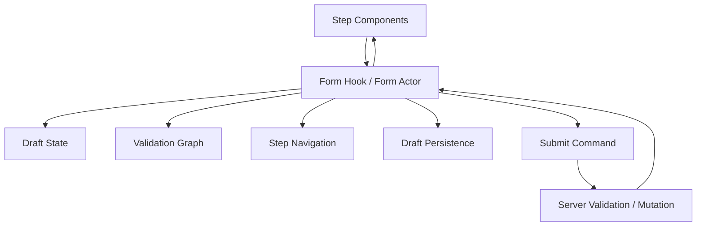
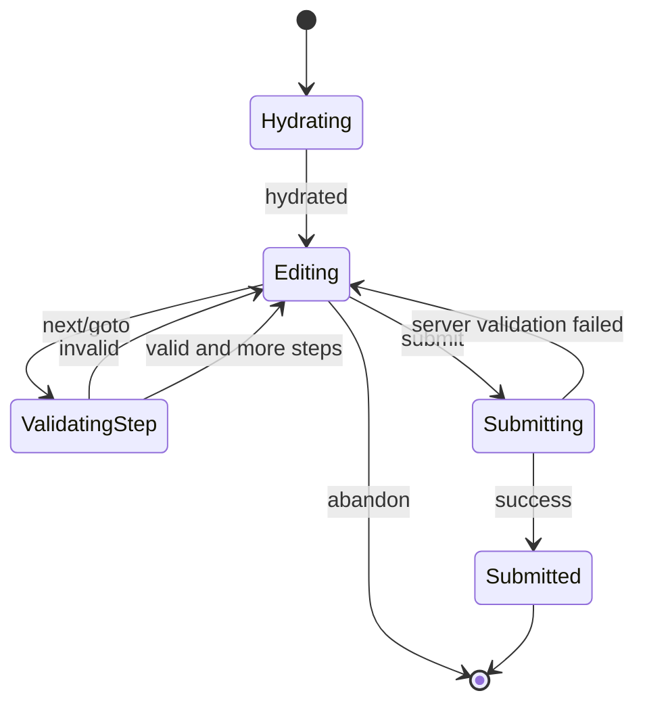
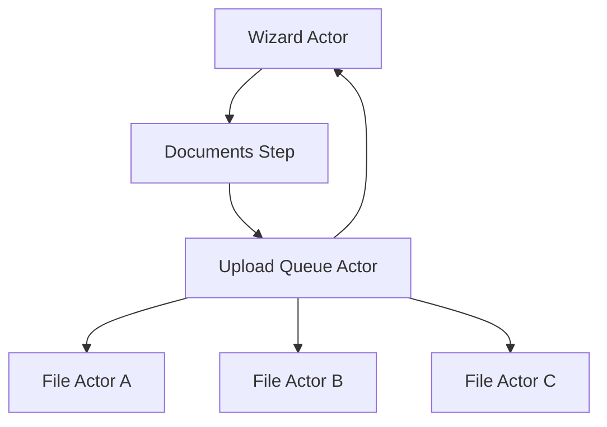

# Part 092 — Orchestrating Multi-Step Forms

Multi-step form adalah salah satu tempat paling cepat React codebase berubah kacau.

Bukan karena form sulit secara visual.

Tetapi karena multi-step form menyatukan banyak jenis state:

```txt
field value
field touched/dirty
client validation
server validation
step validity
step navigation
branching path
draft persistence
autosave
submission
permission/precondition
async lookup
optimistic feedback
error recovery
resume after refresh
```

Jika semua itu dikelola dengan `useState` tersebar di setiap step component, bug yang muncul biasanya seperti ini:

```txt
Step 3 bisa dibuka padahal Step 2 belum valid.
Error server hilang ketika field lain berubah.
Back button mereset field yang tidak seharusnya reset.
Autosave menimpa draft baru dengan response lama.
Submit double-click membuat request ganda.
Conditional field masih terkirim walaupun cabangnya tidak aktif.
User refresh browser dan draft corrupt.
Validation async selesai setelah user pindah step.
Permission berubah ketika form sedang pending.
```

Multi-step form harus dipikirkan sebagai **workflow**, bukan kumpulan input.

---

## 1. Mental Model

Satu form production-grade memiliki beberapa layer:



Layer yang berbeda punya lifecycle berbeda.

```txt
Field UI:
  ephemeral visual state, focus, local formatting

Draft state:
  user-entered values, possibly persisted

Validation state:
  derived/client/server errors, field/step/global

Navigation state:
  active step, completed steps, allowed transitions

Submission state:
  pending/succeeded/failed, request identity, duplicate prevention

Persistence state:
  draft version, hydration, migration, cleanup
```

Jangan campur semua menjadi satu object tanpa kontrak.

---

## 2. Step Workflow, Bukan Step Index

Anti-pattern:

```ts
const [step, setStep] = useState(0);
```

Ini tidak salah untuk form sederhana. Tetapi untuk workflow besar, angka step tidak cukup.

Pertanyaan yang hilang:

```txt
Apakah step ini legal untuk dibuka?
Apakah user datang dari forward navigation atau back navigation?
Apakah step ini valid?
Apakah ada async validation pending?
Apakah step berikutnya conditional?
Apakah draft sudah disimpan?
Apakah step ini bisa dilewati?
```

Gunakan state eksplisit.

```ts
type StepId =
  | 'applicant'
  | 'employment'
  | 'documents'
  | 'review'
  | 'submit';

type StepStatus =
  | 'locked'
  | 'available'
  | 'active'
  | 'completed'
  | 'invalid'
  | 'pending';

type FormPhase =
  | 'hydrating'
  | 'editing'
  | 'validatingStep'
  | 'autosaving'
  | 'submitting'
  | 'submitted'
  | 'failed';
```

Now the system can express reality.

---

## 3. State Topology untuk Multi-Step Form

| State | Owner | Persist? | Derived? | Notes |
|---|---|---:|---:|---|
| Active step | Form workflow | Maybe | No | Often URL if shareable/resumable |
| Field value | Form draft | Yes/Maybe | No | Source of truth for input data |
| Field dirty/touched | Form/UI layer | Maybe | No | Often not persisted unless UX requires |
| Field error | Validation layer | Maybe | Partly | Server errors may be source state |
| Step validity | Validation graph | No | Yes | Derived from fields/errors/rules |
| Completed steps | Workflow | Maybe | Partly | Can be derived but often needs history |
| Branch path | Workflow/rules | Maybe | Derived from draft | Must clear inactive branch data intentionally |
| Autosave status | Persistence actor | No | No | Pending/succeeded/failed |
| Submit status | Submission actor | No | No | Request identity required |
| Server result | Server state/cache | Maybe | No | Usually belongs to mutation/query cache |

Important distinction:

```txt
field value = source state
step validity = derived state
server error = external feedback state
step completion = workflow state
```

Duplicating those without rules creates drift.

---

## 4. Form Events

Use events, not random setter calls.

```ts
type FormEvent =
  | { type: 'form.hydrated'; draft: Draft; version: number }
  | { type: 'field.changed'; field: FieldPath; value: unknown }
  | { type: 'field.blurred'; field: FieldPath }
  | { type: 'step.next.requested' }
  | { type: 'step.previous.requested' }
  | { type: 'step.goto.requested'; step: StepId }
  | { type: 'step.validation.succeeded'; step: StepId }
  | { type: 'step.validation.failed'; step: StepId; errors: ValidationError[] }
  | { type: 'draft.save.requested' }
  | { type: 'draft.save.succeeded'; version: number }
  | { type: 'draft.save.failed'; reason: string }
  | { type: 'form.submit.requested' }
  | { type: 'form.submit.succeeded'; applicationId: string }
  | { type: 'form.submit.failed'; errors: ValidationError[] }
  | { type: 'form.abandon.requested' }
  | { type: 'form.reset.requested' };
```

This event protocol lets you inspect behavior.

Without this protocol, multi-step form logic becomes hidden in dozens of callbacks.

---

## 5. Basic Step Machine

A minimal workflow can be modeled as:



Reducer version:

```ts
type WizardState = {
  phase: FormPhase;
  activeStep: StepId;
  draft: Draft;
  touched: Partial<Record<FieldPath, boolean>>;
  clientErrors: ValidationError[];
  serverErrors: ValidationError[];
  completedSteps: StepId[];
  requestId: string | null;
};

function wizardReducer(state: WizardState, event: FormEvent): WizardState {
  switch (event.type) {
    case 'field.changed': {
      return {
        ...state,
        draft: setDraftValue(state.draft, event.field, event.value),
        serverErrors: clearServerErrorsForField(state.serverErrors, event.field),
      };
    }

    case 'field.blurred': {
      return {
        ...state,
        touched: { ...state.touched, [event.field]: true },
      };
    }

    case 'step.validation.failed': {
      return {
        ...state,
        phase: 'editing',
        clientErrors: event.errors,
      };
    }

    case 'step.validation.succeeded': {
      const nextStep = getNextStep(state.activeStep, state.draft);
      return {
        ...state,
        phase: 'editing',
        activeStep: nextStep,
        completedSteps: addUnique(state.completedSteps, state.activeStep),
        clientErrors: [],
      };
    }

    default:
      return state;
  }
}
```

For small forms, reducer is enough.

For branching + async validation + autosave + submit + resume, a machine/actor becomes easier to reason about.

---

## 6. Field Registry Pattern

In a large dynamic form, fields may mount/unmount depending on step and branch.

A field registry tracks metadata, not just values.

```ts
type FieldMeta = {
  path: FieldPath;
  step: StepId;
  label: string;
  required: boolean;
  activeWhen?: (draft: Draft) => boolean;
  validate?: (value: unknown, draft: Draft) => ValidationError[];
  normalize?: (value: unknown) => unknown;
  serialize?: (value: unknown) => unknown;
};

type FieldRegistry = Record<FieldPath, FieldMeta>;
```

Why registry helps:

```txt
validation can iterate active fields
review screen can render summary consistently
inactive branch fields can be excluded from payload
field errors can map to labels
step validity can be derived
accessibility IDs can be generated consistently
```

But registry must not become a giant magic schema that replaces good component design.

Use schema for metadata and rules.

Use components for rendering and interaction.

---

## 7. Validation Graph

Validation is not one thing.

```txt
field-level validation:
  email format
  required field
  min/max length

cross-field validation:
  start date <= end date
  country determines postal code rules
  applicant type determines required documents

step-level validation:
  all required fields in step valid
  at least one contact method present

workflow-level validation:
  all steps complete
  user has accepted declarations
  terms version current

server validation:
  uniqueness
  permission
  policy/rule engine
  stale entity version
```

Model errors with enough structure.

```ts
type ValidationError = {
  scope: 'field' | 'step' | 'form' | 'server';
  field?: FieldPath;
  step?: StepId;
  code: string;
  message: string;
  blocking: boolean;
};
```

Avoid plain string arrays for serious forms.

You need to know:

```txt
Which field owns this error?
Which step should show badge?
Is it blocking submit?
Should it clear when field changes?
Is it client or server error?
```

---

## 8. Server Validation Is Not Client Validation

Client validation improves UX, but cannot be trusted as authority.

Server validation owns:

```txt
authorization
uniqueness
business rules
cross-entity constraints
stale version/conflict
regulatory policy
backend-only invariants
```

Client validation owns:

```txt
fast feedback
obvious format checks
required visible fields
step gating UX
reducing unnecessary server calls
```

Server validation errors should map back into form state.

```ts
type SubmitResult =
  | { ok: true; applicationId: string }
  | { ok: false; errors: ValidationError[]; serverVersion?: number };
```

Submission handler:

```ts
async function submitApplication(draft: Draft): Promise<SubmitResult> {
  const response = await fetch('/api/applications', {
    method: 'POST',
    body: JSON.stringify(toSubmissionPayload(draft)),
    headers: { 'content-type': 'application/json' },
  });

  const body = await response.json();

  if (!response.ok) {
    return { ok: false, errors: normalizeServerErrors(body) };
  }

  return { ok: true, applicationId: body.id };
}
```

Do not collapse server validation into generic toast only.

Field-specific server errors should appear at the field.

Form-level server errors should appear near submission summary.

---

## 9. Branching Forms

Branching is where multi-step forms often break.

Example:

```txt
Applicant type:
  individual -> personal details + employment
  company -> company profile + authorized representative
```

Question:

```txt
What happens to inactive branch data?
```

Options:

| Strategy | Behavior | Use Case |
|---|---|---|
| Keep inactive data | User can return without losing input | Friendly UX, draft forms |
| Exclude inactive data from payload | Backend receives only active branch | Most common |
| Clear inactive data immediately | Avoid stale sensitive data | High-risk forms |
| Clear on submit | Preserve UX but ensure clean payload | Balanced |

Make it explicit.

```ts
function toSubmissionPayload(draft: Draft): SubmissionPayload {
  if (draft.applicantType === 'individual') {
    return {
      applicantType: 'individual',
      personal: draft.personal,
      employment: draft.employment,
    };
  }

  return {
    applicantType: 'company',
    company: draft.company,
    representative: draft.representative,
  };
}
```

Do not simply send entire draft object.

That leaks inactive branch state.

---

## 10. Draft Persistence

Persistence is not just `localStorage.setItem`.

A production draft persistence layer needs:

```txt
schema version
migration
validation on read
TTL/retention
user/session scope
encryption/security policy if sensitive
logout cleanup
multi-tab behavior
server sync or local-only policy
conflict handling
```

Draft record:

```ts
type DraftRecord = {
  schemaVersion: 3;
  userId: string;
  formId: string;
  draft: Draft;
  savedAt: string;
  expiresAt: string;
  serverDraftVersion?: number;
};
```

Read boundary:

```ts
function readDraft(key: string): DraftRecord | null {
  const raw = localStorage.getItem(key);
  if (!raw) return null;

  try {
    const parsed = JSON.parse(raw);
    return validateAndMigrateDraft(parsed);
  } catch {
    return null;
  }
}
```

Write boundary:

```ts
function writeDraft(key: string, record: DraftRecord) {
  localStorage.setItem(key, JSON.stringify(record));
}
```

For sensitive/regulatory forms, do not blindly persist personally identifiable data in browser storage. Decide retention, encryption, and cleanup policy explicitly.

---

## 11. Autosave

Autosave is a workflow.

Not this:

```ts
useEffect(() => {
  saveDraft(draft);
}, [draft]);
```

That fires too often and is race-prone.

Better model:

```txt
field.changed -> draft becomes dirty
wait debounce interval
save latest draft with requestId/version
if response older than current version, ignore
if save fails, expose recoverable error
```

Autosave state:

```ts
type AutosaveState = {
  status: 'idle' | 'dirty' | 'saving' | 'saved' | 'failed';
  localVersion: number;
  lastSavedVersion: number;
  lastSavedAt: string | null;
  error: string | null;
};
```

Autosave events:

```ts
type AutosaveEvent =
  | { type: 'draft.changed'; localVersion: number }
  | { type: 'save.started'; requestVersion: number }
  | { type: 'save.succeeded'; requestVersion: number; savedAt: string }
  | { type: 'save.failed'; requestVersion: number; reason: string };
```

Race guard:

```ts
function autosaveReducer(state: AutosaveState, event: AutosaveEvent): AutosaveState {
  switch (event.type) {
    case 'save.succeeded': {
      if (event.requestVersion < state.localVersion) {
        return {
          ...state,
          status: 'dirty',
          lastSavedVersion: event.requestVersion,
          lastSavedAt: event.savedAt,
        };
      }

      return {
        ...state,
        status: 'saved',
        lastSavedVersion: event.requestVersion,
        lastSavedAt: event.savedAt,
        error: null,
      };
    }

    case 'save.failed': {
      if (event.requestVersion < state.localVersion) {
        return state;
      }

      return {
        ...state,
        status: 'failed',
        error: event.reason,
      };
    }

    default:
      return state;
  }
}
```

This prevents stale autosave results from overwriting newer edits.

---

## 12. Step Navigation Rules

Step navigation should not be arbitrary.

Define transition policy:

```ts
type NavigationPolicy = {
  canGoNext(state: WizardState): boolean;
  canGoPrevious(state: WizardState): boolean;
  canGoTo(step: StepId, state: WizardState): boolean;
  getNextStep(current: StepId, draft: Draft): StepId;
  getPreviousStep(current: StepId, draft: Draft): StepId;
};
```

Rules:

```txt
Back navigation usually allowed unless submitting.
Forward navigation usually requires current step validity.
Direct jump to completed step allowed.
Direct jump to locked future step denied.
Branch changes may invalidate future steps.
Submit allowed only from review/submit phase and valid full form.
```

Do not trust UI disabled buttons alone.

The reducer/machine must enforce the same rules.

---

## 13. URL State for Active Step

Should active step be in URL?

Use URL when:

```txt
steps are shareable/bookmarkable
refresh should preserve current step
browser Back/Forward should navigate steps
route guards are needed
support user needs resumability
```

Avoid URL when:

```txt
step contains sensitive branching
step is purely local/modal sub-flow
step cannot be legally opened without hidden session state
```

URL strategy:

```txt
/application/new?step=documents
```

But URL must not be authority alone.

When URL says `step=review`, workflow still checks whether review is legal.

```ts
function resolveRequestedStep(requested: StepId, state: WizardState): StepId {
  if (canGoTo(requested, state)) return requested;
  return firstInvalidOrAvailableStep(state);
}
```

---

## 14. React Hook API for Wizard

Expose a compact API.

```ts
type WizardApi = {
  snapshot: WizardSnapshot;
  fields: {
    getValue(path: FieldPath): unknown;
    setValue(path: FieldPath, value: unknown): void;
    blur(path: FieldPath): void;
    getError(path: FieldPath): ValidationError | null;
  };
  navigation: {
    next(): void;
    previous(): void;
    goTo(step: StepId): void;
  };
  submit(): void;
  reset(): void;
};
```

Snapshot:

```ts
type WizardSnapshot = {
  phase: FormPhase;
  activeStep: StepId;
  steps: Array<{
    id: StepId;
    label: string;
    status: StepStatus;
    errorCount: number;
  }>;
  canGoNext: boolean;
  canGoPrevious: boolean;
  canSubmit: boolean;
  isBusy: boolean;
  submitError: string | null;
  autosave: AutosaveState;
};
```

This prevents step components from poking into entire internal form state.

---

## 15. Component Composition for Multi-Step Form

A clean API can use compound components:

```tsx
<WizardProvider actor={applicationWizardActor}>
  <WizardLayout>
    <WizardSidebar />
    <WizardStep id="applicant">
      <ApplicantStep />
    </WizardStep>
    <WizardStep id="employment">
      <EmploymentStep />
    </WizardStep>
    <WizardStep id="documents">
      <DocumentsStep />
    </WizardStep>
    <WizardStep id="review">
      <ReviewStep />
    </WizardStep>
    <WizardFooter />
  </WizardLayout>
</WizardProvider>
```

Step components use field hooks:

```tsx
function ApplicantStep() {
  const name = useWizardField<string>('applicant.name');
  const email = useWizardField<string>('applicant.email');

  return (
    <section aria-labelledby="applicant-title">
      <h2 id="applicant-title">Applicant</h2>

      <TextField
        label="Name"
        value={name.value ?? ''}
        onChange={name.setValue}
        onBlur={name.blur}
        error={name.error?.message}
      />

      <TextField
        label="Email"
        value={email.value ?? ''}
        onChange={email.setValue}
        onBlur={email.blur}
        error={email.error?.message}
      />
    </section>
  );
}
```

Do not pass the entire form object into every input.

Use field-level subscription where possible.

---

## 16. Field Hook Design

A field hook should expose only field API.

```ts
type FieldApi<T> = {
  value: T;
  setValue(value: T): void;
  blur(): void;
  error: ValidationError | null;
  touched: boolean;
  dirty: boolean;
  required: boolean;
  describedBy: string | undefined;
  invalid: boolean;
};
```

Implementation options:

```txt
small forms:
  useContext + reducer state

medium forms:
  context + selector external store

complex forms:
  actor/store per wizard + field selector subscription

very dynamic forms:
  registry + selector subscription + validation graph
```

Performance rule:

```txt
Changing one field should not rerender the entire form tree unless the screen is small enough that it does not matter.
```

Correctness first. Then profile.

---

## 17. Accessibility Contract

Multi-step forms need accessible structure.

Basics:

```txt
Every input has a label.
Field error is associated with input.
Invalid fields expose invalid state.
Step changes manage focus intentionally.
Errors are summarized after failed submit/step validation.
Keyboard navigation is predictable.
Progress indicator is understandable.
Required fields are communicated.
```

TextField pattern:

```tsx
function TextField(props: {
  id: string;
  label: string;
  value: string;
  onChange(value: string): void;
  onBlur(): void;
  error?: string;
  required?: boolean;
}) {
  const errorId = props.error ? `${props.id}-error` : undefined;

  return (
    <div>
      <label htmlFor={props.id}>{props.label}</label>
      <input
        id={props.id}
        value={props.value}
        required={props.required}
        aria-invalid={props.error ? 'true' : 'false'}
        aria-describedby={errorId}
        onChange={(event) => props.onChange(event.target.value)}
        onBlur={props.onBlur}
      />
      {props.error ? (
        <p id={errorId} role="alert">
          {props.error}
        </p>
      ) : null}
    </div>
  );
}
```

After failed submit, move focus to summary or first invalid field according to UX policy.

```tsx
function ErrorSummary({ errors }: { errors: ValidationError[] }) {
  if (errors.length === 0) return null;

  return (
    <section role="alert" aria-labelledby="error-summary-title" tabIndex={-1}>
      <h2 id="error-summary-title">Please fix the following issues</h2>
      <ul>
        {errors.map((error) => (
          <li key={`${error.field}-${error.code}`}>
            {error.message}
          </li>
        ))}
      </ul>
    </section>
  );
}
```

Accessibility is part of the form contract, not a visual afterthought.

---

## 18. React 19 Form Actions Boundary

React 19 form actions are useful, but they do not remove the need for workflow modeling.

Use Actions for:

```txt
submission command
server validation result
pending state
progressive enhancement depending on framework/runtime
form-level result state
```

Use local workflow/reducer/machine for:

```txt
step navigation
draft state
client validation
branching
field registry
autosave
resume
conditional submit enablement
```

Example:

```tsx
function ApplicationSubmitForm({ wizard }: { wizard: WizardApi }) {
  const [result, submitAction, isPending] = useActionState(
    async (_previous: SubmitResult | null, formData: FormData) => {
      const payload = wizardToPayload(wizard.snapshot, formData);
      return submitApplication(payload);
    },
    null,
  );

  return (
    <form action={submitAction}>
      <ReviewStep />
      <button type="submit" disabled={!wizard.snapshot.canSubmit || isPending}>
        {isPending ? 'Submitting...' : 'Submit'}
      </button>
      {result?.ok === false ? <ErrorSummary errors={result.errors} /> : null}
    </form>
  );
}
```

If your app uses TanStack Query/RTK Query for mutations, use a clear boundary:

```txt
wizard owns draft/workflow
mutation owns server command/cache invalidation
wizard receives mutation result/error as event
```

Do not let mutation state become the whole form workflow.

---

## 19. Optimistic and Pessimistic Submit

Most multi-step forms should be pessimistic on final submit:

```txt
submit -> pending -> server validates -> success/failure
```

Optimistic UI is useful for:

```txt
autosave saved indicator
local draft progress
temporary attachment preview
mark step completed locally before server sync, if reversible
```

Be careful with optimistic final submission in regulated or high-risk forms.

If final submission has legal/business consequences, prefer pessimistic confirmation.

---

## 20. Document Upload Step

Document steps combine form state and file workflow.

Do not put raw upload lifecycle into the main form reducer unless it is tiny.

Better:



Wizard draft stores final attachment references:

```ts
type Draft = {
  documents: Array<{
    type: 'identity' | 'employment' | 'supporting';
    assetId: string;
    fileName: string;
  }>;
};
```

Upload actor owns progress/retry/cancel.

Wizard only receives:

```ts
{ type: 'document.attached'; assetId: string; fileName: string; documentType: DocumentType }
{ type: 'document.removed'; assetId: string }
```

This keeps upload mechanics out of form workflow.

---

## 21. Resume and Recovery

A serious multi-step form should define recovery behavior.

Scenarios:

```txt
refresh page
browser crashes
autosave failed
server draft is newer than local draft
schema changed since draft created
user opens form in two tabs
user loses permission halfway
entity submitted from another session
```

Recovery policies:

| Scenario | Policy |
|---|---|
| Local draft only | hydrate local draft if valid and not expired |
| Server draft newer | prompt user or prefer server depending on product |
| Schema version changed | migrate or discard with explanation |
| Two tabs edit | warn, lock, merge, or last-write-wins with version check |
| Permission lost | move workflow to blocked state |
| Entity already submitted | redirect to read-only result |

Model these as states/events.

```txt
hydrating -> editing
hydrating -> recoveryNeeded
hydrating -> blocked
editing -> blocked
submitting -> submittedElsewhere
```

Do not pretend recovery is an edge case. It is part of workflow lifecycle.

---

## 22. Testing Strategy

Test at multiple levels.

### 22.1 Reducer/Machine Tests

```txt
field.changed updates draft
inactive branch is excluded from payload
next is denied when current step invalid
server field error maps to correct field
stale autosave result is ignored
submit denied when required document missing
```

### 22.2 Validation Tests

```txt
field rules
cross-field rules
branch rules
step validity
server error normalization
```

### 22.3 Component Tests

```txt
field displays label/error
click next validates step
invalid submit focuses summary
back keeps draft
branch toggle changes visible steps
```

### 22.4 Integration Tests

```txt
complete happy path
server validation failure path
autosave recovery path
refresh and resume path
file upload failure/retry path
permission lost path
```

### 22.5 Accessibility Tests

```txt
labels connected
aria-invalid set only when invalid
error text associated with field
focus lands on meaningful target after validation failure
keyboard-only navigation works
```

---

## 23. Failure Modes

### 23.1 Step Index as Authority

Symptom:

```txt
User can open step 4 by changing URL or clicking progress indicator.
```

Fix:

```txt
Model legal navigation.
Resolve requested step through workflow guard.
```

### 23.2 Form State Spread Across Step Components

Symptom:

```txt
Back/forward loses data.
Review screen cannot reliably read full draft.
Validation duplicated per step.
```

Fix:

```txt
Centralize draft ownership in form hook/actor.
Use field hooks for local access.
```

### 23.3 Server Error Lost Too Early

Symptom:

```txt
Changing unrelated field clears all server errors.
```

Fix:

```txt
Clear field-specific server error only when that field changes.
Keep form-level server error until next submit or explicit dismiss.
```

### 23.4 Inactive Branch Payload Leak

Symptom:

```txt
Company-only data is submitted when applicant type is individual.
```

Fix:

```txt
Serialize payload from active branch rules.
Do not submit raw draft blindly.
```

### 23.5 Autosave Race

Symptom:

```txt
Older save response marks newer draft as saved.
```

Fix:

```txt
Use localVersion/requestVersion.
Ignore stale response.
```

### 23.6 Validation Waterfall

Symptom:

```txt
Every field change triggers full server validation.
```

Fix:

```txt
Use client validation locally.
Debounce async checks.
Run full server validation on step transition or submit.
```

### 23.7 Derived Step Validity Stored Incorrectly

Symptom:

```txt
Step badge says valid but field has error.
```

Fix:

```txt
Derive step validity from active field errors when possible.
Store only history that cannot be derived.
```

### 23.8 Duplicate Submit

Symptom:

```txt
Double click creates two applications.
```

Fix:

```txt
Disable submit during pending.
Use idempotency key on server command.
Guard in workflow state.
```

### 23.9 Accessibility as Visual Decoration

Symptom:

```txt
Errors visible but not announced or associated.
```

Fix:

```txt
Use labels, aria-invalid, aria-describedby, summary, focus management.
```

---

## 24. Architecture Template

A production multi-step form can be organized like this:

```txt
features/application-form/
  model/
    draft.ts
    events.ts
    validation.ts
    navigation.ts
    machine.ts
    selectors.ts
    persistence.ts
    payload.ts
  ui/
    ApplicationWizard.tsx
    WizardProvider.tsx
    WizardLayout.tsx
    WizardSidebar.tsx
    WizardFooter.tsx
    fields/
      TextField.tsx
      SelectField.tsx
      DateField.tsx
    steps/
      ApplicantStep.tsx
      EmploymentStep.tsx
      DocumentsStep.tsx
      ReviewStep.tsx
  api/
    submitApplication.ts
    saveDraft.ts
    validateStep.ts
  tests/
    validation.test.ts
    machine.test.ts
    payload.test.ts
    application-wizard.test.tsx
```

The key is separation:

```txt
model knows workflow rules
ui knows rendering/composition
api knows transport
payload knows serialization boundary
validation knows rule evaluation
persistence knows draft storage policy
```

---

## 25. Final Heuristic

A multi-step form is not “a form with pages”.

It is a stateful workflow with user input as one part of the state.

Ask:

```txt
Who owns the draft?
Who owns step legality?
Who owns validation authority?
Who owns persistence?
Who owns submission lifecycle?
Who owns uploaded file lifecycle?
Who owns recovery after refresh/failure?
```

If those answers are not explicit, the form will slowly become a bug farm.

Good multi-step form architecture is boring in the best way:

```txt
events are explicit
state topology is clear
validation has structure
navigation is guarded
server errors map deterministically
persistence has versioning
submission is idempotent
accessibility is built into field contracts
```

That is what makes the implementation flexible instead of fragile.

---

## 26. References

- React documentation: `useReducer` for extracting state update logic into a reducer.
- React documentation: `useActionState` for Action-driven state updates with side effects.
- React DOM documentation: form Actions and form submission behavior.
- W3C WAI Forms Tutorial: client-side validation improves UX but server-side validation is still required.
- WCAG 2.2 Understanding 3.3.1 Error Identification: users must know an error occurred and what is wrong.
- MDN: `aria-invalid` indicates entered value is not accepted by the application.
