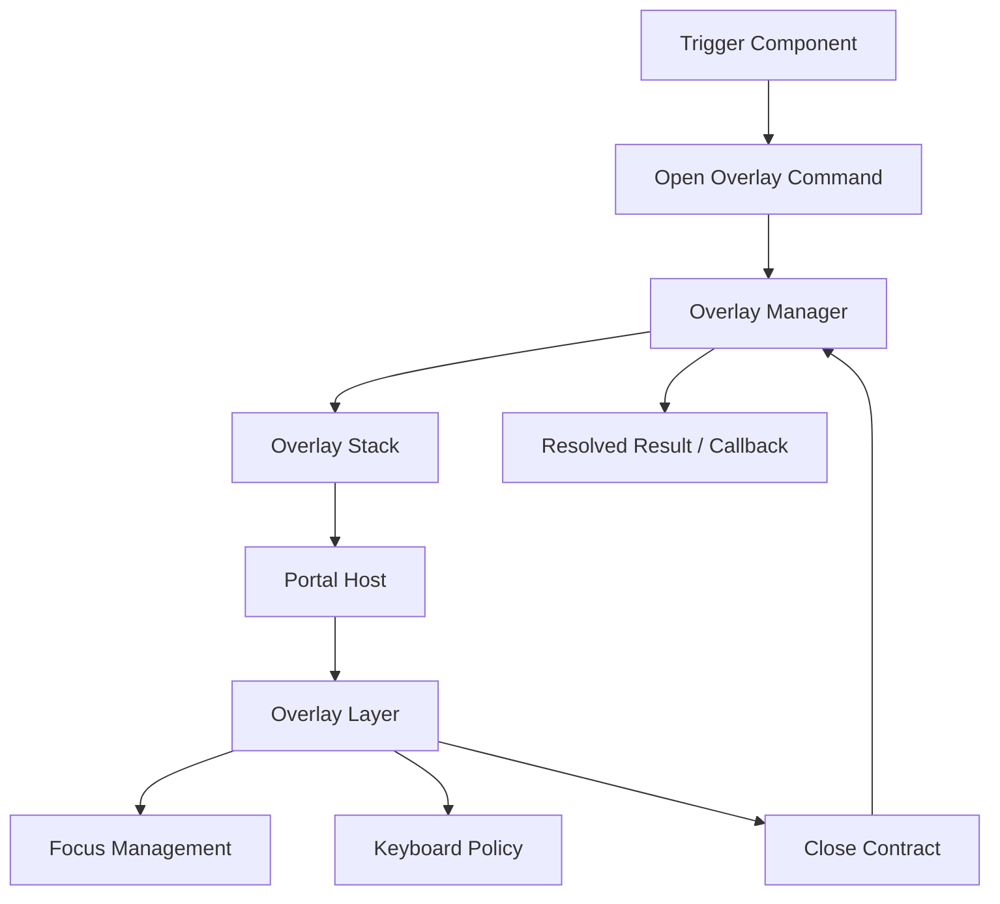
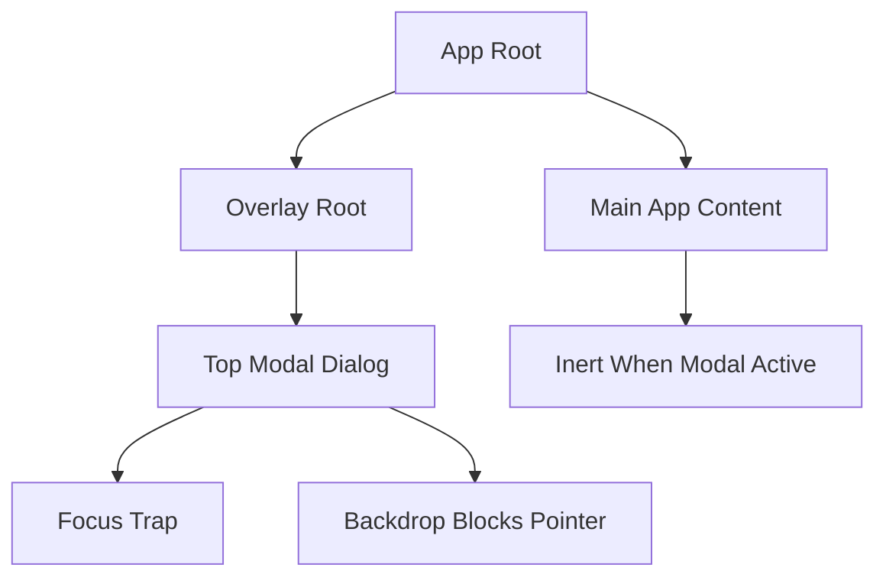

# Part 093 — Orchestrating Modals, Drawers, and Overlays

Overlay terlihat seperti masalah visual.

Di codebase kecil, modal sering dimulai seperti ini:

```tsx
const [open, setOpen] = useState(false);
```

Lalu product bertambah:

```txt
confirmation dialog
nested modal
drawer
popover
toast
command palette
route modal
unsaved-changes prompt
permission dialog
async confirm
loading modal
error recovery dialog
modal opened from table row
modal opened from portal child
mobile bottom sheet
focus trap
scroll lock
Escape handling
outside click policy
z-index conflict
```

Pada titik itu, overlay bukan lagi `useState(false)`.

Overlay adalah **orchestration problem**.

Ia menggabungkan state, focus, keyboard, DOM portal, stack ordering, command result, accessibility, routing, dan lifecycle cleanup.

---

## 1. Mental Model

Overlay adalah UI yang keluar dari alur layout normal tetapi tetap harus tunduk pada kontrak React dan aksesibilitas.



Tiga hal harus dipisahkan:

```txt
1. visual container
2. lifecycle ownership
3. interaction contract
```

Jika tiga hal ini dicampur di component sembarang, overlay akan mudah bocor.

---

## 2. Overlay Taxonomy

Tidak semua overlay sama.

| Type | Modal? | Blocks background? | Has result? | Typical owner |
|---|---:|---:|---:|---|
| Tooltip | No | No | No | Trigger component |
| Hover card | No | No | Usually no | Trigger/component primitive |
| Popover | Usually no | No | Sometimes | Trigger/component primitive |
| Dropdown menu | No | No | Selection event | Trigger/component primitive |
| Toast | No | No | No | Toast service/provider |
| Dialog | Yes | Yes | Sometimes | Overlay manager/page |
| Alert dialog | Yes | Yes | Yes | Overlay manager/page |
| Drawer | Often | Often | Sometimes | Page/overlay manager |
| Bottom sheet | Often | Often | Sometimes | Page/overlay manager |
| Command palette | Yes-ish | Yes | Command selection | App shell |
| Route modal | Yes | Yes | Navigation result | Router/page |

Kesalahan umum adalah memakai satu primitive untuk semua jenis overlay.

```txt
Tooltip memakai modal semantics → keyboard experience buruk.
Dialog tanpa modal semantics → screen reader dan focus leakage.
Toast masuk overlay stack modal → notifikasi memblokir UX.
Popover diperlakukan seperti global modal → state ownership melebar tanpa perlu.
```

---

## 3. Portal Semantics

React portal memindahkan DOM output ke node lain, tetapi component tetap berada di React tree yang sama.

```tsx
import { createPortal } from "react-dom";

function ModalPortal({ children }: { children: React.ReactNode }) {
  const root = document.getElementById("overlay-root");

  if (!root) return null;

  return createPortal(children, root);
}
```

Mental model:

```txt
DOM tree berbeda.
React tree tetap sama.
Context tetap bekerja.
Event bubbling mengikuti React tree.
```

Ini penting.

Jika modal dibuka dari dalam table row yang punya `onClick`, klik di dalam modal bisa tetap mencapai handler React ancestor sesuai React tree.

```tsx
function Row() {
  return (
    <div onClick={() => console.log("row clicked")}>
      <button>Open modal</button>
      <ModalPortal>
        <div onClick={(event) => event.stopPropagation()}>
          Modal content
        </div>
      </ModalPortal>
    </div>
  );
}
```

Jangan menganggap portal memutus event chain React.

---

## 4. Overlay Ownership

Pertanyaan pertama bukan “bagaimana menampilkan modal?”

Pertanyaan pertama:

```txt
Siapa pemilik lifecycle overlay ini?
```

### 4.1 Local overlay

Cocok ketika overlay hanya relevan untuk satu component.

```tsx
function UserAvatarMenu() {
  const [open, setOpen] = useState(false);

  return (
    <>
      <button onClick={() => setOpen(true)}>Menu</button>
      {open && <AvatarMenu onClose={() => setOpen(false)} />}
    </>
  );
}
```

Gunakan local ownership jika:

```txt
overlay tidak perlu dibuka dari tempat lain
tidak butuh promise/result global
tidak perlu stack coordination kompleks
tidak memengaruhi route
tidak harus survive parent re-render/remount
```

### 4.2 Page-owned overlay

Cocok untuk modal yang terkait state page.

```tsx
function InvoicePage() {
  const [editingInvoiceId, setEditingInvoiceId] = useState<string | null>(null);

  return (
    <>
      <InvoiceTable onEdit={(id) => setEditingInvoiceId(id)} />
      {editingInvoiceId && (
        <EditInvoiceDialog
          invoiceId={editingInvoiceId}
          onClose={() => setEditingInvoiceId(null)}
        />
      )}
    </>
  );
}
```

Ini menjaga source of truth jelas.

```txt
Page owns selection.
Dialog owns local draft.
Server cache owns loaded invoice.
```

### 4.3 App-level overlay manager

Cocok untuk overlay yang harus dibuka sebagai service/capability:

```txt
confirm delete
show alert
open command palette
open global search
show toast
show permission dialog
```

Jangan langsung membuat app-level manager untuk semua overlay.

Global overlay manager adalah power tool. Ia juga bisa menjadi hidden global state.

---

## 5. Close Contract

`onClose()` terlalu miskin untuk overlay production.

Overlay biasanya bisa ditutup karena banyak alasan:

```txt
backdrop click
Escape
close button
confirm
cancel
route change
parent unmount
permission changed
server success
server failure
timeout
```

Modelkan close reason.

```ts
type OverlayCloseReason =
  | "escape"
  | "backdrop"
  | "close-button"
  | "cancel"
  | "confirm"
  | "route-change"
  | "parent-unmount"
  | "programmatic";

type OverlayCloseEvent = {
  reason: OverlayCloseReason;
  source?: string;
};
```

Lalu API component menjadi eksplisit.

```tsx
type ConfirmDialogProps = {
  title: string;
  message: string;
  onClose: (event: OverlayCloseEvent) => void;
  onConfirm: () => void | Promise<void>;
};
```

Kontrak close harus menjawab:

```txt
Apakah backdrop click boleh close?
Apakah Escape boleh close?
Apakah close bisa dicegah ketika pending?
Apakah close berarti cancel atau abandon?
Apakah close mengembalikan result?
Apakah unsaved changes butuh confirmation nested?
```

---

## 6. Modal Result Contract

Untuk confirmation, callback biasa sering kurang rapi.

```tsx
const confirmed = await confirm({
  title: "Delete invoice?",
  message: "This action cannot be undone.",
});

if (confirmed) {
  await deleteInvoice(invoiceId);
}
```

API seperti ini nyaman, tetapi harus diimplementasikan dengan hati-hati.

Kontrak promise overlay:

```txt
promise harus resolve tepat sekali
promise tidak boleh menggantung saat provider unmount
cancel harus resolve false atau reject dengan alasan eksplisit
nested confirm harus punya stack ordering
route change harus cleanup
```

---

## 7. Minimal Overlay Manager From Scratch

Mulai dari model data.

```ts
type OverlayId = string;

type OverlayKind = "confirm" | "custom";

type OverlayDescriptor = {
  id: OverlayId;
  kind: OverlayKind;
  props: unknown;
  modal: boolean;
  createdAt: number;
};

type OverlayState = {
  stack: OverlayDescriptor[];
};

type OverlayEvent =
  | { type: "OPEN"; overlay: OverlayDescriptor }
  | { type: "CLOSE"; id: OverlayId }
  | { type: "CLOSE_TOP" }
  | { type: "CLEAR" };
```

Reducer:

```ts
function overlayReducer(state: OverlayState, event: OverlayEvent): OverlayState {
  switch (event.type) {
    case "OPEN":
      return {
        ...state,
        stack: [...state.stack, event.overlay],
      };

    case "CLOSE":
      return {
        ...state,
        stack: state.stack.filter((overlay) => overlay.id !== event.id),
      };

    case "CLOSE_TOP":
      return {
        ...state,
        stack: state.stack.slice(0, -1),
      };

    case "CLEAR":
      return { stack: [] };

    default:
      return state;
  }
}
```

Provider skeleton:

```tsx
type OverlayApi = {
  confirm(input: ConfirmInput): Promise<boolean>;
  close(id: OverlayId): void;
};

const OverlayContext = createContext<OverlayApi | null>(null);

export function useOverlay() {
  const value = useContext(OverlayContext);

  if (!value) {
    throw new Error("useOverlay must be used inside OverlayProvider");
  }

  return value;
}
```

Promise registry:

```tsx
type Resolver = {
  resolve(value: boolean): void;
  reject(error: unknown): void;
};

function OverlayProvider({ children }: { children: React.ReactNode }) {
  const [state, dispatch] = useReducer(overlayReducer, { stack: [] });
  const resolversRef = useRef(new Map<OverlayId, Resolver>());

  const close = useCallback((id: OverlayId) => {
    const resolver = resolversRef.current.get(id);
    resolver?.resolve(false);
    resolversRef.current.delete(id);
    dispatch({ type: "CLOSE", id });
  }, []);

  const confirm = useCallback((input: ConfirmInput) => {
    const id = crypto.randomUUID();

    const promise = new Promise<boolean>((resolve, reject) => {
      resolversRef.current.set(id, { resolve, reject });
    });

    dispatch({
      type: "OPEN",
      overlay: {
        id,
        kind: "confirm",
        modal: true,
        props: input,
        createdAt: Date.now(),
      },
    });

    return promise;
  }, []);

  useEffect(() => {
    return () => {
      for (const resolver of resolversRef.current.values()) {
        resolver.resolve(false);
      }

      resolversRef.current.clear();
    };
  }, []);

  const api = useMemo(() => ({ confirm, close }), [confirm, close]);

  return (
    <OverlayContext.Provider value={api}>
      {children}
      <OverlayHost
        stack={state.stack}
        close={close}
        resolversRef={resolversRef}
      />
    </OverlayContext.Provider>
  );
}
```

Host:

```tsx
type OverlayHostProps = {
  stack: OverlayDescriptor[];
  close(id: OverlayId): void;
  resolversRef: React.MutableRefObject<Map<OverlayId, Resolver>>;
};

function OverlayHost({ stack, close, resolversRef }: OverlayHostProps) {
  const root = document.getElementById("overlay-root");

  if (!root) return null;

  return createPortal(
    <>
      {stack.map((overlay, index) => {
        const isTop = index === stack.length - 1;

        if (overlay.kind === "confirm") {
          return (
            <ConfirmLayer
              key={overlay.id}
              overlay={overlay}
              isTop={isTop}
              onCancel={() => close(overlay.id)}
              onConfirm={() => {
                resolversRef.current.get(overlay.id)?.resolve(true);
                resolversRef.current.delete(overlay.id);
                close(overlay.id);
              }}
            />
          );
        }

        return null;
      })}
    </>,
    root,
  );
}
```

Bug kecil di atas: `onConfirm` memanggil `close`, dan `close` akan mencoba resolve `false` lagi bila resolver belum dihapus. Kita sudah delete sebelum close, jadi aman.

Ini contoh mengapa result contract harus eksplisit.

---

## 8. Overlay Stack

Ketika ada lebih dari satu overlay, state bukan boolean.

```txt
[]
[ConfirmDelete]
[EditDrawer, UnsavedChangesDialog]
[CommandPalette, NestedHelpDialog]
```

Overlay stack harus punya invariant:

```txt
Top overlay menerima Escape.
Top modal menentukan background inert.
Focus berada di top modal.
Backdrop milik layer yang tepat.
Z-index berasal dari stack index, bukan angka magic tersebar.
Route change cleanup sesuai policy.
```

Contoh derived layer state:

```ts
function selectTopOverlay(state: OverlayState) {
  return state.stack[state.stack.length - 1] ?? null;
}

function selectHasModal(state: OverlayState) {
  return state.stack.some((overlay) => overlay.modal);
}
```

Jangan simpan `isTop` sebagai state. Itu derived dari stack.

---

## 9. Escape Key Policy

Escape handling harus centralized untuk stack.

```tsx
function useEscapeToCloseTop({
  enabled,
  onCloseTop,
}: {
  enabled: boolean;
  onCloseTop: () => void;
}) {
  useEffect(() => {
    if (!enabled) return;

    function onKeyDown(event: KeyboardEvent) {
      if (event.key !== "Escape") return;

      event.preventDefault();
      onCloseTop();
    }

    document.addEventListener("keydown", onKeyDown);

    return () => {
      document.removeEventListener("keydown", onKeyDown);
    };
  }, [enabled, onCloseTop]);
}
```

Policy yang harus diputuskan:

```txt
Apakah Escape close semua overlay atau hanya top?
Apakah Escape disabled saat pending?
Apakah alert dialog destructive boleh Escape?
Apakah nested overlay menang atas parent?
Apakah Escape dalam text editor/search input tetap close?
```

Aturan umum:

```txt
Escape hanya menutup top dismissible layer.
Non-dismissible pending layer harus mengabaikan Escape atau menampilkan reason.
Nested overlay tidak boleh membuat parent ikut close.
```

---

## 10. Backdrop and Outside Click

Backdrop click bukan hal sederhana.

```txt
mousedown inside, mouseup outside
mousedown outside, mouseup inside
drag selection
nested popover in modal
portal child outside DOM subtree
mobile touch events
scrollbar click
```

Minimal policy:

```tsx
function Backdrop({ onInteractOutside }: { onInteractOutside: () => void }) {
  return (
    <div
      role="presentation"
      onMouseDown={(event) => {
        if (event.target !== event.currentTarget) return;
        onInteractOutside();
      }}
    />
  );
}
```

Untuk production component library, biasanya perlu layer system yang lebih kuat:

```txt
pointer down outside
focus outside
interact outside
nested layer exclusion
branch/portal awareness
```

---

## 11. Focus Management

Modal tanpa focus management bukan modal yang lengkap.

Kontrak modal accessible:

```txt
Focus masuk ke dialog saat dibuka.
Tab dan Shift+Tab tetap di dalam dialog.
Escape menutup dialog jika dismissible.
Background tidak bisa diinteraksi.
Focus kembali ke trigger saat dialog ditutup.
Dialog punya accessible name.
```

Skeleton focus return:

```tsx
function useFocusReturn(enabled: boolean) {
  const previousActiveElementRef = useRef<HTMLElement | null>(null);

  useLayoutEffect(() => {
    if (!enabled) return;

    previousActiveElementRef.current = document.activeElement as HTMLElement | null;

    return () => {
      previousActiveElementRef.current?.focus?.();
    };
  }, [enabled]);
}
```

Skeleton initial focus:

```tsx
function useInitialFocus(
  enabled: boolean,
  containerRef: React.RefObject<HTMLElement | null>,
) {
  useLayoutEffect(() => {
    if (!enabled) return;

    const container = containerRef.current;
    if (!container) return;

    const focusable = container.querySelector<HTMLElement>(
      "button, [href], input, select, textarea, [tabindex]:not([tabindex='-1'])",
    );

    focusable?.focus();
  }, [enabled, containerRef]);
}
```

Catatan penting:

```txt
useLayoutEffect dipakai agar focus terjadi sebelum browser paint berikutnya.
SSR harus guard document/window access.
Focus trap production lebih kompleks daripada querySelector sederhana.
```

---

## 12. Scroll Lock

Modal biasanya butuh scroll lock pada body.

Naif:

```tsx
document.body.style.overflow = "hidden";
```

Production problem:

```txt
multiple modals
scrollbar width shift
mobile Safari
body scroll position
nested lock
route transition cleanup
```

Gunakan reference counting.

```ts
let lockCount = 0;
let previousOverflow = "";

export function lockBodyScroll() {
  if (lockCount === 0) {
    previousOverflow = document.body.style.overflow;
    document.body.style.overflow = "hidden";
  }

  lockCount += 1;

  return () => {
    lockCount -= 1;

    if (lockCount === 0) {
      document.body.style.overflow = previousOverflow;
    }
  };
}
```

Hook:

```tsx
function useBodyScrollLock(enabled: boolean) {
  useLayoutEffect(() => {
    if (!enabled) return;
    return lockBodyScroll();
  }, [enabled]);
}
```

---

## 13. Inert Background

Modal berarti background tidak boleh diinteraksi.

Pendekatan:

```txt
native inert attribute
aria-hidden siblings
focus trap
pointer-events blocking backdrop
```

Untuk aplikasi besar, background inert harus dipasang di shell/root yang tepat, bukan di setiap modal sembarang.



Jangan hanya mengandalkan backdrop visual.

Screen reader dan keyboard user tetap bisa masuk ke background jika semantic isolation tidak benar.

---

## 14. Drawer and Bottom Sheet

Drawer/bottom sheet sering memakai model dialog, tetapi UX-nya berbeda.

Tambahkan contract:

```txt
placement: left | right | bottom
dismissible: boolean
swipe-to-close: mobile only
snap points
resize behavior
focus initial target
route back behavior
```

Drawer yang mengedit entity biasanya punya source of truth seperti ini:

```txt
URL/entity id → server-state cache → drawer draft state → mutation → invalidation → close
```

Jangan simpan entity lengkap di drawer open state.

```ts
// Avoid
type DrawerState = {
  open: boolean;
  invoice: Invoice;
};

// Prefer
type DrawerState = {
  editingInvoiceId: string | null;
};
```

Entity authoritative tetap di server/cache.

Drawer hanya menyimpan selection dan draft.

---

## 15. Route-Aware Modal

Route modal berguna ketika overlay harus shareable/back-button-aware.

Contoh state:

```txt
/invoices
/invoices?modal=create
/invoices?edit=inv_123
/invoices/inv_123?view=activity
```

Decision:

| Requirement | Use route state? |
|---|---:|
| User harus bisa copy link | Yes |
| Browser back harus close modal | Yes |
| Modal hanya local transient | No |
| Modal punya deep entity state | Often yes |
| Modal adalah confirm destructive | Usually no |

Route modal close:

```tsx
function closeModal() {
  navigate({ search: removeModalParams(location.search) });
}
```

Failure mode:

```txt
Modal open state di URL, tetapi local state juga punya open boolean.
```

Itu double source of truth.

Pilih satu authority.

---

## 16. Async Confirmation

Destructive confirmation biasanya async.

```tsx
function DeleteInvoiceButton({ invoiceId }: { invoiceId: string }) {
  const overlay = useOverlay();
  const deleteInvoice = useDeleteInvoiceMutation();

  async function onClick() {
    const confirmed = await overlay.confirm({
      title: "Delete invoice?",
      message: "This cannot be undone.",
      confirmLabel: "Delete",
      tone: "danger",
    });

    if (!confirmed) return;

    await deleteInvoice.mutateAsync({ invoiceId });
  }

  return <button onClick={onClick}>Delete</button>;
}
```

Ada dua pilihan pending UI:

```txt
1. confirm closes, mutation pending appears on page row
2. confirm stays open with pending confirm button
```

Pilihan 1 cocok jika operation cepat dan feedback row jelas.

Pilihan 2 cocok jika operation destructive dan user butuh immediate result.

Jangan biarkan user menekan confirm berkali-kali.

```tsx
<button disabled={pending} onClick={onConfirm}>
  {pending ? "Deleting..." : "Delete"}
</button>
```

---

## 17. Overlay as Capability

Overlay manager adalah capability provider.

```tsx
function Toolbar() {
  const { confirm } = useOverlay();

  async function clearAll() {
    if (!(await confirm({ title: "Clear all filters?" }))) return;
    // command
  }

  return <button onClick={clearAll}>Clear</button>;
}
```

Keuntungan:

```txt
caller tidak tahu implementasi dialog
copywriting bisa distandardisasi
accessibility centralized
stack/focus/scroll policy centralized
testing bisa mock confirm result
```

Risiko:

```txt
semua flow memakai global confirm sehingga domain-specific UX hilang
manager menjadi dumping ground
overlay result melewati state ownership yang benar
```

Gunakan capability untuk generic overlay behavior, bukan untuk menyembunyikan domain workflow.

---

## 18. Testing Strategy

Test overlay di beberapa layer.

### 18.1 Reducer test

```ts
it("closes only top overlay", () => {
  const state = {
    stack: [makeOverlay("a"), makeOverlay("b")],
  };

  expect(overlayReducer(state, { type: "CLOSE_TOP" }).stack.map((x) => x.id))
    .toEqual(["a"]);
});
```

### 18.2 Accessibility behavior test

```txt
open dialog
focus moves into dialog
Tab stays inside dialog
Escape closes if dismissible
focus returns to trigger
background not interactable
```

### 18.3 Promise contract test

```txt
confirm resolves true on confirm
confirm resolves false on cancel
provider unmount resolves/rejects pending promise
nested confirm resolves correct promise
```

### 18.4 Integration test

```txt
click delete
confirmation appears
confirm mutation runs once
row shows pending/delete state
cache invalidates
modal closes
focus returns
```

---

## 19. Observability

Overlay bugs are often user journey bugs.

Log domain-level events, not raw click spam.

```txt
overlay.opened
overlay.closed
overlay.confirmed
overlay.cancelled
overlay.blocked_close
modal.focus_return_failed
modal.duplicate_confirm_prevented
```

Include metadata:

```ts
type OverlayTelemetry = {
  overlayKind: string;
  overlayId: string;
  reason?: OverlayCloseReason;
  stackDepth: number;
  route: string;
  pending?: boolean;
};
```

Do not log sensitive modal content.

---

## 20. Failure Modes

### 20.1 Boolean explosion

```tsx
const [showDelete, setShowDelete] = useState(false);
const [showEdit, setShowEdit] = useState(false);
const [showHistory, setShowHistory] = useState(false);
const [showUnsaved, setShowUnsaved] = useState(false);
```

Replace with union state.

```ts
type ModalState =
  | { type: "closed" }
  | { type: "delete"; invoiceId: string }
  | { type: "edit"; invoiceId: string }
  | { type: "history"; invoiceId: string };
```

### 20.2 Missing close reason

Bug:

```txt
User clicks backdrop.
App treats it like explicit cancel.
Unsaved draft disappears.
```

Fix:

```txt
Model close reason.
Guard destructive close.
Ask nested confirmation if needed.
```

### 20.3 Portal event surprise

Bug:

```txt
Click inside modal triggers parent row click.
```

Fix:

```txt
Understand React tree bubbling.
Move portal higher or stop propagation inside overlay layer.
```

### 20.4 Focus leakage

Bug:

```txt
Keyboard user tabs into background while modal is open.
```

Fix:

```txt
Focus trap + inert background + accessible dialog semantics.
```

### 20.5 Promise leak

Bug:

```txt
confirm() promise never resolves after route change.
```

Fix:

```txt
Provider cleanup resolves/rejects all pending overlay promises.
```

### 20.6 Z-index war

Bug:

```txt
Dropdown appears behind modal.
Toast appears above destructive alert.
```

Fix:

```txt
Centralize layer tokens and stack calculation.
Do not hardcode z-index in random components.
```

### 20.7 Overlay manager as hidden global workflow

Bug:

```txt
Business workflow state is hidden inside modal service.
```

Fix:

```txt
Keep overlay manager generic.
Keep domain workflow in page hook, reducer, machine, or actor.
```

---

## 21. Design Checklist

Before adding an overlay, answer:

```txt
What type of overlay is this?
Who owns its lifecycle?
Is open state local, page-level, route-level, or app-level?
Does it return a result?
Can it be dismissed by Escape?
Can it be dismissed by backdrop?
What happens while async command is pending?
Where does focus go when opened?
Where does focus return when closed?
Does it need scroll lock?
Does background need inert?
Can overlays be nested?
What is the stack policy?
What is the route-change cleanup policy?
What should be tested?
```

---

## 22. Summary

Overlay orchestration is not solved by `createPortal` alone.

`createPortal` only solves DOM placement.

A production overlay system also needs:

```txt
ownership model
stack model
close contract
result contract
focus management
keyboard policy
scroll lock
inert background
route policy
async behavior
testing and observability
```

The simplest correct rule:

```txt
Use local overlay state until lifecycle coordination becomes cross-cutting.
Use page-owned overlay state when it belongs to a route/screen.
Use app-level overlay capability only for generic overlay services.
Never let the overlay manager become the hidden workflow engine.
```

Next, we apply the same orchestration mindset to optimistic workflows.
