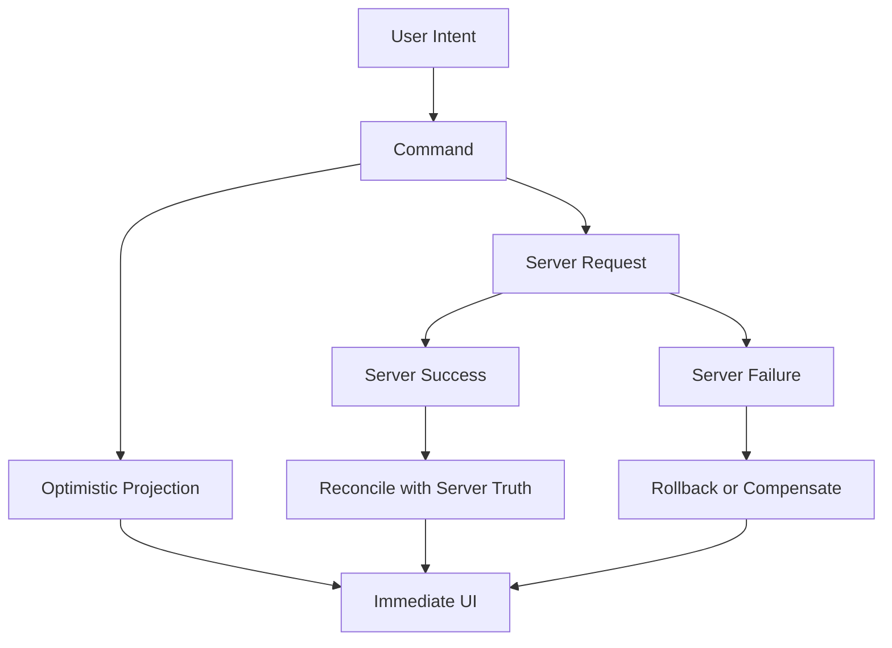
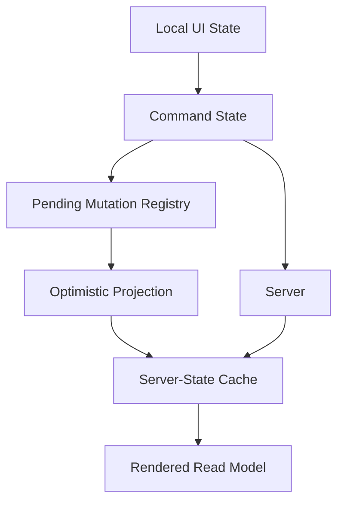
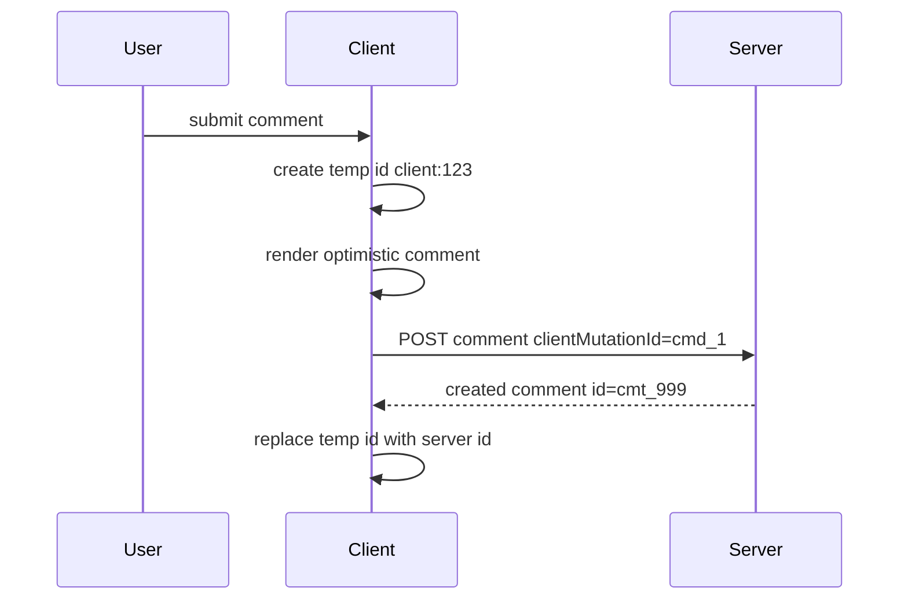
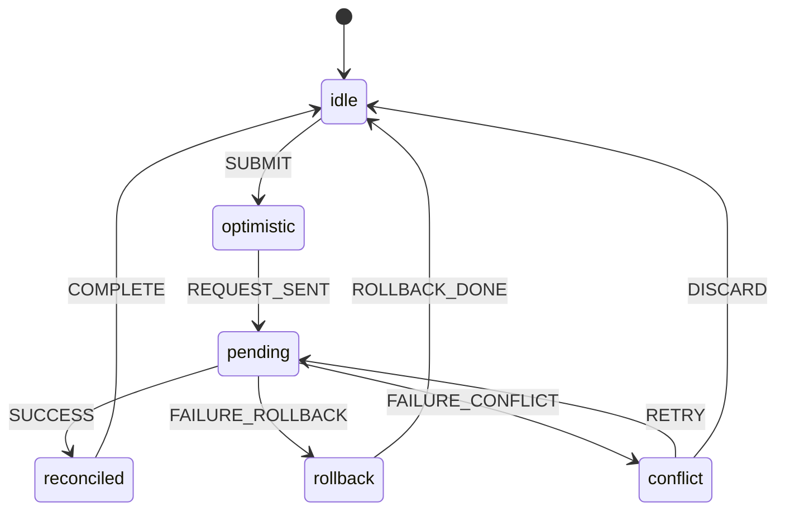

# Part 094 — Orchestrating Optimistic Workflows

Optimistic UI sering diajarkan sebagai trik kecil:

```txt
update UI dulu
request ke server
kalau gagal rollback
```

Itu benar untuk demo.

Tetapi di production, optimistic workflow adalah sistem state yang punya banyak edge case:

```txt
temporary id
mutation ordering
rollback context
partial failure
conflict
permission drift
server validation
duplicate command
offline replay
concurrent mutation
cache invalidation
pagination drift
audit/logging
compensation action
```

Optimistic UI bukan sekadar membuat UI terasa cepat.

Optimistic UI adalah **latency compensation protocol**.

---

## 1. Mental Model

Server adalah source of truth.

Client optimistic state adalah proyeksi sementara.



Prinsip:

```txt
Optimistic state is not truth.
It is a pending hypothesis.
```

Jika UI tidak membedakan truth dan hypothesis, bug akan muncul.

---

## 2. When Optimistic UI Is Appropriate

Tidak semua action layak optimistic.

| Action | Optimistic? | Reason |
|---|---:|---|
| Like/unlike | Yes | Low risk, easy rollback |
| Toggle favorite | Yes | User intent simple, reversible |
| Mark notification read | Yes | Low criticality |
| Add comment | Often | Needs temp id and failure state |
| Rename item | Often | Needs conflict/validation handling |
| Delete item | Sometimes | Needs undo or recovery |
| Submit payment | Usually no | High risk, authority strict |
| Approve regulatory case | Usually no | Audit/permission risk |
| Send legal notice | Usually no | Irreversible/high consequence |
| Save draft | Often | Can be pending/conflict-aware |

Decision questions:

```txt
Is the command reversible?
Can failure be explained clearly?
Can rollback restore user trust?
Can duplicate command cause harm?
Can permission/precondition change server-side?
Is audit/legal correctness more important than perceived speed?
```

For high-consequence workflows, prefer **pessimistic command with responsive pending UI**.

---

## 3. Optimistic State Topology

Optimistic workflow touches several state layers.



Typical state:

```txt
base server data
optimistic patch
pending command id
rollback context
temporary id mapping
error state
retry intent
conflict state
```

Do not put all of this into a random component `useState` cluster.

---

## 4. Optimistic Overlay vs Cache Mutation

There are two main strategies.

### 4.1 Optimistic overlay

Keep server data untouched, layer optimistic projection at render time.

```ts
type Todo = {
  id: string;
  title: string;
  completed: boolean;
};

type PendingPatch = {
  id: string;
  todoId: string;
  completed: boolean;
};

function applyPendingPatches(todos: Todo[], patches: PendingPatch[]) {
  return todos.map((todo) => {
    const patch = patches.find((item) => item.todoId === todo.id);
    return patch ? { ...todo, completed: patch.completed } : todo;
  });
}
```

Pros:

```txt
clear separation between truth and hypothesis
easier rollback
safe for high-risk projection
```

Cons:

```txt
read model code becomes more complex
all readers must apply overlay consistently
harder across many screens
```

### 4.2 Cache mutation

Patch server-state cache optimistically.

```ts
queryClient.setQueryData(["todos"], (old: Todo[] | undefined) => {
  if (!old) return old;
  return old.map((todo) =>
    todo.id === todoId ? { ...todo, completed: true } : todo,
  );
});
```

Pros:

```txt
all subscribers update immediately
simple for shared server-state cache
matches library ecosystem
```

Cons:

```txt
rollback must be exact
concurrent mutations are harder
partial lists/projections can drift
mistakes corrupt apparent truth
```

Use cache mutation for low/medium-risk server-state actions.

Use overlay strategy when correctness and explainability matter more.

---

## 5. Anatomy of an Optimistic Mutation

A production optimistic command has phases.

```txt
idle
→ optimistic-applied
→ request-pending
→ succeeded/reconciled
→ failed/rolled-back
→ failed/compensated
→ conflict
```

Model explicitly:

```ts
type OptimisticCommandStatus =
  | "pending"
  | "succeeded"
  | "failed"
  | "rolled-back"
  | "conflict";

type OptimisticCommand<TPatch, TRollback> = {
  commandId: string;
  kind: string;
  patch: TPatch;
  rollback: TRollback;
  status: OptimisticCommandStatus;
  createdAt: number;
};
```

For simple apps, TanStack Query mutation lifecycle may be enough.

For complex workflows, keep a mutation registry.

---

## 6. React `useOptimistic`

`useOptimistic` lets component display a different state while async action is underway.

```tsx
function CommentList({ comments }: { comments: Comment[] }) {
  const [optimisticComments, addOptimisticComment] = useOptimistic(
    comments,
    (currentComments, optimisticComment: Comment) => [
      ...currentComments,
      optimisticComment,
    ],
  );

  async function submitComment(formData: FormData) {
    const body = String(formData.get("body") ?? "");

    addOptimisticComment({
      id: `temp:${crypto.randomUUID()}`,
      body,
      status: "sending",
    });

    await createComment({ body });
  }

  return (
    <form action={submitComment}>
      <CommentItems comments={optimisticComments} />
      <input name="body" />
      <button>Send</button>
    </form>
  );
}
```

Use it when:

```txt
optimistic projection is local to this render boundary
action lifecycle is close to the component
rollback can be handled by server result/base state update
state does not need global pending registry
```

Do not use it as a replacement for server-state cache management when many screens need the same optimistic projection.

---

## 7. TanStack Query Optimistic Update

TanStack Query commonly uses `onMutate` for optimistic cache patching.

```ts
function useToggleTodo() {
  const queryClient = useQueryClient();

  return useMutation({
    mutationFn: toggleTodo,

    onMutate: async ({ todoId, completed }) => {
      await queryClient.cancelQueries({ queryKey: ["todos"] });

      const previousTodos = queryClient.getQueryData<Todo[]>(["todos"]);

      queryClient.setQueryData<Todo[]>(["todos"], (old) => {
        if (!old) return old;

        return old.map((todo) =>
          todo.id === todoId ? { ...todo, completed } : todo,
        );
      });

      return { previousTodos };
    },

    onError: (_error, _variables, context) => {
      queryClient.setQueryData(["todos"], context?.previousTodos);
    },

    onSettled: () => {
      queryClient.invalidateQueries({ queryKey: ["todos"] });
    },
  });
}
```

Key invariant:

```txt
onMutate captures rollback context before patch.
onError restores rollback context.
onSettled reconciles with server truth.
```

But this simple rollback can break with concurrent mutations.

---

## 8. Concurrent Mutations

Consider two commands:

```txt
T0: todo.completed = false
T1: user toggles to true → optimistic true
T2: user toggles to false → optimistic false
T3: first request fails
T4: second request succeeds
```

Naive rollback of first request restores old `false`, which happens to be okay here.

But for different patches, naive rollback can overwrite newer intent.

Better model:

```txt
base server snapshot + ordered optimistic patches
```

```ts
function projectTodo(base: Todo, patches: TodoPatch[]) {
  return patches.reduce((todo, patch) => {
    if (patch.todoId !== todo.id) return todo;

    switch (patch.type) {
      case "set-completed":
        return { ...todo, completed: patch.completed };
      case "rename":
        return { ...todo, title: patch.title };
      default:
        return todo;
    }
  }, base);
}
```

On failure:

```txt
remove failed patch
reproject remaining patches over latest base
```

This is more robust than snapshot rollback for complex concurrent flows.

---

## 9. Temporary IDs

Creating items optimistically needs temporary IDs.

```ts
type ClientId = `client:${string}`;
type ServerId = string;

type DraftComment = {
  id: ClientId | ServerId;
  body: string;
  status: "sending" | "sent" | "failed";
};
```

Flow:



Rules:

```txt
temp ID must never be confused with server ID
temp ID must be stable while pending
server response must reconcile temp ID to server ID
related optimistic records must use temp ID mapping
failed temp record should show retry/delete state, not vanish silently
```

Use client-generated `commandId` or idempotency key when backend supports it.

---

## 10. Reconciliation

Success response is not just “mark succeeded”.

Server may return:

```txt
canonical id
canonical timestamp
normalized text
computed totals
permission-filtered fields
new version/etag
related aggregate changes
server validation warnings
```

Reconciliation must merge server truth.

```ts
function reconcileCreatedComment(
  comments: Comment[],
  input: { tempId: string; serverComment: Comment },
) {
  return comments.map((comment) =>
    comment.id === input.tempId ? input.serverComment : comment,
  );
}
```

Do not keep optimistic `createdAt` if server sends canonical time.

Do not keep optimistic count if server sends authoritative aggregate.

---

## 11. Rollback vs Compensation

Rollback means restoring previous apparent state.

Compensation means applying another action to correct user-visible state.

| Case | Better response |
|---|---|
| Like failed | Rollback |
| Add comment failed | Keep failed item with retry |
| Delete failed | Restore item |
| Delete succeeded but undo clicked | Compensation command: restore |
| Payment failed | No optimistic state; show failure |
| Approval conflict | Conflict state; ask user to reload/review |

For user trust, sometimes silent rollback is worse than visible failed state.

Example failed comment:

```tsx
function CommentItem({ comment }: { comment: Comment }) {
  return (
    <article>
      <p>{comment.body}</p>
      {comment.status === "sending" && <small>Sending...</small>}
      {comment.status === "failed" && (
        <small>
          Failed to send. <button>Retry</button>
        </small>
      )}
    </article>
  );
}
```

---

## 12. Conflict Handling

Conflict happens when optimistic assumption no longer matches server truth.

Examples:

```txt
record version changed
user lost permission
entity was deleted by another user
validation rule changed
quota exceeded
approval state moved forward
```

Do not call this just “error”.

Model conflict separately.

```ts
type MutationError =
  | { type: "network"; retryable: true }
  | { type: "validation"; fieldErrors: Record<string, string> }
  | { type: "conflict"; serverVersion: number }
  | { type: "permission" }
  | { type: "unknown" };
```

Conflict UX options:

```txt
reload server truth
show compare/merge view
discard local optimistic patch
retry command against latest version
ask user to resolve manually
```

For regulated workflows, prefer explicit conflict state over silent reapply.

---

## 13. Pending Graph

In complex screens, pending is not one boolean.

```txt
row A deleting
row B saving
list reorder pending
bulk action pending
counter invalidation pending
toast undo timer pending
```

Use command IDs.

```ts
type PendingRegistry = Record<
  string,
  {
    commandId: string;
    entityKey: string;
    kind: string;
    status: "pending" | "failed";
  }
>;
```

Selectors:

```ts
function isEntityPending(registry: PendingRegistry, entityKey: string) {
  return Object.values(registry).some(
    (command) => command.entityKey === entityKey && command.status === "pending",
  );
}
```

This allows UI like:

```txt
only disable row being deleted
show row-level spinner
allow independent edits elsewhere
show bulk pending summary
```

---

## 14. Optimistic Workflow as State Machine

For high-complexity actions, use machine thinking.



Reducer:

```ts
type SaveState =
  | { tag: "idle" }
  | { tag: "optimistic"; commandId: string; patch: Patch }
  | { tag: "pending"; commandId: string; patch: Patch }
  | { tag: "conflict"; commandId: string; serverVersion: number }
  | { tag: "failed"; commandId: string; error: MutationError };

type SaveEvent =
  | { type: "SUBMIT"; commandId: string; patch: Patch }
  | { type: "REQUEST_SENT"; commandId: string }
  | { type: "SUCCESS"; commandId: string }
  | { type: "FAILURE"; commandId: string; error: MutationError }
  | { type: "DISCARD" };
```

Guard stale responses:

```ts
function saveReducer(state: SaveState, event: SaveEvent): SaveState {
  switch (event.type) {
    case "SUCCESS":
      if (!("commandId" in state) || state.commandId !== event.commandId) {
        return state;
      }

      return { tag: "idle" };

    case "FAILURE":
      if (!("commandId" in state) || state.commandId !== event.commandId) {
        return state;
      }

      if (event.error.type === "conflict") {
        return {
          tag: "conflict",
          commandId: event.commandId,
          serverVersion: event.error.serverVersion,
        };
      }

      return {
        tag: "failed",
        commandId: event.commandId,
        error: event.error,
      };

    default:
      return state;
  }
}
```

---

## 15. Undo as Compensation

Undo is not always rollback.

If server already accepted delete, undo is a new command.

```txt
DELETE item succeeded
Toast shows Undo for 5 seconds
User clicks Undo
Client sends RESTORE item command
```

Model it as compensation:

```ts
type UndoableCommand = {
  commandId: string;
  kind: "delete-invoice";
  entityId: string;
  undoUntil: number;
  compensation: "restore-invoice";
};
```

Do not pretend server state never changed if it did.

For audit-heavy domains, compensation must be explicit.

---

## 16. Offline and Retry

Offline optimistic workflows are a separate level of complexity.

You need:

```txt
persistent command queue
idempotency keys
replay ordering
conflict policy
user-visible pending state
retry/backoff
logout cleanup
schema migration
```

Do not accidentally build offline mode by persisting optimistic cache blindly.

If commands can survive page reload, they are no longer UI-only state.

They are durable client-side workflow state.

---

## 17. Security and Authorization

Optimistic UI must not imply authorization.

Client can show expected result, but server enforces permission.

Bad:

```txt
Hide approval button unless client says allowed.
Optimistically mark case approved.
Never handle permission failure because UI “checked already”.
```

Better:

```txt
Client permission controls affordance.
Server validates final command.
Permission failure has explicit state.
Audit action is based on server result, not optimistic UI.
```

For regulated systems, optimistic approval is usually the wrong default.

Use responsive pending UI instead.

---

## 18. Testing Strategy

Test optimistic workflows by time and interleaving.

### 18.1 Success path

```txt
user submits command
optimistic UI appears immediately
request sent once
server success reconciles canonical result
pending indicator clears
```

### 18.2 Failure rollback

```txt
base state A
optimistic patch B
server failure
state returns to A or shows failed item
error message visible
retry available if appropriate
```

### 18.3 Concurrent mutation

```txt
patch 1 applied
patch 2 applied
patch 1 fails
patch 2 succeeds
final projection preserves patch 2
```

### 18.4 Stale response guard

```txt
command A sent
command B sent
response A arrives after B
response A must not overwrite B
```

### 18.5 Conflict

```txt
server returns version conflict
UI exits optimistic state
conflict message appears
user can reload/retry/merge
```

---

## 19. Observability

Track optimistic workflow as command lifecycle.

```txt
optimistic.command_started
optimistic.patch_applied
optimistic.server_succeeded
optimistic.server_failed
optimistic.rolled_back
optimistic.conflict_detected
optimistic.retry_clicked
optimistic.compensation_started
```

Metadata:

```ts
type OptimisticTelemetry = {
  commandId: string;
  kind: string;
  entityKey?: string;
  durationMs?: number;
  failureType?: string;
  rollbackApplied?: boolean;
  compensation?: string;
};
```

Never log sensitive form payloads unless explicitly approved by data governance.

---

## 20. Failure Modes

### 20.1 Optimistic state treated as truth

Symptom:

```txt
UI shows approved state before server confirms.
Another workflow starts from that fake approved state.
```

Fix:

```txt
Represent pending/optimistic explicitly.
Block dependent high-risk commands until reconciliation.
```

### 20.2 Rollback overwrites newer intent

Symptom:

```txt
User performs two edits.
First fails.
Rollback restores snapshot before both edits.
```

Fix:

```txt
Use patch queue and command IDs.
Remove failed patch, reproject remaining patches.
```

### 20.3 Temp ID leak

Symptom:

```txt
client:123 appears in URL, analytics, or later API call.
```

Fix:

```txt
Use explicit ClientId/ServerId typing and reconcile mapping.
```

### 20.4 Silent rollback destroys trust

Symptom:

```txt
User posts comment.
Comment appears then disappears.
No explanation.
```

Fix:

```txt
Keep failed optimistic item with retry or visible error.
```

### 20.5 Duplicate command

Symptom:

```txt
Double click creates two records.
```

Fix:

```txt
Disable command while pending.
Use idempotency key when possible.
Server deduplicates command.
```

### 20.6 Invalidation gap

Symptom:

```txt
Detail cache updated but list badge/count stale.
```

Fix:

```txt
Mutation impact map.
Invalidate related aggregate queries.
Prefer server canonical response for totals.
```

### 20.7 Optimistic high-risk domain action

Symptom:

```txt
UI says regulatory case is closed before server audit transition succeeds.
```

Fix:

```txt
Do not optimistically commit high-risk lifecycle state.
Show pending command state instead.
```

---

## 21. Decision Checklist

Before implementing optimistic workflow, answer:

```txt
What is the authoritative server state?
What exact optimistic patch is applied?
Is the action reversible?
What is the rollback context?
Could concurrent mutation happen?
What is the command ID?
Do we need idempotency key?
Does this create temp IDs?
How are temp IDs reconciled?
What server fields are canonical?
What failures are retryable?
What failures are validation/conflict/permission?
Should failed optimistic UI stay visible?
Which queries must be invalidated?
Can dependent commands run while optimistic state is pending?
What telemetry is needed?
```

---

## 22. Summary

Optimistic UI is not a styling trick.

It is state orchestration under uncertainty.

Production optimistic workflow requires:

```txt
clear server authority
explicit optimistic projection
command identity
rollback or compensation strategy
temp ID reconciliation
conflict handling
invalidation map
pending registry
testing for interleavings
observability
```

The safe rule:

```txt
Optimistic UI is good when failure is rare, reversible, understandable, and low-risk.
Use pending UI instead when authority, auditability, money, permission, or irreversible lifecycle transition matters more than speed illusion.
```

Next, we close Module 9 by cataloging workflow failure modes.
