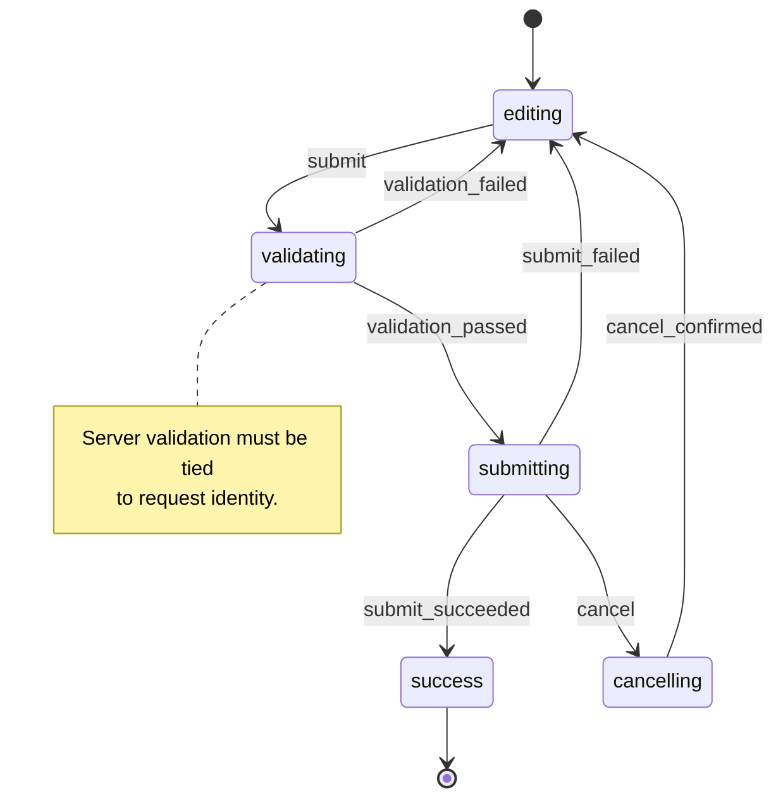
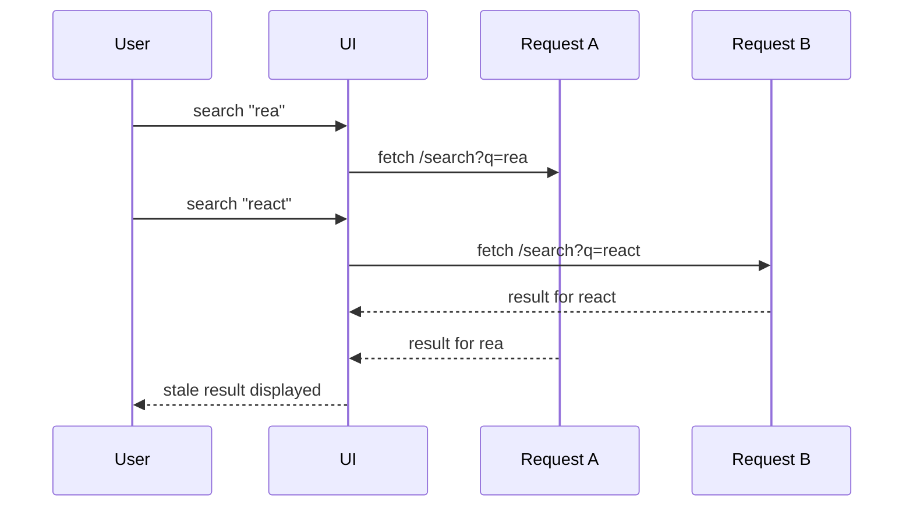
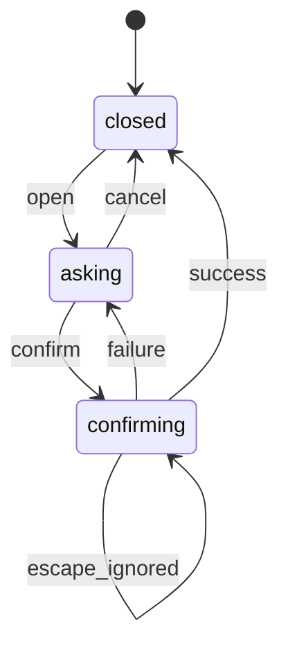
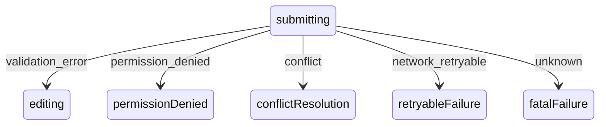

# Part 095 — Workflow Failure Modes

Workflow bugs are expensive because they rarely look like syntax bugs. They look like this:

- the wizard cannot move forward after a server validation error,
- a modal stays open after navigation,
- a user double-clicks submit and creates two records,
- a stale request overwrites newer UI state,
- an optimistic update succeeds locally but the screen later contradicts itself,
- permissions changed on the server, but the UI still exposes an action,
- a child actor keeps running after its parent workflow is gone.

A workflow is not just state. It is a controlled sequence of states, events, guards, commands, effects, and external confirmations. When a React app grows, most serious UI failures happen because the workflow was implemented as scattered booleans instead of a transition system.

The goal of this part is not to memorize every possible bug. The goal is to build a diagnostic model: when a workflow breaks, you should be able to identify the broken invariant, locate the wrong boundary, and choose a refactor path.

---

## 1. The Workflow Failure Model

A workflow fails when at least one of these contracts is false:

```txt
current state + event + guard + effect result => next valid state
```

That formula looks small, but every term matters.

| Term | Meaning | Common failure |
|---|---|---|
| current state | The workflow phase and context now | represented by unrelated booleans |
| event | Something that happened | event name is vague or overloaded |
| guard | Condition that must be true | guard lives in render or hidden inside button disabled logic |
| effect result | External outcome | response is accepted even when stale |
| next state | Valid phase after transition | impossible state becomes representable |

A workflow is healthy when invalid combinations are hard to represent and invalid transitions are easy to reject.



The diagram is not decoration. It is a debugging artifact. If the bug report says “submit failed but success toast appeared”, the diagram tells you to inspect the transition from `submitting` to `success` and ask whether a stale `submit_succeeded` event was accepted.

---

## 2. Failure Mode #1 — Boolean Soup

Boolean soup is the root of many workflow bugs.

```tsx
const [isLoading, setIsLoading] = useState(false);
const [isSaving, setIsSaving] = useState(false);
const [isValidating, setIsValidating] = useState(false);
const [isSuccess, setIsSuccess] = useState(false);
const [error, setError] = useState<Error | null>(null);
```

This looks harmless until the component can represent nonsense:

```txt
isLoading = true
isSaving = true
isSuccess = true
error = Error(...)
```

That state says: “we are loading, saving, succeeded, and failed.” A user cannot reason about that. A test cannot reliably assert it. A teammate cannot safely extend it.

### Better shape

Represent mutually exclusive workflow phases as a discriminated union.

```ts
type SaveState =
  | { tag: 'idle'; draft: Draft }
  | { tag: 'editing'; draft: Draft; dirty: boolean }
  | { tag: 'validating'; draft: Draft; requestId: string }
  | { tag: 'submitting'; draft: Draft; requestId: string }
  | { tag: 'failed'; draft: Draft; error: SubmitError }
  | { tag: 'succeeded'; result: SavedRecord };
```

This does not remove complexity. It gives complexity a shape.

### Refactor rule

When two booleans describe mutually exclusive phases, replace them with one explicit phase.

```txt
isLoading + isError + isSuccess
→ status: 'idle' | 'loading' | 'error' | 'success'
```

When the phase has different data requirements, use a tagged union instead of one `status` plus optional fields.

```ts
// weak: error exists only if status === 'error', but type does not enforce it
{ status: 'error' | 'success'; error?: Error; data?: Data }

// stronger
| { status: 'error'; error: Error }
| { status: 'success'; data: Data }
```

---

## 3. Failure Mode #2 — Transitions Hidden in Event Handlers

A workflow becomes fragile when each event handler directly edits multiple state variables.

```tsx
async function handleSubmit() {
  setIsSubmitting(true);
  setError(null);

  try {
    const result = await api.save(form);
    setResult(result);
    setIsSuccess(true);
  } catch (error) {
    setError(error);
  } finally {
    setIsSubmitting(false);
  }
}
```

The problem is not `try/catch`. The problem is that transition logic is hidden inside imperative code. The workflow has no central transition table.

### Better reducer boundary

```ts
type Event =
  | { type: 'submitted'; requestId: string }
  | { type: 'submit_succeeded'; requestId: string; result: SavedRecord }
  | { type: 'submit_failed'; requestId: string; error: SubmitError }
  | { type: 'edited'; patch: Partial<Draft> };

function reducer(state: SaveState, event: Event): SaveState {
  switch (event.type) {
    case 'submitted': {
      if (state.tag !== 'editing' && state.tag !== 'failed') return state;
      return { tag: 'submitting', draft: state.draft, requestId: event.requestId };
    }

    case 'submit_succeeded': {
      if (state.tag !== 'submitting') return state;
      if (state.requestId !== event.requestId) return state;
      return { tag: 'succeeded', result: event.result };
    }

    case 'submit_failed': {
      if (state.tag !== 'submitting') return state;
      if (state.requestId !== event.requestId) return state;
      return { tag: 'failed', draft: state.draft, error: event.error };
    }

    case 'edited': {
      if (state.tag !== 'editing' && state.tag !== 'failed') return state;
      return {
        tag: 'editing',
        draft: { ...state.draft, ...event.patch },
        dirty: true,
      };
    }
  }
}
```

Now the async function is just an effect/command boundary.

```ts
async function submit(draft: Draft, requestId: string, dispatch: Dispatch<Event>) {
  dispatch({ type: 'submitted', requestId });

  try {
    const result = await api.save(draft);
    dispatch({ type: 'submit_succeeded', requestId, result });
  } catch (error) {
    dispatch({ type: 'submit_failed', requestId, error: toSubmitError(error) });
  }
}
```

This is easier to test because the reducer can be tested without network, timers, DOM, or React.

---

## 4. Failure Mode #3 — Stale Async Result

A stale async result happens when an older request finishes after a newer request and overwrites the UI.



### Symptoms

- search results jump backward,
- submit error appears after user already retried successfully,
- wizard step resets after navigation,
- optimistic state is overwritten by old server response.

### Fix: request identity

Every async workflow event should carry identity.

```ts
const requestId = crypto.randomUUID();
dispatch({ type: 'search_started', query, requestId });

const result = await api.search(query);
dispatch({ type: 'search_succeeded', query, requestId, result });
```

Reducer rejects stale results.

```ts
case 'search_succeeded': {
  if (state.tag !== 'searching') return state;
  if (state.requestId !== event.requestId) return state;
  return { tag: 'ready', query: event.query, result: event.result };
}
```

### Fix: cancellation

Cancellation and identity are complementary.

```tsx
useEffect(() => {
  const controller = new AbortController();
  const requestId = crypto.randomUUID();

  dispatch({ type: 'load_started', requestId });

  api.load({ signal: controller.signal })
    .then((data) => dispatch({ type: 'load_succeeded', requestId, data }))
    .catch((error) => {
      if (controller.signal.aborted) return;
      dispatch({ type: 'load_failed', requestId, error });
    });

  return () => controller.abort();
}, [resourceId]);
```

Abort prevents unnecessary work. Request identity prevents stale acceptance.

---

## 5. Failure Mode #4 — Effects Contain Workflow Decisions

Effects are for synchronization with systems outside React. They should not become hidden workflow controllers.

Bad smell:

```tsx
useEffect(() => {
  if (isValid && dirty && !isSubmitting) {
    submit();
  }
}, [isValid, dirty, isSubmitting]);
```

This is fragile because the effect reacts to derived conditions instead of an explicit event. It can fire because of unrelated render changes, hydration, Strict Mode checks, or refactors that alter dependencies.

### Better

Let a user intent or workflow event drive the transition.

```ts
dispatch({ type: 'submit_requested' });
```

Then let the reducer decide whether the transition is legal.

```ts
case 'submit_requested': {
  if (state.tag !== 'editing') return state;
  if (!canSubmit(state.draft)) return { ...state, validationVisible: true };
  return { tag: 'submitting', draft: state.draft, requestId: event.requestId };
}
```

Use an effect only after state explicitly says an external synchronization is required.

```tsx
useEffect(() => {
  if (state.tag !== 'submitting') return;

  submitDraft(state.draft, state.requestId, dispatch);
}, [state]);
```

A stricter production version would avoid depending on the entire `state` object and select only the transition payload.

---

## 6. Failure Mode #5 — Double Submit and Command Reentrancy

Double submit is not a button bug. It is a command lifecycle bug.

Disabling a button helps UX, but it is not the invariant. The invariant is:

```txt
For a given workflow instance, only one non-idempotent submit command may be in flight unless the command is explicitly designed to be concurrent.
```

### UI-level guard

```tsx
<button disabled={state.tag === 'submitting'} onClick={handleSubmit}>
  Save
</button>
```

### Reducer-level guard

```ts
case 'submit_requested': {
  if (state.tag === 'submitting') return state;
  if (state.tag !== 'editing') return state;
  return { tag: 'submitting', draft: state.draft, requestId: event.requestId };
}
```

### Server-level guard

The frontend cannot be the only guard. For create/update commands, use one or more of:

- idempotency key,
- optimistic concurrency token,
- version number,
- server-side unique constraint,
- command deduplication,
- transaction boundary.

A top-tier frontend engineer does not pretend the UI can enforce global correctness. The UI can reduce accidental misuse; the backend must enforce business invariants.

---

## 7. Failure Mode #6 — Orphaned Async Work

Orphaned async work happens when a request, subscription, actor, timer, or listener outlives the workflow that started it.

Examples:

- a polling interval keeps running after modal close,
- a spawned actor keeps sending events to an unmounted provider,
- a `setTimeout` fires after route change,
- a WebSocket listener updates stale state,
- an upload progress listener survives cancellation.

### Lifecycle rule

Every started external process must have an owner and a cleanup path.

```txt
start → owner registered → stop on owner exit
```

### React effect cleanup

```tsx
useEffect(() => {
  if (state.tag !== 'uploading') return;

  const upload = createUploadTask(state.file);

  upload.onProgress((progress) => {
    dispatch({ type: 'upload_progress', uploadId: state.uploadId, progress });
  });

  upload.start();

  return () => {
    upload.cancel();
  };
}, [state.tag === 'uploading' ? state.uploadId : null]);
```

The dependency should encode the process identity. If `uploadId` changes, old work is cleaned up.

### Actor cleanup

If using an actor model, spawned actors need a stopping policy.

```txt
parent exits workflow
→ stop child upload actor
→ ignore late progress events
→ release object URL / file handle / timer
```

Do not rely on “component unmounted” as the only mental model. A workflow may end while the provider stays mounted.

---

## 8. Failure Mode #7 — Stuck Modal, Drawer, or Overlay

A stuck overlay is usually a missing state transition.

Bad modal API:

```tsx
<ConfirmDeleteModal open={open} onClose={() => setOpen(false)} />
```

This does not describe why the modal closed, whether the command was confirmed, whether async work is pending, or whether backdrop dismissal is allowed.

### Better close contract

```ts
type CloseReason =
  | 'escape'
  | 'backdrop'
  | 'cancel_button'
  | 'confirmed'
  | 'route_changed'
  | 'parent_disposed';

type ConfirmResult =
  | { type: 'cancelled'; reason: CloseReason }
  | { type: 'confirmed' };
```

### Modal workflow



Escape/backdrop during `confirming` should be a deliberate policy, not an accident.

### Common overlay failures

| Failure | Broken invariant | Refactor |
|---|---|---|
| backdrop closes during submit | close policy not phase-aware | close reason + phase guard |
| focus lost after close | focus return owner missing | capture opener ref |
| nested modal closes parent | event boundary unclear | overlay stack manager |
| modal survives route change | lifecycle not tied to route | route-aware close event |
| async confirm resolves after close | stale result accepted | request/modal instance ID |

---

## 9. Failure Mode #8 — Optimistic Drift

Optimistic drift happens when the temporary UI state diverges from canonical server state and never reconciles cleanly.

### Example

User renames a task from `Draft` to `Final` optimistically. Before the request finishes, another actor changes the task to `Approved`. Server accepts one update and rejects the other. The UI must decide what to show.

Simple optimistic update:

```txt
old cache → optimistic cache → server result → reconciled cache
```

Workflow optimistic update:

```txt
old cache
→ optimistic overlay
→ pending command graph
→ server result / conflict
→ rollback, merge, compensation, or user resolution
```

### Production optimistic policy

For each optimistic command, define:

| Question | Example answer |
|---|---|
| What is the optimistic projection? | show renamed task immediately |
| What identifies the command? | commandId, entityId, version |
| What is rollback data? | previous task snapshot |
| What if server returns different canonical data? | replace optimistic projection |
| What if server rejects with conflict? | show conflict resolution state |
| What if user triggers another command before first resolves? | serialize, merge, or allow concurrent graph |

Do not treat optimistic UI as a cosmetic improvement. It is a distributed consistency strategy.

---

## 10. Failure Mode #9 — Authorization Drift

Authorization drift occurs when UI permission state and server authority diverge.

Examples:

- UI shows “Approve” because permission was cached, server denies,
- user changes role in another tab, current tab still allows action,
- approval transition is allowed in UI but no longer valid in workflow,
- hidden button prevents UX access but API still accepts command incorrectly.

### Rule

UI permission is advisory. Server authorization is authoritative.

The React layer should still model permission carefully because it affects UX and audit clarity.

```ts
type ApprovalState =
  | { tag: 'viewing'; caseId: string; canApprove: boolean }
  | { tag: 'confirming_approval'; caseId: string; permissionSnapshotId: string }
  | { tag: 'submitting_approval'; caseId: string; commandId: string }
  | { tag: 'approval_denied'; caseId: string; reason: 'permission_changed' | 'case_state_changed' }
  | { tag: 'approved'; caseId: string };
```

A rejected command is not always a generic error. Sometimes it is a valid workflow transition:

```txt
submitting_approval + server_denied(permission_changed)
→ approval_denied
```

That is better than dumping a toast and leaving the screen in stale state.

---

## 11. Failure Mode #10 — Navigation and Back Button Break Workflow

The browser is part of the workflow.

If your workflow has meaningful location, the URL should participate in the state model.

Examples:

- `/cases/123/review?step=evidence`,
- `/orders?status=pending&page=2`,
- `/users/42?modal=reset-password`,
- `/onboarding/company-profile`.

### Common bug

State is local, but navigation implies history.

```txt
user moves step 1 → 2 → 3
user presses browser back
URL changes, local workflow does not
```

### Decision rule

Put workflow state in URL when it must be:

- shareable,
- bookmarkable,
- restorable after reload,
- controlled by browser history,
- meaningful to deep link,
- visible to external tools/support.

Keep workflow state local when it is:

- transient,
- sensitive,
- high-frequency,
- meaningless outside current session,
- not safe to expose in URL.

Hybrid design is common:

```txt
URL owns committed step
local state owns unsaved draft inside step
server state owns canonical record
```

---

## 12. Failure Mode #11 — Workflow Split Across Too Many Owners

A workflow often starts simple:

```txt
Page owns selected case
Toolbar owns action menu
Modal owns confirmation
Form owns draft
Mutation hook owns submit
Toast owns result
```

That is not automatically wrong. It becomes wrong when no single boundary owns the workflow invariant.

### Smell

To understand one transition, you must read five components and two hooks.

### Better orchestration boundary

Create a workflow hook or actor.

```ts
function useCaseApprovalWorkflow(caseId: CaseId) {
  const [state, dispatch] = useReducer(reducer, initialState(caseId));
  const approveMutation = useApproveCaseMutation();

  const commands = {
    requestApproval() {
      dispatch({ type: 'approval_requested' });
    },
    cancelApproval() {
      dispatch({ type: 'approval_cancelled' });
    },
    async confirmApproval() {
      const commandId = crypto.randomUUID();
      dispatch({ type: 'approval_submitted', commandId });
      try {
        const result = await approveMutation.mutateAsync({ caseId, commandId });
        dispatch({ type: 'approval_succeeded', commandId, result });
      } catch (error) {
        dispatch({ type: 'approval_failed', commandId, error: mapError(error) });
      }
    },
  };

  return { state, commands };
}
```

Components consume workflow state. They do not invent transitions independently.

---

## 13. Failure Mode #12 — Event Naming Lies

Bad event names hide causality.

```ts
dispatch({ type: 'setOpen', value: false });
dispatch({ type: 'setLoading', value: true });
dispatch({ type: 'updateStatus', status: 'done' });
```

These names describe mutations, not events.

Better:

```ts
dispatch({ type: 'delete_requested' });
dispatch({ type: 'delete_cancelled', reason: 'escape' });
dispatch({ type: 'delete_confirmed', commandId });
dispatch({ type: 'delete_succeeded', commandId });
dispatch({ type: 'delete_failed', commandId, error });
```

A workflow event should answer:

```txt
What happened?
Who/what caused it?
What minimal payload is required to decide the next state?
```

Avoid event names that smuggle implementation detail:

| Weak | Better |
|---|---|
| `setStep(2)` | `company_profile_completed` |
| `setModal(false)` | `approval_cancelled` |
| `setError(err)` | `submission_rejected` |
| `setLoading(true)` | `submit_requested` |
| `updateData(data)` | `case_refreshed` |

---

## 14. Failure Mode #13 — Missing Error Taxonomy

Many workflow bugs happen because every error is treated the same.

```ts
catch (error) {
  setError(error);
}
```

That loses domain meaning.

A production workflow needs error categories.

```ts
type SubmitError =
  | { type: 'validation'; fields: Record<string, string> }
  | { type: 'permission_denied'; message: string }
  | { type: 'conflict'; serverVersion: number; clientVersion: number }
  | { type: 'network'; retryable: boolean }
  | { type: 'unknown'; message: string };
```

Different errors imply different transitions.



A toast is not a workflow state. A toast may be a side effect of entering a state, but the workflow still needs to know what happened.

---

## 15. Failure Mode #14 — Retry Without Policy

Retry can fix transient failures and corrupt non-idempotent workflows.

Before retrying, classify the command.

| Command | Safe auto retry? | Notes |
|---|---:|---|
| read query | usually yes | cache/query library can manage |
| idempotent update with key | maybe | backend must dedupe |
| payment/charge | no by default | needs idempotency key and careful UX |
| file upload chunk | maybe | chunk/session protocol required |
| approval command | maybe | command ID/version required |
| delete command | usually manual | user confirmation and server idempotency needed |

### Retry state

```ts
type RetryState =
  | { tag: 'idle' }
  | { tag: 'submitting'; attempt: number; commandId: string }
  | { tag: 'retry_wait'; attempt: number; commandId: string; retryAt: number }
  | { tag: 'failed'; retryable: boolean; error: SubmitError };
```

Retry is not just a loop. It is a visible workflow with attempt count, cancellation, and user communication.

---

## 16. Failure Mode #15 — Tests Assert DOM but Not Workflow Invariants

DOM tests are necessary but insufficient.

Bad test:

```tsx
expect(screen.getByText('Saved')).toBeInTheDocument();
```

Better test the transition system directly.

```ts
it('ignores stale submit success', () => {
  const s1: SaveState = {
    tag: 'submitting',
    draft,
    requestId: 'new',
  };

  const s2 = reducer(s1, {
    type: 'submit_succeeded',
    requestId: 'old',
    result,
  });

  expect(s2).toBe(s1);
});
```

Then test integration behavior.

```tsx
it('does not show stale success after retry succeeds', async () => {
  // Arrange two deferred promises: first slow failure, second fast success.
  // Trigger submit, retry, resolve out of order.
  // Assert final screen reflects only the latest command.
});
```

Workflow testing should cover:

- illegal transitions,
- stale async results,
- cancellation,
- retry limits,
- permission denial,
- conflict response,
- navigation/back behavior,
- modal close reasons,
- optimistic rollback,
- unmount cleanup.

---

## 17. Debugging Protocol

When a workflow bug appears, do not start by reading random components. Start with the invariant.

```txt
1. What workflow is failing?
2. What state was the workflow in before the bug?
3. What event happened?
4. Was the event legal in that state?
5. Did the guard run?
6. Did an external command start?
7. Was the result stale, cancelled, duplicated, or unauthorized?
8. Which owner accepted the result?
9. What state did the workflow enter?
10. Which invariant was violated?
```

### Instrument transitions

In development, log transition events.

```ts
function debugTransition(prev: State, event: Event, next: State) {
  if (process.env.NODE_ENV === 'production') return;

  console.groupCollapsed(`[workflow] ${prev.tag} --${event.type}--> ${next.tag}`);
  console.log('prev', prev);
  console.log('event', event);
  console.log('next', next);
  console.groupEnd();
}
```

Avoid logging sensitive payloads. Log IDs, tags, event types, command IDs, versions, and state tags.

---

## 18. Production Observability

Workflow observability should answer:

- which transition happened,
- how long each phase lasted,
- which command ID/request ID was used,
- what external dependency failed,
- whether the failure was retryable,
- whether user abandoned the workflow,
- whether stale results were rejected,
- whether optimistic rollback occurred.

### Suggested event shape

```ts
type WorkflowLogEvent = {
  workflow: 'caseApproval';
  instanceId: string;
  previousState: string;
  eventType: string;
  nextState: string;
  commandId?: string;
  entityId?: string;
  durationMs?: number;
  result?: 'accepted' | 'ignored' | 'rejected';
  reason?: string;
};
```

Do not log full form payloads by default. Workflow logs are for control flow, not data exfiltration.

---

## 19. Anti-Pattern Map

| Anti-pattern | Why it fails | Replacement |
|---|---|---|
| boolean soup | impossible states | discriminated union |
| event handler transition soup | hidden transition table | reducer/machine |
| effect-driven workflow | accidental triggers | explicit events |
| no request ID | stale results accepted | request/command identity |
| disabled button only | double command still possible | reducer/server guard |
| generic error | wrong recovery path | error taxonomy |
| global modal without owner | stuck overlays | overlay workflow manager |
| optimistic mutation without rollback | consistency drift | rollback/compensation policy |
| permission as UI-only | server denial surprises | permission-denied transition |
| retry loop without idempotency | duplicate side effects | retry policy + command ID |
| scattered owners | no invariant owner | workflow hook/actor/page orchestrator |
| no transition tests | regressions hidden | reducer/machine transition tests |

---

## 20. Build-from-Scratch Exercise: Approval Workflow Failure Harness

Implement a small approval workflow with these requirements:

1. User opens approval confirmation modal.
2. User can cancel by button, Escape, or route change.
3. Confirm starts async approval command.
4. Escape/backdrop are ignored while command is pending.
5. Duplicate confirm is ignored.
6. Server may return success, permission denied, conflict, validation error, or network error.
7. Stale responses are ignored.
8. Transition log records every accepted and ignored event.

Suggested state:

```ts
type ApprovalWorkflow =
  | { tag: 'idle'; caseId: string }
  | { tag: 'confirming'; caseId: string }
  | { tag: 'submitting'; caseId: string; commandId: string }
  | { tag: 'approved'; caseId: string }
  | { tag: 'permission_denied'; caseId: string }
  | { tag: 'conflict'; caseId: string; serverVersion: number }
  | { tag: 'failed'; caseId: string; retryable: boolean; message: string };
```

Suggested events:

```ts
type ApprovalEvent =
  | { type: 'approval_requested' }
  | { type: 'approval_cancelled'; reason: CloseReason }
  | { type: 'approval_confirmed'; commandId: string }
  | { type: 'approval_succeeded'; commandId: string }
  | { type: 'approval_denied'; commandId: string }
  | { type: 'approval_conflicted'; commandId: string; serverVersion: number }
  | { type: 'approval_failed'; commandId: string; retryable: boolean; message: string };
```

Test the reducer before building the UI.

---

## 21. Production Checklist

Before shipping a workflow, check:

```txt
[ ] Mutually exclusive phases are not represented as unrelated booleans.
[ ] Every transition has an event name that describes what happened.
[ ] Invalid events are rejected or explicitly handled.
[ ] Async commands carry request/command identity.
[ ] Stale async results are ignored.
[ ] Long-running effects have cleanup/cancellation.
[ ] Duplicate non-idempotent commands are guarded in UI and reducer.
[ ] Server-side idempotency/concurrency is considered.
[ ] Error taxonomy maps to distinct recovery states.
[ ] Permission denial is a workflow transition, not just a toast.
[ ] Navigation/back/reload behavior is deliberate.
[ ] Optimistic updates have rollback/reconciliation/compensation policy.
[ ] Modal/overlay close reasons are explicit.
[ ] Workflow transitions are unit-tested.
[ ] Critical transitions are observable without leaking sensitive data.
```

---

## 22. Key Takeaways

Workflow bugs are rarely fixed by adding one more boolean. They are fixed by giving the workflow a real model.

The core rules:

1. Model phases explicitly.
2. Name events by what happened, not by what state should be set.
3. Keep transition logic centralized.
4. Treat async results as events that may be stale.
5. Give every external process an owner and cleanup.
6. Treat permission, conflict, retry, and cancellation as first-class states.
7. Test transitions separately from DOM rendering.

A React app with explicit workflows feels boring in the best way: events happen, guards run, transitions are predictable, effects synchronize, and impossible states are impossible to represent.

---

## References

- React — Extracting State Logic into a Reducer: https://react.dev/learn/extracting-state-logic-into-a-reducer
- React — Synchronizing with Effects: https://react.dev/learn/synchronizing-with-effects
- React — Managing State: https://react.dev/learn/managing-state
- Stately/XState — Actors and State Machines: https://stately.ai/docs

