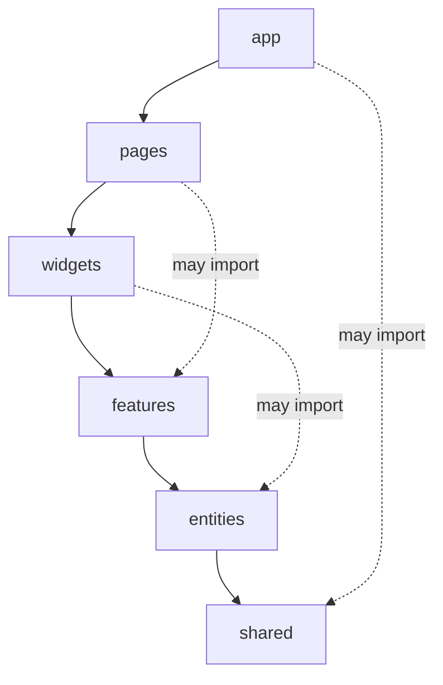
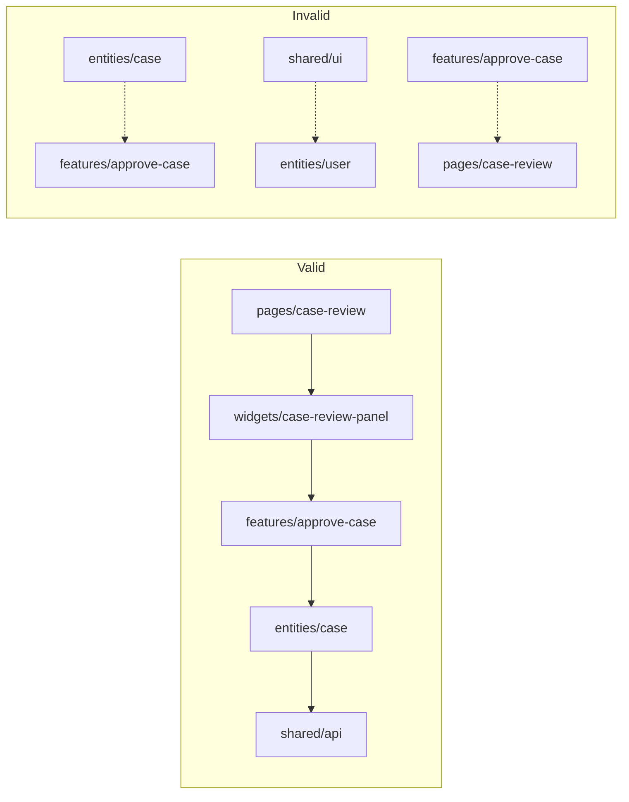
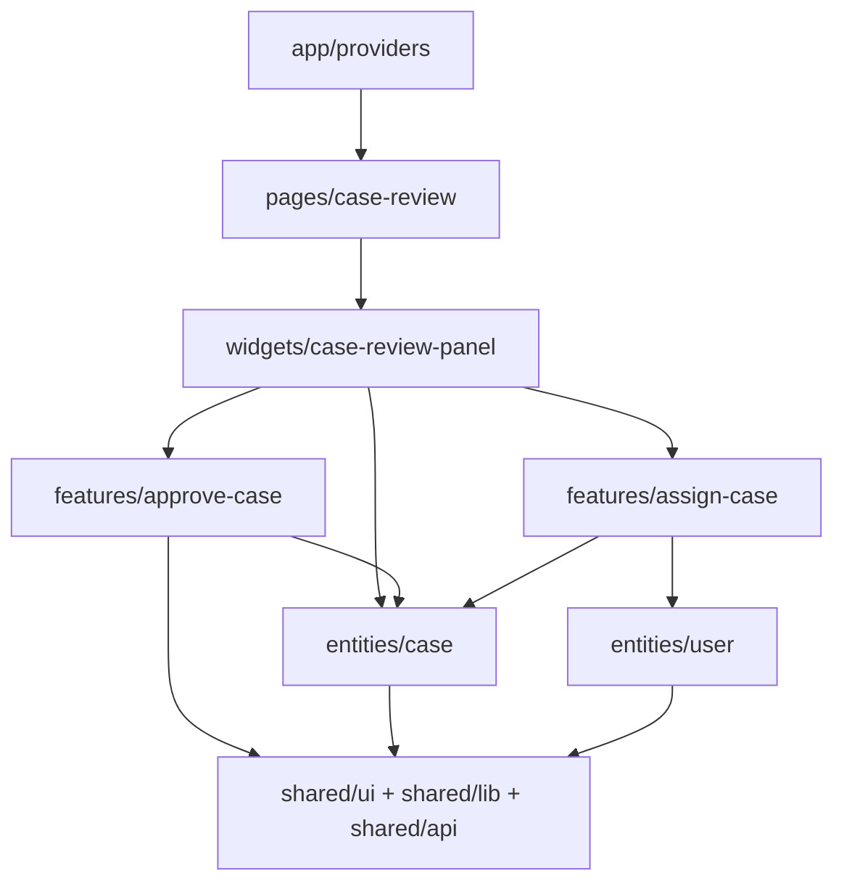

# Part 096 — Feature-Sliced React Architecture

A React architecture fails when the folder structure lies.

You open `components/`, find domain API calls. You open `hooks/`, find navigation and permissions. You open `utils/`, find workflow rules. You open `store/`, find everything. The code still runs, but no one knows where a new behavior belongs.

Feature-sliced architecture is a way to organize frontend systems by product boundary, dependency direction, and change locality. It is not about pretty folders. It is about controlling coupling.

This part adapts the Feature-Sliced Design mental model to the React state, composition, context, and orchestration patterns we have built so far.

---

## 1. The Core Problem

Large React apps usually start with technical folders:

```txt
src/
  components/
  hooks/
  services/
  utils/
  store/
  pages/
```

This works until the product grows. Then the codebase has three problems.

### 1.1 Low locality

A single feature requires editing files across unrelated folders.

```txt
components/CaseCard.tsx
hooks/useApproveCase.ts
services/caseApi.ts
store/caseSlice.ts
utils/casePermissions.ts
pages/CaseReviewPage.tsx
```

The domain concept is `case approval`, but the filesystem is organized by technical category.

### 1.2 Import chaos

Everything can import everything.

```txt
components imports store
store imports services
services imports utils
utils imports app config
pages imports deep components
features import other features directly
```

When import direction is uncontrolled, refactoring becomes risky because every module may have hidden consumers.

### 1.3 State ownership ambiguity

No one knows whether state belongs to:

- a page,
- a feature,
- an entity,
- shared store,
- URL,
- server-state cache,
- context provider,
- workflow actor.

Feature-sliced architecture gives state a neighborhood.

---

## 2. Feature-Sliced Mental Model

A feature-sliced codebase is split by two axes:

```txt
vertical axis   : layer / dependency level
horizontal axis : business slice / product concept
inside slice    : segment / technical purpose
```



Higher layers may import lower layers. Lower layers must not import higher layers.

This single rule creates architectural pressure:

- `shared` cannot know product workflow,
- `entities` cannot know pages,
- `features` cannot depend on sibling features directly,
- `widgets` compose features/entities into larger blocks,
- `pages` orchestrate route-level behavior,
- `app` wires global providers, routing, and bootstrapping.

The rule is not dogma. It is a coupling budget.

---

## 3. Layers

A practical React setup uses these layers:

```txt
app       - app bootstrap, routing, global providers, error boundaries
pages     - route-level screens and page orchestration
widgets   - large self-contained UI blocks / page sections
features  - user actions that produce business value
entities  - domain entities, read models, entity UI, entity-specific model
shared    - reusable infrastructure independent of business domain
```

Some teams add `processes` for long cross-page workflows, but in modern React apps it is often better to model those as route/page orchestration, workflow actors, or server-driven process state. The original FSD `processes` layer is commonly treated as deprecated; do not add it unless your team has a clear need.

### Layer responsibilities

| Layer | Owns | Should not own |
|---|---|---|
| `app` | providers, router, app shell, global config | product workflows |
| `pages` | route orchestration, layout, query param binding | reusable domain logic |
| `widgets` | large composed blocks | global app wiring |
| `features` | user actions/commands | page layout |
| `entities` | domain entity read models and primitive domain UI | user workflows that combine multiple entities |
| `shared` | generic UI, libs, API client, helpers | business rules |

---

## 4. Slices

A slice groups code by business concept.

Examples:

```txt
entities/case
entities/user
entities/comment
features/approve-case
features/assign-case
features/filter-case-list
widgets/case-review-panel
pages/case-review
```

A slice should answer:

```txt
What product concept changes together?
```

Bad slices:

```txt
features/button
features/api
entities/table
widgets/helpers
```

Those are technical categories, not product boundaries.

Good slices:

```txt
features/approve-case
features/change-assignee
features/export-case-report
entities/case
entities/enforcement-action
widgets/case-timeline
pages/case-search
```

### Same-layer slice isolation

A strong feature-sliced rule is that slices on the same layer should not import each other directly.

Bad:

```txt
features/approve-case imports features/notify-reviewer
```

Better:

```txt
widgets/case-review-actions composes approve-case and notify-reviewer
```

If two features must coordinate, put the coordination in a higher layer or extract shared domain capability downward.

---

## 5. Segments

Inside a slice, segments group code by purpose.

Common segments:

```txt
ui       - visual components
model    - state, selectors, reducers, workflow, hooks
api      - backend calls, DTOs, mappers
lib      - slice-local helpers
config   - slice-local constants/flags
```

Example:

```txt
features/approve-case/
  api/
    approveCase.ts
    approveCase.dto.ts
  model/
    approvalMachine.ts
    useApproveCaseWorkflow.ts
    approvalEvents.ts
  ui/
    ApproveCaseButton.tsx
    ApproveCaseDialog.tsx
  index.ts
```

The public API is the slice `index.ts`. External code should import from the slice boundary, not from deep internal files.

```ts
// good
import { ApproveCaseButton } from '@/features/approve-case';

// risky
import { approvalMachine } from '@/features/approve-case/model/approvalMachine';
```

Deep imports are a dependency leak. They make internals public by accident.

---

## 6. Dependency Rule

A simple dependency direction:

```txt
app → pages → widgets → features → entities → shared
```

A module may import from layers below itself. It should not import from layers above itself.



### Why this matters

If `entities/case` imports `features/approve-case`, then the entity layer knows a specific user action. That prevents reuse of the case entity in screens where approval is irrelevant.

If `shared/ui/Button` imports `entities/user`, then every consumer of Button now carries hidden business dependency.

Architecture is mostly about preventing innocent-looking imports from becoming global coupling.

---

## 7. Public API Contract

Each slice should expose only what other layers are allowed to use.

```txt
features/approve-case/index.ts
```

```ts
export { ApproveCaseButton } from './ui/ApproveCaseButton';
export { useApproveCaseWorkflow } from './model/useApproveCaseWorkflow';
export type { ApprovalResult } from './model/types';
```

Do not export everything.

Bad:

```ts
export * from './api/approveCase';
export * from './model/internalReducer';
export * from './model/privateGuards';
export * from './ui/ApproveCaseDialogInternal';
```

The public API should be designed like a component API:

- stable names,
- minimal surface,
- clear ownership,
- no accidental internals,
- no circular dependency pressure.

---

## 8. State Placement in Feature-Sliced Architecture

State placement should follow both React ownership and layer responsibility.

| State type | Typical owner | Example |
|---|---|---|
| local input draft | component or feature UI | `ApproveCaseDialog` comment text |
| workflow phase | feature/model or page/model | approval workflow |
| route state | page/model or router | selected tab, query params |
| server state | query hooks near entity/feature API | `useCaseQuery(caseId)` |
| entity client state | entity/model or external store | selected case IDs, normalized cache |
| cross-feature coordination | widget/page/model | action toolbar state |
| app-global capability | app provider/shared lib | theme, analytics, modal service |
| browser persistence | feature/entity model or shared adapter | saved filters |

### Do not centralize by default

Bad architecture:

```txt
src/store/everything.ts
```

Better:

```txt
features/filter-case-list/model/filterState.ts
features/approve-case/model/useApproveCaseWorkflow.ts
entities/case/model/caseSelectors.ts
pages/case-search/model/useCaseSearchPageState.ts
```

Shared store is a tool, not a destination for all uncertainty.

---

## 9. Entity Layer

The entity layer describes domain things the product works with.

Example:

```txt
entities/case/
  api/
    caseApi.ts
    caseDto.ts
    caseMapper.ts
  model/
    caseTypes.ts
    caseSelectors.ts
    caseStatus.ts
    useCaseQuery.ts
  ui/
    CaseStatusBadge.tsx
    CaseSummaryCard.tsx
  index.ts
```

Entity code should be reusable across features and pages.

Good entity responsibilities:

- domain type definitions,
- DTO mappers,
- query hooks for canonical reads,
- status badges,
- simple entity cards,
- entity selectors,
- entity-specific formatting.

Avoid putting specific user workflows in entities.

Bad:

```txt
entities/case/model/useApproveCaseWorkflow.ts
```

Better:

```txt
features/approve-case/model/useApproveCaseWorkflow.ts
```

Approval is a user action. `case` is the domain object.

---

## 10. Feature Layer

A feature represents a user action that brings product value.

Examples:

```txt
features/approve-case
features/assign-case
features/add-comment
features/export-report
features/filter-case-list
features/change-case-status
```

A feature can contain UI, model, API, and local workflow.

```txt
features/assign-case/
  api/
    assignCase.ts
  model/
    useAssignCaseWorkflow.ts
    assignCaseSchema.ts
  ui/
    AssignCaseButton.tsx
    AssignCaseDialog.tsx
  index.ts
```

### Feature boundary pattern

```tsx
export function AssignCaseButton({ caseId }: { caseId: CaseId }) {
  const workflow = useAssignCaseWorkflow(caseId);

  return (
    <>
      <Button onClick={workflow.commands.open}>Assign</Button>
      <AssignCaseDialog workflow={workflow} />
    </>
  );
}
```

The feature owns its workflow. The parent should not know internal states like `isDialogOpen`, `isSubmitting`, or `selectedUserId` unless those are part of the public contract.

---

## 11. Widget Layer

A widget composes entities and features into a larger self-contained block.

Example:

```txt
widgets/case-review-panel/
  ui/
    CaseReviewPanel.tsx
    CaseReviewHeader.tsx
    CaseReviewActions.tsx
  model/
    useCaseReviewPanel.ts
  index.ts
```

A widget is not just a “big component”. It is a composition boundary.

```tsx
export function CaseReviewPanel({ caseId }: { caseId: CaseId }) {
  const caseQuery = useCaseQuery(caseId);

  return (
    <Panel>
      <CaseSummaryCard caseId={caseId} />
      <CaseTimeline caseId={caseId} />
      <CaseReviewActions caseId={caseId} />
    </Panel>
  );
}
```

The widget may compose:

- entity UI,
- feature buttons,
- feature dialogs,
- layout rules,
- section-level loading/error boundaries.

The widget should not become a dumping ground for unrelated page logic.

---

## 12. Page Layer

A page owns route-level orchestration.

Example:

```txt
pages/case-review/
  model/
    useCaseReviewPage.ts
    caseReviewSearchParams.ts
  ui/
    CaseReviewPage.tsx
  index.ts
```

Responsibilities:

- read route params,
- parse query params,
- compose widgets,
- define page-level loading/error/suspense boundaries,
- coordinate cross-widget state,
- bind page workflow to URL,
- choose page layout.

```tsx
export function CaseReviewPage() {
  const { caseId } = useParams();
  const page = useCaseReviewPage(caseId);

  return (
    <PageShell>
      <CaseReviewPanel caseId={page.caseId} />
      <RelatedCasesWidget caseId={page.caseId} />
      <AuditTrailWidget caseId={page.caseId} />
    </PageShell>
  );
}
```

If a behavior is specific to one route and not reusable, it can live in the page. If multiple pages need the same user action, extract it to `features`.

---

## 13. App Layer

The app layer wires runtime infrastructure.

```txt
app/
  providers/
    AppProviders.tsx
    QueryProvider.tsx
    RouterProvider.tsx
  routes/
    routes.tsx
  styles/
    global.css
  main.tsx
```

Good app-layer responsibilities:

- router setup,
- query client setup,
- global error boundary,
- global suspense boundary,
- theme/provider composition,
- feature flag provider,
- app-level config,
- app shell.

Avoid putting product-specific state transitions in `app`. If `app` knows how to approve a case, the boundary is wrong.

---

## 14. Shared Layer

Shared is for reusable infrastructure detached from business specifics.

```txt
shared/
  ui/
    Button/
    Dialog/
    Select/
  api/
    httpClient.ts
    errors.ts
  lib/
    date.ts
    result.ts
    createStrictContext.ts
  config/
    env.ts
```

Shared must be boring. The moment shared code knows about `case`, `invoice`, `approval`, or `user role`, it is probably no longer shared.

Good:

```txt
shared/ui/Dialog
shared/lib/createStrictContext
shared/api/httpClient
shared/lib/useStableEvent
```

Bad:

```txt
shared/lib/caseApprovalRules
shared/ui/AdminOnlyButton
shared/hooks/useCurrentCase
```

---

## 15. Example Full Structure

```txt
src/
  app/
    providers/
      AppProviders.tsx
      QueryProvider.tsx
    routes/
      routes.tsx
    main.tsx

  pages/
    case-review/
      model/
        useCaseReviewPage.ts
      ui/
        CaseReviewPage.tsx
      index.ts

  widgets/
    case-review-panel/
      model/
        useCaseReviewPanel.ts
      ui/
        CaseReviewPanel.tsx
        CaseReviewActions.tsx
      index.ts

  features/
    approve-case/
      api/
        approveCase.ts
      model/
        useApproveCaseWorkflow.ts
        approvalReducer.ts
        types.ts
      ui/
        ApproveCaseButton.tsx
        ApproveCaseDialog.tsx
      index.ts

    assign-case/
      api/
        assignCase.ts
      model/
        useAssignCaseWorkflow.ts
      ui/
        AssignCaseButton.tsx
      index.ts

  entities/
    case/
      api/
        caseApi.ts
        caseMapper.ts
      model/
        caseTypes.ts
        useCaseQuery.ts
        caseSelectors.ts
      ui/
        CaseStatusBadge.tsx
        CaseSummaryCard.tsx
      index.ts

    user/
      model/
        userTypes.ts
        useUserQuery.ts
      ui/
        UserAvatar.tsx
      index.ts

  shared/
    ui/
      Button/
      Dialog/
    api/
      httpClient.ts
    lib/
      createStrictContext.ts
      invariant.ts
```

---

## 16. Import Examples

### Good import path

```tsx
// pages/case-review/ui/CaseReviewPage.tsx
import { CaseReviewPanel } from '@/widgets/case-review-panel';
import { AuditTrailWidget } from '@/widgets/audit-trail';
```

```tsx
// widgets/case-review-panel/ui/CaseReviewActions.tsx
import { ApproveCaseButton } from '@/features/approve-case';
import { AssignCaseButton } from '@/features/assign-case';
import { CaseStatusBadge } from '@/entities/case';
```

```tsx
// features/approve-case/ui/ApproveCaseDialog.tsx
import { Dialog } from '@/shared/ui/Dialog';
import { CaseStatusBadge } from '@/entities/case';
```

### Bad import path

```tsx
// entities/case/ui/CaseSummaryCard.tsx
import { ApproveCaseButton } from '@/features/approve-case';
```

Why bad? Entity UI now knows a specific feature. Instead, a widget should compose entity UI and feature UI.

```tsx
// widgets/case-review-panel/ui/CaseReviewActions.tsx
<CaseSummaryCard caseId={caseId} />
<ApproveCaseButton caseId={caseId} />
```

---

## 17. Where Hooks Belong

Do not create one global `hooks/` folder by default. Ask what the hook owns.

| Hook | Belongs in | Why |
|---|---|---|
| `useApproveCaseWorkflow` | `features/approve-case/model` | feature-specific workflow |
| `useCaseQuery` | `entities/case/model` | canonical entity read |
| `useCaseReviewPage` | `pages/case-review/model` | route orchestration |
| `useOverlayManager` | `shared/ui` or `app/providers` | generic UI infrastructure |
| `useDebouncedValue` | `shared/lib` | domain-agnostic utility |
| `useCurrentUserPermissions` | `entities/user` or `features/auth` depending on domain | business capability |

A hook is not architecture by itself. A hook is a boundary. Put it near the boundary it represents.

---

## 18. State Management by Layer

### Entity query hook

```ts
// entities/case/model/useCaseQuery.ts
export function useCaseQuery(caseId: CaseId) {
  return useQuery({
    queryKey: ['case', 'detail', caseId],
    queryFn: () => caseApi.getCase(caseId),
  });
}
```

### Feature workflow hook

```ts
// features/approve-case/model/useApproveCaseWorkflow.ts
export function useApproveCaseWorkflow(caseId: CaseId) {
  const [state, dispatch] = useReducer(reducer, { tag: 'idle', caseId });
  const queryClient = useQueryClient();

  const confirm = async () => {
    const commandId = crypto.randomUUID();
    dispatch({ type: 'approval_confirmed', commandId });

    try {
      await approveCase({ caseId, commandId });
      dispatch({ type: 'approval_succeeded', commandId });
      queryClient.invalidateQueries({ queryKey: ['case', 'detail', caseId] });
    } catch (error) {
      dispatch({ type: 'approval_failed', commandId, error: mapApprovalError(error) });
    }
  };

  return {
    state,
    commands: {
      open: () => dispatch({ type: 'approval_requested' }),
      cancel: () => dispatch({ type: 'approval_cancelled' }),
      confirm,
    },
  };
}
```

### Page orchestration hook

```ts
// pages/case-review/model/useCaseReviewPage.ts
export function useCaseReviewPage(caseId: CaseId) {
  const [searchParams, setSearchParams] = useSearchParams();
  const activeTab = parseCaseReviewTab(searchParams.get('tab'));

  return {
    caseId,
    activeTab,
    setActiveTab(tab: CaseReviewTab) {
      setSearchParams((prev) => {
        prev.set('tab', tab);
        return prev;
      });
    },
  };
}
```

Notice the separation:

```txt
entity owns canonical read
feature owns user command workflow
page owns route state
widget composes them
app wires providers
```

---

## 19. Public API and Encapsulation

A slice index should be intentional.

```ts
// features/approve-case/index.ts
export { ApproveCaseButton } from './ui/ApproveCaseButton';
export type { ApprovalState } from './model/types';
```

Maybe expose the workflow hook if higher layers need custom composition:

```ts
export { useApproveCaseWorkflow } from './model/useApproveCaseWorkflow';
```

Do not expose internal reducer unless other modules truly need to test/compose it.

For tests, prefer importing internals through test-only paths or co-located tests instead of making internals public.

---

## 20. Cross-Slice Coordination

Same-layer slices should not directly depend on each other. Coordination belongs to a higher layer.

### Example: case review actions

```txt
features/approve-case
features/assign-case
features/request-more-info
```

Bad:

```txt
approve-case imports assign-case to disable assignment after approval
```

Better:

```txt
widgets/case-review-actions coordinates visible actions based on case state
```

```tsx
export function CaseReviewActions({ caseId }: { caseId: CaseId }) {
  const { data: caseRecord } = useCaseQuery(caseId);

  if (!caseRecord) return null;

  return (
    <ActionBar>
      {caseRecord.permissions.canApprove && <ApproveCaseButton caseId={caseId} />}
      {caseRecord.permissions.canAssign && <AssignCaseButton caseId={caseId} />}
    </ActionBar>
  );
}
```

If coordination becomes a reusable business rule, extract it downward into `entities/case/model` as a pure selector or capability function.

```ts
export function getAvailableCaseActions(caseRecord: CaseRecord): CaseAction[] {
  // pure entity-level rule
}
```

---

## 21. Server State Placement

Server state should not be duplicated across layers.

A common pattern:

```txt
entities/case/api       - raw request and mapper
entities/case/model     - query hook for canonical entity reads
features/approve-case   - mutation command for approval
pages/widgets           - compose reads and commands
```

### Entity query

```ts
// entities/case/model/caseQueries.ts
export const caseQueries = {
  detail: (caseId: CaseId) => ({
    queryKey: ['case', 'detail', caseId] as const,
    queryFn: () => caseApi.getCase(caseId),
  }),
};
```

### Feature mutation

```ts
// features/approve-case/model/useApproveCaseMutation.ts
export function useApproveCaseMutation() {
  const queryClient = useQueryClient();

  return useMutation({
    mutationFn: approveCase,
    onSuccess: (_, variables) => {
      queryClient.invalidateQueries(caseQueries.detail(variables.caseId));
    },
  });
}
```

The feature performs the command. The entity defines canonical query identity.

---

## 22. Context Placement

Context should live near the scope it serves.

| Context | Likely location |
|---|---|
| theme | `app/providers` or `shared/ui/theme` |
| dialog manager | `app/providers` or `shared/ui/overlay` |
| form field context | `shared/ui/FormField` |
| compound Tabs context | inside `shared/ui/Tabs` |
| case review page context | `pages/case-review/model` |
| approve-case workflow context | `features/approve-case/model` |
| current user capability | `entities/user` or `features/auth` depending on ownership |

Avoid `AppContext` containing everything. That hides ownership and causes performance fan-out.

---

## 23. Composition Boundary Example



Read the graph like an ownership map:

- app wires runtime,
- page owns route,
- widget owns layout composition,
- feature owns user action,
- entity owns domain read model,
- shared owns reusable infrastructure.

---

## 24. Testing Strategy by Layer

| Layer | Test focus |
|---|---|
| `shared` | generic behavior, accessibility primitives, utility correctness |
| `entities` | mappers, selectors, query key factories, entity UI |
| `features` | workflow reducer, mutation behavior, command lifecycle, UI interaction |
| `widgets` | composition, permission visibility, layout behavior |
| `pages` | route params, query params, page-level orchestration |
| `app` | provider composition, routing smoke tests, error boundary behavior |

Feature tests should not need the real page. Page tests should not inspect feature internals.

### Example feature reducer test

```ts
it('does not accept stale approval success', () => {
  const state: ApprovalState = {
    tag: 'submitting',
    caseId: 'case-1',
    commandId: 'new-command',
  };

  const next = reducer(state, {
    type: 'approval_succeeded',
    commandId: 'old-command',
  });

  expect(next).toBe(state);
});
```

---

## 25. Migration Strategy from Technical Folders

Do not rewrite the whole app. Migrate by pressure points.

### Step 1 — Stabilize shared infrastructure

Move truly generic things first:

```txt
components/Button → shared/ui/Button
utils/date        → shared/lib/date
services/http     → shared/api/httpClient
```

Do not move domain helpers to shared just because many places use them.

### Step 2 — Identify entities

Find nouns that appear across many screens.

```txt
case
user
comment
attachment
inspection
workflowTask
```

Create `entities/<noun>` boundaries for types, mappers, selectors, query hooks, and primitive UI.

### Step 3 — Extract features by user action

Find verbs that users perform.

```txt
approve case
assign case
add comment
upload attachment
export report
```

Move command workflow and UI into `features/<verb-noun>`.

### Step 4 — Convert pages into orchestration shells

Pages should read route state and compose widgets/features/entities.

### Step 5 — Add import rules

Use tooling to prevent dependency direction violations. Examples:

- ESLint boundaries/import rules,
- path aliases,
- forbidden deep import rules,
- architecture tests in CI.

### Step 6 — Remove old global buckets

Gradually delete broad folders like:

```txt
components/
hooks/
services/
store/
utils/
```

or keep them only as compatibility shims during migration.

---

## 26. Migration Example

Before:

```txt
src/
  components/
    CaseCard.tsx
    ApproveButton.tsx
    AssignModal.tsx
  hooks/
    useCase.ts
    useApprove.ts
    useAssign.ts
  services/
    caseService.ts
  store/
    caseStore.ts
```

After:

```txt
src/
  entities/
    case/
      api/caseApi.ts
      model/useCaseQuery.ts
      ui/CaseCard.tsx
      index.ts

  features/
    approve-case/
      api/approveCase.ts
      model/useApproveCaseWorkflow.ts
      ui/ApproveCaseButton.tsx
      index.ts

    assign-case/
      api/assignCase.ts
      model/useAssignCaseWorkflow.ts
      ui/AssignCaseButton.tsx
      index.ts

  widgets/
    case-actions/
      ui/CaseActions.tsx
      index.ts
```

The new structure says what the product does. The old one says what JavaScript category each file belongs to.

---

## 27. Common Failure Modes

| Failure | Cause | Fix |
|---|---|---|
| `shared` becomes business dumping ground | “reusable” confused with “global” | shared must be domain-agnostic |
| features import features | coordination placed too low | move coordination to widget/page |
| entities contain workflows | entity/action boundary blurred | move user command to feature |
| pages contain all logic | no feature extraction | extract reusable actions/features |
| widgets become god components | too much orchestration | push user actions to features, reads to entities |
| deep imports everywhere | no public API discipline | enforce slice index imports |
| one global store | state ownership unclear | colocate state by lifecycle |
| query keys duplicated | server-state identity scattered | entity query factories |
| context pyramid in app | providers too global | scope providers lower |
| architecture blocks delivery | migration too big | incremental adoption by slice |

---

## 28. Architecture Decision Matrix

When adding new code, ask:

```txt
1. Is this generic infrastructure?
   → shared

2. Is this about a domain noun/read model?
   → entities

3. Is this a user action that creates business value?
   → features

4. Is this a large composed block of page UI?
   → widgets

5. Is this route-level orchestration?
   → pages

6. Is this runtime/provider/bootstrap configuration?
   → app
```

Then ask:

```txt
Who owns the state?
Who owns the command?
Who owns the query key?
Who owns the workflow invariant?
Who is allowed to import this?
What is the public API?
```

---

## 29. Enforcement

Architecture that relies only on memory will decay.

Use mechanical enforcement.

### Path aliases

```json
{
  "compilerOptions": {
    "paths": {
      "@/app/*": ["src/app/*"],
      "@/pages/*": ["src/pages/*"],
      "@/widgets/*": ["src/widgets/*"],
      "@/features/*": ["src/features/*"],
      "@/entities/*": ["src/entities/*"],
      "@/shared/*": ["src/shared/*"]
    }
  }
}
```

### Import policy

```txt
app      may import pages, widgets, features, entities, shared
pages    may import widgets, features, entities, shared
widgets  may import features, entities, shared
features may import entities, shared
entities may import shared
shared   may import no business layers
```

### Public API policy

```txt
Allowed: import { X } from '@/features/approve-case'
Avoid:   import { X } from '@/features/approve-case/model/internal'
```

Use lint rules or architecture tests to enforce this in CI.

---

## 30. Feature-Sliced Architecture and React Compiler

Feature-sliced architecture is not a performance optimization by itself. But it improves performance work because boundaries are clear.

- context providers become scoped,
- state ownership is easier to locate,
- query hooks sit near domain identity,
- feature workflows can be profiled independently,
- widgets define render-radius boundaries,
- shared UI can stay pure and compiler-friendly.

React Compiler rewards code that follows React’s purity model. Feature-sliced architecture helps by making side effects, context, stores, and workflows easier to isolate.

---

## 31. Review Checklist

For every new slice:

```txt
[ ] Name is business-oriented, not technical.
[ ] Public API is intentional.
[ ] Internals are not imported directly elsewhere.
[ ] State lives at the smallest correct owner.
[ ] Server query identity is not duplicated.
[ ] Feature command has clear lifecycle.
[ ] Same-layer imports are avoided.
[ ] Shared contains no business concepts.
[ ] Context provider is scoped appropriately.
[ ] Tests match layer responsibility.
[ ] Import direction follows app → pages → widgets → features → entities → shared.
```

For every refactor:

```txt
[ ] Did this reduce coupling or just move files?
[ ] Did this improve locality of change?
[ ] Did this clarify state ownership?
[ ] Did this clarify workflow ownership?
[ ] Did this remove accidental public APIs?
```

---

## 32. Key Takeaways

Feature-sliced React architecture is not a folder naming aesthetic. It is a dependency control system.

The most important rules:

1. Organize by product boundary, not only technical category.
2. Keep import direction downward.
3. Prevent same-layer slice coupling.
4. Make public APIs explicit.
5. Put state near its lifecycle owner.
6. Put server query identity near entities.
7. Put user command workflows in features.
8. Put route orchestration in pages.
9. Put large composition in widgets.
10. Keep shared free of business rules.

When this works, a new engineer can answer quickly:

```txt
Where does this behavior belong?
Who owns this state?
Who is allowed to import this module?
Where do I test this invariant?
What can I change without surprising the rest of the app?
```

That is the real value of architecture: not folders, but predictable change.

---

## References

- Feature-Sliced Design — Overview: https://fsd.how/docs/get-started/overview/
- React — Managing State: https://react.dev/learn/managing-state
- React — Scaling Up with Reducer and Context: https://react.dev/learn/scaling-up-with-reducer-and-context
- React — Synchronizing with Effects: https://react.dev/learn/synchronizing-with-effects

