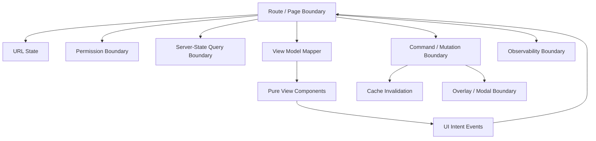
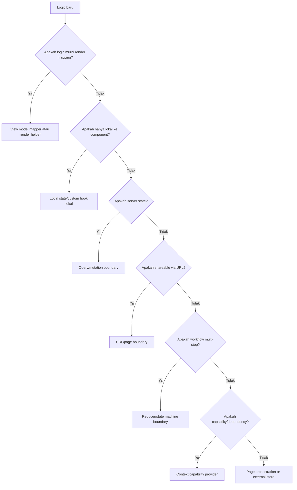

# Smart Boundaries, Not Smart Components

> Goal bagian ini: mengganti kebiasaan membuat “smart component” raksasa dengan desain boundary yang eksplisit, dapat dites, dan dapat berevolusi.

Di codebase React kecil, satu component bisa melakukan semuanya:

- baca route params,
- baca query string,
- fetch data,
- transform data,
- punya local state,
- validasi permission,
- render table,
- buka modal,
- submit mutation,
- handle toast,
- track analytics,
- navigate setelah sukses.

Di codebase besar, pola itu berubah menjadi **god component**. Masalahnya bukan karena component itu “smart”. Masalahnya karena terlalu banyak **boundary** yang dicampur dalam satu tempat.

Mental model yang benar:

```txt
Jangan tanya: component ini smart atau dumb?
Tanya: boundary apa yang sedang ia wakili?
```

Component boleh tahu banyak hal jika ia memang adalah **boundary orchestration**. Tetapi view component seharusnya tidak membawa tanggung jawab orchestration. Data hook seharusnya tidak tahu detail layout. Domain command seharusnya tidak tahu tombol mana yang memanggilnya.

---

## 1. Smart Component vs Smart Boundary

### 1.1 Smart Component yang buruk

Smart component buruk biasanya punya gejala seperti ini:

```tsx
function EnforcementCasesPage() {
  const [search, setSearch] = useState('');
  const [status, setStatus] = useState('open');
  const [selectedRows, setSelectedRows] = useState<string[]>([]);
  const [isAssignModalOpen, setAssignModalOpen] = useState(false);
  const [draftAssignee, setDraftAssignee] = useState('');

  const navigate = useNavigate();
  const permissions = usePermissions();
  const queryClient = useQueryClient();

  const casesQuery = useQuery({
    queryKey: ['cases', { search, status }],
    queryFn: () => api.cases.search({ search, status }),
  });

  const assignMutation = useMutation({
    mutationFn: api.cases.assign,
    onSuccess: () => {
      queryClient.invalidateQueries({ queryKey: ['cases'] });
      toast.success('Assigned');
      setAssignModalOpen(false);
      setSelectedRows([]);
    },
  });

  useEffect(() => {
    analytics.track('cases_page_viewed');
  }, []);

  if (!permissions.canViewCases) return <Forbidden />;
  if (casesQuery.isLoading) return <Spinner />;
  if (casesQuery.isError) return <ErrorState />;

  return (
    <div>
      {/* 400 lines of filters, table, modals, validation, mutation wiring */}
    </div>
  );
}
```

Kode di atas mungkin “works”. Tetapi ia mencampur banyak boundary:

| Responsibility | Boundary yang seharusnya eksplisit |
|---|---|
| Route/query parsing | Route/page boundary |
| Server-state fetching | Data/query boundary |
| Permission decision | Capability/authorization boundary |
| Table display | View/component boundary |
| Row selection | UI interaction boundary |
| Assign command | Command/mutation boundary |
| Modal lifecycle | Overlay workflow boundary |
| Cache invalidation | Server-state consistency boundary |
| Analytics | Observability boundary |

Ketika semuanya ada di satu component, tidak ada satu pun boundary yang terlihat jelas.

---

### 1.2 Smart Boundary yang sehat

Smart boundary sehat tidak berarti “bodoh”. Ia punya tanggung jawab besar, tetapi tanggung jawabnya **satu jenis**.

```txt
Smart boundary = boundary yang tahu cara menghubungkan beberapa subsystem,
tetapi tidak mencampur detail internal subsystem tersebut.
```

Contoh:

- `CasesPage` boleh menghubungkan URL, permission, query, command, dan view.
- `CasesTable` hanya tahu cara merender table dan mengirim event intent.
- `useCasesQuery` tahu cara membaca data server, tetapi tidak tahu modal mana yang terbuka.
- `useAssignCasesCommand` tahu mutation dan invalidation, tetapi tidak tahu button styling.
- `AssignCasesDialog` tahu form modal lokal, tetapi tidak tahu query cache global kecuali lewat `onSubmit`.

Boundary sehat punya karakter:

1. **input jelas**,
2. **output jelas**,
3. **lifetime jelas**,
4. **owner state jelas**,
5. **effect boundary jelas**,
6. **error contract jelas**,
7. **testing seam jelas**.

---

## 2. Diagram Boundary yang Diinginkan



Yang penting bukan jumlah file. Yang penting adalah **arah dependensi**.

```txt
View boleh emit intent.
Page boleh translate intent menjadi command.
Command boleh mutate server/cache.
Query boleh expose read model.
View tidak boleh langsung tahu semua subsystem itu.
```

---

## 3. Boundary Taxonomy untuk React App Besar

### 3.1 View Boundary

View boundary menjawab:

```txt
Bagaimana state tertentu ditampilkan?
Intent UI apa yang bisa keluar dari component ini?
```

View boundary tidak seharusnya tahu:

- dari mana data berasal,
- apakah data berasal dari TanStack Query, Redux, loader, atau mock,
- bagaimana mutation mengubah server,
- bagaimana cache invalidated,
- route mana yang aktif,
- analytics event mana yang dikirim.

Contoh view contract:

```tsx
type CasesTableProps = {
  rows: CaseRow[];
  selectedIds: string[];
  canAssign: boolean;
  onSelectionChange(ids: string[]): void;
  onOpenCase(caseId: string): void;
  onAssignSelected(): void;
};

export function CasesTable(props: CasesTableProps) {
  return (
    <DataTable
      rows={props.rows}
      selectedRowIds={props.selectedIds}
      onSelectedRowIdsChange={props.onSelectionChange}
      onRowClick={(row) => props.onOpenCase(row.id)}
      toolbar={
        <button
          disabled={!props.canAssign || props.selectedIds.length === 0}
          onClick={props.onAssignSelected}
        >
          Assign selected
        </button>
      }
    />
  );
}
```

Ini bukan “dumb” component dalam arti rendah nilai. Justru ini component yang punya contract kuat.

---

### 3.2 Data Boundary

Data boundary menjawab:

```txt
Bagaimana UI membaca server state?
Apa query identity-nya?
Apa freshness policy-nya?
Apa error/loading contract-nya?
```

Contoh:

```tsx
export const caseQueries = {
  search: (input: CaseSearchInput) => ({
    queryKey: ['cases', 'search', canonicalizeCaseSearch(input)] as const,
    queryFn: () => caseApi.search(input),
    staleTime: 30_000,
  }),
};

export function useCasesSearch(input: CaseSearchInput) {
  return useQuery(caseQueries.search(input));
}
```

Data boundary tidak render table. Ia hanya expose server-state read model.

---

### 3.3 Command Boundary

Command boundary menjawab:

```txt
Command apa yang bisa dilakukan user?
Precondition apa yang harus benar?
Apa efek sukses/gagalnya terhadap cache, navigation, overlay, toast, dan audit?
```

Contoh:

```tsx
type AssignCasesCommandInput = {
  caseIds: string[];
  assigneeId: string;
};

export function useAssignCasesCommand() {
  const queryClient = useQueryClient();

  const mutation = useMutation({
    mutationFn: (input: AssignCasesCommandInput) => caseApi.assign(input),
    onSuccess: async (_result, input) => {
      await Promise.all([
        queryClient.invalidateQueries({ queryKey: ['cases', 'search'] }),
        ...input.caseIds.map((caseId) =>
          queryClient.invalidateQueries({ queryKey: ['cases', 'detail', caseId] })
        ),
      ]);
    },
  });

  return {
    assignCases: mutation.mutateAsync,
    isAssigning: mutation.isPending,
  };
}
```

Command boundary bukan button handler. Button hanya mengirim intent.

---

### 3.4 Orchestration Boundary

Orchestration boundary menjawab:

```txt
Subsystem mana saja yang harus dikoneksikan agar screen ini berjalan?
```

Ia boleh menggabungkan:

- URL state,
- permission,
- query,
- command,
- modal,
- navigation,
- analytics,
- view model mapping.

Tetapi ia tidak boleh berubah menjadi tempat semua logic low-level.

Contoh:

```tsx
export function CasesPage() {
  const model = useCasesPageModel();

  if (model.kind === 'forbidden') return <ForbiddenPage />;
  if (model.kind === 'loading') return <CasesPageSkeleton />;
  if (model.kind === 'error') return <CasesPageError error={model.error} />;

  return (
    <CasesPageView
      filters={model.filters}
      rows={model.rows}
      selectedIds={model.selectedIds}
      canAssign={model.canAssign}
      isAssigning={model.isAssigning}
      onFiltersChange={model.onFiltersChange}
      onSelectionChange={model.onSelectionChange}
      onOpenCase={model.onOpenCase}
      onAssignSelected={model.onAssignSelected}
    />
  );
}
```

`CasesPage` tetap smart, tetapi smart dalam satu hal: **orchestration**.

---

## 4. Refactor dari Smart Component ke Smart Boundary

### 4.1 Before: component raksasa

```tsx
function CasesPage() {
  // URL
  // local state
  // query
  // mutation
  // permission
  // modal
  // analytics
  // render table
  // render filters
  // render modal
}
```

Masalah utama:

1. perubahan UI bisa merusak query behavior,
2. perubahan mutation bisa merusak table selection,
3. test harus mount semua dependency,
4. error/loading path sulit diverifikasi,
5. component tidak punya contract kecil,
6. rerender radius sulit dikontrol,
7. onboarding engineer baru lambat karena semua logic tersembunyi di satu file.

---

### 4.2 After: boundary extraction

```txt
cases/
  page/
    CasesPage.tsx
    useCasesPageModel.ts
  api/
    caseApi.ts
    caseQueries.ts
    caseMutations.ts
  model/
    caseSearchParams.ts
    caseViewModel.ts
    casePermissions.ts
  ui/
    CasesPageView.tsx
    CasesFilters.tsx
    CasesTable.tsx
    AssignCasesDialog.tsx
```

Pembagian ini bukan dogma folder. Ini pembagian **reason-to-change**.

| File | Reason to change |
|---|---|
| `caseQueries.ts` | query key/freshness/fetching berubah |
| `caseMutations.ts` | command lifecycle/invalidation berubah |
| `caseSearchParams.ts` | URL schema berubah |
| `caseViewModel.ts` | mapping API → UI berubah |
| `CasesTable.tsx` | table rendering/interaction berubah |
| `useCasesPageModel.ts` | orchestration screen berubah |

---

## 5. `useCasesPageModel`: Page-Local Orchestration Hook

Page model hook bisa menjadi boundary orchestration untuk screen.

```tsx
type CasesPageModel =
  | { kind: 'forbidden' }
  | { kind: 'loading' }
  | { kind: 'error'; error: unknown }
  | {
      kind: 'ready';
      filters: CaseFilters;
      rows: CaseRow[];
      selectedIds: string[];
      canAssign: boolean;
      isAssigning: boolean;
      onFiltersChange(next: CaseFilters): void;
      onSelectionChange(ids: string[]): void;
      onOpenCase(caseId: string): void;
      onAssignSelected(): void;
    };

export function useCasesPageModel(): CasesPageModel {
  const navigate = useNavigate();
  const [searchParams, setSearchParams] = useSearchParams();
  const filters = parseCaseFilters(searchParams);

  const permissions = useCasePermissions();
  const [selectedIds, setSelectedIds] = useState<string[]>([]);
  const assignDialog = useAssignCasesDialog();

  const casesQuery = useCasesSearch(filters);
  const assignCommand = useAssignCasesCommand();

  usePageViewed('cases');

  if (!permissions.canViewCases) {
    return { kind: 'forbidden' };
  }

  if (casesQuery.isPending) {
    return { kind: 'loading' };
  }

  if (casesQuery.isError) {
    return { kind: 'error', error: casesQuery.error };
  }

  return {
    kind: 'ready',
    filters,
    rows: toCaseRows(casesQuery.data),
    selectedIds,
    canAssign: permissions.canAssignCases,
    isAssigning: assignCommand.isAssigning,
    onFiltersChange(next) {
      setSearchParams(serializeCaseFilters(next));
      setSelectedIds([]);
    },
    onSelectionChange: setSelectedIds,
    onOpenCase(caseId) {
      navigate(`/cases/${caseId}`);
    },
    async onAssignSelected() {
      const result = await assignDialog.open({ caseIds: selectedIds });
      if (result.kind !== 'confirmed') return;

      await assignCommand.assignCases({
        caseIds: selectedIds,
        assigneeId: result.assigneeId,
      });

      setSelectedIds([]);
    },
  };
}
```

Ini masih smart. Tetapi kecerdasannya terkonsentrasi sebagai **model orchestration**.

View tinggal menerima state + intent handlers:

```tsx
export function CasesPageView(props: Extract<CasesPageModel, { kind: 'ready' }>) {
  return (
    <PageShell title="Cases">
      <CasesFilters value={props.filters} onChange={props.onFiltersChange} />
      <CasesTable
        rows={props.rows}
        selectedIds={props.selectedIds}
        canAssign={props.canAssign}
        onSelectionChange={props.onSelectionChange}
        onOpenCase={props.onOpenCase}
        onAssignSelected={props.onAssignSelected}
      />
    </PageShell>
  );
}
```

---

## 6. Boundary Contract: Input, Output, Lifetime, Authority

Setiap boundary harus bisa dijelaskan dengan empat pertanyaan.

### 6.1 Input

```txt
Apa yang boundary ini baca?
```

Contoh:

- URL params,
- props,
- context capability,
- query cache,
- external store,
- browser API,
- server response.

### 6.2 Output

```txt
Apa yang boundary ini hasilkan?
```

Contoh:

- JSX,
- view model,
- command function,
- event handler,
- query option,
- serialized URL,
- analytics event.

### 6.3 Lifetime

```txt
Berapa lama state/efek boundary ini hidup?
```

Contoh:

| Boundary | Lifetime |
|---|---|
| Row hover | pointer interaction |
| Dialog draft | dialog session |
| Page filters | URL/session |
| Query cache | cache policy |
| Selected rows | page lifetime |
| Permission snapshot | user/session/request |
| Workflow machine | workflow lifetime |

### 6.4 Authority

```txt
Siapa sumber kebenaran?
```

Contoh:

- server authority untuk case status,
- URL authority untuk shareable filters,
- local component authority untuk open/closed dropdown,
- parent authority untuk controlled selected row,
- external store authority untuk cross-tree client state.

Jika authority tidak jelas, state akan digandakan.

---

## 7. Read Model vs Command Model

Boundary yang baik memisahkan:

```txt
read model  = data yang dibutuhkan UI untuk render
command     = tindakan yang mengubah sesuatu
```

Bad:

```tsx
<CasesTable
  query={casesQuery}
  mutation={assignMutation}
  queryClient={queryClient}
/>
```

Component view sekarang tahu terlalu banyak.

Better:

```tsx
<CasesTable
  rows={rows}
  selectedIds={selectedIds}
  canAssign={canAssign}
  isAssigning={isAssigning}
  onSelectionChange={setSelectedIds}
  onAssignSelected={handleAssignSelected}
/>
```

View hanya melihat read model dan mengirim intent.

---

## 8. Boundary Ownership Matrix

Gunakan matrix ini saat review PR.

| Concern | Tempat yang tepat | Jangan taruh di |
|---|---|---|
| Button style | UI component | page model |
| Query key | data/query module | table component |
| Cache invalidation | command/mutation module | modal view |
| URL parsing | route/page boundary | deeply nested filter input |
| Permission decision | capability/domain boundary | random button scattered logic |
| Local draft | dialog/form component | global store |
| Selected rows | page boundary/table owner | server cache |
| Analytics page view | page boundary/effect hook | reusable table |
| Domain event naming | command/domain module | DOM handler inline |
| Loading layout | page/suspense boundary | every leaf component |

---

## 9. Smart Boundary Patterns

### 9.1 View Model Mapper

Jangan biarkan API response menyebar ke seluruh view.

```tsx
export function toCaseRows(result: CaseSearchResult): CaseRow[] {
  return result.items.map((item) => ({
    id: item.id,
    reference: item.referenceNumber,
    subject: item.subjectName ?? 'Unknown subject',
    statusLabel: formatCaseStatus(item.status),
    assignedToLabel: item.assignee?.name ?? 'Unassigned',
    updatedAtLabel: formatRelativeDate(item.updatedAt),
  }));
}
```

Manfaat:

- UI tidak tergantung raw API shape,
- formatting centralized,
- test mapping mudah,
- perubahan API tidak memaksa rewrite table.

---

### 9.2 Domain Hook Boundary

Domain hook bukan sekadar wrapper `useQuery`. Ia bisa menjadi domain-specific read model.

```tsx
export function useAssignableCases(filters: CaseFilters) {
  const permissions = useCasePermissions();
  const query = useCasesSearch(filters);

  return {
    ...query,
    rows: query.data ? toCaseRows(query.data) : [],
    canAssign: permissions.canAssignCases,
  };
}
```

Tetapi jangan overdo. Jika hook mulai tahu modal, navigation, toast, dan table selection, ia berubah menjadi page model.

---

### 9.3 Command Hook Boundary

Command hook bagus ketika command punya lifecycle yang konsisten.

```tsx
export function useCloseCaseCommand() {
  const queryClient = useQueryClient();
  const audit = useAuditLogger();

  return useMutation({
    mutationFn: caseApi.close,
    onSuccess: async (_result, input) => {
      audit.log('case.closed', { caseId: input.caseId });
      await queryClient.invalidateQueries({ queryKey: ['cases'] });
    },
  });
}
```

Command hook harus menyembunyikan detail technical, tetapi tidak menyembunyikan domain precondition.

```tsx
function assertCanCloseCase(input: CloseCaseInput) {
  if (!input.reason.trim()) {
    throw new Error('Close reason is required');
  }
}
```

---

### 9.4 Capability Boundary

Permission/capability tidak seharusnya tersebar sebagai string magic.

Bad:

```tsx
{user.permissions.includes('CASE_ASSIGN') && <AssignButton />}
```

Better:

```tsx
const capabilities = useCaseCapabilities(caseSnapshot);

<AssignButton disabled={!capabilities.canAssign} />
```

Atau untuk subtree:

```tsx
<CaseCapabilityProvider caseId={caseId}>
  <CaseHeader />
  <CaseActions />
</CaseCapabilityProvider>
```

Capability boundary membantu menjaga perbedaan:

- **boleh melihat**,
- **boleh mencoba**,
- **boleh submit**,
- **server akhirnya menerima**.

UI permission bukan security boundary final. Server tetap otoritatif.

---

## 10. File Boundary vs Runtime Boundary

Folder rapi tidak otomatis berarti boundary benar.

Bad:

```txt
components/
  CasesTable.tsx    // imports queryClient, navigate, modal, API, permissions
```

Good:

```txt
features/cases/
  api/              // server-state adapter
  model/            // domain/view model/permission
  ui/               // rendering component
  page/             // orchestration composition
```

Yang penting:

```txt
UI tidak import API.
API tidak import UI.
Model tidak import route component.
Page boleh import semuanya untuk wiring.
```

---

## 11. Testing Smart Boundaries

### 11.1 Test view sebagai pure behavior

```tsx
it('emits assign intent when assign button is clicked', async () => {
  const onAssignSelected = vi.fn();

  render(
    <CasesTable
      rows={[caseRow({ id: 'c1' })]}
      selectedIds={['c1']}
      canAssign={true}
      onSelectionChange={vi.fn()}
      onOpenCase={vi.fn()}
      onAssignSelected={onAssignSelected}
    />
  );

  await user.click(screen.getByRole('button', { name: /assign selected/i }));

  expect(onAssignSelected).toHaveBeenCalledOnce();
});
```

View test tidak butuh QueryClient, router, permission provider, atau server mock.

---

### 11.2 Test mapper sebagai deterministic function

```tsx
it('maps unassigned case into row label', () => {
  const result = toCaseRows(
    caseSearchResult({
      items: [caseDto({ id: 'c1', assignee: null })],
    })
  );

  expect(result[0].assignedToLabel).toBe('Unassigned');
});
```

---

### 11.3 Test command boundary with cache expectation

```tsx
it('invalidates cases after assign command succeeds', async () => {
  const queryClient = createTestQueryClient();
  const invalidateSpy = vi.spyOn(queryClient, 'invalidateQueries');

  server.use(assignCasesSuccess());

  const { result } = renderHook(() => useAssignCasesCommand(), {
    wrapper: createQueryClientWrapper(queryClient),
  });

  await result.current.assignCases({
    caseIds: ['c1'],
    assigneeId: 'u1',
  });

  expect(invalidateSpy).toHaveBeenCalledWith({ queryKey: ['cases', 'search'] });
});
```

---

### 11.4 Test page model as integration seam

Page model test boleh lebih integration-heavy:

- router harness,
- query client,
- permission provider,
- mocked API,
- modal fake,
- navigation assertion.

Tujuannya bukan mengetes button. Tujuannya mengetes wiring.

---

## 12. Failure Modes

### 12.1 God component disguised as page

Gejala:

- satu file > 500 baris,
- 10+ hooks berbeda,
- query, mutation, modal, table, validation semua inline,
- sulit membuat unit test kecil,
- setiap perubahan menyebabkan snapshot test besar berubah.

Refactor:

1. extract view component,
2. extract query boundary,
3. extract command hook,
4. extract view model mapper,
5. extract modal workflow,
6. sisakan page sebagai wiring boundary.

---

### 12.2 Fake separation

Gejala:

```tsx
function CasesTable() {
  const query = useCasesSearch();
  const navigate = useNavigate();
  const modal = useModal();
  // still smart, just moved file
}
```

Masalahnya bukan lokasi file. Masalahnya boundary salah.

Refactor:

```tsx
function CasesTable(props: CasesTableProps) {
  // render + emit intent only
}
```

---

### 12.3 Domain leakage into view

Gejala:

```tsx
<button disabled={case.status !== 'OPEN' || user.role !== 'SUPERVISOR'}>
  Assign
</button>
```

Refactor:

```tsx
<button disabled={!capabilities.canAssign}>Assign</button>
```

View tidak perlu tahu rule domain detail.

---

### 12.4 Transport leakage into UI

Gejala:

```tsx
if (error.response.status === 409) {
  return <ConflictBanner />;
}
```

Refactor error adapter:

```tsx
const errorState = toCasePageError(error);

if (errorState.kind === 'conflict') {
  return <ConflictBanner message={errorState.message} />;
}
```

---

### 12.5 Command hidden in render

Gejala:

```tsx
if (shouldAutoAssign) {
  assignMutation.mutate(...);
}
```

Render harus tetap pure. Command harus terjadi dari event, action, effect synchronization yang benar-benar diperlukan, atau explicit workflow transition.

---

### 12.6 Boundary terlalu kecil

Over-extraction juga berbahaya.

Gejala:

- 20 file untuk satu form sederhana,
- membaca flow harus lompat ke 12 tempat,
- abstraction hanya punya satu call site,
- nama generic seperti `useLogic`, `useHandlers`, `useUtils`.

Refactor:

```txt
Boundary muncul ketika ada reason-to-change berbeda,
bukan sekadar karena function bisa diekstrak.
```

---

## 13. Decision Framework

Saat ingin menaruh logic, gunakan urutan ini.



---

## 14. Practical Review Checklist

Gunakan checklist ini saat review React PR besar.

```txt
[ ] Apakah component view meng-import API/client/cache/router tanpa alasan kuat?
[ ] Apakah callback props merepresentasikan intent, bukan implementasi internal?
[ ] Apakah query key dan invalidation hidup di data/command boundary?
[ ] Apakah permission rule tersebar di JSX?
[ ] Apakah URL parsing tersebar di nested component?
[ ] Apakah modal punya result contract, bukan mutasi global tersembunyi?
[ ] Apakah page boundary hanya wiring, bukan tempat rendering detail raksasa?
[ ] Apakah server response di-map menjadi view model sebelum masuk UI kompleks?
[ ] Apakah command dapat dites tanpa render full page?
[ ] Apakah view dapat dites tanpa QueryClient/router/provider berat?
[ ] Apakah ada duplicated source of truth antara page, URL, cache, dan local state?
[ ] Apakah render tetap pure tanpa command/mutation di body component?
```

---

## 15. Latihan Implementasi

Ambil satu page kompleks di project Anda. Pecah menjadi boundary berikut:

```txt
1. Route/Page boundary
2. Query boundary
3. Mutation/command boundary
4. Permission/capability boundary
5. View model mapper
6. Pure view components
7. Modal/workflow boundary
8. Observability boundary
```

Lalu tulis ADR singkat:

```md
# ADR: Cases Page Boundary Split

## Problem
CasesPage mencampur query, mutation, modal, permission, dan rendering.

## Decision
Page tetap menjadi orchestration boundary. Query, command, mapper, dan view dipisah.

## Consequences
- View lebih mudah dites.
- Query/invalidation punya owner jelas.
- Page masih menjadi integration seam.
- Abstraction count bertambah, tetapi sesuai reason-to-change.
```

---

## 16. Ringkasan

Smart boundary bukan berarti semua component harus bodoh. Smart boundary berarti setiap bagian sistem tahu **jenis kecerdasan** apa yang boleh ia miliki.

```txt
View pintar dalam rendering dan interaction contract.
Query boundary pintar dalam server-state reading.
Command boundary pintar dalam mutation lifecycle.
Capability boundary pintar dalam permission/capability decision.
Page boundary pintar dalam orchestration.
```

Yang harus dihindari adalah satu component yang pintar dalam semuanya sekaligus.

React application yang scalable bukan dibangun dari banyak component kecil secara acak. Ia dibangun dari boundary yang menjawab:

```txt
Siapa membaca apa?
Siapa mengubah apa?
Siapa memiliki state apa?
Siapa bertanggung jawab atas lifecycle apa?
Siapa boleh tahu detail subsystem apa?
```

Jika pertanyaan itu jelas, component architecture menjadi bisa dijaga.

---

## References

- React Docs — Components and Hooks must be pure: https://react.dev/reference/rules/components-and-hooks-must-be-pure
- React Docs — Passing props to a component: https://react.dev/learn/passing-props-to-a-component
- React Docs — Sharing state between components: https://react.dev/learn/sharing-state-between-components
- React Docs — Scaling up with reducer and context: https://react.dev/learn/scaling-up-with-reducer-and-context
- TanStack Query Docs — Query Invalidation: https://tanstack.com/query/latest/docs/framework/react/guides/query-invalidation
