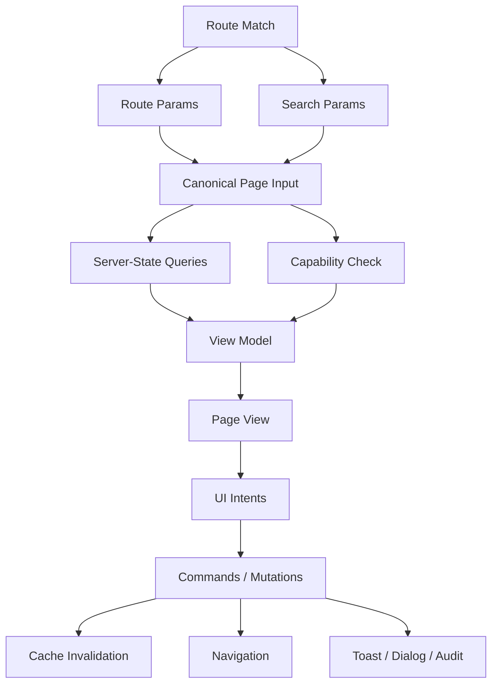

# Page Orchestration Layer

> Goal bagian ini: menjadikan page sebagai **composition root** yang menghubungkan route, URL state, server state, permission, command, workflow, dan view—tanpa berubah menjadi god component.

Dalam React app besar, page adalah tempat di mana banyak sistem bertemu:

- router,
- URL params,
- search params,
- layout,
- permission,
- server-state query,
- mutation command,
- modal workflow,
- feature flags,
- analytics,
- error/loading boundary,
- view composition.

Karena itu, page hampir pasti “smart”. Tetapi page tidak boleh menjadi tempat semua detail low-level.

Mental model:

```txt
Page is a composition root, not a dumping ground.
```

Page orchestration layer harus menjawab:

```txt
Apa screen ini?
Data apa yang dibutuhkan?
State mana yang hidup di URL?
Command apa yang tersedia?
Permission apa yang membatasi action?
Boundary loading/error apa yang tepat?
View mana yang menerima read model?
```

---

## 1. Page Layer sebagai Composition Root

Composition root adalah tempat dependencies dihubungkan.

Di backend, composition root mungkin ada di app startup, controller, atau dependency injection module. Di frontend React, page/route sering menjadi composition root untuk satu user journey.



Page orchestration bukan “render semua markup”. Ia adalah **wiring layer**.

---

## 2. Apa yang Boleh Hidup di Page Layer?

### 2.1 Boleh

Page layer boleh memiliki:

| Concern | Kenapa boleh di page? |
|---|---|
| Route params | Page adalah representasi route |
| Search params | Page menentukan URL schema screen |
| Query orchestration | Page tahu data apa yang dibutuhkan screen |
| Permission gating | Page tahu user journey yang tersedia |
| Layout-level loading/error | Page menentukan fallback screen |
| Navigation command | Page tahu destination route |
| Modal workflow | Page mengkoordinasikan user journey |
| View model mapping | Page menjembatani data shape ke UI shape |
| Analytics page event | Page adalah unit observability yang natural |
| Selection/filter state | Jika state lifetime adalah page lifetime |

---

### 2.2 Tidak boleh

Page layer sebaiknya tidak berisi:

| Concern | Tempat lebih tepat |
|---|---|
| Button styling | design system / UI component |
| Table rendering detail | table/view component |
| Query key construction low-level | query module/key factory |
| HTTP transport detail | API adapter |
| Domain permission rule raw | capability/domain module |
| Mutation invalidation detail kompleks | command/mutation boundary |
| Field-level validation detail | form model/schema |
| Large reducer transition table | reducer/machine module |
| Persistent storage adapter | storage/external store module |

Page layer boleh memanggil hal-hal itu, tetapi tidak perlu membawa detail internalnya.

---

## 3. Page Input: Canonicalize Route + URL State

Page orchestration dimulai dari input.

Bad:

```tsx
const status = searchParams.get('status') || 'open';
const page = Number(searchParams.get('page') || 1);
const q = searchParams.get('q') || '';

// logic parsing ini lalu disalin ke banyak component
```

Better:

```tsx
export type CaseSearchPageInput = {
  query: string;
  status: CaseStatusFilter;
  page: number;
  pageSize: number;
};

export function parseCaseSearchPageInput(searchParams: URLSearchParams): CaseSearchPageInput {
  return {
    query: searchParams.get('q')?.trim() ?? '',
    status: parseStatusFilter(searchParams.get('status')),
    page: clampPositiveInteger(searchParams.get('page'), 1),
    pageSize: clampPageSize(searchParams.get('pageSize'), 25),
  };
}

export function serializeCaseSearchPageInput(input: CaseSearchPageInput): URLSearchParams {
  const params = new URLSearchParams();

  if (input.query) params.set('q', input.query);
  if (input.status !== 'all') params.set('status', input.status);
  if (input.page !== 1) params.set('page', String(input.page));
  if (input.pageSize !== 25) params.set('pageSize', String(input.pageSize));

  return params;
}
```

Parsing URL harus punya invariant:

```txt
Invalid URL tidak boleh membuat screen crash.
Invalid URL harus di-canonicalize menjadi input valid.
Serialization harus stabil.
Default value jangan menulis noise ke URL.
```

---

## 4. Query Boundary di Page Layer

Page layer sebaiknya tidak membuat query key inline panjang.

Bad:

```tsx
const query = useQuery({
  queryKey: ['cases', status, q, page, pageSize, user.tenantId],
  queryFn: () => fetch(`/api/cases?...`).then((r) => r.json()),
});
```

Better:

```tsx
export const caseQueryKeys = {
  all: ['cases'] as const,
  search: (tenantId: string, input: CaseSearchPageInput) =>
    [...caseQueryKeys.all, 'search', tenantId, canonicalizeCaseSearchInput(input)] as const,
  detail: (tenantId: string, caseId: string) =>
    [...caseQueryKeys.all, 'detail', tenantId, caseId] as const,
};

export function caseSearchQueryOptions(tenantId: string, input: CaseSearchPageInput) {
  return {
    queryKey: caseQueryKeys.search(tenantId, input),
    queryFn: () => caseApi.search({ tenantId, ...input }),
    staleTime: 30_000,
  };
}

export function useCaseSearchQuery(tenantId: string, input: CaseSearchPageInput) {
  return useQuery(caseSearchQueryOptions(tenantId, input));
}
```

Page memakai query boundary:

```tsx
const casesQuery = useCaseSearchQuery(tenantId, pageInput);
```

Dengan ini, page tahu **apa** yang dibaca, tetapi tidak memegang detail **bagaimana query identity dibangun**.

---

## 5. Page Model Pattern

Page model adalah read model + commands yang siap diberikan ke view.

```tsx
type CasesPageModel =
  | { kind: 'forbidden' }
  | { kind: 'loading' }
  | { kind: 'error'; error: PageError }
  | {
      kind: 'ready';
      input: CaseSearchPageInput;
      rows: CaseRow[];
      totalCount: number;
      selectedIds: string[];
      capabilities: CasePageCapabilities;
      pending: {
        assign: boolean;
        close: boolean;
      };
      commands: {
        changeInput(next: CaseSearchPageInput): void;
        selectRows(ids: string[]): void;
        openCase(caseId: string): void;
        assignSelected(): Promise<void>;
        closeCase(caseId: string): Promise<void>;
      };
    };
```

Manfaat discriminated union:

- UI tidak perlu menebak `data` undefined,
- forbidden/loading/error/ready eksplisit,
- impossible state berkurang,
- test bisa langsung menarget state tertentu.

---

## 6. Implementasi `useCasesPageModel`

```tsx
export function useCasesPageModel(): CasesPageModel {
  const navigate = useNavigate();
  const [searchParams, setSearchParams] = useSearchParams();

  const tenant = useTenantContext();
  const currentUser = useCurrentUser();

  const input = parseCaseSearchPageInput(searchParams);
  const capabilities = useCasePageCapabilities({ user: currentUser, tenantId: tenant.id });

  const [selectedIds, setSelectedIds] = useState<string[]>([]);

  const casesQuery = useCaseSearchQuery(tenant.id, input);
  const assignCommand = useAssignCasesCommand({ tenantId: tenant.id });
  const closeCommand = useCloseCaseCommand({ tenantId: tenant.id });
  const assignDialog = useAssignCasesDialog();
  const closeDialog = useCloseCaseDialog();

  usePageAnalytics('cases.search', {
    tenantId: tenant.id,
    status: input.status,
  });

  if (!capabilities.canView) {
    return { kind: 'forbidden' };
  }

  if (casesQuery.isPending) {
    return { kind: 'loading' };
  }

  if (casesQuery.isError) {
    return { kind: 'error', error: toPageError(casesQuery.error) };
  }

  return {
    kind: 'ready',
    input,
    rows: toCaseRows(casesQuery.data.items),
    totalCount: casesQuery.data.totalCount,
    selectedIds,
    capabilities,
    pending: {
      assign: assignCommand.isPending,
      close: closeCommand.isPending,
    },
    commands: {
      changeInput(next) {
        setSearchParams(serializeCaseSearchPageInput({ ...next, page: 1 }));
        setSelectedIds([]);
      },
      selectRows(ids) {
        setSelectedIds(ids);
      },
      openCase(caseId) {
        navigate(`/cases/${caseId}`);
      },
      async assignSelected() {
        if (selectedIds.length === 0) return;
        if (!capabilities.canAssign) return;

        const result = await assignDialog.open({ caseIds: selectedIds });
        if (result.kind !== 'confirmed') return;

        await assignCommand.assignCases({
          caseIds: selectedIds,
          assigneeId: result.assigneeId,
        });

        setSelectedIds([]);
      },
      async closeCase(caseId) {
        if (!capabilities.canClose) return;

        const result = await closeDialog.open({ caseId });
        if (result.kind !== 'confirmed') return;

        await closeCommand.closeCase({
          caseId,
          reason: result.reason,
        });
      },
    },
  };
}
```

Catatan penting:

```txt
Page model boleh mengorkestrasi banyak boundary.
Tetapi setiap boundary tetap punya modul internal sendiri.
```

---

## 7. Page View: Pure Read Model + Intent

Page view tidak perlu tahu QueryClient, router, API, atau permission engine.

```tsx
export function CasesPageRoute() {
  const model = useCasesPageModel();

  if (model.kind === 'forbidden') return <ForbiddenPage />;
  if (model.kind === 'loading') return <CasesPageSkeleton />;
  if (model.kind === 'error') return <CasesPageError error={model.error} />;

  return <CasesPageView model={model} />;
}

function CasesPageView({ model }: { model: Extract<CasesPageModel, { kind: 'ready' }> }) {
  return (
    <PageShell title="Cases">
      <CasesFilters value={model.input} onChange={model.commands.changeInput} />

      <CasesToolbar
        selectedCount={model.selectedIds.length}
        canAssign={model.capabilities.canAssign}
        isAssigning={model.pending.assign}
        onAssignSelected={model.commands.assignSelected}
      />

      <CasesTable
        rows={model.rows}
        selectedIds={model.selectedIds}
        totalCount={model.totalCount}
        onSelectionChange={model.commands.selectRows}
        onOpenCase={model.commands.openCase}
        onCloseCase={model.commands.closeCase}
      />
    </PageShell>
  );
}
```

Ini membuat page route sebagai boundary:

```txt
Route component = memilih state branch.
Page view = menampilkan ready state.
Child component = render + emit intent.
```

---

## 8. Route Loaders vs Client Query

Jika memakai framework/router yang mendukung data loading, Anda harus menentukan boundary data.

### 8.1 Loader cocok untuk

- route-critical data,
- SSR/pre-render/hydration,
- auth redirect sebelum render,
- data yang menentukan layout route,
- menghindari waterfall awal.

### 8.2 Client query cocok untuk

- highly interactive data,
- background refetch,
- cache sharing antar screen,
- optimistic updates,
- infinite lists,
- polling/realtime-ish update,
- mutation-driven invalidation.

### 8.3 Hybrid pattern

```tsx
// route loader prefetches critical query
export async function loader({ request, context }: LoaderArgs) {
  const url = new URL(request.url);
  const input = parseCaseSearchPageInput(url.searchParams);
  const tenantId = await requireTenantId(context);

  await context.queryClient.ensureQueryData(
    caseSearchQueryOptions(tenantId, input)
  );

  return { tenantId, input };
}

export function CasesRoute() {
  const loaderData = useLoaderData<typeof loader>();
  return <CasesPage tenantId={loaderData.tenantId} initialInput={loaderData.input} />;
}
```

Ini membuat loader sebagai prefetch/route boundary, tetapi TanStack Query tetap menjadi server-state cache boundary.

---

## 9. Suspense and Error Boundary Placement

Page orchestration harus memilih boundary yang benar.

Bad:

```tsx
function CasesPage() {
  const query = useQuery(...);

  if (query.isLoading) return <Spinner />;
  if (query.isError) return <div>Error</div>;

  return <BigPage />;
}
```

Ini kadang cukup. Tetapi untuk screen besar, loading/error boundary sebaiknya dipikirkan secara UX.

```tsx
export function CasesRouteBoundary() {
  return (
    <ErrorBoundary fallback={<CasesPageCrashFallback />}>
      <Suspense fallback={<CasesPageSkeleton />}>
        <CasesPage />
      </Suspense>
    </ErrorBoundary>
  );
}
```

Nested boundary bisa lebih baik:

```tsx
<PageShell title="Cases">
  <CasesFilters />

  <ErrorBoundary fallback={<CasesTableError />}>
    <Suspense fallback={<CasesTableSkeleton />}>
      <CasesTableRegion />
    </Suspense>
  </ErrorBoundary>

  <Suspense fallback={<CaseStatsSkeleton />}>
    <CaseStatsRegion />
  </Suspense>
</PageShell>
```

Rule:

```txt
Boundary harus mengikuti UX recovery unit.
Jika user bisa memulihkan table tanpa merusak seluruh page, table punya boundary sendiri.
Jika seluruh page invalid, page punya boundary sendiri.
```

---

## 10. Permission and Capability Orchestration

Permission di page bukan hanya hide/show button.

Page harus membedakan:

| State | Meaning |
|---|---|
| cannot view page | render forbidden/redirect |
| can view but cannot act | render read-only UI |
| can start action | enable action trigger |
| action rejected by server | render authoritative error |
| capability changed after load | invalidate/refetch/refresh permission snapshot |

Contoh capability shape:

```tsx
type CasePageCapabilities = {
  canView: boolean;
  canCreate: boolean;
  canAssign: boolean;
  canClose: boolean;
  readOnlyReason?: string;
};

export function useCasePageCapabilities(input: {
  user: CurrentUser;
  tenantId: string;
}): CasePageCapabilities {
  return {
    canView: hasCapability(input.user, 'case:view', input.tenantId),
    canCreate: hasCapability(input.user, 'case:create', input.tenantId),
    canAssign: hasCapability(input.user, 'case:assign', input.tenantId),
    canClose: hasCapability(input.user, 'case:close', input.tenantId),
  };
}
```

Jangan jadikan UI permission sebagai security final. Server tetap harus enforce authorization.

---

## 11. Command Orchestration in Page

Page command menggabungkan beberapa tahap:

```txt
user intent
→ precondition
→ confirmation/modal
→ mutation
→ cache invalidation/direct cache update
→ UI local state cleanup
→ feedback
→ navigation/close
```

Contoh:

```tsx
async function closeCase(caseId: string) {
  if (!capabilities.canClose) {
    toast.error('You do not have permission to close this case.');
    return;
  }

  const confirmation = await closeDialog.open({ caseId });
  if (confirmation.kind !== 'confirmed') return;

  try {
    await closeCommand.closeCase({
      caseId,
      reason: confirmation.reason,
    });

    toast.success('Case closed.');
  } catch (error) {
    const pageError = toPageError(error);
    toast.error(pageError.message);
  }
}
```

Jika command logic mulai panjang, extract command orchestrator:

```tsx
export function useCloseCaseWorkflow(input: {
  tenantId: string;
  capabilities: CasePageCapabilities;
}) {
  const dialog = useCloseCaseDialog();
  const command = useCloseCaseCommand({ tenantId: input.tenantId });
  const toast = useToast();

  return {
    isPending: command.isPending,
    async closeCase(caseId: string) {
      if (!input.capabilities.canClose) return;

      const confirmation = await dialog.open({ caseId });
      if (confirmation.kind !== 'confirmed') return;

      await command.closeCase({ caseId, reason: confirmation.reason });
      toast.success('Case closed.');
    },
  };
}
```

Page tetap orchestration root, tetapi workflow detail punya boundary.

---

## 12. Page State Topology

Dalam satu page, biasanya ada beberapa jenis state.

| State | Owner | Reason |
|---|---|---|
| Route param `caseId` | router | URL identity |
| Search/filter params | URL/page | shareable, browser navigation |
| Query data | server-state cache | server authority, freshness |
| Selected row IDs | page | page interaction lifetime |
| Open modal | overlay/page workflow | transient workflow |
| Draft form field | form/modal | local draft lifetime |
| Mutation pending | mutation boundary | command lifecycle |
| Permission snapshot | capability boundary | user/session/domain |
| Toast | app capability provider | cross-cutting feedback |

Page layer harus menjaga state tidak pindah ke tempat yang salah.

Bad:

```tsx
// selectedRows disimpan di URL padahal tidak shareable
?selected=c1,c2,c3,c4,c5
```

Bad:

```tsx
// server data disalin ke local state tanpa alasan
const [cases, setCases] = useState(query.data?.items ?? []);
```

Better:

```tsx
const rows = query.data ? toCaseRows(query.data.items) : [];
```

---

## 13. Navigation as Command Consequence

Navigation bukan hanya UI detail. Dalam page orchestration, navigation sering menjadi consequence dari command.

Contoh create case:

```tsx
async function createCase(input: CreateCaseFormInput) {
  const result = await createCaseCommand.createCase(input);
  navigate(`/cases/${result.caseId}`, { replace: true });
}
```

Pertanyaan penting:

```txt
Apakah navigation terjadi sebelum atau sesudah cache invalidation?
Apakah destination page membutuhkan prefetch?
Apakah replace atau push history?
Apakah back button harus kembali ke search result?
Apakah draft harus dibersihkan setelah navigation?
```

Navigation adalah bagian dari workflow.

---

## 14. Observability at Page Boundary

Page boundary adalah tempat natural untuk observability karena page tahu konteks user journey.

```tsx
export function useCasesPageAnalytics(input: {
  tenantId: string;
  filters: CaseSearchPageInput;
}) {
  useEffect(() => {
    analytics.track('cases_page_viewed', {
      tenantId: input.tenantId,
      status: input.filters.status,
    });
  }, [input.tenantId, input.filters.status]);
}
```

Tetapi hati-hati dependency.

Jika `filters` object dibuat ulang setiap render, effect bisa terkirim berulang. Gunakan canonical primitive atau stable serialized key.

```tsx
const analyticsKey = `${tenantId}:${input.status}`;

useEffect(() => {
  analytics.track('cases_page_viewed', { tenantId, status: input.status });
}, [analyticsKey]);
```

Atau lebih eksplisit:

```tsx
useEffect(() => {
  analytics.track('cases_page_viewed', { tenantId, status: input.status });
}, [tenantId, input.status]);
```

---

## 15. Testing Page Orchestration

### 15.1 Test URL parsing separately

```tsx
it('parses invalid page as page 1', () => {
  const input = parseCaseSearchPageInput(new URLSearchParams('page=-10'));
  expect(input.page).toBe(1);
});
```

### 15.2 Test query options separately

```tsx
it('includes tenant and canonical input in query key', () => {
  const options = caseSearchQueryOptions('tenant-1', {
    query: 'abc',
    status: 'open',
    page: 1,
    pageSize: 25,
  });

  expect(options.queryKey).toEqual([
    'cases',
    'search',
    'tenant-1',
    { query: 'abc', status: 'open', page: 1, pageSize: 25 },
  ]);
});
```

### 15.3 Test view without router/query

```tsx
it('renders assign button disabled when user cannot assign', () => {
  render(
    <CasesPageView
      model={readyCasesModel({
        capabilities: { canView: true, canAssign: false, canClose: false, canCreate: false },
        selectedIds: ['c1'],
      })}
    />
  );

  expect(screen.getByRole('button', { name: /assign/i })).toBeDisabled();
});
```

### 15.4 Test route integration with providers

```tsx
it('updates URL when filters change', async () => {
  const router = createMemoryRouter([
    { path: '/cases', element: <CasesRoute /> },
  ], {
    initialEntries: ['/cases?status=open'],
  });

  render(<RouterProvider router={router} />, {
    wrapper: createAppTestProviders(),
  });

  await user.selectOptions(screen.getByLabelText(/status/i), 'closed');

  expect(router.state.location.search).toContain('status=closed');
});
```

Page test boleh berat, tapi jangan jadikan semua behavior hanya bisa dites lewat page test.

---

## 16. Failure Modes

### 16.1 Page sebagai dumping ground

Gejala:

- page file sangat panjang,
- semua query/mutation inline,
- table markup besar di page,
- modal form logic di page,
- permission rule raw di JSX,
- test page menjadi satu-satunya test.

Refactor:

```txt
Extract query options.
Extract command hook.
Extract page model.
Extract view component.
Extract modal workflow.
Extract view model mapper.
```

---

### 16.2 Page terlalu tipis

Ada kebalikan yang juga buruk: page hanya pass-through, sementara orchestration tersebar di child.

```tsx
function CasesPage() {
  return <CasesTable />;
}

function CasesTable() {
  const searchParams = useSearchParams();
  const query = useQuery(...);
  const navigate = useNavigate();
  const mutation = useMutation(...);
}
```

Ini membuat route/page boundary hilang. Child table berubah menjadi page tersembunyi.

---

### 16.3 URL state dan local state tidak sinkron

Gejala:

```tsx
const [filters, setFilters] = useState(parse(searchParams));

useEffect(() => {
  setFilters(parse(searchParams));
}, [searchParams]);
```

Ini sering membuat double source of truth.

Better:

```tsx
const filters = parseCaseSearchPageInput(searchParams);
```

Jika perlu draft sebelum commit ke URL:

```tsx
const [draft, setDraft] = useState(filters);

function applyFilters() {
  setSearchParams(serializeCaseSearchPageInput(draft));
}
```

Bedakan:

```txt
draft filter = local state
committed filter = URL state
```

---

### 16.4 Query key tidak mengikuti page input

Gejala:

- filter berubah tetapi data lama tetap muncul,
- query collision antar tenant,
- pagination bercampur,
- invalidation terlalu luas.

Fix:

```txt
Setiap variable yang memengaruhi queryFn harus masuk queryKey.
Canonicalize input sebelum menjadi key.
Masukkan tenant/security scope jika data berbeda per scope.
```

---

### 16.5 Permission hanya di button

Gejala:

```tsx
{canAssign && <AssignButton />}
```

Tetapi command masih bisa dipanggil dari keyboard shortcut, URL action, atau stale UI.

Fix:

```tsx
async function assignSelected() {
  if (!capabilities.canAssign) return;
  // continue
}
```

Guard di rendering dan guard di command boundary.

---

### 16.6 Loading/error scattered

Gejala:

- setiap child punya spinner sendiri,
- error layout tidak konsisten,
- partial failure tidak dirancang,
- Suspense boundary terlalu atas atau terlalu bawah.

Fix:

```txt
Boundary placement mengikuti recovery unit.
Page-critical data gagal → page error.
Secondary widget gagal → widget error.
Table refetch pending → table region pending, bukan full page spinner.
```

---

### 16.7 Page model terlalu abstrak

Gejala:

```tsx
const model = usePageLogic();
```

Nama tidak memberi informasi, return shape besar tidak typed jelas, command names generic.

Fix:

```tsx
const model = useCasesPageModel();
model.commands.assignSelected();
model.commands.changeInput(next);
```

Nama harus domain-specific.

---

## 17. Page Orchestration Checklist

```txt
[ ] Route params dan search params diparse di satu tempat.
[ ] URL state punya canonical serializer.
[ ] Query key factory tidak inline di page.
[ ] Page model membedakan forbidden/loading/error/ready.
[ ] Server response di-map menjadi view model.
[ ] Child view menerima read model + intent handlers, bukan QueryClient/router/API.
[ ] Command punya precondition dan permission guard.
[ ] Mutation invalidation ada di command boundary.
[ ] Local page state tidak menduplikasi server state.
[ ] Draft state dibedakan dari committed URL/server state.
[ ] Suspense/error boundary mengikuti recovery unit.
[ ] Navigation setelah command diperlakukan sebagai bagian workflow.
[ ] Analytics effect punya dependency stabil.
[ ] Page integration test ada, tetapi view/mapper/command tetap punya test kecil.
```

---

## 18. Recommended File Shape

Tidak wajib, tetapi shape ini biasanya sehat untuk feature/page kompleks.

```txt
features/cases/
  api/
    caseApi.ts
    caseQueryKeys.ts
    caseQueries.ts
    caseCommands.ts
  model/
    casePageInput.ts
    caseCapabilities.ts
    caseViewModel.ts
    caseErrors.ts
  workflows/
    useAssignCasesWorkflow.ts
    useCloseCaseWorkflow.ts
  ui/
    CasesFilters.tsx
    CasesToolbar.tsx
    CasesTable.tsx
    CasesPageView.tsx
  page/
    CasesRoute.tsx
    useCasesPageModel.ts
```

Rule import:

```txt
page → api/model/workflows/ui
ui → model types only, not api/query/router
api → transport/query only, not ui
model → pure functions/types
workflows → commands/dialog/toast/cache/navigation when needed
```

---

## 19. Latihan Implementasi

Buat page orchestration untuk `AuditLogPage`.

Requirement:

```txt
- URL state: q, actorId, actionType, dateRange, page
- Server state: audit log search
- Permission: canViewAuditLog, canExportAuditLog
- Command: export CSV
- View: filters, table, pagination, export button
- Error: forbidden, query failed, export failed
- Analytics: page viewed, export clicked
```

Deliverable:

```txt
1. auditLogPageInput.ts
2. auditLogQueries.ts
3. auditLogCommands.ts
4. auditLogViewModel.ts
5. useAuditLogPageModel.ts
6. AuditLogPageView.tsx
7. tests for parser, query key, mapper, view behavior, export command
```

---

## 20. Ringkasan

Page orchestration layer adalah titik temu antar subsystem. Ia bukan component kecil biasa, tetapi juga bukan tempat membuang semua logic.

Page yang sehat:

```txt
membaca route/URL,
memilih query,
mengecek capability,
menyusun view model,
menyediakan command,
menentukan loading/error boundary,
menyerahkan rendering detail ke view components.
```

Page yang buruk:

```txt
mengandung semua markup,
query key inline,
mutation inline,
permission raw,
modal detail,
cache invalidation,
field validation,
dan table rendering sekaligus.
```

Prinsip akhirnya:

```txt
Page boleh smart sebagai orchestration root.
Tetapi setiap jenis kecerdasan harus punya boundary sendiri.
```

Jika page layer dirancang dengan benar, aplikasi React besar menjadi lebih mudah di-debug, dites, direfactor, dan dikembangkan oleh banyak tim tanpa saling merusak boundary.

---

## References

- React Docs — Components and Hooks must be pure: https://react.dev/reference/rules/components-and-hooks-must-be-pure
- React Docs — useEffect: https://react.dev/reference/react/useEffect
- React Router Docs — Data Loading: https://reactrouter.com/start/framework/data-loading
- TanStack Query Docs — Query Invalidation: https://tanstack.com/query/latest/docs/framework/react/guides/query-invalidation
- TanStack Query Docs — Query Keys: https://tanstack.com/query/v5/docs/framework/react/guides/query-keys
