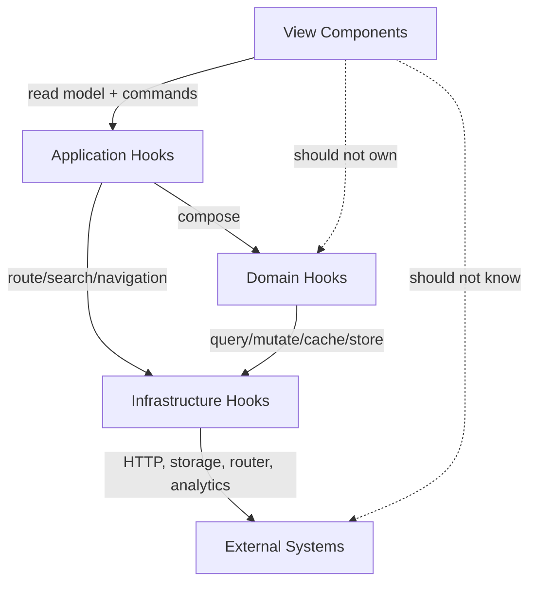
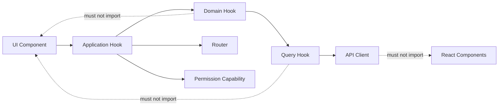
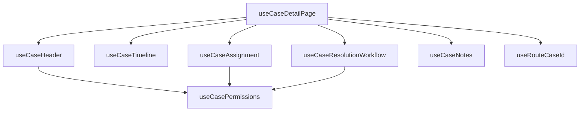

# Part 099 — Domain Hooks and Application Hooks

Most React codebases do not become hard to maintain because they lack components. They become hard to maintain because the same component becomes responsible for too many kinds of knowledge:

- how to render the UI,
- where data comes from,
- how server state is cached,
- how permissions are interpreted,
- what commands are allowed,
- how optimistic updates work,
- how errors are classified,
- when navigation happens,
- how workflow transitions move from one state to another.

A component can technically do all of that. A production codebase should not let it.

The goal of this part is to introduce two architectural boundaries:

1. **Domain hooks**: hooks that expose a stable API for one domain capability or bounded concern.
2. **Application hooks**: hooks that orchestrate a concrete use case by composing domain hooks, server-state hooks, workflow state, permissions, commands, and navigation.

These hooks are not just reusable functions. They are **stateful protocol boundaries**.

---

## 1. The Problem: Components Become Accidental Use-Case Objects

A common enterprise React screen starts like this:

```tsx
function EnforcementCasePage() {
  const { caseId } = useParams();
  const navigate = useNavigate();
  const queryClient = useQueryClient();
  const user = useCurrentUser();
  const permissions = usePermissions();
  const [selectedTab, setSelectedTab] = useState('overview');
  const [confirmClose, setConfirmClose] = useState(false);
  const [draftNote, setDraftNote] = useState('');

  const caseQuery = useQuery({
    queryKey: ['cases', caseId],
    queryFn: () => fetchCase(caseId!),
  });

  const assignMutation = useMutation({
    mutationFn: assignCase,
    onSuccess: () => {
      queryClient.invalidateQueries({ queryKey: ['cases', caseId] });
      queryClient.invalidateQueries({ queryKey: ['case-list'] });
    },
  });

  const canAssign = permissions.includes('case.assign') && caseQuery.data?.status === 'OPEN';

  async function handleAssign(officerId: string) {
    if (!canAssign) return;
    await assignMutation.mutateAsync({ caseId: caseId!, officerId });
  }

  if (caseQuery.isPending) return <PageSkeleton />;
  if (caseQuery.isError) return <ErrorState error={caseQuery.error} />;

  return (
    <CaseLayout
      caseData={caseQuery.data}
      selectedTab={selectedTab}
      onTabChange={setSelectedTab}
      canAssign={canAssign}
      onAssign={handleAssign}
      draftNote={draftNote}
      onDraftNoteChange={setDraftNote}
    />
  );
}
```

The code is not wrong. The problem is that the component now has multiple unrelated reasons to change:

| Change | Why the component changes |
|---|---|
| Query key structure changes | Data fetching is embedded in the page |
| Permission rule changes | Permission logic is embedded in the page |
| Assign command changes | Mutation logic is embedded in the page |
| Cache invalidation changes | Cache strategy is embedded in the page |
| Navigation after command changes | Application workflow is embedded in the page |
| UI layout changes | Rendering is embedded in the page |
| Tab state changes | Local view state is embedded in the page |

This is a boundary failure.

A page should often compose a use case, but it should not necessarily contain every internal rule of that use case.

---

## 2. Mental Model

Think of a React application as several layers of responsibility:



The component should mostly ask:

```txt
What should I display?
What user intents can I emit?
```

The application hook should answer:

```txt
What data, permissions, commands, loading states, errors, and workflow transitions exist for this use case?
```

The domain hook should answer:

```txt
What is the stable domain-facing API for this bounded concern?
```

---

## 3. Hook Taxonomy

Not every custom hook deserves to be called a domain or application hook.

| Hook Type | Example | Responsibility | Should Know Domain? |
|---|---|---|---|
| Utility hook | `useDebouncedValue` | Generic reusable behavior | No |
| Infrastructure hook | `useCurrentRoute`, `useAnalytics`, `useLocalStorageStore` | Platform/framework integration | No or minimal |
| Server-state hook | `useCaseQuery`, `useAssignCaseMutation` | Query/mutation/cache adapter | Thin domain awareness |
| Domain hook | `useCasePermissions`, `useCaseAssignment`, `useCaseTimeline` | Domain capability/read model/commands | Yes |
| Application hook | `useCaseDetailPage`, `useCaseResolutionWorkflow` | Use-case orchestration | Yes, plus workflow |
| View hook | `useTabs`, `useDisclosure` | UI behavior only | No |

The important distinction is not naming. It is **responsibility**.

---

## 4. Domain Hook

A domain hook is a hook that exposes a domain capability using a stable interface.

It may compose:

- server-state query hooks,
- mutation hooks,
- external stores,
- permission capabilities,
- context providers,
- reducers,
- feature flags,
- analytics commands,
- domain-specific selectors.

But it should expose a small surface:

```tsx
const assignment = useCaseAssignment(caseId);

assignment.assignee;
assignment.canAssign;
assignment.assign(officerId);
assignment.isAssigning;
assignment.assignError;
```

The component should not need to know:

- which query key is invalidated,
- how the mutation payload is shaped internally,
- whether optimistic update is used,
- whether assignment depends on case status, role, tenant, or feature flag,
- how errors are normalized,
- how audit events are emitted.

That belongs behind the domain hook.

---

## 5. Application Hook

An application hook orchestrates a concrete use case or screen workflow.

Example:

```tsx
const page = useCaseDetailPage({ caseId });
```

It might expose:

```tsx
type CaseDetailPageModel = {
  status: 'loading' | 'not-found' | 'forbidden' | 'ready' | 'error';
  case: CaseViewModel | null;
  tabs: {
    selected: CaseTab;
    select(tab: CaseTab): void;
  };
  assignment: {
    assignee: OfficerSummary | null;
    canAssign: boolean;
    assign(officerId: string): Promise<void>;
    isAssigning: boolean;
  };
  resolution: {
    canResolve: boolean;
    start(): void;
    cancel(): void;
    submit(input: ResolutionInput): Promise<void>;
    state: ResolutionWorkflowState;
  };
};
```

The page component then becomes an adapter from read model to JSX:

```tsx
function CaseDetailPage() {
  const { caseId } = useRequiredParams(['caseId']);
  const page = useCaseDetailPage({ caseId });

  if (page.status === 'loading') return <CasePageSkeleton />;
  if (page.status === 'not-found') return <NotFound />;
  if (page.status === 'forbidden') return <Forbidden />;
  if (page.status === 'error') return <ErrorState error={page.error} />;

  return <CaseDetailView model={page} />;
}
```

This is not about making fewer lines. It is about creating a boundary where use-case behavior can evolve without turning the render component into a procedural script.

---

## 6. A Domain Hook Should Expose a Read Model and Commands

Avoid returning raw infrastructure objects directly from a domain hook.

Weak API:

```tsx
function useCaseAssignment(caseId: string) {
  const query = useQuery(...);
  const mutation = useMutation(...);
  return { query, mutation };
}
```

This leaks implementation. Every caller now knows TanStack Query structure, mutation lifecycle, and cache behavior.

Better API:

```tsx
type UseCaseAssignmentResult = {
  assignee: OfficerSummary | null;
  canAssign: boolean;
  isAssigning: boolean;
  assignError: DomainError | null;
  assign(officerId: string): Promise<AssignCaseResult>;
};

function useCaseAssignment(caseId: CaseId): UseCaseAssignmentResult {
  const queryClient = useQueryClient();
  const caseQuery = useCaseQuery(caseId);
  const permission = usePermission('case.assign');

  const mutation = useMutation({
    mutationFn: assignCase,
    onSuccess: () => {
      queryClient.invalidateQueries({ queryKey: caseKeys.detail(caseId) });
      queryClient.invalidateQueries({ queryKey: caseKeys.lists() });
    },
  });

  const canAssign =
    permission.allowed &&
    caseQuery.data?.status === 'OPEN' &&
    !mutation.isPending;

  const assign = useCallback(
    async (officerId: string) => {
      if (!canAssign) {
        return { ok: false as const, reason: 'not_allowed' as const };
      }

      await mutation.mutateAsync({ caseId, officerId });
      return { ok: true as const };
    },
    [caseId, canAssign, mutation]
  );

  return {
    assignee: caseQuery.data?.assignee ?? null,
    canAssign,
    isAssigning: mutation.isPending,
    assignError: mutation.error ? normalizeDomainError(mutation.error) : null,
    assign,
  };
}
```

The caller receives domain semantics, not infrastructure leakage.

---

## 7. Command Contract

A domain/application hook command should answer these questions:

```txt
What intent does this command represent?
Is it allowed now?
What input does it accept?
What does it return?
Can it be called multiple times?
Is it idempotent?
Can it be cancelled?
Does it update cache?
Does it navigate?
Does it emit analytics/audit?
What error shape does it expose?
```

Weak command API:

```tsx
onClick={() => mutation.mutate({ id })}
```

Better command API:

```tsx
const resolution = useCaseResolutionWorkflow(caseId);

<Button
  disabled={!resolution.canSubmit}
  onClick={() => resolution.submitResolution({ outcome: 'APPROVED' })}
>
  Approve
</Button>
```

The button does not know mutation details. It knows user intent.

---

## 8. Read Model Contract

A hook should return data in the shape the caller actually needs.

Do not force view components to understand raw API response structures:

```tsx
// Weak: view must understand backend response shape.
const { data } = useCaseQuery(caseId);
return <CaseHeader statusCode={data.workflow.current_state.code} />;
```

Prefer a read model:

```tsx
type CaseHeaderModel = {
  title: string;
  statusLabel: string;
  riskLevel: 'low' | 'medium' | 'high';
  assigneeLabel: string;
  openedAtLabel: string;
};

function useCaseHeader(caseId: CaseId): CaseHeaderModelQuery {
  const query = useCaseQuery(caseId);

  return {
    status: query.status,
    error: query.error,
    data: query.data
      ? {
          title: query.data.referenceNumber,
          statusLabel: formatCaseStatus(query.data.status),
          riskLevel: classifyRisk(query.data.riskScore),
          assigneeLabel: query.data.assignee?.displayName ?? 'Unassigned',
          openedAtLabel: formatDate(query.data.openedAt),
        }
      : null,
  };
}
```

A read model is not just mapping. It is an architectural boundary between API shape and UI shape.

---

## 9. The Dependency Direction Rule

Domain/application hooks should depend inward toward infrastructure adapters and outward toward the view only through stable return contracts.



Bad direction:

```tsx
// api/cases.ts
import { toast } from '@/components/toast';
import { navigate } from '@/router';

export async function assignCase(input: AssignInput) {
  const result = await http.post('/cases/assign', input);
  toast.success('Assigned');
  navigate('/cases');
  return result;
}
```

The API client now knows UI and navigation. That breaks layering.

Better:

```tsx
function useAssignCaseCommand(caseId: CaseId) {
  const toast = useToast();
  const navigate = useNavigate();
  const mutation = useAssignCaseMutation();

  return async function assign(input: AssignInput) {
    await mutation.mutateAsync(input);
    toast.success('Case assigned');
    navigate(`/cases/${caseId}`);
  };
}
```

Application hooks are allowed to know UI-adjacent capabilities like toast/navigation because they are use-case orchestration boundaries.

---

## 10. Domain Hooks Should Not Be Too Generic

A common mistake is to create hooks like this:

```tsx
function useEntityManager<T>() {
  // search, create, update, delete, validate, export, assign, approve...
}
```

This usually becomes a mini framework. It hides domain semantics behind generic names.

Prefer domain vocabulary:

```tsx
useCaseSearch()
useCaseAssignment(caseId)
useCaseTimeline(caseId)
useCaseResolutionWorkflow(caseId)
useOfficerAvailability(regionId)
```

Generic helper hooks are useful, but the public hook that a screen consumes should speak domain language.

---

## 11. Domain Hook Example: `useCaseSearch`

A case search screen often has multiple state categories:

- URL state for committed filters,
- local state for draft filters,
- server state for results,
- persistent state for table density/columns,
- command state for export,
- permission state for actions.

A domain hook can own the search read model.

```tsx
type CaseSearchParams = {
  q?: string;
  status?: CaseStatus[];
  assigneeId?: string;
  page: number;
  pageSize: number;
  sort: 'openedAt.desc' | 'risk.desc' | 'status.asc';
};

type CaseSearchResult = {
  rows: CaseSearchRow[];
  total: number;
  page: number;
  pageSize: number;
  isLoading: boolean;
  isFetching: boolean;
  error: DomainError | null;
  canExport: boolean;
  refetch(): void;
  exportCsv(): Promise<void>;
};

function useCaseSearch(params: CaseSearchParams): CaseSearchResult {
  const permission = usePermission('case.export');
  const query = useQuery({
    queryKey: caseKeys.search(params),
    queryFn: () => searchCases(params),
    staleTime: 30_000,
  });

  const exportMutation = useMutation({
    mutationFn: () => exportCases(params),
  });

  return {
    rows: query.data?.items.map(toCaseSearchRow) ?? [],
    total: query.data?.total ?? 0,
    page: params.page,
    pageSize: params.pageSize,
    isLoading: query.isPending,
    isFetching: query.isFetching,
    error: query.error ? normalizeDomainError(query.error) : null,
    canExport: permission.allowed && (query.data?.total ?? 0) > 0,
    refetch: query.refetch,
    exportCsv: async () => {
      if (!permission.allowed) return;
      await exportMutation.mutateAsync();
    },
  };
}
```

Notice the responsibilities:

- the hook accepts committed params,
- it owns query key and query function,
- it maps API data to row read model,
- it exposes export as command,
- it does not render table UI,
- it does not own draft filter UI unless that is the chosen application boundary.

---

## 12. Application Hook Example: `useCaseSearchPage`

The page hook composes URL state, draft filters, query state, table state, and commands.

```tsx
type CaseSearchPageModel = {
  filters: {
    draft: CaseFilterDraft;
    setDraft(next: CaseFilterDraft): void;
    apply(): void;
    reset(): void;
  };
  table: {
    rows: CaseSearchRow[];
    total: number;
    page: number;
    setPage(page: number): void;
    sort: CaseSearchParams['sort'];
    setSort(sort: CaseSearchParams['sort']): void;
  };
  status: {
    isInitialLoading: boolean;
    isRefreshing: boolean;
    error: DomainError | null;
  };
  commands: {
    canExport: boolean;
    exportCsv(): Promise<void>;
  };
};

function useCaseSearchPage(): CaseSearchPageModel {
  const [searchParams, setSearchParams] = useSearchParams();
  const committed = parseCaseSearchParams(searchParams);
  const [draft, setDraft] = useState(() => toDraft(committed));

  const search = useCaseSearch(committed);

  const apply = useCallback(() => {
    setSearchParams(serializeCaseSearchParams(fromDraft(draft)));
  }, [draft, setSearchParams]);

  const reset = useCallback(() => {
    const next = defaultCaseSearchParams();
    setDraft(toDraft(next));
    setSearchParams(serializeCaseSearchParams(next));
  }, [setSearchParams]);

  return {
    filters: {
      draft,
      setDraft,
      apply,
      reset,
    },
    table: {
      rows: search.rows,
      total: search.total,
      page: committed.page,
      setPage: (page) =>
        setSearchParams(serializeCaseSearchParams({ ...committed, page })),
      sort: committed.sort,
      setSort: (sort) =>
        setSearchParams(serializeCaseSearchParams({ ...committed, sort, page: 1 })),
    },
    status: {
      isInitialLoading: search.isLoading,
      isRefreshing: search.isFetching && !search.isLoading,
      error: search.error,
    },
    commands: {
      canExport: search.canExport,
      exportCsv: search.exportCsv,
    },
  };
}
```

The page component can now be simple:

```tsx
function CaseSearchPage() {
  const page = useCaseSearchPage();

  return (
    <CaseSearchLayout
      filters={page.filters}
      table={page.table}
      status={page.status}
      commands={page.commands}
    />
  );
}
```

This does not make the logic disappear. It makes the logic inspectable, testable, and movable.

---

## 13. Application Hooks and Workflow State

When a use case has real workflow, do not hide it inside many booleans.

Bad:

```tsx
const [isDialogOpen, setDialogOpen] = useState(false);
const [isSubmitting, setSubmitting] = useState(false);
const [isSuccess, setSuccess] = useState(false);
const [error, setError] = useState<Error | null>(null);
```

Better:

```tsx
type ResolutionState =
  | { tag: 'idle' }
  | { tag: 'editing'; draft: ResolutionDraft }
  | { tag: 'confirming'; draft: ResolutionDraft }
  | { tag: 'submitting'; draft: ResolutionDraft; requestId: string }
  | { tag: 'succeeded'; resultId: string }
  | { tag: 'failed'; draft: ResolutionDraft; error: DomainError };
```

The application hook can expose workflow commands:

```tsx
function useCaseResolutionWorkflow(caseId: CaseId) {
  const [state, dispatch] = useReducer(resolutionReducer, { tag: 'idle' });
  const mutation = useResolveCaseMutation(caseId);

  const start = () => dispatch({ type: 'started' });
  const cancel = () => dispatch({ type: 'cancelled' });
  const edit = (patch: Partial<ResolutionDraft>) =>
    dispatch({ type: 'edited', patch });

  const submit = async () => {
    if (state.tag !== 'confirming') return;

    const requestId = crypto.randomUUID();
    dispatch({ type: 'submitted', requestId });

    try {
      const result = await mutation.mutateAsync({ caseId, draft: state.draft });
      dispatch({ type: 'succeeded', requestId, resultId: result.id });
    } catch (error) {
      dispatch({
        type: 'failed',
        requestId,
        error: normalizeDomainError(error),
      });
    }
  };

  return {
    state,
    start,
    cancel,
    edit,
    submit,
    canSubmit: state.tag === 'confirming' && !mutation.isPending,
  };
}
```

A workflow hook should make illegal states hard to represent.

---

## 14. Application Hook Output Shape

A production application hook should not return a bag of random values.

Weak:

```tsx
return {
  data,
  isLoading,
  isFetching,
  error,
  selectedTab,
  setSelectedTab,
  assign,
  resolve,
  close,
  canEdit,
  canDelete,
  columns,
  setColumns,
};
```

Better group by responsibility:

```tsx
return {
  pageStatus,
  header,
  tabs,
  assignment,
  resolution,
  notes,
  permissions,
  commands,
};
```

A grouped shape communicates architecture.

---

## 15. Permission Handling

Do not scatter permission checks across components.

Bad:

```tsx
{user.roles.includes('admin') && case.status !== 'CLOSED' && (
  <Button onClick={handleAssign}>Assign</Button>
)}
```

Better:

```tsx
const assignment = useCaseAssignment(caseId);

<Button disabled={!assignment.canAssign} onClick={() => assignment.assign(officerId)}>
  Assign
</Button>
```

The permission rule may depend on:

- role,
- tenant,
- case state,
- assignment state,
- feature flag,
- server policy,
- record lock,
- approval stage,
- jurisdiction.

A component should not encode that rule unless it is purely visual.

---

## 16. Error Normalization

Infrastructure errors should not leak into UI components as arbitrary `unknown` values.

```tsx
type DomainError =
  | { tag: 'network'; retryable: true; message: string }
  | { tag: 'validation'; fields: Record<string, string> }
  | { tag: 'forbidden'; requiredPermission?: string }
  | { tag: 'conflict'; currentVersion?: string }
  | { tag: 'not_found'; resource: string }
  | { tag: 'unknown'; message: string };
```

A domain/application hook is a good place to normalize errors:

```tsx
function useResolveCaseMutation(caseId: CaseId) {
  const queryClient = useQueryClient();

  return useMutation({
    mutationFn: resolveCase,
    onSuccess: () => {
      queryClient.invalidateQueries({ queryKey: caseKeys.detail(caseId) });
      queryClient.invalidateQueries({ queryKey: caseKeys.lists() });
    },
    throwOnError: false,
  });
}

function useCaseResolution(caseId: CaseId) {
  const mutation = useResolveCaseMutation(caseId);

  return {
    submit: mutation.mutateAsync,
    isSubmitting: mutation.isPending,
    error: mutation.error ? normalizeDomainError(mutation.error) : null,
  };
}
```

The view renders domain error states, not transport details.

---

## 17. Dependency Injection in Hooks

Hooks often become hard to test because they import everything directly:

```tsx
function useCaseResolution(caseId: CaseId) {
  const mutation = useMutation({ mutationFn: resolveCase });
  const analytics = realAnalytics;
  const clock = realClock;
}
```

For critical workflows, inject capabilities through context or explicit options:

```tsx
type CaseResolutionDeps = {
  clock: Clock;
  idGenerator: IdGenerator;
  analytics: Analytics;
};

const CaseResolutionDepsContext = createContext<CaseResolutionDeps | null>(null);

function useCaseResolutionDeps() {
  const deps = useContext(CaseResolutionDepsContext);
  if (!deps) throw new Error('Missing CaseResolutionDepsProvider');
  return deps;
}

function useCaseResolutionWorkflow(caseId: CaseId) {
  const { clock, idGenerator, analytics } = useCaseResolutionDeps();
  // ...
}
```

This gives you seams for tests without converting the app into dependency-injection theater.

Use injection for things that materially affect behavior:

- current time,
- ID generation,
- analytics/audit emission,
- permission provider,
- API adapter,
- feature flag reader,
- router/navigation port.

Do not inject everything by default.

---

## 18. Application Hook as a Composition Root

A page hook may become a composition root for several smaller hooks.



This is acceptable if the hook exposes a stable, grouped model.

It becomes a problem if it turns into a thousand-line procedural script.

When the page hook grows too large, split by capability:

```txt
useCaseDetailPage
  useCaseHeaderModel
  useCaseTimelinePanel
  useCaseAssignmentPanel
  useCaseResolutionPanel
  useCaseAuditPanel
```

The page hook remains a wiring boundary, not a dumping ground.

---

## 19. Domain Hook vs Query Hook

A query hook is not necessarily a domain hook.

```tsx
function useCaseQuery(caseId: CaseId) {
  return useQuery({
    queryKey: caseKeys.detail(caseId),
    queryFn: () => getCase(caseId),
  });
}
```

This is a server-state adapter.

A domain hook interprets it:

```tsx
function useCaseClosureEligibility(caseId: CaseId) {
  const caseQuery = useCaseQuery(caseId);
  const permission = usePermission('case.close');

  if (!caseQuery.data) {
    return { status: 'unknown' as const, reason: 'loading' as const };
  }

  if (!permission.allowed) {
    return { status: 'blocked' as const, reason: 'permission' as const };
  }

  if (caseQuery.data.openFindings > 0) {
    return { status: 'blocked' as const, reason: 'open_findings' as const };
  }

  return { status: 'allowed' as const };
}
```

Keep this distinction clear:

```txt
Query hook: how to fetch/cache server data.
Domain hook: what this data means for a domain capability.
Application hook: how capabilities combine into a user journey.
```

---

## 20. Domain Hook vs Context

Context provides scoped dependency passing. It does not automatically make a good domain hook.

Weak:

```tsx
const CaseContext = createContext<any>(null);
```

Better:

```tsx
function CaseProvider({ caseId, children }: PropsWithChildren<{ caseId: CaseId }>) {
  const caseQuery = useCaseQuery(caseId);
  const permissions = useCasePermissions(caseId);

  const value = useMemo(
    () => ({ caseId, caseQuery, permissions }),
    [caseId, caseQuery, permissions]
  );

  return <CaseContext.Provider value={value}>{children}</CaseContext.Provider>;
}

function useCaseAssignmentFromContext() {
  const { caseId } = useRequiredCaseContext();
  return useCaseAssignment(caseId);
}
```

Context can provide scope. Domain hooks should still define behavior.

---

## 21. View Components Should Stay Boring

Once an application hook exists, view components should become almost boring.

```tsx
function CaseAssignmentPanel({ model }: { model: CaseAssignmentModel }) {
  return (
    <Panel title="Assignment">
      <Text>{model.assigneeLabel}</Text>
      <Button disabled={!model.canAssign} loading={model.isAssigning} onClick={model.openAssignDialog}>
        Assign
      </Button>
      {model.error && <InlineError error={model.error} />}
    </Panel>
  );
}
```

A boring component is not a weak component. It is a component with a narrow job.

---

## 22. Avoid Raw Setter Leakage

Raw setters leak state representation.

Weak:

```tsx
return {
  status,
  setStatus,
  selectedOfficerId,
  setSelectedOfficerId,
};
```

Better:

```tsx
return {
  state,
  selectOfficer(officerId: OfficerId) {
    dispatch({ type: 'officer_selected', officerId });
  },
  clearOfficer() {
    dispatch({ type: 'officer_cleared' });
  },
};
```

Raw setters are acceptable for pure local view state. They are usually wrong for domain or workflow state.

---

## 23. Avoid Boolean Soup in Hook Output

Bad:

```tsx
return {
  isLoading,
  isSaving,
  isValid,
  isDirty,
  isSubmitted,
  isErrored,
  isRetrying,
};
```

Better:

```tsx
type SaveState =
  | { tag: 'idle' }
  | { tag: 'dirty'; canSave: boolean }
  | { tag: 'saving'; requestId: string }
  | { tag: 'saved'; savedAt: string }
  | { tag: 'failed'; error: DomainError; canRetry: boolean };
```

Booleans multiply possible states. Tagged unions constrain them.

---

## 24. Return Stable Commands Deliberately

A hook does not always need to stabilize every returned function, especially in React Compiler-compatible code. But public hook APIs often benefit from stable command identities when passed deep into memoized children.

```tsx
function useCaseCommands(caseId: CaseId) {
  const closeMutation = useCloseCaseMutation(caseId);

  const closeCase = useCallback(
    async (reason: CloseReason) => {
      await closeMutation.mutateAsync({ caseId, reason });
    },
    [caseId, closeMutation]
  );

  return { closeCase };
}
```

Use stabilization intentionally:

- when returned commands are passed to memoized child components,
- when commands are dependencies of other hooks,
- when the command identity is part of a provider value,
- when resubscription would be expensive.

Do not use `useCallback` as a ritual.

---

## 25. File and Folder Placement

A practical structure:

```txt
src/
  shared/
    api/
    lib/
    ui/
  entities/
    case/
      api/
        caseApi.ts
        caseKeys.ts
      model/
        caseTypes.ts
        caseSelectors.ts
      hooks/
        useCaseQuery.ts
      ui/
        CaseStatusBadge.tsx
  features/
    case-assignment/
      api/
        assignCase.ts
      model/
        assignmentTypes.ts
      hooks/
        useCaseAssignment.ts
      ui/
        CaseAssignmentPanel.tsx
  pages/
    case-detail/
      hooks/
        useCaseDetailPage.ts
      ui/
        CaseDetailPage.tsx
        CaseDetailView.tsx
```

Rules:

```txt
entity hook = entity data/read capability
feature hook = user action/capability
page hook = use-case orchestration
shared hook = generic reusable primitive
```

---

## 26. Testing Domain Hooks

Test domain hooks at the contract level.

```tsx
test('assignment is disabled when case is closed', async () => {
  const server = setupMockServer({
    case: { id: 'case-1', status: 'CLOSED', assignee: null },
    permissions: ['case.assign'],
  });

  const { result } = renderHook(() => useCaseAssignment('case-1'), {
    wrapper: createTestProviders({ server }),
  });

  await waitFor(() => {
    expect(result.current.canAssign).toBe(false);
  });
});
```

Do not only test that a query was called. Test the domain behavior.

Good tests ask:

```txt
What does the hook expose when data is loading?
What does it expose when permission is missing?
What happens on command success?
What happens on command conflict?
Does it invalidate the correct read models?
Does it prevent duplicate/illegal commands?
Does it preserve draft state correctly?
```

---

## 27. Testing Application Hooks

Application hook tests should look like user journey tests without rendering the full visual tree.

```tsx
test('case resolution workflow succeeds after confirm and submit', async () => {
  const { result } = renderHook(() => useCaseResolutionWorkflow('case-1'), {
    wrapper: createTestProviders({
      api: fakeApi({ resolveCase: async () => ({ id: 'resolution-1' }) }),
    }),
  });

  act(() => result.current.start());
  act(() => result.current.edit({ outcome: 'APPROVED' }));
  act(() => result.current.confirm());

  await act(async () => {
    await result.current.submit();
  });

  expect(result.current.state.tag).toBe('succeeded');
});
```

This catches workflow bugs before UI details obscure them.

---

## 28. Observability

Critical application hooks should emit observable transition events.

```tsx
type UiTransitionEvent = {
  feature: 'case-resolution';
  from: string;
  to: string;
  event: string;
  caseId: string;
  requestId?: string;
};
```

Emit at the command/workflow boundary, not randomly in view components.

```tsx
analytics.track('case_resolution_submitted', {
  caseId,
  requestId,
  outcome: state.draft.outcome,
});
```

For regulated workflows, this boundary also helps auditability:

- the UI intent is explicit,
- permission decision is explicit,
- transition result is explicit,
- server response mapping is explicit.

---

## 29. Decision Matrix

| Situation | Prefer |
|---|---|
| Pure reusable behavior | Utility hook |
| Browser/framework integration | Infrastructure hook |
| Server resource fetch/cache | Query hook |
| Domain read model or capability | Domain hook |
| Multi-step screen workflow | Application hook |
| State shared by a subtree | Provider + domain hooks |
| High-frequency shared client state | External store + selector hook |
| Complex legal transition graph | State machine/application hook |
| Rendering primitive behavior | Headless/view hook |

---

## 30. Anti-Patterns

### 30.1 The God Application Hook

```tsx
function useEverythingPage() {
  // 1200 lines of unrelated behavior
}
```

Split by capability.

### 30.2 The Transparent Wrapper Hook

```tsx
function useCases() {
  return useQuery(...);
}
```

This may be fine as a query hook, but it is not a meaningful domain boundary unless it adds domain semantics.

### 30.3 The UI-Aware Domain Hook

```tsx
function useCaseAssignment() {
  return {
    renderAssignButton: () => <Button>Assign</Button>,
  };
}
```

Domain hooks should not return JSX. Return model and commands.

### 30.4 The Raw Global Service Hook

```tsx
function useCaseStuff() {
  return window.caseService;
}
```

This bypasses React state, lifecycle, and testability.

### 30.5 Permission Rule Duplication

```tsx
canAssign = role === 'ADMIN' && status === 'OPEN'
```

Repeated in five components, this becomes inconsistent. Centralize domain capability rules.

### 30.6 Unbounded Application Hook Return

Returning 40 top-level values makes the hook as hard to understand as the original component.

Group by model area.

---

## 31. Refactor Recipe

When a page component is too smart:

```txt
1. Identify server-state queries.
2. Extract query hooks and query key factories.
3. Identify domain decisions: canEdit, canAssign, canClose, statusLabel.
4. Extract domain hooks around those decisions.
5. Identify workflow states: editing, confirming, submitting, failed.
6. Move workflow to reducer/state machine inside application hook.
7. Replace raw callbacks with command methods.
8. Shape a read model for view components.
9. Test the hook contracts.
10. Keep the page component as a composition adapter.
```

---

## 32. Engineering Review Checklist

Ask these during review:

```txt
Is the component rendering or orchestrating?
Does this hook expose domain semantics or infrastructure internals?
Does the hook return raw setters for domain/workflow state?
Are commands named by user intent?
Are query keys and invalidation hidden behind a domain boundary?
Are permissions centralized?
Are errors normalized?
Can the hook be tested without rendering the full page?
Does the output shape group related responsibilities?
Can this hook be reused safely, or is it too page-specific?
Does the hook hide navigation/toast/analytics in a surprising place?
Does it preserve React purity and effect boundaries?
```

---

## 33. Summary

Domain hooks and application hooks are not mandatory ceremony. They are useful when a React screen has enough behavioral complexity that components start to mix rendering with domain decisions and orchestration.

The core rule:

```txt
Components render.
Domain hooks explain what the domain allows and means.
Application hooks coordinate a user journey.
Infrastructure hooks adapt external systems.
```

A strong React architecture does not try to remove complexity. It puts complexity behind the right boundary.

---

## References

- React Docs — Reusing Logic with Custom Hooks: https://react.dev/learn/reusing-logic-with-custom-hooks
- React Docs — Components and Hooks must be pure: https://react.dev/reference/rules/components-and-hooks-must-be-pure
- React Docs — Extracting State Logic into a Reducer: https://react.dev/learn/extracting-state-logic-into-a-reducer
- React Docs — Scaling Up with Reducer and Context: https://react.dev/learn/scaling-up-with-reducer-and-context
- TanStack Query Docs: https://tanstack.com/query/latest
- Feature-Sliced Design Docs: https://fsd.how/docs/get-started/overview
