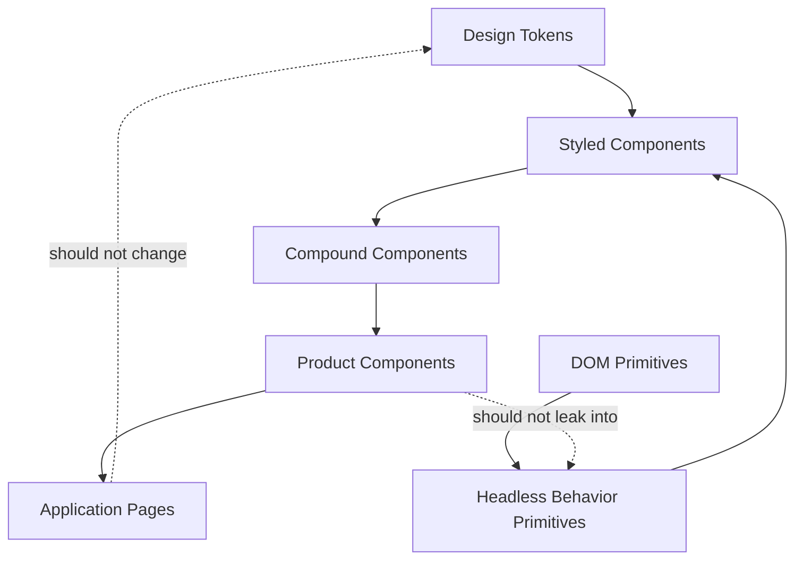
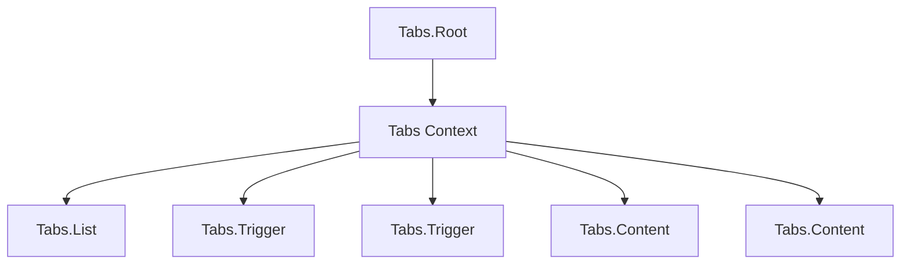

# Part 100 — Component Library Architecture

A component library is not a folder full of reusable components.

A production component library is an architectural system for turning recurring UI behavior into stable, accessible, composable, documented, testable, versioned contracts.

The important word is **contracts**.

A weak component library exports visual snippets:

```tsx
<Button />
<Card />
<Modal />
<Table />
```

A strong component library defines:

- which layer owns behavior,
- which layer owns styling,
- which layer owns accessibility,
- which layer owns state,
- which layer owns domain meaning,
- which APIs are stable,
- which escape hatches are allowed,
- which changes are breaking.

This part is about designing that system.

---

## 1. Mental Model

A component library has layers.



Each layer should answer a different question:

| Layer | Question |
|---|---|
| Token | What are the visual design constraints? |
| Primitive | What semantic DOM element is this? |
| Headless | What behavior/accessibility protocol exists? |
| Styled | How does the component look by default? |
| Compound | How do related parts coordinate? |
| Product | What domain-specific meaning does this have? |
| Page | How is this composed for a use case? |

Do not collapse all layers into one component unless the component is intentionally small and stable.

---

## 2. The Component Library Boundary

A component library should not know arbitrary product workflows.

Good library responsibilities:

```txt
Button behavior
Dialog accessibility
Tabs keyboard navigation
Form field layout
Tooltip trigger/content coordination
Table primitive interaction
Theme/density/direction context
Loading/error visual primitives
```

Bad library responsibilities:

```txt
Approve enforcement case
Assign officer
Calculate fraud risk
Open investigation workflow
Render tenant-specific permission policy
Call /api/cases/resolve directly
```

Product components may live near product features, not in the shared UI primitive package.

---

## 3. Layer 1: Design Tokens

Tokens are named constraints, not random variables.

Examples:

```txt
color.background.surface
color.text.default
color.text.muted
space.2
radius.md
font.size.sm
shadow.overlay
z.overlay.modal
motion.duration.fast
```

Token rules:

```txt
Do not expose raw hex values as component API.
Do not encode product meaning into shared tokens.
Do not use token names like blue500 in product-facing API if semantics matter.
Prefer semantic tokens for components.
Keep token migration versioned.
```

Weak:

```tsx
<Button color="#0f62fe" />
```

Better:

```tsx
<Button tone="primary" />
```

The component maps `tone="primary"` to token values internally.

---

## 4. Layer 2: Semantic Primitives

A primitive should preserve semantic HTML.

Bad:

```tsx
function Button(props: PropsWithChildren<{ onClick(): void }>) {
  return <div role="button" tabIndex={0} onClick={props.onClick}>{props.children}</div>;
}
```

Better:

```tsx
type ButtonProps = React.ComponentPropsWithoutRef<'button'> & {
  variant?: 'solid' | 'outline' | 'ghost';
  tone?: 'primary' | 'danger' | 'neutral';
};

function Button({ variant = 'solid', tone = 'primary', ...props }: ButtonProps) {
  return <button data-variant={variant} data-tone={tone} {...props} />;
}
```

Semantic default first. ARIA only when native HTML cannot express the interaction.

---

## 5. Layer 3: Headless Behavior Primitives

A headless component owns behavior and accessibility protocol but not final styling.

Example responsibilities:

```txt
Tabs: selected value, keyboard navigation, roving focus, ARIA linkage.
Dialog: open state, focus trap, Escape policy, outside interaction policy.
Tooltip: trigger/content relationship, delay, hover/focus behavior.
Combobox: input, popup, active option, selection, keyboard behavior.
```

Headless component output options:

1. compound components,
2. prop getters,
3. hook API,
4. `asChild` slot pattern,
5. render function.

Example headless hook:

```tsx
type UseDisclosureOptions = {
  open?: boolean;
  defaultOpen?: boolean;
  onOpenChange?: (open: boolean) => void;
};

function useDisclosure(options: UseDisclosureOptions = {}) {
  const [uncontrolledOpen, setUncontrolledOpen] = useState(options.defaultOpen ?? false);
  const isControlled = options.open !== undefined;
  const open = isControlled ? options.open! : uncontrolledOpen;

  const setOpen = useCallback(
    (next: boolean) => {
      if (!isControlled) setUncontrolledOpen(next);
      options.onOpenChange?.(next);
    },
    [isControlled, options]
  );

  return {
    open,
    setOpen,
    openDialog: () => setOpen(true),
    closeDialog: () => setOpen(false),
    toggleDialog: () => setOpen(!open),
  };
}
```

This is UI behavior. It should not know product domain.

---

## 6. Layer 4: Styled Components

A styled component combines semantic primitive + design tokens + default visual states.

Example:

```tsx
type BadgeProps = React.ComponentPropsWithoutRef<'span'> & {
  tone?: 'neutral' | 'success' | 'warning' | 'danger';
  size?: 'sm' | 'md';
};

function Badge({ tone = 'neutral', size = 'md', ...props }: BadgeProps) {
  return <span data-ui="badge" data-tone={tone} data-size={size} {...props} />;
}
```

Rules:

```txt
Style variants should describe visual intent, not domain state.
Do not add business logic to styled components.
Expose stable variant vocabulary.
Avoid boolean prop explosion.
Make disabled, loading, focus-visible, error, and reduced-motion states explicit.
```

Weak:

```tsx
<Badge isCaseClosed />
```

Better:

```tsx
<CaseStatusBadge status={case.status} /> // product component
<Badge tone="neutral">Closed</Badge>     // shared UI primitive
```

---

## 7. Layer 5: Compound Components

Compound components coordinate several parts under one root.

Example API:

```tsx
<Tabs value={tab} onValueChange={setTab}>
  <Tabs.List>
    <Tabs.Trigger value="overview">Overview</Tabs.Trigger>
    <Tabs.Trigger value="timeline">Timeline</Tabs.Trigger>
  </Tabs.List>
  <Tabs.Content value="overview">...</Tabs.Content>
  <Tabs.Content value="timeline">...</Tabs.Content>
</Tabs>
```

The root owns coordination:

- selected value,
- controlled/uncontrolled state,
- registration of triggers/content,
- ARIA IDs,
- keyboard navigation,
- orientation,
- activation mode.

The parts consume scoped context.



Compound components are good when parts are conceptually inseparable.

---

## 8. Layer 6: Product Components

Product components encode domain meaning.

```tsx
type CaseStatusBadgeProps = {
  status: CaseStatus;
};

function CaseStatusBadge({ status }: CaseStatusBadgeProps) {
  const model = getCaseStatusBadgeModel(status);

  return <Badge tone={model.tone}>{model.label}</Badge>;
}
```

This belongs in a product/domain area, not necessarily the shared UI package.

Why?

Because product components change when domain language changes.

Shared UI components should change when UI contracts change.

Keep those causes of change separate.

---

## 9. State Policy for Component Libraries

Every reusable component must declare state policy.

| State Type | Library Component Should Own? | Example |
|---|---:|---|
| Pure visual state | Yes | hover/focus/pressed CSS state |
| Local interaction state | Often | uncontrolled disclosure open state |
| Controlled value | Expose option | `value/onValueChange` |
| Product domain state | No | case approval status |
| Server state | No | fetch assignees inside select |
| Permission state | No | can approve case |
| Workflow state | Usually no | approval wizard lifecycle |
| Accessibility state | Yes | active descendant, roving focus |

A reusable component can own UI interaction state. It should not own product authority.

---

## 10. Controlled and Uncontrolled Contract

Good library components often support both controlled and uncontrolled usage.

```tsx
type TabsProps = {
  value?: string;
  defaultValue?: string;
  onValueChange?: (value: string) => void;
  children: React.ReactNode;
};
```

Rules:

```txt
If value is provided, component is controlled.
If defaultValue is provided, component initializes internal state.
Do not switch controlled/uncontrolled during component lifetime.
Do not call onValueChange for internal effects unrelated to user intent.
Do not store both controlled value and internal mirror state.
```

Implement the pattern once:

```tsx
function useControllableState<T>({
  value,
  defaultValue,
  onChange,
}: {
  value?: T;
  defaultValue: T;
  onChange?: (value: T) => void;
}) {
  const [internalValue, setInternalValue] = useState(defaultValue);
  const isControlled = value !== undefined;
  const current = isControlled ? value : internalValue;

  const setCurrent = useCallback(
    (next: T) => {
      if (!isControlled) setInternalValue(next);
      onChange?.(next);
    },
    [isControlled, onChange]
  );

  return [current, setCurrent] as const;
}
```

Then use it consistently.

---

## 11. API Design: Prefer Semantic Props

Weak:

```tsx
<Button blue rounded leftIcon bold compact />
```

Better:

```tsx
<Button tone="primary" variant="solid" size="sm" leadingIcon={<PlusIcon />}>
  Create
</Button>
```

Semantic props reduce combinatorial chaos.

| Weak Prop | Better API |
|---|---|
| `blue` | `tone="primary"` |
| `red` | `tone="danger"` |
| `big` | `size="lg"` |
| `rounded` | internal style or `shape` if semantically meaningful |
| `leftIcon` | `leadingIcon` |
| `rightIcon` | `trailingIcon` |
| `isLoading` | `loading` if common API convention |

---

## 12. Boolean Prop Explosion

Boolean props create illegal combinations.

Bad:

```tsx
<Button primary secondary danger ghost outline small large />
```

This allows:

```tsx
<Button primary secondary small large />
```

Better:

```tsx
<Button tone="primary" variant="outline" size="sm" />
```

Constrain the API so impossible combinations are harder to express.

---

## 13. Slots and Composition

A reusable component should avoid becoming a configuration language.

Weak:

```tsx
<Card
  title="Case"
  subtitle="Open"
  showActions
  primaryActionLabel="Approve"
  secondaryActionLabel="Reject"
  footerText="Last updated"
/>
```

Better:

```tsx
<Card>
  <Card.Header>
    <Card.Title>Case</Card.Title>
    <Card.Description>Open</Card.Description>
  </Card.Header>
  <Card.Body>...</Card.Body>
  <Card.Footer>
    <Button>Approve</Button>
    <Button variant="outline">Reject</Button>
  </Card.Footer>
</Card>
```

Slots preserve composition. Configuration props create a weak DSL.

---

## 14. `as` and `asChild` Policy

Polymorphism is powerful and dangerous.

Good use cases:

```tsx
<Button as="a" href="/cases">Open Cases</Button>
<Button asChild><Link to="/cases">Open Cases</Link></Button>
```

Risks:

- broken semantics,
- lost keyboard behavior,
- incompatible props,
- ref mismatch,
- event handler override,
- invalid ARIA,
- nested interactive elements.

Policy:

```txt
Use polymorphism sparingly.
Restrict allowed host elements for critical components.
Document semantic expectations.
Merge event handlers intentionally.
Compose refs safely.
Do not allow impossible accessibility states.
```

For high-risk primitives like `Dialog.Trigger`, prefer `asChild` with validation in examples and tests.

---

## 15. Ref Contract

A reusable component should document what its ref points to.

```tsx
const buttonRef = useRef<HTMLButtonElement>(null);
<Button ref={buttonRef} />;
```

Questions:

```txt
Does ref point to the root element?
Can consumer focus it?
Does polymorphism change ref type?
Is imperative handle exposed instead of DOM?
Is ref required for accessibility behavior?
```

For components with imperative behavior, expose a narrow handle:

```tsx
type TextFieldHandle = {
  focus(): void;
  select(): void;
};
```

Do not expose internals like internal state setters.

---

## 16. Accessibility as Architecture

Accessibility is not a lint rule at the end.

It affects API design.

Example Dialog contract:

```txt
Dialog must have an accessible name.
Focus moves into dialog when opened.
Focus returns to trigger when closed.
Escape behavior is defined.
Background interaction is blocked for modal dialogs.
aria-modal/role semantics are correct.
Nested overlay behavior is defined.
```

Example Tabs contract:

```txt
Tabs.List owns orientation.
Tabs.Trigger has role tab.
Tabs.Content has role tabpanel.
Trigger and content IDs are linked.
Keyboard navigation follows expected pattern.
Activation mode is documented.
```

The library should make correct usage the default path.

---

## 17. Form Components

A form component library should separate:

- field layout,
- label/description/error linkage,
- input primitive,
- validation rendering,
- form state management.

Good primitive:

```tsx
<FormField name="email">
  <FormLabel>Email</FormLabel>
  <TextInput type="email" />
  <FormDescription>Used for notifications.</FormDescription>
  <FormError />
</FormField>
```

`FormField` may provide IDs and ARIA linkage through context.

It should not require one specific form library unless it is intentionally an adapter package:

```txt
@org/ui                -> generic primitives
@org/ui-react-hook-form -> adapter
@org/ui-final-form      -> adapter
```

Adapters keep the base library stable.

---

## 18. Package Topology

A scalable component library often separates packages:

```txt
packages/
  tokens/
  icons/
  primitives/
  headless/
  components/
  forms/
  overlays/
  charts/
  docs/
  testing/
```

Or one package with clear entry points:

```txt
@org/ui/button
@org/ui/dialog
@org/ui/tabs
@org/ui/form
@org/ui/theme
```

Rules:

```txt
Avoid importing from internal paths.
Expose public API through index files.
Keep tree-shaking in mind.
Avoid circular dependencies between components.
Keep product components out of base UI package.
```

---

## 19. Public API Surface

Every exported component should have:

```txt
Name
Purpose
Stable props
Unstable/internal props if any
State policy
Accessibility contract
Ref contract
Styling contract
Composition examples
Breaking-change policy
```

Example API note:

```tsx
type DialogProps = {
  open?: boolean;
  defaultOpen?: boolean;
  onOpenChange?: (open: boolean, reason: DialogCloseReason) => void;
  modal?: boolean;
  children: React.ReactNode;
};
```

The `reason` is part of the contract:

```tsx
type DialogCloseReason =
  | 'escape-key'
  | 'outside-pointer'
  | 'close-button'
  | 'programmatic'
  | 'submit-success';
```

This prevents consumers from guessing why a dialog closed.

---

## 20. Styling Architecture

The styling mechanism can vary:

- CSS Modules,
- vanilla CSS,
- CSS variables,
- Tailwind utility composition,
- CSS-in-JS,
- zero-runtime CSS extraction,
- design-token generated CSS.

The architectural rules are more stable than the tool:

```txt
Expose semantic variants.
Use data attributes for state styling.
Keep styling override policy explicit.
Avoid relying on DOM internals for consumer overrides.
Use CSS variables for theming surfaces.
Do not require product teams to fight specificity wars.
```

Example:

```tsx
<button
  data-ui="button"
  data-variant={variant}
  data-tone={tone}
  data-size={size}
  data-loading={loading ? '' : undefined}
/>
```

Data attributes make styling states inspectable.

---

## 21. Theming and Context

Theme context should be low-volatility.

Good theme context:

```tsx
type ThemeContextValue = {
  colorScheme: 'light' | 'dark' | 'system';
  density: 'compact' | 'comfortable';
  direction: 'ltr' | 'rtl';
};
```

Avoid putting high-frequency UI state in theme context.

Bad:

```tsx
type ThemeContextValue = {
  colorScheme: string;
  hoveredButtonId: string | null;
  activeTooltipId: string | null;
};
```

High-frequency interaction belongs local to the component or in a dedicated external store if needed.

---

## 22. Design System Contexts

Common contexts:

| Context | Purpose | Volatility |
|---|---|---|
| Theme | color scheme, density, direction | Low |
| FormField | label/error/description IDs | Local, low |
| Tabs | selected value, registry, orientation | Local, medium |
| Dialog | open state, title ID, close command | Local, medium |
| LayerManager | z-index/overlay stack | Scoped, medium |
| Toast | command capability | App-level command |

Context should be scoped to the smallest useful subtree.

---

## 23. Component State Ownership Examples

### Button

Owns:

```txt
visual pressed/focus/loading rendering
```

Does not own:

```txt
whether the user is allowed to submit
server mutation lifecycle outside loading prop
```

### Dialog

Owns or coordinates:

```txt
open state if uncontrolled
focus management
close reasons
escape/outside policy
```

Does not own:

```txt
whether approval is legally allowed
how server mutation resolves
which route to navigate to after submit
```

### DataTable

May own:

```txt
column sizing
visual sorting state if uncontrolled
row focus
selection UI state if generic
```

Should not own:

```txt
server query key
business search filter semantics
case assignment mutation
```

---

## 24. Product Table vs Primitive Table

A primitive table:

```tsx
<DataTable
  rows={rows}
  columns={columns}
  sorting={sorting}
  onSortingChange={setSorting}
  selection={selection}
  onSelectionChange={setSelection}
/>
```

A product table:

```tsx
<CaseSearchTable
  rows={page.table.rows}
  canAssign={page.assignment.canAssign}
  onAssign={page.assignment.openAssignDialog}
/>
```

The primitive table should not know what a case is.

---

## 25. Documentation Architecture

Documentation should not just list props.

Each component needs:

```txt
Purpose
Anatomy
Basic example
Controlled example
Uncontrolled example
Accessibility notes
Keyboard behavior
Composition examples
Do and don't
Edge cases
Testing guidance
Migration notes
```

Storybook or a similar component workshop helps capture hard-to-reach states:

```txt
Button/default
Button/loading
Button/disabled
Button/as-link
Dialog/controlled
Dialog/nested
Dialog/long-content
Tabs/keyboard-navigation
FormField/error
```

Stories are not just marketing demos. They are executable examples of states.

---

## 26. Testing Matrix

| Test Type | Purpose |
|---|---|
| Unit test | Reducers, utilities, state helpers |
| Render test | Props render correct DOM/ARIA |
| Interaction test | Keyboard/mouse behavior |
| Accessibility test | Labels, roles, focus, axe checks |
| Visual regression | Layout/theme variants |
| Type test | Public TypeScript API correctness |
| SSR test | Hydration-safe markup |
| Performance test | Expensive list/overlay cases |
| Story test | Documented states stay working |

For primitives, interaction and accessibility tests are often more valuable than snapshot tests.

---

## 27. Accessibility Test Examples

For Tabs:

```txt
renders tablist, tab, tabpanel roles
selected tab has aria-selected=true
trigger controls panel via aria-controls
keyboard arrow moves focus/selection according to activation mode
Home/End keys behave as documented
hidden panels are not incorrectly exposed
```

For Dialog:

```txt
focus moves inside on open
focus returns on close
Escape closes only when policy allows
outside click closes only when policy allows
modal background is inert or interaction-blocked
accessible name exists
```

The test suite should encode behavior contracts, not implementation details.

---

## 28. Versioning and Breaking Changes

Breaking changes include:

```txt
renaming a prop
changing default variant
changing DOM structure relied on by consumers
changing ARIA behavior
changing focus behavior
changing ref target
changing controlled/uncontrolled semantics
removing data attributes used for styling
changing CSS variable names
```

Not all breaking changes are TypeScript errors. Accessibility and behavior changes can break production workflows silently.

Use changelogs that explain migration:

```txt
Before
After
Why changed
Risk
Migration script if possible
```

---

## 29. Deprecation Strategy

Do not remove widely used component APIs abruptly.

```tsx
type ButtonProps = {
  /** @deprecated Use tone="danger" instead. */
  danger?: boolean;
  tone?: 'primary' | 'danger' | 'neutral';
};
```

Migration ladder:

```txt
1. Add new API.
2. Keep old API with warning/type deprecation.
3. Provide codemod or lint rule.
4. Publish migration guide.
5. Remove in next major version.
```

---

## 30. Governance

A component library needs governance because every exported API becomes shared debt.

Review questions:

```txt
Is this component generic UI or product-specific?
Can native HTML solve this?
Is accessibility behavior defined?
Is state ownership clear?
Are controlled/uncontrolled semantics clear?
Is the prop API semantic?
Does this introduce boolean prop explosion?
Is there a simpler composition API?
Are escape hatches explicit?
Does it have stories for important states?
Does it have interaction and accessibility tests?
Is this a breaking change?
```

Governance is not bureaucracy. It protects the shared surface area.

---

## 31. Internal Architecture Example

```txt
ui/
  button/
    Button.tsx
    Button.types.ts
    Button.test.tsx
    Button.stories.tsx
    index.ts
  dialog/
    DialogRoot.tsx
    DialogTrigger.tsx
    DialogContent.tsx
    DialogTitle.tsx
    DialogDescription.tsx
    DialogClose.tsx
    Dialog.context.ts
    Dialog.types.ts
    Dialog.test.tsx
    Dialog.stories.tsx
    index.ts
  form-field/
    FormField.tsx
    FormLabel.tsx
    FormDescription.tsx
    FormError.tsx
    FormField.context.ts
    index.ts
```

Each folder owns one public component family.

---

## 32. Public API Barrel

Avoid exporting internals accidentally.

```tsx
// ui/dialog/index.ts
export { Dialog } from './DialogRoot';
export { DialogTrigger } from './DialogTrigger';
export { DialogContent } from './DialogContent';
export { DialogTitle } from './DialogTitle';
export { DialogDescription } from './DialogDescription';
export { DialogClose } from './DialogClose';
export type { DialogProps, DialogCloseReason } from './Dialog.types';
```

Do not export:

```tsx
export * from './Dialog.context';
export * from './internalFocusTrap';
```

Internal files should remain internal.

---

## 33. Component Family API

A compound family can be exported as named components:

```tsx
import {
  Dialog,
  DialogTrigger,
  DialogContent,
  DialogTitle,
  DialogDescription,
  DialogClose,
} from '@org/ui/dialog';
```

Or as namespace-like object:

```tsx
import { Dialog } from '@org/ui/dialog';

<Dialog.Root>
  <Dialog.Trigger />
  <Dialog.Content />
</Dialog.Root>
```

Trade-off:

| Style | Pros | Cons |
|---|---|---|
| Named exports | Tree-shaking clear, explicit imports | Longer import lists |
| Namespace object | Nice API grouping | Can complicate tree-shaking/types depending on build |

Choose one convention and keep it consistent.

---

## 34. Performance Policy

Library components should avoid unnecessary performance traps:

```txt
Do not create new provider value objects without reason.
Do not put high-frequency state in broad context.
Avoid measuring layout unless necessary.
Avoid layout effect by default.
Virtualize large lists.
Expose controlled state for expensive orchestration.
Use stable IDs for accessibility linkage.
Avoid cloning all children every render for large trees.
```

Performance is part of the API because consumers cannot easily fix internals.

---

## 35. SSR and Hydration Policy

Reusable components should be safe in SSR environments when possible.

Watch for:

```txt
random IDs that differ between server/client
reading window during render
layout effect warnings on server
initial theme mismatch
portal container availability
media query mismatch
localStorage during render
```

Use stable React ID generation for accessibility linkage and defer browser-only work to effects or dedicated client-only boundaries.

---

## 36. Escape Hatches

A component library without escape hatches becomes unusable. A component library with unlimited escape hatches becomes ungoverned.

Good escape hatches:

```txt
className
style
CSS variables
slotProps
asChild for controlled composition
render function for advanced case
controlled state props
```

Dangerous escape hatches:

```txt
internalRef
disableAccessibility
unsafeOverrideState
any props bag
raw context access
```

Name dangerous escape hatches honestly if they must exist:

```tsx
unstable_portalContainer
unstable_disableFocusTrap
```

This signals risk.

---

## 37. Component Library Failure Modes

### 37.1 Visual Snippet Library

The library exports pretty components but no behavior contracts. Teams reimplement keyboard handling and accessibility inconsistently.

### 37.2 Product Logic in Shared UI

The shared package imports product models and becomes impossible to reuse.

### 37.3 Boolean Prop Explosion

Components accept too many booleans and allow impossible combinations.

### 37.4 Configuration DSL

A component grows dozens of props instead of supporting composition.

### 37.5 Accessibility Optionality

Correct ARIA/focus behavior becomes the consumer's responsibility.

### 37.6 Hidden State Ownership

A component silently owns state that consumers assume they control.

### 37.7 Unstable DOM Contract

Consumers rely on DOM structure for styling, then a minor release breaks them.

### 37.8 Ref Ambiguity

Consumers do not know what element a ref points to.

### 37.9 Provider Fan-Out

The design system provider contains high-frequency state and rerenders the app.

### 37.10 No Migration Path

The library improves, but product teams cannot upgrade safely.

---

## 38. Refactor Recipe: From Product Component to Library Primitive

When extracting a reusable component from product code:

```txt
1. Remove domain terminology.
2. Identify semantic HTML root.
3. Identify accessibility behavior.
4. Identify controlled/uncontrolled state.
5. Replace domain props with semantic visual props.
6. Move product mapping to product component.
7. Add stories for states and edge cases.
8. Add interaction and accessibility tests.
9. Document ref and styling contract.
10. Export through stable public API.
```

Example:

```tsx
// Before
<CaseApprovalModal caseId={caseId} approvalRules={rules} />

// Extracted shared primitive
<Dialog open={open} onOpenChange={setOpen}>...</Dialog>

// Product component remains product-specific
<CaseApprovalDialog caseId={caseId} />
```

---

## 39. Refactor Recipe: From One Component to Compound Family

When a component has too many layout props:

```txt
1. Identify fixed anatomy: Root, Header, Body, Footer, Trigger, Content.
2. Move coordination state to Root.
3. Pass coordination through scoped context.
4. Give each part a semantic responsibility.
5. Replace layout flags with composition.
6. Keep accessible IDs and relationships internal.
7. Add misuse errors for missing Root.
8. Document allowed composition patterns.
```

---

## 40. Component Library Review Checklist

```txt
Does this belong in the shared library?
Is the component semantic by default?
Is accessibility behavior owned by the component where appropriate?
Is state ownership explicit?
Does it support controlled/uncontrolled mode if needed?
Are variant props semantic and constrained?
Are impossible prop combinations prevented?
Is composition preferred over configuration?
Are refs documented?
Are escape hatches limited and named clearly?
Are provider scopes small?
Are server/browser assumptions safe?
Are stories present for edge states?
Are interaction and accessibility tests present?
Is the public API intentionally exported?
Is versioning impact understood?
```

---

## 41. Summary

A production component library is an architecture, not a component dump.

The strongest libraries separate:

```txt
design tokens
semantic primitives
headless behavior
styled components
compound coordination
product-specific components
page orchestration
```

The key rule:

```txt
Shared UI components own reusable UI behavior and accessibility.
Product components own domain meaning.
Application hooks own use-case orchestration.
Pages compose the final journey.
```

A mature React codebase is easier to evolve when component APIs are stable, state ownership is explicit, accessibility is built in, and product workflows do not leak into shared primitives.

---

## References

- React Docs — Creating user interfaces from components: https://react.dev/
- React Docs — Components and Hooks must be pure: https://react.dev/reference/rules/components-and-hooks-must-be-pure
- React Docs — Reusing Logic with Custom Hooks: https://react.dev/learn/reusing-logic-with-custom-hooks
- React Docs — `createContext`: https://react.dev/reference/react/createContext
- WAI-ARIA Authoring Practices Guide: https://www.w3.org/WAI/ARIA/apg/
- Storybook Docs: https://storybook.js.org/docs
