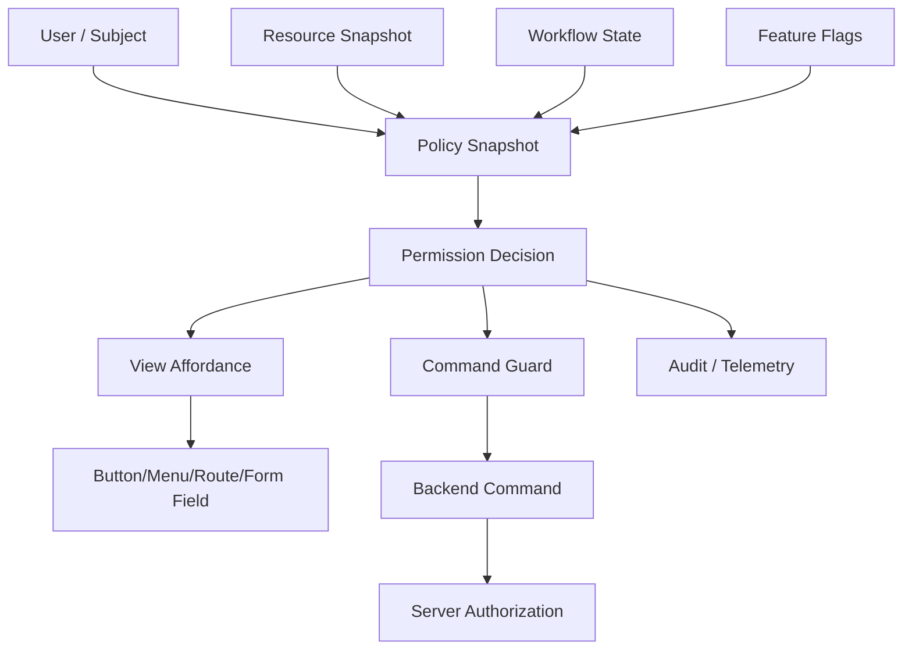

# Part 101 — Permission-Aware Components

Permission-aware component bukan komponen yang "mengamankan" aplikasi.

Permission-aware component adalah **UI boundary** yang membuat aplikasi:

1. tidak menampilkan aksi yang tidak relevan,
2. menjelaskan kenapa aksi tidak tersedia,
3. tidak memanggil command yang tidak boleh dijalankan,
4. tetap menjaga accessibility,
5. tetap bisa diaudit,
6. tetap memindahkan keputusan security final ke backend.

Kalimat paling penting:

> Frontend permission adalah **UX and intent guard**. Backend authorization adalah **security guard**.

Jika tombol `Delete Case` disembunyikan di UI tetapi endpoint `DELETE /cases/:id` tidak mengecek authorization, sistem tetap vulnerable.

Permission-aware UI harus membantu user dan mengurangi accidental misuse, tetapi tidak boleh menjadi satu-satunya tempat enforcement.

---

## 1. Masalah Nyata yang Ingin Diselesaikan

Di aplikasi enterprise, regulatory system, case management, dan workflow approval, permission bukan sekadar:

```tsx
{role === "admin" && <Button>Delete</Button>}
```

Itu terlalu dangkal.

Permission nyata biasanya bergantung pada kombinasi:

```txt
subject/user
+ role
+ permission/capability
+ resource
+ resource state
+ ownership
+ assignment
+ tenant
+ workflow step
+ legal hold
+ risk flag
+ time window
+ feature flag
+ delegation
+ policy version
```

Contoh:

```txt
User boleh approve enforcement action jika:
- user punya capability enforcement.approve
- case berada di tenant yang sama
- case.status == READY_FOR_APPROVAL
- user bukan drafter action tersebut
- action tidak sedang under legal hold
- approval window belum expired
- user punya current delegation jika acting on behalf
```

Maka permission-aware component harus bisa bekerja dengan **capability**, bukan hanya role string.

---

## 2. Permission UI Decision Is Not Binary

Permission sering dianggap boolean:

```ts
canDelete: true | false
```

Untuk UI production, itu kurang.

UI butuh menjawab:

```txt
can the user perform this action?
why or why not?
should the action be hidden, disabled, or visible with warning?
is the denial final or recoverable?
can user request access?
should attempt be logged?
should command still be submitted and let backend decide?
```

Model yang lebih kuat:

```ts
type PermissionDecision =
  | {
      allowed: true;
      capability: string;
      reason?: undefined;
      evidence?: PermissionEvidence;
    }
  | {
      allowed: false;
      capability: string;
      reason: DenialReason;
      explanation: string;
      recoverable: boolean;
      visibility: "hidden" | "disabled" | "readonly";
      evidence?: PermissionEvidence;
    };

type DenialReason =
  | "missing_capability"
  | "resource_state"
  | "ownership_conflict"
  | "tenant_boundary"
  | "workflow_step"
  | "legal_hold"
  | "feature_disabled"
  | "unknown";
```

Ini membuat UI lebih defensible.

Tombol tidak hilang secara misterius. Sistem bisa menjelaskan:

```txt
Approve is unavailable because the case is still in Draft.
```

atau:

```txt
Delete is unavailable because this case is under legal hold.
```

---

## 3. Mental Model: Permission-Aware UI sebagai Capability Boundary



Ada dua lapisan:

1. **UI permission decision**: menentukan affordance dan command intent.
2. **Server authorization**: menentukan apakah command benar-benar boleh terjadi.

UI tidak boleh menganggap dirinya authoritative.

---

## 4. Role, Permission, Capability, Policy

Istilah ini sering dicampur. Pisahkan dengan jelas.

| Konsep | Arti | Contoh | Cocok untuk UI? |
|---|---|---|---|
| Role | Paket tanggung jawab | `case_manager`, `supervisor` | Kadang, tapi kasar |
| Permission | Hak spesifik | `case.read`, `case.update` | Ya |
| Capability | Permission + konteks siap pakai | `canApprove(case)` | Sangat cocok |
| Policy | Aturan evaluasi | subject-resource-action-context | Biasanya di backend/policy layer |
| Decision | Hasil evaluasi | allowed/denied + reason | Sangat cocok untuk UI |

UI component sebaiknya bergantung pada **capability/decision**, bukan role mentah.

Bad:

```tsx
{user.role === "supervisor" && <ApproveButton />}
```

Better:

```tsx
<PermissionGate capability="case.approve" resource={caseRecord}>
  <ApproveButton />
</PermissionGate>
```

Best untuk complex UI:

```tsx
const approve = usePermission("case.approve", caseRecord);

<ApproveButton
  disabled={!approve.allowed}
  disabledReason={!approve.allowed ? approve.explanation : undefined}
  onApprove={approve.allowed ? approveCase : undefined}
/>
```

---

## 5. Permission Decision Shape

Permission decision harus cukup kaya untuk UI.

```ts
type Capability =
  | "case.read"
  | "case.update"
  | "case.assign"
  | "case.approve"
  | "case.close"
  | "case.delete"
  | "evidence.upload"
  | "evidence.delete"
  | "comment.internal.create";

type PermissionContext = {
  userId: string;
  tenantId: string;
  roles: string[];
  capabilities: Capability[];
  delegation?: {
    principalUserId: string;
    delegatedBy: string;
    expiresAt: string;
  };
};

type ResourceContext = {
  id: string;
  tenantId: string;
  ownerId?: string;
  assigneeId?: string;
  status?: string;
  legalHold?: boolean;
  lockedBy?: string | null;
};

type PermissionDecision = {
  allowed: boolean;
  capability: Capability;
  reason?: string;
  explanation?: string;
  visibility?: "visible" | "hidden" | "disabled" | "readonly";
  evidence?: Record<string, unknown>;
};
```

Decision harus pure terhadap input:

```ts
function canApproveCase(
  subject: PermissionContext,
  resource: ResourceContext
): PermissionDecision {
  if (!subject.capabilities.includes("case.approve")) {
    return {
      allowed: false,
      capability: "case.approve",
      reason: "missing_capability",
      explanation: "You do not have permission to approve cases.",
      visibility: "hidden",
    };
  }

  if (subject.tenantId !== resource.tenantId) {
    return {
      allowed: false,
      capability: "case.approve",
      reason: "tenant_boundary",
      explanation: "This case belongs to a different tenant.",
      visibility: "hidden",
    };
  }

  if (resource.status !== "READY_FOR_APPROVAL") {
    return {
      allowed: false,
      capability: "case.approve",
      reason: "resource_state",
      explanation: "Only cases ready for approval can be approved.",
      visibility: "disabled",
    };
  }

  if (resource.legalHold) {
    return {
      allowed: false,
      capability: "case.approve",
      reason: "legal_hold",
      explanation: "This case is under legal hold.",
      visibility: "disabled",
    };
  }

  return {
    allowed: true,
    capability: "case.approve",
    visibility: "visible",
  };
}
```

Perhatikan: evaluator ini hanya untuk UI decision. Server tetap harus mengecek ulang.

---

## 6. Provider Design untuk Permission

Permission context harus membawa policy snapshot/capability service, bukan semua object user global yang bocor ke mana-mana.

```tsx
import { createContext, useContext, useMemo } from "react";

type PermissionService = {
  decide: (capability: Capability, resource?: ResourceContext) => PermissionDecision;
};

const PermissionContext = createContext<PermissionService | null>(null);

export function PermissionProvider({
  subject,
  children,
}: {
  subject: PermissionContext;
  children: React.ReactNode;
}) {
  const service = useMemo<PermissionService>(() => {
    return {
      decide(capability, resource) {
        return decidePermission(subject, capability, resource);
      },
    };
  }, [subject]);

  return (
    <PermissionContext.Provider value={service}>
      {children}
    </PermissionContext.Provider>
  );
}

export function usePermission(
  capability: Capability,
  resource?: ResourceContext
): PermissionDecision {
  const service = useContext(PermissionContext);

  if (!service) {
    throw new Error("usePermission must be used inside PermissionProvider");
  }

  return service.decide(capability, resource);
}
```

Namun hati-hati: jika `subject` object berubah identity setiap render, semua consumer context akan rerender.

Better:

```tsx
const subject = useMemo(
  () => ({
    userId: session.userId,
    tenantId: session.tenantId,
    roles: session.roles,
    capabilities: session.capabilities,
    delegation: session.delegation,
  }),
  [
    session.userId,
    session.tenantId,
    session.roles,
    session.capabilities,
    session.delegation,
  ]
);
```

Untuk permission yang sering berubah atau banyak resource row, jangan paksa semua lewat Context. Pakai selector/external store atau precomputed decision map.

---

## 7. PermissionGate Pattern

### 7.1 Basic Gate

```tsx
function PermissionGate({
  capability,
  resource,
  children,
  fallback = null,
}: {
  capability: Capability;
  resource?: ResourceContext;
  children: React.ReactNode;
  fallback?: React.ReactNode;
}) {
  const decision = usePermission(capability, resource);

  if (!decision.allowed) {
    return <>{fallback}</>;
  }

  return <>{children}</>;
}
```

Usage:

```tsx
<PermissionGate capability="case.delete" resource={caseRecord}>
  <DeleteCaseButton caseId={caseRecord.id} />
</PermissionGate>
```

Ini cocok untuk fitur yang benar-benar tidak relevan bila user tidak punya capability.

Tapi banyak aksi lebih baik **disabled with explanation**, bukan hidden.

---

### 7.2 Render Decision Pattern

```tsx
function PermissionDecisionView({
  capability,
  resource,
  children,
}: {
  capability: Capability;
  resource?: ResourceContext;
  children: (decision: PermissionDecision) => React.ReactNode;
}) {
  const decision = usePermission(capability, resource);
  return <>{children(decision)}</>;
}
```

Usage:

```tsx
<PermissionDecisionView capability="case.approve" resource={caseRecord}>
  {(decision) => (
    <Button
      disabled={!decision.allowed}
      title={!decision.allowed ? decision.explanation : undefined}
      onClick={decision.allowed ? onApprove : undefined}
    >
      Approve
    </Button>
  )}
</PermissionDecisionView>
```

Kelebihan:

- UI bisa memilih hidden/disabled/readonly.
- Reason dapat ditampilkan.
- Button tetap visible untuk discoverability.
- Test bisa assert denial reason.

---

### 7.3 Permission-Aware Button

Untuk design system, buat primitive yang sadar permission tetapi tidak tahu domain terlalu dalam.

```tsx
type PermissionButtonProps = {
  capability: Capability;
  resource?: ResourceContext;
  onAllowedClick: () => void | Promise<void>;
  children: React.ReactNode;
  deniedMode?: "hide" | "disable";
};

function PermissionButton({
  capability,
  resource,
  onAllowedClick,
  children,
  deniedMode = "disable",
}: PermissionButtonProps) {
  const decision = usePermission(capability, resource);

  if (!decision.allowed && deniedMode === "hide") {
    return null;
  }

  return (
    <button
      type="button"
      disabled={!decision.allowed}
      aria-describedby={!decision.allowed ? `${capability}-reason` : undefined}
      onClick={() => {
        if (!decision.allowed) return;
        void onAllowedClick();
      }}
    >
      {children}
      {!decision.allowed ? (
        <span id={`${capability}-reason`} hidden>
          {decision.explanation ?? "Action unavailable"}
        </span>
      ) : null}
    </button>
  );
}
```

Catatan penting:

- `onClick` tetap guard meski button disabled.
- `disabled` native button menghapus dari tab order.
- Jika ingin tetap focusable untuk menjelaskan reason, gunakan pattern lain dengan `aria-disabled` dan manual event guard.

---

## 8. Hidden vs Disabled vs Readonly

Tidak semua denial harus disembunyikan.

| Mode | Gunakan ketika | Contoh |
|---|---|---|
| Hidden | User tidak perlu tahu aksi ada | Internal admin tool action |
| Disabled | User perlu tahu aksi ada tapi belum tersedia | Approve sebelum case ready |
| Readonly | User boleh melihat tapi tidak boleh edit | Closed case, archived record |
| Visible with warning | Aksi boleh, tapi high-risk | Delete with confirmation |
| Request access | Denial recoverable | Need supervisor grant |

Decision rule:

```ts
function choosePermissionPresentation(decision: PermissionDecision) {
  if (decision.allowed) return "enabled";

  switch (decision.reason) {
    case "missing_capability":
    case "tenant_boundary":
      return "hidden";

    case "resource_state":
    case "workflow_step":
    case "legal_hold":
      return "disabled-with-reason";

    case "feature_disabled":
      return "hidden";

    default:
      return "disabled-with-reason";
  }
}
```

Jangan pakai hidden untuk semua denial. Hidden-only UI membuat user bingung dan membuat support/debugging lebih sulit.

---

## 9. Accessibility of Disabled Permission UI

Native `disabled` cocok untuk control yang benar-benar tidak operable. Tetapi native disabled controls biasanya tidak focusable, sehingga user keyboard/screen reader mungkin tidak mudah menemukan alasan.

Jika reason penting, gunakan salah satu:

### Option A — Disabled button + nearby explanation

```tsx
<div>
  <button type="button" disabled>
    Approve
  </button>
  <p id="approve-reason">Only cases ready for approval can be approved.</p>
</div>
```

### Option B — `aria-disabled` + manual guard

```tsx
<button
  type="button"
  aria-disabled={!decision.allowed}
  onClick={(event) => {
    if (!decision.allowed) {
      event.preventDefault();
      return;
    }

    onApprove();
  }}
>
  Approve
</button>
```

Jika memakai `aria-disabled`, component tetap harus mencegah action secara manual. `aria-disabled` hanya menyampaikan state ke assistive technology; ia tidak otomatis memblokir interaction.

---

## 10. Permission-Aware Route Boundary

Route guard di frontend bukan security boundary, tetapi tetap berguna untuk UX.

```tsx
function RequireCapability({
  capability,
  children,
}: {
  capability: Capability;
  children: React.ReactNode;
}) {
  const decision = usePermission(capability);

  if (!decision.allowed) {
    return (
      <AccessDenied
        title="You do not have access to this page"
        description={decision.explanation ?? "This page requires additional permission."}
      />
    );
  }

  return <>{children}</>;
}
```

Usage:

```tsx
<Route
  path="/cases/:caseId/approval"
  element={
    <RequireCapability capability="case.approve">
      <CaseApprovalPage />
    </RequireCapability>
  }
/>
```

Tetap lakukan backend authorization untuk:

```txt
GET /cases/:id/approval-data
POST /cases/:id/approve
```

Kalau frontend route guard lolos tetapi backend menolak, tampilkan state yang eksplisit:

```tsx
<AuthorizationErrorState
  title="Approval unavailable"
  description="Your permission changed or this case is no longer approvable."
/>
```

---

## 11. Permission-Aware Menus and Bulk Actions

Menu action sering lebih kompleks karena setiap item bisa punya capability berbeda.

```ts
type ActionItem = {
  id: string;
  label: string;
  capability: Capability;
  danger?: boolean;
  run: () => void;
};
```

```tsx
function CaseActionMenu({ caseRecord }: { caseRecord: ResourceContext }) {
  const actions: ActionItem[] = [
    {
      id: "assign",
      label: "Assign",
      capability: "case.assign",
      run: () => openAssignModal(caseRecord.id),
    },
    {
      id: "approve",
      label: "Approve",
      capability: "case.approve",
      run: () => openApproveModal(caseRecord.id),
    },
    {
      id: "delete",
      label: "Delete",
      capability: "case.delete",
      danger: true,
      run: () => openDeleteModal(caseRecord.id),
    },
  ];

  return (
    <Menu>
      {actions.map((action) => (
        <PermissionDecisionView
          key={action.id}
          capability={action.capability}
          resource={caseRecord}
        >
          {(decision) => {
            const presentation = choosePermissionPresentation(decision);

            if (presentation === "hidden") return null;

            return (
              <MenuItem
                disabled={!decision.allowed}
                title={!decision.allowed ? decision.explanation : undefined}
                onSelect={() => {
                  if (!decision.allowed) return;
                  action.run();
                }}
              >
                {action.label}
              </MenuItem>
            );
          }}
        </PermissionDecisionView>
      ))}
    </Menu>
  );
}
```

Bulk action lebih sulit.

Jika user memilih 30 records, permission decision mungkin beda per record.

```ts
type BulkPermissionDecision = {
  allowedIds: string[];
  denied: Array<{
    id: string;
    reason: string;
    explanation: string;
  }>;
  partiallyAllowed: boolean;
};
```

UI harus jelas:

```txt
Approve selected
- 18 cases can be approved
- 12 cases cannot be approved because they are not ready
```

Jangan membuat bulk action silently skip denied items tanpa penjelasan.

---

## 12. Permission and Server State

Permission decision sering bergantung pada resource state dari server.

Masalah:

```txt
UI menampilkan Approve enabled
user click Approve
backend menolak karena case baru saja berubah status
```

Ini normal di distributed system.

UI harus punya mekanisme recovery:

```tsx
async function approveCase(caseId: string) {
  try {
    await api.approveCase(caseId);
    queryClient.invalidateQueries({ queryKey: ["case", caseId] });
  } catch (error) {
    if (isAuthorizationError(error)) {
      queryClient.invalidateQueries({ queryKey: ["case", caseId] });
      showToast("Approval is no longer available for this case.");
      return;
    }

    throw error;
  }
}
```

Jangan treat authorization error sebagai impossible hanya karena UI sebelumnya menampilkan button enabled.

Permission snapshot bisa stale.

---

## 13. Permission and Auditability

Regulatory UI sering perlu menjelaskan:

```txt
Why was the action available?
Why was it denied?
Who attempted it?
What was the resource state?
Which policy version applied?
```

Untuk UI, minimal log event:

```ts
type PermissionUiEvent = {
  type: "permission_denied_visible" | "permission_denied_click_attempt";
  capability: Capability;
  resourceId?: string;
  reason?: string;
  policyVersion?: string;
};
```

Jangan log sensitive resource detail sembarangan ke analytics pihak ketiga. Audit/security log harus sesuai data classification.

---

## 14. Permission-Aware Forms

Field-level permission sering muncul.

Contoh:

```txt
case.title: editable by drafter while Draft
case.priority: editable by supervisor while Open
case.legalHold: editable by legal officer only
case.outcome: editable only during Resolution step
```

Model field permission:

```ts
type FieldPermission = {
  field: string;
  read: PermissionDecision;
  update: PermissionDecision;
};
```

Component:

```tsx
function PermissionField({
  field,
  resource,
  label,
  value,
  onChange,
}: {
  field: string;
  resource: ResourceContext;
  label: string;
  value: string;
  onChange: (value: string) => void;
}) {
  const read = usePermission(`case.${field}.read` as Capability, resource);
  const update = usePermission(`case.${field}.update` as Capability, resource);

  if (!read.allowed) return null;

  return (
    <label>
      {label}
      <input
        value={value}
        readOnly={!update.allowed}
        aria-readonly={!update.allowed}
        onChange={(event) => {
          if (!update.allowed) return;
          onChange(event.target.value);
        }}
      />
      {!update.allowed ? <small>{update.explanation}</small> : null}
    </label>
  );
}
```

Field permission harus sinkron dengan backend validation. Jika backend menolak field update, tampilkan field-level error.

---

## 15. Anti-Pattern: Permission Logic in JSX Everywhere

Bad:

```tsx
{user.role === "admin" ||
(user.role === "manager" && caseRecord.status !== "closed") ? (
  <Button onClick={approve}>Approve</Button>
) : null}
```

Masalah:

- Rule tersebar.
- Sulit dites.
- Sulit audit.
- Sulit menjelaskan denial.
- Mudah beda dengan backend.

Better:

```tsx
const approve = usePermission("case.approve", caseRecord);

return (
  <ApproveButton
    disabled={!approve.allowed}
    reason={approve.explanation}
    onApprove={approve.allowed ? approveCase : undefined}
  />
);
```

Best untuk use-case kompleks:

```tsx
const approval = useCaseApprovalCapability(caseRecord.id);

return (
  <ApprovalPanel
    caseRecord={approval.caseRecord}
    approveDecision={approval.approveDecision}
    requestApproval={approval.requestApproval}
  />
);
```

---

## 16. Domain Hook Pattern

```tsx
function useCaseApprovalCapability(caseId: string) {
  const { data: caseRecord } = useCaseQuery(caseId);
  const approveDecision = usePermission("case.approve", caseRecord);
  const mutation = useApproveCaseMutation(caseId);

  return {
    caseRecord,
    approveDecision,
    approve: async () => {
      if (!approveDecision.allowed) {
        logPermissionDeniedAttempt({
          capability: "case.approve",
          resourceId: caseId,
          reason: approveDecision.reason,
        });
        return;
      }

      await mutation.mutateAsync({ caseId });
    },
    isApproving: mutation.isPending,
  };
}
```

Keuntungan:

- View tidak tahu detail policy.
- Command guard terpusat.
- Authorization error handling terpusat.
- Audit event mudah ditambahkan.
- Testing lebih sederhana.

---

## 17. Permission Decision from Server vs Client

Ada tiga pendekatan.

### 17.1 Client-evaluated

Server mengirim roles/capabilities/resource. UI mengevaluasi.

Cocok untuk:

- simple permission,
- fast UI affordance,
- low-risk presentation logic.

Risiko:

- policy drift,
- stale rules,
- rule duplication.

### 17.2 Server-provided decision

Server mengirim:

```json
{
  "case": { "id": "C-123", "status": "READY_FOR_APPROVAL" },
  "permissions": {
    "case.approve": {
      "allowed": true
    },
    "case.delete": {
      "allowed": false,
      "reason": "legal_hold",
      "explanation": "This case is under legal hold."
    }
  }
}
```

Cocok untuk:

- complex policy,
- auditability,
- policy consistency,
- regulated flows.

Risiko:

- larger payload,
- tighter API/UI coupling,
- need invalidation when resource changes.

### 17.3 Hybrid

Server mengirim coarse capability + resource flags, client membuat UX decision.

Cocok untuk banyak aplikasi enterprise.

Rule:

```txt
Server decides security.
Client decides presentation.
```

---

## 18. Permission-Aware Component Testing

Test bukan hanya allowed/denied.

Test matrix:

| Scenario | Expected |
|---|---|
| Has capability + valid resource state | Button enabled |
| Missing capability | Button hidden/disabled sesuai policy |
| Invalid workflow state | Button disabled with reason |
| Legal hold | Button disabled with legal hold reason |
| Button clicked while denied | Command not called |
| Backend rejects after allowed UI | Error state and cache refresh |
| Permission provider missing | Strict hook throws |
| Keyboard navigation | Disabled/readonly affordance understandable |

Example:

```tsx
it("does not call approve command when permission is denied", async () => {
  const approve = vi.fn();

  render(
    <PermissionProvider subject={subjectWithoutApprove}>
      <PermissionButton
        capability="case.approve"
        resource={draftCase}
        onAllowedClick={approve}
      >
        Approve
      </PermissionButton>
    </PermissionProvider>
  );

  await user.click(screen.getByRole("button", { name: /approve/i }));

  expect(approve).not.toHaveBeenCalled();
});
```

---

## 19. Failure Modes

### 19.1 Frontend-only authorization

Symptom:

```txt
Button hidden, but endpoint accepts direct request.
```

Fix:

```txt
Backend authorizes every command/query.
```

---

### 19.2 Role hardcoding

Symptom:

```tsx
user.role === "admin"
```

spread across hundreds of files.

Fix:

```txt
Move to capability decision layer.
```

---

### 19.3 Hidden everything

Symptom:

```txt
User does not know why action is unavailable.
Support tickets increase.
```

Fix:

```txt
Use disabled/read-only with reason when action is contextually unavailable.
```

---

### 19.4 Permission drift

Symptom:

```txt
UI says allowed, backend denies.
```

Fix:

```txt
Treat authorization error as normal distributed-state conflict.
Refresh resource and permission snapshot.
```

---

### 19.5 Context fan-out

Symptom:

```txt
Updating session/permission context rerenders entire app.
```

Fix:

```txt
Split context, memoize value, use scoped provider, or move high-cardinality decisions to store/query cache.
```

---

### 19.6 Field-level permission mismatch

Symptom:

```txt
Field editable in UI, server rejects field update.
```

Fix:

```txt
Use server-provided field decision or shared policy contract.
```

---

## 20. Production Checklist

Use this checklist before approving a permission-aware UI design.

```txt
[ ] Does every sensitive backend command enforce authorization server-side?
[ ] Does UI depend on capability/decision instead of raw role strings?
[ ] Does denied UI explain why when appropriate?
[ ] Are hidden/disabled/readonly decisions intentional?
[ ] Are permission decisions testable as pure functions?
[ ] Are command handlers guarded even if UI is disabled?
[ ] Is authorization error handled after stale UI decision?
[ ] Are permission snapshots invalidated when resource/session changes?
[ ] Is field-level permission aligned with backend validation?
[ ] Is audit/telemetry safe and not leaking sensitive details?
[ ] Is accessibility preserved for disabled/readonly controls?
[ ] Is context value stable enough to avoid app-wide rerender?
```

---

## 21. Key Takeaways

Permission-aware component yang kuat tidak bertanya:

```txt
Is this user admin?
```

Ia bertanya:

```txt
Given this subject, capability, resource, workflow state, and policy snapshot,
what should the UI allow, show, disable, explain, audit, and submit?
```

Aturan akhirnya:

```txt
Frontend permission improves UX, clarity, and intent safety.
Backend authorization protects the system.
```

Keduanya harus ada. Jangan pilih salah satu.

---

## References

- React — Passing Data Deeply with Context: https://react.dev/learn/passing-data-deeply-with-context
- React — useContext: https://react.dev/reference/react/useContext
- React — Components and Hooks must be pure: https://react.dev/reference/rules/components-and-hooks-must-be-pure
- OWASP Authorization Cheat Sheet: https://cheatsheetseries.owasp.org/cheatsheets/Authorization_Cheat_Sheet.html
- MDN — aria-disabled: https://developer.mozilla.org/en-US/docs/Web/Accessibility/ARIA/Reference/Attributes/aria-disabled
