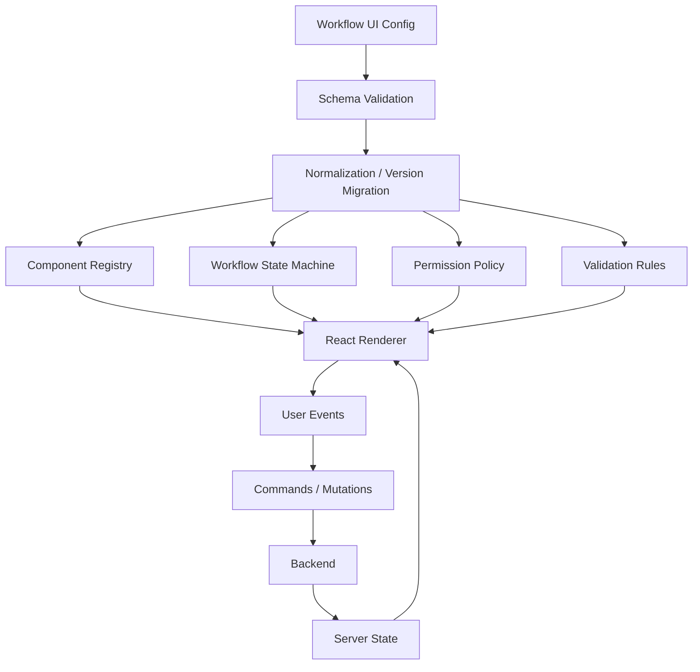
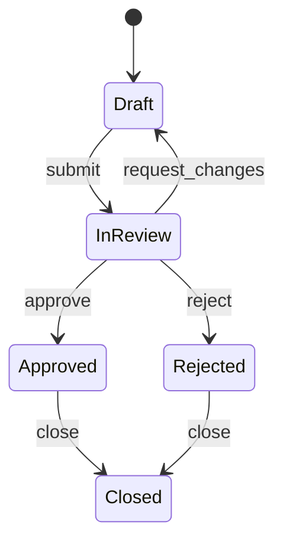
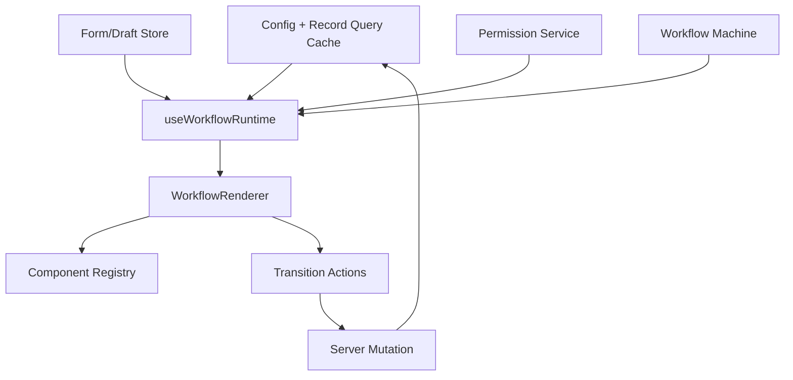

# Part 102 — Configurable Workflow UI

Configurable workflow UI adalah salah satu arsitektur paling berbahaya di frontend.

Jika didesain baik, ia membuat sistem enterprise bisa mendukung banyak proses tanpa deploy frontend setiap kali policy/form/workflow berubah.

Jika didesain buruk, ia berubah menjadi:

```txt
JSON-based programming language
+ hidden business logic
+ impossible debugging
+ weak type safety
+ inconsistent accessibility
+ configuration hell
```

Tujuan part ini bukan membuat semua UI menjadi dynamic.

Tujuannya adalah memahami kapan configurable UI masuk akal, bagaimana membatasi domain-nya, dan bagaimana membangun renderer yang tetap defensible, testable, observable, dan maintainable.

---

## 1. Masalah yang Ingin Diselesaikan

Dalam aplikasi case management, regulatory workflow, claims, onboarding, compliance review, atau internal operations, variasi UI sering mengikuti variasi proses:

```txt
Case type A punya 5 step.
Case type B punya 9 step.
Region X wajib field tambahan.
Risk high butuh approval tambahan.
Legal hold mengubah field menjadi readonly.
Supervisor bisa override beberapa step.
Feature flag mengaktifkan section baru.
Policy version lama harus tetap bisa dibuka.
```

Hardcode semua variasi menghasilkan:

```txt
if region === "X"
if risk === "HIGH"
if workflowVersion === "v3"
if user.role === "supervisor"
if caseType === "SPECIAL_INVESTIGATION"
```

Lama-lama UI menjadi policy engine informal.

Configurable workflow UI memindahkan variasi yang memang data-driven ke konfigurasi yang tervalidasi.

---

## 2. Bukan Semua Harus Configurable

Decision pertama: apakah UI ini layak dibuat configurable?

Gunakan matrix:

| Pertanyaan | Jika Ya | Jika Tidak |
|---|---|---|
| Variasi sering berubah tanpa release? | Configuration berguna | Hardcode lebih sederhana |
| Variasi bisa dimodelkan sebagai data? | Metadata-driven layak | Butuh custom component |
| Domain punya vocabulary stabil? | Schema bisa dibuat | Jangan paksa generic engine |
| Ada banyak tenant/region/process? | Configurable mengurangi duplikasi | Static UI cukup |
| Perlu audit policy version? | Config version penting | Component code cukup |
| Butuh arbitrary logic? | Hati-hati, mungkin rule engine | Jangan taruh JS di JSON |

Rule praktis:

```txt
Make variability configurable.
Keep product semantics in code.
```

Jangan membuat renderer terlalu generic sampai kehilangan domain.

---

## 3. Mental Model: Configurable UI sebagai Runtime Interpreter Terbatas

Configurable UI pada dasarnya adalah interpreter.



Kalimat penting:

> A configurable UI renderer is a constrained interpreter. The constraint is the product.

Jika tidak dibatasi, ia menjadi bahasa pemrograman baru.

---

## 4. Core Building Blocks

Configurable workflow UI biasanya punya lima lapisan.

```txt
1. Schema
2. Registry
3. Renderer
4. State/Workflow engine
5. Command boundary
```

### 4.1 Schema

Mendeskripsikan UI/workflow dalam format data.

```ts
type WorkflowConfig = {
  id: string;
  version: number;
  title: string;
  steps: StepConfig[];
};

type StepConfig = {
  id: string;
  title: string;
  sections: SectionConfig[];
  transitions: TransitionConfig[];
  visibleWhen?: Expression;
  permission?: Capability;
};

type SectionConfig = {
  id: string;
  title: string;
  fields: FieldConfig[];
  visibleWhen?: Expression;
};

type FieldConfig = {
  id: string;
  label: string;
  component: ComponentKey;
  path: string;
  required?: boolean;
  readonlyWhen?: Expression;
  visibleWhen?: Expression;
  validation?: ValidationRule[];
};

type ComponentKey =
  | "text"
  | "textarea"
  | "select"
  | "date"
  | "money"
  | "attachment"
  | "caseReference";
```

Schema sebaiknya domain-specific, bukan bebas.

Bad:

```json
{
  "component": "AnyReactComponent",
  "props": {
    "onClick": "eval('deleteCase()')"
  }
}
```

Better:

```json
{
  "component": "caseReference",
  "path": "relatedCaseId",
  "label": "Related case",
  "required": true
}
```

---

### 4.2 Registry

Registry memetakan `component` key ke React component yang sudah disetujui.

```tsx
type FieldRendererProps = {
  field: FieldConfig;
  value: unknown;
  error?: string;
  readonly: boolean;
  onChange: (value: unknown) => void;
};

type FieldRegistry = Record<ComponentKey, React.ComponentType<FieldRendererProps>>;

const fieldRegistry: FieldRegistry = {
  text: TextField,
  textarea: TextAreaField,
  select: SelectField,
  date: DateField,
  money: MoneyField,
  attachment: AttachmentField,
  caseReference: CaseReferenceField,
};
```

Registry adalah security/quality boundary:

- hanya component yang accessible boleh masuk,
- hanya component yang punya contract stabil boleh masuk,
- hanya component yang memahami form state boleh masuk,
- jangan load arbitrary component dari config mentah.

---

### 4.3 Renderer

Renderer membaca config, mengevaluasi condition, lalu render component dari registry.

```tsx
function WorkflowRenderer({
  config,
  model,
  onModelChange,
}: {
  config: WorkflowConfig;
  model: Record<string, unknown>;
  onModelChange: (next: Record<string, unknown>) => void;
}) {
  return (
    <div>
      <h1>{config.title}</h1>
      {config.steps.map((step) => (
        <StepRenderer
          key={step.id}
          step={step}
          model={model}
          onModelChange={onModelChange}
        />
      ))}
    </div>
  );
}
```

```tsx
function FieldRenderer({
  field,
  model,
  onModelChange,
}: {
  field: FieldConfig;
  model: Record<string, unknown>;
  onModelChange: (next: Record<string, unknown>) => void;
}) {
  const Component = fieldRegistry[field.component];

  if (!Component) {
    return <UnsupportedField field={field} />;
  }

  const visible = evaluateExpression(field.visibleWhen, model);
  if (!visible) return null;

  const readonly = evaluateExpression(field.readonlyWhen, model);
  const value = getByPath(model, field.path);

  return (
    <Component
      field={field}
      value={value}
      readonly={readonly}
      onChange={(nextValue) => {
        onModelChange(setByPath(model, field.path, nextValue));
      }}
    />
  );
}
```

Renderer harus simple. Complexity harus ada di schema validation, registry, workflow engine, dan domain hooks.

---

## 5. Expression System: Jangan Langsung Membuat Bahasa Pemrograman

Configurable UI sering butuh condition:

```txt
Show section when risk == HIGH.
Readonly when case is CLOSED.
Require field when channel == EMAIL.
Allow transition when validation passes.
```

Jangan menyimpan JavaScript string di database.

Bad:

```json
{
  "visibleWhen": "model.risk === 'HIGH' && user.role === 'supervisor'"
}
```

Masalah:

- security risk,
- no type safety,
- no static analysis,
- impossible migration,
- hard to audit,
- hard to sandbox correctly.

Better: buat expression AST terbatas.

```ts
type Expression =
  | { op: "always" }
  | { op: "eq"; path: string; value: unknown }
  | { op: "neq"; path: string; value: unknown }
  | { op: "in"; path: string; values: unknown[] }
  | { op: "and"; conditions: Expression[] }
  | { op: "or"; conditions: Expression[] }
  | { op: "not"; condition: Expression }
  | { op: "hasCapability"; capability: Capability };
```

Evaluator:

```ts
function evaluateExpression(
  expression: Expression | undefined,
  model: Record<string, unknown>,
  capability?: (capability: Capability) => boolean
): boolean {
  if (!expression) return true;

  switch (expression.op) {
    case "always":
      return true;
    case "eq":
      return getByPath(model, expression.path) === expression.value;
    case "neq":
      return getByPath(model, expression.path) !== expression.value;
    case "in":
      return expression.values.includes(getByPath(model, expression.path));
    case "and":
      return expression.conditions.every((condition) =>
        evaluateExpression(condition, model, capability)
      );
    case "or":
      return expression.conditions.some((condition) =>
        evaluateExpression(condition, model, capability)
      );
    case "not":
      return !evaluateExpression(expression.condition, model, capability);
    case "hasCapability":
      return capability ? capability(expression.capability) : false;
    default:
      return assertNever(expression);
  }
}
```

Expression system harus cukup untuk produk, bukan untuk semua kemungkinan.

---

## 6. Workflow State Machine

Workflow configurable bukan hanya field renderer. Ia punya state transition.

```ts
type TransitionConfig = {
  id: string;
  label: string;
  from: string;
  to: string;
  capability?: Capability;
  guard?: Expression;
  command?: CommandConfig;
};

type CommandConfig = {
  type: "saveDraft" | "submitForReview" | "approve" | "reject" | "close";
  payloadMapping?: Record<string, string>;
};
```

Diagram:



Renderer hanya menampilkan action yang valid untuk current state.

```tsx
function WorkflowActions({
  step,
  model,
  runCommand,
}: {
  step: StepConfig;
  model: Record<string, unknown>;
  runCommand: (command: CommandConfig) => Promise<void>;
}) {
  return (
    <div>
      {step.transitions.map((transition) => (
        <TransitionButton
          key={transition.id}
          transition={transition}
          model={model}
          runCommand={runCommand}
        />
      ))}
    </div>
  );
}
```

```tsx
function TransitionButton({
  transition,
  model,
  runCommand,
}: {
  transition: TransitionConfig;
  model: Record<string, unknown>;
  runCommand: (command: CommandConfig) => Promise<void>;
}) {
  const decision = usePermission(transition.capability ?? "case.update");
  const guardPasses = evaluateExpression(transition.guard, model);
  const enabled = decision.allowed && guardPasses;

  return (
    <button
      type="button"
      disabled={!enabled}
      onClick={() => {
        if (!enabled || !transition.command) return;
        void runCommand(transition.command);
      }}
    >
      {transition.label}
    </button>
  );
}
```

Again: backend must validate transition.

Frontend transition is UX guard. Backend transition is authoritative.

---

## 7. Config Versioning

Configurable UI tanpa versioning akan rusak.

Setiap config harus punya:

```ts
type ConfigMetadata = {
  id: string;
  version: number;
  effectiveFrom?: string;
  effectiveTo?: string;
  status: "draft" | "active" | "deprecated";
  migrationFrom?: number;
};
```

Kenapa?

```txt
A case created under workflow v3 must remain understandable after workflow v4 ships.
```

Strategi:

1. **Snapshot config with record**
   - record menyimpan `workflowConfigId` dan `version`.
   - aman untuk audit.
   - perlu migration path untuk old configs.

2. **Always render latest config**
   - sederhana.
   - riskan untuk long-running workflows.

3. **Versioned renderer compatibility**
   - renderer support N versi config.
   - lebih mahal, tetapi defensible.

Untuk regulated workflow, pilih snapshot/versioned config.

---

## 8. Validation Architecture

Validation configurable punya banyak level.

```txt
Schema validation
→ model validation
→ field validation
→ cross-field validation
→ step validation
→ transition guard
→ server validation
```

Jangan campur semuanya.

```ts
type ValidationRule =
  | { type: "required"; message?: string }
  | { type: "minLength"; value: number; message?: string }
  | { type: "maxLength"; value: number; message?: string }
  | { type: "pattern"; value: string; message?: string }
  | { type: "dateBefore"; path: string; message?: string }
  | { type: "custom"; id: string; message?: string };
```

Custom validator harus registry-based, bukan arbitrary code.

```ts
type Validator = (
  value: unknown,
  model: Record<string, unknown>,
  rule: ValidationRule
) => string | null;

const validatorRegistry: Record<string, Validator> = {
  required(value, _model, rule) {
    return value == null || value === ""
      ? rule.message ?? "This field is required."
      : null;
  },
  minLength(value, _model, rule) {
    if (typeof value !== "string") return null;
    return value.length < rule.value
      ? rule.message ?? `Must be at least ${rule.value} characters.`
      : null;
  },
};
```

Server validation tetap wajib.

Client validation adalah feedback cepat, bukan source of truth.

---

## 9. Data Binding and Path Safety

Naive config memakai string path:

```json
{ "path": "applicant.address.city" }
```

Masalah:

- typo baru ketahuan runtime,
- refactor sulit,
- hidden coupling dengan model shape.

Mitigasi:

1. Generate path dari schema backend/shared package.
2. Validate config terhadap model schema.
3. Buat migration untuk rename path.
4. Simpan config test fixture.
5. Log unsupported path di renderer.

Runtime helper harus immutable:

```ts
function setByPath(
  model: Record<string, unknown>,
  path: string,
  value: unknown
): Record<string, unknown> {
  const keys = path.split(".");
  const next = structuredClone(model);
  let cursor: Record<string, unknown> = next;

  for (const key of keys.slice(0, -1)) {
    const child = cursor[key];
    if (typeof child !== "object" || child == null) {
      cursor[key] = {};
    }
    cursor = cursor[key] as Record<string, unknown>;
  }

  cursor[keys[keys.length - 1]] = value;
  return next;
}
```

Untuk performance, jangan structuredClone model besar setiap keypress di production. Gunakan state update yang lebih granular atau form library/state store yang mendukung path updates efisien.

---

## 10. Renderer State Topology

Configurable workflow UI biasanya punya banyak state.

| State | Owner | Catatan |
|---|---|---|
| Config | server/cache | Versioned, immutable during render session |
| Draft form model | local/form store | High-frequency updates |
| Server record | server-state cache | Authoritative resource snapshot |
| Current step | URL/local/workflow machine | Depends on shareability |
| Validation errors | form state/server result | Split client/server error source |
| Permission decisions | server-provided or client capability layer | Must tolerate staleness |
| Transition pending | mutation/action state | Command lifecycle |
| UI expansion/focus | local | Do not persist unless needed |

Do not put all into one Context.

Better architecture:



---

## 11. `useWorkflowRuntime` as Application Hook

Centralize orchestration.

```tsx
function useWorkflowRuntime(workflowId: string, recordId: string) {
  const configQuery = useWorkflowConfigQuery(workflowId);
  const recordQuery = useWorkflowRecordQuery(recordId);
  const saveMutation = useSaveWorkflowMutation(recordId);
  const transitionMutation = useWorkflowTransitionMutation(recordId);

  const config = configQuery.data;
  const record = recordQuery.data;

  const [draft, setDraft] = useState(() => record?.model ?? {});

  useEffect(() => {
    if (!record) return;
    setDraft(record.model);
  }, [record?.version]);

  const runtime = useMemo(() => {
    if (!config || !record) return null;

    return createWorkflowRuntime({
      config,
      record,
      draft,
    });
  }, [config, record, draft]);

  return {
    isLoading: configQuery.isLoading || recordQuery.isLoading,
    error: configQuery.error ?? recordQuery.error,
    config,
    record,
    draft,
    setDraft,
    runtime,
    saveDraft: () => saveMutation.mutateAsync({ model: draft }),
    runTransition: (transitionId: string) =>
      transitionMutation.mutateAsync({ transitionId, model: draft }),
    isSaving: saveMutation.isPending,
    isTransitioning: transitionMutation.isPending,
  };
}
```

Page:

```tsx
function WorkflowPage() {
  const { workflowId, recordId } = useParams();
  const workflow = useWorkflowRuntime(workflowId!, recordId!);

  if (workflow.isLoading) return <WorkflowSkeleton />;
  if (workflow.error) return <WorkflowError error={workflow.error} />;
  if (!workflow.config || !workflow.runtime) return <WorkflowUnavailable />;

  return (
    <WorkflowRenderer
      config={workflow.config}
      runtime={workflow.runtime}
      model={workflow.draft}
      onModelChange={workflow.setDraft}
      onSaveDraft={workflow.saveDraft}
      onRunTransition={workflow.runTransition}
    />
  );
}
```

Renderer remains mostly pure. Runtime hook handles queries/mutations/state.

---

## 12. Configurable Does Not Mean Untyped

Use TypeScript for internal contracts.

Use runtime validation for config loaded from server.

Example with a schema validator conceptually:

```ts
function parseWorkflowConfig(input: unknown): WorkflowConfig {
  const result = WorkflowConfigSchema.safeParse(input);

  if (!result.success) {
    throw new Error("Invalid workflow configuration");
  }

  return result.data;
}
```

Validation should happen at multiple boundaries:

```txt
configuration authoring time
configuration publish time
server API response time
frontend runtime parse time
renderer unsupported-component fallback
```

Never trust remote config blindly.

---

## 13. Component Registry Contract

Every configurable component must satisfy a contract.

```txt
[ ] Accepts value and onChange
[ ] Supports readonly
[ ] Supports disabled if applicable
[ ] Emits normalized value
[ ] Handles validation error
[ ] Has accessible label association
[ ] Does not own server mutation directly
[ ] Does not read global domain state implicitly
[ ] Is keyboard accessible
[ ] Has Storybook scenarios
[ ] Has regression tests
```

Bad field component:

```tsx
function SpecialCaseField() {
  const caseId = useParams().caseId;
  const mutation = useSpecialMutation(caseId);

  return <button onClick={() => mutation.mutate()}>Do Special Thing</button>;
}
```

It hides route/mutation dependency inside field renderer.

Better:

```tsx
function SpecialCaseField({ value, onChange, readonly, field }: FieldRendererProps) {
  return (
    <SpecialCaseSelector
      label={field.label}
      value={value as string | null}
      readonly={readonly}
      onChange={onChange}
    />
  );
}
```

Keep commands at workflow boundary, not inside arbitrary field components.

---

## 14. Permission Integration

Workflow config can declare permission needs.

```ts
type SectionConfig = {
  id: string;
  title: string;
  permission?: Capability;
  fields: FieldConfig[];
};
```

Renderer:

```tsx
function SectionRenderer({ section, model }: SectionRendererProps) {
  const decision = usePermission(section.permission ?? "case.read");

  if (!decision.allowed) {
    return null;
  }

  return (
    <section>
      <h2>{section.title}</h2>
      {section.fields.map((field) => (
        <FieldRenderer key={field.id} field={field} model={model} />
      ))}
    </section>
  );
}
```

For field update permission:

```tsx
const updateDecision = usePermission(field.updatePermission ?? "case.update");
const readonly = !updateDecision.allowed || evaluateExpression(field.readonlyWhen, model);
```

Backend still validates read/update/transition.

---

## 15. Extensibility Without Chaos

There are several extension mechanisms.

| Extension | Safer? | Use Case |
|---|---:|---|
| Component registry key | High | Known UI primitives |
| Validator registry key | High | Known validation rules |
| Command registry key | Medium | Known backend commands |
| Expression AST | Medium | Limited conditions |
| Plugin package | Medium/Low | Internal extension team |
| Arbitrary JS from config | Very low | Avoid |

Config should select from approved capabilities. It should not define arbitrary behavior.

---

## 16. Command Boundary

Config can describe command intent, but code should execute it.

```ts
type CommandHandler = (args: {
  command: CommandConfig;
  model: Record<string, unknown>;
  record: WorkflowRecord;
}) => Promise<void>;

const commandHandlers: Record<CommandConfig["type"], CommandHandler> = {
  async saveDraft({ model, record }) {
    await api.saveDraft(record.id, model);
  },
  async submitForReview({ model, record }) {
    await api.submitForReview(record.id, model);
  },
  async approve({ record }) {
    await api.approve(record.id);
  },
  async reject({ record }) {
    await api.reject(record.id);
  },
  async close({ record }) {
    await api.close(record.id);
  },
};
```

Never let config specify endpoint/method freely:

Bad:

```json
{
  "command": {
    "method": "DELETE",
    "url": "/admin/users/123"
  }
}
```

Better:

```json
{
  "command": {
    "type": "approve"
  }
}
```

---

## 17. Observability

Configurable UI is hard to debug without runtime visibility.

Log structured events:

```ts
type WorkflowUiEvent =
  | {
      type: "workflow_config_loaded";
      workflowId: string;
      version: number;
    }
  | {
      type: "workflow_field_changed";
      workflowId: string;
      fieldId: string;
    }
  | {
      type: "workflow_transition_clicked";
      workflowId: string;
      transitionId: string;
    }
  | {
      type: "workflow_transition_denied";
      workflowId: string;
      transitionId: string;
      reason: string;
    }
  | {
      type: "workflow_config_error";
      workflowId: string;
      errorCode: string;
    };
```

Do not log full model if it may contain PII, secrets, or regulated data.

Useful debug panel in non-production:

```txt
Workflow ID
Config version
Current step
Visible sections
Hidden sections and reasons
Validation errors
Available transitions
Denied transitions and reasons
Pending command
```

This is often more valuable than console logs.

---

## 18. Testing Strategy

Test each layer separately.

### 18.1 Config schema tests

```txt
invalid component key rejected
missing field path rejected
duplicate field id rejected
transition target must exist
unknown validator rejected
```

### 18.2 Expression tests

```txt
eq works
and/or/not works
unknown path returns false or configured default
capability expression calls permission service
```

### 18.3 Renderer tests

```txt
renders text field
hides section when condition false
makes field readonly when condition true
shows unsupported component fallback
preserves stable field identity
```

### 18.4 Workflow tests

```txt
only valid transitions shown
denied transition disabled
transition command called with mapped payload
server validation error mapped to field
stale transition rejection refreshes record
```

### 18.5 Golden config tests

For critical workflows, keep fixtures:

```txt
workflow-config-v1.json
workflow-config-v2.json
workflow-config-v3.json
```

Render them in test and Storybook.

---

## 19. Performance Considerations

Configurable renderer can become slow because:

```txt
many fields
many expressions
many permissions
many validations
large model object
frequent keystrokes
context fan-out
expensive registry components
```

Mitigations:

1. Compile config once into normalized runtime.
2. Memoize expression plans.
3. Subscribe fields to path-level state instead of whole model.
4. Avoid recomputing all visibility on every keystroke if graph is known.
5. Virtualize large repeated sections if needed.
6. Keep permission decisions cached per capability/resource/version.
7. Profile before adding memoization everywhere.

Example normalized runtime:

```ts
type WorkflowRuntime = {
  stepsById: Map<string, StepConfig>;
  fieldsById: Map<string, FieldConfig>;
  fieldsByPath: Map<string, FieldConfig>;
  transitionsById: Map<string, TransitionConfig>;
  dependencyGraph: Map<string, string[]>;
};
```

Dependency graph can answer:

```txt
When model.risk changes, which fields/sections/guards need reevaluation?
```

---

## 20. Failure Modes

### 20.1 JSON programming language

Symptom:

```json
{
  "onClick": "if (user.role === 'admin') fetch('/delete')"
}
```

Fix:

```txt
Use registry-based commands and limited expression AST.
```

---

### 20.2 Config has no version

Symptom:

```txt
Old records break after new config ships.
```

Fix:

```txt
Version config and store workflow version with record.
```

---

### 20.3 Renderer owns business logic

Symptom:

```txt
Renderer has huge switch statements for business cases.
```

Fix:

```txt
Move semantics to config schema, domain hook, command registry, or workflow runtime.
```

---

### 20.4 Component registry leaks domain dependencies

Symptom:

```txt
Field component reads route params, query cache, and mutations directly.
```

Fix:

```txt
Field components receive value/onChange/readonly/error. Commands live at workflow boundary.
```

---

### 20.5 Hidden validation mismatch

Symptom:

```txt
Hidden field still fails required validation.
```

Fix:

```txt
Validation must account for visibility and workflow step.
```

---

### 20.6 Permission mismatch

Symptom:

```txt
Transition shown enabled but backend denies.
```

Fix:

```txt
Treat as stale permission/resource state. Refresh record and show authorization conflict.
```

---

### 20.7 No authoring tool constraints

Symptom:

```txt
Config authors create invalid or inaccessible workflows.
```

Fix:

```txt
Validate at publish time. Provide preview, lint, and test harness.
```

---

## 21. Architecture Decision Checklist

Before building configurable workflow UI, answer:

```txt
[ ] What variation is truly configurable?
[ ] What variation stays in code?
[ ] Who authors config?
[ ] How is config validated before publish?
[ ] How is config versioned?
[ ] Can old records still render?
[ ] What is the component registry contract?
[ ] What is the expression language boundary?
[ ] Are commands registry-based instead of arbitrary endpoints?
[ ] Where is server authorization enforced?
[ ] How are permissions represented in config?
[ ] How are field/step/transition validations layered?
[ ] How is performance measured for large workflows?
[ ] How is config behavior tested?
[ ] How do we debug hidden fields, denied actions, and validation errors?
[ ] What is the migration plan if config shape changes?
```

---

## 22. Recommended Architecture

For serious applications, use this structure:

```txt
src/
  features/
    workflow-runtime/
      api/
        workflowConfigApi.ts
        workflowRecordApi.ts
      model/
        workflowConfigSchema.ts
        workflowRuntime.ts
        expressionEvaluator.ts
        validationEngine.ts
        commandRegistry.ts
      ui/
        WorkflowRenderer.tsx
        StepRenderer.tsx
        SectionRenderer.tsx
        FieldRenderer.tsx
        WorkflowActions.tsx
      registry/
        fieldRegistry.ts
        validatorRegistry.ts
      hooks/
        useWorkflowRuntime.ts
      testing/
        workflowFixtures.ts
        renderWorkflow.tsx
```

Dependency direction:

```txt
Page
→ useWorkflowRuntime
→ workflow model/api/registry
→ renderer
→ approved field components
```

Renderer should not import page-specific hooks.

Field components should not import workflow mutation commands.

Command execution should happen at workflow runtime boundary.

---

## 23. Key Takeaways

Configurable workflow UI is powerful when it models real product variability.

It becomes dangerous when it tries to replace programming with untyped configuration.

The correct mental model:

```txt
Config describes approved product variation.
Registry supplies approved behavior.
Renderer interprets config predictably.
Workflow machine controls transitions.
Command boundary talks to backend.
Backend remains authoritative.
```

Final rule:

> Do not build a generic UI engine. Build a constrained workflow interpreter for a specific domain.

---

## References

- React — Components and Hooks must be pure: https://react.dev/reference/rules/components-and-hooks-must-be-pure
- React — Scaling Up with Reducer and Context: https://react.dev/learn/scaling-up-with-reducer-and-context
- React — Conditional Rendering: https://react.dev/learn/conditional-rendering
- OWASP Authorization Cheat Sheet: https://cheatsheetseries.owasp.org/cheatsheets/Authorization_Cheat_Sheet.html
- MDN — aria-disabled: https://developer.mozilla.org/en-US/docs/Web/Accessibility/ARIA/Reference/Attributes/aria-disabled
