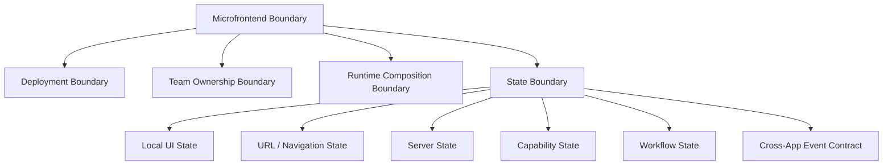
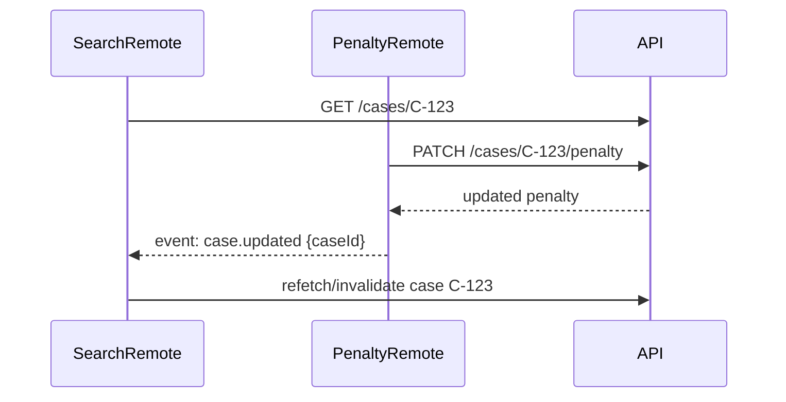
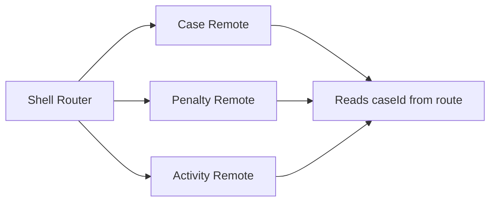
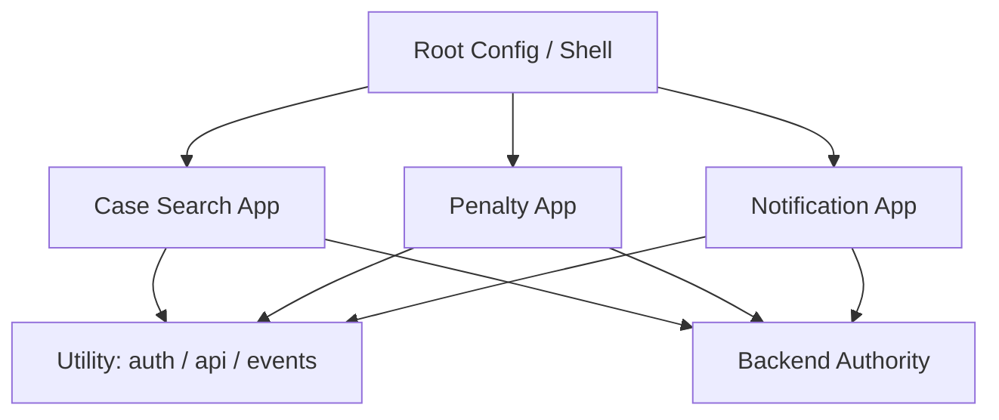
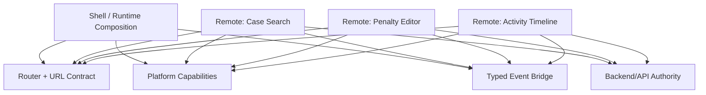
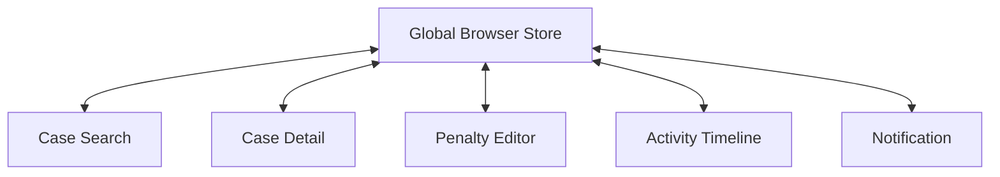
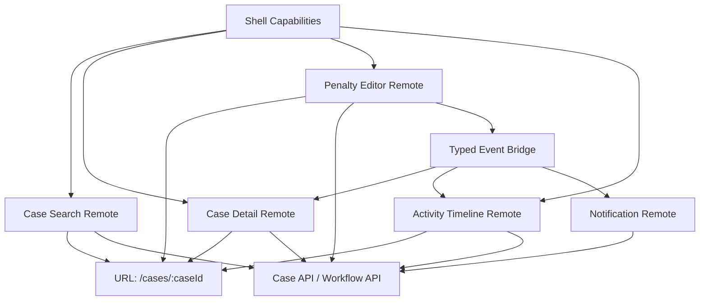
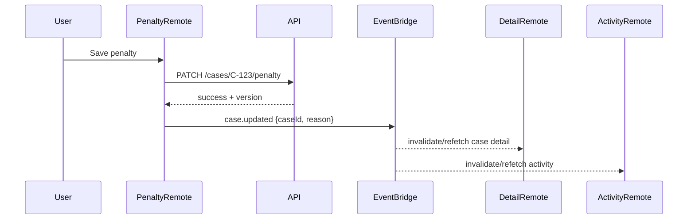

# Part 103 — Microfrontend State Boundaries

Microfrontend architecture is not a state-management technique.

It is a **delivery and ownership architecture**: multiple independently built, released, and owned frontend units cooperate inside one user experience. If the state model is not explicit, microfrontends usually collapse into one of two failures:

1. **Distributed monolith** — many deployables, one tangled runtime state graph.
2. **Fragmented UX** — independent pieces that cannot coordinate navigation, permissions, cache freshness, or workflow intent.

The goal of this part is to design state boundaries so microfrontends can collaborate without turning the browser into an ungoverned distributed system.

---

## 1. The Core Mental Model

A microfrontend boundary is valid only if it answers four questions:

```txt
Who owns this state?
Who is allowed to mutate it?
How does another frontend observe it?
What happens when another frontend is on a different version?
```

If those questions are unclear, the boundary is not architecture. It is a bundle-splitting trick.



The most important rule:

> Do not make shared browser memory your default integration mechanism.

Prefer explicit integration contracts: URL, server state, typed event bridge, capability provider, or stable utility API.

---

## 2. Microfrontend Is a Boundary, Not a License to Share Everything

A React monolith can use props, context, reducers, stores, and query cache inside one coherent runtime. A microfrontend system adds independent build and release cycles. That changes the risk profile.

Inside one React app, this is acceptable:

```tsx
<PermissionProvider>
  <CaseSearchPage />
</PermissionProvider>
```

Across independently deployed microfrontends, this is dangerous if treated casually:

```tsx
// shell
<GlobalAppContext.Provider value={everything}>
  <RemoteCaseSearch />
  <RemotePenaltyEditor />
</GlobalAppContext.Provider>
```

Why?

Because the remote is now coupled to:

- provider shape
- provider version
- provider lifecycle
- provider rendering semantics
- state update frequency
- React runtime compatibility
- release coordination between shell and remote

That is not integration. That is hidden shared implementation.

---

## 3. State Taxonomy in Microfrontend Systems

Before choosing a communication pattern, classify the state.

| State Kind | Example | Correct Owner | Sharing Mechanism |
|---|---|---|---|
| Local UI state | dropdown open, row hover, local tab | owning component/remote | do not share |
| Local workflow state | wizard step inside one remote | owning remote | internal reducer/machine |
| Navigation state | selected case id, filter query | router/shell/URL | URL params/search params |
| Server state | case detail, tasks, comments | backend/API | query cache per remote or shared API contract |
| Identity/session | current user, token expiry | shell/auth capability | utility module/capability API |
| Permission decision | can approve, can edit penalty | backend + capability provider | decision object, not raw role dump |
| Cross-MFE intent | open case drawer, refresh badge | event contract | typed event bridge |
| Design-system state | theme, density, direction | shell/design system | context or CSS variables |
| Global workflow | case lifecycle spanning remotes | backend/workflow service | server state + event notifications |

The mistake is treating all of these as “global state”. They are not global in the same way.

---

## 4. Non-Negotiable Invariants

For microfrontend state, use these invariants as hard rules.

### Invariant 1 — A remote owns its internal interaction state

A remote should not leak internal UI state unless another app has a real product reason to observe it.

Bad:

```ts
window.globalStore.caseSearch = {
  selectedRows,
  expandedRows,
  visibleColumns,
  internalDraftFilters,
};
```

Good:

```ts
// Remote owns internal table state.
// Only committed navigation/filter state becomes URL state.
/cases?status=open&assignee=me&page=2
```

### Invariant 2 — Cross-boundary state must be versioned

A typed event or utility API is still an API. It needs a versioning strategy.

```ts
type CaseOpenedV1 = {
  type: 'case.opened';
  version: 1;
  payload: {
    caseId: string;
    source: 'search' | 'task-list' | 'notification';
  };
};
```

### Invariant 3 — Cross-boundary mutation must be explicit

A remote should not directly mutate another remote's state.

Bad:

```ts
window.penaltyEditorStore.getState().setDraftAmount(5000);
```

Good:

```ts
eventBridge.publish({
  type: 'penalty.editRequested',
  version: 1,
  payload: { caseId, proposedAmount: 5000 },
});
```

The receiving remote decides whether it can honor the request.

### Invariant 4 — Server state is synchronized through server authority

If two remotes display the same case summary, the backend owns the truth. The browser cache is a performance layer, not authority.



Notice that the event does not carry the entire new canonical case object. It carries an invalidation signal or intent. The API remains authority.

---

## 5. Integration Patterns, Ranked by Safety

### Pattern 1 — URL as State Contract

Use the URL for state that should survive reload, support share/back/forward, or identify the current resource/view.

Good candidates:

- selected entity id
- active tab when meaningful
- search filters
- pagination cursor
- route-level mode such as `review`, `edit`, `audit`

Example:

```txt
/enforcement/cases/C-123?tab=penalties&drawer=activity
```

Mermaid view:



Use URL state when the state is:

- meaningful to the user
- serializable
- stable enough to bookmark
- safe to expose in browser history/logs

Do not put these in URL:

- secrets
- personally sensitive temporary data
- large drafts
- high-frequency UI state
- optimistic temporary internals

---

### Pattern 2 — Server State as Rendezvous

When multiple remotes care about the same business entity, prefer server-state coordination.

Each remote may have its own TanStack Query client or cache, but they should share:

- API contract
- query key schema if using a shared query utility
- invalidation event convention
- entity version/ETag policy when concurrency matters

Example:

```ts
// shared query key factory as public utility API
export const caseKeys = {
  all: ['cases'] as const,
  detail: (caseId: string) => ['cases', 'detail', caseId] as const,
  tasks: (caseId: string) => ['cases', 'detail', caseId, 'tasks'] as const,
};
```

The key factory can be shared. The cache instance does not have to be shared.

That distinction matters.

Shared key factory = stable integration contract.
Shared cache singleton = runtime coupling.

---

### Pattern 3 — Capability Utility Module

A utility module is useful for platform capabilities that many microfrontends need but should not own.

Examples:

- authentication/session access
- permission decision API
- analytics client
- logger
- feature flag reader
- API client factory
- design-system tokens
- route helpers

Good utility API:

```ts
export type PermissionDecision = {
  allowed: boolean;
  reason?: 'missing_permission' | 'case_locked' | 'status_not_allowed';
};

export function canApproveCase(input: {
  caseId: string;
  caseStatus: string;
}): Promise<PermissionDecision>;
```

Bad utility API:

```ts
export const globalUserObject = mutableEverything;
export const globalReduxStore = store;
```

A utility module should expose **capabilities**, not uncontrolled mutable state.

---

### Pattern 4 — Typed Event Bridge

Use an event bridge for cross-boundary intent and notification.

Good events:

- `case.openRequested`
- `case.updated`
- `notification.countInvalidated`
- `modal.openRequested`
- `audit.logRequested`

Bad events:

- `setSelectedCaseId`
- `updateRemoteStore`
- `toggleThatOtherComponent`
- `contextChanged`

An event bridge should not smuggle implementation details.

A minimal event bridge:

```ts
type AppEvent =
  | {
      type: 'case.openRequested';
      version: 1;
      payload: { caseId: string; source: string };
    }
  | {
      type: 'case.updated';
      version: 1;
      payload: { caseId: string; reason: 'penalty_changed' | 'status_changed' };
    };

type Handler<T extends AppEvent['type']> = (
  event: Extract<AppEvent, { type: T }>
) => void;

class EventBridge {
  private target = new EventTarget();

  publish(event: AppEvent) {
    this.target.dispatchEvent(
      new CustomEvent(event.type, { detail: event })
    );
  }

  subscribe<T extends AppEvent['type']>(type: T, handler: Handler<T>) {
    const listener = (raw: Event) => {
      const event = (raw as CustomEvent).detail;
      handler(event);
    };

    this.target.addEventListener(type, listener);

    return () => {
      this.target.removeEventListener(type, listener);
    };
  }
}
```

React adapter:

```tsx
function useAppEvent<T extends AppEvent['type']>(
  bridge: EventBridge,
  type: T,
  handler: Handler<T>
) {
  useEffect(() => {
    return bridge.subscribe(type, handler);
  }, [bridge, type, handler]);
}
```

Production version should also include:

- runtime validation
- event version handling
- logging/breadcrumbs
- dead-letter handling for invalid events
- ownership documentation
- backward compatibility policy

---

### Pattern 5 — Shared External Store

This is the most dangerous pattern and should be rare.

A shared external store may be acceptable for:

- shell-level ephemeral state such as active global command palette
- design-system shell state like density/sidebar collapse
- platform notification count if explicitly owned by shell
- session-level non-sensitive read model

It is usually wrong for:

- domain entity data
- form drafts
- server authority state
- remote internals
- workflow state that belongs to one feature

If used, enforce these constraints:

```txt
- store has one named owner
- exposed API is narrow
- no remote imports internal slice directly
- all mutation methods are commands
- store shape is versioned
- subscriptions are selector-based
- SSR/hydration behavior is documented
- tests cover two versions of consuming remotes
```

---

## 6. Module Federation State Boundary Concerns

Module Federation allows independent builds to consume exposed modules from other builds at runtime. This is powerful, but it creates specific state risks.

### Risk 1 — Shared singleton dependency drift

React should normally be shared as a singleton in a federated React system. Multiple React copies can cause invalid hook call errors or incompatible context boundaries.

But singleton sharing also creates release coupling:

```txt
Remote A expects React behavior/version X.
Remote B expects React behavior/version Y.
Shell provides React version Z.
```

Mitigation:

- define supported React version range
- keep shell and remotes inside a compatibility window
- test remotes against shell-provided shared dependencies
- avoid relying on undocumented internals
- do not expose hooks/components compiled against incompatible runtime assumptions

### Risk 2 — Remote imports become hidden architecture

Bad:

```ts
import { internalCaseStore } from 'caseRemote/internal/state';
```

Good:

```ts
import { openCase, caseEvents } from '@platform/case-contract';
```

Expose contracts, not internals.

### Risk 3 — Runtime loading failure becomes product state failure

Remote loading can fail. That failure must be modeled in UI state.

```tsx
<Suspense fallback={<RemoteSkeleton />}>
  <ErrorBoundary fallback={<RemoteUnavailable feature="Penalty Editor" />}>
    <PenaltyRemote caseId={caseId} />
  </ErrorBoundary>
</Suspense>
```

The shell must not assume every remote is always present.

---

## 7. single-spa State Boundary Concerns

single-spa commonly separates microfrontends into applications, parcels, and utility modules.

The state implication:

- application owns a route/area lifecycle
- parcel is embeddable UI with mount/unmount lifecycle
- utility module exposes reusable functions/stateful capabilities

The trap is putting all shared state into utility modules.

A utility module is a good home for an API client factory. It is not automatically a good home for mutable workflow state.



Utility module rule:

> Export stable capabilities. Avoid exporting mutable implementation state unless that state is explicitly platform-owned.

---

## 8. Recommended Boundary Architecture

For a production React microfrontend system, use this layered model.



### Shell owns

- runtime composition
- route table
- global layout
- auth/session capability
- global error boundary
- remote loading state
- platform event bridge
- design-system root providers

### Remote owns

- feature UI state
- feature workflow state
- feature query hooks
- internal reducers/machines
- component composition
- feature-level error/loading UX

### Backend owns

- canonical business state
- authorization decision
- workflow lifecycle authority
- audit trail
- concurrency/version check

### Shared platform owns

- typed contracts
- event schema
- API client factory
- observability client
- design system primitives
- permission client

---

## 9. Cross-Microfrontend Communication Matrix

| Communication Need | Prefer | Avoid |
|---|---|---|
| Navigate to entity | URL/router command | writing remote state directly |
| Refresh data after mutation | invalidation event + API refetch | broadcasting full mutable entity dump |
| Open global modal | shell overlay capability | remote importing shell internals |
| Share current user | auth utility/capability | mutable `window.user` object |
| Share permission | permission decision API | raw role arrays everywhere |
| Share table selection | usually do not share | global selected row store |
| Coordinate wizard across remotes | backend workflow + route state | cross-remote reducer |
| Share design theme | CSS variables/context from shell | per-remote incompatible theme state |
| Publish analytics | platform analytics client | each remote inventing event schema |
| Microfrontend loaded/unloaded | lifecycle events | assuming remote is always present |

---

## 10. Example: Enforcement Case Platform

Assume a regulatory case-management UI:

- Shell
- Case Search remote
- Case Detail remote
- Penalty Editor remote
- Activity Timeline remote
- Notification remote

### Incorrect state design



Problems:

- every remote can mutate everything
- release coupling is hidden
- no clear authority
- stale data is indistinguishable from canonical data
- auditability is poor
- permission drift is likely
- tests require booting the world

### Better state design



Mutation flow:



This keeps business truth in the backend and uses events as coordination hints.

---

## 11. State Boundary Design by Lifecycle

### Remote-local lifecycle

Use component state, reducer, context, or machine inside the remote.

Examples:

- active row
- expanded accordion
- local validation state
- unsaved draft in one feature
- local modal inside the remote

### Route lifecycle

Use URL state.

Examples:

- `caseId`
- selected tab
- committed filters
- page/cursor
- mode: `view`, `edit`, `audit`

### Session lifecycle

Use shell/platform capability.

Examples:

- current user summary
- permission client
- feature flag client
- global navigation state

### Entity lifecycle

Use server state.

Examples:

- case detail
- list data
- task count
- comments
- workflow status

### Cross-version lifecycle

Use versioned contracts.

Examples:

- event schema
- route schema
- utility API
- exposed component props

---

## 12. Public Contract Design

Every cross-MFE boundary should have a public contract.

### Route contract

```ts
type CaseRoute = {
  pathname: '/cases/:caseId';
  params: { caseId: string };
  search?: {
    tab?: 'summary' | 'penalties' | 'activity';
    drawer?: 'timeline' | 'notes';
  };
};
```

### Event contract

```ts
type CaseEvents =
  | {
      type: 'case.updated';
      version: 1;
      payload: {
        caseId: string;
        reason: 'status_changed' | 'penalty_changed' | 'assignment_changed';
      };
    }
  | {
      type: 'case.openRequested';
      version: 1;
      payload: {
        caseId: string;
        source: string;
      };
    };
```

### Capability contract

```ts
type PlatformCapabilities = {
  auth: {
    getUser(): Promise<UserSummary>;
    getAccessToken(): Promise<string>;
  };
  permissions: {
    can(input: PermissionInput): Promise<PermissionDecision>;
  };
  analytics: {
    track(event: AnalyticsEvent): void;
  };
  overlays: {
    confirm(input: ConfirmRequest): Promise<ConfirmResult>;
  };
};
```

### Remote mount contract

```ts
type CaseDetailRemoteProps = {
  caseId: string;
  capabilities: PlatformCapabilities;
  eventBridge: EventBridge;
  onNavigate?: (target: AppRoute) => void;
};
```

Narrow contracts survive version drift better than broad shared objects.

---

## 13. Shared Query Cache: Usually Avoid

A shared QueryClient across remotes looks attractive.

```tsx
<QueryClientProvider client={globalQueryClient}>
  <RemoteA />
  <RemoteB />
</QueryClientProvider>
```

It may work in a tightly coordinated monorepo. But in independently deployed remotes, it can create hidden coupling:

- query key conflicts
- stale time assumptions differ
- mutation invalidation blast radius is unclear
- cache memory is shared across unknown features
- one remote can remove/invalidate another remote's cache accidentally
- versioned query shape changes can break another remote

Safer default:

```txt
Shared API contract + shared query key factory + remote-owned QueryClient.
```

Use a shared QueryClient only if:

- remotes are version-locked
- query key namespace is governed
- cache ownership is documented
- integration tests cover mixed remotes
- the shell explicitly owns server-state cache policy

---

## 14. Shared Redux/Zustand Store: Even More Rare

A shared store across remotes is usually a distributed monolith.

Bad smell:

```ts
// every remote imports the same global store
import { useGlobalStore } from '@platform/store';
```

Better:

```ts
// platform exposes command/query capabilities
const canApprove = await capabilities.permissions.can({
  action: 'case.approve',
  resourceId: caseId,
});
```

If you truly need a shared store, expose domain-specific selectors and commands:

```ts
type ShellStateApi = {
  useSidebarCollapsed(): boolean;
  setSidebarCollapsed(value: boolean): void;
  useCommandPaletteOpen(): boolean;
  openCommandPalette(): void;
  closeCommandPalette(): void;
};
```

Do not expose raw root state.

---

## 15. Versioning Strategy

Microfrontend state contracts must survive mixed versions.

### Backward-compatible changes

Usually safe:

- adding optional event field
- adding new event type
- adding new route search param with default behavior
- adding new optional capability method

### Breaking changes

Dangerous:

- renaming event type
- changing payload meaning
- changing required prop
- changing route param semantics
- changing default permission interpretation
- changing query response shape without API versioning

### Compatibility policy

```txt
- Shell supports N and N-1 remote contracts.
- Platform utility APIs are semvered.
- Events include version field.
- Unknown event fields are ignored.
- Unknown event versions are rejected or routed to fallback.
- Removal requires deprecation window.
```

---

## 16. Testing Strategy

Microfrontend state boundaries need contract tests more than snapshot tests.

### Unit tests

- remote reducer/machine
- URL parse/serialize
- event payload validation
- capability adapter behavior
- query key factory

### Contract tests

- remote accepts documented props
- remote emits documented events
- shell handles remote unavailable
- utility API preserves backward compatibility
- event schema supports N-1 version

### Integration tests

- shell + remote composition
- mutation invalidates another remote
- route change updates all interested remotes
- auth expiry affects all remotes consistently
- permission change disables/blocks actions

### Chaos tests

- remote fails to load
- remote loads slow
- utility module unavailable
- stale remote emits older event version
- duplicate event is published
- event arrives before subscriber mounts
- backend mutation succeeds but invalidation event fails

---

## 17. Observability

Cross-boundary bugs are hard because no single component owns the whole chain.

Log boundary events with correlation IDs.

```ts
eventBridge.publish({
  type: 'case.updated',
  version: 1,
  correlationId: commandId,
  payload: { caseId, reason: 'penalty_changed' },
});
```

Recommended observability dimensions:

- remote name
- remote version
- shell version
- event type/version
- route
- user/session id hash
- correlation id
- query key affected
- command id
- backend request id
- permission decision reason

Without this, debugging cross-MFE state bugs becomes guesswork.

---

## 18. Failure Modes

### Failure Mode 1 — Global store becomes integration layer

Symptom:

- every remote imports `@platform/store`
- unrelated releases break each other
- no one knows who owns state fields

Fix:

- split platform capabilities from feature state
- move entity truth to server state
- expose commands/selectors, not root state
- write ADR for remaining shared store

### Failure Mode 2 — Event bus becomes command soup

Symptom:

```txt
remoteA.setFoo
remoteB.toggleBar
remoteC.updateWhatever
```

Fix:

- rename events as product/domain intents
- validate payload
- define owner for each event
- distinguish notification event from command event

### Failure Mode 3 — URL becomes untyped dumping ground

Symptom:

- query params are inconsistent
- browser back breaks state
- sensitive state leaks into URL

Fix:

- create route/search schema
- parse and canonicalize
- reject unknown/invalid values
- define privacy rules

### Failure Mode 4 — Shared dependencies drift

Symptom:

- invalid hook call
- context not crossing boundary
- duplicate React instance
- remote works locally but fails in shell

Fix:

- enforce singleton React where appropriate
- test remote in shell compatibility harness
- document supported version range
- avoid exposing internals compiled against unstable assumptions

### Failure Mode 5 — Cache invalidation is inconsistent

Symptom:

- one remote updates entity
- another remote shows stale data
- user sees conflicting status

Fix:

- define mutation impact map
- publish invalidation event
- refetch canonical server state
- use entity version/ETag where needed

### Failure Mode 6 — Permission state drifts

Symptom:

- button enabled in one remote, disabled in another
- backend rejects action user could start
- audit trail lacks precondition reason

Fix:

- centralize permission decision capability
- include resource state in permission input
- handle stale permission as expected error
- never trust frontend as final authorization

---

## 19. Review Checklist

Before approving a microfrontend state boundary, ask:

```txt
[ ] Is this state local, URL, server, capability, workflow, or cross-app event?
[ ] Who owns it?
[ ] Who can mutate it?
[ ] Is the contract versioned?
[ ] Does it survive mixed remote versions?
[ ] Does it survive remote loading failure?
[ ] Is sensitive state kept out of URL/localStorage?
[ ] Is server state refetched from canonical authority?
[ ] Is there a correlation id for cross-boundary flows?
[ ] Is there a contract test?
[ ] Is there an ADR for non-obvious sharing?
```

---

## 20. Practical Rule of Thumb

Use this hierarchy:

```txt
Can it stay local? Keep it local.
Must it be shareable/bookmarkable? Put it in URL.
Is it canonical business data? Fetch from server/cache.
Is it a platform capability? Expose a narrow utility/capability API.
Is it cross-app intent? Publish a typed event.
Is it truly shared browser state? Use a governed external store as a last resort.
```

Microfrontend state design is mostly about restraint.

The best boundary is the one that lets teams ship independently while keeping business truth, user intent, and runtime state legible.

---

## References

- React — Sharing State Between Components: https://react.dev/learn/sharing-state-between-components
- React — useSyncExternalStore: https://react.dev/reference/react/useSyncExternalStore
- React DOM — createPortal: https://react.dev/reference/react-dom/createPortal
- Webpack — Module Federation Concepts: https://webpack.js.org/concepts/module-federation/
- Module Federation Documentation: https://docs.webpack.js.org/guides/module-federation
- single-spa — Microfrontends Concept: https://single-spa.js.org/docs/microfrontends-concept/
- single-spa — Recommended Setup: https://single-spa.js.org/docs/recommended-setup/
- TanStack Query — Query Invalidation: https://tanstack.com/query/latest/docs/framework/react/guides/query-invalidation
